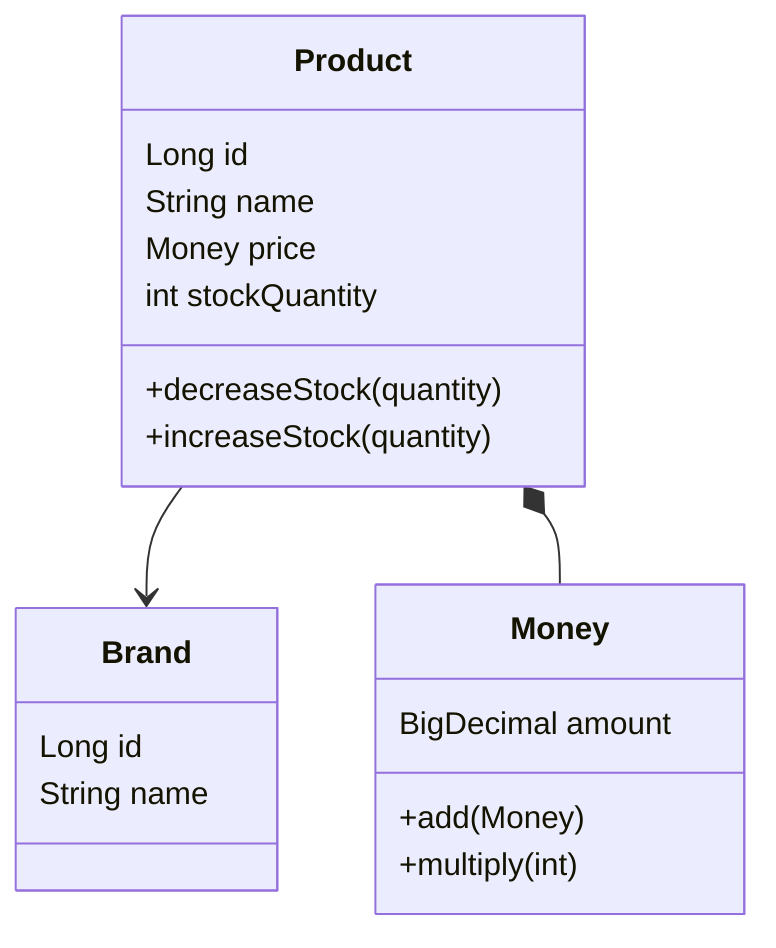

클래스 다이어그램을 Mermaid 문법으로 작성한다.

대상 도메인: $ARGUMENTS

## 절차

1. 대상 도메인의 요구사항과 기존 코드를 분석한다
2. 다이어그램을 그리기 전에 설명한다:
    - 이 다이어그램으로 **어떤 설계 결정**을 검증하려는지
    - Entity와 Value Object의 구분 기준
3. 클래스 다이어그램을 Mermaid 문법으로 작성한다:
    - Entity: id가 있고, 생명주기를 가짐
    - Value Object: 값으로 비교, 자가 검증
    - 연관 관계: 단방향 기본, 양방향 최소화
    - 비즈니스 메서드 포함
4. 다이어그램 해석을 제공한다:
    - 책임 분배 관점에서 봐야 할 포인트
    - 의존 방향 확인
5. `docs/week2/03-class-diagram.md`에 추가한다
6. 잠재 리스크 언급:
    - 한 객체에 책임이 몰리지 않았는가?
    - 도메인 간 결합도는 적절한가?

## Mermaid 형식 예시

## 규칙

- VO는 `*--` (composition), Entity 간은 `-->` (association) 사용
- 비즈니스 메서드를 반드시 포함 (getter/setter 제외)
- 한 다이어그램에 너무 많은 클래스 넣지 않기 — 도메인별로 분리
- 기존 프로젝트 패턴 유지 (BaseEntity, protected set 등)
