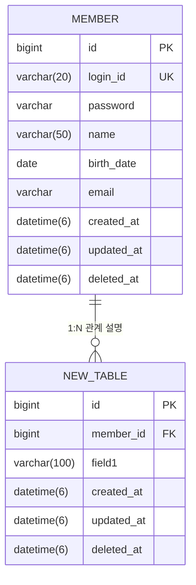

# /erd - ERD 문서 생성

## Triggers
- 요구사항 문서 작성 후 데이터베이스 설계가 필요한 경우
- `/erd {기능명}` 형태로 직접 호출

## Usage
```
/erd {기능명(한글)}
```

**출력 경로**: `docs/{기능명}/04-erd.md`
**전제조건**: `docs/{기능명}/01-requirements.md`가 먼저 존재해야 합니다.

## Behavioral Flow

### 1단계: 요구사항 문서 및 도메인 컨텍스트 확인
- `docs/{기능명}/01-requirements.md` 파일이 존재하는지 확인합니다.
- 파일이 없으면 `/requirements {기능명}` 스킬을 먼저 실행하도록 안내하고 중단합니다.
- 요구사항 문서에서 도메인 모델과 필드 정보를 파악합니다.
- 관련 도메인의 API 스펙 참고 문서를 확인하여 비즈니스 규칙(연쇄 삭제, 참조 무결성 등)을 파악합니다.

**기능명 → API 스펙 참고 문서 매핑:**
| 기능명 | 참고 문서 경로 |
|--------|--------------|
| 유저 | `docs/유저/유저-API-스펙.md` |
| 브랜드-상품 | `docs/브랜드-상품/브랜드-상품-API-스펙.md` |
| 브랜드-상품-Admin | `docs/브랜드-상품/브랜드-상품-Admin-API-스펙.md` |
| 좋아요 | `docs/좋아요/좋아요-API-스펙.md` |
| 주문 | `docs/주문/주문-API-스펙.md` |
| 주문-Admin | `docs/주문-Admin/주문-Admin-API-스펙.md` |

**데이터 정합성 원칙:**
- FK 제약 조건을 통해 참조 무결성을 보장합니다 (예: 상품의 brand_id는 실제 존재하는 브랜드여야 함).
- 연쇄 삭제(CASCADE) 또는 소프트 삭제 정책을 비즈니스 규칙에 맞게 결정합니다 (예: 브랜드 삭제 시 상품도 삭제).
- UNIQUE 제약 조건으로 데이터 중복을 방지합니다 (예: 동일 유저가 동일 상품에 좋아요 중복 불가).
- 스냅샷 데이터(주문 시 상품 정보)와 참조 데이터의 구분을 명확히 합니다.

### 2단계: 기존 Entity 분석
실제 소스 코드를 읽어 기존 테이블 구조를 파악합니다:
- `modules/jpa/src/main/kotlin/com/loopers/domain/BaseEntity.kt`: 공통 컬럼 (id, created_at, updated_at, deleted_at)
- `apps/commerce-api/src/main/kotlin/com/loopers/domain/member/MemberModel.kt`: 기존 member 테이블 구조
- `apps/commerce-api/src/main/kotlin/com/loopers/domain/` 하위의 모든 Entity 클래스

### 3단계: Mermaid ERD 및 테이블 명세 작성

**1) Mermaid erDiagram:**
기존 테이블과 새 테이블을 모두 포함한 전체 ERD를 작성합니다:



**2) 테이블별 상세 명세:**
각 테이블을 마크다운 표로 상세히 기술합니다:

```markdown
### 테이블명: `{table_name}`

| 컬럼명 | 타입 | Nullable | 제약조건 | 설명 |
|--------|------|----------|---------|------|
| id | BIGINT | NOT NULL | PK, AUTO_INCREMENT | 기본 키 |
| member_id | BIGINT | NOT NULL | FK → member.id | 회원 ID |
| field1 | VARCHAR(100) | NOT NULL | | 필드 설명 |
| created_at | DATETIME(6) | NOT NULL | | 생성 시점 |
| updated_at | DATETIME(6) | NOT NULL | | 수정 시점 |
| deleted_at | DATETIME(6) | NULL | | 소프트 삭제 시점 |
```

**3) 테이블간 관계:**
```markdown
### 관계 설명

| 관계 | 설명 |
|------|------|
| member → new_table | 1:N - 한 회원이 여러 항목을 가질 수 있음 |
```

**4) 인덱스 설계:**
```markdown
### 인덱스

| 테이블 | 인덱스명 | 컬럼 | 타입 | 용도 |
|--------|---------|------|------|------|
| new_table | idx_new_table_member_id | member_id | INDEX | 회원별 조회 성능 향상 |
```

### 4단계: 품질 체크리스트 자가 검증
문서 완성 후 다음 체크리스트를 스스로 검증하고, 검증 결과를 문서 하단에 포함합니다:

```markdown
## 품질 체크리스트
- [ ] FK 제약 조건으로 참조 무결성이 보장되는가? (존재하지 않는 브랜드/상품/유저 참조 방지)
- [ ] 연쇄 삭제 또는 소프트 삭제 정책이 비즈니스 규칙과 일치하는가? (예: 브랜드 삭제 시 상품 처리)
- [ ] UNIQUE 제약 조건으로 데이터 중복이 방지되는가? (예: 유저+상품 좋아요 중복 방지)
- [ ] 스냅샷 데이터와 참조 데이터가 구분되어 있는가? (예: 주문 시 상품 정보 스냅샷)
- [ ] 조회 성능을 위한 인덱스가 적절히 설계되어 있는가?
- [ ] 관련 도메인(유저, 브랜드, 상품, 좋아요, 주문) 테이블 간 관계가 모두 표현되어 있는가?
```

### 5단계: 검토 요청
생성된 ERD 문서를 사용자에게 보여주고 피드백을 요청합니다.

## Tool Coordination
- **Read**: 요구사항 문서(`01-requirements.md`), BaseEntity.kt, 기존 Entity 클래스 분석
- **Grep**: JPA 어노테이션(@Column, @Table, @JoinColumn 등) 검색
- **Glob**: Entity 클래스 파일 탐색
- **Write**: ERD 문서 파일 생성

## Key Patterns

### Kotlin 타입 → MySQL 컬럼 타입 매핑
| Kotlin 타입 | MySQL 타입 | 비고 |
|-------------|-----------|------|
| `Long` | `BIGINT` | PK, FK |
| `String` | `VARCHAR({length})` | @Column의 length 속성 참조 |
| `Int` | `INT` | |
| `Boolean` | `TINYINT(1)` | |
| `LocalDate` | `DATE` | 날짜만 |
| `ZonedDateTime` | `DATETIME(6)` | 마이크로초 정밀도 |
| `BigDecimal` | `DECIMAL({precision},{scale})` | 금액 등 |
| `Enum` | `VARCHAR` | @Enumerated(STRING) |

### BaseEntity 공통 컬럼
모든 테이블은 BaseEntity를 상속하여 다음 공통 컬럼을 포함합니다:

| 컬럼명 | 타입 | Nullable | 설명 |
|--------|------|----------|------|
| `id` | BIGINT | NOT NULL | PK, AUTO_INCREMENT |
| `created_at` | DATETIME(6) | NOT NULL | 생성 시점 (PrePersist에서 자동 설정) |
| `updated_at` | DATETIME(6) | NOT NULL | 수정 시점 (PreUpdate에서 자동 설정) |
| `deleted_at` | DATETIME(6) | NULL | 소프트 삭제 시점 |

### 기존 테이블 구조 (member)
| 컬럼명 | 타입 | Nullable | 제약조건 |
|--------|------|----------|---------|
| `id` | BIGINT | NOT NULL | PK, AUTO_INCREMENT |
| `login_id` | VARCHAR(20) | NOT NULL | UNIQUE |
| `password` | VARCHAR(255) | NOT NULL | BCrypt 해시 |
| `name` | VARCHAR(50) | NOT NULL | |
| `birth_date` | DATE | NOT NULL | |
| `email` | VARCHAR(255) | NOT NULL | |
| `created_at` | DATETIME(6) | NOT NULL | |
| `updated_at` | DATETIME(6) | NOT NULL | |
| `deleted_at` | DATETIME(6) | NULL | |

### 문서 구조
```markdown
# {기능명} ERD

## 개요
{이 문서가 다루는 테이블 구조 설명}

---

## 1. 전체 ERD
{Mermaid erDiagram}

---

## 2. 테이블 상세 명세
### 2.1 기존 테이블
(관련 있는 기존 테이블만 포함)

### 2.2 신규 테이블

---

## 3. 테이블간 관계

---

## 4. 인덱스 설계
```

## Examples

### ERD 생성
```
/erd 상품 관리
# → docs/상품-관리/04-erd.md 생성
# product 테이블과 기존 member 테이블과의 관계를 포함한 ERD를 작성합니다.
```

### 새 도메인 테이블 추가
```
/erd 주문 생성
# → docs/주문-생성/04-erd.md 생성
# order, order_item 테이블과 member, product 테이블과의 관계를 포함한 ERD를 작성합니다.
```

## Boundaries

**수행하는 작업:**
- 요구사항 문서를 기반으로 Mermaid ERD와 테이블 상세 명세 생성
- 기존 Entity 클래스를 분석하여 실제 테이블 구조 반영
- BaseEntity 공통 컬럼, Kotlin 타입 매핑, 인덱스 설계 포함

**수행하지 않는 작업:**
- 요구사항 문서 없이 ERD 생성 (전제조건 미충족 시 안내 후 중단)
- 코드 구현이나 DDL 스크립트 생성 (ERD 문서만 생성)
- 기존 문서를 사용자 확인 없이 덮어쓰기
