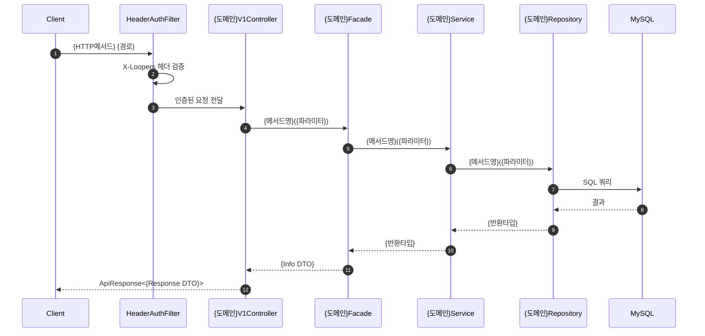
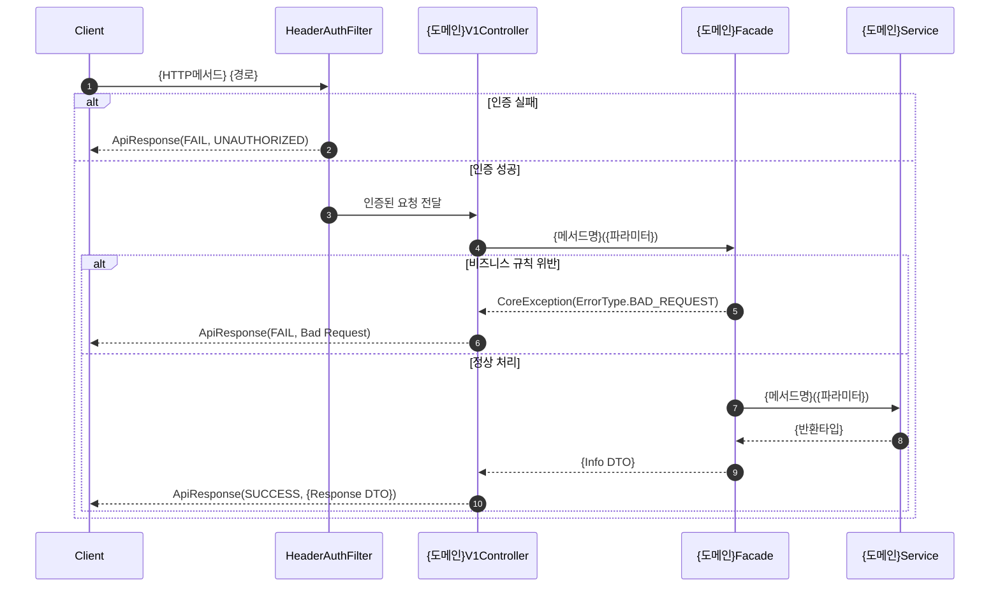

# /sequence-diagrams - 시퀀스 다이어그램 문서 생성

## Triggers
- 요구사항 문서 작성 후 시퀀스 다이어그램이 필요한 경우
- `/sequence-diagrams {기능명}` 형태로 직접 호출

## Usage
```
/sequence-diagrams {기능명(한글)}
```

**출력 경로**: `docs/{기능명}/02-sequence-diagrams.md`
**전제조건**: `docs/{기능명}/01-requirements.md`가 먼저 존재해야 합니다.

## Behavioral Flow

### 1단계: 요구사항 문서 및 도메인 컨텍스트 확인
- `docs/{기능명}/01-requirements.md` 파일이 존재하는지 확인합니다.
- 파일이 없으면 `/requirements {기능명}` 스킬을 먼저 실행하도록 안내하고 중단합니다.
- 요구사항 문서에서 API 엔드포인트, 처리 흐름, 에러 시나리오를 파악합니다.
- `docs/공통/API-제안-사항.md`를 읽어 인증 방식(헤더 기반)을 확인합니다.
- 관련 도메인의 API 스펙 참고 문서를 확인하여 도메인 간 의존 관계를 파악합니다.

**기능명 → API 스펙 참고 문서 매핑:**
| 기능명 | 참고 문서 경로 |
|--------|--------------|
| 유저 | `docs/유저/유저-API-스펙.md` |
| 브랜드-상품 | `docs/브랜드-상품/브랜드-상품-API-스펙.md` |
| 브랜드-상품-Admin | `docs/브랜드-상품/브랜드-상품-Admin-API-스펙.md` |
| 좋아요 | `docs/좋아요/좋아요-API-스펙.md` |
| 주문 | `docs/주문/주문-API-스펙.md` |
| 주문-Admin | `docs/주문-Admin/주문-Admin-API-스펙.md` |

### 2단계: 기존 코드베이스 분석
실제 소스 코드를 읽어 다이어그램에 사용할 클래스명과 메서드명을 파악합니다:
- `apps/commerce-api/src/main/kotlin/com/loopers/interfaces/api/`: Controller, ApiSpec 패턴
- `apps/commerce-api/src/main/kotlin/com/loopers/application/`: Facade 패턴
- `apps/commerce-api/src/main/kotlin/com/loopers/domain/`: Service, Repository, Model 패턴
- `apps/commerce-api/src/main/kotlin/com/loopers/infrastructure/`: RepositoryImpl, JpaRepository, Filter 패턴

### 3단계: Mermaid 시퀀스 다이어그램 작성
각 API 엔드포인트별로 최소 2개의 다이어그램을 작성합니다:

**책임 객체(Responsibility Object) 원칙:**
- 각 participant는 해당 레이어에서 어떤 책임을 맡는지 명확히 드러나야 합니다.
- 단순히 데이터를 전달하는 것이 아니라, 각 객체가 수행하는 핵심 로직(검증, 변환, 조회, 저장 등)을 메서드명으로 표현합니다.
- 여러 도메인이 관련된 경우(예: 주문 시 상품 재고 확인), 각 도메인의 Service를 별도 participant로 분리하여 책임 경계를 명확히 합니다.

**1) 성공 흐름 다이어그램:**


**2) 에러/예외 흐름 다이어그램:**


### 4단계: 품질 체크리스트 자가 검증
문서 완성 후 다음 체크리스트를 스스로 검증하고, 검증 결과를 문서 하단에 포함합니다:

```markdown
## 품질 체크리스트
- [ ] 각 participant의 책임(검증, 변환, 조회, 저장 등)이 메서드명으로 명확히 드러나는가?
- [ ] 여러 도메인이 관련된 경우, 각 도메인의 Service가 별도 participant로 분리되어 있는가?
- [ ] 인증 방식(헤더 기반)이 다이어그램에 정확히 반영되어 있는가?
- [ ] 성공 흐름과 에러 흐름이 모두 포함되어 있는가?
- [ ] 에러 시나리오 테이블에 발생 시점과 책임 객체가 명시되어 있는가?
```

### 5단계: 검토 요청
생성된 다이어그램 문서를 사용자에게 보여주고 피드백을 요청합니다.

## Tool Coordination
- **Read**: 요구사항 문서(`01-requirements.md`) 및 기존 소스 코드 분석
- **Grep**: 클래스명, 메서드명, 에러 처리 패턴 검색
- **Glob**: 관련 소스 파일 탐색
- **Write**: 시퀀스 다이어그램 문서 파일 생성

## Key Patterns

### Mermaid 작성 규칙
1. **`autonumber`**: 모든 다이어그램에 단계 번호 자동 부여
2. **participant 별칭**: 실제 클래스명을 사용 (예: `participant Controller as ProductV1Controller`)
3. **메서드 시그니처**: 메서드명과 주요 파라미터 명시 (예: `Controller->>Facade: changePassword(memberId, currentPassword, newPassword)`)
4. **예외 표현**: `CoreException(ErrorType.XXX)` 형식으로 예외를 표기
5. **분기 표현**: `alt`/`else` 블록으로 성공/실패 분기를 명확히 표현
6. **인증 필터**: 인증이 필요한 대고객 API는 `HeaderAuthFilter`를, 어드민 API는 `LdapAuthFilter`를 participant에 포함
7. **책임 객체 분리**: 여러 도메인에 걸치는 기능(예: 주문 시 ProductService로 재고 확인)은 관련 Service를 별도 participant로 추가하여 책임 경계를 표현

### 레이어간 호출 순서
```
Client → HeaderAuthFilter/LdapAuthFilter → Controller → Facade → Service → Repository → DB
```

### 문서 구조
```markdown
# {기능명} 시퀀스 다이어그램

## 개요
{이 문서가 다루는 API 엔드포인트 목록}

---

## 1. {API명} - 성공 흐름
{Mermaid 시퀀스 다이어그램}

### 흐름 설명
{각 단계에 대한 텍스트 설명}

---

## 2. {API명} - 에러 흐름
{Mermaid 시퀀스 다이어그램}

### 에러 시나리오
| 조건 | 발생 시점 | 에러 타입 | HTTP 상태 |
|------|----------|----------|----------|
```

## Examples

### 시퀀스 다이어그램 생성
```
/sequence-diagrams 상품 관리
# → docs/상품-관리/02-sequence-diagrams.md 생성
# 요구사항 문서의 각 API 엔드포인트별로 성공/에러 시퀀스 다이어그램을 작성합니다.
```

### 단일 API 기능
```
/sequence-diagrams 주문 생성
# → docs/주문-생성/02-sequence-diagrams.md 생성
# 주문 생성 API의 성공 흐름과 각종 에러 케이스 흐름을 다이어그램으로 표현합니다.
```

## Boundaries

**수행하는 작업:**
- 요구사항 문서를 기반으로 Mermaid 시퀀스 다이어그램 생성
- 실제 코드베이스의 클래스명과 메서드명을 반영
- API별 성공 흐름과 에러 흐름을 모두 포함

**수행하지 않는 작업:**
- 요구사항 문서 없이 다이어그램 생성 (전제조건 미충족 시 안내 후 중단)
- 코드 구현 (다이어그램 문서만 생성)
- 기존 문서를 사용자 확인 없이 덮어쓰기
