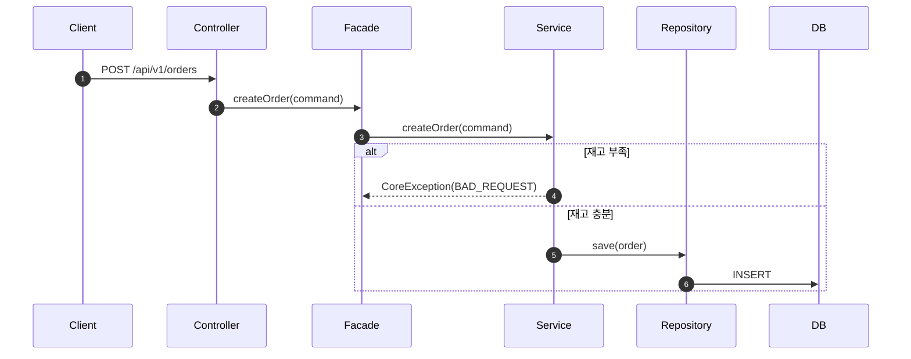

시퀀스 다이어그램을 Mermaid 문법으로 작성한다.

대상 기능: $ARGUMENTS

## 절차

1. 대상 기능의 요구사항을 확인한다
    - `docs/week2/01-requirements.md`가 있으면 참고
    - `$ARGUMENTS`가 없으면 작성이 필요한 기능을 제안
2. 다이어그램을 그리기 전에 설명한다:
    - **왜** 이 다이어그램이 필요한지
    - **무엇을** 검증하려는지
3. 시퀀스 다이어그램을 Mermaid 문법으로 작성한다:
    - 액터와 참여자를 레이어드 아키텍처에 맞게 배치
    - `Client → Controller → Facade → Service → Repository → DB`
    - `alt/else`로 조건 분기 표현
    - `note`로 트랜잭션 경계 표시
4. 다이어그램 해석을 2~3줄로 제공한다:
    - 특히 봐야 할 포인트
    - 설계 의도
5. `docs/week2/02-sequence-diagrams.md`에 추가한다
6. 개발자에게 리뷰 요청

## Mermaid 형식 예시

## 규칙

- 하나의 기능당 하나의 시퀀스 다이어그램
- 너무 많은 세부사항 넣지 않기 — 핵심 흐름에 집중
- 도메인 객체 간 메시지가 드러나야 함 (Service만 호출하는 다이어그램은 부족)
- 정상 흐름(Main Flow)과 예외 흐름(Exception Flow)을 모두 포함
