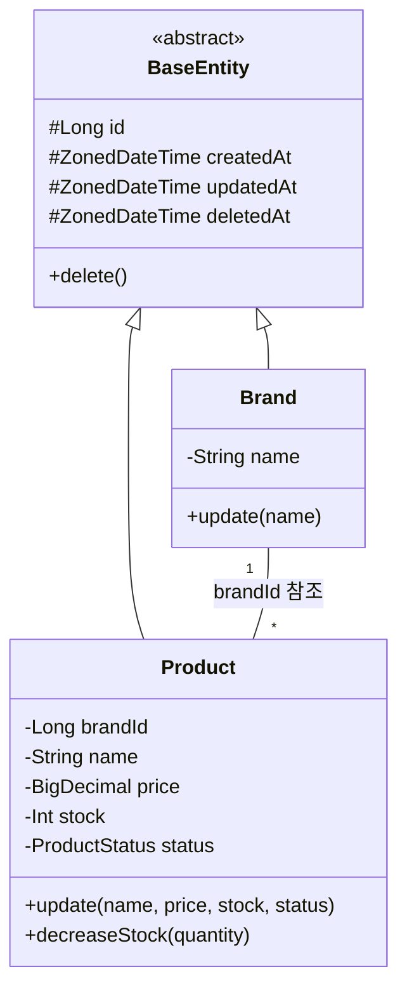
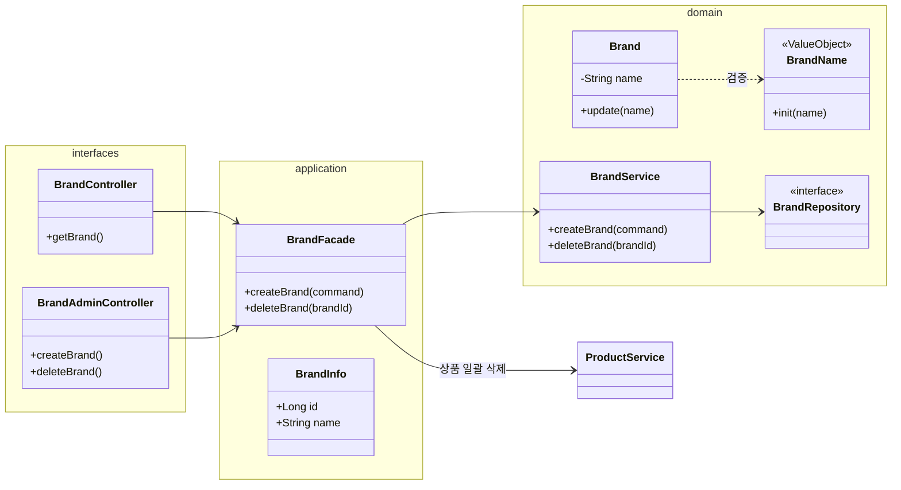
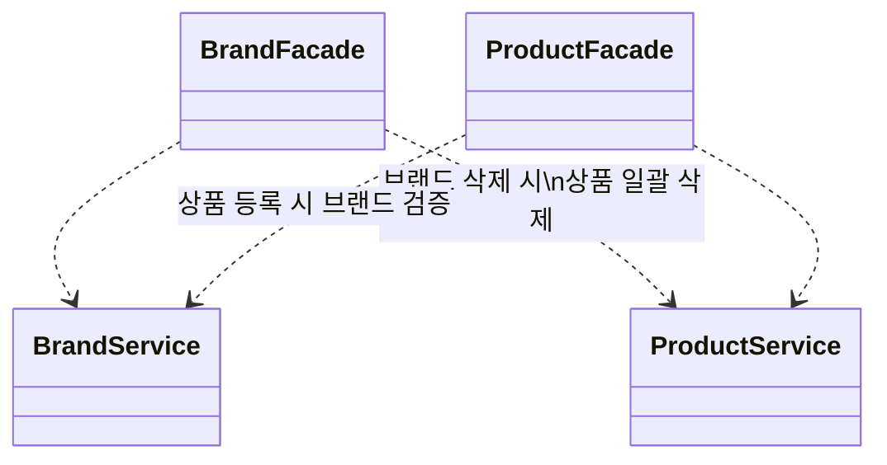

대상 도메인: $ARGUMENTS

## 검증 목적

이 다이어그램으로 다음을 검증한다:

- **도메인 책임**: 각 Entity/VO가 적절한 비즈니스 로직을 캡슐화하고 있는가
- **의존 방향**: 레이어 간 의존이 단방향(interfaces → application → domain)을 따르는가
- **응집도**: 한 객체에 책임이 과도하게 몰리지 않았는가, 도메인 간 결합도는 적절한가

## 절차

1. 대상 도메인의 요구사항과 기존 코드를 분석한다
    - `docs/design/01-requirements.md`가 있으면 참고
    - `$ARGUMENTS`가 없으면 작성이 필요한 도메인을 제안
2. 다이어그램을 그리기 전에 설명한다:
    - **왜** 이 다이어그램이 필요한지
    - **무엇을** 검증하려는지 (위 검증 목적 참고)
    - Entity와 Value Object의 구분 기준
3. 문서 구조에 따라 클래스 다이어그램을 작성한다 (아래 산출물 구조 참고)
4. 각 도메인 다이어그램 아래에 **"핵심 포인트"** 섹션으로 설계 결정 사유와 Trade-off를 제공한다
5. **정합성 확인**:
    - 시퀀스 다이어그램(`02-sequence-diagrams.md`)의 참여자가 클래스에 존재하는지 확인
    - 클래스 간 관계가 ERD(`04-erd.md`)에 반영되었는지 확인
6. `docs/design/03-class-diagram.md`에 저장한다
7. 개발자에게 리뷰 요청

## 산출물 구조 (Template)

```markdown
# 클래스 다이어그램

도메인 객체의 책임, 의존 방향, Entity/VO 구분을 Mermaid 클래스 다이어그램으로 정리한다.
**단순 Getter/Setter와 모든 필드 나열은 생략**하고, 핵심 비즈니스 로직과 아키텍처 구조 위주로 기술한다.

---

## 1. 도메인 모델 전체 관계도 (Entity Relationship)

(direction TB, BaseEntity 상속, Entity 간 관계, enum, Composition 표현)

---

## 2~N. [도메인명] 도메인

(도메인별 direction LR, namespace로 레이어 그룹핑)

### 핵심 포인트

- (설계 결정 사유, Trade-off, 특히 봐야 할 포인트)

---

## N+1. Facade 레이어의 의존 관계 (Architecture View)

(Service 간 직접 참조 없음 시각화, Facade가 컨트롤 타워)

---

## N+2. 인증 레이어 구조

(인증 관련 컴포넌트가 있는 경우)

---

## N+3. Value Object 정리

| VO | 소속 도메인 | 검증 규칙 | 사용 시점 |
|----|----------|---------|---------|

> VO는 Entity 필드로 저장되지 않는다. Entity 필드는 기본 타입을 유지하되, 생성/변경 시점에 VO를 통해 검증한다.

---

## N+4. 설계 원칙 및 결정 사유 (Design Principles)

1. **[결정 제목]**
    - **결정**: ...
    - **이유**: ... (Trade-off 포함)
```

## 문서 구조 가이드

산출물은 다음 순서로 구성한다:

1. **전체 관계도** (`direction TB`): 시스템 전체의 Entity 간 관계, BaseEntity 상속, enum, Composition을 조감도로 제시
2. **도메인별 상세** (`direction LR`): `namespace`로 interfaces/application/domain 레이어를 그룹핑. Controller, Facade, Service,
   Repository, Entity, VO를 모두 포함
3. **Facade 의존 관계도** (Architecture View): Service 간 직접 참조 없이 Facade가 조율함을 시각화
4. **인증 레이어 구조**: 인증 관련 컴포넌트가 있는 경우
5. **VO 정리 테이블**: VO명, 소속 도메인, 검증 규칙, 사용 시점을 한눈에 정리
6. **설계 원칙**: 결정 + 이유(Trade-off) 형식으로 아키텍처 결정 사유를 기록

## Mermaid 형식 예시

### 전체 관계도



### 도메인별 상세 (namespace 레이어 그룹핑)



### Facade 의존 관계도 (Architecture View)



## 관계 표기법

| 표기           | 의미               | 사용 대상                                      |
|--------------|------------------|--------------------------------------------|
| `<\|--`      | 상속 (inheritance) | BaseEntity ← Entity                        |
| `-->`        | 연관 (association) | Entity 간 참조                                |
| `*--`        | 합성 (composition) | 생명주기를 같이하는 Entity (예: Order *-- OrderItem) |
| `..>`        | 의존 (dependency)  | VO 검증, Facade→Service 참조                   |
| `"1" -- "*"` | 다중성 표기           | 전체 관계도에서 관계 명시                             |

## 규칙

- **Getter/Setter 생략**: 비즈니스 메서드만 포함한다
- 한 다이어그램에 너무 많은 클래스 넣지 않기 — 도메인별로 분리
- 기존 프로젝트 패턴 유지 (BaseEntity, protected set 등)
- Entity: id가 있고, 생명주기를 가짐
- Value Object: 값으로 비교, 자가 검증. `<<ValueObject>>` 스테레오타입 사용
- 연관 관계: 단방향 기본, 양방향 최소화
- `namespace`로 interfaces/application/domain 레이어를 시각적으로 그룹핑한다
- 도메인별 다이어그램 아래에 **"핵심 포인트"** 섹션으로 설계 결정 사유와 Trade-off를 함께 기술한다
- 과도한 상세는 문서의 수명을 단축시킨다 — 적절한 추상화가 핵심
