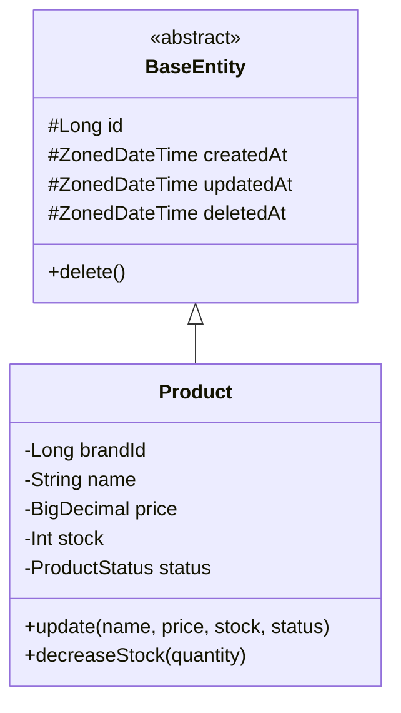

# phase-class: 클래스 다이어그램 작성

도메인 객체를 Mermaid 클래스 다이어그램으로 작성한다.
완료 후 `docs/design/03-class-diagram.md`에 저장한다.

---

## 사전 준비

다음 파일을 순서대로 확인하고 있으면 Read하여 참고한다:
1. `docs/design/01-requirements.md` — 도메인 규칙, 액터, 유비쿼터스 언어
2. `docs/design/02-sequence-diagrams.md` — 시퀀스 참여자 (정합성 확인용)

---

## 검증 목적

이 다이어그램으로 다음을 검증한다:
- **도메인 책임**: 각 Entity/VO가 적절한 비즈니스 로직을 캡슐화하고 있는가
- **의존 방향**: 레이어 간 의존이 단방향(interfaces → application → domain)을 따르는가
- **응집도**: 한 객체에 책임이 과도하게 몰리지 않았는가

---

## Step 1: 작성 전 설명

다이어그램을 그리기 전에 설명한다:
- 왜 이 다이어그램이 필요한지
- 무엇을 검증하려는지 (위 검증 목적)
- Entity와 Value Object의 구분 기준:
  - **Entity**: id가 있고, 생명주기를 가짐
  - **Value Object**: 값으로 비교, 자가 검증. `<<ValueObject>>` 스테레오타입 사용

---

## Step 2: 다이어그램 작성

### 문서 구조 순서

1. **전체 관계도** (`direction TB`): 시스템 전체 Entity 간 관계, BaseEntity 상속, enum, Composition 조감도
2. **도메인별 상세** (`direction LR`): `namespace`로 interfaces/application/domain 레이어 그룹핑
3. **Facade 의존 관계도**: Service 간 직접 참조 없이 Facade가 조율함을 시각화
4. **인증 레이어 구조**: 인증 관련 컴포넌트가 있는 경우
5. **VO 정리 테이블**: VO명, 소속 도메인, 검증 규칙, 사용 시점
6. **설계 원칙**: 결정 + 이유(Trade-off)

### 관계 표기법

| 표기 | 의미 | 사용 대상 |
|------|------|---------|
| `<\|--` | 상속 (inheritance) | BaseEntity ← Entity |
| `-->` | 연관 (association) | Entity 간 참조 |
| `*--` | 합성 (composition) | 생명주기를 같이하는 Entity |
| `..>` | 의존 (dependency) | VO 검증, Facade→Service 참조 |
| `"1" -- "*"` | 다중성 표기 | 전체 관계도에서 관계 명시 |

### 작성 규칙

- **Getter/Setter 생략**: 비즈니스 메서드만 포함
- 한 다이어그램에 너무 많은 클래스 넣지 않기 — 도메인별로 분리
- `namespace`로 interfaces/application/domain 레이어를 시각적으로 그룹핑
- 연관 관계: 단방향 기본, 양방향 최소화
- 과도한 상세는 문서의 수명을 단축시킨다 — 적절한 추상화가 핵심

### Mermaid 형식 예시



---

## Step 3: 핵심 포인트 작성

각 도메인 다이어그램 아래에 **"핵심 포인트"** 섹션을 작성한다:
- 설계 결정 사유
- Trade-off
- 특히 봐야 할 포인트

---

## Step 4: 정합성 확인

- `docs/design/02-sequence-diagrams.md`의 참여자(Service, Repository 등)가 클래스에 존재하는지 확인
- `docs/design/04-erd.md`가 있으면 클래스 간 관계가 ERD에 반영되었는지 확인
- 불일치가 있으면 사용자에게 보고한다

---

## Step 5: 산출물 작성 및 저장

다음 구조로 `docs/design/03-class-diagram.md`에 저장한다:

```markdown
# 클래스 다이어그램

도메인 객체의 책임, 의존 방향, Entity/VO 구분을 Mermaid 클래스 다이어그램으로 정리한다.
**단순 Getter/Setter와 모든 필드 나열은 생략**하고, 핵심 비즈니스 로직과 아키텍처 구조 위주로 기술한다.

---

## 1. 도메인 모델 전체 관계도 (Entity Relationship)

(direction TB, BaseEntity 상속, Entity 간 관계, enum, Composition)

---

## 2~N. [도메인명] 도메인

(direction LR, namespace로 레이어 그룹핑)

### 핵심 포인트
- (설계 결정 사유, Trade-off)

---

## N+1. Facade 레이어의 의존 관계 (Architecture View)

---

## N+2. 인증 레이어 구조 (있는 경우)

---

## N+3. Value Object 정리

| VO | 소속 도메인 | 검증 규칙 | 사용 시점 |
|----|----------|---------|---------|

> VO는 Entity 필드로 저장되지 않는다. Entity 필드는 기본 타입을 유지하되, 생성/변경 시점에 VO를 통해 검증한다.

---

## N+4. 설계 원칙 및 결정 사유 (Design Principles)

1. **[결정 제목]**
    - **결정**: ...
    - **이유**: ... (Trade-off 포함)
```

---

## Phase 완료 보고

저장 후 다음 형식으로 보고한다:

```
## class 완료

**산출물**: docs/design/03-class-diagram.md
**핵심 내용**:
- 식별된 Entity: {N}개
- 식별된 VO: {N}개
- 레이어 의존 방향: {정상/이슈 있음}

다음 Phase: erd — ERD를 작성할까요?
```

다음 Phase 진행 전 state.md를 갱신한다:
```yaml
current-phase: erd
phases:
  class: completed
```
