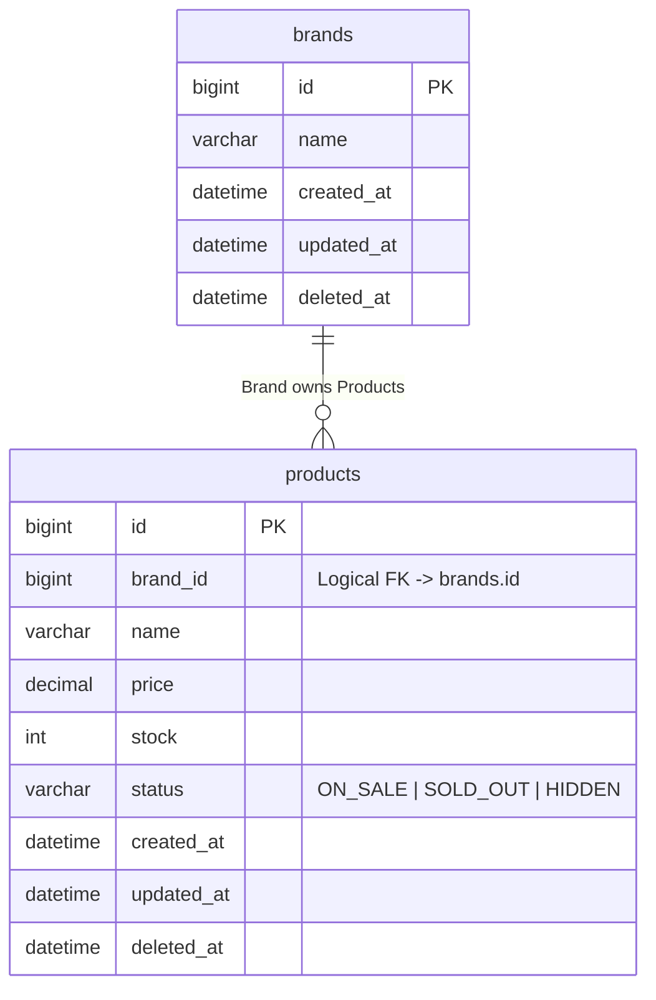

# phase-erd: ERD 작성

영속성 구조를 Mermaid ERD로 작성한다.
완료 후 `docs/design/04-erd.md`에 저장한다.

---

## 사전 준비

다음 파일을 순서대로 확인하고 있으면 Read하여 참고한다:
1. `docs/design/03-class-diagram.md` — Entity/VO 관계 (정합성 확인 기준)
2. `docs/design/01-requirements.md` — 도메인 규칙, 데이터 요구사항

---

## 검증 목적

이 다이어그램으로 다음을 검증한다:
- **영속성 구조**: 도메인 모델이 DB 스키마로 올바르게 매핑되었는가
- **관계의 주인**: FK를 누가 가지며, 1:N/N:M 관계가 적절히 표현되었는가
- **정규화 여부**: 반정규화 필드의 사유와 정합성 유지 방법이 명확한가

**핵심 원칙: ERD는 생략 없이 상세하게 작성한다.** 시퀀스/클래스 다이어그램과 달리, ERD는 실제 DB 스키마와 1:1 대응해야 하므로 모든 컬럼, 제약조건, 주석을 포함한다.

---

## Step 1: 작성 전 설명

다이어그램을 그리기 전에 설명한다:
- 왜 이 다이어그램이 필요한지
- 무엇을 검증하려는지 (위 검증 목적)
- 클래스 다이어그램과의 차이점:
  - VO → 테이블로 분리하지 않고 Entity의 컬럼으로 표현
  - 관계 → FK로 표현 (논리적 FK vs 물리적 FK 결정 필요)

---

## Step 2: 설계 원칙 결정

ERD 작성 전에 다음 설계 원칙을 결정하고 문서에 기록한다:

1. **물리적 FK vs 논리적 FK**: 물리 FK 없이 애플리케이션에서 관리할 것인가
2. **스냅샷 정책**: 주문-상품처럼 원본 변경과 무관하게 시점 데이터를 보존할 컬럼이 있는가
3. **반정규화**: 조회 성능을 위해 집계 필드를 비정규화할 것인가 (예: like_count)

---

## Step 3: ERD 작성

### 컬럼 주석 규칙

| 주석 | 의미 | 예시 |
|------|------|------|
| `"Logical FK -> table.col"` | 물리 FK 없이 앱에서 관리 | `bigint brand_id "Logical FK -> brands.id"` |
| `"Snapshot"` | 시점 데이터 보존 | `varchar product_name "Snapshot"` |
| `"Denormalized (설명)"` | 반정규화 집계 필드 | `int like_count "Denormalized (Count Cache)"` |
| `"ON_SALE \| SOLD_OUT \| ..."` | Enum 값 나열 | `varchar status "ON_SALE \| SOLD_OUT \| HIDDEN"` |
| `"Trace Only (설명)"` | 참조 무결성 없이 추적 목적 | `bigint product_id "Trace Only (No FK constraint)"` |

### 관계 표현

| 표기 | 의미 |
|------|------|
| `\|\|--o{` | 1:N |
| `\|\|--\|{` | 1:N 필수 |
| `}o--o{` | N:M → 조인 테이블로 풀어서 표현 |

### 작성 규칙

- 테이블명은 복수형 (products, orders, users)
- soft delete: `deleted_at` nullable datetime
- enum은 VARCHAR로 저장 — 값 목록을 주석으로 명시
- N:M은 반드시 조인 테이블로 풀어서 표현
- VO는 테이블로 분리하지 않음 — Entity의 컬럼으로 표현
- 모든 컬럼에 타입과 제약조건(PK, FK, NOT NULL, UNIQUE) 명시
- BaseEntity 공통 컬럼 포함 (id, created_at, updated_at, deleted_at)

### Mermaid 형식 예시



---

## Step 4: 정합성 확인

`docs/design/03-class-diagram.md`의 Entity 관계가 ERD에 반영되었는지 확인한다:
- 클래스의 연관 관계 → ERD의 FK
- 클래스의 Composition → ERD의 필수 FK (`||--|{`)
- 클래스의 enum 필드 → ERD의 VARCHAR + 주석

불일치가 있으면 사용자에게 보고한다.

---

## Step 5: 산출물 작성 및 저장

다음 구조로 `docs/design/04-erd.md`에 저장한다:

```markdown
# ERD (Entity-Relationship Diagram)

영속성 구조를 정의한다. 도메인 엔티티와 VO가 실제 DB 스키마로 매핑되는 전략과 인덱스 계획을 포함한다.

---

## 1. 전체 ERD & 설계 원칙

### 1.1 설계 원칙 (Key Design Decisions)

1. **논리적 FK 사용 (No Physical FK)**
    * (사유와 영향)
2. **스냅샷 정책**
    * (사유와 영향)
3. **반정규화 (Denormalization)**
    * (사유와 영향)

### 1.2 Mermaid ERD

(erDiagram, 모든 컬럼 + 타입 + 주석 포함)

---

## 2. 스키마 상세 (Schema Details)

### 2.1 [도메인 그룹명]

| 테이블 | 컬럼 | 타입 | 제약조건 | 설명 |
|-------|------|------|---------|------|

---

## 3. 인덱스 전략 (Indexing Strategy)

| 대상 테이블 | 인덱스 컬럼 | 타입 | 목적 |
|-----------|----------|------|------|

---

## 4. 정규화 판단

### 반정규화 필드

| 테이블 | 컬럼 | 반정규화 사유 | 정합성 유지 방법 |
|-------|------|-----------|-------------|

### 정규화 유지
- (정규화를 유지하는 항목과 이유)

---

## 5. 데이터 무결성 및 리스크 관리

| 구분 | 잠재 리스크 | 대응 전략 |
|------|----------|---------|
```

---

## Phase 완료 보고

저장 후 다음 형식으로 보고한다:

```
## erd 완료

**산출물**: docs/design/04-erd.md
**핵심 내용**:
- 테이블: {N}개
- 인덱스 계획: {N}개
- 반정규화 필드: {N}개

다음 Phase: review — 전체 설계 문서를 리뷰할까요?
```

다음 Phase 진행 전 state.md를 갱신한다:
```yaml
current-phase: review
phases:
  erd: completed
```
