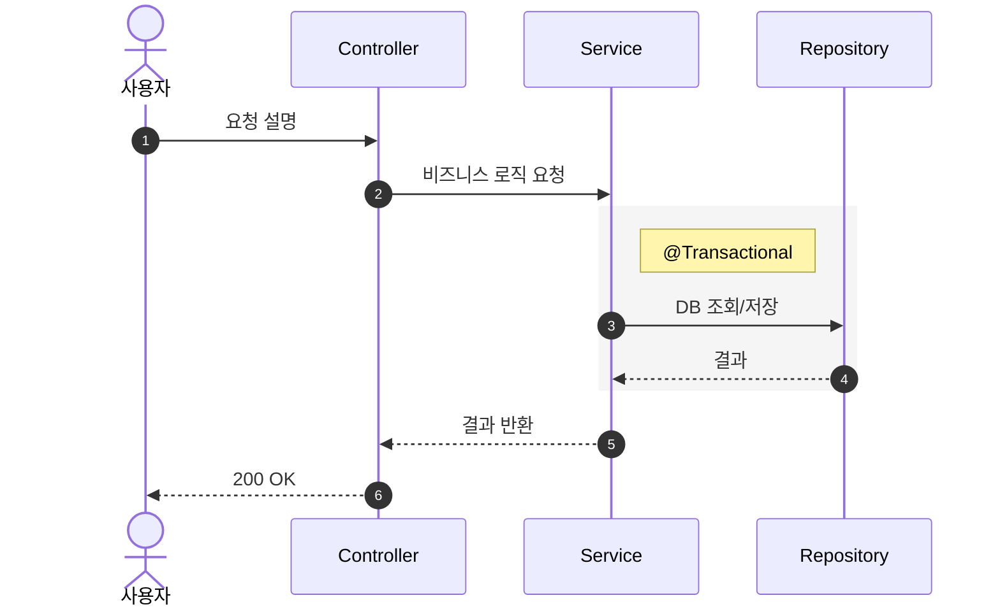

# phase-sequence: 시퀀스 다이어그램 작성

기능의 호출 흐름을 Mermaid 시퀀스 다이어그램으로 작성한다.
완료 후 `docs/design/02-sequence-diagrams.md`에 저장한다.

---

## 사전 준비

1. `docs/design/01-requirements.md`가 있으면 Read하여 참고한다.
2. 없으면 사용자에게 "요구사항 명세가 없습니다. 분석할 기능을 직접 설명해주세요."라고 안내한다.

---

## 검증 목적

이 다이어그램으로 다음을 검증한다:
- **책임 분리**: 각 레이어(Controller, Facade, Service, Repository)가 자신의 책임만 수행하는가
- **호출 순서**: 요청 흐름이 레이어드 아키텍처를 올바르게 따르는가
- **트랜잭션 경계**: 원자성이 필요한 범위가 명확히 설정되었는가

---

## Step 1: 작성 전 설명

다이어그램을 그리기 전에 사용자에게 설명한다:
- 왜 이 다이어그램이 필요한지
- 무엇을 검증하려는지 (위 검증 목적)
- 어떤 기능을 다이어그램으로 표현할 것인지 (기능 목록 제시)

---

## Step 2: 다이어그램 작성

### 참여자(Participant) 레벨 규칙

컴포넌트 레벨을 반드시 맞춘다. Controller, Service, Repository 사이에 특정 클래스명(VO, Util 등)을 섞으면 가독성이 깨진다.

- **단일 서비스 호출 (1:1)**: `Controller → Service → Repository` (Facade 생략)
- **다중 서비스 조율 (Cross-Domain)**: `Controller → Facade → Services → Repository`

| 레이어 | 역할 |
|--------|------|
| Controller | 요청 수신, 파라미터 매핑, 응답 변환 |
| Facade | 도메인 간 조율 (다중 서비스 호출 시에만) |
| Service | 핵심 비즈니스 로직 및 도메인 규칙 수행 |
| Repository | DB 접근 (JPA) |

### 작성 규칙

- 도메인별로 그룹핑하여 작성한다
- 각 기능의 **API 엔드포인트**와 **인증 요구사항**을 다이어그램 위에 명시
- **Happy Path(핵심 성공 흐름)에만 집중** — 예외 흐름은 요구사항 명세서에 위임
- 트랜잭션 경계는 `rect rgb(245, 245, 245)` 블록 + `Note`로 표시
- `opt`/`alt`는 멱등성 등 핵심 동작에만 간결하게 사용
- `autonumber`를 항상 사용
- `actor` 키워드로 사용자/어드민 표기

### Mermaid 형식 예시



---

## Step 3: 정합성 확인

`docs/design/03-class-diagram.md`가 있으면:
- 시퀀스의 참여자(Service, Repository 등)가 클래스 다이어그램에 존재하는지 확인한다.
- 불일치가 있으면 사용자에게 보고한다.

없으면 이 단계를 건너뛴다.

---

## Step 4: 산출물 작성 및 저장

다음 구조로 `docs/design/02-sequence-diagrams.md`에 저장한다:

```markdown
# 시퀀스 다이어그램

시스템의 주요 기능에 대한 **핵심 성공 흐름(Happy Path)** 을 기술한다.
상세한 예외 처리 규칙(400, 404 등)과 필드 검증 로직은 요구사항 명세서를 참고한다.

### 다이어그램 공통 규칙

- **참여자(Participant) 레벨 통일**: Controller / Facade / Service / Repository
- **Facade 사용 기준**: 2개 이상의 서비스를 조율할 때만 사용
- **트랜잭션 경계**: Service는 변경 작업에 @Transactional 필수
- **생략된 내용**: 인증 인터셉터 처리 과정, 상세 DTO 변환, 단순 유효성 검증 실패 흐름

---

## 1. [도메인명] — [API 유형]

### 1.1 [기능명]

**API:** `METHOD /path` — 인증 요구사항

(mermaid 시퀀스 다이어그램)

#### 참고
- (보충 설명, 특히 봐야 할 포인트)
```

---

## Phase 완료 보고

저장 후 다음 형식으로 보고한다:

```
## sequence 완료

**산출물**: docs/design/02-sequence-diagrams.md
**핵심 내용**:
- 작성된 다이어그램: {N}개
- Cross-Domain 흐름: {있음/없음}
- 트랜잭션 경계: {N}곳 표시

다음 Phase: class — 클래스 다이어그램을 작성할까요?
```

다음 Phase 진행 전 state.md를 갱신한다:
```yaml
current-phase: class
phases:
  sequence: completed
```
