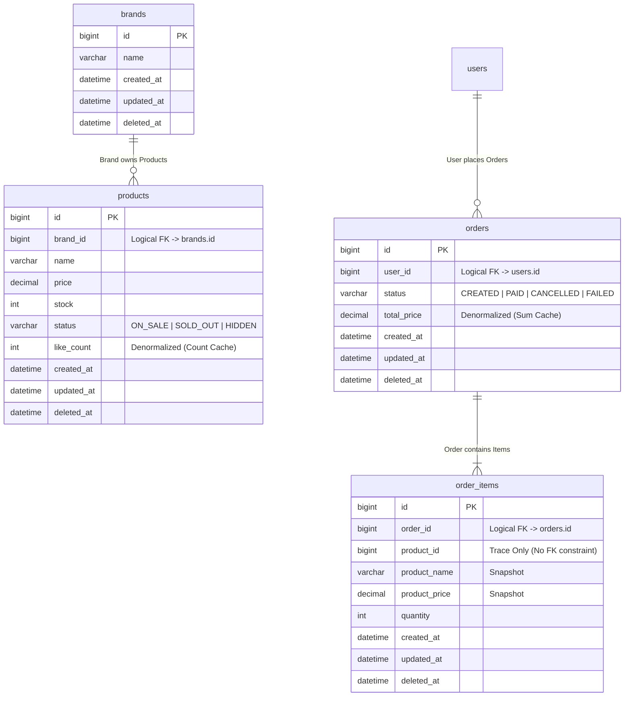

대상 도메인: $ARGUMENTS

## 검증 목적

이 다이어그램으로 다음을 검증한다:
- **영속성 구조**: 도메인 모델이 데이터베이스 스키마로 올바르게 매핑되었는가
- **관계의 주인**: FK를 누가 가지며, 1:N/N:M 관계가 적절히 표현되었는가
- **정규화 여부**: 반정규화 필드의 사유와 정합성 유지 방법이 명확한가

**핵심 원칙: ERD는 생략 없이 상세하게 작성한다.** 시퀀스/클래스 다이어그램과 달리, ERD는 실제 DB 스키마와 1:1 대응해야 하므로 모든 컬럼, 제약조건, 주석을 포함한다.

## 절차

1. 클래스 다이어그램이 있으면 참고한다 (`docs/design/03-class-diagram.md`)
    - `$ARGUMENTS`가 없으면 작성이 필요한 도메인을 제안
2. 다이어그램을 그리기 전에 설명한다:
    - **왜** 이 다이어그램이 필요한지
    - **무엇을** 검증하려는지 (위 검증 목적 참고)
    - 클래스 다이어그램과의 차이점 (VO → 컬럼, 관계 → FK)
3. 문서 구조에 따라 ERD를 작성한다 (아래 산출물 구조 참고):
    - 설계 원칙 → ERD → 스키마 상세 → 인덱스 전략 → 정규화 판단 → 무결성 리스크
4. **정합성 확인**: 클래스 다이어그램(`03-class-diagram.md`)의 관계가 ERD에 반영되었는지 확인한다
5. `docs/design/04-erd.md`에 저장한다
6. 개발자에게 리뷰 요청

## 산출물 구조 (Template)

```markdown
# ERD (Entity-Relationship Diagram)

영속성 구조를 정의한다. 도메인 엔티티와 VO가 실제 데이터베이스 스키마로 매핑되는 전략과 인덱스 계획을 포함한다.

---

## 1. 전체 ERD & 설계 원칙

### 1.1 설계 원칙 (Key Design Decisions)

1. **논리적 FK 사용 (No Physical FK)**
    * (사유와 영향)
2. **주문-상품 스냅샷 (Snapshot)**
    * (사유와 영향)
3. **반정규화 (Denormalization)**
    * (사유와 영향)

### 1.2 Mermaid ERD

(erDiagram, 모든 컬럼 + 타입 + 주석 포함)

---

## 2. 스키마 상세 (Schema Details)

### 2.1 [도메인 그룹명]

| 테이블 | 컬럼 | 타입 | 제약조건 | 설명 |
|-------|------|------|---------|------|

---

## 3. 인덱스 전략 (Indexing Strategy)

| 대상 테이블 | 인덱스 컬럼 | 타입 | 목적 |
|-----------|----------|------|------|

---

## 4. 정규화 판단

### 반정규화 필드

| 테이블 | 컬럼 | 반정규화 사유 | 정합성 유지 방법 |
|-------|------|-----------|-------------|

### 정규화 유지
- (정규화를 유지하는 항목과 이유)

---

## 5. 데이터 무결성 및 리스크 관리

| 구분 | 잠재 리스크 | 대응 전략 |
|------|----------|---------|
```

## 컬럼 주석 규칙

ERD의 컬럼에 다음 주석을 사용하여 설계 의도를 명시한다:

| 주석 | 의미 | 예시 |
|------|------|------|
| `"Logical FK -> table.col"` | 물리 FK 없이 애플리케이션에서 관리하는 참조 | `bigint brand_id "Logical FK -> brands.id"` |
| `"Snapshot"` | 원본 변경과 무관하게 시점 데이터를 보존 | `varchar product_name "Snapshot"` |
| `"Denormalized (설명)"` | 조회 성능을 위해 반정규화된 집계 필드 | `int like_count "Denormalized (Count Cache)"` |
| `"ON_SALE \| SOLD_OUT \| ..."` | Enum 값 나열 (VARCHAR 매핑) | `varchar status "ON_SALE \| SOLD_OUT \| HIDDEN"` |
| `"Trace Only (설명)"` | 참조 무결성 없이 추적 목적만의 ID | `bigint product_id "Trace Only (No FK constraint)"` |

## Mermaid 형식 예시



## 규칙

- 테이블명은 복수형 (products, orders, users)
- soft delete: `deleted_at` nullable datetime
- enum은 VARCHAR로 저장 — 값 목록을 주석으로 명시
- N:M은 반드시 조인 테이블로 풀어서 표현
- VO는 테이블로 분리하지 않음 — Entity의 컬럼으로 표현
- 모든 컬럼에 타입과 제약조건(PK, FK, NOT NULL, UNIQUE)을 명시한다
- BaseEntity 공통 컬럼 포함 (id, created_at, updated_at, deleted_at)
- 관계 표현: `||--o{` (1:N), `||--|{` (1:N 필수), `}o--o{` (N:M → 조인 테이블)
- 컬럼 주석으로 설계 의도를 전달한다 (위 컬럼 주석 규칙 참고)
- 스키마 상세 테이블, 인덱스 전략, 정규화 판단, 무결성 리스크를 별도 섹션으로 분리한다
