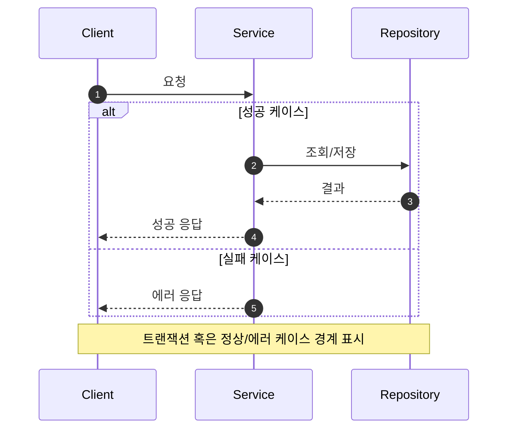
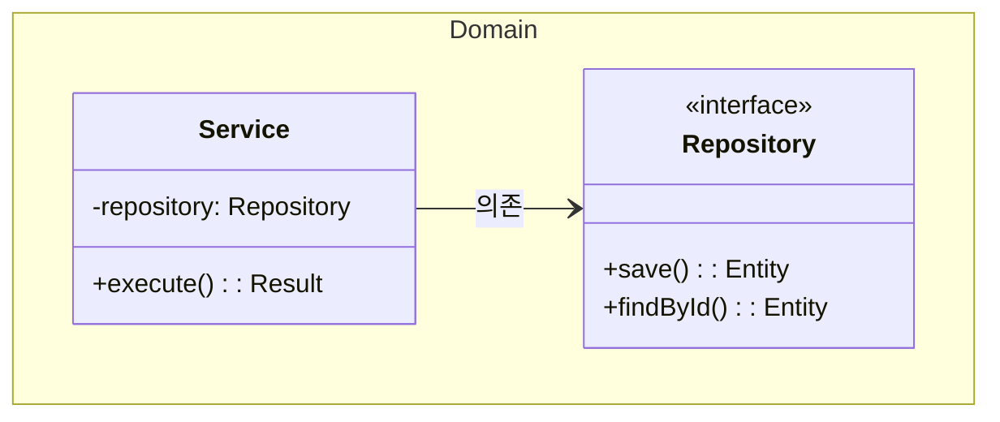
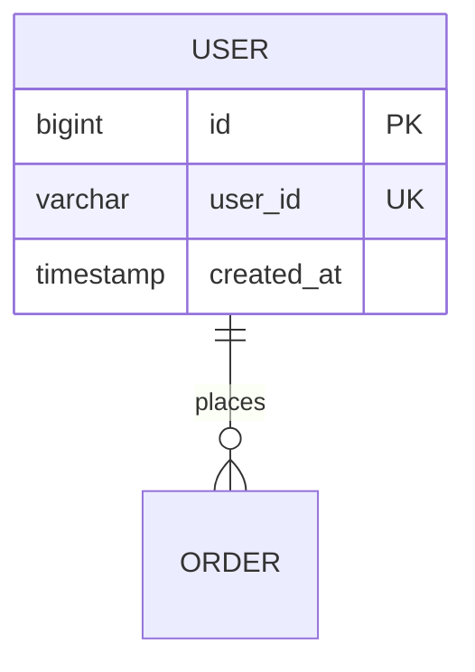
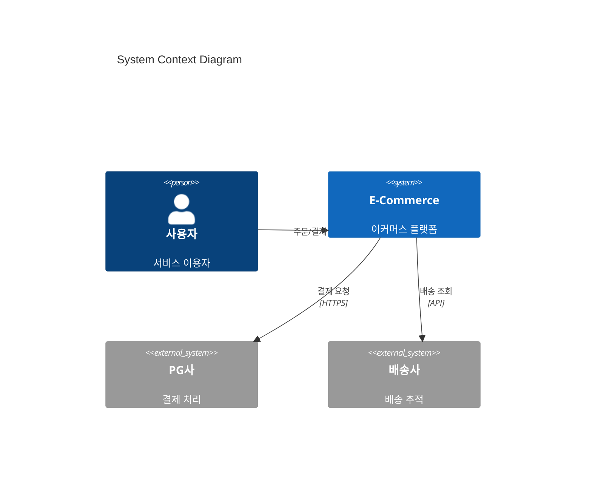
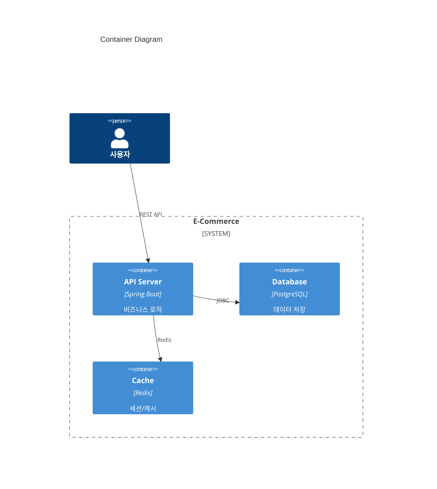

# 요구사항 → PRD 정제 스킬

## 핵심 원칙

> "요구사항은 대화의 시작점이지, 결과가 아니다."

- 주어진 요구사항을 그대로 구현하지 않는다
- 애매함을 숨기지 않고, 질문으로 드러낸다
- 코드 전에 설계를, 설계 전에 문제 정의를 한다

---

## Phase 1: 문제 재정의

### 요구사항을 "문제 정의"로 변환한다

요구사항 문장을 받으면, "무엇을 만들까"가 아니라 **"어떤 문제를 해결하려는가"** 로 변환한다.

| 원본 | 변환 질문 |
|------|----------|
| "~를 만든다" | 이게 없으면 누가 어떤 불편을 겪는가? |
| "~할 수 있다" | 현재는 왜 못하는가? 무엇이 막고 있는가? |
| "~를 검증한다" | 검증하지 않으면 어떤 문제가 발생하는가? |

### 관점별 분리

하나의 요구사항을 세 가지 관점으로 본다:

```markdown
### 문제 분석: [요구사항 제목]

**사용자 관점**: [사용자가 겪는 불편/니즈]
**비즈니스 관점**: [서비스/회사 측면의 문제나 기회]
**시스템 관점**: [기술적 제약이나 현재 한계]
```

**예시:**
- "비밀번호 변경 시 기존 비밀번호 확인"
  - 사용자: 본인이 아닌 사람이 비밀번호를 바꿀까 봐 불안함
  - 비즈니스: 계정 탈취로 인한 고객 신뢰 하락
  - 시스템: 세션 탈취 시 무단 변경 가능 → 2차 인증 필요

---

## Phase 2: 불명확한 부분 식별

### 추측하지 않는다

결정되지 않은 부분은 숨기지 말고 **명시적으로 나열**한다.

### 질문 유형

| 유형 | 설명 | 예시 질문 |
|------|------|----------|
| **정책** | 비즈니스 규칙 기준 | 성공/실패 기준? 예외 처리? 유효 범위? |
| **경계** | 책임의 범위 | 이 기능의 책임은? 트랜잭션 경계? 의존 관계? |
| **확장** | 미래 변화 가능성 | 정책 변경 가능성? 10배 트래픽 대응? |
| **보안** | 취약점과 악용 | 입력값 조작? 인증 우회? 정보 노출? |

---

## Phase 3: 질문 구조화

### 개발자/기획자/Agent 가 답하기 쉬운 형태로 제시

질문에는 **우선순위**, **선택지**, **영향도**를 포함한다.

```markdown
### Q[N]. [질문 제목]
**우선순위**: 높음 | 중간 | 낮음
**배경**: [왜 이 결정이 필요한지]

**선택지**:
| 옵션 | 설명 | 장점 | 단점 |
|------|------|------|------|
| A | [설명] | [장점] | [단점] |
| B | [설명] | [장점] | [단점] |

**권장**: [옵션 선택]
```

**예시:**
```markdown
### Q1. 비밀번호 복잡도 정책 (우선순위: 높음)
**배경**: 보안 수준과 사용자 편의성의 균형

| 옵션 | 설명 | 장점 | 단점 |
|------|------|------|------|
| A | 8자 이상 + 영문숫자 | 간단 | 보안 약함 |
| B | 8-16자 + 특수문자 포함 | 높은 보안 | 사용자 이탈 가능 |
| C | B + 생년월일 패턴 금지 | 최고 보안 | 구현 복잡 |

**권장**: C (이커머스 서비스 보안 기준)
```

---

## Phase 4: 개념 모델 정의

### 코드 전에 도메인부터

기술 구현 논의 전에 **개념적 구조**를 먼저 정의한다.
유비쿼터스 용어를 사용해 직군 상관없이 통념되는 개념으로 작성한다.

| 요소 | 정의 | 예시 |
|------|------|------|
| **액터** | 시스템과 상호작용하는 주체 | 사용자, 외부 시스템, 스케줄러 |
| **핵심 도메인** | 주요 비즈니스 개념 | 책임과 주요 행위 |
| **보조 시스템** | 도메인을 지원하는 시스템 | 역할과 통신 방식 (동기/비동기) |

**용어 매핑:**

| 비즈니스 용어 | 기술 용어 | 정의 |
|--------------|----------|------|
| 회원 | User | 서비스 가입 사용자 |
| 주문 | Order | 상품 구매 요청 |
| 결제 | Payment | 대금 지불 행위 |

> 이 단계의 목적: **"구현"이 아니라 "설계 사고 정렬"**

---

## Phase 5: 다이어그램 작성

### 순서: 이유 → 다이어그램 → 해석

다이어그램을 그리기 전에 반드시:
1. **왜** 이 다이어그램이 필요한지
2. **무엇을** 검증/확인하려는지

를 먼저 설명한다.

### 다이어그램 유형별 용도

| 유형 | 목적 | 검증 포인트 | 추상화 수준 |
|------|------|------------|------------|
| **C4 Context** | 시스템 경계, 외부 연동 | 액터/시스템 관계 | 높음 |
| **C4 Container** | 기술 스택, 배포 단위 | 서비스 간 통신 | 높음 |
| **Sequence** | 호출 흐름, 책임 분리 | 트랜잭션 경계, 에러 분기 | 중간 |
| **Class** | 구조, 의존 방향 | 계층 분리, 응집도 | 낮음 |
| **ERD** | 영속성 구조 | 관계의 주인, 정규화 | 낮음 |

### 권장 작성 순서

```
Requirements → Domain 정의 → Sequence (흐름) → Class (구조) → ERD (영속성) → C4 (배포)
```

**기본 흐름 (Domain-first, 권장):**
1. **요구사항 분석** - 문제 정의, 불명확 사항 도출
2. **도메인 모델** - 액터, 핵심 개념, 용어 정의
3. **Sequence Diagram** - 주요 흐름, 책임 분배, 트랜잭션 경계
4. **Class Diagram** - 구조, 계층, 의존 관계
5. **ERD** - 영속성 구조, 테이블 관계
6. **C4 Context/Container** - 시스템 경계, 배포 구조 (필요 시)

**상황별 변형:**

| 상황 | 순서 변형 | 이유 |
|------|----------|------|
| 시스템 경계가 불명확 | C4 Context를 먼저 | 범위 확정 후 상세화 |
| 기존 DB 스키마 존재 | ERD 분석을 먼저 | 제약 조건 파악 후 설계 |
| 사용자 흐름이 핵심 | Sequence를 먼저 | UX 중심 설계 |
| 데이터 중심 서비스 | ERD → Domain → Sequence | 데이터 모델이 도메인 결정 |

> **원칙**: 순서는 유연하게, 단 **반복(iterate)**은 필수. 후속 단계에서 발견한 내용으로 이전 다이어그램을 갱신한다.

**선택 가이드:**
- 전체 아키텍처/시스템 범위 → **C4 Context/Container**
- 기능 흐름/API 호출 → **Sequence**
- 코드 구조/도메인 모델 → **Class**
- 데이터 설계 → **ERD**

### Mermaid 스타일 가이드

**Sequence Diagram:**


**Class Diagram:**


**ERD:**


**C4 Context:**


**C4 Container:**


### 다이어그램 해석 제공

다이어그램 후 반드시 **읽는 법**을 2-3줄로 설명한다:

```markdown
### 📌 주요 확인 포인트
1. [포인트 1]: [의도/이유]
2. [포인트 2]: [의도/이유]

### 설계 의도
[이 구조를 선택한 이유와 대안 대비 장점]
```

---

## Phase 6: 리스크 & 실무 고려사항

### 리스크 체크리스트

- [ ] 트랜잭션 범위가 과도하게 넓지 않은가?
- [ ] 도메인 간 결합도가 높지 않은가?
- [ ] 정책 변경 시 영향 범위가 명확한가?
- [ ] 외부 시스템 장애 시 전파 범위는?
- [ ] 보안 취약점 (입력 검증, 인증 우회, 정보 노출)은?

**리스크 제시 형식:**
```markdown
#### [리스크명]
- **상황**: [언제 발생하는가]
- **영향**: [발생 시 결과]
- **대안**: A: [해결책] / B: [해결책]
- **권장**: [현 상황에서의 추천]
```

### 실무 체크리스트

| 관점 | 확인 항목 |
|------|----------|
| **운영** | 장애 복구 절차, 모니터링/알림 포인트, 롤백 전략 |
| **개발** | 로컬 테스트, Mock/Stub 대체, 테스트 범위 정의 |
| **배포** | 무중단 배포, Feature flag, DB 마이그레이션 전략 |
| **비용** | 인프라 비용, 외부 API 비용, 개발/유지보수 공수 |

### 실무 vs 이론

| 항목 | 이론적 접근 | 실무 접근 |
|------|------------|----------|
| 비밀번호 해싱 | SHA-256 | BCrypt (타이밍 공격 방지) |
| 인증 실패 | 즉시 에러 반환 | 일정 시간 지연 (브루트포스 방지) |
| 에러 메시지 | 상세 정보 | "ID 또는 비밀번호 틀림" (존재 노출 방지) |
| 로그인 시도 | 무제한 | N회 실패 시 잠금 |
| **ERD 관계** | FK 제약조건, CASCADE | 애플리케이션 레벨 참조 (Loose Coupling) |

#### ERD: 설계 vs 구현

> **PRD의 ERD는 논리적 관계(도메인)를 정의**하고, **실제 DB 스키마는 느슨한 결합**을 적용한다.

| 구분 | 설계 시 (ERD) | 구현 시 (DB Schema) |
|------|--------------|-------------------|
| 관계 표현 | FK로 명시 | 컬럼만 존재, FK 제약 없음 |
| CASCADE | 논리적으로 정의 | 애플리케이션에서 처리 |
| 참조 무결성 | 다이어그램에 표현 | 코드 레벨에서 보장 |
| 삭제 처리 | ON DELETE CASCADE | Soft delete + 배치 정리 |

**이유:**
- DB FK 제약 → 마이그레이션/배포 시 잠금, 성능 이슈
- CASCADE DELETE → 의도치 않은 대량 삭제 위험
- 서비스 분리 시 → 다른 DB로 분산 불가

**ERD 작성 시 명시:**
```markdown
> ⚠️ 이 ERD는 **논리적 관계**를 표현합니다.
> 실제 DB 스키마에서는 FK 제약 없이 애플리케이션 레벨에서 관계를 관리합니다.
```

### 확장성 고려사항 (Optional but Always Consider)

> 모든 설계에 당장 적용할 필요는 없지만, **확장 가능성은 항상 머릿속에 두어야 한다.**

#### 언제 고려하는가?

| 상황 | 고려 대상 |
|------|----------|
| 트래픽 급증 가능성 | 서버 분리, 캐싱 전략, DB 분산 |
| 외부 시스템 의존 | 비동기 처리, 서킷 브레이커, 재시도 정책 |
| 도메인 복잡도 증가 | 서비스 분리 (모듈화 → MSA 전환 가능성) |
| 실시간 처리 요구 | 이벤트 드리븐, 메시지 큐 |

#### 패턴별 트레이드오프

| 패턴 | 장점 | 단점 | 적용 시점 |
|------|------|------|----------|
| **Event-Driven (Async)** | 느슨한 결합, 부하 분산, 장애 격리 | 디버깅 어려움, 최종 일관성, 복잡도 증가 | 서비스 간 결합 줄일 때, 급격한 트래픽 핸들링 |
| **서버 분리 (수직)** | 독립 배포/스케일, 장애 격리 | 네트워크 비용, 트랜잭션 분리 | 특정 기능 부하 집중 시 |
| **DB 분리 (Read/Write)** | 읽기 성능 향상, 부하 분산 | 복제 지연, 일관성 관리 | 읽기 비율 높을 때 |
| **캐싱** | 응답 속도, DB 부하 감소 | 캐시 무효화, 정합성 | 반복 조회 데이터 |

#### 설계 시 질문

```markdown
### 확장성 체크 (Optional)
- [ ] 현재 모놀리식으로 충분한가? 향후 분리 지점은?
- [ ] 동기 호출이 병목이 될 수 있는 구간은?
- [ ] 이벤트 기반으로 전환 시 어떤 흐름이 후보인가?
- [ ] 트래픽 10배 증가 시 어느 컴포넌트가 먼저 한계에 도달하는가?
```

**예시 (주문-결제 흐름):**
```
현재: Order → Payment (동기 호출)
확장: Order → OrderCreatedEvent → PaymentService (비동기)
     - 결제 실패 시 보상 트랜잭션 필요
     - 최종 일관성 허용 여부 확인 필요
```

> **핵심**: "지금 당장은 단순하게, 하지만 분리 지점은 미리 파악해 둔다."

---

## 톤 가이드

| DO ✅ | DON'T ❌ |
|-------|---------|
| 설계 리뷰 톤 | 강의 톤 |
| 선택지 제공 | 정답 제시 |
| 의도/책임/경계 중심 | 코드 중심 |
| 트레이드오프 명시 | 한 방향만 제시 |
| 질문으로 끌어내기 | 일방적 설명 |

**예시 (좋은 톤):**
```
Service에서 트랜잭션을 관리하는 것이 일반적입니다.
다만, 외부 API 호출이 트랜잭션 내에 있으면 커넥션 점유 시간이 늘어날 수 있어요.

현재 규모에서는 괜찮겠지만, 확장을 고려한다면
결제 처리를 별도 트랜잭션으로 분리하는 방안도 있습니다.

어떤 방향이 현재 상황에 맞을까요?
```

---

## 산출물 파일 구조

| 파일명 | 내용 |
|--------|------|
| `01-requirements.md` | 문제 정의, 유저 시나리오, 기능/비기능 요구사항, 용어 정의 |
| `02-sequence-diagrams.md` | 시퀀스 다이어그램 (최소 2개), 해석 포함 |
| `03-class-diagram.md` | 클래스 다이어그램, 계층별 책임 |
| `04-erd.md` | ERD, 테이블 명세, 인덱스/제약조건 |

### 파일별 구조

**01-requirements.md:**
```
# 요구사항 명세
## 1. 문제 정의 (사용자/비즈니스/시스템 관점)
## 2. 유저 시나리오 (액터, 사전조건, 주요/대안/예외 흐름)
## 3. 기능 요구사항 (ID, 요구사항, 우선순위, 비고)
## 4. 비기능 요구사항 (성능, 보안, 확장성)
## 5. 용어 정의 (비즈니스 ↔ 기술 매핑)
## 6. 미결정 사항 (항목, 선택지, 결정)
```

**02-sequence-diagrams.md:**
```
# 시퀀스 다이어그램
## [흐름명 1] - 정상 케이스
### 목적: [검증 대상]
### 다이어그램: [Mermaid]
### 📌 확인 포인트

## [흐름명 2] - 예외 케이스
...
```

**03-class-diagram.md:**
```
# 클래스 다이어그램
## 1. 전체 구조 (목적 + 다이어그램 + 확인 포인트)
## 2. 계층별 책임 (Interfaces/Domain/Infrastructure)
## 3. 의존 관계 설명
```

**04-erd.md:**
```
# ERD
## 1. 전체 ERD (Mermaid)
## 2. 테이블 명세 (컬럼, 타입, 제약조건, 설명)
## 3. 인덱스 (인덱스명, 컬럼, 타입, 용도)
## 4. 관계 정의 (관계, 설명, 카디널리티)
## 5. 마이그레이션 고려사항
```

---

## 최종 체크리스트

PRD 완성 시 다음이 포함되어야 한다:

- [ ] **문제 정의** - 사용자/비즈니스/시스템 관점
- [ ] **불명확 사항** - 결정되지 않은 부분 목록
- [ ] **명확화 질문** - 우선순위 + 선택지 + 영향도
- [ ] **개념 모델** - 액터, 도메인, 외부 시스템
- [ ] **용어 정의** - 비즈니스 ↔ 기술 매핑
- [ ] **다이어그램** - 이유 + 그림 + 해석 (C4/Sequence/Class/ERD)
- [ ] **리스크** - 잠재 위험 + 대안
- [ ] **실무 고려사항** - 운영/개발/배포/비용 관점
- [ ] **확장성 고려** - 트래픽/서비스 확장 시 분리 지점 파악 (Optional)
- [ ] **4개 파일 산출물** - 분리 작성 완료

---

**철학**: "코드를 쓰기 전에 생각을 맞춰라. 요구사항은 정답이 아니라 대화의 시작점이다."
