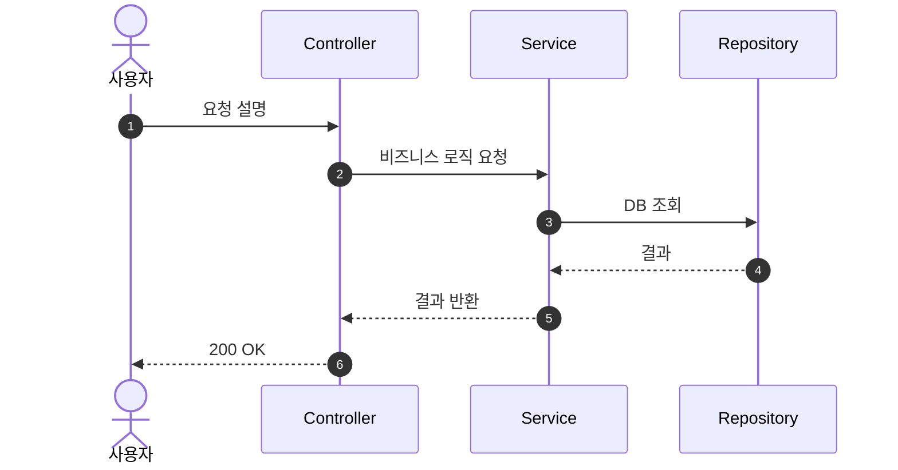
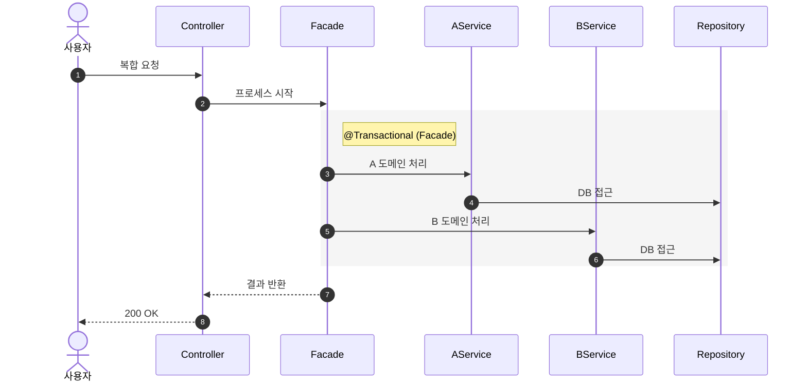
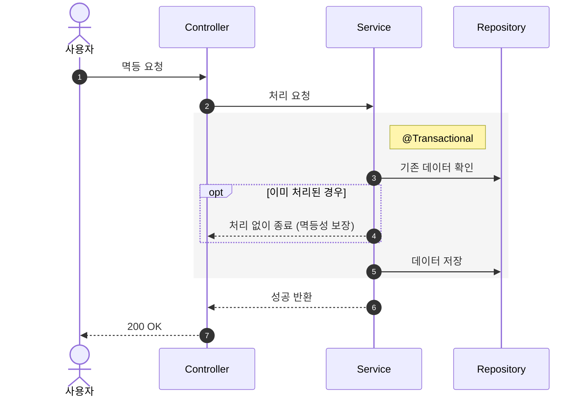

대상 기능: $ARGUMENTS

## 검증 목적

이 다이어그램으로 다음을 검증한다:
- **책임 분리**: 각 레이어(Controller, Facade, Service, Repository)가 자신의 책임만 수행하는가
- **호출 순서**: 요청 흐름이 레이어드 아키텍처를 올바르게 따르는가
- **트랜잭션 경계**: 원자성이 필요한 범위가 명확히 설정되었는가

## 절차

1. 대상 기능의 요구사항을 확인한다
    - `docs/design/01-requirements.md`가 있으면 참고
    - `$ARGUMENTS`가 없으면 작성이 필요한 기능을 제안
2. 다이어그램을 그리기 전에 설명한다:
    - **왜** 이 다이어그램이 필요한지
    - **무엇을** 검증하려는지 (위 검증 목적 참고)
3. 문서 상단에 **"다이어그램 공통 규칙"** 섹션을 작성한다 (아래 템플릿 참고)
4. 도메인별로 그룹핑하여 시퀀스 다이어그램을 작성한다:
    - 각 기능의 **API 엔드포인트**와 **인증 요구사항**을 다이어그램 위에 명시
    - 단일 도메인 CRUD는 간결하게, Cross-Domain 흐름은 Facade의 조율 역할을 강조
    - 트랜잭션 경계는 `rect rgb(245, 245, 245)` 블록 + `Note`로 표시
    - `opt`/`alt`는 멱등성 등 핵심 동작에만 간결하게 사용
5. 각 다이어그램 아래에 **"참고"** 섹션으로 보충 설명을 제공한다:
    - 특히 봐야 할 포인트, 설계 의도, 관련 도메인 규칙 참조
6. **정합성 확인**: 시퀀스의 참여자가 클래스 다이어그램(`03-class-diagram.md`)에 존재하는지 확인한다
7. `docs/design/02-sequence-diagrams.md`에 저장한다
8. 개발자에게 리뷰 요청

## 산출물 구조 (Template)

```markdown
# 시퀀스 다이어그램

시스템의 주요 기능에 대한 **핵심 성공 흐름(Happy Path)** 을 기술한다.
상세한 예외 처리 규칙(400, 404 등)과 필드 검증 로직은 요구사항 명세서를 참고한다.

### 다이어그램 공통 규칙

- **참여자(Participant) 레벨 통일**:
    - **Controller**: 요청 수신, 파라미터 매핑, 응답 변환
    - **Facade**: 도메인 간 조율 (다중 서비스 호출 시에만 사용)
    - **Service**: 핵심 비즈니스 로직 및 도메인 규칙 수행
    - **Repository**: DB 접근 (JPA)
- **Facade 사용 기준**: 단일 서비스 호출(1:1)인 경우 Controller가 Service를 직접 호출한다. 2개 이상의 서비스를 조율할 때만 Facade를 사용한다.
- **트랜잭션 경계**: Service는 변경 작업에 @Transactional 필수. Facade는 여러 Service 조합 시 @Transactional 적용.
- **인증**: 인터셉터 처리 과정은 전제 조건으로 취급.
- **생략된 내용**:
    - 인증 인터셉터 처리 과정
    - 상세한 DTO 변환 과정
    - 단순 유효성 검증 실패(400 Bad Request) 흐름

---

## 1. [도메인명] — [API 유형 (대고객/어드민)]

### 1.1 [기능명]

**API:** `METHOD /path` — 인증 요구사항

(mermaid 시퀀스 다이어그램)

#### 참고
- (보충 설명, 필터 조건, 중요한 동작 방식 등)
```

## 참여자(Participant) 레벨 규칙

컴포넌트 레벨을 반드시 맞춘다. Controller, Service, Repository 사이에 갑자기 특정 클래스 이름(VO, Util 등)을 섞어 넣으면 가독성이 깨진다.

- **단일 서비스 호출 (1:1)**: `Controller → Service → Repository` 3단계 (Facade 생략)
- **다중 서비스 조율 (Cross-Domain)**: `Controller → Facade → Services → Repository` — Facade가 여러 Service를 조율
    - 서비스 구분이 필요한 경우에만 alias 분리 (예: `participant PS as ProductService`, `participant BS as BrandService`)
    - Repository는 가능하면 `R as Repository` 하나로 통합 (구현 상세를 추상화)

## Mermaid 형식 예시

### 단일 서비스 호출 (1:1, Facade 생략)



### Cross-Domain 트랜잭션 (Facade 조율)



### 멱등성 표현 (opt 활용)



## 규칙

- 하나의 기능당 하나의 시퀀스 다이어그램
- **Happy Path(핵심 성공 흐름)에만 집중** — 예외 흐름은 요구사항 명세서에 위임
- 참여자 레벨을 반드시 통일 (Controller, Facade, Service, Repository)
- 특정 클래스명(VO, Util, Helper 등)을 참여자로 섞지 않는다
- `autonumber`를 항상 사용하여 흐름 순서를 명확히 한다
- `actor` 키워드로 사용자/어드민을 표기한다 (예: `actor User as 사용자`)
- Facade는 다중 서비스 조율 시에만 포함한다. 단일 서비스 호출(1:1)인 경우 Controller가 Service를 직접 호출한다
- 도메인별로 섹션을 나누어 관련 API를 그룹핑한다
- 복잡한 분기(다수의 if-else, 실패 케이스)는 시퀀스에 넣지 않고 요구사항이나 별도 문서로 분리
- 과도한 상세는 문서의 수명을 단축시킨다 — 적절한 추상화가 핵심
