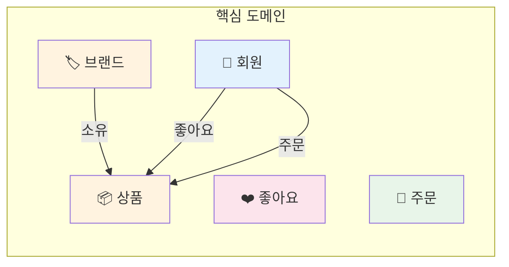
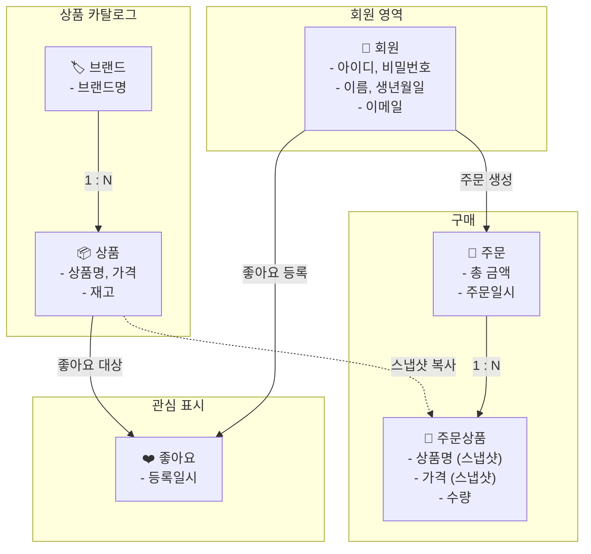
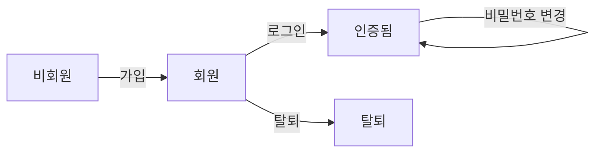
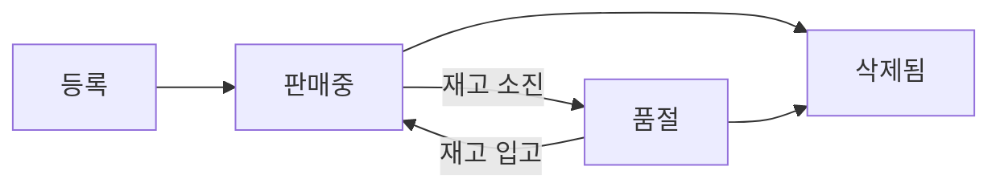
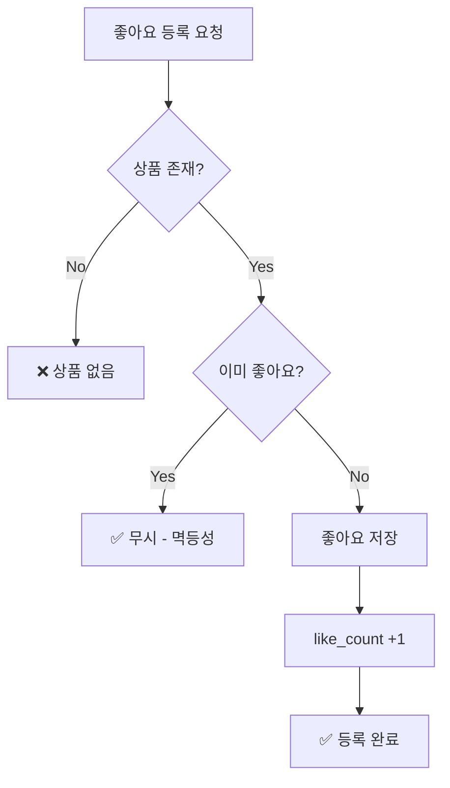
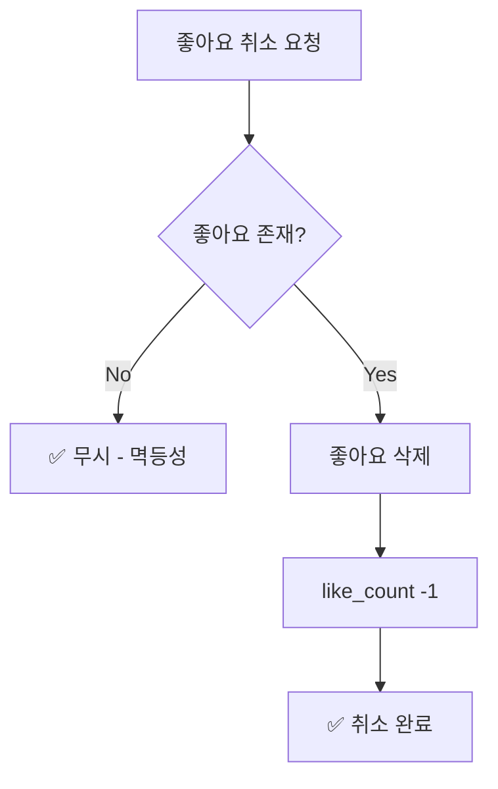
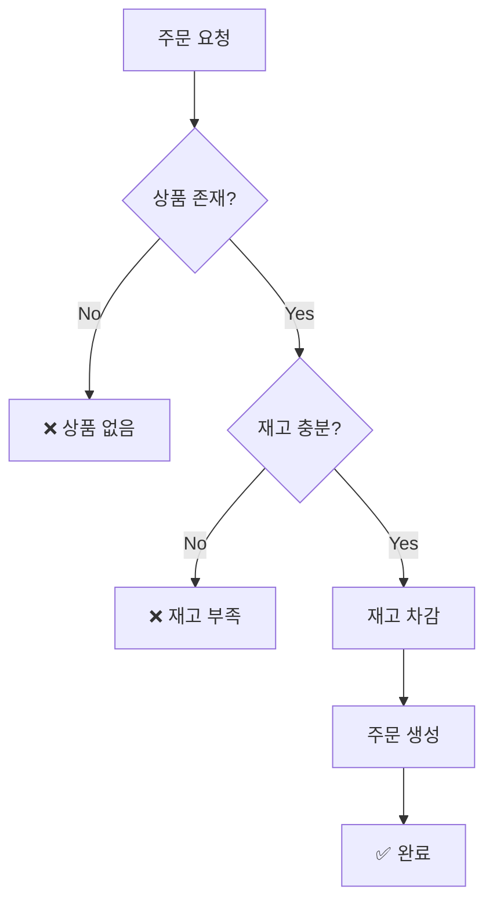
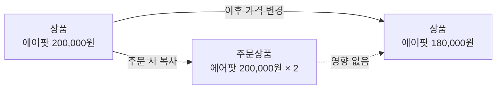
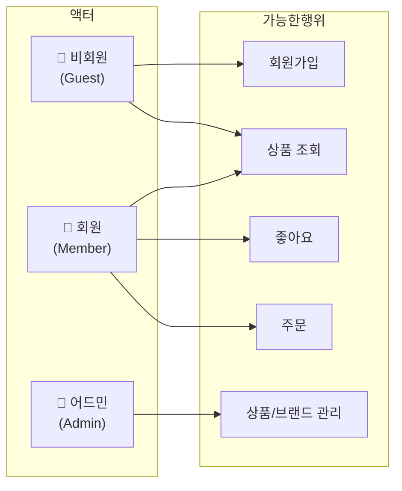

# 요구사항 명세: Loopers E-Commerce

---

## 목차

- [0. 도메인 개요](#0-도메인-개요)
- [1. 문제 정의](#1-문제-정의)
- [2. 용어 정의](#2-용어-정의)
- [3. 유저 시나리오](#3-유저-시나리오)
- [4. 기능 요구사항](#4-기능-요구사항)
- [5. 비기능 요구사항](#5-비기능-요구사항)
- [6. 미결정 사항](#6-미결정-사항)
- [7. API 엔드포인트 요약](#7-api-엔드포인트-요약)
- [8. 리스크 및 고려사항](#8-리스크-및-고려사항)

---

## 0. 도메인 개요

### 0.1 비즈니스 도메인 관계

Loopers는 **감성 이커머스** 플랫폼으로, 회원이 브랜드 상품을 탐색하고 좋아요/주문할 수 있는 서비스입니다.

### 0.2 도메인별 핵심 개념

| 도메인 | 설명 | 핵심 행위 |
|--------|------|----------|
| **회원 (User)** | 서비스를 이용하기 위해 가입한 사용자 | 가입, 로그인, 비밀번호 변경 |
| **브랜드 (Brand)** | 상품을 제공하는 업체 | 등록, 수정, 삭제 (Admin) |
| **상품 (Product)** | 판매 대상 물품 (브랜드에 속함) | 등록, 수정, 삭제, 재고 관리 |
| **좋아요 (Like)** | 회원이 관심 상품을 표시하는 행위 | 등록, 취소, 목록 조회 |
| **주문 (Order)** | 회원의 상품 구매 요청 | 생성, 조회 |

---

### 0.3 도메인 관계 상세

---

### 0.4 도메인별 비즈니스 규칙

#### 👤 회원 (User)

| 규칙 | 설명 |
|------|------|
| 아이디 형식 | 영문과 숫자만 허용 |
| 비밀번호 정책 | 8~16자, 영문/숫자/특수문자 조합, 생년월일 포함 불가 |
| 이메일 형식 | 표준 이메일 형식 (`user@domain.com`) |
| 생년월일 제한 | 미래 날짜 불가 |
| 인증 방식 | 헤더 기반 인증 (X-Loopers-LoginId/Pw) |

**회원 상태 흐름:**

---

#### 🏷️ 브랜드 (Brand)

| 규칙 | 설명 |
|------|------|
| 관리 권한 | Admin만 등록/수정/삭제 가능 |
| 브랜드명 중복 방지 | 동일한 브랜드명 등록 불가 |
| 삭제 처리 | 삭제 시 소속 상품도 함께 삭제됨 |
| 필수 정보 | 브랜드명 필수 |

---

#### 📦 상품 (Product)

| 규칙 | 설명 |
|------|------|
| 브랜드 귀속 | 상품은 반드시 하나의 브랜드에 속함 |
| 브랜드 고정 | 등록 후 브랜드 변경 불가 |
| 가격/재고 제한 | 0 이상이어야 함 |
| 삭제된 브랜드 | 삭제된 브랜드의 상품은 노출되지 않음 |

**상품 상태 흐름:**

---

#### ❤️ 좋아요 (Like)

| 규칙 | 설명 |
|------|------|
| 중복 방지 | 같은 상품에 중복 좋아요 불가 |
| 멱등성 | 이미 좋아요한 상품에 재요청 → 기존 상태 유지 |
| 상품 필수 | 존재하는 상품에만 좋아요 가능 |
| 삭제된 상품 | 삭제된 상품의 좋아요는 목록에서 숨김 |

**좋아요 등록 흐름:**

**좋아요 취소 흐름:**

---

#### 🧾 주문 (Order)

| 규칙 | 설명 |
|------|------|
| 최소 수량 | 주문에는 최소 1개 상품 포함 |
| 재고 확인 | 모든 상품의 재고가 충분해야 주문 가능 |
| 부분 주문 불가 | 일부 재고 부족 시 전체 주문 실패 |
| 스냅샷 저장 | 주문 시점의 상품명/가격을 별도 저장 |
| 본인 조회 | 자신의 주문만 조회 가능 |
**주문 생성 흐름:**

**스냅샷 개념:**

> 주문 시점의 상품 정보(이름, 가격)를 주문상품에 복사하여 저장합니다.
> 이후 상품 가격이 변경되어도 기존 주문 내역에는 영향이 없습니다.

---

### 0.5 액터 (Actor) 정의

| 액터 | 인증 방식 | 권한 |
|------|----------|------|
| 비회원 (Guest) | 없음 | 회원가입, 상품 조회 |
| 회원 (Member) | X-Loopers-LoginId/Pw | 내 정보 조회, 좋아요, 주문 |
| 어드민 (Admin) | X-Loopers-Ldap: loopers.admin | 브랜드/상품 CRUD, 주문 조회 |

---

## 1. 문제 정의

### 1.1 서비스 개요

**감성 이커머스** - 좋아요, 쿠폰, 주문/결제를 통해 사용자가 좋아하는 브랜드 상품을 구매하는 플랫폼

### 1.2 관점별 문제 분석

#### 👤 회원 관리

| 관점 | 문제/니즈 |
|------|----------|
| **사용자** | 서비스를 이용하려면 계정이 필요하고, 내 정보를 안전하게 관리하고 싶음 |
| **비즈니스** | 회원 기반 마케팅, 개인화 추천, 재구매 유도 |
| **시스템** | 인증/인가 없이 헤더 기반 식별 (X-Loopers-LoginId/Pw) |

#### 🏷 브랜드 & 상품 관리

| 관점 | 문제/니즈 |
|------|----------|
| **사용자** | 다양한 브랜드 상품을 탐색하고 비교하고 싶음 |
| **비즈니스** | 상품 카탈로그 관리, 브랜드별 상품 그룹화 |
| **시스템** | 브랜드-상품 1:N 관계, 브랜드 삭제 시 상품 연쇄 처리 |

#### ❤️ 좋아요

| 관점 | 문제/니즈 |
|------|----------|
| **사용자** | 관심 상품을 저장해두고 나중에 다시 보고 싶음 |
| **비즈니스** | 사용자 관심 데이터 수집 → 랭킹/추천 기능 연결 |
| **시스템** | 유저-상품 M:N 관계, 중복 좋아요 방지 |

#### 🧾 주문

| 관점 | 문제/니즈 |
|------|----------|
| **사용자** | 여러 상품을 한 번에 주문하고, 주문 내역을 확인하고 싶음 |
| **비즈니스** | 매출 발생, 주문 데이터 기반 분석 |
| **시스템** | 주문 시 상품 스냅샷 저장, 재고 확인/차감, 트랜잭션 일관성 |

---

## 2. 용어 정의

| 비즈니스 용어 | 기술 용어 | 정의 |
|--------------|----------|------|
| 회원 | User | 서비스에 가입한 사용자 |
| 어드민 | Admin | LDAP 인증을 통해 관리 기능을 수행하는 내부 직원 |
| 브랜드 | Brand | 상품을 제공하는 업체/브랜드 |
| 상품 | Product | 판매 대상 물품 (브랜드에 속함) |
| 좋아요 | Like | 사용자가 관심 상품에 표시하는 행위 |
| 주문 | Order | 사용자의 상품 구매 요청 |
| 주문상품 | OrderItem | 주문에 포함된 개별 상품 (스냅샷) |
| 재고 | Stock | 상품의 판매 가능 수량 |

---

## 3. 유저 시나리오

### UC-01: 회원가입 및 로그인

**액터**: 비회원/회원
**사전조건**: 없음

| 흐름 | 설명 |
|------|------|
| **주요 흐름** | 1. 사용자가 회원가입 정보 입력 → 2. 계정 생성 → 3. 헤더에 인증 정보 포함하여 API 호출 |
| **대안 흐름** | 이미 존재하는 userId로 가입 시도 → CONFLICT 에러 |
| **예외 흐름** | 유효하지 않은 이메일/비밀번호 → BAD_REQUEST 에러 |

### UC-02: 상품 탐색 및 좋아요

**액터**: 회원
**사전조건**: 로그인 상태

| 흐름 | 설명 |
|------|------|
| **주요 흐름** | 1. 상품 목록 조회 → 2. 상품 상세 조회 → 3. 좋아요 등록 |
| **대안 흐름** | 이미 좋아요한 상품에 다시 좋아요 → 중복 처리 정책 필요 |
| **예외 흐름** | 존재하지 않는 상품에 좋아요 → NOT_FOUND 에러 |

### UC-03: 주문 생성

**액터**: 회원
**사전조건**: 로그인 상태, 상품 존재

| 흐름 | 설명 |
|------|------|
| **주요 흐름** | 1. 주문 요청 (상품ID, 수량) → 2. 재고 확인 → 3. 재고 차감 → 4. 주문/주문상품 생성 → 5. 응답 |
| **대안 흐름** | 일부 상품 재고 부족 → 전체 주문 실패 or 부분 주문? (정책 결정 필요) |
| **예외 흐름** | 재고 부족 → BAD_REQUEST, 상품 없음 → NOT_FOUND |

### UC-04: 어드민 상품 관리

**액터**: 어드민
**사전조건**: LDAP 인증 (X-Loopers-Ldap: loopers.admin)

| 흐름 | 설명 |
|------|------|
| **주요 흐름** | 브랜드 등록 → 상품 등록 → 상품 수정 → 상품 삭제 |
| **대안 흐름** | 브랜드 삭제 시 해당 브랜드의 모든 상품도 삭제 |
| **예외 흐름** | 존재하지 않는 브랜드에 상품 등록 → NOT_FOUND |

---

## 4. 기능 요구사항

### 4.1 유저 (User)

| ID | 요구사항 | 우선순위 | 비고 |
|----|---------|---------|------|
| U-01 | 회원가입 (userId, password, name, birthDate, email) | 높음 | 비밀번호 8-16자, 생년월일 미래 불가 |
| U-02 | 내 정보 조회 (이름 마스킹) | 높음 | 인증 필요 |
| U-03 | 비밀번호 변경 | 높음 | 기존 비밀번호 확인 필요 |

### 4.2 브랜드 (Brand)

| ID | 요구사항 | 우선순위 | 비고 |
|----|---------|---------|------|
| B-01 | 브랜드 목록 조회 (Admin) | 높음 | 페이징 |
| B-02 | 브랜드 상세 조회 | 높음 | User/Admin 공통 |
| B-03 | 브랜드 등록 (Admin) | 높음 | |
| B-04 | 브랜드 수정 (Admin) | 중간 | |
| B-05 | 브랜드 삭제 (Admin) | 중간 | 상품 연쇄 삭제 |

### 4.3 상품 (Product)

| ID | 요구사항 | 우선순위 | 비고 |
|----|---------|---------|------|
| P-01 | 상품 목록 조회 | 높음 | 필터(brandId), 정렬(latest/price_asc/likes_desc), 페이징 |
| P-02 | 상품 상세 조회 | 높음 | User/Admin |
| P-03 | 상품 등록 (Admin) | 높음 | 브랜드 필수 |
| P-04 | 상품 수정 (Admin) | 중간 | 브랜드 변경 불가 |
| P-05 | 상품 삭제 (Admin) | 중간 | |

### 4.4 좋아요 (Like)

| ID | 요구사항 | 우선순위 | 비고 |
|----|---------|---------|------|
| L-01 | 상품 좋아요 등록 | 높음 | 중복 방지 |
| L-02 | 상품 좋아요 취소 | 높음 | |
| L-03 | 내가 좋아요한 상품 목록 | 중간 | 본인만 조회 가능 |

### 4.5 주문 (Order)

| ID | 요구사항 | 우선순위 | 비고 |
|----|---------|---------|------|
| O-01 | 주문 생성 | 높음 | 재고 확인/차감, 상품 스냅샷 저장 |
| O-02 | 내 주문 목록 조회 | 높음 | 기간 필터 (startAt, endAt) |
| O-03 | 주문 상세 조회 | 높음 | 본인 주문만 |
| O-04 | 주문 목록 조회 (Admin) | 중간 | 페이징 |
| O-05 | 주문 상세 조회 (Admin) | 중간 | |

---

## 5. 비기능 요구사항

### 5.1 성능

| 항목 | 요구사항 |
|------|---------|
| 응답 시간 | 일반 API 200ms 이내, 목록 조회 500ms 이내 |
| 동시 사용자 | 초기 100명, 확장 고려 |

### 5.2 TPS 목표 (향후 확장 기준)

> MVP에서는 해당 수치를 충족할 필요 없으나, 아키텍처 설계 시 확장 가능성을 고려합니다.

#### 이커머스 티어별 참고 지표

| Tier | 대표 서비스 | 연 GMV (추정) | 평균 주문 TPS | 피크 주문 TPS | 시스템 RPS |
|------|------------|--------------|--------------|--------------|-----------|
| Hyper-Scale | Coupang, Naver | 40조+ | ~50 | 1,000+ | > 500,000 |
| Vertical Giant | Musinsa, Kurly | 3조 - 5조 | ~3 | 300+ | 10,000 - 50,000 |
| **Large Niche** | **29CM, W Concept** | **5,000억 - 1조** | **~0.6** | **100+** | **2,000 - 10,000** |
| Normal Shop | 개별 브랜드몰 | 100억 | ~0.01 | ~5 | < 100 |

#### Loopers 목표 스펙 (Large Niche 기준)

Loopers는 감성 이커머스로 29CM, W Concept과 유사한 포지션을 목표로 합니다.

| 항목 | MVP | Target (Large Niche) |
|------|-----|---------------------|
| 평균 주문 TPS | < 0.1 | ~0.6 |
| 피크 주문 TPS | ~5 | 100+ |
| 시스템 RPS (전체 트래픽) | < 100 | 2,000 - 10,000 |
| 동시 접속자 | ~100 | ~10,000 |

#### 주요 병목 예상 지점

| 구간 | MVP 대응 | Target 대응 |
|------|---------|------------|
| 주문 (재고 차감) | 단일 DB 비관적 락 | 분산 락 또는 메시지 큐 기반 순차 처리 |
| 좋아요 (like_count) | 동기식 +1/-1 | 이벤트 기반 비동기 + 캐시 |
| 상품 목록 조회 | DB 직접 조회 | Redis 캐싱 + CDN |
| 인증 | 매 요청 BCrypt 검증 | JWT 토큰 기반 세션 |

### 5.3 보안

| 항목 | 요구사항 |
|------|---------|
| 비밀번호 | BCrypt 해싱, 생년월일 포함 금지 |
| 인증 실패 | 타이밍 공격 방지 (일정 지연 또는 bcrypt.checkpw) |
| 에러 메시지 | 사용자 존재 여부 노출 금지 ("ID 또는 비밀번호가 일치하지 않습니다") |
| 권한 분리 | 유저는 타 유저 정보 접근 불가 |

### 5.4 확장성

| 항목 | 고려사항 |
|------|---------|
| 주문-결제 | 현재 동기, 추후 비동기(이벤트) 전환 가능성 |
| 좋아요 카운트 | 실시간 집계 vs 캐싱/배치 집계 |
| 상품 목록 | 캐싱 전략 (Redis) |

---

## 6. 미결정 사항

### Q1. 좋아요 중복 처리 정책 (우선순위: 중간)

**배경**: 이미 좋아요한 상품에 다시 좋아요 요청 시 처리 방식

| 옵션 | 설명 | 장점 | 단점 |
|------|------|------|------|
| A | 에러 반환 (CONFLICT) | 명확한 상태 전달 | 클라이언트 처리 필요 |
| B | 멱등성 보장 (200 OK) | 재시도 안전 | 실제 변경 여부 불명확 |

**권장**: B (멱등성 보장)

---

### Q2. 주문 시 일부 재고 부족 처리 (우선순위: 높음)

**배경**: 여러 상품 주문 시 일부만 재고 부족인 경우

| 옵션 | 설명 | 장점 | 단점 |
|------|------|------|------|
| A | 전체 주문 실패 | 일관성 보장 | UX 불편 |
| B | 부분 주문 성공 | 유연한 UX | 복잡한 로직, 환불 이슈 |

**권장**: A (전체 주문 실패) - MVP 단계에서는 단순하게

---

### Q3. 브랜드 삭제 시 상품 처리 (우선순위: 중간)

**배경**: 브랜드 삭제 시 해당 브랜드 상품 처리 방식

| 옵션 | 설명 | 장점 | 단점 |
|------|------|------|------|
| A | Hard Delete (연쇄 삭제) | 깔끔한 데이터 | 복구 불가, 주문 이력 손상 |
| B | Soft Delete | 복구 가능, 이력 보존 | 쿼리 복잡 |
| C | 삭제 불가 (상품 있으면) | 안전 | 관리 불편 |

**권장**: B (Soft Delete) - 실무 관점에서 이력 보존 필요

---

### Q4. 상품 정렬 기준 (우선순위: 낮음)

**배경**: 상품 목록 정렬 옵션

| 옵션 | 구현 복잡도 |
|------|------------|
| latest (최신순) | 낮음 (필수) |
| price_asc (가격 낮은순) | 낮음 |
| likes_desc (좋아요순) | 중간 (집계 필요) |

**권장**: MVP에서는 latest 필수, 나머지 선택

---

## 7. API 엔드포인트 요약

### User API (`/api/v1`)

| Method | URI | 인증 | 설명 |
|--------|-----|------|------|
| POST | `/api/v1/users` | X | 회원가입 |
| GET | `/api/v1/users/me` | O | 내 정보 조회 |
| PUT | `/api/v1/users/password` | O | 비밀번호 변경 |
| GET | `/api/v1/users/{userId}/likes` | O | 내 좋아요 목록 |

### Brand/Product API (`/api/v1`)

| Method | URI | 인증 | 설명 |
|--------|-----|------|------|
| GET | `/api/v1/brands/{brandId}` | X | 브랜드 조회 |
| GET | `/api/v1/products` | X | 상품 목록 |
| GET | `/api/v1/products/{productId}` | X | 상품 상세 |
| POST | `/api/v1/products/{productId}/likes` | O | 좋아요 등록 |
| DELETE | `/api/v1/products/{productId}/likes` | O | 좋아요 취소 |

### Order API (`/api/v1`)

| Method | URI | 인증 | 설명 |
|--------|-----|------|------|
| POST | `/api/v1/orders` | O | 주문 생성 |
| GET | `/api/v1/orders` | O | 내 주문 목록 |
| GET | `/api/v1/orders/{orderId}` | O | 주문 상세 |

### Admin API (`/api-admin/v1`)

| Method | URI | LDAP | 설명 |
|--------|-----|------|------|
| GET/POST/PUT/DELETE | `/api-admin/v1/brands/**` | O | 브랜드 CRUD |
| GET/POST/PUT/DELETE | `/api-admin/v1/products/**` | O | 상품 CRUD |
| GET | `/api-admin/v1/orders/**` | O | 주문 조회 |

---

## 8. 리스크 및 고려사항

### 8.1 동시성 이슈

- **재고 차감**: 동시 주문 시 재고 초과 판매 위험
- **대안**: 비관적 락 or 재고 테이블 분리 + 원자적 업데이트

### 8.2 트랜잭션 범위

- **주문 생성**: 재고 확인 → 차감 → 주문 생성이 하나의 트랜잭션
- **주의**: 트랜잭션 길어지면 DB 락 증가

### 8.3 확장 고려

- **좋아요 카운트**: 실시간 COUNT vs 비정규화 (likeCount 컬럼)
- **주문-결제**: 현재 동기, 추후 이벤트 드리븐으로 분리 가능

---

**문서 작성일**: 2026-02-11
**버전**: 1.1 (도메인 개요 섹션 추가)
