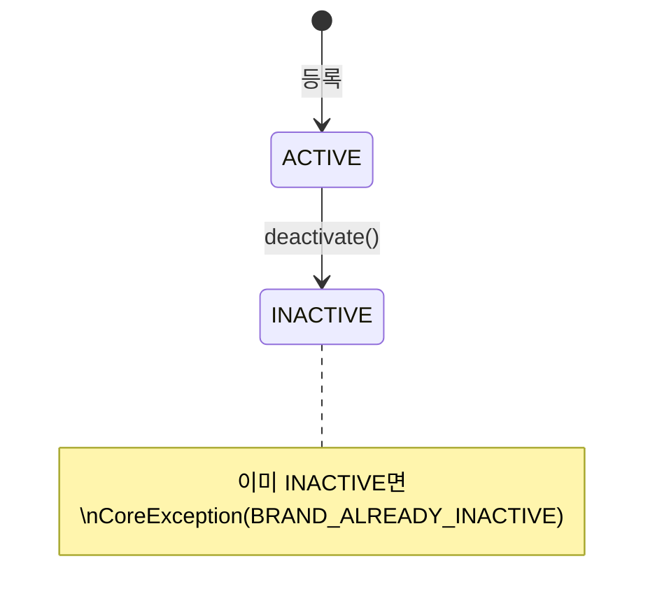
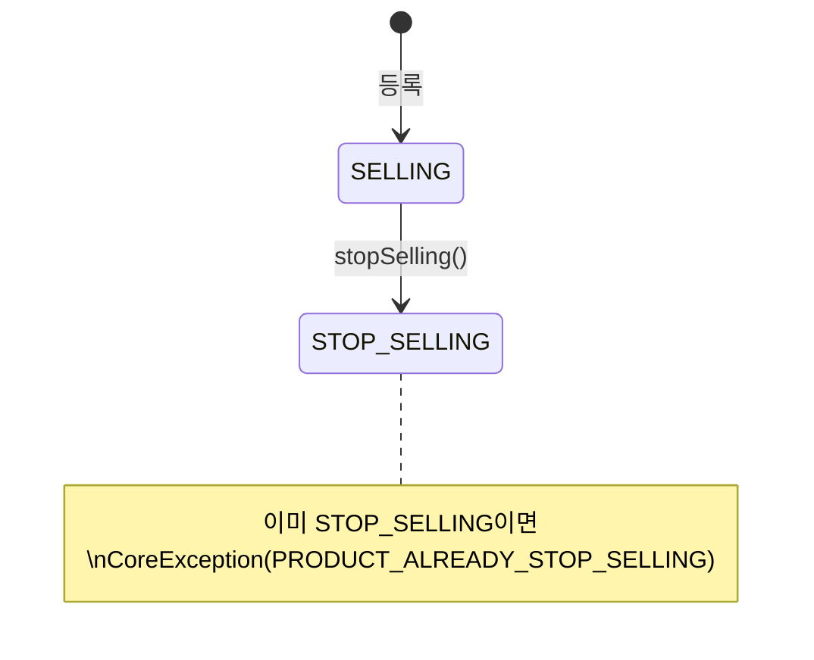
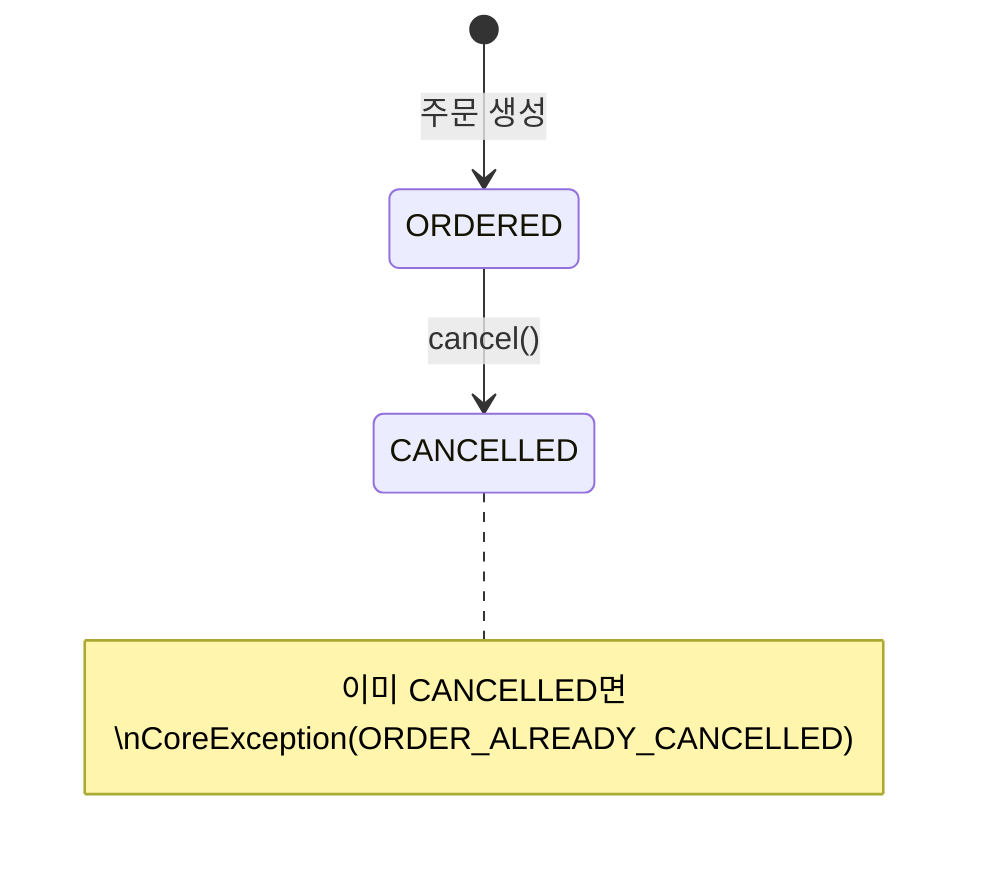
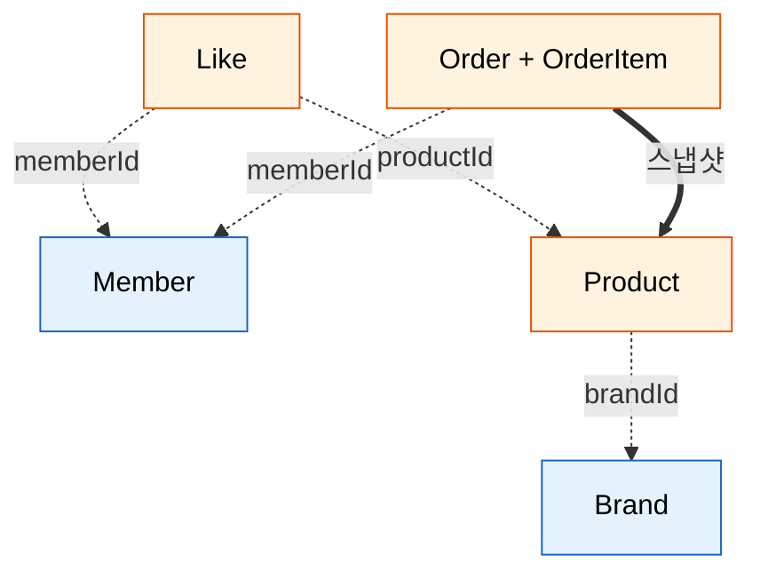
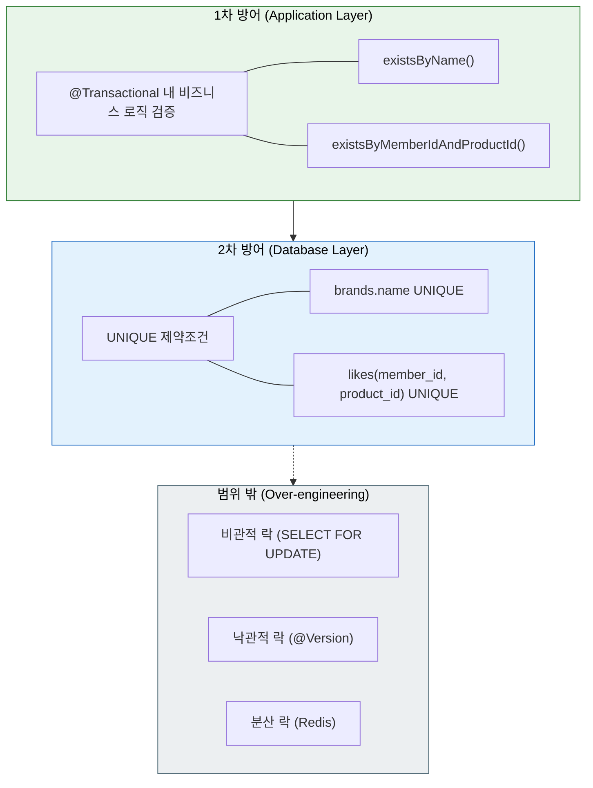

# 01. 요구사항 명세

## 개요

Volume 2에서 구현할 4개 도메인(Brand, Product, Like, Order)의 기능 요구사항을 유저 시나리오 기반으로 정의합니다.

### 정책 결정 사항

| 항목 | 결정 | 근거 |
|------|------|------|
| 삭제 방식 | Soft Delete + Restrict | 데이터 보존 + 참조 무결성 보장 |
| 주문 범위 | 단순 주문 (스냅샷 + 조회 + 취소) | 재고/결제 없이 핵심 구조에 집중 |
| 가격 타입 | Long (원 단위) | KRW 기준 정수 연산으로 충분 |
| 좋아요 방식 | 등록/취소 분리 엔드포인트 | REST 의미론에 부합 (POST/DELETE) |

### 인증 방식 (공통)

모든 인증 필요 API는 아래 헤더를 사용합니다:
- `X-Loopers-LoginId`: 로그인 ID
- `X-Loopers-LoginPw`: 비밀번호

---

## 1. Brand (브랜드) 도메인

> **문제**: 브랜드 없이 상품이 존재하면 고객의 상품 탐색과 관리자의 카탈로그 관리가 불가능하다.
> **목표**: 브랜드를 독립 Aggregate로 관리하여, 상품 분류의 기준점이자 관리 단위를 제공한다.

### 1.1 유저 시나리오

> **관리자**는 커머스 플랫폼에 입점할 브랜드를 등록/관리하고,
> **고객**은 브랜드 정보를 조회하여 상품 탐색의 기준으로 활용한다.

### 1.2 기능 요구사항

#### 브랜드 등록

- **필요 정보**: `{ 브랜드명 }`
- 브랜드명은 1~50자, 공백만으로 구성 불가
- 이미 존재하는 브랜드명으로는 등록 불가
- 등록 시 상태는 `ACTIVE`

#### 브랜드 단건 조회

- **반환 정보**: `{ 브랜드 ID, 브랜드명, 상태 }`
- 존재하지 않는 브랜드 ID로 조회 시 예외

#### 브랜드 목록 조회

- **반환 정보**: `{ 브랜드 ID, 브랜드명, 상태 }` 의 리스트
- ACTIVE 상태의 브랜드만 반환

#### 브랜드 수정

- **필요 정보**: `{ 브랜드명 }`
- 브랜드명 검증 규칙은 등록과 동일
- 다른 브랜드와 이름 중복 불가

#### 브랜드 삭제 (비활성화)

- 상태를 `INACTIVE`로 변경 (Soft Delete)
- **해당 브랜드에 `SELLING` 상태의 상품이 존재하면 삭제 불가** (Restrict)
- 이미 비활성 상태이면 예외

### 1.3 비즈니스 규칙

| 규칙 | 설명 |
|------|------|
| 브랜드명 유일성 | 동일한 브랜드명은 시스템에 하나만 존재 |
| 삭제 제한 | 판매 중인 상품이 있는 브랜드는 삭제 불가 |
| Soft Delete | 물리 삭제하지 않고 상태를 INACTIVE로 변경 |

#### Brand 상태 전이

### 1.4 경계값 분석

| 필드 | 입력값 | 길이/값 | 기대 결과 |
|------|--------|---------|-----------|
| 브랜드명 | "" | 0자 | 에러 (INVALID_BRAND_NAME_FORMAT) |
| 브랜드명 | "   " | 공백 3자 | 에러 (INVALID_BRAND_NAME_FORMAT) |
| 브랜드명 | "A" | 1자 | 성공 |
| 브랜드명 | "A"x50 | 50자 | 성공 |
| 브랜드명 | "A"x51 | 51자 | 에러 (INVALID_BRAND_NAME_FORMAT) |
| 브랜드명 | "나이키" | 한글 | 성공 |

### 1.5 API 엔드포인트

| Method | URI | 설명 | 인증 | 성공 | 실패 |
|--------|-----|------|------|------|------|
| POST | `/api/v1/brands` | 브랜드 등록 | O | 201 | 400, 409 |
| GET | `/api/v1/brands/{id}` | 브랜드 단건 조회 | O | 200 | 401, 404 |
| GET | `/api/v1/brands` | 브랜드 목록 조회 | O | 200 | 401 |
| PUT | `/api/v1/brands/{id}` | 브랜드 수정 | O | 200 | 400, 404, 409 |
| DELETE | `/api/v1/brands/{id}` | 브랜드 삭제 | O | 200 | 404, 409 |

---

## 2. Product (상품) 도메인

> **문제**: 상품 정보가 체계적으로 관리되지 않으면 고객은 비교/선택이 불가하고, 주문 시 정확한 정보를 보장할 수 없다.
> **목표**: 브랜드에 종속된 상품을 관리하되, 주문 시점의 정보를 스냅샷으로 보존할 수 있는 구조를 제공한다.

### 2.1 유저 시나리오

> **관리자**는 브랜드에 속하는 상품을 등록/관리하고,
> **고객**은 상품을 검색하고 상세 정보를 확인하여 주문 여부를 결정한다.

### 2.2 기능 요구사항

#### 상품 등록

- **필요 정보**: `{ 브랜드 ID, 상품명, 가격, 설명 }`
- 상품명은 1~100자
- 가격은 0 이상의 정수 (Long, 원 단위)
- 설명은 0~1000자 (선택)
- 존재하는 브랜드에만 상품 등록 가능 (ACTIVE 상태)
- 등록 시 상태는 `SELLING`

#### 상품 단건 조회

- **반환 정보**: `{ 상품 ID, 브랜드 ID, 브랜드명, 상품명, 가격, 설명, 상태 }`
- 존재하지 않는 상품 ID로 조회 시 예외

#### 상품 목록 조회

- **반환 정보**: `{ 상품 ID, 브랜드명, 상품명, 가격, 상태 }` 의 리스트
- 브랜드 ID로 필터링 가능 (선택)

#### ADR: 상품 목록 조회 시 상태 필터링 전략

| 대안 | 설명 | 장점 | 단점 |
|------|------|------|------|
| A. SELLING만 반환 | Brand 목록과 동일하게 활성 상품만 | 일관성, 고객 관점 | 관리자 관점 부족 |
| B. 전체 반환 | 모든 상태 포함 | 관리자 편의 | 고객에게 불필요한 데이터 |
| C. 파라미터 필터 | `?status=SELLING` 쿼리 파라미터 | 유연성 | API 복잡도 증가 |

**결정: B (전체 반환)** -- 현재 스코프에서는 관리자/고객 구분 없이 단일 API로 운영. 상태 필드를 응답에 포함하여 클라이언트가 필터링 가능.
향후 관리자/고객 API 분리 시 A로 전환 검토.

#### 상품 수정

- **필요 정보**: `{ 상품명, 가격, 설명 }`
- 각 필드의 검증 규칙은 등록과 동일

#### 상품 삭제 (판매 중지)

- 상태를 `STOP_SELLING`으로 변경 (Soft Delete)
- 이미 판매 중지 상태이면 예외

### 2.3 비즈니스 규칙

| 규칙 | 설명 |
|------|------|
| 브랜드 존재 검증 | 상품 등록 시 ACTIVE 상태의 브랜드 필요 |
| 가격 제약 | 0 이상의 정수만 허용 |
| 상품 스냅샷 | 주문 시 상품 정보가 복사되므로 수정해도 기존 주문에 영향 없음 |
| Soft Delete | 물리 삭제하지 않고 상태를 STOP_SELLING으로 변경 |

#### Product 상태 전이

### 2.4 경계값 분석

| 필드 | 입력값 | 길이/값 | 기대 결과 |
|------|--------|---------|-----------|
| 상품명 | "" | 0자 | 에러 (INVALID_PRODUCT_NAME_FORMAT) |
| 상품명 | "A" | 1자 | 성공 |
| 상품명 | "A"x100 | 100자 | 성공 |
| 상품명 | "A"x101 | 101자 | 에러 (INVALID_PRODUCT_NAME_FORMAT) |
| 가격 | -1 | 음수 | 에러 (INVALID_PRODUCT_PRICE) |
| 가격 | 0 | 최소 | 성공 |
| 가격 | 9,999,999 | 일반 | 성공 |
| 설명 | "" | 0자 | 성공 |
| 설명 | "A"x1000 | 1000자 | 성공 |
| 설명 | "A"x1001 | 1001자 | 에러 (INVALID_PRODUCT_DESCRIPTION_LENGTH) |

### 2.5 API 엔드포인트

| Method | URI | 설명 | 인증 | 성공 | 실패 |
|--------|-----|------|------|------|------|
| POST | `/api/v1/products` | 상품 등록 | O | 201 | 400, 404 |
| GET | `/api/v1/products/{id}` | 상품 단건 조회 | O | 200 | 401, 404 |
| GET | `/api/v1/products` | 상품 목록 조회 | O | 200 | 401 |
| PUT | `/api/v1/products/{id}` | 상품 수정 | O | 200 | 400, 404 |
| DELETE | `/api/v1/products/{id}` | 상품 삭제 | O | 200 | 404, 409 |

---

## 3. Like (좋아요) 도메인

> **문제**: 고객이 관심 상품을 기억하고 재방문할 수단이 없으면 전환율이 낮아진다.
> **목표**: 회원-상품 관계를 경량으로 관리하여, 관심 상품 큐레이션의 기반을 제공한다.

### 3.1 유저 시나리오

> **고객**은 관심 있는 상품에 좋아요를 등록하고,
> 내 좋아요 목록에서 관심 상품을 한눈에 확인한다.

### 3.2 기능 요구사항

#### 좋아요 등록

- **필요 정보**: `{ 상품 ID }`
- 로그인한 회원만 가능
- 존재하는 상품에만 좋아요 가능 (SELLING 상태)
- **이미 좋아요한 상품에 다시 등록 시 에러 반환**

#### 좋아요 취소

- 자신이 등록한 좋아요만 취소 가능
- 존재하지 않는 좋아요 ID로 취소 시 예외

#### ADR: 좋아요 취소 엔드포인트 설계

| 대안 | URI | 설명 | 장점 | 단점 |
|------|-----|------|------|------|
| A. likeId 기반 | `DELETE /api/v1/likes/{likeId}` | 좋아요 리소스 ID로 삭제 | REST 리소스 원칙 부합 | 클라이언트가 likeId를 알아야 함 |
| B. productId 기반 | `DELETE /api/v1/likes/products/{productId}` | 상품 기준 삭제 | 클라이언트 편의 | REST 리소스 원칙에서 벗어남 |

**결정: A (likeId 기반)** -- Like는 독립 리소스이므로 자체 ID로 조작하는 것이 REST 원칙에 부합. 좋아요 목록 조회 시 likeId를 함께 반환하므로 클라이언트가 취소 시 사용 가능.

#### 내 좋아요 목록 조회

- **반환 정보**: `{ 좋아요 ID, 상품 ID, 상품명, 가격, 브랜드명 }` 의 리스트
- 로그인한 회원의 좋아요만 반환

### 3.3 비즈니스 규칙

| 규칙 | 설명 |
|------|------|
| 중복 방지 | 동일 회원이 같은 상품에 중복 좋아요 불가 |
| 상품 존재 검증 | SELLING 상태의 상품에만 좋아요 가능 |
| 소유권 검증 | 자신의 좋아요만 취소 가능 |

### 3.4 경계값 분석

| 시나리오 | 조건 | 기대 결과 |
|----------|------|-----------|
| 정상 등록 | SELLING 상품, 미등록 | 성공 |
| 중복 등록 | 이미 좋아요한 상품 | 에러 (ALREADY_LIKED) |
| 없는 상품 | 존재하지 않는 productId | 에러 (LIKE_PRODUCT_NOT_FOUND) |
| 판매중지 상품 | STOP_SELLING 상품 | 에러 (LIKE_PRODUCT_NOT_FOUND) |
| 타인 좋아요 취소 | 다른 회원의 likeId | 에러 (LIKE_NOT_OWNER) |

### 3.5 API 엔드포인트

| Method | URI | 설명 | 인증 | 성공 | 실패 |
|--------|-----|------|------|------|------|
| POST | `/api/v1/likes` | 좋아요 등록 | O | 201 | 400, 404, 409 |
| DELETE | `/api/v1/likes/{id}` | 좋아요 취소 | O | 200 | 404, 403 |
| GET | `/api/v1/likes/me` | 내 좋아요 목록 | O | 200 | 401 |

---

## 4. Order (주문) 도메인

> **문제**: 주문 이후 상품 정보가 변경되면 주문 내역의 정합성이 깨진다.
> **목표**: 주문 시점의 상품 정보를 스냅샷으로 보존하여 불변의 주문 이력을 제공한다.

### 4.1 유저 시나리오

> **고객**은 원하는 상품을 선택하여 주문하고,
> 주문 내역을 확인하거나 필요 시 취소한다.

### 4.2 기능 요구사항

#### 주문 생성

- **필요 정보**: `{ 주문 상품 목록 [{ 상품 ID, 수량 }] }`
- 로그인한 회원만 가능
- 주문 상품 목록은 1개 이상
- 수량은 1 이상의 정수
- 존재하는 상품에만 주문 가능 (SELLING 상태)
- **주문 시점의 상품 정보(이름, 가격)를 스냅샷으로 저장**
- 총 주문 금액 = SUM(상품 가격 x 수량)
- 등록 시 상태는 `ORDERED`

#### 주문 단건 조회

- **반환 정보**: `{ 주문 ID, 상태, 총 금액, 주문일시, 주문 상품 목록 }`
- 주문 상품: `{ 상품명(스냅샷), 가격(스냅샷), 수량 }`
- 자신의 주문만 조회 가능

#### 내 주문 목록 조회

- **반환 정보**: `{ 주문 ID, 상태, 총 금액, 주문일시, 상품 수 }` 의 리스트
- 로그인한 회원의 주문만 반환

#### 주문 취소

- 자신의 주문만 취소 가능
- 이미 취소된 주문은 다시 취소 불가

### 4.3 비즈니스 규칙

| 규칙 | 설명 |
|------|------|
| 상품 스냅샷 | 주문 시점 상품 이름/가격을 OrderItem에 복사 저장 |
| 빈 주문 방지 | 주문 상품이 0개면 주문 불가 |
| 소유권 검증 | 자신의 주문만 조회/취소 가능 |
| 취소 불가 조건 | 이미 CANCELLED 상태인 주문은 취소 불가 |

#### Order 상태 전이

### 4.4 경계값 분석

| 시나리오 | 조건 | 기대 결과 |
|----------|------|-----------|
| 정상 주문 | SELLING 상품 1개, 수량 1 | 성공 |
| 빈 주문 | 주문 상품 0개 | 에러 (ORDER_ITEM_EMPTY) |
| 수량 0 | quantity = 0 | 에러 (INVALID_ORDER_QUANTITY) |
| 수량 음수 | quantity = -1 | 에러 (INVALID_ORDER_QUANTITY) |
| 없는 상품 | 존재하지 않는 productId | 에러 (ORDER_PRODUCT_NOT_FOUND) |
| 판매중지 상품 | STOP_SELLING 상품 | 에러 (ORDER_PRODUCT_NOT_FOUND) |
| 이미 취소된 주문 취소 | CANCELLED 주문 | 에러 (ORDER_ALREADY_CANCELLED) |
| 타인 주문 조회 | 다른 회원의 orderId | 에러 (ORDER_NOT_OWNER) |

### 4.5 API 엔드포인트

| Method | URI | 설명 | 인증 | 성공 | 실패 |
|--------|-----|------|------|------|------|
| POST | `/api/v1/orders` | 주문 생성 | O | 201 | 400, 404 |
| GET | `/api/v1/orders/{id}` | 주문 단건 조회 | O | 200 | 404, 403 |
| GET | `/api/v1/orders/me` | 내 주문 목록 | O | 200 | 401 |
| PATCH | `/api/v1/orders/{id}/cancel` | 주문 취소 | O | 200 | 404, 403, 409 |

---

## 5. ErrorType 코드 할당

기존 Member 도메인(E001~E010)에 이어, 도메인별 코드 그룹을 할당합니다.

| 범위 | 도메인 | 에러 목록 |
|------|--------|-----------|
| E001~E010 | Member | (기존) |
| E101~E199 | Brand | DUPLICATE_BRAND_NAME, BRAND_NOT_FOUND, INVALID_BRAND_NAME_FORMAT, BRAND_HAS_ACTIVE_PRODUCTS, BRAND_ALREADY_INACTIVE |
| E201~E299 | Product | PRODUCT_NOT_FOUND, INVALID_PRODUCT_NAME_FORMAT, INVALID_PRODUCT_PRICE, INVALID_PRODUCT_DESCRIPTION_LENGTH, PRODUCT_ALREADY_STOP_SELLING, BRAND_NOT_ACTIVE |
| E301~E399 | Like | LIKE_NOT_FOUND, ALREADY_LIKED, LIKE_PRODUCT_NOT_FOUND, LIKE_NOT_OWNER |
| E401~E499 | Order | ORDER_NOT_FOUND, ORDER_ALREADY_CANCELLED, ORDER_ITEM_EMPTY, INVALID_ORDER_QUANTITY, ORDER_NOT_OWNER, ORDER_PRODUCT_NOT_FOUND |

---

## 6. 도메인 간 의존 관계

| 도메인 | 참조하는 도메인 | 참조 방식 |
|--------|----------------|-----------|
| Brand | 없음 | - |
| Product | Brand | ID 참조 (`brandId: Long`) |
| Like | Member, Product | ID 참조 (`memberId`, `productId`) |
| Order | Member, Product | ID 참조 + 스냅샷 (OrderItem에 상품 정보 복사) |

---

## 7. 동시성 및 경쟁 조건

### 7.1 시나리오별 위험과 대응

| 시나리오 | 위험 | 방어 전략 |
|----------|------|-----------|
| 동일 브랜드명 동시 등록 | 중복 브랜드 생성 | 1차: 앱 레벨 `existsByName()` 검증 2차: DB UNIQUE 제약조건 |
| 동일 상품에 동시 좋아요 | 중복 좋아요 생성 | 1차: 앱 레벨 `existsByMemberIdAndProductId()` 검증 2차: DB UNIQUE(member_id, product_id) 제약조건 |
| 브랜드 삭제 중 상품 등록 | 삭제된 브랜드에 상품 생성 | @Transactional 격리 수준 (READ_COMMITTED) |
| 상품 삭제 중 주문 생성 | 삭제된 상품으로 주문 | @Transactional 내 상품 상태 검증 |

### 7.2 방어 전략 계층

**결정**: 현재 스코프에서는 1차(앱) + 2차(DB) 방어로 충분. 동시 요청이 빈번한 시나리오(재고 차감 등)는 범위 밖이므로 락 전략은 미적용.

---

## 8. 페이지네이션 전략

### ADR: 목록 조회 API의 페이지네이션 적용 여부

| 대안 | 설명 | 장점 | 단점 |
|------|------|------|------|
| A. 미적용 (전체 반환) | `findAll()` 결과 전체 반환 | 구현 단순, YAGNI 원칙 | 데이터 증가 시 성능 이슈 |
| B. Offset-based | `?page=0&size=20` | 익숙한 패턴 | 대량 데이터 시 성능 저하 (OFFSET N) |
| C. Cursor-based | `?cursor=lastId&size=20` | 일관된 성능 | 구현 복잡도, 정렬 제약 |

**결정: A (미적용)** -- YAGNI 원칙에 따라 현재 스코프에서는 전체 반환. 학습 과제 범위에서 데이터 규모가 크지 않으므로 오버엔지니어링 방지.

**향후 방향**: 데이터 규모 증가 시 C(Cursor-based) 방식 도입 검토. Offset-based는 대량 데이터에서 성능 문제가 있으므로 건너뛰는 것을 권장.

