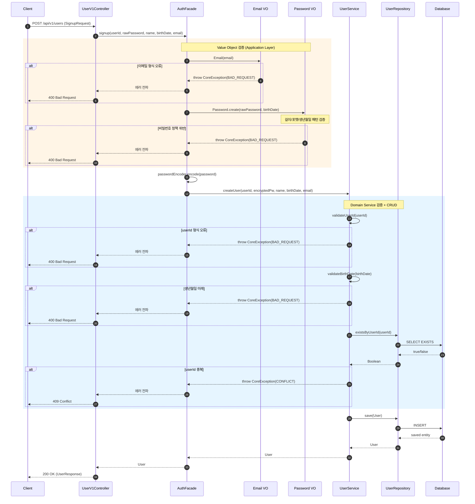
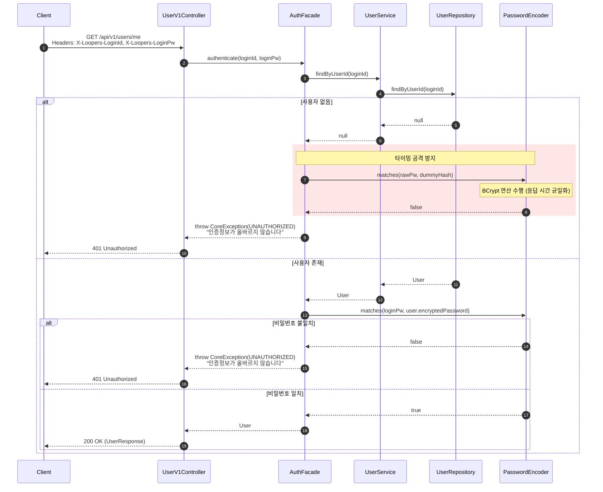
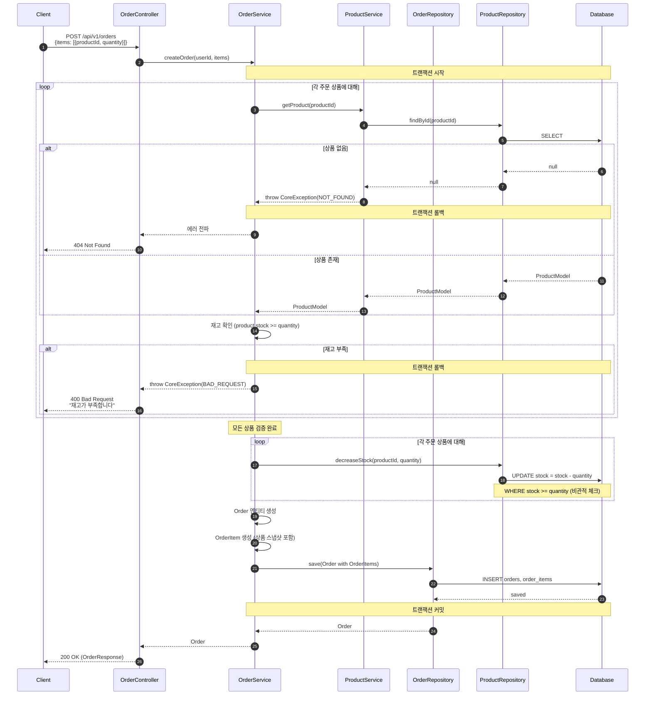
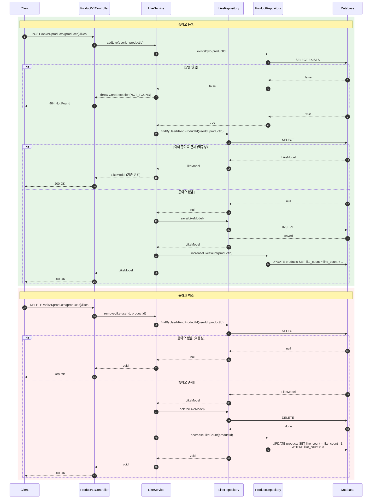
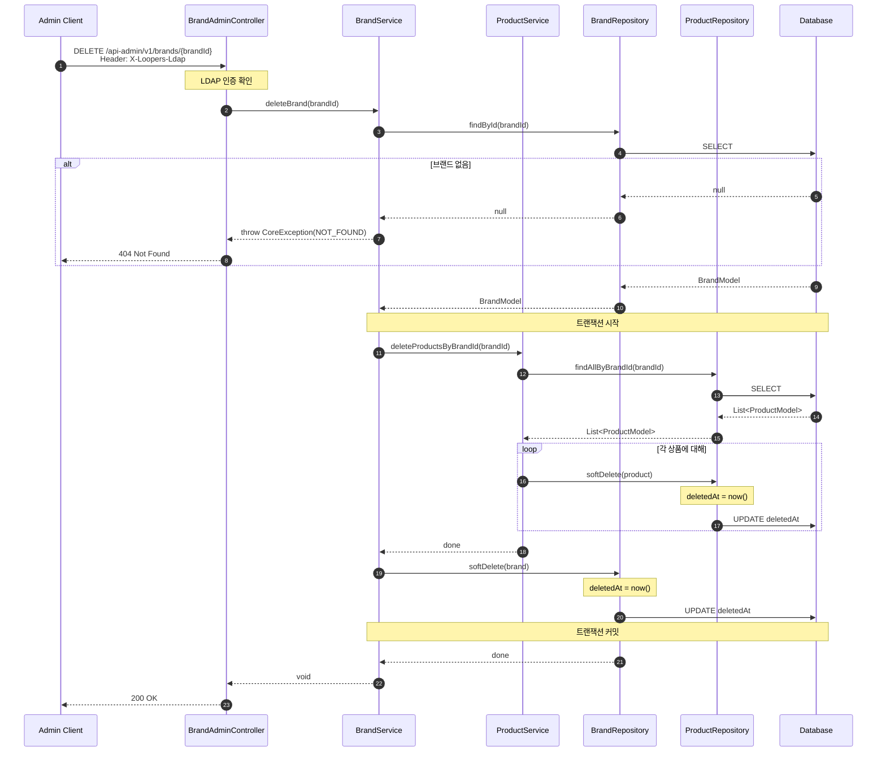
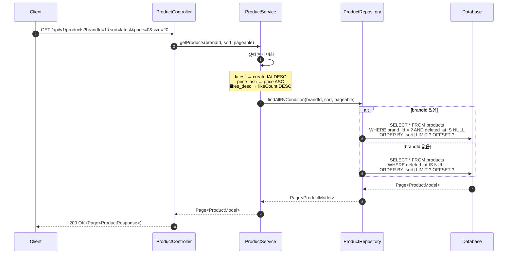
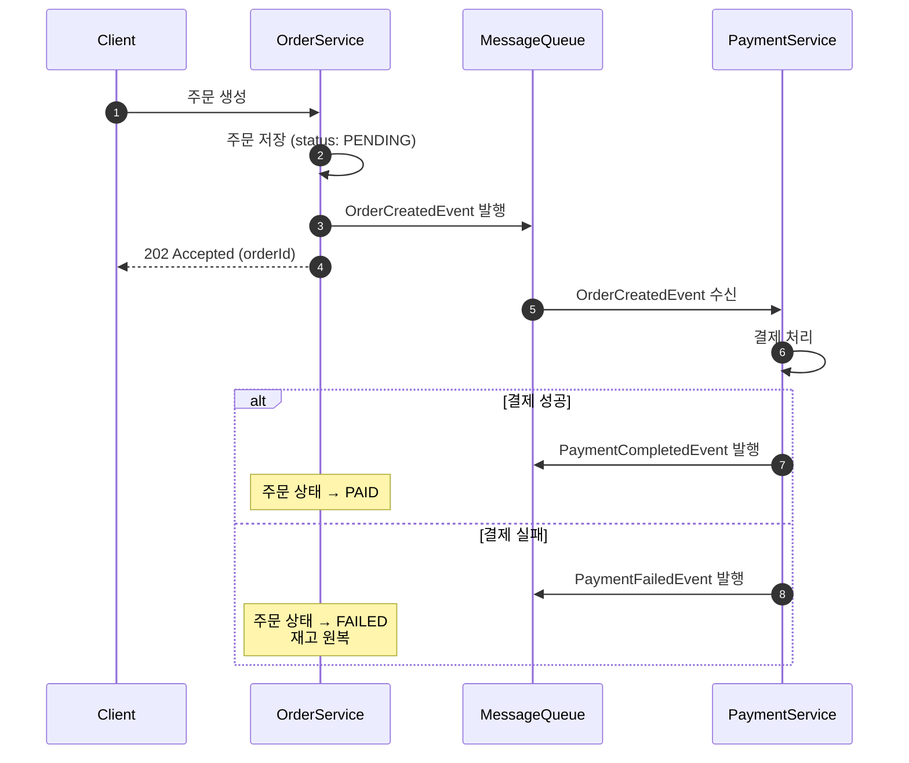

# 시퀀스 다이어그램: Loopers E-Commerce

---

## 1. 회원가입 흐름

### 목적
- 회원가입 시 유효성 검증 순서와 책임 분배 확인
- 에러 케이스별 응답 위치 확인

### 다이어그램

### 📌 주요 확인 포인트

1. **검증 책임 분리**: AuthFacade에서 VO 검증/암호화, UserService에서 도메인 검증/CRUD
2. **검증 순서**: VO 검증 → 암호화 → 도메인 검증 → 중복 확인 → 저장
3. **비밀번호 암호화**: AuthFacade에서 BCrypt 적용 후 UserService에 암호화된 값 전달

### 설계 의도
- Controller는 DTO 변환만, AuthFacade가 유스케이스 조율
- Value Object가 자가 검증하여 유효하지 않은 상태의 객체 생성 방지
- UserService는 순수 도메인 검증과 CRUD에 집중

---

## 2. 인증 (로그인) 흐름

### 목적
- 헤더 기반 인증 흐름 확인
- 타이밍 공격 방지를 위한 처리 확인

### 다이어그램

### 📌 주요 확인 포인트

1. **타이밍 공격 방지**: AuthFacade에서 사용자 미존재 시에도 bcrypt 연산 수행하여 응답 시간 균일화
2. **에러 메시지 통일**: "인증정보가 올바르지 않습니다" (사용자 존재 여부 노출 방지)
3. **헤더 기반 인증**: 매 요청마다 인증 수행 (세션리스)
4. **책임 분리**: AuthFacade가 인증 로직 조율, UserService는 조회만 담당

### 설계 의도
- 보안 강화를 위해 실패 원인을 구분하지 않음
- bcrypt의 constant-time comparison 활용
- 인증 로직이 AuthFacade에 집중되어 다른 Controller에서도 재사용 가능

---

## 3. 주문 생성 흐름

### 목적
- 주문 생성 시 재고 확인/차감 흐름 확인
- 트랜잭션 경계 확인
- 상품 스냅샷 저장 시점 확인

### 다이어그램

### 📌 주요 확인 포인트

1. **트랜잭션 범위**: 재고 확인 → 차감 → 주문 생성이 하나의 트랜잭션
2. **검증 우선**: 모든 상품 존재/재고 확인 후 차감 시작
3. **스냅샷 저장**: OrderItem에 주문 시점의 상품 정보(이름, 가격) 저장
4. **전체 실패 정책**: 하나라도 실패하면 전체 롤백

### 설계 의도
- 일관성 우선 (부분 주문 미지원)
- 동시성 이슈는 DB 레벨에서 처리 (`stock >= quantity` 조건)

---

## 4. 좋아요 등록/취소 흐름

### 목적
- 좋아요 토글 로직 확인
- 멱등성 처리 확인

### 다이어그램

### 📌 주요 확인 포인트

1. **멱등성**: 중복 등록/취소 시 에러 대신 200 OK 반환
2. **상품 존재 확인**: 좋아요 전 상품 유효성 검증
3. **유저-상품 유니크**: (userId, productId) 조합으로 중복 방지

### 설계 의도
- 클라이언트 재시도에 안전한 멱등성 설계
- 상품 삭제 시 좋아요 처리는 별도 고려 필요

---

## 5. 어드민 브랜드 삭제 흐름

### 목적
- 브랜드 삭제 시 연관 상품 처리 확인
- Soft Delete vs Hard Delete 결정

### 다이어그램

### 📌 주요 확인 포인트

1. **Soft Delete**: 브랜드와 상품 모두 deletedAt 업데이트 (복구 가능)
2. **연쇄 처리**: 브랜드 삭제 시 해당 브랜드 상품도 함께 Soft Delete
3. **트랜잭션**: 브랜드-상품 삭제가 하나의 트랜잭션

### 설계 의도
- 실수로 삭제해도 복구 가능
- 기존 주문의 상품 정보는 스냅샷으로 보존되어 있어 영향 없음

---

## 6. 상품 목록 조회 (필터/정렬/페이징)

### 목적
- 조회 조건 처리 흐름 확인
- 성능 고려사항 확인

### 다이어그램

### 📌 주요 확인 포인트

1. **Soft Delete 필터**: `deleted_at IS NULL` 조건 항상 포함
2. **인덱스 고려**: (brand_id, deleted_at, created_at) 복합 인덱스 필요
3. **좋아요순 정렬**: likeCount 컬럼 비정규화 또는 서브쿼리

### 설계 의도
- 기본 정렬은 latest (최신순)
- 페이징으로 대량 데이터 처리
- 좋아요순은 성능 고려하여 비정규화 권장

---

## 확장 고려사항

### 주문-결제 분리 (Event-Driven)

> **현재는 동기 방식**으로 구현하되, 향후 이벤트 기반으로 전환 가능하도록 서비스 경계를 명확히 분리합니다.

---

**문서 작성일**: 2026-02-11
**버전**: 1.0
