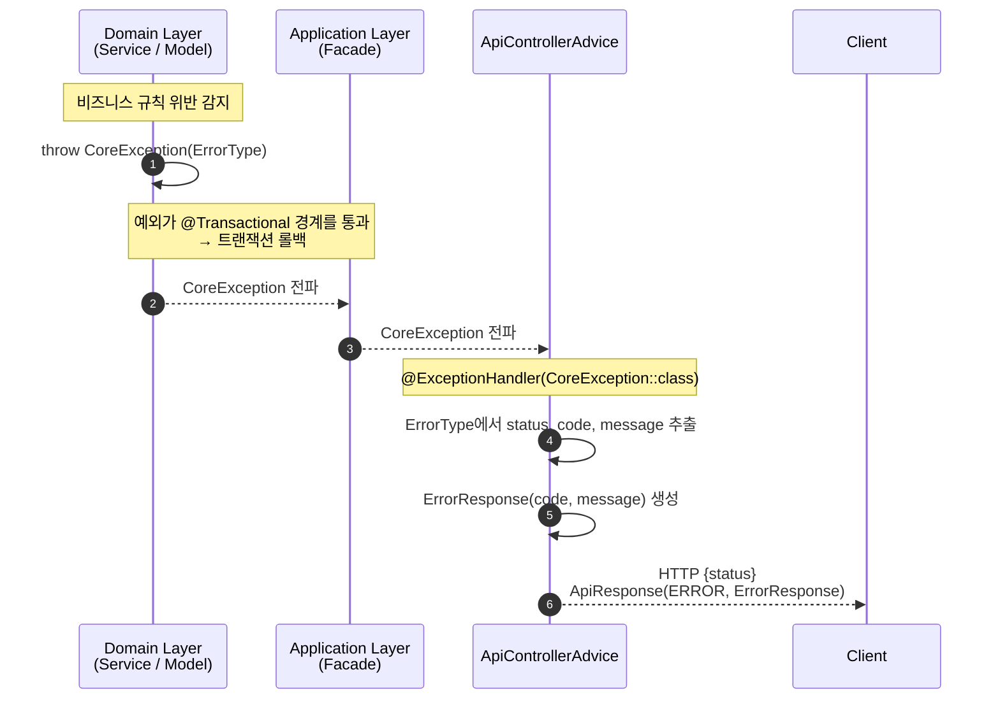
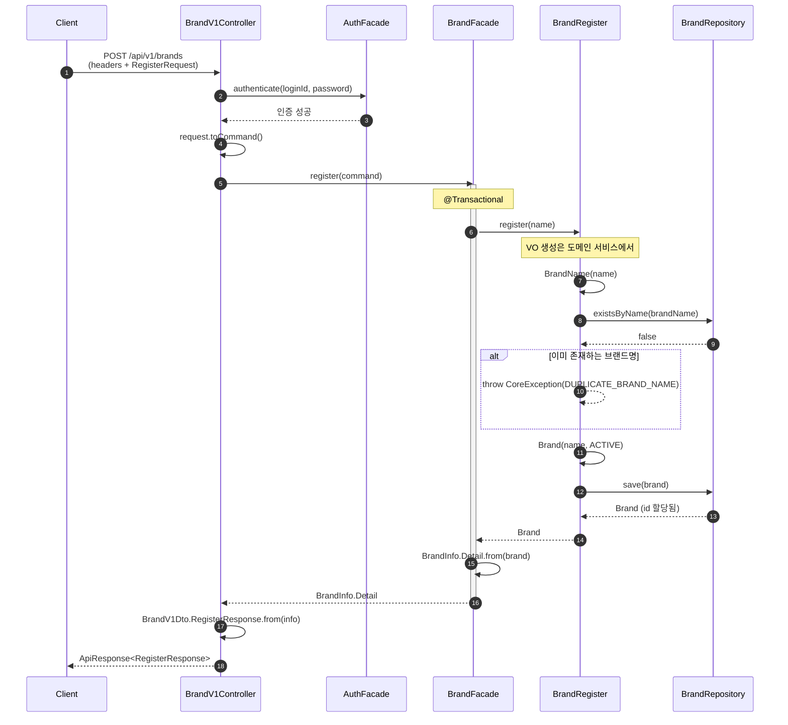
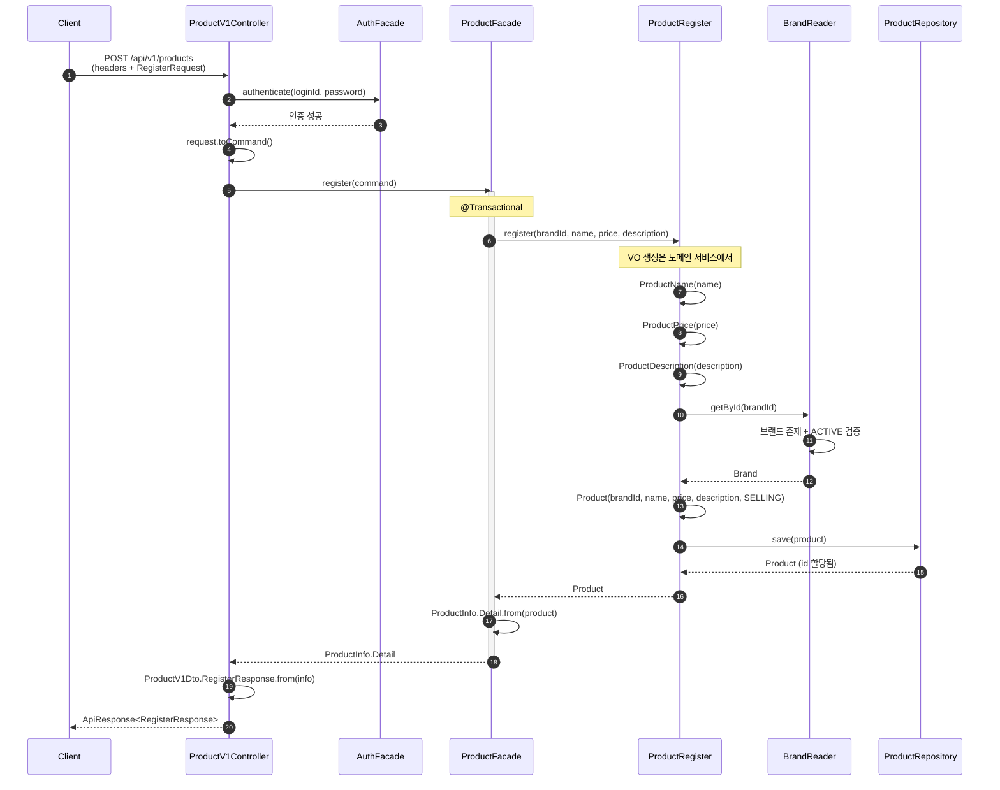
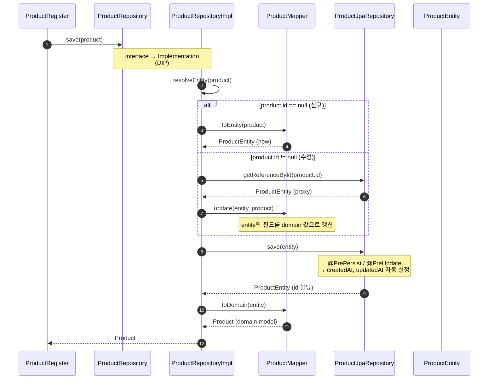
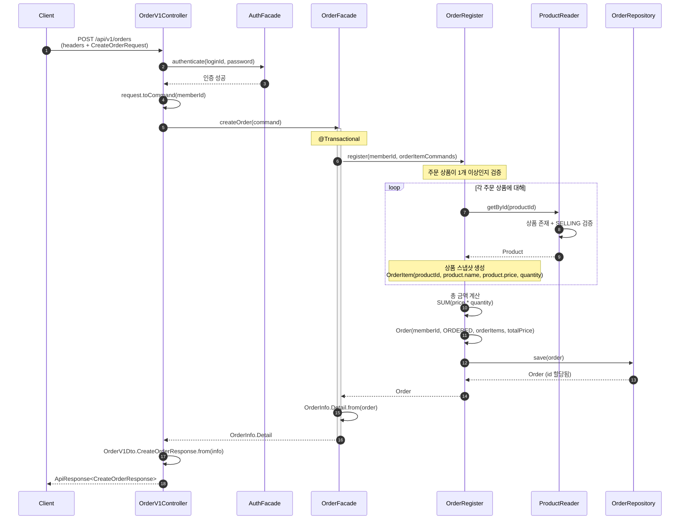
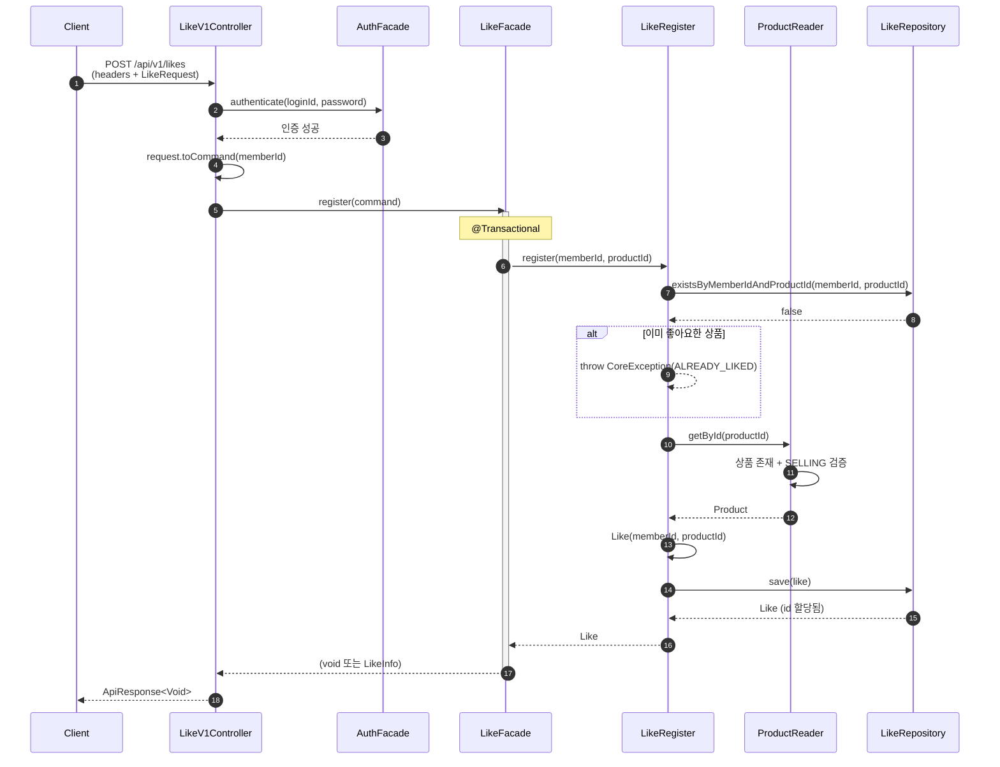
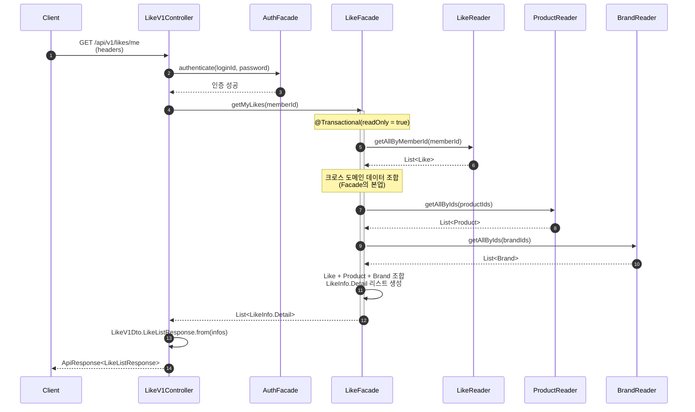
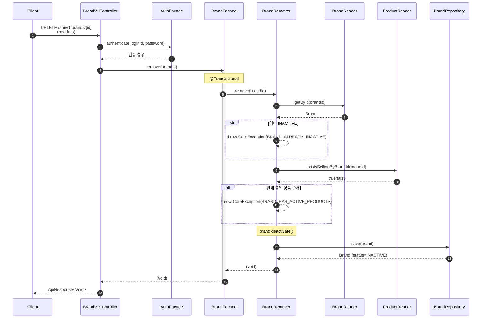
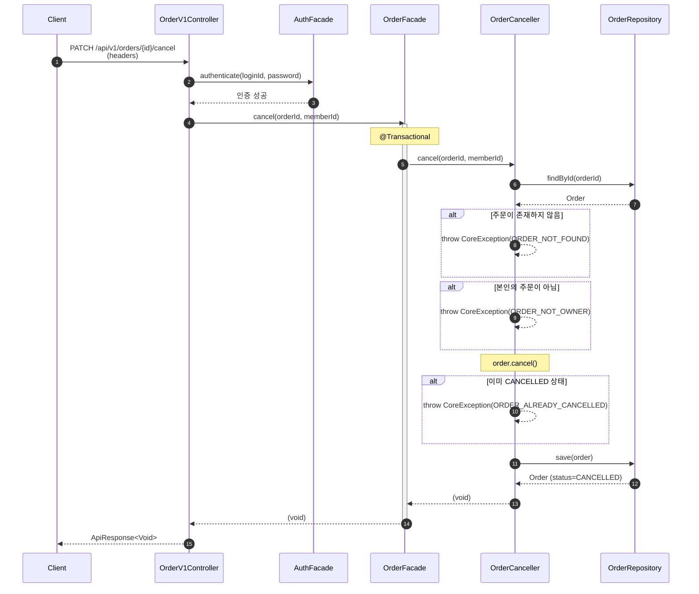

# 02. 시퀀스 다이어그램

## 개요

주요 UseCase의 호출 흐름을 시퀀스 다이어그램으로 표현합니다.
각 다이어그램에서 **책임 객체**(Controller, Facade, Service, Repository)가 명확히 드러나도록 설계합니다.

---

## 0. 에러 전파 흐름 (공통)

도메인/서비스에서 발생하는 `CoreException`이 클라이언트까지 전달되는 공통 흐름입니다.

**설계 포인트:**
- `CoreException`은 도메인/서비스 어디서든 발생 가능
- `ErrorType` enum이 HTTP 상태코드, 에러 코드, 메시지를 모두 캡슐화
- Facade의 `@Transactional`이 예외 시 자동 롤백 보장
- Controller는 예외를 잡지 않음 — `ApiControllerAdvice`가 전역 처리

---

## 1. 브랜드 등록 (Brand Registration)

브랜드명 검증 → 중복 확인 → 브랜드 생성 → 저장의 흐름입니다.

**책임 분배:**
- `Controller`: HTTP 매핑, 인증 위임, Dto↔Command 변환
- `BrandFacade`: 트랜잭션 경계, Domain→Info 변환
- `BrandRegister`: VO 생성, 중복명 검증, 브랜드 생성/저장

---

## 2. 상품 등록 (Product Registration)

브랜드 존재 검증 → 상품 생성 → 저장의 흐름입니다.

**책임 분배:**
- `Controller`: HTTP 매핑, 인증 위임, Dto↔Command 변환
- `AuthFacade`: 헤더 기반 인증
- `ProductFacade`: 트랜잭션 경계, UseCase 조합, Domain→Info 변환
- `ProductRegister`: VO 생성, 브랜드 검증, 상품 생성/저장
- `BrandReader`: 브랜드 조회 + 존재 검증

### 인프라스트럭처 레이어 상세

도메인 서비스의 `save()` 호출이 인프라 레이어에서 어떻게 처리되는지 상세 흐름입니다.

**설계 포인트:**
- `resolveEntity()` 패턴: 신규(INSERT)와 수정(UPDATE)을 하나의 `save()` 메서드로 통합
- `getReferenceById()`: 프록시 로딩으로 불필요한 SELECT 방지, dirty checking 활용
- `Mapper`: Domain ↔ Entity 양방향 변환 책임 전담

---

## 3. 주문 생성 (Order Creation)

상품 검증 → 스냅샷 생성 → 총 금액 계산 → 주문 저장의 흐름입니다.

**책임 분배:**
- `Controller`: HTTP 매핑, 인증, memberId 주입
- `OrderFacade`: 트랜잭션 경계 (Order + OrderItem 단일 트랜잭션)
- `OrderRegister`: 상품 검증, 스냅샷 생성, 금액 계산, 주문 생성
- `ProductReader`: 상품 존재/상태 검증 (다른 Aggregate 조회)

**설계 포인트:**
- OrderItem은 Order와 같은 Aggregate이므로 단일 트랜잭션에서 함께 저장
- Product는 다른 Aggregate이므로 ID 참조 + 스냅샷 복사

---

## 4. 좋아요 등록 (Like Registration)

중복 체크 → 상품 검증 → 좋아요 저장의 흐름입니다.

---

## 5. 좋아요 목록 조회 (Like List)

내 좋아요 목록을 조회하며, 크로스 도메인 데이터를 Facade에서 조합하는 핵심 흐름입니다.

**설계 포인트 (ADR: 크로스 도메인 데이터 조합):**

| 대안 | 핵심 | 얻는 것 | 잃는 것 |
|------|------|---------|---------|
| A. Repository JOIN | Like + Product + Brand 한 번에 조회 | 쿼리 1회 | 도메인 경계 파괴, Aggregate 독립성 ↓ |
| B. Facade에서 조합 | 각 Reader를 호출하여 조합 | 도메인 경계 존중, 재사용성 | N+1 가능성 (batch로 해결) |
| C. CQRS Read Model | 별도 조회 전용 모델 | 성능 최적 | 과도한 복잡성 |

**결정: B (Facade 조합)** — Use Case 조합이 Facade의 본업. `getAllByIds()` 메서드로 배치 조회하여 N+1 방지. 현재 규모에서 CQRS는 오버엔지니어링.

---

## 6. 브랜드 삭제 — Restrict 정책 (Brand Deactivation)

활성 상품 존재 여부 검증 → 비활성화의 흐름입니다.
Restrict 정책으로 인해 **상품이 있으면 삭제가 거부되는** 흐름이 핵심입니다.

**설계 포인트 (ADR: 크로스 도메인 의존):**

> **위화감**: BrandRemover가 다른 도메인의 데이터를 참조해야 한다.
> 어떻게 도메인 경계를 존중하면서 검증할 것인가?

| 대안 | 핵심 | 얻는 것 | 잃는 것 |
|------|------|---------|---------|
| A. ProductRepository 직접 참조 | BrandRemover → ProductRepository | 단순한 구현 | 도메인 간 결합 |
| B. ProductReader 서비스를 통해 간접 참조 | BrandRemover → ProductReader | 도메인 경계 존중 | 한 단계 간접 호출 추가 |
| C. 이벤트 기반 검증 | Brand 삭제 이벤트 → Product가 검증 | 완전한 분리 | 과도한 복잡성 |

**결정: B (ProductReader를 통한 간접 참조)** — 같은 application 내에서 다른 도메인 서비스를 통해 조회하는 것이 도메인 경계를 존중하면서도 적절한 복잡도를 유지한다.

---

## 7. 주문 취소 (Order Cancellation)

소유권 검증 → 상태 검증 → 취소의 흐름입니다.

**설계 포인트:**
- `order.cancel()` 행위 메서드 내에서 상태 검증을 수행 — 도메인 모델이 자신의 비즈니스 규칙을 지킨다
- 소유권 검증(`memberId` 일치)은 도메인 서비스에서 수행
