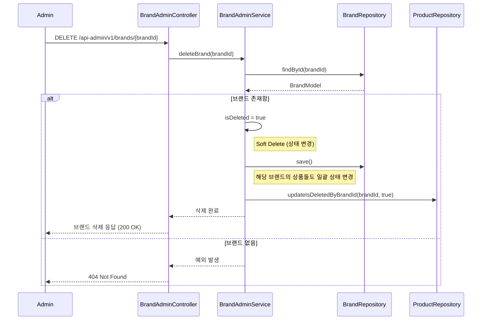

# 시퀀스 다이어그램

## 브랜드 정보 조회

사용자가 특정 브랜드의 상세 정보를 조회하는 API입니다.

BrandController가 요청을 받아 BrandService를 통해 브랜드 정보를 조회하고,
브랜드가 존재하지 않을 경우 404 에러를 반환합니다.
성공 시 브랜드의 상세 정보(이름, 로고, 설명 등)를 반환합니다.


## 상품 목록 조회

상품 목록을 페이징하여 조회하는 API입니다.

brandId 파라미터를 통해 특정 브랜드의 상품만 필터링할 수 있으며,
brandId가 없으면 전체 상품을 조회합니다.
정렬 옵션과 페이지 정보를 지정할 수 있으며, 기본값은 page=0, size=20입니다.


## 상품 정보 조회

사용자가 특정 상품의 상세 정보를 조회하는 API입니다.

ProductController가 요청을 받아 ProductService를 통해 상품 정보를 조회하고,
상품이 존재하지 않을 경우 404 에러를 반환합니다.
성공 시 상품의 상세 정보(이름, 가격, 이미지, 좋아요 수 등)를 반환합니다.


## 브랜드 & 상품 ADMIN

### 브랜드 관리 (Admin)

**1. 브랜드 목록 조회**

관리자가 전체 브랜드 목록을 페이징하여 조회하는 Admin API입니다.

삭제된 브랜드를 포함한 모든 브랜드 정보를 조회할 수 있으며,
정렬 옵션과 페이지 정보를 지정할 수 있습니다 (기본값: page=0, size=20).


**2. 브랜드 상세 조회**

관리자가 특정 브랜드의 상세 정보를 조회하는 Admin API입니다.

브랜드 ID로 조회하며, 브랜드가 존재하지 않을 경우 404 에러를 반환합니다.
성공 시 브랜드의 모든 정보(삭제 상태 포함)를 반환합니다.


**3. 브랜드 등록**

관리자가 새로운 브랜드를 등록하는 Admin API입니다.

요청 본문에 브랜드 정보(이름, 로고, 설명 등)를 포함하여 전송하고,
BrandRepository에 저장 후 생성된 브랜드 정보를 201 Created와 함께 반환합니다.


**4. 브랜드 수정**

관리자가 기존 브랜드의 정보를 수정하는 Admin API입니다.

브랜드 ID로 조회한 후 요청된 속성들을 업데이트하고 저장합니다.
브랜드가 존재하지 않으면 404 에러를 반환하고,
성공 시 수정된 브랜드 정보를 200 OK와 함께 반환합니다.


**5. 브랜드 삭제**

관리자가 브랜드를 삭제하는 Admin API입니다.

Soft Delete 방식으로 isDeleted 플래그를 true로 변경하여 논리적으로 삭제합니다.
브랜드 삭제 시 해당 브랜드의 모든 상품도 자동으로 삭제 상태로 변경됩니다.
브랜드가 존재하지 않으면 404 에러를, 성공 시 200 OK를 반환합니다.



### 상품 관리 (Admin)

**1. 상품 목록 조회**

관리자가 상품 목록을 페이징하여 조회하는 Admin API입니다.

brandId 파라미터로 특정 브랜드의 상품만 필터링할 수 있으며, 이 경우 브랜드 존재 여부를 먼저 확인합니다.

브랜드가 없으면 404 에러를 반환하고, 성공 시 삭제된 상품을 포함한 목록을 반환합니다.
brandId가 없으면 전체 상품을 조회합니다 (기본값: page=0, size=20).


**2. 상품 상세 조회**

관리자가 특정 상품의 상세 정보를 조회하는 Admin API입니다.

상품 ID로 조회하며, 상품이 존재하지 않을 경우 404 에러를 반환합니다.\
성공 시 상품의 모든 정보(삭제 상태 포함)를 반환합니다.


**3. 상품 등록**

관리자가 새로운 상품을 등록하는 Admin API입니다.

요청 본문에 상품 정보와 브랜드 ID를 포함하여 전송하며, 브랜드 존재 여부를 먼저 확인합니다.\
브랜드가 없으면 400/404 에러를 반환하고,
브랜드가 있으면 상품을 저장 후 등록된 상품 정보를 200 OK와 함께 반환합니다.


**4. 상품 정보 수정**

관리자가 기존 상품의 정보를 수정하는 Admin API입니다.

상품 ID로 조회한 후 요청된 속성들을 업데이트하고 저장합니다.
브랜드 정보는 수정할 수 없으며 기존 값을 유지합니다.\
상품이 존재하지 않으면 404 에러를, 성공 시 수정된 상품 정보를 200 OK와 함께 반환합니다.


**5. 상품 삭제**

관리자가 상품을 삭제하는 Admin API입니다.

Soft Delete 방식으로 isDeleted 플래그를 true로 변경하여 논리적으로 삭제합니다.\
상품이 존재하지 않으면 404 에러를, 성공 시 200 OK를 반환합니다.


## 좋아요 (Likes)

**1. 상품 좋아요 등록**

사용자가 상품에 좋아요를 추가하는 API입니다.

먼저 상품 존재 여부를 확인하고, 상품이 없으면 404 에러를 반환합니다.\
이미 좋아요를 했다면 추가 작업 없이 성공을 반환하고,
좋아요를 하지 않았다면 LikeModel을 저장하고 상품의 좋아요 수를 1 증가시킵니다.


**2. 상품 좋아요 취소**

사용자가 상품의 좋아요를 취소하는 API입니다.

사용자와 상품 ID로 좋아요 정보를 조회하고,
좋아요 정보가 존재하면 삭제 후 상품의 좋아요 수를 1 감소시킵니다.\
좋아요 정보가 없으면 404 에러를, 성공 시 200 OK를 반환합니다.


**3. 좋아요 한 상품 목록 조회**

사용자가 자신이 좋아요 한 상품 목록을 페이징하여 조회하는 API입니다.

사용자 ID로 좋아요 목록을 먼저 조회한 후,
해당하는 상품 ID들로 실제 상품 정보를 조회하여 반환합니다.\
페이징 정보를 포함한 상품 목록을 200 OK와 함께 반환합니다.


## 주문 (Orders)

**1. 주문 요청**

사용자가 상품을 주문하는 API입니다.

주문할 각 상품에 대해 존재 여부와 재고를 확인하고, 재고가 부족하면 400 에러를 반환합니다.\
재고가 충분하면 재고를 차감하고 주문 상세 정보(스냅샷)을 생성합니다.\
모든 상품 검증이 완료되면 OrderModel을 저장하고 201 Created와 함께 생성된 주문 정보를 반환합니다.\
상품이 존재하지 않으면 404 에러를 반환합니다.


**2. 유저의 주문 목록 조회**

사용자가 자신의 주문 목록을 조회하는 API입니다.

startAt과 endAt 파라미터로 기간을 지정할 수 있으며,
지정된 기간 내의 주문 목록을 페이징하여 반환합니다.\
주문 목록을 200 OK와 함께 반환합니다.


**3. 단일 주문 상세 조회**

사용자가 특정 주문의 상세 정보를 조회하는 API입니다.

주문 ID로 주문 정보를 조회하며, 주문이 존재하지 않으면 404 에러를 반환합니다.\
성공 시 주문 상세 정보(주문 상품, 수량, 가격 등)를 반환합니다.


### 주문 관리 (Order Admin)

**1. 주문 목록 조회**

관리자가 전체 주문 목록을 페이징하여 조회하는 Admin API입니다.

모든 사용자의 주문 정보를 조회할 수 있으며,
페이지 정보를 지정할 수 있습니다 (기본값: page=0, size=20).
주문 목록을 200 OK와 함께 반환합니다.


**2. 단일 주문 상세 조회**

관리자가 특정 주문의 상세 정보를 조회하는 Admin API입니다.

주문 ID로 주문 정보를 조회하며, 주문이 존재하지 않으면 404 에러를 반환합니다.\
성공 시 주문 상세 정보(사용자 정보, 주문 상품, 수량, 가격 등)를 200 OK와 함께 반환합니다.

```mermaid
sequenceDiagram
    participant Admin
    participant OrderAdminController
    participant OrderAdminService
    participant OrderRepository

    Admin ->> OrderAdminController: GET /api-admin/v1/orders/{orderId}
    OrderAdminController ->> OrderAdminService: getOrder(orderId)
    OrderAdminService ->> OrderRepository: findByOrderId(orderId)

    alt 주문 존재함
        OrderRepository -->> OrderAdminService: OrderModel
        OrderAdminService -->> OrderAdminController: 주문 상세 정보
        OrderAdminController -->> Admin: 주문 상세 정보 응답 (200 OK)
    else 주문 없음
        OrderRepository -->> OrderAdminService: null
        OrderAdminService -->> OrderAdminController: 예외 발생
        OrderAdminController -->> Admin: 404 Not Found
    end
```