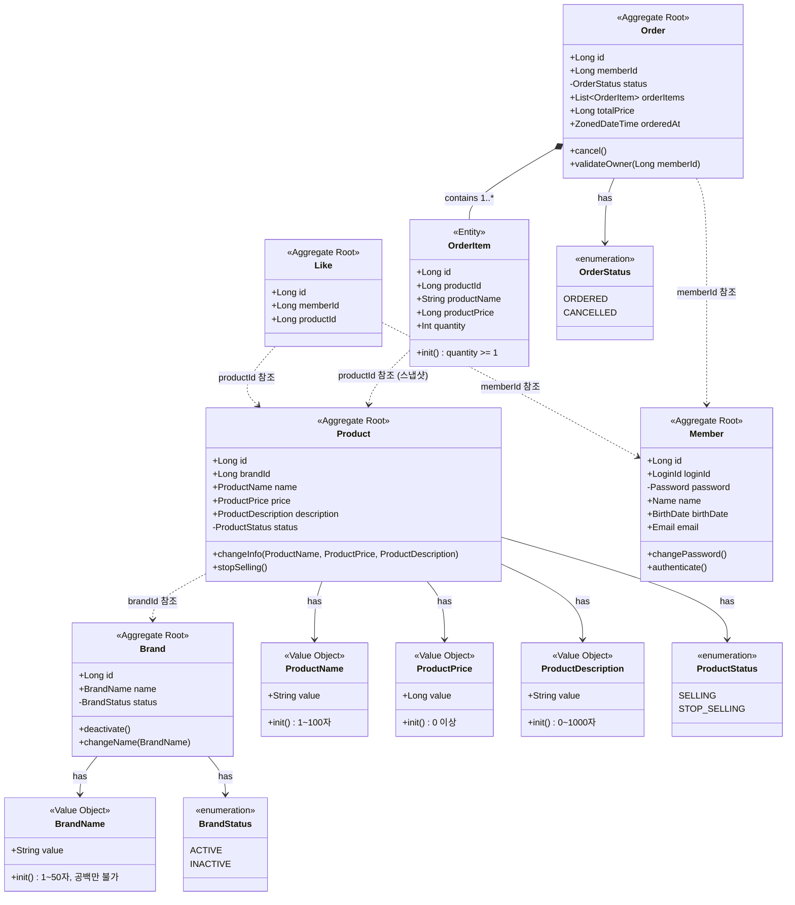
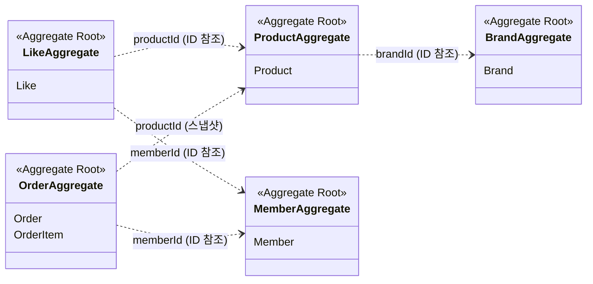
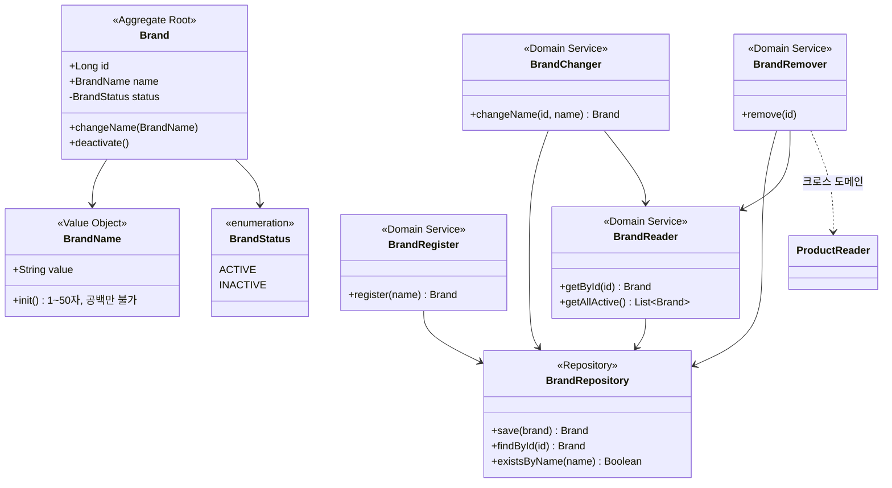
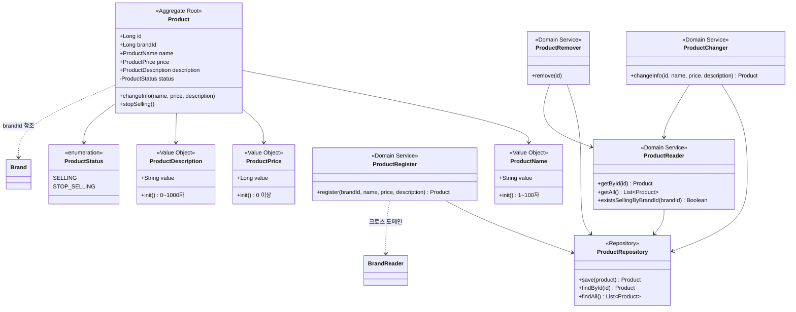
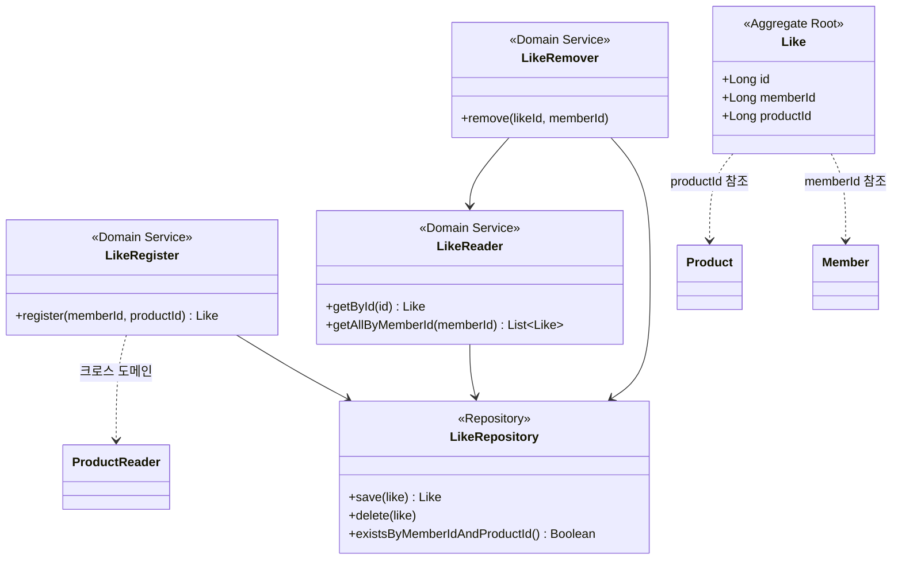
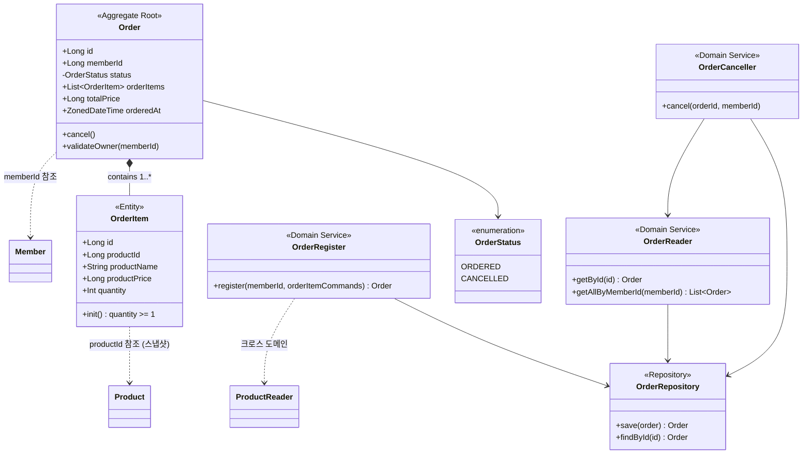

# 03. 클래스 다이어그램 (도메인 객체 설계)

## 개요

4개 도메인(Brand, Product, Like, Order)의 **도메인 모델 구조**를 설계합니다.
Aggregate Root, Value Object, Enum의 관계와 책임을 클래스 다이어그램으로 표현합니다.

---

## 전체 도메인 클래스 다이어그램

---

## Aggregate 경계

| Aggregate | Root | 내부 Entity | 외부 참조 (ID) | 참조 방식 |
|-----------|------|-------------|----------------|-----------|
| Brand | Brand | - | - | - |
| Product | Product | - | Brand | `brandId: Long` |
| Like | Like | - | Member, Product | `memberId`, `productId` |
| Order | Order | OrderItem | Member, Product | ID + 스냅샷 |
| Member | Member | - | - | - |

---

## 도메인별 상세 설계

### 1. Brand Aggregate

#### Value Objects

| VO | 필드 | 검증 규칙 | ErrorType |
|----|------|----------|-----------|
| `BrandName` | `value: String` | 1~50자, 공백만 불가 | `INVALID_BRAND_NAME_FORMAT` |

#### Domain Model: Brand

| 구분 | 필드/메서드 | 설명 |
|------|-----------|------|
| 불변 필드 | `id: Long?` | 식별자 (영속화 전 null) |
| 가변 필드 | `name: BrandName` | 브랜드명 (수정 가능) |
| 가변 필드 | `status: BrandStatus` | 상태 (ACTIVE / INACTIVE) |
| 행위 | `changeName(newName)` | 브랜드명 변경 |
| 행위 | `deactivate()` | 비활성화 (이미 INACTIVE면 예외) |

**불변식:**
- `deactivate()` 호출 시 이미 `INACTIVE`이면 `BRAND_ALREADY_INACTIVE` 예외

#### Domain Services

| 서비스 | 책임 | 의존 |
|--------|------|------|
| `BrandRegister` | VO 생성, 중복명 검증, 브랜드 생성/저장 | BrandRepository |
| `BrandReader` | 브랜드 조회, 존재 검증 | BrandRepository |
| `BrandChanger` | 브랜드명 변경 | BrandRepository, BrandReader |
| `BrandRemover` | 활성 상품 검증, 비활성화 | BrandRepository, BrandReader, ProductReader |

#### Repository Interface

| 메서드 | 반환 |
|--------|------|
| `save(brand)` | `Brand` |
| `findById(id)` | `Brand?` |
| `findByName(name)` | `Brand?` |
| `existsByName(name)` | `Boolean` |
| `findAllByStatus(status)` | `List<Brand>` |

---

### 2. Product Aggregate

#### Value Objects

| VO | 필드 | 검증 규칙 | ErrorType |
|----|------|----------|-----------|
| `ProductName` | `value: String` | 1~100자, 공백만 불가 | `INVALID_PRODUCT_NAME_FORMAT` |
| `ProductPrice` | `value: Long` | 0 이상 | `INVALID_PRODUCT_PRICE` |
| `ProductDescription` | `value: String` | 0~1000자 | `INVALID_PRODUCT_DESCRIPTION_LENGTH` |

#### Domain Model: Product

| 구분 | 필드/메서드 | 설명 |
|------|-----------|------|
| 불변 필드 | `id: Long?` | 식별자 |
| 불변 필드 | `brandId: Long` | 소속 브랜드 (변경 불가) |
| 가변 필드 | `name: ProductName` | 상품명 |
| 가변 필드 | `price: ProductPrice` | 가격 |
| 가변 필드 | `description: ProductDescription` | 설명 |
| 가변 필드 | `status: ProductStatus` | 상태 (SELLING / STOP_SELLING) |
| 행위 | `changeInfo(name, price, description)` | 이름/가격/설명 일괄 변경 |
| 행위 | `stopSelling()` | 판매 중지 (이미 중지면 예외) |

**불변식:**
- `brandId`는 생성 후 변경 불가 (상품의 소속 브랜드는 고정)
- `stopSelling()` 호출 시 이미 `STOP_SELLING`이면 `PRODUCT_ALREADY_STOP_SELLING` 예외

**설계 결정:**
- `changeInfo()` 메서드로 이름/가격/설명을 한 번에 변경 — 부분 수정이 아닌 단일 행위로 표현

#### Domain Services

| 서비스 | 책임 | 의존 |
|--------|------|------|
| `ProductRegister` | VO 생성, 브랜드 존재 검증, 상품 생성/저장 | ProductRepository, BrandReader |
| `ProductReader` | 상품 조회, 존재/상태 검증 | ProductRepository |
| `ProductChanger` | 상품 정보 변경 | ProductRepository, ProductReader |
| `ProductRemover` | 판매 중지 처리 | ProductRepository, ProductReader |

#### Repository Interface

| 메서드 | 반환 |
|--------|------|
| `save(product)` | `Product` |
| `findById(id)` | `Product?` |
| `findAll()` | `List<Product>` |
| `findAllByBrandId(brandId)` | `List<Product>` |
| `existsByBrandIdAndStatus(brandId, status)` | `Boolean` |

---

### 3. Like Aggregate

#### Domain Model: Like

| 구분 | 필드/메서드 | 설명 |
|------|-----------|------|
| 불변 필드 | `id: Long?` | 식별자 |
| 불변 필드 | `memberId: Long` | 회원 ID |
| 불변 필드 | `productId: Long` | 상품 ID |

> **DDR: Like 모델에 VO가 없는 이유**
>
> **위화감**: Like 모델에 VO가 없고, 행위 메서드도 없다. 너무 빈약한 도메인 아닌가?
>
> **근본 원인**: Like는 "관계"를 표현하는 도메인이다. memberId + productId 조합 자체가 의미이며, 별도의 비즈니스 규칙(포맷 검증, 상태 변경)이 없다.
>
> **결정**: 불필요한 VO 포장은 과도한 추상화. 중복 방지, 소유권 검증 등 규칙은 Domain Service에서 담당한다.

#### Domain Services

| 서비스 | 책임 | 의존 |
|--------|------|------|
| `LikeRegister` | 중복 좋아요 검증, 상품 존재/판매중 검증, 저장 | LikeRepository, ProductReader |
| `LikeRemover` | 소유권 검증, 삭제 (Hard Delete) | LikeRepository, LikeReader |
| `LikeReader` | 좋아요 조회 | LikeRepository |

#### Repository Interface

| 메서드 | 반환 |
|--------|------|
| `save(like)` | `Like` |
| `delete(like)` | `void` |
| `findById(id)` | `Like?` |
| `findAllByMemberId(memberId)` | `List<Like>` |
| `existsByMemberIdAndProductId(memberId, productId)` | `Boolean` |

---

### 4. Order Aggregate

#### Value Objects / Enums

| 타입 | 값 | 설명 |
|------|---|------|
| `OrderStatus` (enum) | `ORDERED`, `CANCELLED` | 주문 상태 |

#### Domain Model: Order (Aggregate Root)

| 구분 | 필드/메서드 | 설명 |
|------|-----------|------|
| 불변 필드 | `id: Long?` | 식별자 |
| 불변 필드 | `memberId: Long` | 주문자 ID |
| 불변 필드 | `orderItems: List<OrderItem>` | 주문 상품 목록 (1개 이상) |
| 불변 필드 | `totalPrice: Long` | 총 금액 |
| 불변 필드 | `orderedAt: ZonedDateTime` | 주문 시각 |
| 가변 필드 | `status: OrderStatus` | 상태 |
| 행위 | `cancel()` | 주문 취소 (이미 취소면 예외) |
| 행위 | `validateOwner(memberId)` | 소유권 검증 (불일치 시 예외) |

**불변식:**
- `cancel()` 호출 시 이미 `CANCELLED`이면 `ORDER_ALREADY_CANCELLED` 예외
- `validateOwner()` 불일치 시 `ORDER_NOT_OWNER` 예외

#### Domain Model: OrderItem (내부 Entity)

| 구분 | 필드/메서드 | 설명 |
|------|-----------|------|
| 불변 필드 | `id: Long?` | 식별자 |
| 불변 필드 | `productId: Long` | 원본 상품 ID (추적용) |
| 불변 필드 | `productName: String` | 주문 시점 상품명 (스냅샷) |
| 불변 필드 | `productPrice: Long` | 주문 시점 가격 (스냅샷) |
| 불변 필드 | `quantity: Int` | 주문 수량 (1 이상) |

**불변식:**
- `quantity`는 1 이상 (`init` 블록에서 검증)

> **DDR: OrderItem 스냅샷의 VO 미적용**
>
> | 관점 | 설명 |
> |------|------|
> | 현재 설계 | `productName: String`, `productPrice: Long` — primitive 타입 |
> | 대안 | `ProductName`, `ProductPrice` VO 적용 |
> | **결정** | **VO 미적용** |
> | 근거 | 이미 Product VO에서 검증된 과거 시점의 값을 다시 검증할 필요 없음 |
> | 리스크 | 스냅샷 데이터에 VO를 적용하면 과거 규칙 변경 시 기존 주문 데이터를 로딩할 수 없게 되는 위험 |

> **DDR: totalPrice 저장 vs 계산**
>
> | 대안 | 장점 | 단점 |
> |------|------|------|
> | A. 저장 (비정규화) | 목록 조회 성능, 주문 불변성 | 이중 비정규화 |
> | B. 계산 (정규화) | 정규화 원칙 | 목록 조회 시 JOIN 필요 |
>
> **결정: A (저장)** — 주문은 수정이 없으므로 비정규화의 리스크(데이터 불일치)가 없음. 목록 조회에서 totalPrice가 필요하므로 성능 이점.

#### Domain Services

| 서비스 | 책임 | 의존 |
|--------|------|------|
| `OrderRegister` | 상품 검증, 스냅샷 생성, 금액 계산, 주문 생성 | OrderRepository, ProductReader |
| `OrderReader` | 주문 조회 | OrderRepository |
| `OrderCanceller` | 소유권 검증, 상태 검증, 취소 | OrderRepository, OrderReader |

#### Repository Interface

| 메서드 | 반환 |
|--------|------|
| `save(order)` | `Order` |
| `findById(id)` | `Order?` |
| `findAllByMemberId(memberId)` | `List<Order>` |

---

## 크로스 도메인 의존 (DDR)

### BrandRemover → ProductReader

> **위화감**: BrandRemover가 다른 도메인의 데이터를 참조해야 한다.

| 대안 | 얻는 것 | 잃는 것 |
|------|---------|---------|
| A. ProductRepository 직접 참조 | 단순한 구현 | 도메인 간 결합 |
| **B. ProductReader 서비스를 통해 간접 참조** | 도메인 경계 존중 | 한 단계 간접 호출 |
| C. 이벤트 기반 검증 | 완전한 분리 | 과도한 복잡성 |

**결정: B** — 같은 application 내에서 다른 도메인 서비스를 통해 조회하는 것이 도메인 경계를 존중하면서도 적절한 복잡도를 유지.

### Like 목록 크로스 도메인 조합

> **위화감**: 좋아요 목록 조회 시 Like + Product + Brand 3개 도메인 데이터가 필요하다.

| 대안 | 얻는 것 | 잃는 것 |
|------|---------|---------|
| **A. Facade에서 Reader 조합** | Aggregate 경계 존중, 재사용성 | N+1 가능성 (batch로 해결) |
| B. Like Repository에서 JOIN | 단일 쿼리 성능 | 도메인 경계 파괴 |
| C. CQRS Read Model | 성능 최적 | 과도한 복잡성 |

**결정: A** — Use Case 조합이 Facade의 본업. `getAllByIds()` 메서드로 배치 조회하여 N+1 방지.
