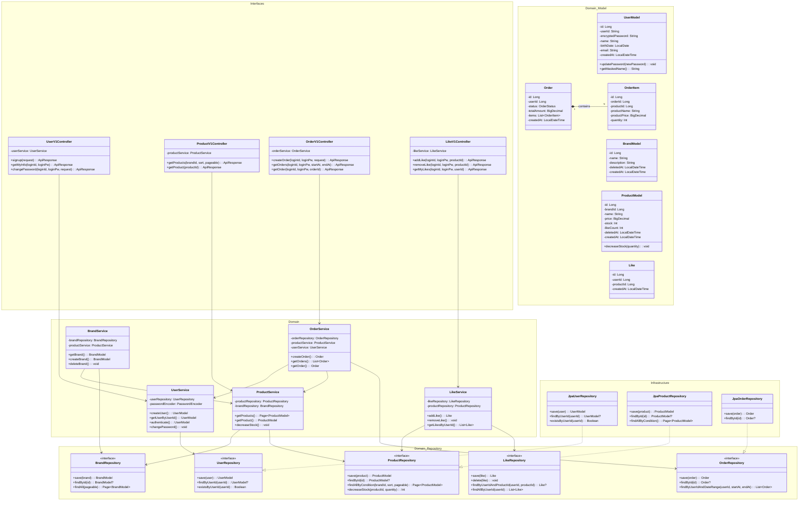
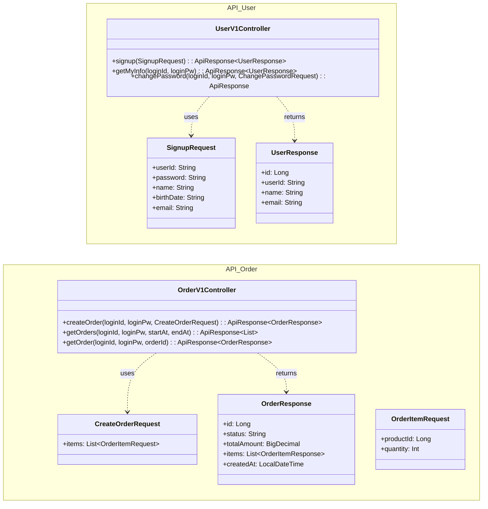
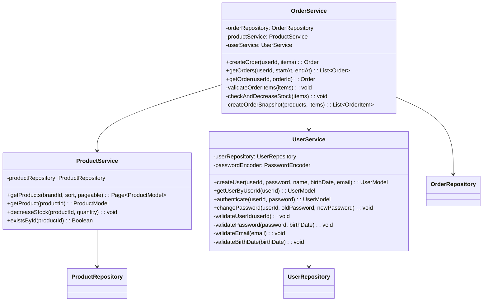
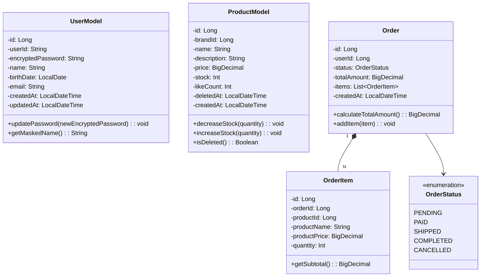
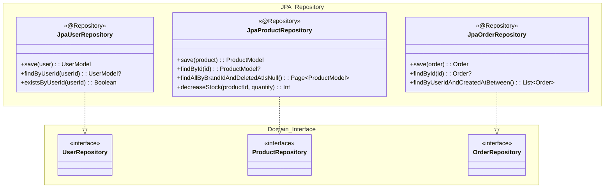
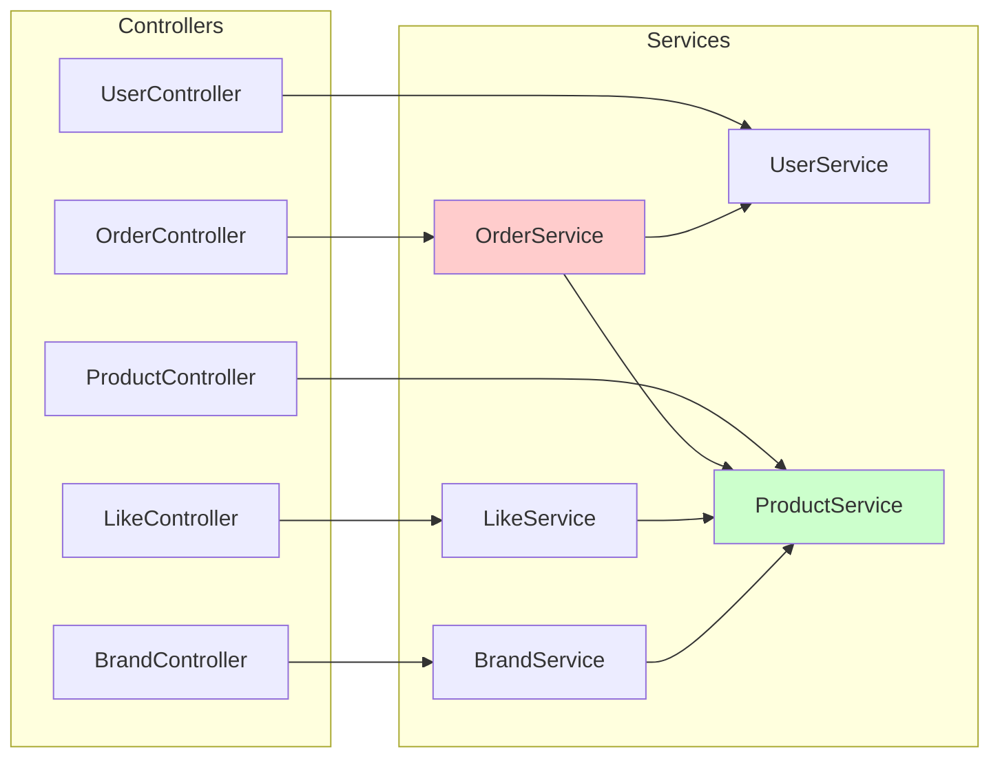
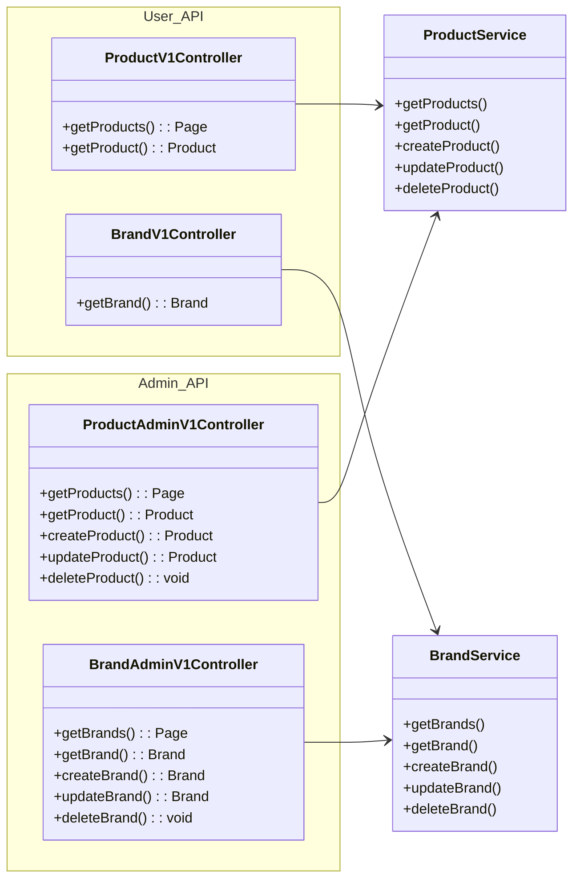
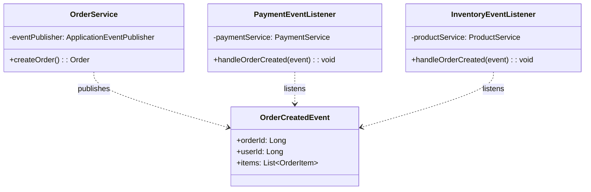

# 클래스 다이어그램: Loopers E-Commerce

---

## 1. 전체 아키텍처 구조

### 목적
- 레이어드 아키텍처의 계층 분리 확인
- 의존 방향 검증 (상위 → 하위, Domain은 독립)

### 다이어그램

### 📌 주요 확인 포인트

1. **의존 방향**: Controller → Service → Repository (단방향)
2. **Repository 인터페이스**: Domain에 정의, Infrastructure에서 구현
3. **도메인 모델 독립성**: Model 클래스는 외부 의존 없음
4. **서비스 간 의존**: OrderService → ProductService (재고 차감)

### 설계 의도
- 레이어드 아키텍처로 관심사 분리
- Repository 인터페이스를 통해 Infrastructure 교체 가능
- Domain 레이어는 프레임워크 독립적

---

## 2. 계층별 책임

### 2.1 Interfaces 계층

**책임:**
- HTTP 요청/응답 처리
- DTO ↔ Domain Model 변환
- 인증 헤더 파싱 및 전달
- API 문서화 (Swagger)

---

### 2.2 Domain 계층

**책임:**
- 비즈니스 로직 수행
- 유효성 검증 (도메인 규칙)
- 트랜잭션 관리
- 도메인 이벤트 발행 (확장 시)

---

### 2.3 Domain Model

**책임:**
- 도메인 불변식(invariant) 보장
- 자체 상태 변경 로직 캡슐화
- 비즈니스 의미를 가진 메서드 제공

---

### 2.4 Infrastructure 계층

**책임:**
- Repository 인터페이스 구현
- JPA/DB 기술 세부사항 캡슐화
- 쿼리 최적화

---

## 3. 의존 관계 설명

### 3.1 서비스 간 의존

**의존 방향 원칙:**
- OrderService → ProductService: 주문 시 상품 조회/재고 차감
- OrderService → UserService: 주문자 인증 확인
- LikeService → ProductService: 좋아요 대상 상품 존재 확인
- BrandService → ProductService: 브랜드 삭제 시 상품 연쇄 처리

**순환 의존 방지:**
- ProductService는 다른 서비스에 의존하지 않음 (하위 레벨)
- UserService는 다른 서비스에 의존하지 않음 (하위 레벨)

---

### 3.2 Admin vs User 컨트롤러 분리

**설계 의도:**
- API prefix로 구분: `/api/v1` vs `/api-admin/v1`
- 동일한 Service 공유, Controller에서 권한 체크
- 응답 DTO는 역할에 따라 다를 수 있음 (Admin은 더 많은 정보)

---

## 4. 확장 고려사항

### 4.1 이벤트 기반 확장

**확장 포인트:**
- 주문 생성 시 `OrderCreatedEvent` 발행
- 결제, 재고, 알림 등이 이벤트 구독
- 서비스 간 직접 의존 제거

---

**문서 작성일**: 2026-02-11
**버전**: 1.0
