# 클래스 다이어그램: Loopers E-Commerce

---

## 0. 도메인 모델 설계

### 0.1 Aggregate 경계

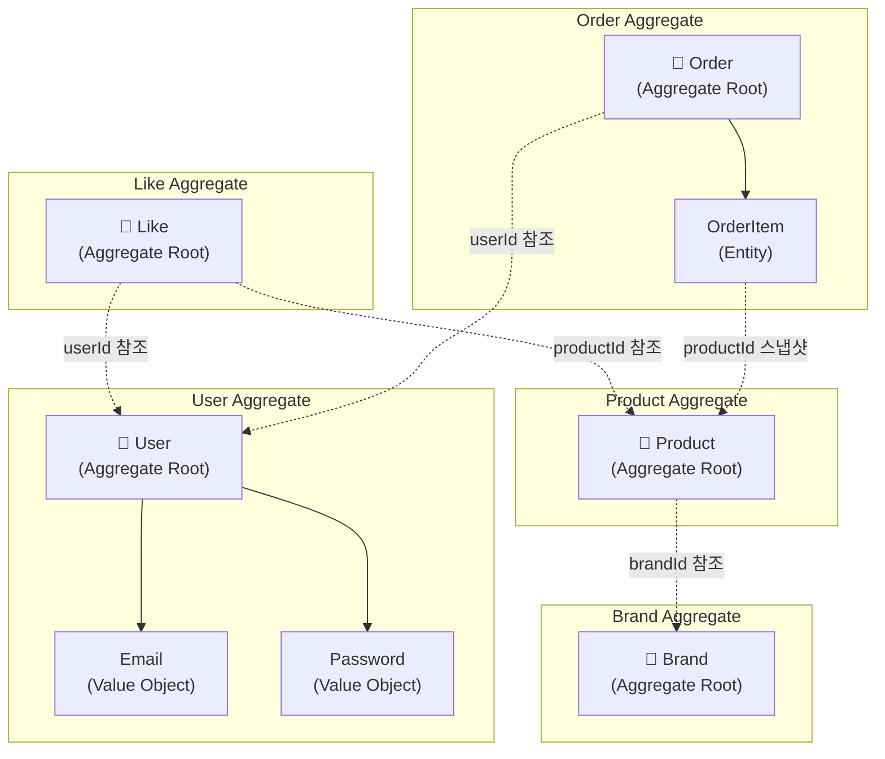

**Aggregate 설계 원칙:**

| Aggregate | Root | 경계 내 Entity/VO | Invariant (불변식) |
|-----------|------|-------------------|-------------------|
| User | User | Email, Password | userId 유일, 비밀번호 정책 준수, name 비어있지 않음 |
| Brand | Brand | - | name 필수 |
| Product | Product | - | brandId 필수, price >= 0, stock >= 0 |
| Like | Like | - | (userId, productId) 유일 |
| Order | Order | OrderItem[] | 최소 1개 주문상품, totalAmount = Σ(item.amount) |

---

### 0.2 Value Object 설계

Value Object는 **불변(Immutable)**이며 **자가 검증(Self-Validating)**합니다.

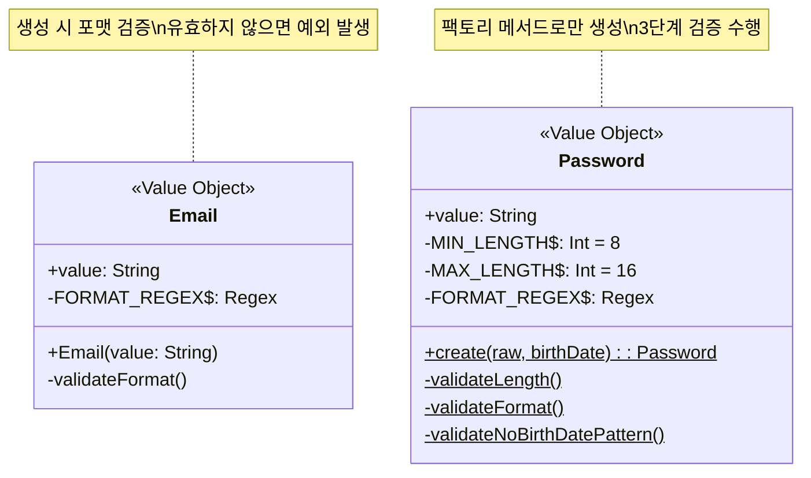

**Value Object 검증 규칙:**

| VO | 검증 | 규칙 |
|----|------|------|
| Email | 포맷 | `^[A-Za-z0-9+_.-]+@[A-Za-z0-9.-]+$` |
| Password | 길이 | 8~16자 |
| Password | 포맷 | 영문 대소문자 + 숫자 + 특수문자 |
| Password | 생년월일 | yyyyMMdd, yyMMdd, MMdd 패턴 불포함 |

---

### 0.3 Domain Entity vs JPA Entity 분리

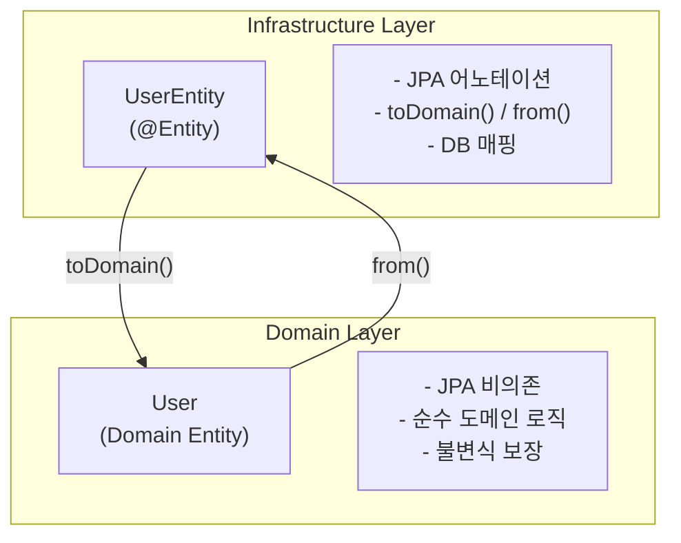

**분리 이유:**
- Domain Entity는 프레임워크 독립적
- JPA 변경이 도메인에 영향을 주지 않음
- 테스트 용이성 (JPA 없이 도메인 테스트 가능)

---

### 0.4 Domain Events (향후 확장)

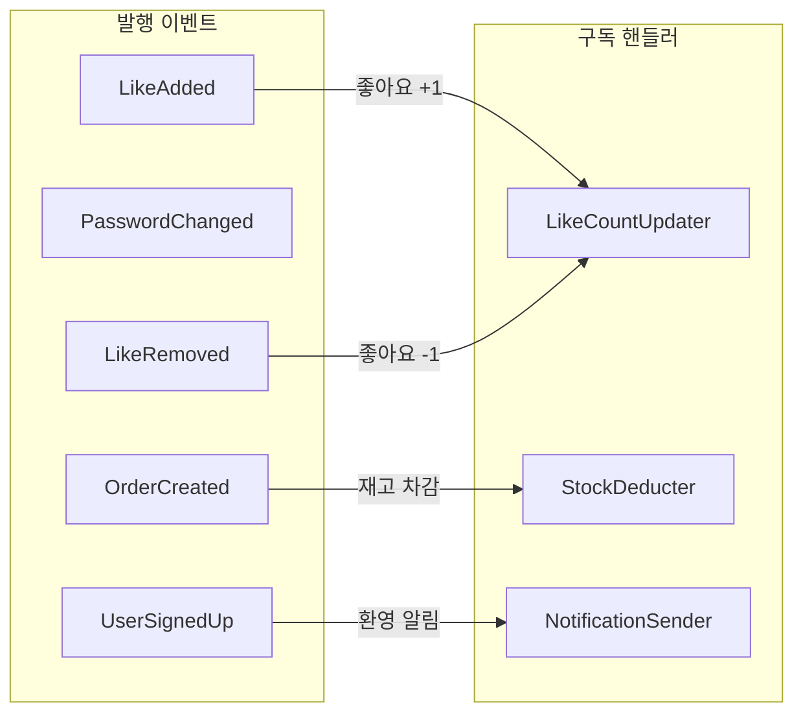

> **Note:** MVP에서는 동기식 처리. 트래픽 증가 시 이벤트 기반 비동기로 전환 예정.

---

## 1. 전체 아키텍처 구조

### 목적
- 레이어드 아키텍처의 계층 분리 확인
- 의존 방향 검증 (상위 → 하위, Domain은 독립)

### 다이어그램

```mermaid
classDiagram
    direction TB

    namespace Interfaces {
        class UserV1Controller {
            -authFacade: AuthFacade
            -likeService: LikeService
            +signup(request): ApiResponse
            +getMyInfo(loginId, loginPw): ApiResponse
            +changePassword(loginId, loginPw, request): ApiResponse
            +getMyLikes(loginId, loginPw, userId): ApiResponse
        }
        class ProductV1Controller {
            -authFacade: AuthFacade
            -productService: ProductService
            -likeService: LikeService
            +getProducts(brandId, sort, pageable): ApiResponse
            +getProduct(productId): ApiResponse
            +addLike(loginId, loginPw, productId): ApiResponse
            +removeLike(loginId, loginPw, productId): ApiResponse
        }
        class OrderV1Controller {
            -authFacade: AuthFacade
            -orderService: OrderService
            +createOrder(loginId, loginPw, request): ApiResponse
            +getOrders(loginId, loginPw, startAt, endAt): ApiResponse
            +getOrder(loginId, loginPw, orderId): ApiResponse
        }
    }

    namespace Application {
        class AuthFacade {
            -userService: UserService
            -passwordEncoder: PasswordEncoder
            +signup(userId, rawPw, name, birthDate, email): User
            +authenticate(loginId, loginPw): User
            +changePassword(userId, oldPw, newPw): void
        }
    }

    namespace Domain {
        class UserService {
            -userRepository: UserRepository
            +createUser(userId, encryptedPw, name, birthDate, email): User
            +findByUserId(userId): User?
            +getUserByUserId(userId): User
            +save(user): User
        }
        class ProductService {
            -productRepository: ProductRepository
            -brandRepository: BrandRepository
            +getProducts(): Page~ProductModel~
            +getProduct(): ProductModel
            +createProduct(): ProductModel
            +updateProduct(): ProductModel
            +deleteProduct(): void
            +decreaseStock(): void
        }
        class OrderService {
            -orderRepository: OrderRepository
            -productService: ProductService
            -userService: UserService
            +createOrder(): Order
            +getOrders(): List~Order~
            +getOrder(): Order
        }
        class LikeService {
            -likeRepository: LikeRepository
            -productRepository: ProductRepository
            +addLike(): Like
            +removeLike(): void
            +getLikesByUserId(): List~Like~
        }
        class BrandService {
            -brandRepository: BrandRepository
            -productService: ProductService
            +getBrands(): Page~BrandModel~
            +getBrand(): BrandModel
            +createBrand(): BrandModel
            +updateBrand(): BrandModel
            +deleteBrand(): void
        }
    }

    namespace Domain_Model {
        class User {
            -id: Long
            -userId: String
            -encryptedPassword: String
            -name: String
            -birthDate: LocalDate
            -email: String
            -createdAt: LocalDateTime
            +updatePassword(newPassword): void
            +getMaskedName(): String
        }
        class BrandModel {
            -id: Long
            -name: String
            -description: String
            -deletedAt: LocalDateTime
            -createdAt: LocalDateTime
        }
        class ProductModel {
            -id: Long
            -brandId: Long
            -name: String
            -price: BigDecimal
            -stock: Int
            -likeCount: Int
            -deletedAt: LocalDateTime
            -createdAt: LocalDateTime
            +decreaseStock(quantity): void
        }
        class Order {
            -id: Long
            -userId: Long
            -status: OrderStatus
            -totalAmount: BigDecimal
            -items: List~OrderItem~
            -createdAt: LocalDateTime
        }
        class OrderItem {
            -id: Long
            -orderId: Long
            -productId: Long
            -productName: String
            -productPrice: BigDecimal
            -quantity: Int
        }
        class Like {
            -id: Long
            -userId: Long
            -productId: Long
            -createdAt: LocalDateTime
        }
    }

    namespace Domain_Repository {
        class UserRepository {
            <<interface>>
            +save(user): User
            +findByUserId(userId): User?
            +existsByUserId(userId): Boolean
        }
        class BrandRepository {
            <<interface>>
            +save(brand): BrandModel
            +findById(id): BrandModel?
            +findAll(pageable): Page~BrandModel~
            +existsByName(name): Boolean
        }
        class ProductRepository {
            <<interface>>
            +save(product): ProductModel
            +findById(id): ProductModel?
            +findAllByCondition(brandId, sort, pageable): Page~ProductModel~
            +decreaseStock(productId, quantity): Int
            +increaseLikeCount(productId): void
            +decreaseLikeCount(productId): void
        }
        class OrderRepository {
            <<interface>>
            +save(order): Order
            +findById(id): Order?
            +findByUserIdAndDateRange(userId, startAt, endAt): List~Order~
        }
        class LikeRepository {
            <<interface>>
            +save(like): Like
            +delete(like): void
            +findByUserIdAndProductId(userId, productId): Like?
            +findAllByUserId(userId): List~Like~
        }
    }

    namespace Infrastructure {
        class JpaUserRepository {
            +save(user): User
            +findByUserId(userId): User?
            +existsByUserId(userId): Boolean
        }
        class JpaBrandRepository {
            +save(brand): BrandModel
            +findById(id): BrandModel?
            +findAll(pageable): Page~BrandModel~
        }
        class JpaProductRepository {
            +save(product): ProductModel
            +findById(id): ProductModel?
            +findAllByCondition(): Page~ProductModel~
            +increaseLikeCount(productId): void
            +decreaseLikeCount(productId): void
        }
        class JpaLikeRepository {
            +save(like): Like
            +delete(like): void
            +findByUserIdAndProductId(userId, productId): Like?
            +findAllByUserId(userId): List~Like~
        }
        class JpaOrderRepository {
            +save(order): Order
            +findById(id): Order?
        }
    }

    %% Layer Dependencies
    UserV1Controller --> AuthFacade
    UserV1Controller --> LikeService
    ProductV1Controller --> AuthFacade
    ProductV1Controller --> ProductService
    ProductV1Controller --> LikeService
    OrderV1Controller --> AuthFacade
    OrderV1Controller --> OrderService

    AuthFacade --> UserService

    UserService --> UserRepository
    ProductService --> ProductRepository
    ProductService --> BrandRepository
    OrderService --> OrderRepository
    OrderService --> ProductService
    OrderService --> UserService
    LikeService --> LikeRepository
    LikeService --> ProductRepository
    BrandService --> BrandRepository
    BrandService --> ProductService

    JpaUserRepository ..|> UserRepository
    JpaBrandRepository ..|> BrandRepository
    JpaProductRepository ..|> ProductRepository
    JpaLikeRepository ..|> LikeRepository
    JpaOrderRepository ..|> OrderRepository

    Order "1" *-- "N" OrderItem : contains
```

### 📌 주요 확인 포인트

1. **의존 방향**: Controller → AuthFacade → Service → Repository (단방향)
2. **Application 계층**: AuthFacade가 인증/회원가입 유스케이스를 조율
3. **Repository 인터페이스**: Domain에 정의, Infrastructure에서 구현
4. **도메인 모델 독립성**: Domain Entity는 프레임워크 독립적 (JPA Entity와 분리)
5. **서비스 간 의존**: OrderService → ProductService (재고 차감)

### 설계 의도
- 레이어드 아키텍처로 관심사 분리
- Repository 인터페이스를 통해 Infrastructure 교체 가능
- Domain 레이어는 프레임워크 독립적

---

## 2. 계층별 책임

### 2.1 Interfaces 계층

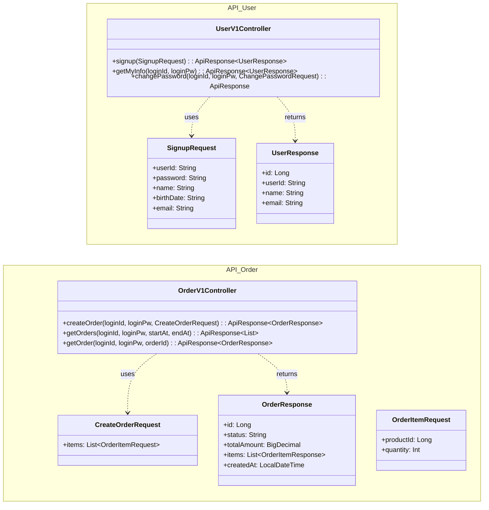

**책임:**
- HTTP 요청/응답 처리
- DTO ↔ Domain Model 변환
- 인증 헤더 파싱 및 전달
- API 문서화 (Swagger)

---

### 2.2 Application 계층

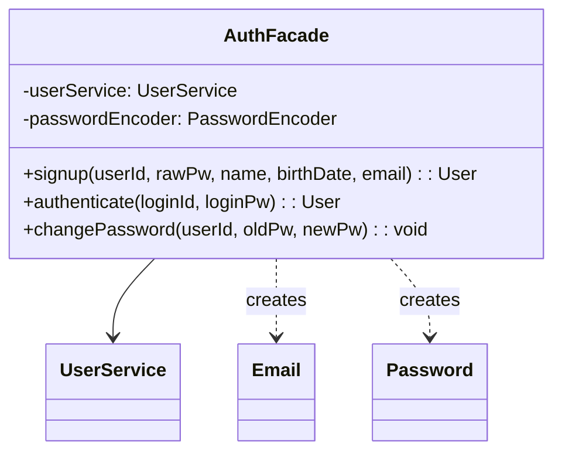

**책임:**
- 유스케이스 조율 (Controller와 Domain 사이)
- Value Object(Email, Password) 생성 및 검증
- 비밀번호 암호화/검증 (BCrypt)
- 타이밍 공격 방지 로직
- 인증 흐름을 캡슐화하여 여러 Controller에서 재사용

---

### 2.3 Domain 계층

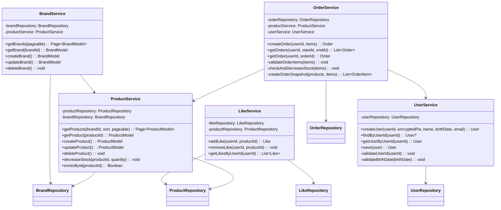

**책임:**
- 비즈니스 로직 수행
- 유효성 검증 (도메인 규칙)
- 트랜잭션 관리
- 도메인 이벤트 발행 (확장 시)

---

### 2.4 Domain Model

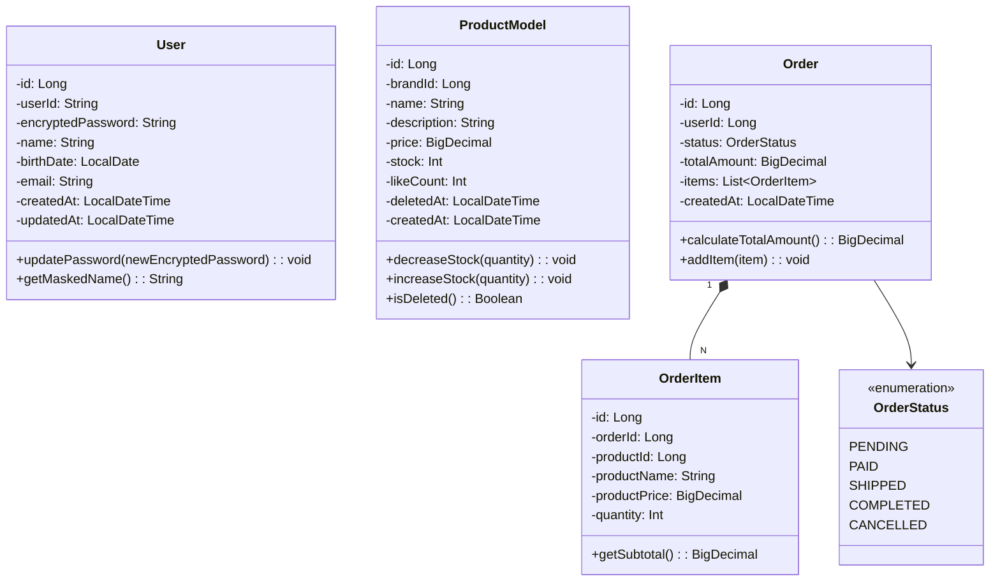

**책임:**
- 도메인 불변식(invariant) 보장
- 자체 상태 변경 로직 캡슐화
- 비즈니스 의미를 가진 메서드 제공

---

### 2.5 Infrastructure 계층

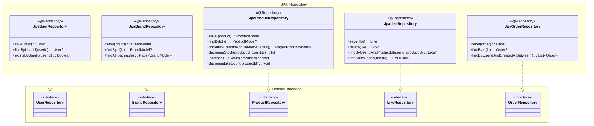

**책임:**
- Repository 인터페이스 구현
- JPA/DB 기술 세부사항 캡슐화
- 쿼리 최적화

---

## 3. 의존 관계 설명

### 3.1 서비스 간 의존

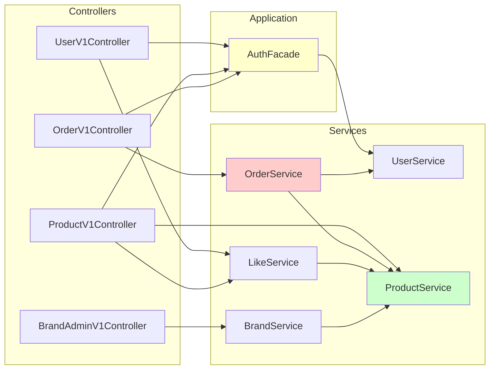

**의존 방향 원칙:**
- Controller → AuthFacade: 인증이 필요한 요청의 사용자 인증/식별
- AuthFacade → UserService: 회원가입, 인증, 비밀번호 변경 유스케이스 조율
- ProductV1Controller → LikeService: `/api/v1/products/{id}/likes` 엔드포인트 처리
- UserV1Controller → LikeService: `/api/v1/users/{id}/likes` 엔드포인트 처리
- OrderService → ProductService: 주문 시 상품 조회/재고 차감
- OrderService → UserService: 주문자 확인
- LikeService → ProductService: 좋아요 대상 상품 존재 확인
- BrandService → ProductService: 브랜드 삭제 시 상품 연쇄 처리

**순환 의존 방지:**
- ProductService는 다른 서비스에 의존하지 않음 (하위 레벨)
- UserService는 다른 서비스에 의존하지 않음 (하위 레벨)
- AuthFacade는 Application 계층에서 UserService만 의존 (단방향)

---

### 3.2 Admin vs User 컨트롤러 분리

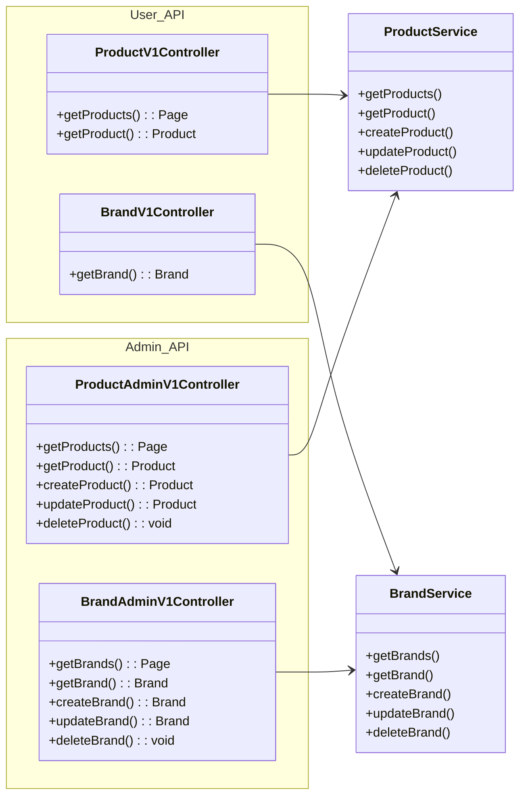

**설계 의도:**
- API prefix로 구분: `/api/v1` vs `/api-admin/v1`
- 동일한 Service 공유, Controller에서 권한 체크
- 응답 DTO는 역할에 따라 다를 수 있음 (Admin은 더 많은 정보)

---

## 4. 확장 고려사항

### 4.1 이벤트 기반 확장

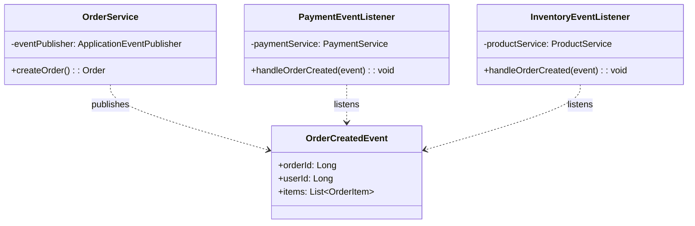

**확장 포인트:**
- 주문 생성 시 `OrderCreatedEvent` 발행
- 결제, 재고, 알림 등이 이벤트 구독
- 서비스 간 직접 의존 제거

---

**문서 작성일**: 2026-02-11
**버전**: 1.2 (Application 계층 AuthFacade 반영, Domain Entity 네이밍 코드 동기화)
