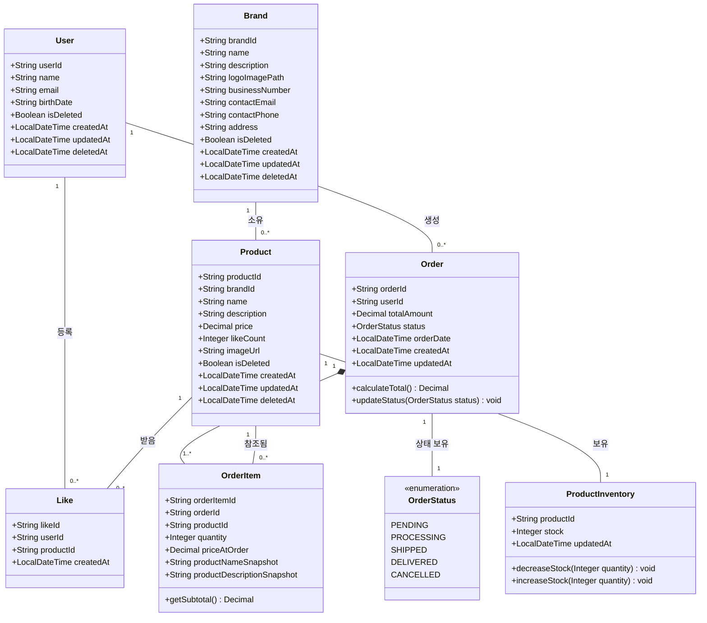
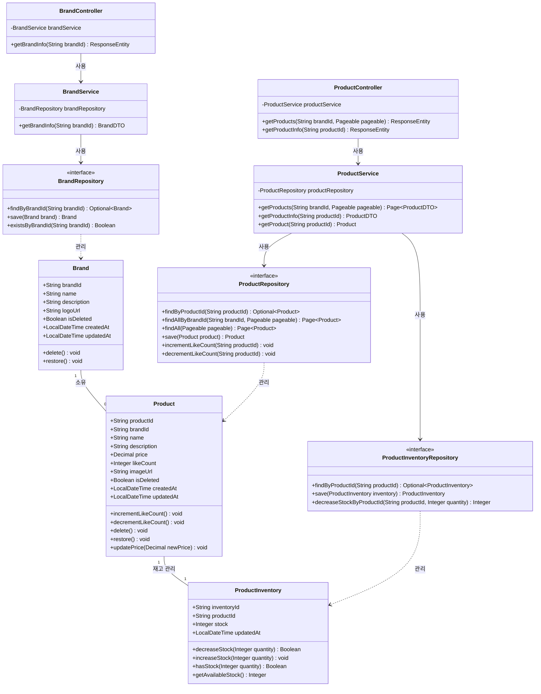
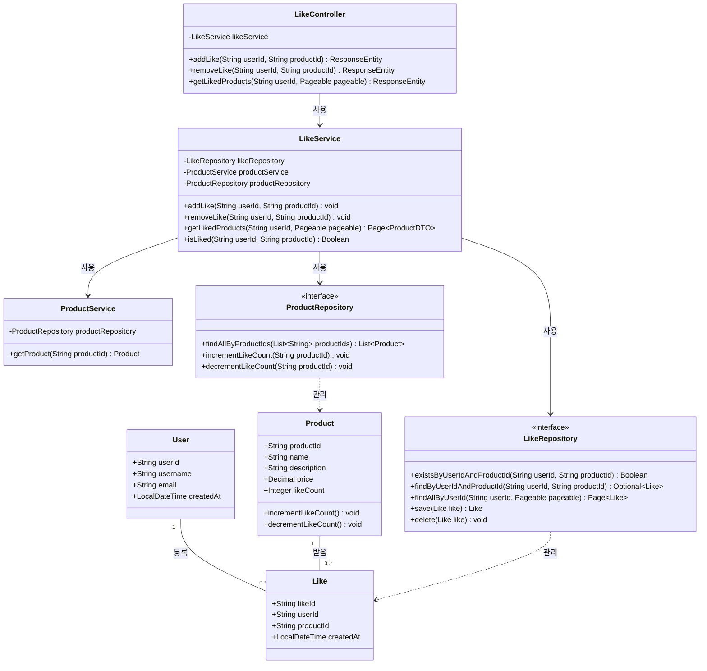
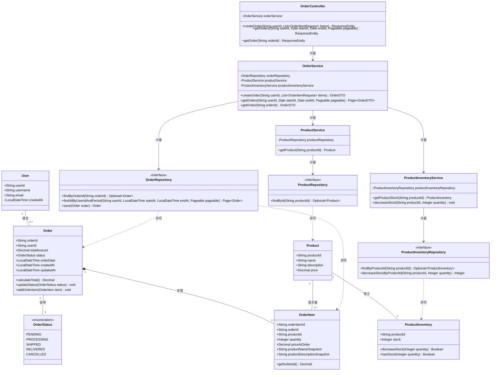

# 클래스 다이어그램

## 1. 전체 도메인 개요

### 도메인 모델 설명

#### 핵심 도메인

| 도메인 | 책임 | 핵심 행위 |
|--------|------|-----------|
| **User** | 사용자 정보 관리 | 회원가입 |
| **Brand** | 브랜드 정보 관리 | 브랜드 등록, 정보 수정, 사업자 정보 관리 |
| **Product** | 상품 정보 관리 | 상품 등록, 상품 정보, 좋아요 수 관리 |
| **ProductInventory** | 상품 재고 관리 | 재고 증감, 재고 가용성 확인 |
| **Like** | 사용자의 상품 좋아요 관리 | 좋아요 등록 및 취소, 중복 좋아요 방지 |
| **Order** | 주문 정보 관리 | 주문 생성, 주문 총액 계산, 주문 상태 변경 |
| **OrderItem** | 주문 상세 정보 관리 | 주문 시점의 상품 정보 스냅샷 보관 |
| **OrderStatus** | 주문 상태 표현 | 주문 진행 상태 (PENDING → PROCESSING → SHIPPED → DELIVERED 또는 CANCELLED) |

#### 주요 불변식

- **User, Brand, Product의 소프트 삭제**: `isDeleted = true` 상태에서도 데이터는 물리적으로 보존되며, 조회 시 필터링하여 비즈니스 로직에서 제외
- **Product의 likeCount**: Like 엔티티 생성/삭제 시 Product의 likeCount를 원자적으로 증감하여 정합성 유지
- **ProductInventory의 재고 정합성**: 동시성 제어를 통해 재고 감소 시 음수 방지 및 트랜잭션 격리 보장
- **Order와 OrderItem의 Aggregate 일관성**: Order는 Aggregate Root로서 OrderItem의 생명주기를 관리하며, 주문 총액은 항상 OrderItem의 합계와 일치
- **OrderItem의 스냅샷 불변성**: 주문 시점의 상품 가격과 정보를 스냅샷으로 보관하여, 이후 Product 변경에 영향받지 않음
- **재고 차감과 주문 생성의 트랜잭션 경계**: 주문 생성 시 ProductInventory 재고 차감이 동일 트랜잭션 내에서 원자적으로 처리됨

### 클래스 다이어그램

## 2. 브랜드/상품 도메인

### 도메인 설명

#### 핵심 엔티티

| 도메인 | 책임 | 핵심 행위 |
|--------|------|-----------|
| **Brand** | 브랜드 정보 및 사업자 정보 관리 | 브랜드 등록, 정보 수정 |
| **Product** | 상품 정보 및 판매 상태 관리 | 상품 등록, 가격 변경, 좋아요 수 증감 |
| **ProductInventory** | 상품 재고 실시간 관리 | 재고 차감 및 증가, 재고 가용성 확인 |

#### 아키텍처 레이어

| 레이어 | 구성 요소 | 역할 |
|--------|-----------|------|
| **Controller** | BrandController, ProductController | HTTP 요청 수신, 파라미터 검증, 응답 포맷 변환 (Entity → DTO) |
| **Service** | BrandService, ProductService | 비즈니스 로직 처리, 트랜잭션 경계 관리, 도메인 규칙 적용 |
| **Repository** | BrandRepository, ProductRepository, ProductInventoryRepository | 데이터 영속화, 조회 쿼리 실행 |

### 클래스 다이어그램

## 3. 좋아요 도메인

### 도메인 설명

#### 핵심 엔티티 및 역할

| 도메인 | 책임 | 핵심 행위 |
|--------|------|-----------|
| **User** | 좋아요 등록 주체 식별 | 사용자별 좋아요 목록 조회, 중복 좋아요 방지를 위한 사용자 식별 |
| **Product** | 좋아요 대상 상품 관리 | 좋아요 수(likeCount) 실시간 증감, 인기 상품 순위 결정 |
| **Like** | 사용자-상품 간 좋아요 관계 관리 | 좋아요 등록 및 취소, (userId, productId) 조합의 유일성 보장, 중복 좋아요 방지 |

#### 서비스 레이어

| 컴포넌트 | 책임 |
|----------|------|
| **LikeService** | 좋아요 비즈니스 로직 처리: 중복 확인, Like 엔티티 생성/삭제, Product의 likeCount 동기화 조율 |
| **ProductService** | 상품 조회 및 검증: 좋아요 등록 전 상품 존재 여부 확인, 삭제된 상품에 대한 좋아요 방지 |

### 클래스 다이어그램

## 4. 주문 도메인

### 도메인 설명

#### 핵심 엔티티 및 역할

| 도메인 | 책임 | 핵심 행위 |
|--------|------|-----------|
| **Order** | 주문 전체 관리 및 일관성 보장 | 주문 생성, 총액 계산(`calculateTotal()`), 주문 상태 변경(`updateStatus()`), OrderItem 추가 및 생명주기 관리 |
| **OrderItem** | 주문 상세 정보 및 스냅샷 보관 | 주문 시점의 상품 가격(`priceAtOrder`) 및 정보(`productNameSnapshot`, `productDescriptionSnapshot`) 불변 보관, 소계 계산(`getSubtotal()`) |
| **OrderStatus (Enum)** | 주문 진행 상태 명시 | 주문 상태를 명확한 열거형으로 관리하여, 잘못된 상태 전이 방지 및 상태별 비즈니스 규칙 적용 |
| **ProductInventory** | 주문 가능 재고 관리 | 주문 생성 시 재고 차감(`decreaseStock()`), 재고 가용성 확인(`hasStock()`), 동시성 제어를 통한 재고 정합성 보장 |

#### 서비스 레이어

| 컴포넌트 | 책임 |
|----------|------|
| **OrderService** | 주문 생성 트랜잭션 조율: 재고 확인 및 차감, Order/OrderItem 생성, 총액 계산, 주문 조회 |
| **ProductService** | 상품 정보 조회 및 검증: 주문 시점의 상품 정보 제공, 삭제된 상품 주문 방지 |
| **ProductInventoryService** | 재고 관리 추상화: 재고 조회 및 차감 로직 캡슐화, 동시성 제어 적용 |

### 클래스 다이어그램

