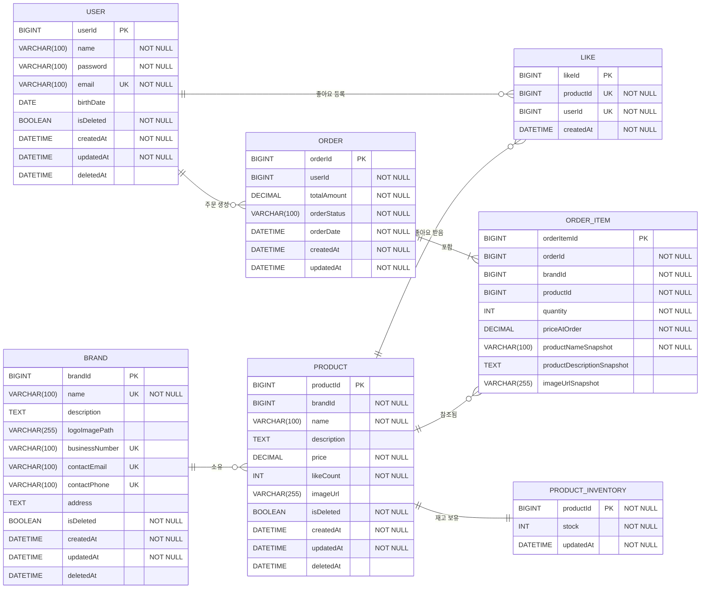

# ERD (Entity Relationship Diagram)

## 전체 데이터베이스 스키마

## 주요 설계 포인트

### 1. 소프트 삭제 (Soft Delete)
- **적용 테이블**: USER, BRAND, PRODUCT
- **구현**: `isDeleted` 플래그와 `deletedAt` 타임스탬프 사용
- **목적**: 데이터 복구 가능성 및 이력 추적

### 2. 스냅샷
- **적용 테이블**: ORDER_ITEM
- **구현**: `priceAtOrder`, `productNameSnapshot`, `productDescriptionSnapshot`, `imageUrlSnapshot`
- **목적**: 주문 시점의 상품 정보 보존 (상품 정보 변경에도 주문 내역 일관성 유지)

### 3. 재고 관리
- **PRODUCT_INVENTORY**: Product와 1:1 관계
- **productId가 PK**: 상품당 하나의 재고 레코드만 존재
- **트랜잭션 보장**: 주문 생성 시 재고 감소를 원자적으로 처리

### 4. 좋아요 시스템
- **복합 유니크 제약**: (userId, productId) 조합으로 중복 좋아요 방지
- **비정규화**: Product 테이블의 `likeCount`로 성능 최적화
- **이벤트 기반 동기화**: 좋아요 추가/삭제 시 Product의 likeCount 업데이트

### 5. 주문 시스템
- **ORDER와 ORDER_ITEM**: 1:N 관계 (Composition)
- **주문 상태**: status 필드로 주문 진행 상태 추적 (PENDING, PROCESSING, SHIPPED, DELIVERED, CANCELLED)
- **금액 계산**: totalAmount는 OrderItem들의 subtotal 합계
