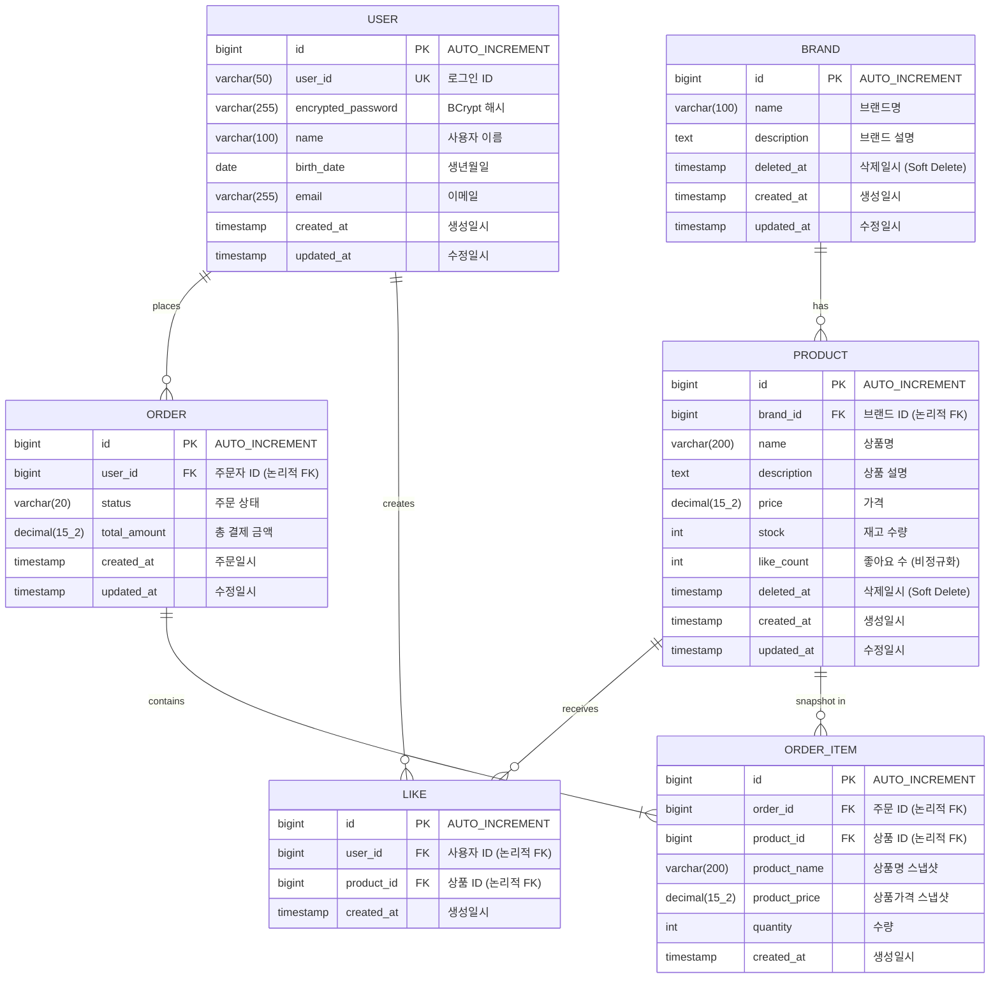

# ERD: Loopers E-Commerce

> ⚠️ 이 ERD는 **논리적 관계**를 표현합니다.
> 실제 DB 스키마에서는 FK 제약 없이 애플리케이션 레벨에서 관계를 관리합니다.

---

## 1. 전체 ERD

### 목적
- 도메인 간 관계 파악
- 데이터 정규화 수준 확인
- 주요 엔티티의 속성 정의

### 다이어그램



### 📌 주요 확인 포인트

1. **Soft Delete**: BRAND, PRODUCT에 `deleted_at` 컬럼 (NULL이면 활성)
2. **스냅샷**: ORDER_ITEM에 주문 시점 상품 정보 저장 (product_name, product_price)
3. **비정규화**: PRODUCT.like_count (실시간 COUNT 쿼리 회피)
4. **논리적 FK**: ERD에는 표시하지만 실제 DB에는 FK 제약 없음

### 설계 의도
- 주문 이력 보존: 상품 가격/이름 변경되어도 주문 당시 정보 유지
- 성능 최적화: like_count 비정규화로 목록 조회 성능 개선
- 유연한 삭제: Soft Delete로 복구 가능성 유지

---

## 2. 테이블 명세

### 2.1 USER

| 컬럼명 | 타입 | 제약조건 | 설명 |
|--------|------|----------|------|
| id | BIGINT | PK, AUTO_INCREMENT | 고유 식별자 |
| user_id | VARCHAR(50) | UNIQUE, NOT NULL | 로그인 ID |
| encrypted_password | VARCHAR(255) | NOT NULL | BCrypt 해시된 비밀번호 |
| name | VARCHAR(100) | NOT NULL | 사용자 이름 |
| birth_date | DATE | NOT NULL | 생년월일 |
| email | VARCHAR(255) | NOT NULL | 이메일 |
| created_at | TIMESTAMP | NOT NULL, DEFAULT CURRENT_TIMESTAMP | 생성일시 |
| updated_at | TIMESTAMP | NOT NULL, DEFAULT CURRENT_TIMESTAMP | 수정일시 |

---

### 2.2 BRAND

| 컬럼명 | 타입 | 제약조건 | 설명 |
|--------|------|----------|------|
| id | BIGINT | PK, AUTO_INCREMENT | 고유 식별자 |
| name | VARCHAR(100) | NOT NULL | 브랜드명 |
| description | TEXT | NULL | 브랜드 설명 |
| deleted_at | TIMESTAMP | NULL | Soft Delete 표시 |
| created_at | TIMESTAMP | NOT NULL | 생성일시 |
| updated_at | TIMESTAMP | NOT NULL | 수정일시 |

---

### 2.3 PRODUCT

| 컬럼명 | 타입 | 제약조건 | 설명 |
|--------|------|----------|------|
| id | BIGINT | PK, AUTO_INCREMENT | 고유 식별자 |
| brand_id | BIGINT | NOT NULL | 브랜드 ID (논리적 FK) |
| name | VARCHAR(200) | NOT NULL | 상품명 |
| description | TEXT | NULL | 상품 설명 |
| price | DECIMAL(15,2) | NOT NULL | 가격 |
| stock | INT | NOT NULL, DEFAULT 0 | 재고 수량 |
| like_count | INT | NOT NULL, DEFAULT 0 | 좋아요 수 (비정규화) |
| deleted_at | TIMESTAMP | NULL | Soft Delete 표시 |
| created_at | TIMESTAMP | NOT NULL | 생성일시 |
| updated_at | TIMESTAMP | NOT NULL | 수정일시 |

---

### 2.4 LIKE (product_likes)

| 컬럼명 | 타입 | 제약조건 | 설명 |
|--------|------|----------|------|
| id | BIGINT | PK, AUTO_INCREMENT | 고유 식별자 |
| user_id | BIGINT | NOT NULL | 사용자 ID (논리적 FK) |
| product_id | BIGINT | NOT NULL | 상품 ID (논리적 FK) |
| created_at | TIMESTAMP | NOT NULL | 생성일시 |

> 테이블명: `product_likes` (LIKE는 SQL 예약어)

---

### 2.5 ORDER (orders)

| 컬럼명 | 타입 | 제약조건 | 설명 |
|--------|------|----------|------|
| id | BIGINT | PK, AUTO_INCREMENT | 고유 식별자 |
| user_id | BIGINT | NOT NULL | 주문자 ID (논리적 FK) |
| status | VARCHAR(20) | NOT NULL, DEFAULT 'PENDING' | 주문 상태 |
| total_amount | DECIMAL(15,2) | NOT NULL | 총 결제 금액 |
| created_at | TIMESTAMP | NOT NULL | 주문일시 |
| updated_at | TIMESTAMP | NOT NULL | 수정일시 |

> 테이블명: `orders` (ORDER는 SQL 예약어)

**status 값:**
- `PENDING`: 주문 대기
- `PAID`: 결제 완료
- `SHIPPED`: 배송 중
- `COMPLETED`: 배송 완료
- `CANCELLED`: 취소

---

### 2.6 ORDER_ITEM

| 컬럼명 | 타입 | 제약조건 | 설명 |
|--------|------|----------|------|
| id | BIGINT | PK, AUTO_INCREMENT | 고유 식별자 |
| order_id | BIGINT | NOT NULL | 주문 ID (논리적 FK) |
| product_id | BIGINT | NOT NULL | 상품 ID (논리적 FK) |
| product_name | VARCHAR(200) | NOT NULL | 주문 시점 상품명 |
| product_price | DECIMAL(15,2) | NOT NULL | 주문 시점 상품 가격 |
| quantity | INT | NOT NULL | 주문 수량 |
| created_at | TIMESTAMP | NOT NULL | 생성일시 |

---

## 3. 인덱스

### 3.1 USER

| 인덱스명 | 컬럼 | 타입 | 용도 |
|----------|------|------|------|
| uk_user_user_id | user_id | UNIQUE | 로그인 ID 중복 방지, 조회 |
| idx_user_email | email | INDEX | 이메일 조회 (추후 중복 검사용) |

---

### 3.2 BRAND

| 인덱스명 | 컬럼 | 타입 | 용도 |
|----------|------|------|------|
| idx_brand_deleted_at | deleted_at | INDEX | Soft Delete 필터링 |

---

### 3.3 PRODUCT

| 인덱스명 | 컬럼 | 타입 | 용도 |
|----------|------|------|------|
| idx_product_brand_deleted | (brand_id, deleted_at) | COMPOSITE | 브랜드별 상품 목록 조회 |
| idx_product_created_at | (deleted_at, created_at DESC) | COMPOSITE | 최신순 정렬 |
| idx_product_price | (deleted_at, price ASC) | COMPOSITE | 가격순 정렬 |
| idx_product_like_count | (deleted_at, like_count DESC) | COMPOSITE | 좋아요순 정렬 |

---

### 3.4 LIKE (product_likes)

| 인덱스명 | 컬럼 | 타입 | 용도 |
|----------|------|------|------|
| uk_like_user_product | (user_id, product_id) | UNIQUE | 중복 좋아요 방지 |
| idx_like_product_id | product_id | INDEX | 상품별 좋아요 조회 |

---

### 3.5 ORDER (orders)

| 인덱스명 | 컬럼 | 타입 | 용도 |
|----------|------|------|------|
| idx_order_user_created | (user_id, created_at DESC) | COMPOSITE | 사용자별 주문 목록 (기간 필터) |
| idx_order_status | status | INDEX | 상태별 주문 조회 (Admin) |

---

### 3.6 ORDER_ITEM

| 인덱스명 | 컬럼 | 타입 | 용도 |
|----------|------|------|------|
| idx_order_item_order_id | order_id | INDEX | 주문별 상품 조회 |

---

## 4. 관계 정의

| 관계 | 설명 | 카디널리티 | 비고 |
|------|------|------------|------|
| USER → ORDER | 사용자가 주문을 생성 | 1:N | user_id로 참조 |
| USER → LIKE | 사용자가 좋아요를 생성 | 1:N | user_id로 참조 |
| BRAND → PRODUCT | 브랜드가 상품을 보유 | 1:N | brand_id로 참조 |
| PRODUCT → LIKE | 상품이 좋아요를 받음 | 1:N | product_id로 참조 |
| ORDER → ORDER_ITEM | 주문이 주문상품을 포함 | 1:N | order_id로 참조 |
| PRODUCT → ORDER_ITEM | 상품이 주문상품에 스냅샷 | 1:N | product_id로 참조 (이력용) |

---

## 5. 마이그레이션 고려사항

### 5.1 초기 스키마 생성

```sql
-- 테이블 생성 순서 (의존성 고려)
1. users
2. brands
3. products (brands 참조)
4. product_likes (users, products 참조)
5. orders (users 참조)
6. order_items (orders, products 참조)
```

### 5.2 Soft Delete 쿼리 패턴

```sql
-- 활성 데이터만 조회
SELECT * FROM products WHERE deleted_at IS NULL;

-- Soft Delete 수행
UPDATE products SET deleted_at = NOW() WHERE id = ?;

-- 브랜드 삭제 시 상품 연쇄 Soft Delete
UPDATE products SET deleted_at = NOW() WHERE brand_id = ?;
UPDATE brands SET deleted_at = NOW() WHERE id = ?;
```

### 5.3 재고 차감 (동시성 고려)

```sql
-- 비관적 업데이트 (stock >= quantity 조건)
UPDATE products
SET stock = stock - ?, updated_at = NOW()
WHERE id = ? AND stock >= ? AND deleted_at IS NULL;

-- 영향받은 row가 0이면 재고 부족
```

### 5.4 좋아요 카운트 동기화

```sql
-- 좋아요 등록 시
INSERT INTO product_likes (user_id, product_id, created_at) VALUES (?, ?, NOW());
UPDATE products SET like_count = like_count + 1 WHERE id = ?;

-- 좋아요 취소 시
DELETE FROM product_likes WHERE user_id = ? AND product_id = ?;
UPDATE products SET like_count = like_count - 1 WHERE id = ? AND like_count > 0;
```

### 5.5 향후 마이그레이션 포인트

| 시점 | 변경 내용 | 고려사항 |
|------|----------|----------|
| 결제 기능 추가 | `payments` 테이블 추가 | orders와 1:1 또는 1:N 관계 |
| 쿠폰 기능 추가 | `coupons`, `user_coupons` 테이블 | 주문과 연계 |
| 배송 기능 추가 | `deliveries` 테이블 | orders와 1:1 관계 |
| 리뷰 기능 추가 | `reviews` 테이블 | order_items와 연계 |

---

## 6. 실제 DDL 예시

### 6.1 users 테이블

```sql
CREATE TABLE users (
    id BIGINT AUTO_INCREMENT PRIMARY KEY,
    user_id VARCHAR(50) NOT NULL,
    encrypted_password VARCHAR(255) NOT NULL,
    name VARCHAR(100) NOT NULL,
    birth_date DATE NOT NULL,
    email VARCHAR(255) NOT NULL,
    created_at TIMESTAMP NOT NULL DEFAULT CURRENT_TIMESTAMP,
    updated_at TIMESTAMP NOT NULL DEFAULT CURRENT_TIMESTAMP ON UPDATE CURRENT_TIMESTAMP,

    UNIQUE KEY uk_user_user_id (user_id),
    INDEX idx_user_email (email)
) ENGINE=InnoDB DEFAULT CHARSET=utf8mb4;
```

### 6.2 products 테이블

```sql
CREATE TABLE products (
    id BIGINT AUTO_INCREMENT PRIMARY KEY,
    brand_id BIGINT NOT NULL,
    name VARCHAR(200) NOT NULL,
    description TEXT,
    price DECIMAL(15,2) NOT NULL,
    stock INT NOT NULL DEFAULT 0,
    like_count INT NOT NULL DEFAULT 0,
    deleted_at TIMESTAMP NULL,
    created_at TIMESTAMP NOT NULL DEFAULT CURRENT_TIMESTAMP,
    updated_at TIMESTAMP NOT NULL DEFAULT CURRENT_TIMESTAMP ON UPDATE CURRENT_TIMESTAMP,

    INDEX idx_product_brand_deleted (brand_id, deleted_at),
    INDEX idx_product_created_at (deleted_at, created_at DESC),
    INDEX idx_product_price (deleted_at, price ASC),
    INDEX idx_product_like_count (deleted_at, like_count DESC)
) ENGINE=InnoDB DEFAULT CHARSET=utf8mb4;

-- FK 제약 없음 (애플리케이션 레벨에서 관리)
```

### 6.3 orders 테이블

```sql
CREATE TABLE orders (
    id BIGINT AUTO_INCREMENT PRIMARY KEY,
    user_id BIGINT NOT NULL,
    status VARCHAR(20) NOT NULL DEFAULT 'PENDING',
    total_amount DECIMAL(15,2) NOT NULL,
    created_at TIMESTAMP NOT NULL DEFAULT CURRENT_TIMESTAMP,
    updated_at TIMESTAMP NOT NULL DEFAULT CURRENT_TIMESTAMP ON UPDATE CURRENT_TIMESTAMP,

    INDEX idx_order_user_created (user_id, created_at DESC),
    INDEX idx_order_status (status)
) ENGINE=InnoDB DEFAULT CHARSET=utf8mb4;
```

---

**문서 작성일**: 2026-02-11
**버전**: 1.0
