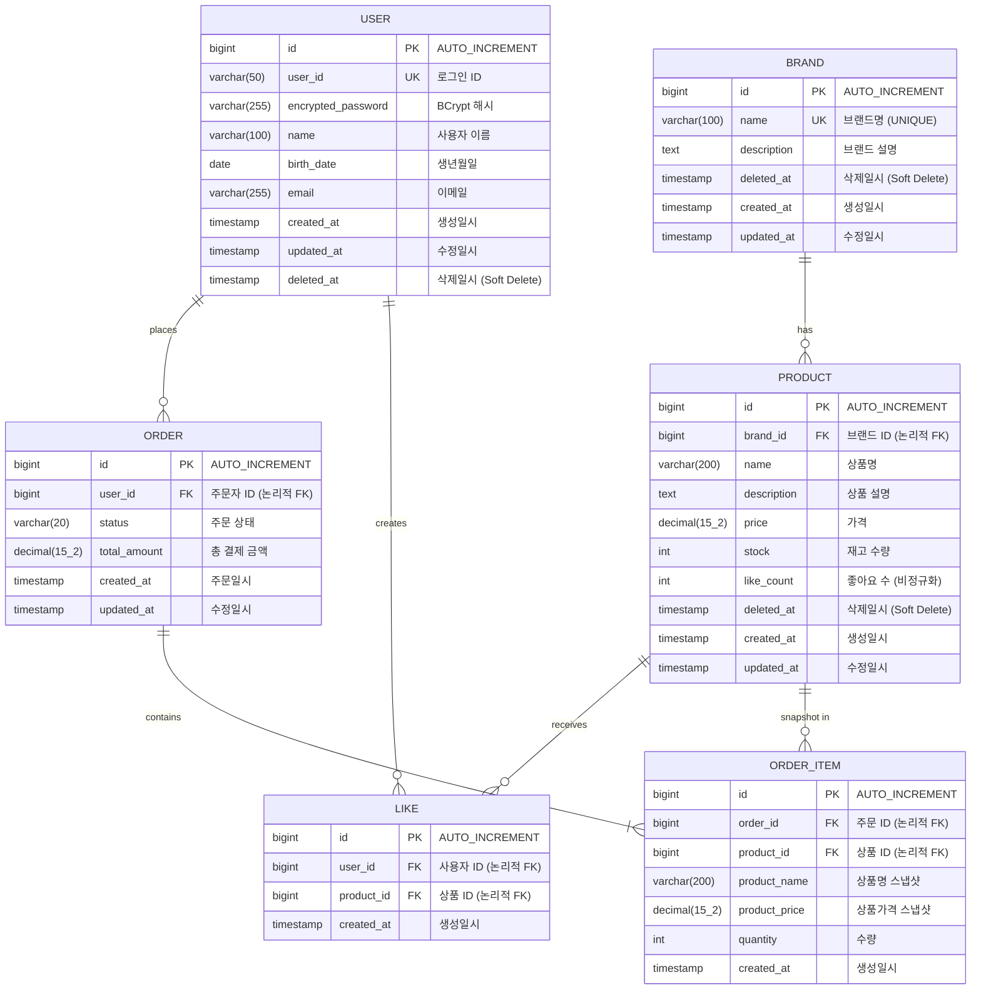

# ERD: Loopers E-Commerce

> ⚠️ 이 ERD는 **논리적 관계**를 표현합니다.
> 실제 DB 스키마에서는 FK 제약 없이 애플리케이션 레벨에서 관계를 관리합니다.

---

## 1. 전체 ERD

### 목적
- 도메인 간 관계 파악
- 데이터 정규화 수준 확인
- 주요 엔티티의 속성 정의

### 다이어그램



### 📌 주요 확인 포인트

1. **Soft Delete**: 모든 엔티티에 `deleted_at` 컬럼 (NULL이면 활성)
2. **스냅샷**: ORDER_ITEM에 주문 시점 상품 정보 저장 (product_name, product_price)
3. **비정규화**: PRODUCT.like_count (실시간 COUNT 쿼리 회피)
4. **논리적 FK**: ERD에는 표시하지만 실제 DB에는 FK 제약 없음

### 설계 의도
- 주문 이력 보존: 상품 가격/이름 변경되어도 주문 당시 정보 유지
- 성능 최적화: like_count 비정규화로 목록 조회 성능 개선
- 유연한 삭제: Soft Delete로 복구 가능성 유지

---

## 2. Week 1 구현 현황

### 2.1 USER 테이블 (✅ 구현 완료)

#### JPA Entity 구조

```kotlin
// UserEntity.kt (Infrastructure Layer)
@Entity
@Table(name = "users")
class UserEntity(
    userId: String,
    encryptedPassword: String,
    name: String,
    birthDate: LocalDate,
    email: String,
) : BaseEntity() {

    @Column(unique = true, nullable = false)
    var userId: String = userId

    @Column(nullable = false, name = "encrypted_password")
    var encryptedPassword: String = encryptedPassword

    @Column(nullable = false)
    var name: String = name

    @Column(nullable = false, name = "birth_date")
    var birthDate: LocalDate = birthDate

    @Column(nullable = false)
    var email: String = email

    fun updatePassword(newEncryptedPassword: String) { ... }
    fun toDomain(): User = ...
    companion object { fun from(user: User): UserEntity = ... }
}
```

#### BaseEntity 구조

```kotlin
// BaseEntity.kt (modules/jpa)
@MappedSuperclass
abstract class BaseEntity {
    @Id
    @GeneratedValue(strategy = GenerationType.IDENTITY)
    val id: Long = 0

    @Column(name = "created_at", nullable = false, updatable = false)
    lateinit var createdAt: ZonedDateTime

    @Column(name = "updated_at", nullable = false)
    lateinit var updatedAt: ZonedDateTime

    @Column(name = "deleted_at")
    var deletedAt: ZonedDateTime? = null

    open fun guard() = Unit  // 엔티티 유효성 검증 훅

    @PrePersist
    private fun prePersist() {
        guard()
        val now = ZonedDateTime.now()
        createdAt = now
        updatedAt = now
    }

    @PreUpdate
    private fun preUpdate() {
        guard()
        updatedAt = ZonedDateTime.now()
    }

    fun delete() { deletedAt ?: run { deletedAt = ZonedDateTime.now() } }
    fun restore() { deletedAt?.let { deletedAt = null } }
}
```

#### 테이블 명세

| 컬럼명 | 타입 | 제약조건 | 설명 | 구현 상태 |
|--------|------|----------|------|----------|
| id | BIGINT | PK, AUTO_INCREMENT | 고유 식별자 | ✅ |
| user_id | VARCHAR(50) | UNIQUE, NOT NULL | 로그인 ID | ✅ |
| encrypted_password | VARCHAR(255) | NOT NULL | BCrypt 해시된 비밀번호 | ✅ |
| name | VARCHAR(100) | NOT NULL | 사용자 이름 | ✅ |
| birth_date | DATE | NOT NULL | 생년월일 | ✅ |
| email | VARCHAR(255) | NOT NULL | 이메일 | ✅ |
| created_at | TIMESTAMP | NOT NULL | 생성일시 | ✅ |
| updated_at | TIMESTAMP | NOT NULL | 수정일시 | ✅ |
| deleted_at | TIMESTAMP | NULL | 삭제일시 (Soft Delete) | ✅ (미사용) |

#### 검증 규칙 (애플리케이션 레벨)

| 필드 | 규칙 | 검증 위치 |
|------|------|----------|
| user_id | 영문+숫자만 (`^[A-Za-z0-9]+$`) | `UserService.validateUserId()` |
| email | `{local}@{domain}` 포맷 | `Email` Value Object |
| password | 8~16자, 영문대소문자/숫자/특수문자, 생년월일 불포함 | `Password` Value Object |
| birth_date | 미래일 불가 | `UserService.validateBirthDate()` |
| name | blank 불가 | `User` init 블록 |

---

## 3. 테이블 명세

### 3.1 BRAND

| 컬럼명 | 타입 | 제약조건 | 설명 |
|--------|------|----------|------|
| id | BIGINT | PK, AUTO_INCREMENT | 고유 식별자 |
| name | VARCHAR(100) | UNIQUE, NOT NULL | 브랜드명 |
| description | TEXT | NULL | 브랜드 설명 |
| deleted_at | TIMESTAMP | NULL | Soft Delete 표시 |
| created_at | TIMESTAMP | NOT NULL | 생성일시 |
| updated_at | TIMESTAMP | NOT NULL | 수정일시 |

---

### 3.2 PRODUCT

| 컬럼명 | 타입 | 제약조건 | 설명 |
|--------|------|----------|------|
| id | BIGINT | PK, AUTO_INCREMENT | 고유 식별자 |
| brand_id | BIGINT | NOT NULL | 브랜드 ID (논리적 FK) |
| name | VARCHAR(200) | NOT NULL | 상품명 |
| description | TEXT | NULL | 상품 설명 |
| price | DECIMAL(15,2) | NOT NULL | 가격 |
| stock | INT | NOT NULL, DEFAULT 0 | 재고 수량 |
| like_count | INT | NOT NULL, DEFAULT 0 | 좋아요 수 (비정규화) |
| deleted_at | TIMESTAMP | NULL | Soft Delete 표시 |
| created_at | TIMESTAMP | NOT NULL | 생성일시 |
| updated_at | TIMESTAMP | NOT NULL | 수정일시 |

---

### 3.3 LIKE / product_likes

| 컬럼명 | 타입 | 제약조건 | 설명 |
|--------|------|----------|------|
| id | BIGINT | PK, AUTO_INCREMENT | 고유 식별자 |
| user_id | BIGINT | NOT NULL | 사용자 ID (논리적 FK) |
| product_id | BIGINT | NOT NULL | 상품 ID (논리적 FK) |
| created_at | TIMESTAMP | NOT NULL | 생성일시 |

> 테이블명: `product_likes` (LIKE는 SQL 예약어)
> UNIQUE 제약: (user_id, product_id) — 중복 좋아요 방지

---

### 3.4 ORDER / orders

| 컬럼명 | 타입 | 제약조건 | 설명 |
|--------|------|----------|------|
| id | BIGINT | PK, AUTO_INCREMENT | 고유 식별자 |
| user_id | BIGINT | NOT NULL | 주문자 ID (논리적 FK) |
| status | VARCHAR(20) | NOT NULL, DEFAULT 'PENDING' | 주문 상태 |
| total_amount | DECIMAL(15,2) | NOT NULL | 총 결제 금액 |
| created_at | TIMESTAMP | NOT NULL | 주문일시 |
| updated_at | TIMESTAMP | NOT NULL | 수정일시 |

> 테이블명: `orders` (ORDER는 SQL 예약어)

**status 값:**
- `PENDING`: 주문 대기
- `PAID`: 결제 완료
- `SHIPPED`: 배송 중
- `COMPLETED`: 배송 완료
- `CANCELLED`: 취소

---

### 3.5 ORDER_ITEM

| 컬럼명 | 타입 | 제약조건 | 설명 |
|--------|------|----------|------|
| id | BIGINT | PK, AUTO_INCREMENT | 고유 식별자 |
| order_id | BIGINT | NOT NULL | 주문 ID (논리적 FK) |
| product_id | BIGINT | NOT NULL | 상품 ID (논리적 FK) |
| product_name | VARCHAR(200) | NOT NULL | 주문 시점 상품명 |
| product_price | DECIMAL(15,2) | NOT NULL | 주문 시점 상품 가격 |
| quantity | INT | NOT NULL | 주문 수량 |
| created_at | TIMESTAMP | NOT NULL | 생성일시 |

---

## 4. 인덱스

### 4.1 USER (✅ 구현 완료)

| 인덱스명 | 컬럼 | 타입 | 용도 | 상태 |
|----------|------|------|------|------|
| uk_user_user_id | user_id | UNIQUE | 로그인 ID 중복 방지, 조회 | ✅ |
| idx_user_email | email | INDEX | 이메일 조회 (추후 중복 검사용) | 📋 |

---

### 4.2 BRAND

| 인덱스명 | 컬럼 | 타입 | 용도 |
|----------|------|------|------|
| uk_brand_name | name | UNIQUE | 브랜드명 중복 방지 |
| idx_brand_deleted_at | deleted_at | INDEX | Soft Delete 필터링 |

---

### 4.3 PRODUCT

| 인덱스명 | 컬럼 | 타입 | 용도 |
|----------|------|------|------|
| idx_product_brand_deleted | (brand_id, deleted_at) | COMPOSITE | 브랜드별 상품 목록 조회 |
| idx_product_created_at | (deleted_at, created_at DESC) | COMPOSITE | 최신순 정렬 |
| idx_product_price | (deleted_at, price ASC) | COMPOSITE | 가격순 정렬 |
| idx_product_like_count | (deleted_at, like_count DESC) | COMPOSITE | 좋아요순 정렬 |

---

### 4.4 LIKE / product_likes

| 인덱스명 | 컬럼 | 타입 | 용도 |
|----------|------|------|------|
| uk_like_user_product | (user_id, product_id) | UNIQUE | 중복 좋아요 방지 |
| idx_like_product_id | product_id | INDEX | 상품별 좋아요 조회 |

---

### 4.5 ORDER / orders

| 인덱스명 | 컬럼 | 타입 | 용도 |
|----------|------|------|------|
| idx_order_user_created | (user_id, created_at DESC) | COMPOSITE | 사용자별 주문 목록 (기간 필터) |
| idx_order_status | status | INDEX | 상태별 주문 조회 (Admin) |

---

### 4.6 ORDER_ITEM

| 인덱스명 | 컬럼 | 타입 | 용도 |
|----------|------|------|------|
| idx_order_item_order_id | order_id | INDEX | 주문별 상품 조회 |

---

## 5. 관계 정의

| 관계 | 설명 | 카디널리티 | 비고 |
|------|------|------------|------|
| USER → ORDER | 사용자가 주문을 생성 | 1:N | user_id로 참조 |
| USER → LIKE | 사용자가 좋아요를 생성 | 1:N | user_id로 참조 |
| BRAND → PRODUCT | 브랜드가 상품을 보유 | 1:N | brand_id로 참조 |
| PRODUCT → LIKE | 상품이 좋아요를 받음 | 1:N | product_id로 참조 |
| ORDER → ORDER_ITEM | 주문이 주문상품을 포함 | 1:N | order_id로 참조 |
| PRODUCT → ORDER_ITEM | 상품이 주문상품에 스냅샷 | 1:N | product_id로 참조 (이력용) |

---

## 6. ERD 설계 vs 구현

### 6.1 논리적 FK vs 물리적 FK

| 구분 | ERD (논리적) | DB (물리적) |
|------|-------------|-------------|
| FK 관계 | 표시함 | FK 제약 없음 |
| 참조 무결성 | 애플리케이션에서 보장 | DB에서 강제하지 않음 |
| 장점 | 관계 명확화 | 유연한 삭제/수정, 마이그레이션 용이 |

### 6.2 Loose Coupling 이유

1. **마이크로서비스 전환 대비**: 서비스 분리 시 FK 제약이 장애물
2. **성능**: FK 검증 오버헤드 제거
3. **유연한 삭제**: Soft Delete 시 FK 제약 충돌 방지
4. **데이터 마이그레이션**: 스키마 변경 용이

---

## 7. 마이그레이션 고려사항

### 7.1 Soft Delete 쿼리 패턴

```sql
-- 활성 데이터만 조회
SELECT * FROM products WHERE deleted_at IS NULL;

-- Soft Delete 수행
UPDATE products SET deleted_at = NOW() WHERE id = ?;

-- 브랜드 삭제 시 상품 연쇄 Soft Delete
UPDATE products SET deleted_at = NOW() WHERE brand_id = ?;
UPDATE brands SET deleted_at = NOW() WHERE id = ?;
```

### 7.2 재고 차감 (동시성 고려)

```sql
-- 비관적 업데이트 (stock >= quantity 조건)
UPDATE products
SET stock = stock - ?, updated_at = NOW()
WHERE id = ? AND stock >= ? AND deleted_at IS NULL;

-- 영향받은 row가 0이면 재고 부족
```

### 7.3 좋아요 카운트 동기화

```sql
-- 좋아요 등록 시
INSERT INTO product_likes (user_id, product_id, created_at) VALUES (?, ?, NOW());
UPDATE products SET like_count = like_count + 1 WHERE id = ?;

-- 좋아요 취소 시
DELETE FROM product_likes WHERE user_id = ? AND product_id = ?;
UPDATE products SET like_count = like_count - 1 WHERE id = ? AND like_count > 0;
```

### 7.4 향후 마이그레이션 포인트

| 시점 | 변경 내용 | 고려사항 |
|------|----------|----------|
| 결제 기능 추가 | `payments` 테이블 추가 | orders와 1:1 또는 1:N 관계 |
| 쿠폰 기능 추가 | `coupons`, `user_coupons` 테이블 | 주문과 연계 |
| 배송 기능 추가 | `deliveries` 테이블 | orders와 1:1 관계 |
| 리뷰 기능 추가 | `reviews` 테이블 | order_items와 연계 |

---

## 8. 미결정 사항 (ERD 관련)

### Q1. email UNIQUE 제약 추가 여부

**현재**: email에 UNIQUE 제약 없음
**옵션**:
- A: 중복 허용 유지 (소셜 로그인 확장 용이)
- B: UNIQUE 추가 (비밀번호 찾기 기능 연계)

**권장**: 비밀번호 찾기 기능 구현 시 재검토

---

### Q2. like_count 동기화 방식

**현재**: 설계만 완료
**옵션**:
- A: 동기식 +1/-1 업데이트
- B: 비동기 배치 집계
- C: 이벤트 기반 + 캐시

**권장**: 옵션 A (MVP) → 트래픽 증가 시 옵션 C

---

### Q3. 주문 상태 관리

**현재**: status VARCHAR(20) — 문자열 저장
**옵션**:
- A: VARCHAR + 애플리케이션 Enum (현재)
- B: DB Enum 타입
- C: 별도 상태 테이블

**권장**: 옵션 A 유지 — 상태 추가/변경 용이

---

**문서 작성일**: 2026-02-11
**버전**: 1.1 (Week 1 구현 반영, 미결정 사항 추가)
