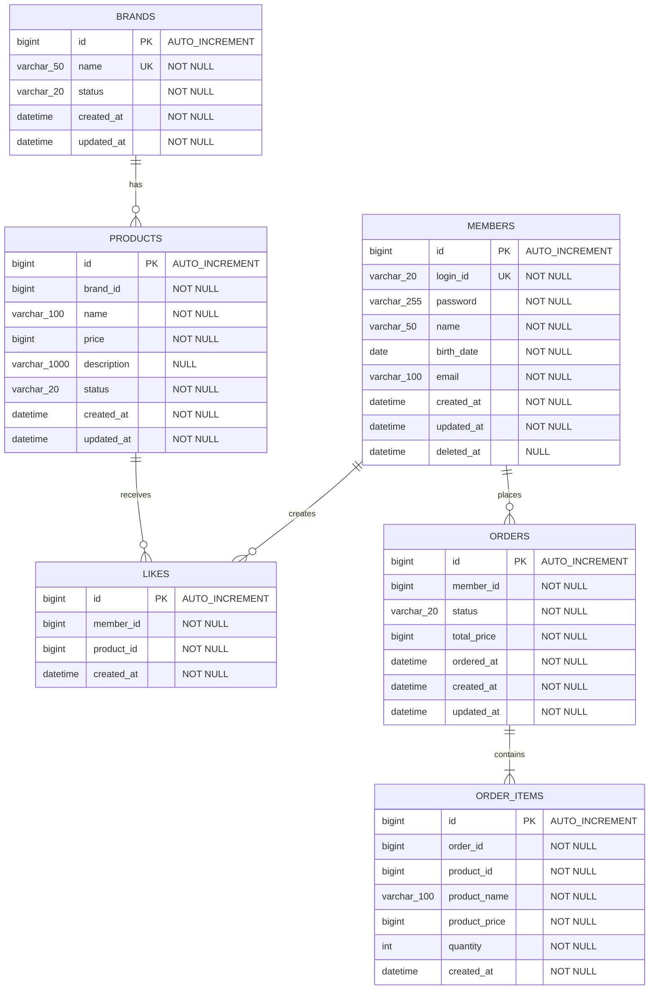

# 04. ERD (Entity Relationship Diagram)

## 개요

전체 도메인의 테이블 구조와 관계를 정의합니다.
기존 Member(members) 테이블을 포함하여 전체 시스템의 데이터 모델을 표현합니다.

---

## 설계 결정 기록 (DDR)

### DDR: 날짜/시간 타입 선택

| 대안 | 범위 | 저장 크기 | 타임존 | 특징 |
|------|------|-----------|--------|------|
| DATETIME | 1000-01-01 ~ 9999-12-31 | 8 bytes | 없음 (앱 관리) | 2038 문제 없음 |
| TIMESTAMP | 1970-01-01 ~ 2038-01-19 | 4 bytes | UTC 자동 변환 | 2038 문제 존재 |

**결정: DATETIME** — 2038 문제 회피, 기존 Member 테이블과의 일관성 유지. 타임존 관리는 애플리케이션 레벨에서 `ZonedDateTime`으로 처리.

---

## 전체 ERD



---

## 테이블별 상세 명세

### 1. BRANDS

| 컬럼 | 타입 | 제약조건 | 설명 |
|------|------|----------|------|
| `id` | BIGINT | PK, AUTO_INCREMENT | 브랜드 ID |
| `name` | VARCHAR(50) | NOT NULL, UNIQUE | 브랜드명 |
| `status` | VARCHAR(20) | NOT NULL | 상태 (ACTIVE / INACTIVE) |
| `created_at` | DATETIME | NOT NULL | 생성 시각 |
| `updated_at` | DATETIME | NOT NULL | 수정 시각 |

**인덱스:**
- `PK` on `id`
- `UNIQUE` on `name`

**Soft Delete 방식:** `status = 'INACTIVE'`로 논리 삭제 (별도 deleted_at 컬럼 없음)

---

### 2. PRODUCTS

| 컬럼 | 타입 | 제약조건 | 설명 |
|------|------|----------|------|
| `id` | BIGINT | PK, AUTO_INCREMENT | 상품 ID |
| `brand_id` | BIGINT | NOT NULL | 브랜드 ID (앱 레벨 참조) |
| `name` | VARCHAR(100) | NOT NULL | 상품명 |
| `price` | BIGINT | NOT NULL, >= 0 | 가격 (원 단위) |
| `description` | VARCHAR(1000) | NULL | 상품 설명 |
| `status` | VARCHAR(20) | NOT NULL | 상태 (SELLING / STOP_SELLING) |
| `created_at` | DATETIME | NOT NULL | 생성 시각 |
| `updated_at` | DATETIME | NOT NULL | 수정 시각 |

**인덱스:**
- `PK` on `id`
- `IDX` on `(brand_id, status)` — 복합 인덱스 (`existsByBrandIdAndStatus` 쿼리 최적화, 단독 `brand_id` 조회도 leading column으로 커버)
- `IDX` on `status` — 상품 목록의 SELLING 필터 조회 최적화

---

### 3. LIKES

| 컬럼 | 타입 | 제약조건 | 설명 |
|------|------|----------|------|
| `id` | BIGINT | PK, AUTO_INCREMENT | 좋아요 ID |
| `member_id` | BIGINT | NOT NULL | 회원 ID (앱 레벨 참조) |
| `product_id` | BIGINT | NOT NULL | 상품 ID (앱 레벨 참조) |
| `created_at` | DATETIME | NOT NULL | 생성 시각 |

**인덱스:**
- `PK` on `id`
- `UNIQUE` on `(member_id, product_id)` — 중복 좋아요 방지
- `IDX` on `member_id` — 내 좋아요 목록 조회 최적화

**데이터 정합성 결정:**
- 좋아요는 물리 삭제 (Hard Delete) — 취소 시 ROW 삭제
- `(member_id, product_id)` 유니크 제약으로 DB 레벨 중복 방지

---

### 4. ORDERS

| 컬럼 | 타입 | 제약조건 | 설명 |
|------|------|----------|------|
| `id` | BIGINT | PK, AUTO_INCREMENT | 주문 ID |
| `member_id` | BIGINT | NOT NULL | 주문자 ID (앱 레벨 참조) |
| `status` | VARCHAR(20) | NOT NULL | 상태 (ORDERED / CANCELLED) |
| `total_price` | BIGINT | NOT NULL | 총 주문 금액 (원) |
| `ordered_at` | DATETIME | NOT NULL | 주문 시각 |
| `created_at` | DATETIME | NOT NULL | 생성 시각 |
| `updated_at` | DATETIME | NOT NULL | 수정 시각 |

**인덱스:**
- `PK` on `id`
- `IDX` on `member_id` — 내 주문 목록 조회 최적화

#### DDR: ordered_at과 created_at의 의미 구분

| 컬럼 | 의미 | 언제 다를 수 있나 |
|------|------|-------------------|
| `ordered_at` | 비즈니스 시점 — "고객이 주문한 시각" | 예약 주문, 오프라인 주문 이관 |
| `created_at` | 기술 메타데이터 — "레코드가 생성된 시각" | 데이터 마이그레이션, 배치 처리 |

**결정: 둘 다 유지** — 현재는 동일 시점이지만, 예약 주문 기능 추가나 데이터 마이그레이션 시 분리 필요. 비즈니스 의미(ordered_at)와 기술 감사(created_at)를 구분하는 것이 정규화 원칙에 부합.

---

### 5. ORDER_ITEMS

| 컬럼 | 타입 | 제약조건 | 설명 |
|------|------|----------|------|
| `id` | BIGINT | PK, AUTO_INCREMENT | 주문 상품 ID |
| `order_id` | BIGINT | NOT NULL | 소속 주문 ID (앱 레벨 참조) |
| `product_id` | BIGINT | NOT NULL | 원본 상품 ID (참조용) |
| `product_name` | VARCHAR(100) | NOT NULL | 주문 시점 상품명 (스냅샷) |
| `product_price` | BIGINT | NOT NULL | 주문 시점 가격 (스냅샷) |
| `quantity` | INT | NOT NULL, >= 1 | 주문 수량 |
| `created_at` | DATETIME | NOT NULL | 생성 시각 |

**인덱스:**
- `PK` on `id`
- `IDX` on `order_id`

**스냅샷 설계 결정:**

> `product_name`과 `product_price`를 ORDER_ITEMS에 직접 저장하는 이유:
> 주문 이후 상품 정보(이름, 가격)가 변경되더라도 주문 내역은 **주문 시점의 정보**를 보여야 한다.
> `product_id`는 "어떤 상품이었는지" 추적용으로만 사용하며, JOIN으로 상품 정보를 가져오지 않는다.

---

### 6. MEMBERS (기존)

| 컬럼 | 타입 | 제약조건 | 설명 |
|------|------|----------|------|
| `id` | BIGINT | PK, AUTO_INCREMENT | 회원 ID |
| `login_id` | VARCHAR(20) | NOT NULL, UNIQUE | 로그인 ID |
| `password` | VARCHAR(255) | NOT NULL | 암호화된 비밀번호 |
| `name` | VARCHAR(50) | NOT NULL | 이름 |
| `birth_date` | DATE | NOT NULL | 생년월일 |
| `email` | VARCHAR(100) | NOT NULL | 이메일 |
| `created_at` | DATETIME | NOT NULL | 생성 시각 |
| `updated_at` | DATETIME | NOT NULL | 수정 시각 |
| `deleted_at` | DATETIME | NULL | 삭제 시각 |

---

## 테이블 관계 요약

| 관계 | 타입 | 설명 |
|------|------|------|
| BRANDS → PRODUCTS | 1:N | 하나의 브랜드에 여러 상품 |
| MEMBERS → LIKES | 1:N | 한 회원이 여러 좋아요 |
| PRODUCTS → LIKES | 1:N | 한 상품에 여러 좋아요 |
| MEMBERS → ORDERS | 1:N | 한 회원이 여러 주문 |
| ORDERS → ORDER_ITEMS | 1:N | 한 주문에 여러 상품 (필수 1개 이상) |

---

## 데이터 정합성 고려사항

### DDR: FK 미사용 결정

| 대안 | 얻는 것 | 잃는 것 |
|------|---------|---------|
| DB FK 제약조건 사용 | DB 레벨 참조 무결성 보장 | 자식 INSERT 시 부모 S-Lock 발생, 동시성 저하, 테스트 복잡성 증가 |
| **앱 레벨 검증 (채택)** | 락 경합 제거, Aggregate 독립성, 테스트 용이 | DB 레벨 정합성 포기 (앱에서 보장) |

**결정: FK 미사용** — 도메인 서비스(`BrandReader`, `ProductReader` 등)가 이미 참조 무결성을 검증하므로 DB FK는 중복. INSERT 시 부모 테이블 공유 락으로 인한 동시성 저하를 제거하고, DDD Aggregate 간 ID 참조 원칙에 부합.

### 인덱스 전략

| 테이블 | 인덱스 | 타입 | 대상 쿼리 |
|--------|--------|------|-----------|
| PRODUCTS | `idx_products_brand_id_status` | 복합 | `existsByBrandIdAndStatus(brandId, SELLING)` — BrandRemover |
| PRODUCTS | `idx_products_status` | 단독 | 상품 목록 SELLING 필터 조회 |
| LIKES | `uk_likes_member_product` | UNIQUE 복합 | 중복 좋아요 방지 |
| LIKES | `idx_likes_member_id` | 단독 | 내 좋아요 목록 조회 |
| ORDERS | `idx_orders_member_id` | 단독 | 내 주문 목록 조회 |
| ORDER_ITEMS | `idx_order_items_order_id` | 단독 | 주문별 항목 조회 |

> **복합 인덱스 결정:** `products(brand_id, status)` 복합 인덱스는 `brand_id` 단독 조회도 leading column으로 커버하므로, 별도의 `idx_products_brand_id` 단독 인덱스는 불필요하여 제거.

### 중복 방지

| 테이블 | 유니크 제약 | 목적 |
|--------|------------|------|
| BRANDS | `name` | 브랜드명 유일성 |
| LIKES | `(member_id, product_id)` | 동일 회원+상품 중복 좋아요 방지 |

### Soft Delete vs Hard Delete

| 테이블 | 삭제 방식 | 구현 |
|--------|-----------|------|
| BRANDS | Soft Delete | `status = 'INACTIVE'` |
| PRODUCTS | Soft Delete | `status = 'STOP_SELLING'` |
| LIKES | Hard Delete | ROW 삭제 |
| ORDERS | 상태 변경 | `status = 'CANCELLED'` (삭제 아님) |
| MEMBERS | Soft Delete | `deleted_at IS NOT NULL` (기존) |

---

## DDL 참고

```sql
-- Volume 1에서 생성됨 (참조용)
CREATE TABLE members (
    id BIGINT AUTO_INCREMENT PRIMARY KEY,
    login_id VARCHAR(20) NOT NULL UNIQUE,
    password VARCHAR(255) NOT NULL,
    name VARCHAR(50) NOT NULL,
    birth_date DATE NOT NULL,
    email VARCHAR(100) NOT NULL,
    created_at DATETIME NOT NULL,
    updated_at DATETIME NOT NULL,
    deleted_at DATETIME NULL
);

CREATE TABLE brands (
    id BIGINT AUTO_INCREMENT PRIMARY KEY,
    name VARCHAR(50) NOT NULL UNIQUE,
    status VARCHAR(20) NOT NULL,
    created_at DATETIME NOT NULL,
    updated_at DATETIME NOT NULL
);

CREATE TABLE products (
    id BIGINT AUTO_INCREMENT PRIMARY KEY,
    brand_id BIGINT NOT NULL,
    name VARCHAR(100) NOT NULL,
    price BIGINT NOT NULL,
    description VARCHAR(1000),
    status VARCHAR(20) NOT NULL,
    created_at DATETIME NOT NULL,
    updated_at DATETIME NOT NULL
);

-- 복합 인덱스 (단독 brand_id 인덱스 대체)
CREATE INDEX idx_products_brand_id_status ON products(brand_id, status);
-- idx_products_brand_id 단독 인덱스 제거 (복합 인덱스의 leading column으로 대체)
CREATE INDEX idx_products_status ON products(status);

CREATE TABLE likes (
    id BIGINT AUTO_INCREMENT PRIMARY KEY,
    member_id BIGINT NOT NULL,
    product_id BIGINT NOT NULL,
    created_at DATETIME NOT NULL,
    UNIQUE KEY uk_likes_member_product (member_id, product_id)
);

CREATE INDEX idx_likes_member_id ON likes(member_id);

CREATE TABLE orders (
    id BIGINT AUTO_INCREMENT PRIMARY KEY,
    member_id BIGINT NOT NULL,
    status VARCHAR(20) NOT NULL,
    total_price BIGINT NOT NULL,
    ordered_at DATETIME NOT NULL,
    created_at DATETIME NOT NULL,
    updated_at DATETIME NOT NULL
);

CREATE INDEX idx_orders_member_id ON orders(member_id);

CREATE TABLE order_items (
    id BIGINT AUTO_INCREMENT PRIMARY KEY,
    order_id BIGINT NOT NULL,
    product_id BIGINT NOT NULL,
    product_name VARCHAR(100) NOT NULL,
    product_price BIGINT NOT NULL,
    quantity INT NOT NULL,
    created_at DATETIME NOT NULL
);

CREATE INDEX idx_order_items_order_id ON order_items(order_id);
```
