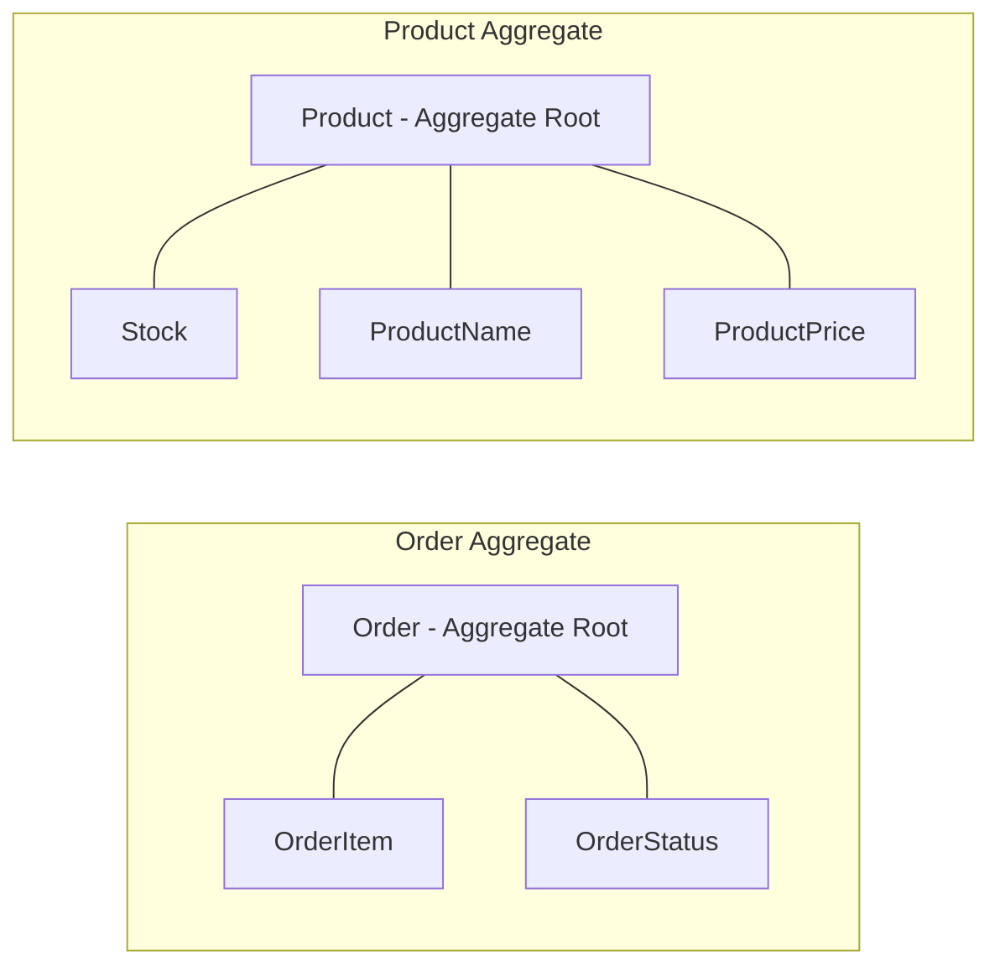
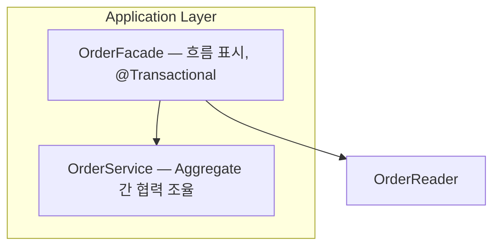
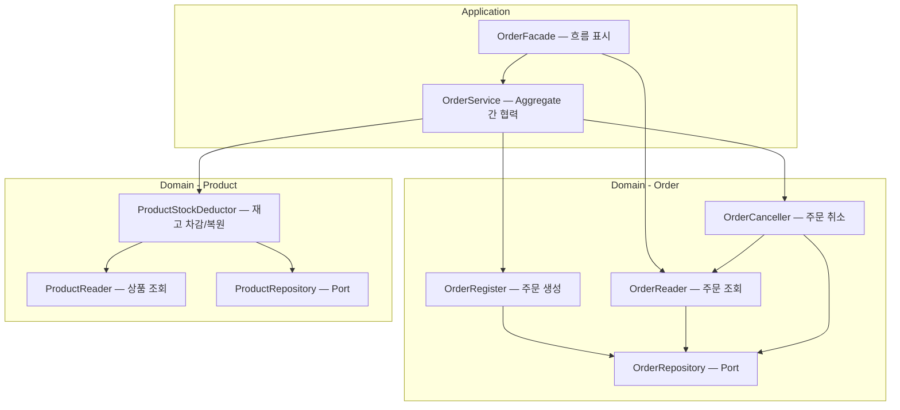
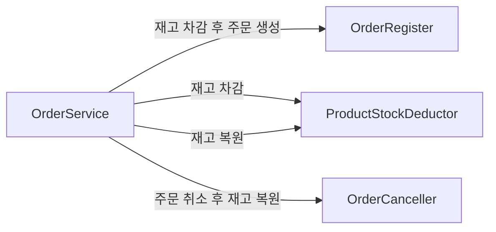
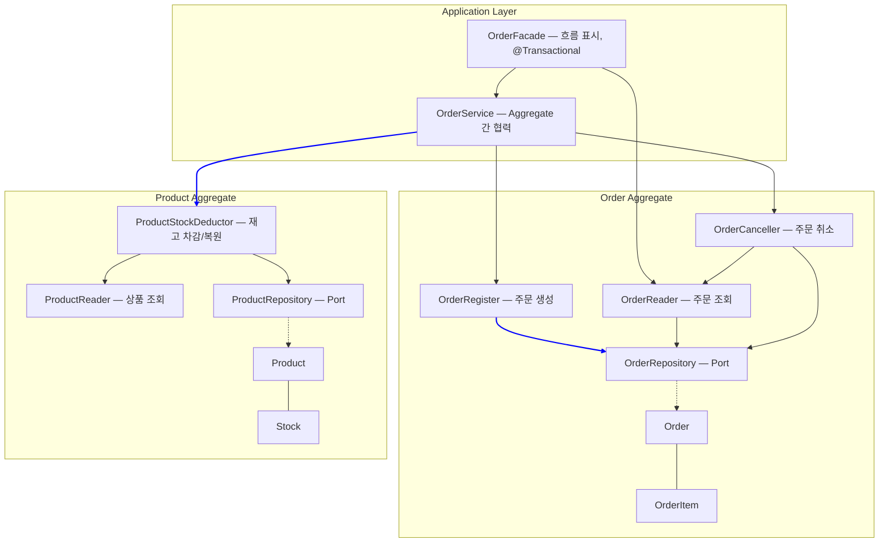

# Architecture Overview — Order x Product Aggregate 간 협력 구조

## Aggregate 구성



## Application Layer 구조



- **Facade**: 트랜잭션 경계, 도메인 흐름만 보여줌
- **Service**: 여러 Aggregate의 도메인 서비스를 조합하여 협력 로직 구현

## 레이어별 클래스와 책임



## Aggregate 간 협력 (Application Layer에서 조율)



Domain 서비스 간 직접 호출 없이, **Application Layer의 OrderService가 Aggregate 경계를 넘는 협력을 조율**한다.

## 전체 구조 (Order x Product)



파란 선이 **OrderService가 Aggregate 경계를 넘어 조율하는 호출**이다.

## 설계 결정

### Before: Domain 서비스가 다른 Aggregate 직접 호출

```
OrderRegister (Domain) ──재고 차감──▶ ProductStockDeductor (Domain) ❌
OrderCanceller (Domain) ──재고 복원──▶ ProductStockDeductor (Domain) ❌
```

- Domain 서비스가 다른 Aggregate의 도메인 서비스를 직접 의존
- Aggregate 경계가 무너짐

### After: Application Service가 협력 조율

```
OrderService (Application) ──재고 차감──▶ ProductStockDeductor (Domain) ✅
OrderService (Application) ──주문 생성──▶ OrderRegister (Domain)         ✅
```

- Domain 서비스는 자기 Aggregate 안에서만 동작
- Aggregate 간 협력은 Application Layer(OrderService)에서 조율
- Facade는 OrderService를 호출하는 흐름만 표시
