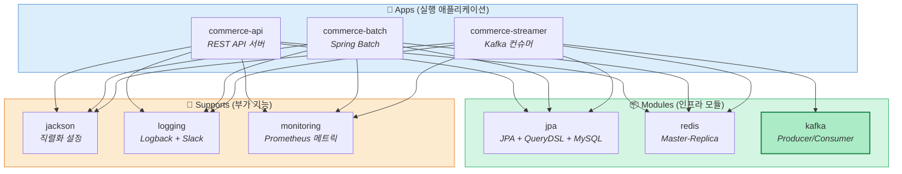
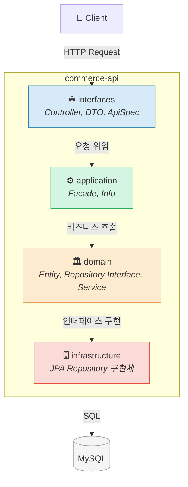
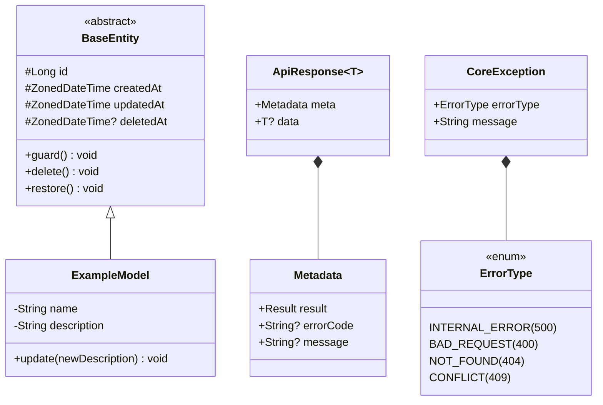
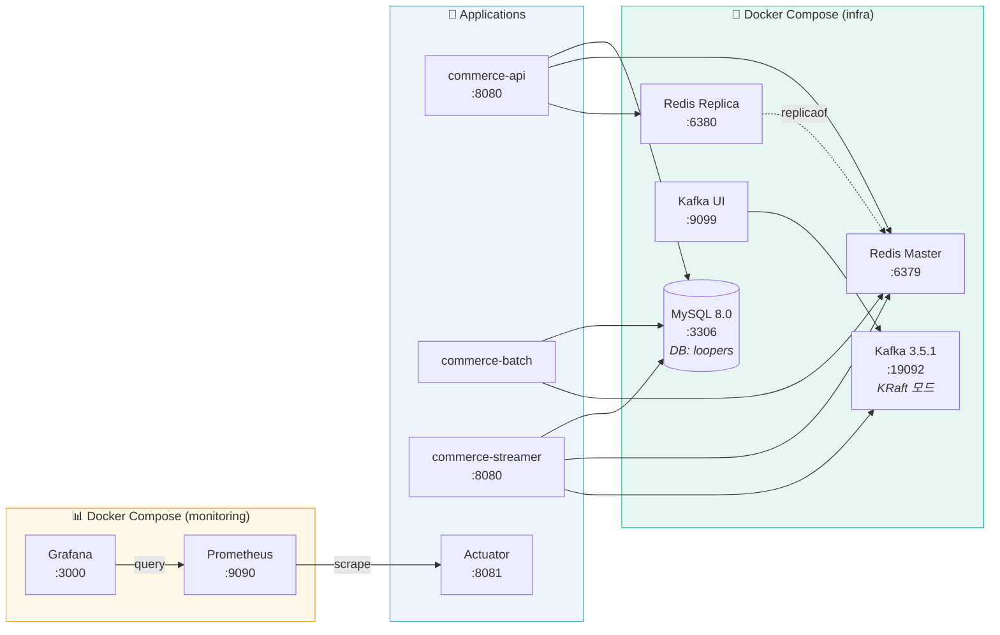
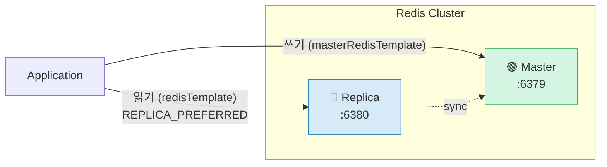
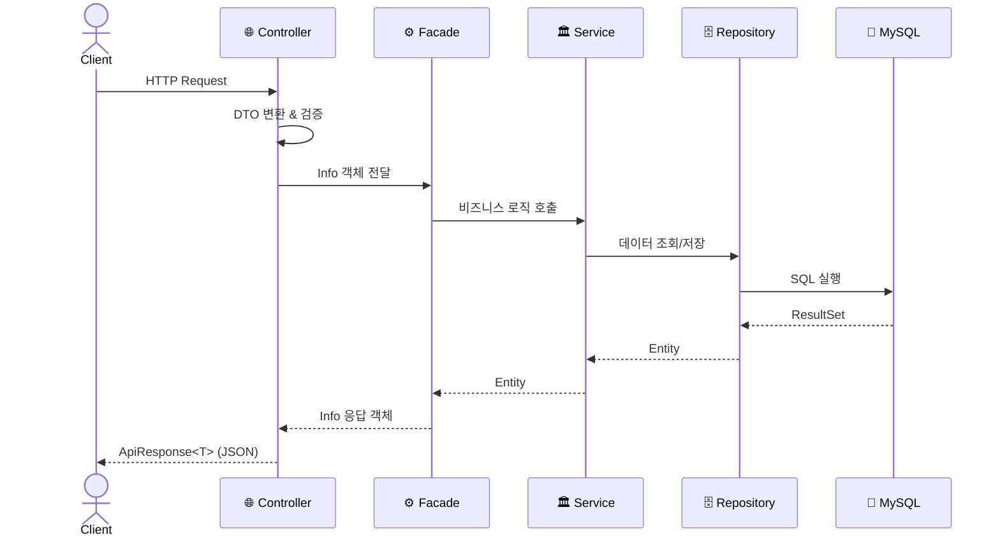
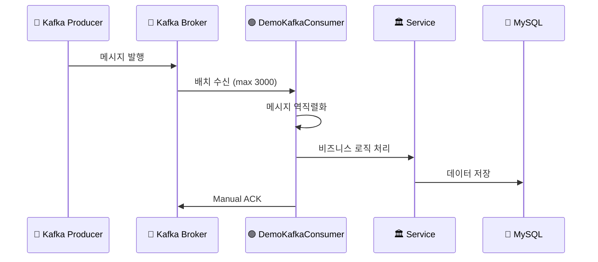
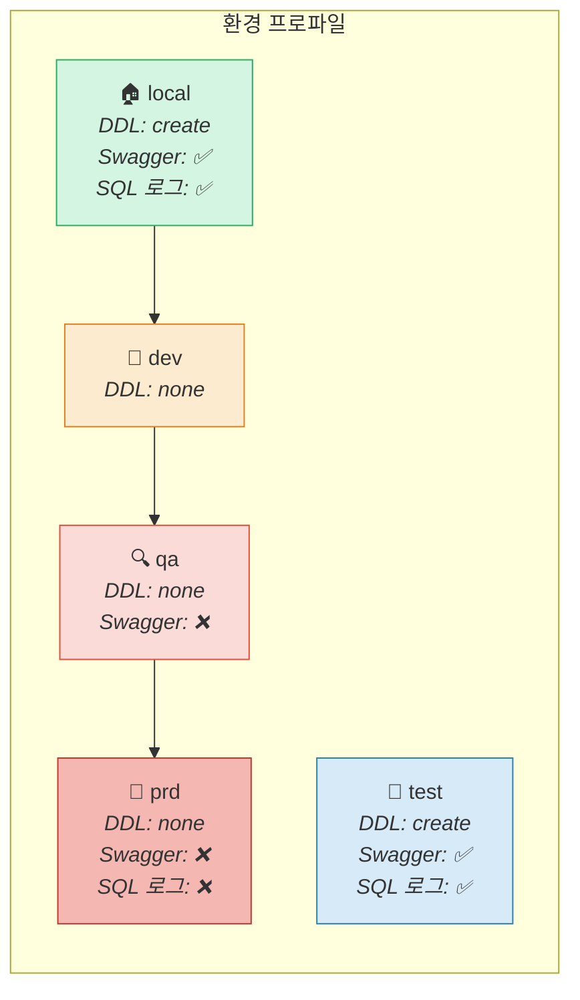
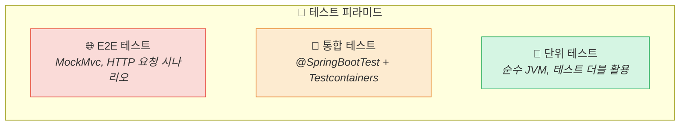

# CLAUDE.MD - Project Context

> 대화 시작 시 `.claude/local-context.md` 파일을 먼저 읽을 것

## 프로젝트 개요

- **프로젝트명**: loopers-kotlin-spring-template
- **설명**: 커머스 플랫폼 템플릿
- **그룹**: com.loopers
- **패키지 구조**: Clean Architecture (interfaces → application → domain → infrastructure)

---

## 기술 스택

### Core
| 기술 | 버전 |
|------|------|
| Kotlin | 2.0.20 |
| Java | 21 |
| Spring Boot | 3.4.4 |
| Spring Dependency Management | 1.1.7 |
| Spring Cloud | 2024.0.1 |
| Gradle (Kotlin DSL) | Wrapper |

### Data & Messaging
| 기술 | 용도 |
|------|------|
| Spring Data JPA + Hibernate | ORM |
| QueryDSL (Jakarta) | 타입 안전 쿼리 |
| MySQL 8.0 | RDBMS |
| Redis 7.0 (Master-Replica) | 캐시 (Lettuce 클라이언트) |
| Apache Kafka 3.5.1 | 메시지 브로커 (KRaft 모드) |

### API & 직렬화
| 기술 | 버전/설명 |
|------|-----------|
| Spring Web MVC | REST API |
| SpringDoc OpenAPI | 2.7.0 (Swagger UI) |
| Jackson | kotlin-module, jsr310 |

### 모니터링 & 로깅
| 기술 | 용도 |
|------|------|
| Spring Boot Actuator | 헬스체크, 메트릭 |
| Micrometer + Prometheus | 메트릭 수집 |
| Micrometer Tracing (Brave) | 분산 추적 |
| Logback + Slack Appender | 로깅 (슬랙 알림, v1.6.1) |
| Grafana | 대시보드 |

### 테스트
| 기술 | 버전 |
|------|------|
| JUnit 5 | Spring Boot 기본 |
| SpringMockk | 4.0.2 |
| Mockito | 5.14.0 |
| Mockito-Kotlin | 5.4.0 |
| Instancio | 5.0.2 |
| Testcontainers | MySQL, Redis, Kafka |

### 코드 품질
| 도구 | 버전/설명 |
|------|-----------|
| KtLint | 1.0.1 (플러그인 12.1.2) |
| JaCoCo | 커버리지 리포트 (XML) |
| Git Pre-commit Hook | ktlint 검증 |

---

## 멀티모듈 구조

```
loop-pack-be-l2-vol3-kotlin/
├── apps/                          # 실행 가능한 Spring Boot 애플리케이션
│   ├── commerce-api/              # REST API 서버 (web servlet)
│   ├── commerce-batch/            # Spring Batch 배치 처리 (non-web)
│   └── commerce-streamer/         # Kafka 컨슈머 스트리머 (web servlet)
├── modules/                       # 재사용 가능한 인프라 모듈
│   ├── jpa/                       # JPA, QueryDSL, DataSource 설정
│   ├── redis/                     # Redis Master-Replica 설정
│   └── kafka/                     # Kafka Producer/Consumer 설정
├── supports/                      # 부가 기능 모듈
│   ├── jackson/                   # Jackson 직렬화 설정
│   ├── logging/                   # Logback + Prometheus + Slack
│   └── monitoring/                # Actuator + Prometheus 메트릭
├── docker/                        # Docker Compose 파일
│   ├── infra-compose.yml          # MySQL, Redis, Kafka
│   └── monitoring-compose.yml     # Prometheus + Grafana
└── http/                          # HTTP 요청 예제 파일
```

### 모듈 의존성 그래프



---

## 아키텍처 패턴

### 레이어드 아키텍처 (Clean Architecture)



### 핵심 클래스 관계



---

## 인프라 구성도

### 로컬 Docker 인프라



### Redis 읽기/쓰기 전략



---

## 요청 처리 흐름

### commerce-api 요청 흐름



### commerce-streamer Kafka 처리 흐름



---

## 환경 프로파일



### 포트 설정
- 애플리케이션: 8080 (기본)
- 관리 포트 (Actuator): 8081

---

## 로컬 개발 환경

### 초기 설정
```bash
make init    # git hooks (ktlint pre-commit) 설정
```

### 인프라 실행 (Docker)
```bash
docker compose -f docker/infra-compose.yml up -d
```
- MySQL 8.0: `localhost:3306` (application/application, DB: loopers)
- Redis Master: `localhost:6379`
- Redis Replica: `localhost:6380`
- Kafka: `localhost:19092`
- Kafka UI: `localhost:9099`

### 모니터링 실행
```bash
docker compose -f docker/monitoring-compose.yml up -d
```
- Prometheus: `localhost:9090`
- Grafana: `localhost:3000` (admin/admin)

---

## 빌드 & 실행

### 빌드
```bash
./gradlew clean build
```
- apps 모듈: BootJar 생성
- modules/supports: 일반 Jar 생성
- 버전: Git 해시 기반 자동 생성

### 앱 실행
```bash
# commerce-api
./gradlew :apps:commerce-api:bootRun

# commerce-batch (특정 Job 실행)
./gradlew :apps:commerce-batch:bootRun --args='--job.name=demoJob'

# commerce-streamer
./gradlew :apps:commerce-streamer:bootRun
```

### 테스트
```bash
./gradlew test
```
- Testcontainers 사용 (MySQL, Redis, Kafka)
- 병렬 실행 비활성화 (maxParallelForks = 1)
- 타임존: Asia/Seoul

---

## 주요 설정 상세

### JPA (`modules/jpa`)
- open-in-view: false
- default_batch_fetch_size: 100
- timezone: UTC (NORMALIZE_UTC)
- HikariCP: max 40, min idle 30, connection-timeout 3s

### Redis (`modules/redis`)
- Master-Replica 구조
- 기본 읽기: REPLICA_PREFERRED
- 쓰기 전용: Master 템플릿 별도 제공
- Spring Data Redis Repositories: disabled

### Kafka (`modules/kafka`)
- 배치 컨슈머: max.poll.records=3000
- ACK 모드: manual
- auto.offset.reset: latest
- auto.create.topics.enable: false

### Jackson (`supports/jackson`)
- NON_NULL 직렬화
- 빈 문자열 → null 변환
- Enum: toString() 기반 역직렬화

---

## 개발 규칙

### 진행 Workflow - 증강 코딩
- **대원칙**: 방향성 및 주요 의사 결정은 개발자에게 제안만 할 수 있으며, 최종 승인된 사항을 기반으로 작업 수행
- **중간 결과 보고**: AI가 반복적인 동작을 하거나, 요청하지 않은 기능 구현, 테스트 삭제를 임의로 진행할 경우 개발자가 개입
- **설계 주도권 유지**: AI가 임의판단을 하지 않고, 방향성에 대한 제안을 진행할 수 있으나 개발자의 승인을 받은 후 수행

### 개발 Workflow - TDD (Red → Green → Refactor)
- 모든 테스트는 **3A 원칙**으로 작성 (Arrange → Act → Assert)
1. **Red Phase**: 요구사항을 만족하는 실패 테스트 케이스 작성
2. **Green Phase**: 테스트를 통과하는 최소한의 코드 작성 (오버엔지니어링 금지)
3. **Refactor Phase**: 불필요한 코드 제거, 구조 개선, 모든 테스트 통과 확인

### 테스트 계층



| 계층 | 대상 | 환경 | 속도 |
|------|------|------|------|
| **단위 테스트** | 도메인 Entity, VO, Service 순수 로직 | Spring 없이 JVM 단독 | 빠름 |
| **통합 테스트** | Service/Facade 계층 비즈니스 흐름 | @SpringBootTest + Testcontainers | 보통 |
| **E2E 테스트** | Controller → Service → DB 전체 흐름 | MockMvc / TestRestTemplate | 느림 |

### 테스트 더블 (Test Doubles)

| 역할 | 목적 | 사용 방식 |
|------|------|-----------|
| **Dummy** | 자리만 채움 (사용되지 않음) | 생성자 파라미터 채우기 |
| **Stub** | 고정된 응답 제공 (상태 기반) | `whenever().thenReturn()` |
| **Mock** | 호출 여부/횟수 검증 (행위 기반) | `verify(...)` |
| **Spy** | 진짜 객체 + 일부 조작 | `spy()` + `doReturn()` |
| **Fake** | 실제처럼 동작하는 가짜 구현체 | `InMemoryRepository` 등 직접 구현 |

---

## 주의사항

### 1. Never Do
- 실제 동작하지 않는 코드, 불필요한 Mock 데이터를 이용한 구현 금지
- null-safety 하지 않은 코드 작성 금지 (Kotlin `?`, `?:`, `?.let` 활용)
- `println` 코드 남기지 말 것
- 검증되지 않은 외부 라이브러리 무분별한 추가 금지
- 성능을 고려하지 않은 N+1 쿼리 금지
- 트랜잭션 범위 내 외부 API 호출 금지
- 민감 정보 평문 로그 출력 금지

### 2. Recommendation
- 실제 API를 호출해 확인하는 E2E 테스트 코드 작성
- 재사용 가능한 객체 설계
- 성능 최적화에 대한 대안 및 제안
- 개발 완료된 API의 경우 `http/*.http` 에 분류해 작성
- 테스트 가능한 구조로 설계 (인터페이스 기반 DI, 도메인 로직 분리)

### 3. Priority
1. 실제 동작하는 해결책만 고려
2. null-safety, thread-safety 고려
3. 테스트 가능한 구조로 설계
4. 기존 코드 패턴 분석 후 일관성 유지

---

## 개발 컨벤션

### 코드 스타일
- KtLint 강제 적용 (pre-commit hook)
- 변수명: 영어, 주석/에러메시지: 한국어 가능
- Entity: `var + protected set`으로 캡슐화, `init` 블록 및 메서드에서 유효성 검증
- DTO/Command/Info: `data class` 사용, Entity에는 일반 `class` 사용

### 모듈 규칙
- 공통 도메인/설정은 modules에 작성
- 앱별 비즈니스 로직은 apps 내부에 작성
- 외부 인프라 연동은 modules로 분리
- supports는 횡단 관심사 (로깅, 직렬화, 모니터링)

### 테스트 규칙
- modules에서 testFixtures 제공 (JPA, Redis)
- Testcontainers로 통합 테스트
- 배치 테스트: spring-batch-test 사용
- 테스트 프레임워크: JUnit 5 + Mockito-Kotlin 기반

### PR 규칙
- 브랜치: main 기준으로 feature 브랜치 생성 (예: `feat/volume-1-user-tests`)
- 커밋 메시지: `feat:`, `fix:`, `refactor:`, `test:` 접두사 사용
- PR 제목: `[volume-n] 작업 내용 요약`
- PR 본문에 `💬 리뷰 포인트` 섹션 필수 포함
- 불필요한 코드 (debug 로그, unused class) 제거 후 PR

---

## 주요 파일 위치

```
빌드 설정:
  gradle.properties                          # 전역 버전 관리
  settings.gradle.kts                        # 모듈 정의
  build.gradle.kts                           # 루트 빌드 설정

핵심 코드:
  modules/jpa/.../domain/BaseEntity.kt       # 공통 엔티티
  modules/redis/.../config/redis/RedisConfig.kt
  modules/kafka/.../config/kafka/KafkaConfig.kt

commerce-api:
  apps/commerce-api/.../interfaces/api/      # REST 컨트롤러
  apps/commerce-api/.../application/         # Facade 레이어
  apps/commerce-api/.../domain/              # 도메인 엔티티/서비스
  apps/commerce-api/.../infrastructure/      # JPA 구현체
  apps/commerce-api/.../support/error/       # 에러 처리

commerce-batch:
  apps/commerce-batch/.../batch/job/         # Job 정의
  apps/commerce-batch/.../batch/listener/    # Job/Step 리스너

commerce-streamer:
  apps/commerce-streamer/.../interfaces/consumer/  # Kafka 컨슈머

설정 파일:
  modules/jpa/src/main/resources/jpa.yml
  modules/redis/src/main/resources/redis.yml
  modules/kafka/src/main/resources/kafka.yml
  supports/logging/src/main/resources/logging.yml
  supports/monitoring/src/main/resources/monitoring.yml
```