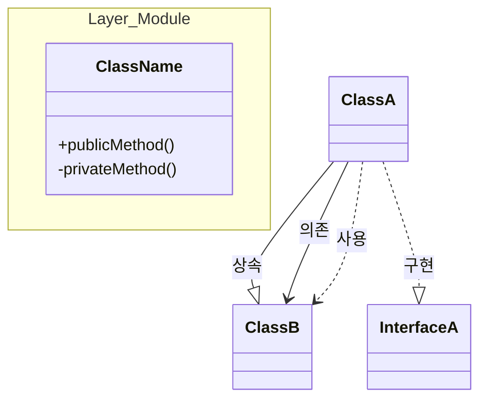
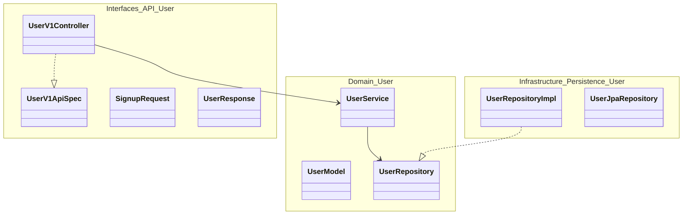
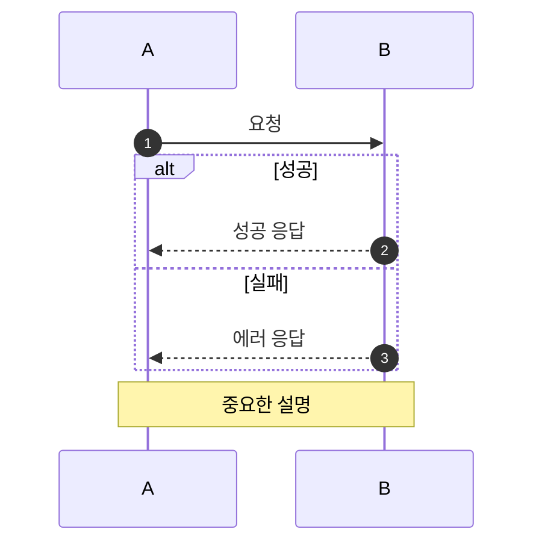
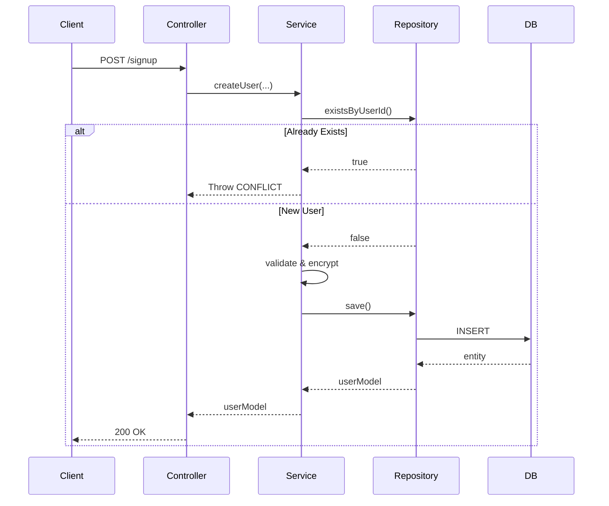

# Claude Code Agent Guidelines

## Project Context

Spring Boot/Kotlin e-commerce bootcamp project following TDD and layered architecture. Focus: clean, maintainable, security-first code that's easy to refactor.

## Core Principles

### 1. Code Structure

**Layered Architecture**
- **Interfaces** (`interfaces/api/`): Controllers, DTOs, API specs
- **Domain** (`domain/`): Services, Models, Repository interfaces
- **Infrastructure** (`infrastructure/persistence/`): Repository implementations

**Key Rules**
- Validation in service layer, NOT entity `init` blocks
- Time-dependent logic (`LocalDate.now()`) in service for testability
- Clear separation: entity `init` only for basic null/blank checks
- Structure for change - refactor when needed, not prematurely

### 2. Kotlin Conventions

Follow JetBrains guidelines:
- `data class` for DTOs
- `protected set` for entity properties
- `companion object` for constants/factory methods
- Named parameters for multi-arg functions
- Expression body for simple functions

### 3. Security Standards (Non-Negotiable)

**Input Validation**
- Validate ALL user input at service layer
- Use regex for format validation
- Validate business rules (birthDate not future, password complexity)

**Authentication**
- Be aware of timing attacks (BCrypt takes time - don't leak user existence)
- Consistent response times (run BCrypt even when user doesn't exist)
- Never expose whether userId exists through different response times

**Domain Invariants**
- Maintain invariants across ALL mutation paths
- Example: If `encryptedPassword` can't be blank in `init`, validate in `updatePassword()` too

**Password Management**
- Always use BCryptPasswordEncoder
- Never log raw passwords
- Validate complexity (8-16 chars, no birthDate patterns)

### 4. Testing Standards

**Required Coverage**
- **Unit Tests** (`*UnitTest.kt`): MockK, isolated service logic
- **Integration Tests** (`*Test.kt`): SpringBootTest, real database
- **E2E Tests** (`*E2ETest.kt`): Full API testing

**Test Checklist** (AAA Pattern)
- ✅ Success path
- ✅ Failure paths (exceptions)
- ✅ Boundary values (min, max, over/under)
- ✅ Both sides of booleans (true/false)

```kotlin
@Test
fun `methodName() should do X when Y`() {
    // Arrange - Setup
    // Act - Execute
    // Assert - Verify
}
```

### 5. Mermaid Documentation

**REQUIRED: Every implementation task must include Mermaid diagrams**

#### Class Diagram Style

```mermaid
classDiagram
    %% namespace로 계층 그룹화
    namespace Layer_Module {
        class ClassName {
            +publicMethod()
            -privateMethod()
        }
    }

    %% 관계 표현
    ClassA --|> ClassB : 상속
    ClassA ..|> InterfaceA : 구현
    ClassA --> ClassB : 의존
    ClassA ..> ClassB : 사용
```

**Example:**

```mermaid
classDiagram
    namespace Interfaces_API_User {
        class UserV1Controller
        class UserV1ApiSpec
        class SignupRequest
        class UserResponse
    }

    namespace Domain_User {
        class UserService
        class UserModel
        class UserRepository
    }

    namespace Infrastructure_Persistence_User {
        class UserRepositoryImpl
        class UserJpaRepository
    }

    UserV1Controller ..|> UserV1ApiSpec
    UserV1Controller --> UserService
    UserService --> UserRepository
    UserRepositoryImpl ..|> UserRepository
```

#### Sequence Diagram Style

```mermaid
sequenceDiagram
    autonumber
    participant A
    participant B

    A->>B: 요청

    alt 성공
        B-->>A: 성공 응답
    else 실패
        B-->>A: 에러 응답
    end

    Note over A,B: 중요한 설명
```

**Example:**

```mermaid
sequenceDiagram
    participant Client
    participant Controller
    participant Service
    participant Repository
    participant DB

    Client->>Controller: POST /signup
    Controller->>Service: createUser(...)
    Service->>Repository: existsByUserId()

    alt Already Exists
        Repository-->>Service: true
        Service-->>Controller: Throw CONFLICT
    else New User
        Repository-->>Service: false
        Service->>Service: validate & encrypt
        Service->>Repository: save()
        Repository->>DB: INSERT
        DB-->>Repository: entity
        Repository-->>Service: userModel
        Service-->>Controller: userModel
        Controller-->>Client: 200 OK
    end
```

### 6. Weekly Notes Structure

Create `week_notes/week-{N}.md` for every implementation:

```markdown
# Week {N} Implementation Notes

## ✅ Requirements Checklist
- [x] Feature A
- [ ] Feature B

## 📁 File Structure
- `Service.kt` - Purpose

## 🏗️ Class Diagram
[Mermaid diagram]

## 🔁 Sequence Diagram
[Mermaid diagram]

## 🎯 Design Decisions
- **Decision**: Rationale and trade-offs

## 🧪 Test Coverage
- Unit: [cases]
- Integration: [cases]
```

## Domain & Object Design Strategy

- **Domain objects own business rules.** Logic like "can this order be cancelled?" or "is this password valid?" belongs on the domain object (`Order.cancel()`, `User.validatePassword()`), not scattered across services. Services that contain domain rules become the bottleneck for every future change.
- **Application services orchestrate, not decide.** An application service (use-case) assembles and sequences domain operations — e.g., `PlaceOrderService` checks user eligibility, reserves stock, and triggers payment — but it does not define what "eligible" means. Domain objects do.
- **Duplication in services is a signal, not a pattern.** If `OrderService` and `ReviewService` both check "is the user active?", that rule belongs on `UserModel.requireActive()`. Repeating it in two services guarantees the two diverge over time.
- **Clarify intent before coding.** For every feature, explicitly decide: is this a domain rule (lives in the model) or an orchestration step (lives in the service)? Record the decision in the weekly notes. Ambiguity left unresolved becomes tech debt.
- **Keep domain objects framework-free.** Spring annotations and JPA concerns in domain models couple your business logic to infrastructure choices. Prefer plain Kotlin domain models and isolate persistence mapping to the infrastructure layer.

## Architecture & Package Strategy

> **DIP (Dependency Inversion Principle) is VIP — treat any violation as a build-breaking issue.**

- **Dependency direction is strictly inward:** `Interfaces → Application → Domain ← Infrastructure`. The `Domain` layer knows nothing about Spring, JPA, or HTTP. `Infrastructure` implements `Domain` interfaces — it depends on `Domain`, not the other way around.
- **Separate API DTOs from application DTOs.** `SignupRequest`/`UserResponse` (HTTP concerns) live in `interfaces/api/`; use-case inputs/outputs like `CreateUserCommand`/`UserResult` live in `application/`. Mixing them couples your API contract to your use-case logic, making both harder to change independently.
- **4-layer package structure, domain-partitioned within each layer:**

```
interfaces/
  api/
    user/          ← UserV1Controller, SignupRequest, UserResponse
    order/         ← OrderV1Controller, PlaceOrderRequest, OrderResponse
application/
  user/            ← CreateUserUseCase, CreateUserCommand, UserResult
  order/           ← PlaceOrderUseCase, PlaceOrderCommand, OrderResult
domain/
  user/            ← UserModel, UserRepository (interface), UserDomainService
  order/           ← OrderModel, OrderRepository (interface), OrderDomainService
infrastructure/
  persistence/
    user/          ← UserRepositoryImpl, UserJpaRepository, UserJpaEntity
    order/         ← OrderRepositoryImpl, OrderJpaRepository, OrderJpaEntity
```

- **A change to one layer should not ripple to all others.** If adding a field requires touching all 4 layers simultaneously, the layer boundary is leaking — find and fix the abstraction gap.
- **Infrastructure JPA entities and domain models are separate.** Map between them in the repository implementation. This costs a little code but buys you the freedom to change persistence schema without touching business logic.

## Implementation Workflow

### Starting a Feature
1. Understand requirements + security considerations
2. Write tests first (TDD) - success, failure, boundaries
3. User writes implementation (I write tests when asked)
4. Update `week_notes/week-{N}.md` with diagrams and decisions

### Refactoring
- Explain what and why
- Update Mermaid diagrams
- Ensure tests pass
- Document decisions

## Common Patterns

### Service Layer
```kotlin
@Service
class XxxService(
    private val xxxRepository: XxxRepository
) {
    @Transactional
    fun createXxx(...): XxxModel {
        // 1. Check preconditions
        // 2. Validate (service layer!)
        // 3. Transform/encrypt
        // 4. Save
        // 5. Return
    }

    private fun validateXxx(...) {
        if (!xxx.matches(regex)) {
            throw CoreException(BAD_REQUEST, "Clear message")
        }
    }
}
```

### Entity
```kotlin
@Entity
@Table(name = "xxx")
class XxxModel(field: String) : BaseEntity() {
    @Column(nullable = false)
    var field: String = field
        protected set

    init {
        // Only basic null/blank checks
        if (field.isBlank()) throw CoreException(...)
    }

    fun updateXxx(newValue: String) {
        // Validate domain invariants
        if (newValue.isBlank()) throw CoreException(...)
        this.field = newValue
    }
}
```

### DTO
```kotlin
data class XxxRequest(val field: String)

data class XxxResponse(val field: String) {
    companion object {
        fun from(model: XxxModel) = XxxResponse(model.field)
    }
}
```

## Error Handling

**CoreException with appropriate ErrorType:**
- `BAD_REQUEST` - Invalid input
- `UNAUTHORIZED` - Auth failed
- `CONFLICT` - Duplicate resource
- `NOT_FOUND` - Resource missing

```kotlin
throw CoreException(
    errorType = ErrorType.BAD_REQUEST,
    customMessage = "[$value] Clear error message"
)
```

## Key Reminders

- ✅ Structure for change, not perfection
- ✅ Security is non-negotiable
- ✅ Test failures and boundaries, not just success
- ✅ Document with Mermaid diagrams
- ✅ Validation in service, not entity
- ✅ Update weekly notes for every significant change
- ✅ Keep it simple until complexity is needed

---

**Philosophy**: "추후 확장 가능하고 가독성/지고간성이 높은 최소한의 구현으로 요구사항을 충족한다. 단, 보안과 유지보수성은 타협하지 않는다."

(Satisfy requirements with minimal implementation that's extensible and maintainable. Never compromise on security and maintainability.)
