# Claude Code Agent Guidelines

## Project Context

Spring Boot/Kotlin e-commerce bootcamp project following TDD and layered architecture. Focus: clean, maintainable, security-first code that's easy to refactor.

## Core Principles

### 1. Code Structure

**Layered Architecture**
- **Interfaces** (`interfaces/api/`): Controllers, DTOs, API specs
- **Domain** (`domain/`): Services, Models, Repository interfaces
- **Infrastructure** (`infrastructure/persistence/`): Repository implementations

**Key Rules**
- Validation in service layer, NOT entity `init` blocks
- Time-dependent logic (`LocalDate.now()`) in service for testability
- Clear separation: entity `init` only for basic null/blank checks
- Structure for change - refactor when needed, not prematurely

### 2. Kotlin Conventions

Follow JetBrains guidelines:
- `data class` for DTOs
- `protected set` for entity properties
- `companion object` for constants/factory methods
- Named parameters for multi-arg functions
- Expression body for simple functions

### 3. Security Standards (Non-Negotiable)

**Input Validation**
- Validate ALL user input at service layer
- Use regex for format validation
- Validate business rules (birthDate not future, password complexity)

**Authentication**
- Be aware of timing attacks (BCrypt takes time - don't leak user existence)
- Consistent response times (run BCrypt even when user doesn't exist)
- Never expose whether userId exists through different response times

**Domain Invariants**
- Maintain invariants across ALL mutation paths
- Example: If `encryptedPassword` can't be blank in `init`, validate in `updatePassword()` too

**Password Management**
- Always use BCryptPasswordEncoder
- Never log raw passwords
- Validate complexity (8-16 chars, no birthDate patterns)

### 4. Testing Standards

**Required Coverage**
- **Unit Tests** (`*UnitTest.kt`): MockK, isolated service logic
- **Integration Tests** (`*Test.kt`): SpringBootTest, real database
- **E2E Tests** (`*E2ETest.kt`): Full API testing

**Test Checklist** (AAA Pattern)
- ✅ Success path
- ✅ Failure paths (exceptions)
- ✅ Boundary values (min, max, over/under)
- ✅ Both sides of booleans (true/false)

```kotlin
@Test
fun `methodName() should do X when Y`() {
    // Arrange - Setup
    // Act - Execute
    // Assert - Verify
}
```

### 5. Mermaid Documentation

**REQUIRED: Every implementation task must include Mermaid diagrams**

#### Class Diagram Style

```mermaid
classDiagram
    %% namespace로 계층 그룹화
    namespace Layer_Module {
        class ClassName {
            +publicMethod()
            -privateMethod()
        }
    }

    %% 관계 표현
    ClassA --|> ClassB : 상속
    ClassA ..|> InterfaceA : 구현
    ClassA --> ClassB : 의존
    ClassA ..> ClassB : 사용
```


**Example:**


#### Sequence Diagram Style

```mermaid
sequenceDiagram
    autonumber
    participant A
    participant B

    A->>B: 요청

    alt 성공
        B-->>A: 성공 응답
    else 실패
        B-->>A: 에러 응답
    end

    Note over A,B: 중요한 설명
```


**Example:**


### 6. Weekly Notes Structure

Create `week_notes/week-{N}.md` for every implementation:

```markdown
# Week {N} Implementation Notes

## ✅ Requirements Checklist
- [x] Feature A
- [ ] Feature B

## 📁 File Structure
- `Service.kt` - Purpose

## 🏗️ Class Diagram
[Mermaid diagram]

## 🔁 Sequence Diagram
[Mermaid diagram]

## 🎯 Design Decisions
- **Decision**: Rationale and trade-offs

## 🧪 Test Coverage
- Unit: [cases]
- Integration: [cases]
```

## Implementation Workflow

### Starting a Feature
1. Understand requirements + security considerations
2. Write tests first (TDD) - success, failure, boundaries
3. User writes implementation (I write tests when asked)
4. Update `week_notes/week-{N}.md` with diagrams and decisions

### Refactoring
- Explain what and why
- Update Mermaid diagrams
- Ensure tests pass
- Document decisions

## Common Patterns

### Service Layer
```kotlin
@Service
class XxxService(
    private val xxxRepository: XxxRepository
) {
    @Transactional
    fun createXxx(...): XxxModel {
        // 1. Check preconditions
        // 2. Validate (service layer!)
        // 3. Transform/encrypt
        // 4. Save
        // 5. Return
    }

    private fun validateXxx(...) {
        if (!xxx.matches(regex)) {
            throw CoreException(BAD_REQUEST, "Clear message")
        }
    }
}
```

### Entity
```kotlin
@Entity
@Table(name = "xxx")
class XxxModel(field: String) : BaseEntity() {
    @Column(nullable = false)
    var field: String = field
        protected set

    init {
        // Only basic null/blank checks
        if (field.isBlank()) throw CoreException(...)
    }

    fun updateXxx(newValue: String) {
        // Validate domain invariants
        if (newValue.isBlank()) throw CoreException(...)
        this.field = newValue
    }
}
```

### DTO
```kotlin
data class XxxRequest(val field: String)

data class XxxResponse(val field: String) {
    companion object {
        fun from(model: XxxModel) = XxxResponse(model.field)
    }
}
```

## Error Handling

**CoreException with appropriate ErrorType:**
- `BAD_REQUEST` - Invalid input
- `UNAUTHORIZED` - Auth failed
- `CONFLICT` - Duplicate resource
- `NOT_FOUND` - Resource missing

```kotlin
throw CoreException(
    errorType = ErrorType.BAD_REQUEST,
    customMessage = "[$value] Clear error message"
)
```

## Key Reminders

- ✅ Structure for change, not perfection
- ✅ Security is non-negotiable
- ✅ Test failures and boundaries, not just success
- ✅ Document with Mermaid diagrams
- ✅ Validation in service, not entity
- ✅ Update weekly notes for every significant change
- ✅ Keep it simple until complexity is needed

---

**Philosophy**: "추후 확장 가능하고 가독성/지고간성이 높은 최소한의 구현으로 요구사항을 충족한다. 단, 보안과 유지보수성은 타협하지 않는다."

(Satisfy requirements with minimal implementation that's extensible and maintainable. Never compromise on security and maintainability.)
