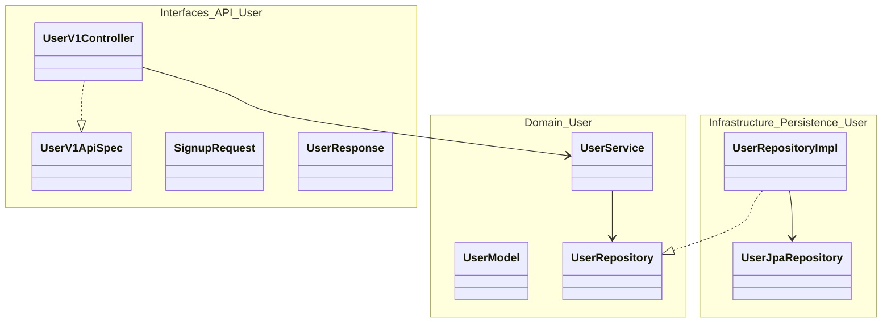
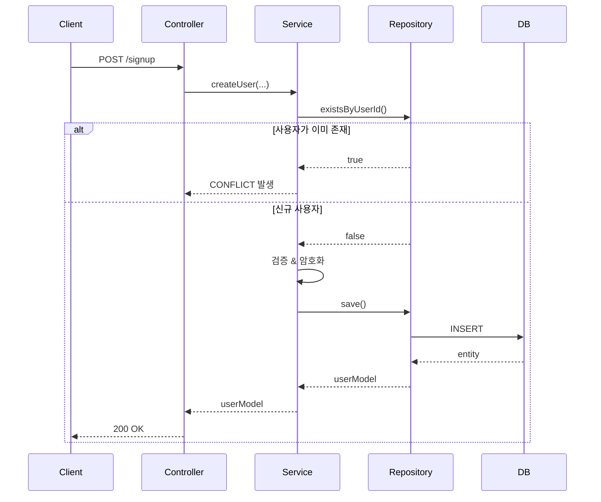
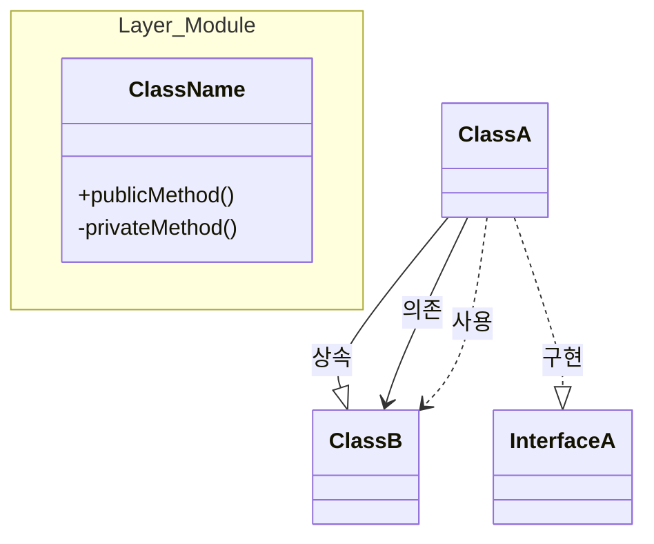
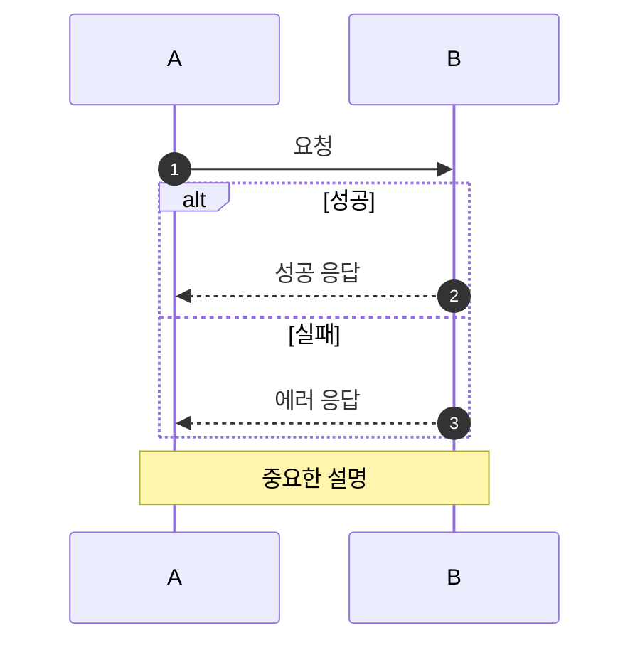

# Claude Code 에이전트 가이드라인

## 프로젝트 컨텍스트

Spring Boot/Kotlin 기반 이커머스 부트캠프 프로젝트로, TDD 원칙과 계층형 아키텍처를 따릅니다. 다른 개발자가 쉽게 이해하고 수정할 수 있는 깔끔하고 유지보수 가능한 코드를 지향합니다.

## 핵심 원칙

### 1. 코드 구조 표준

**계층형 아키텍처**
- **Interfaces 레이어** (`interfaces/api/`): 컨트롤러, DTO, API 명세 (OpenAPI/Swagger)
- **Domain 레이어** (`domain/`): 서비스, 모델(엔티티), Repository 인터페이스
- **Infrastructure 레이어** (`infrastructure/persistence/`): Repository 구현체, JPA Repository

**변경 가능성 우선**
- 요구사항 변경 시 쉽게 리팩토링할 수 있는 구조
- 관심사를 명확히 분리 (검증은 서비스, 엔티티 아님)
- 인터페이스를 사용하여 구현체 교체 용이하게
- 조기 추상화 지양 - 지금 필요한 것만 구현, 필요할 때 리팩토링

**개발자 친화적 코드**
- 다른 개발자가 코드 흐름을 즉시 이해할 수 있어야 함
- 명확하고 설명적인 이름 사용 (표준이 아닌 축약어 금지)
- 메서드는 단일 책임에 집중
- 자명하지 않은 비즈니스 로직에만 주석 추가

### 2. Kotlin 컨벤션 & 스타일

**JetBrains Kotlin Coding Conventions**와 실무 베스트 프랙티스를 따릅니다:

**클래스 & 프로퍼티**
- DTO와 값 객체는 `data class` 사용
- 엔티티 프로퍼티는 `protected set`으로 외부 변경 방지
- 가능한 `var`보다 `val` 선호
- 상수와 팩토리 메서드는 `companion object` 사용

**검증 로직**
- 검증 로직은 **서비스 레이어**에, 엔티티 `init` 블록에 두지 말 것
- 엔티티 `init` 블록은 기본적인 null/blank 체크만
- 시간 의존적 검증(예: `LocalDate.now()`)은 테스트 가능성을 위해 서비스 레이어에

**함수**
- 여러 매개변수가 있는 함수 호출 시 명명된 매개변수 사용
- 오버로딩 대신 기본 매개변수 사용
- 간단한 함수는 표현식 본문 선호

**예시:**
```kotlin
// 좋은 예 - 서비스 레이어 검증
@Service
class UserService(private val userRepository: UserRepository) {
    fun createUser(...): UserModel {
        validateUserId(userId)
        validateEmail(email)
        validateBirthDate(birthDate) // 시간 의존적 검증은 여기서
        // ...
    }
}

// 좋은 예 - 최소한의 init을 가진 엔티티
@Entity
class UserModel(...) {
    init {
        if (userId.isBlank()) throw CoreException(...)
        // 비즈니스 로직 없이 기본 체크만
    }
}
```

### 3. 보안 표준

보안은 **1급 관심사**입니다. 모든 구현은 다음을 고려해야 합니다:

**입력 검증**
- 서비스 레이어에서 모든 사용자 입력 검증
- 포맷 검증에 정규식 사용 (userId, email, password)
- 비즈니스 규칙 검증 (생년월일이 미래 아님, 비밀번호에 생년월일 미포함 등)

**인증 & 인가**
- 인증에서 타이밍 공격 인지 (changePassword 예시 참조)
- 다른 에러 메시지를 통해 사용자 존재 여부 노출 금지
- 일관된 응답 시간 사용 (사용자가 존재하지 않을 때 BCrypt 타이밍 고려)

**비밀번호 관리**
- 항상 BCryptPasswordEncoder로 암호화
- 평문 비밀번호를 로그에 남기거나 노출하지 말 것
- 비밀번호 복잡도 검증 (길이, 문자 타입, 생년월일 패턴 없음)

**도메인 불변 조건**
- 모든 변경 경로에서 불변 조건 유지
- 예시: `init`에서 `encryptedPassword`가 blank일 수 없다면, `updatePassword()`에서도 검증

**예시 - 타이밍 공격 방지:**
```kotlin
// 문제: 사용자 없으면 빠른 응답, 틀린 비밀번호는 느린 응답 (BCrypt)
// 공격자가 응답 시간을 측정하여 유효한 userId를 열거할 수 있음
fun authenticate(userId: String, password: String): UserModel {
    val user = userRepository.findByUserId(userId)

    // 해결책: 사용자가 없어도 항상 BCrypt 실행
    val isValid = if (user != null) {
        passwordEncoder.matches(password, user.encryptedPassword)
    } else {
        passwordEncoder.matches(password, "$2a$10$dummyHashForTiming")
        false
    }

    if (!isValid) throw CoreException(UNAUTHORIZED, "유효하지 않은 인증정보입니다.")
    return user!!
}
```

### 4. 테스트 표준

**필수 테스트 커버리지**
- **Unit Tests** (`*UnitTest.kt`): Mock 의존성을 사용한 서비스 로직 테스트 (MockK)
- **Integration Tests** (`*Test.kt`): 실제 데이터베이스를 사용한 전체 스택 테스트 (SpringBootTest)
- **E2E Tests** (`*E2ETest.kt`): API 레이어 테스트

**테스트 구조 (AAA 패턴)**
```kotlin
@Test
fun `메서드명() 조건일 때 무언가를 해야 한다`() {
    // Arrange - 테스트 데이터와 Mock 설정

    // Act - 테스트 대상 메서드 실행

    // Assert - 결과 검증
}
```

**테스트 커버리지 체크리스트**
- ✅ 성공 경로 (happy path)
- ✅ 실패 경로 (예외, 에러 케이스)
- ✅ 경계값 (최소, 최대, 한계 초과/미만)
- ✅ 엣지 케이스 (empty, null, 특수문자)
- ✅ Boolean 조건의 양쪽 (true/false 케이스)

**예시:**
```kotlin
// Unit Test - 의존성 Mock
every { mockRepository.existsByUserId(any()) } returns false
every { mockPasswordEncoder.encode(any()) } returns "hashedPassword"

// Integration Test - 실제 데이터베이스
@SpringBootTest
@ActiveProfiles("test")
class UserServiceTest { ... }
```

### 5. Mermaid 다이어그램을 통한 문서화

**모든 구현 작업은 Mermaid 다이어그램을 포함**하여 아키텍처와 흐름을 시각화해야 합니다.

#### 클래스 다이어그램 (구조)


#### 시퀀스 다이어그램 (흐름)


### 6. 주간 노트 구조

`week_notes/week-{N}.md`에 주차별 구현 노트를 작성합니다:

**필수 섹션:**
1. **Requirements Checklist** - 구현 진행 상황 추적
2. **File Structure** - 주요 파일과 용도 나열
3. **Class Diagram** - 클래스 관계를 보여주는 Mermaid 다이어그램
4. **Sequence Diagram** - 요청 플로우를 보여주는 Mermaid 다이어그램
5. **Design Decisions** - 주요 아키텍처 선택과 트레이드오프
6. **Test Coverage** - 테스트 카테고리와 케이스 목록

**템플릿:**
```markdown
# Week {N} 구현 노트

## ✅ 요구사항 체크리스트
- [x] 회원가입
- [x] 내 정보 조회
- [ ] 진행 중인 기능

## 📁 파일 구조
- `UserService.kt` - 사용자 도메인 서비스
- `UserModel.kt` - 사용자 엔티티

## 🏗️ 클래스 다이어그램
[Mermaid 클래스 다이어그램]

## 🔁 시퀀스 다이어그램
[Mermaid 시퀀스 다이어그램]

## 🎯 설계 결정
- **Facade 없음**: 단일 도메인, Controller → Service 직접 연결
- **JPA Entity = Domain Model**: 현재는 통합, 필요시 나중에 분리

## 🧪 테스트 커버리지
- Unit Tests: [목록]
- Integration Tests: [목록]
```

## 구현 워크플로우

### 새 기능 시작 시

1. **요구사항 이해**
   - 요구사항을 주의 깊게 읽기
   - 필요시 명확화 질문
   - 보안 고려사항 식별

2. **설계 단계 (필요시)**
   - 클래스 관계 스케치
   - 검증 규칙 식별
   - 실패 시나리오 고려

3. **테스트 먼저 작성 (TDD)**
   - 성공 + 실패 + 경계값을 커버하는 테스트 케이스 작성
   - 사용자가 구현 코드 작성 (요청 시 테스트 작성)

4. **문서화**
   - `week_notes/week-{N}.md` 업데이트:
     - 체크리스트 갱신
     - Mermaid 다이어그램 (클래스 + 시퀀스)
     - 설계 결정 사항
     - 추가된 테스트 커버리지

5. **리뷰**
   - Kotlin 컨벤션 확인
   - 보안 고려사항 검증
   - 테스트가 경계값과 실패 케이스를 커버하는지 확인

### 리팩토링 시

- 무엇을 왜 변경하는지 설명
- Mermaid 다이어그램을 새 구조에 맞게 업데이트
- 모든 테스트가 여전히 통과하는지 확인
- 주간 노트에 아키텍처 결정 문서화

## 공통 패턴

### 서비스 레이어 패턴
```kotlin
@Service
class XxxService(
    private val xxxRepository: XxxRepository,
    private val passwordEncoder: PasswordEncoder  // 의존성 주입
) {
    @Transactional
    fun createXxx(...): XxxModel {
        // 1. 중복/사전조건 확인
        // 2. 입력 검증
        // 3. 데이터 변환/암호화
        // 4. Repository에 저장
        // 5. 결과 반환
    }

    private fun validateXxx(...) {
        // 명확한 에러 메시지와 함께 검증 로직
        if (!xxx.matches(regex)) {
            throw CoreException(BAD_REQUEST, "명확한 에러 메시지")
        }
    }
}
```

### 엔티티 패턴
```kotlin
@Entity
@Table(name = "xxx")
class XxxModel(
    field: String,
) : BaseEntity() {

    @Column(nullable = false)
    var field: String = field
        protected set  // 외부 변경 방지

    init {
        // 기본적인 null/blank 체크만
        if (field.isBlank()) throw CoreException(...)
    }

    fun updateXxx(newValue: String) {
        // 도메인 불변 조건 검증
        if (newValue.isBlank()) throw CoreException(...)
        this.field = newValue
    }
}
```

### DTO 패턴
```kotlin
// Request DTO
data class XxxRequest(
    val field1: String,
    val field2: LocalDate,
)

// Response DTO
data class XxxResponse(
    val field1: String,
    val field2: String,
) {
    companion object {
        fun from(model: XxxModel): XxxResponse {
            return XxxResponse(
                field1 = model.field1,
                field2 = model.field2
            )
        }
    }
}
```

## 에러 처리

**적절한 ErrorType과 함께 CoreException 사용:**
- `BAD_REQUEST` - 잘못된 입력, 검증 실패
- `UNAUTHORIZED` - 인증 실패
- `CONFLICT` - 중복 리소스
- `NOT_FOUND` - 리소스가 존재하지 않음

**항상 명확한 에러 메시지 제공:**
```kotlin
throw CoreException(
    errorType = ErrorType.BAD_REQUEST,
    customMessage = "[$userId] 해당 ID에 해당하는 계정이 존재합니다."
)
```

## 주요 리마인더

- ✅ 완벽함이 아닌 변경 가능성을 위한 구조
- ✅ 보안은 타협 불가
- ✅ 성공뿐 아니라 경계값과 실패도 테스트
- ✅ Mermaid 다이어그램으로 문서화
- ✅ Kotlin 컨벤션 준수
- ✅ 복잡도가 필요할 때까지 단순하게 유지
- ✅ 모든 중요한 변경사항은 주간 노트 업데이트

---

**철학**: "최소한의 구현으로 요구사항을 충족한다. 단, 보안과 유지보수성은 타협하지 않는다."

## 작업 시 체크리스트

### 새 기능 구현 시
- [ ] 요구사항을 명확히 이해했는가?
- [ ] 보안 취약점을 고려했는가? (입력 검증, 인증, 타이밍 공격 등)
- [ ] 테스트가 성공/실패/경계값을 모두 커버하는가?
- [ ] Kotlin 컨벤션을 따랐는가? (data class, protected set, companion object 등)
- [ ] 계층 분리가 명확한가? (검증은 서비스, 엔티티는 도메인 모델)
- [ ] Mermaid 다이어그램을 업데이트했는가?
- [ ] `week_notes/week-{N}.md`를 업데이트했는가?

### 코드 리뷰 시 확인사항
- [ ] 다른 개발자가 이해하기 쉬운 코드인가?
- [ ] 변경이 필요할 때 쉽게 수정할 수 있는 구조인가?
- [ ] 보안 표준을 충족하는가?
- [ ] 테스트가 충분한가? (실패 케이스, 경계값)
- [ ] 문서가 최신 상태인가?

### 실무 관점 고려사항
- **운영 안정성**: 예외 처리가 적절한가? 명확한 에러 메시지를 제공하는가?
- **성능**: N+1 쿼리 문제는 없는가? 불필요한 데이터베이스 호출은 없는가?
- **모니터링**: 중요한 작업에 로깅이 있는가?
- **확장성**: 새로운 요구사항이 추가될 때 쉽게 확장 가능한가?

## 실무 보안 체크리스트

모든 구현에서 다음 보안 항목을 확인하세요:

### 입력 검증
- [ ] 모든 사용자 입력을 서비스 레이어에서 검증하는가?
- [ ] 정규식으로 포맷을 검증하는가? (이메일, 아이디 등)
- [ ] 길이 제한을 두었는가?
- [ ] SQL Injection 가능성은 없는가? (JPA 사용 시 안전)
- [ ] XSS 가능성은 없는가?

### 인증/인가
- [ ] 비밀번호를 평문으로 저장하지 않는가? (BCrypt 사용)
- [ ] 타이밍 공격 가능성은 없는가?
- [ ] 사용자 존재 여부를 노출하지 않는가?
- [ ] 세션/토큰 관리가 안전한가?

### 데이터 보호
- [ ] 민감한 정보를 로그에 남기지 않는가?
- [ ] 응답에서 민감한 정보를 마스킹하는가?
- [ ] 암호화된 데이터를 안전하게 처리하는가?

### 에러 처리
- [ ] 스택 트레이스를 클라이언트에 노출하지 않는가?
- [ ] 에러 메시지가 시스템 내부 정보를 노출하지 않는가?
- [ ] 일관된 에러 응답 형식을 사용하는가?

## Mermaid 다이어그램 가이드

### 언제 어떤 다이어그램을 사용할까?

**Class Diagram** - 구조를 보여줄 때
- 새 기능의 클래스/인터페이스 관계
- 계층 구조 (Interfaces/Domain/Infrastructure)
- 상속/구현 관계

**Sequence Diagram** - 플로우를 보여줄 때
- API 요청 처리 흐름
- 계층 간 호출 순서
- 에러 처리 분기 (alt/else)

**Flowchart** - 복잡한 로직을 보여줄 때
- 조건 분기가 많은 비즈니스 로직
- 상태 전환

### 다이어그램 스타일 가이드

**Class Diagram**


**Sequence Diagram**


### 다이어그램 업데이트 타이밍
- 새 기능 추가 시
- 기존 구조 변경 시
- 새로운 계층/컴포넌트 추가 시
- 중요한 플로우 변경 시

## 팁과 베스트 프랙티스

### Kotlin 관용구
```kotlin
// ✅ Good - apply로 객체 초기화
val user = UserModel(...).apply {
    // 추가 설정
}

// ✅ Good - let으로 null 체크
user?.let {
    // user가 null이 아닐 때만 실행
}

// ✅ Good - run으로 복잡한 초기화
val result = run {
    val temp = calculateSomething()
    processTemp(temp)
}

// ✅ Good - require/check로 사전조건 검증
require(userId.isNotBlank()) { "userId는 비어있을 수 없습니다" }
check(user.isActive) { "비활성 사용자입니다" }
```

### 테스트 작성 팁
```kotlin
// ✅ Good - 테스트 이름이 명확함
@Test
fun `createUser() throws BAD_REQUEST when userId contains special characters`()

// ✅ Good - given-when-then 주석으로 구조 명확화
@Test
fun test() {
    // given
    val input = ...

    // when
    val result = service.method(input)

    // then
    assertThat(result).isEqualTo(expected)
}

// ✅ Good - 여러 케이스를 @ParameterizedTest로
@ParameterizedTest
@ValueSource(strings = ["user!@#", "유저", "user name"])
fun `createUser() rejects invalid userId formats`(invalidUserId: String) {
    assertThrows<CoreException> {
        service.createUser(invalidUserId, ...)
    }
}
```

### 리팩토링 시그널
다음 상황에서 리팩토링을 고려하세요:

- 메서드가 20줄을 넘어갈 때
- 같은 코드가 3번 이상 반복될 때
- 클래스가 여러 책임을 가질 때
- 테스트 작성이 어려울 때
- 새 기능 추가가 기존 코드를 많이 수정해야 할 때

---

**Remember**: "완벽한 코드는 없다. 하지만 이해하기 쉽고, 안전하고, 테스트된 코드는 가능하다."
