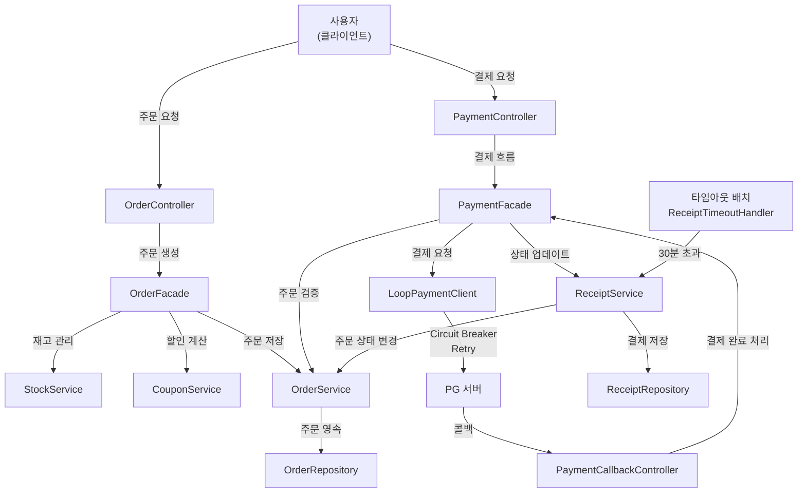
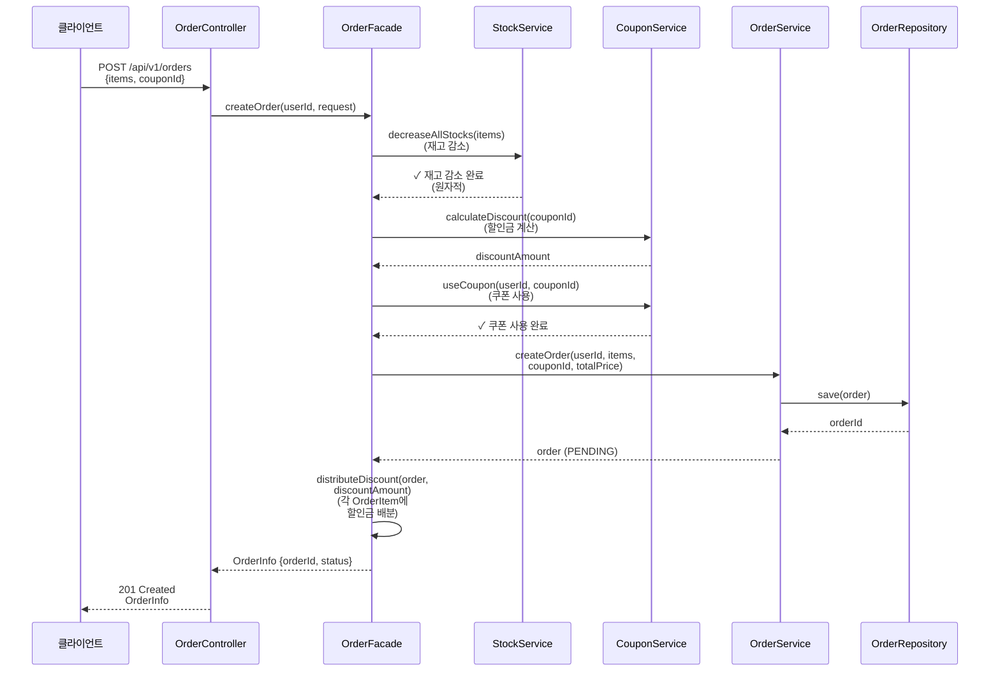
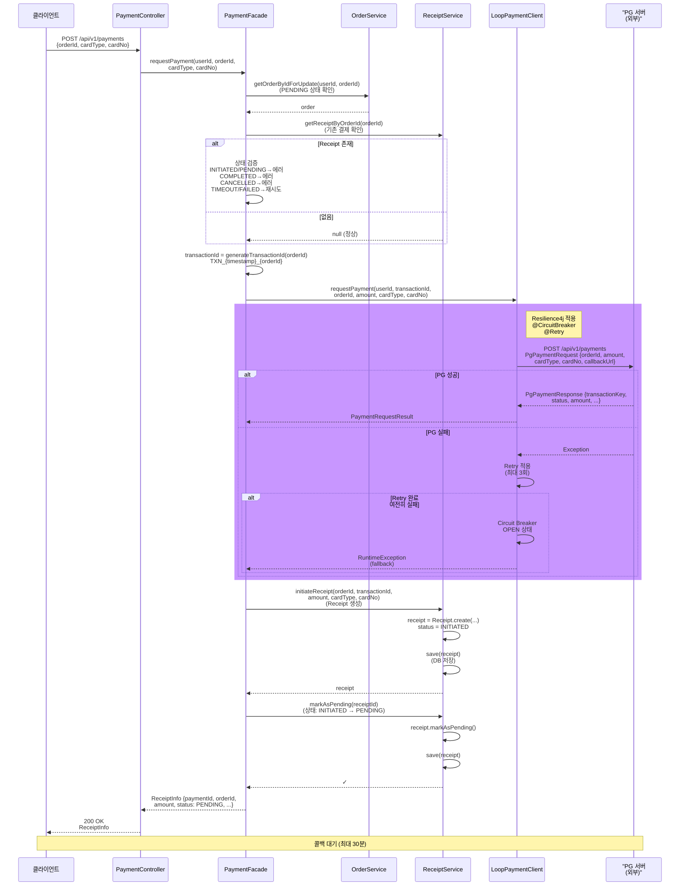
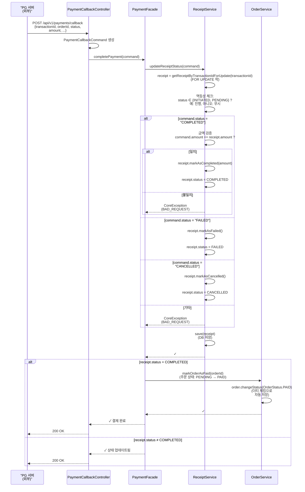
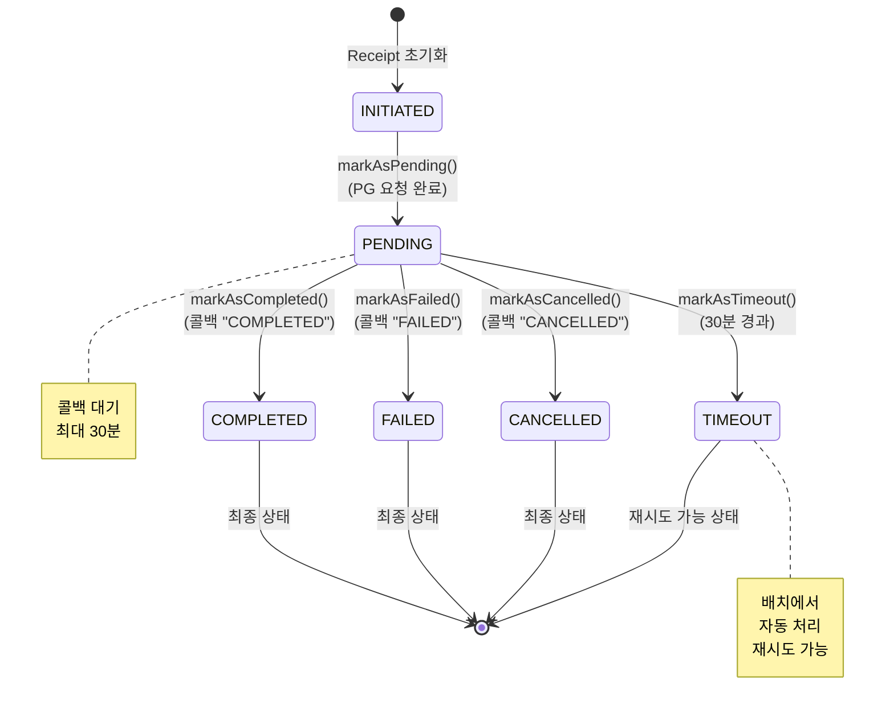
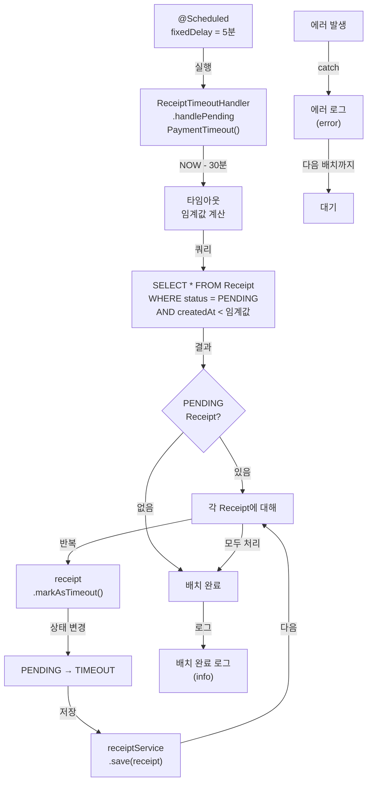
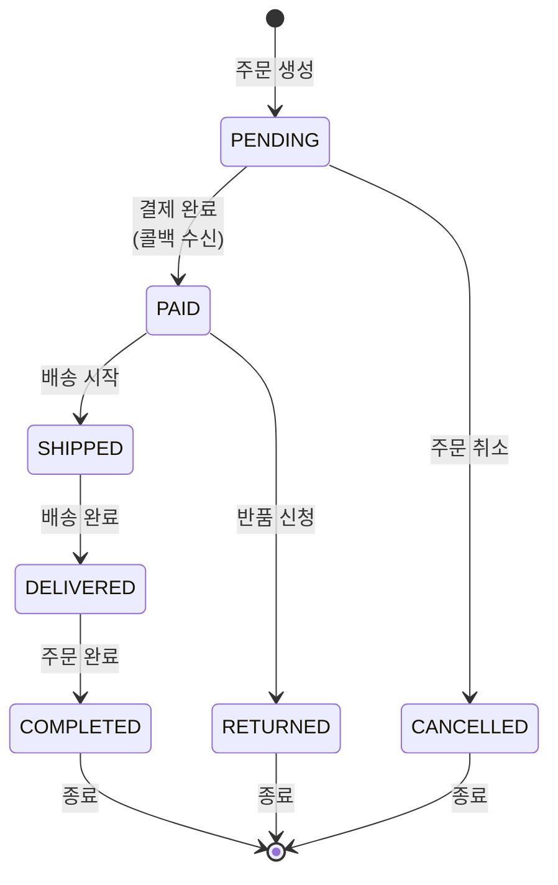
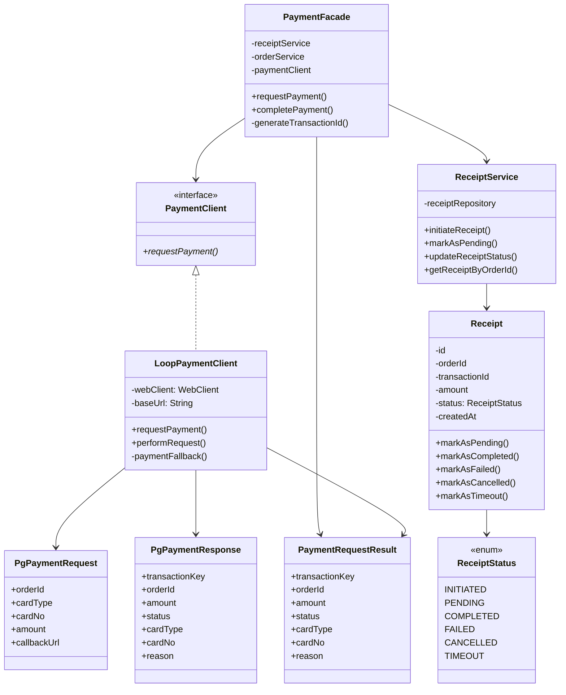
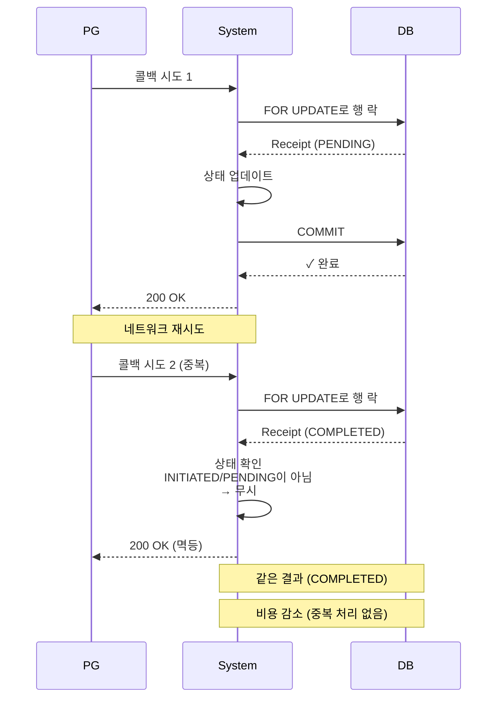

# 주문 처리 및 결제 흐름

## 1. 전체 아키텍처 흐름



---

## 2. 주문 생성 흐름 (Order Creation Flow)



---

## 3. 결제 요청 흐름 (Payment Request Flow)



---

## 4. 결제 콜백 처리 흐름 (Payment Callback Flow)



---

## 5. Receipt 상태 전이도 (State Machine)



---

## 6. 타임아웃 배치 처리 (Timeout Batch Handler)



---

## 7. Order 상태 전이도



---

## 8. 클래스 다이어그램 (결제 관련)



---

## 9. 에러 처리 흐름

```mermaid
graph TD
    A["결제 요청"] --> B{유효성<br/>검사}

    B -->|Order 없음| C["BAD_REQUEST<br/>주문을 찾을 수 없음"]
    B -->|Order PAID| C
    B -->|정상| D{Receipt<br/>상태 확인}

    D -->|INITIATED| E["CONFLICT<br/>결제가 진행 중"]
    D -->|PENDING| E
    D -->|COMPLETED| F["CONFLICT<br/>이미 완료된 결제"]
    D -->|CANCELLED| G["CONFLICT<br/>취소된 결제"]
    D -->|없음 또는 TIMEOUT/FAILED| H["PG 요청"]

    H --> I{PG 응답}
    I -->|성공| J["Receipt 생성<br/>PENDING 상태"]
    I -->|실패| K["INTERNAL_ERROR<br/>PG 요청 실패"]

    rect rgb(255, 200, 200)
        L["콜백 처리"] --> M{Receipt<br/>상태}
        M -->|INITIATED/PENDING| N["상태 업데이트"]
        M -->|기타| O["무시<br/>(이미 처리됨)"]

        N --> P{status<br/>유효?}
        P -->|COMPLETED| Q["금액 검증"]
        P -->|FAILED/CANCELLED| R["상태만 변경"]
        P -->|기타| S["BAD_REQUEST<br/>유효하지 않은 상태"]

        Q --> T{금액<br/>일치?}
        T -->|일치| U["COMPLETED로 변경"]
        T -->|불일치| V["BAD_REQUEST<br/>금액 불일치"]
    end

    C --> W["에러 응답"]
    E --> W
    F --> W
    G --> W
    K --> W
    S --> W
    V --> W

    J --> X["정상 응답"]
    U --> X
    R --> X
```

---

## 10. 타이밍 다이어그램 (Timeout Scenario)

```mermaid
timing
    title Receipt 타임아웃 시나리오

    section 사용자
    결제 요청 : user, 0, 1m
    콜백 기다리는 중 (무응답) : crit, 1m, 30m

    section Receipt
    INITIATED : receipt, 0, 1m
    PENDING : pending, 1m, 30m
    TIMEOUT (자동) : crit, 30m, 31m

    section 배치
    배치 실행 : batch, 0, 5m
    배치 실행 : batch, 5m, 10m
    배치 실행 : batch, 10m, 15m
    ...타임아웃 임계값까지... : batch, 25m, 30m
    타임아웃 처리 : crit, 30m, 31m

    section 사용자 재시도
    재시도 요청 가능 : retry, 31m, 40m
    (새로운 Receipt 생성) : retry, 32m, 33m
```

---

## 11. 주요 설정값

| 항목 | 값 | 비고 |
|------|-----|------|
| **Receipt 타임아웃** | 30분 | ReceiptTimeoutHandler에서 체크 |
| **배치 실행 주기** | 5분 | @Scheduled(fixedDelay = 5분) |
| **Retry 최대 횟수** | 3회 | resilience4j 설정 |
| **Retry 대기 시간** | 1000ms | resilience4j 설정 |
| **Circuit Breaker 실패율** | 50% | resilience4j 설정 |
| **Circuit Breaker 윈도우** | 10개 호출 | slidingWindowSize |
| **Circuit Breaker OPEN 유지시간** | 5초 | waitDurationInOpenState |

---

## 12. 멱등성 보장

### 콜백 처리의 멱등성



---

## 주요 특징

### ✅ 안정성
- **Circuit Breaker**: PG 서버 장애 시 연쇄 장애 방지
- **Retry**: 일시적 네트워크 오류 자동 재시도
- **Timeout**: 장시간 미응답 자동 처리
- **멱등성**: 중복 콜백도 안전하게 처리

### ✅ 일관성
- **행 락 (FOR UPDATE)**: 콜백 처리 중 동시 업데이트 방지
- **트랜잭션**: 각 상태 전이 원자적 처리
- **금액 검증**: COMPLETED 시 금액 일치 확인

### ✅ 추적 가능성
- **transactionId**: 각 결제 요청 고유 ID
- **Receipt**: 모든 결제 과정 기록
- **상태 전이**: 각 상태 변경 추적
- **배치 로그**: 타임아웃 처리 기록

### ✅ 확장성
- **PaymentClient 인터페이스**: 다른 PG사 쉽게 추가 (Toss, Kakao, ...)
- **payment-client.yml**: 환경별 설정 분리
- **Resilience4j 설정**: 각 PG별 다른 정책 적용 가능
