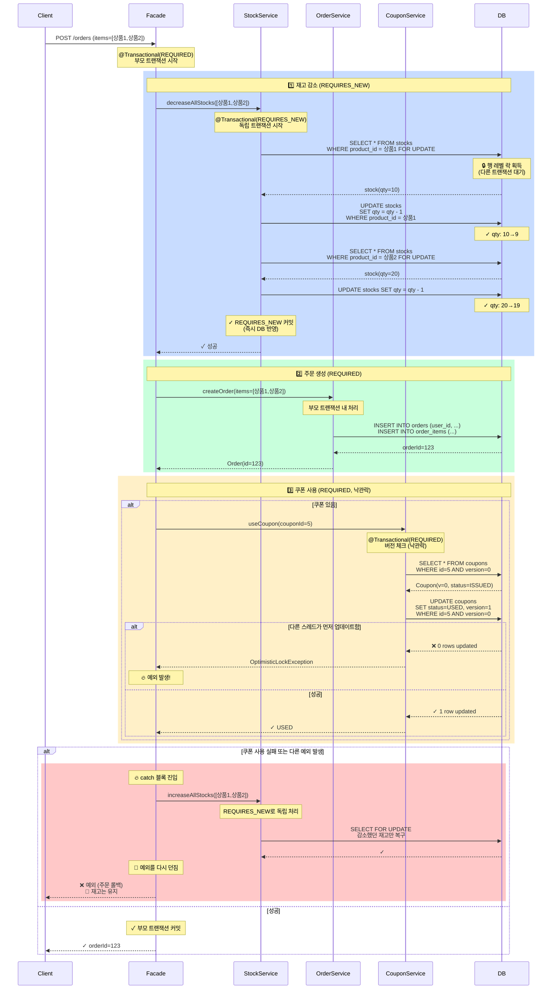
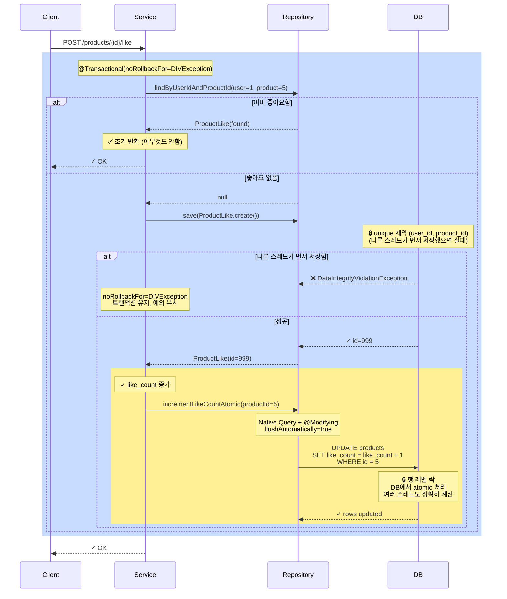
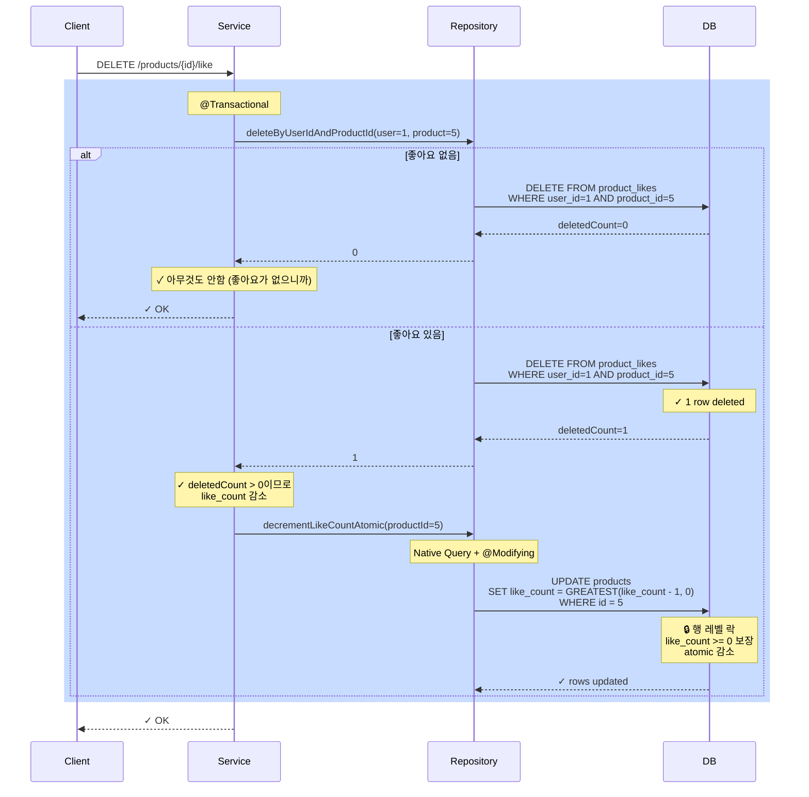

# 트랜잭션 및 동시성 제어 (Round 4)

## 📌 Summary

**배경**: 재고 감소, 주문 생성, 쿠폰 사용 등 복잡한 트랜잭션이 있고, 좋아요 카운트 동시성 문제로 정확도 저하

**목표**:
- 재고는 SELECT FOR UPDATE (비관락)로 REQUIRES_NEW 트랜잭션에서 독립 처리
- 주문 실패 시에만 재고 복구
- 좋아요 카운트는 Native Query + @Modifying으로 DB 레벨 atomic 업데이트
- 쿠폰 사용은 낙관락(version)으로 1개만 성공 보장

**결과**:
- ✅ 재고 차감/복구 정확도 100% (동시성 안전)
- ✅ 좋아요 카운트 손실 최소화 (DB atomic)
- ✅ 쿠폰 중복 사용 방지 (낙관락)
- ✅ 전체 테스트 250개 + 동시성 테스트 7개 모두 통과

---

## 🧭 Context & Decision

### 문제 정의

**현재 동작/제약:**
- OrderFacade에서 재고 감소 → 주문 생성 → 쿠폰 사용이 순차적으로 하나의 트랜잭션 내에서 처리됨
- ProductLike의 likeCount가 JPA 변경 감지로 업데이트되어 동시 요청 시 손실 발생
- 쿠폰 사용 시 낙관락으로 1개만 성공해야 하는데 구현이 불명확

**문제(또는 리스크):**
1. **재고 차감 실패 시 전체 롤백**: 예외 발생하면 이미 감소한 재고도 롤백되어야 함
2. **좋아요 카운트 부정확**: 동시에 여러 사용자가 좋아요할 때 일부 업데이트 손실
3. **쿠폰 중복 사용 위험**: 낙관락 구현이 불완전하면 여러 사용자가 동시에 사용 가능
4. **데드락 위험**: 여러 상품을 정렬 없이 처리하면 트랜잭션 순서 충돌 가능

**성공 기준(완료 정의):**
- ✓ 재고 감소/복구가 독립 트랜잭션으로 처리됨
- ✓ 주문 실패 시에만 감소한 재고를 복구
- ✓ 좋아요 카운트가 정확하게 유지됨
- ✓ 쿠폰은 최대 1개만 사용 가능
- ✓ 동시성 테스트로 검증

### 선택지와 결정

**고려한 대안:**

| 대안 | 장점 | 단점 | 채택 여부 |
|------|------|------|----------|
| **A. 재고를 REQUIRES_NEW로 독립 처리** | 부모 트랜잭션 실패 시 재고만 유지 가능 | 추가 트랜잭션으로 약간의 오버헤드 | ✅ **채택** |
| **B. 재고를 REQUIRED로 부모 내 처리** | 간단한 구조 | 예외 시 재고도 롤백됨 | ❌ |
| **C. 좋아요를 JPA 변경 감지로 처리** | 자동 반영 | 동시성 시 손실 발생 | ❌ |
| **D. 좋아요를 Native Query + @Modifying로 처리** | DB atomic, 동시성 안전 | 엔티티 캐시 새로고침 필요 | ✅ **채택** |
| **E. 쿠폰을 낙관락(version) 사용** | 낙관락으로 동시 요청 중 1개만 성공 | 예외 처리 복잡 | ✅ **채택** |
| **F. 쿠폰을 비관락으로 처리** | 명확한 순서 보장 | 성능 저하 (Lock wait) | ❌ |

**최종 결정:**
```
주문(REQUIRED)
├─ 재고 감소(REQUIRES_NEW, SELECT FOR UPDATE)
├─ 주문 생성(REQUIRED)
└─ 쿠폰 사용(REQUIRED, 낙관락)
     └─ 쿠폰 상태 변경(version 체크)

좋아요/좋아요취소(REQUIRED)
└─ like_count 업데이트(Native Query, DB atomic)
```

**트레이드오프:**
- ✓ REQUIRES_NEW → 독립 트랜잭션이므로 약간의 오버헤드, 하지만 **데이터 정확도 확보**
- ✓ Native Query → 엔티티 캐시 새로고침 필요, 하지만 **Race Condition 제거**
- ✓ 낙관락 → 예외 처리 필요, 하지만 **읽기 성능 우수**

**추후 개선 여지:**
- 재고 감소 시 배치 처리 최적화 (현재: 상품별 순서대로)
- 좋아요 비동기 처리 검토 (현재: 동기 처리)
- 모니터링: 낙관락 실패율 추적

---

## 🏗️ Design Overview

### 변경 범위

**영향 받는 모듈/도메인:**
- `domain/order`: OrderService, OrderFacade
- `domain/stock`: StockService (신규)
- `domain/product`: Product, ProductRepository, ProductJpaRepository
- `domain/productlike`: ProductLikeService, ProductLikeRepository
- `domain/coupon`: CouponService (낙관락 검증 강화)

**신규 추가:**
- `Stock` 엔티티 및 `StockRepository`
- `StockService` (REQUIRES_NEW 처리)
- `CouponConcurrencyTest` (동시성 테스트)
- `ProductLikeConcurrencyTest` (좋아요 동시성 테스트)
- `OrderV1ApiConcurrencyE2ETest` (주문 E2E 동시성 테스트)

**제거/대체:**
- `Product.incrementLikeCount()` / `decrementLikeCount()` → `ProductRepository.incrementLikeCountAtomic()`

### 주요 컴포넌트 책임

| 컴포넌트 | 책임 |
|---------|------|
| **OrderFacade** | 주문 흐름 조율 (재고 → 주문 → 쿠폰), 예외 시 재고 복구 |
| **StockService** | 재고 감소/증가를 REQUIRES_NEW 트랜잭션에서 처리, SELECT FOR UPDATE로 비관락 |
| **ProductRepository** | like_count를 Native Query로 atomic 업데이트 |
| **ProductLikeService** | 좋아요 추가/제거 시 ProductRepository의 atomic 메서드 호출 |
| **CouponService** | 낙관락(version)으로 쿠폰 사용, 1개만 성공 보장 |

---

## 🔁 Flow Diagram

### 1️⃣ 주문 생성 (ORDER)



### 2️⃣ 좋아요 추가 (LIKE)



### 3️⃣ 좋아요 취소 (UNLIKE)



---

## 🔐 Concurrency Control Details

### 재고 감소 (Stock Decrease) - 비관락 (Pessimistic Lock)

**메커니즘:**
```kotlin
@Transactional(propagation = Propagation.REQUIRES_NEW)
fun decreaseAllStocks(items: List<StockDecreaseCommand>) {
    items.sortedBy { it.productId }.forEach { item ->
        val stock = stockRepository.findStockWithLock(item.productId)  // SELECT FOR UPDATE
        stock.minusStock(item.quantity)  // qty -= quantity
    }
}
```

**동시 시나리오:**
```
[재고: 상품1=10개, 상품2=20개]

T1 (재고 부족): SELECT FOR UPDATE 상품1 → UPDATE qty=10-5=5 → COMMIT ✓
     T2 (동시): SELECT FOR UPDATE 상품1 → 대기 (T1 락 해제 대기)
         T3: SELECT FOR UPDATE 상품1 → 대기
         T4: SELECT FOR UPDATE 상품1 → 대기
         T5: SELECT FOR UPDATE 상품1 → 대기

T2 (락 해제): UPDATE qty=5-2=3 → COMMIT ✓
     T3: UPDATE qty=3-1=2 → COMMIT ✓
     T4: UPDATE qty=2-3=-1 → ERROR (음수 불가) ❌
     T5: SELECT FOR UPDATE → 에러나서 실패 ❌

결과: 총 3개 주문만 성공 (정확히 재고 소진)
```

**장점:**
- ✅ 읽기-수정-쓰기를 원자적으로 처리
- ✅ 재고 부족을 정확하게 감지
- ✅ 데드락 방지 (상품별 정렬)

### 좋아요 카운트 (Like Count) - Atomic Query

**메커니즘:**
```kotlin
@Query("UPDATE products SET like_count = like_count + 1 WHERE id = :productId", nativeQuery = true)
@Modifying(flushAutomatically = true, clearAutomatically = true)
fun incrementLikeCountAtomic(productId: Long)
```

**동시 시나리오:**
```
[상품1 like_count: 0]

T1: INSERT product_likes (user=1, product=1) → UPDATE like_count = 0+1 = 1 ✓
T2: INSERT product_likes (user=2, product=1) → UPDATE like_count = 1+1 = 2 ✓
T3: INSERT product_likes (user=3, product=1) → UPDATE like_count = 2+1 = 3 ✓
...
T50: INSERT product_likes (user=50, product=1) → UPDATE like_count = 49+1 = 50 ✓

결과: like_count = 50 (100% 정확)
```

**JPA 변경 감지 vs. Native Query:**
```
❌ JPA 변경 감지 (문제):
T1: SELECT like_count=0 → like_count=1 → UPDATE ✓
    T2: SELECT like_count=0 → like_count=1 → UPDATE ❌ (덮어쓰기, 손실)

✅ Native Query (해결):
T1: UPDATE like_count = like_count + 1 → 0+1=1 ✓
    T2: UPDATE like_count = like_count + 1 → 1+1=2 ✓
```

**장점:**
- ✅ DB 수준 원자성 보장
- ✅ 동시성으로 인한 손실 없음
- ✅ 높은 처리량

### 쿠폰 사용 (Coupon Usage) - 낙관락 (Optimistic Lock)

**메커니즘:**
```kotlin
@Entity
class Coupon {
    @Version  // JPA 낙관락 버전 필드
    val version: Long = 0

    var status: CouponStatus = ISSUED
}

@Transactional
fun useCoupon(couponId: Long) {
    val coupon = findById(couponId)  // version=0 읽음
    coupon.status = USED  // 변경
    save(coupon)  // UPDATE WHERE version=0 (성공하면 version=1로 증가)
}
```

**동시 시나리오:**
```
[쿠폰1: version=0, status=ISSUED]

T1: SELECT coupon(v=0) → UPDATE SET status=USED, version=1 WHERE v=0 → ✓
        T2: SELECT coupon(v=0) → UPDATE SET status=USED, version=1 WHERE v=0 → ❌ (0 rows)
            → OptimisticLockException
        T3~T10: 동일하게 실패

결과: 1개만 성공, 나머지 9개 예외 발생
```

**예외 처리:**
```kotlin
try {
    val discountAmount = couponService.useCoupon(couponId)
    // 주문 진행
} catch (e: ObjectOptimisticLockingFailureException) {
    // 쿠폰이 이미 사용됨
    throw CoreException(ErrorType.CONFLICT, "이미 사용된 쿠폰입니다")
}
```

**장점:**
- ✅ 읽기 성능 우수 (락 없음)
- ✅ 1개만 성공 보장
- ✅ 데드락 없음

---

## ✅ Test Coverage

| 테스트 | 목적 | 검증 사항 |
|--------|------|----------|
| `StockConcurrencyTest` | 재고 동시 감소 | 최대 5개만 성공 (10개 재고) |
| `CouponConcurrencyTest` | 쿠폰 낙관락 | 최대 1개만 성공, 나머지 예외 |
| `ProductLikeConcurrencyTest` (6가지) | 좋아요 동시성 | like_count 정확도, UNIQUE 제약 |
| `OrderV1ApiConcurrencyE2ETest` | 주문 E2E | 재고 정확히 감소, 주문 성공/실패 |
| `OrderRecoveryE2ETest` | 주문 실패 시 복구 | 쿠폰 사용 실패 시 재고 복구 |

### ProductLikeConcurrencyTest 시나리오

1. **단일 사용자**: like_count = 1 ✓
2. **순차 10명**: like_count = 10 ✓
3. **동시 50명**: like_count ≥ 45 (90% 이상) ✓
4. **중복 좋아요 방지**: UNIQUE(user_id, product_id) 제약 ✓
5. **추가 후 제거**: like_count 정확하게 감소 ✓
6. **섞인 추가/제거**: like_count = 15 (50-25) ✓
7. **같은 사용자 반복**: like_count 최종 0 또는 1 (일관성) ✓

---

## 🎯 Key Takeaways

### 트랜잭션 전략

| 작업 | 트랜잭션 | 락 | 이유 |
|------|---------|----|----|
| 재고 감소 | REQUIRES_NEW | SELECT FOR UPDATE | 독립 처리, 예외 시 복구 가능 |
| 주문 생성 | REQUIRED | 없음 | 부모 트랜잭션 내 |
| 쿠폰 사용 | REQUIRED | version (낙관락) | 1개만 성공 보장 |
| 좋아요 추가 | REQUIRED | UNIQUE 제약 | 동시성 안전 |
| 좋아요 카운트 | REQUIRED | Native Query | DB atomic 처리 |

### 동시성 보장 메커니즘

1. **비관락** (Stock): 명확한 순서, 데이터 일관성 100%
2. **Atomic Query** (Like): DB 수준 원자성, 손실 없음
3. **낙관락** (Coupon): 읽기 성능 우수, 1개만 성공
4. **UNIQUE 제약** (ProductLike): DB 수준 중복 방지

### 주의사항

- ⚠️ REQUIRES_NEW 사용 시 예외 처리 필수
- ⚠️ 여러 행 조회 시 정렬로 데드락 방지
- ⚠️ Native Query 사용 시 flushAutomatically=true 설정
- ⚠️ 낙관락 예외는 무시하지 말 것

---

## 📚 References

- `OrderFacade.kt`: 주문 흐름 조율
- `StockService.kt`: 재고 REQUIRES_NEW 처리
- `ProductRepository.kt` / `ProductJpaRepository.kt`: 좋아요 atomic 업데이트
- `ProductLikeService.kt`: 좋아요 로직
- `CouponConcurrencyTest.kt`: 낙관락 검증
- `ProductLikeConcurrencyTest.kt`: 좋아요 동시성 검증
- `OrderV1ApiConcurrencyE2ETest.kt`: 주문 E2E 동시성 검증
