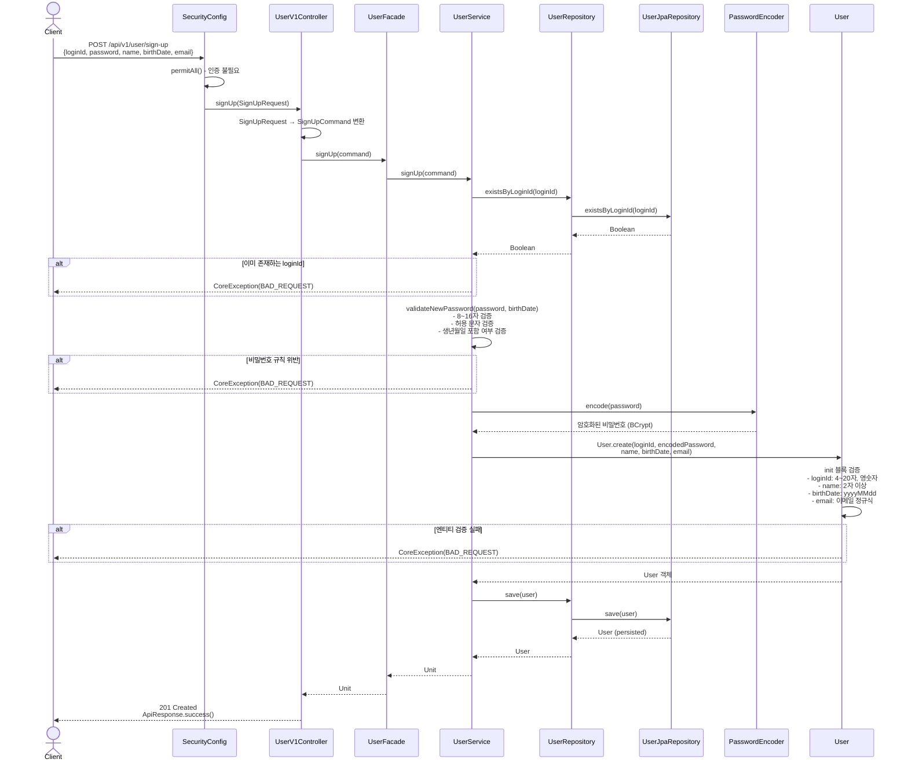
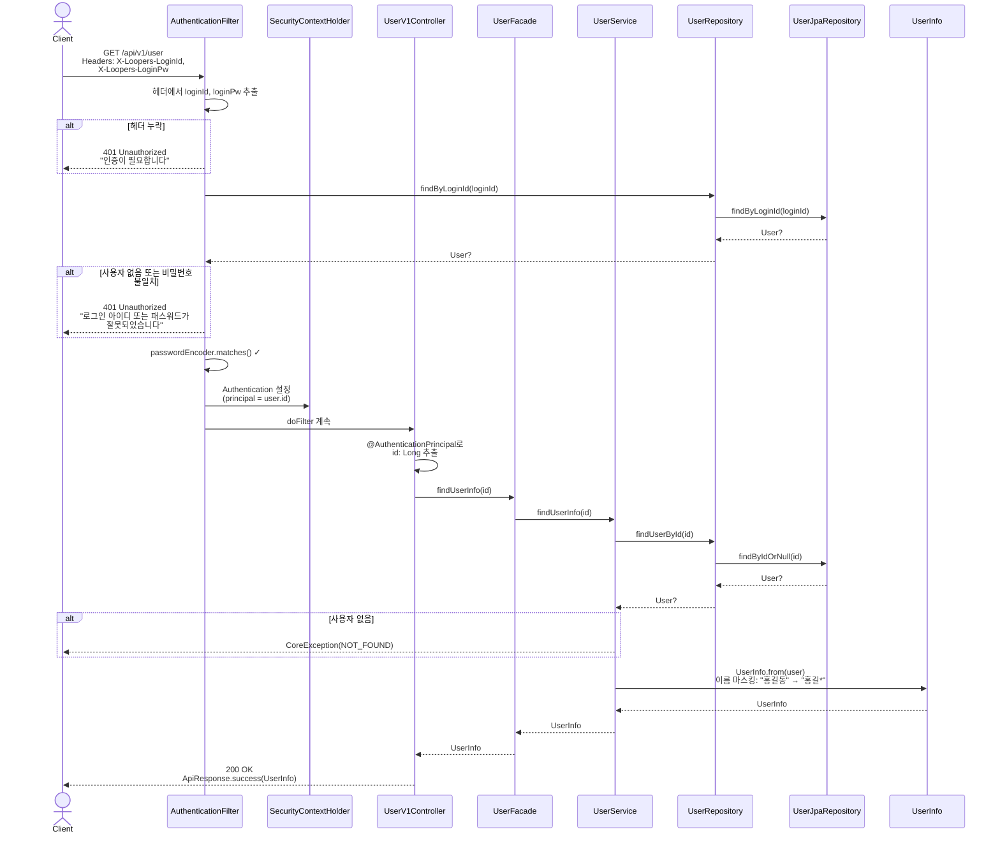
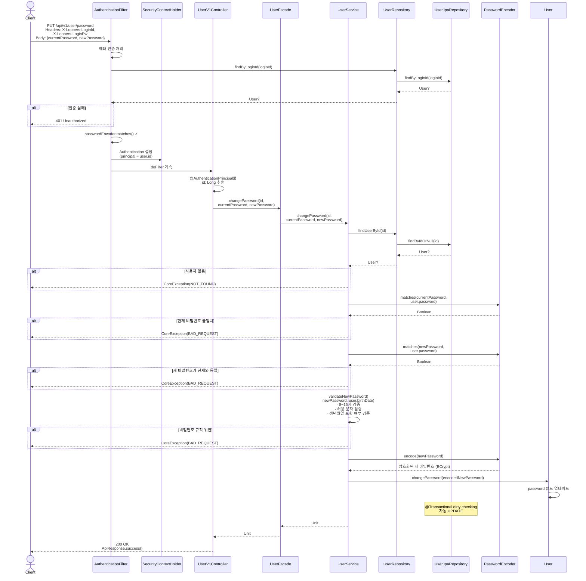

## 📌 Summary

회원 도메인 API를 구현했습니다.  
구현한 기능: 회원가입, 내 정보 조회, 비밀번호 변경  
커스텀 헤더 기반 인증 시스템을 Spring Security와 통합했습니다.

**주요 구현 내용:**  
- **회원 도메인 설계**: User 엔티티, UserRepository, UserService로 구성된 레이어드 아키텍처
- **회원가입 API**: 회원 정보 수집, 중복 ID 확인, 비밀번호 규칙 검증, BCrypt 암호화
- **내 정보 조회 API**: 인증된 사용자의 정보 반환, 이름 마스킹 처리
- **비밀번호 변경 API**: 기존 비밀번호 검증, 비밀번호 규칙 검증, 현재 비밀번호 재사용 방지
- **커스텀 헤더 인증**: X-Loopers-LoginId, X-Loopers-LoginPw 헤더 기반 인증 필터
- **테스트 전략**: 도메인 단위 테스트, 서비스 단위 테스트, E2E 테스트 작성

**구현된 API:**  
- `POST /api/v1/user/sign-up`: 회원가입
- `GET /api/v1/user`: 내 정보 조회 (인증 필요)
- `PUT /api/v1/user/password`: 비밀번호 변경 (인증 필요)

## 💬 Review Points

### 1. 커스텀 헤더 기반 인증 시스템: Spring Security 통합

**배경 및 설계 의도:**  
요구사항에서 `X-Loopers-LoginId`와 `X-Loopers-LoginPw` 헤더를 통한 인증이 있습니다.
인증의 방식은 매 요청시 마다 credentials를 전달하는 방식입니다.
Spring Security의 필터 체인에 커스텀 필터를 추가하여 기존 보안 인프라를 활용하면서 요구사항을 충족했습니다.

**고민 포인트:**  
Spring Security를 동입함에 있어서 아래의 고민을 하였습니다.  
서블릿 Filter를 통한 인증 구현과 Spring Security를 도입하여 Filter를 Filter Chain에 추가할까?

**Spring Security를 선택한 이유**  
1. 헤더 기반의 인증을 구현시에는 서블릿 Filter를 사용해서 구현해도되나 인증의 방식을 변경하는 경우 확장성에 제한이 있음
2. 인증 이후 Context를 직접 관리 필요
3. 인증의 방식은 변경되거나 추가될 수 있기 때문에 유연한 Spring Security를 선택

**구조:**
```
HTTP Request
    ↓
AuthenticationFilter (OncePerRequestFilter)
    ├─ X-Loopers 헤더 추출
    ├─ UserRepository로 사용자 조회
    ├─ 비밀번호 검증
    └─ SecurityContextHolder에 인증 정보 저장
    ↓
SecurityConfig
    ├─ /api/v1/user/sign-up: permitAll
    ├─ /api/v1/user/**: authenticated
    └─ AuthenticationEntryPoint: 401 응답
    ↓
Controller
```

**관련 코드:**
```kotlin
// infrastructure/filter/AuthenticationFilter.kt
override fun doFilterInternal(request: HttpServletRequest, response: HttpServletResponse, filterChain: FilterChain) {
    val loginId = request.getHeader(HEADER_LOGIN_ID)
    val loginPw = request.getHeader(HEADER_LOGIN_PW)

    if (loginId.isNullOrBlank() || loginPw.isNullOrBlank()) {
        filterChain.doFilter(request, response)
        return
    }

    val user = userRepository.findByLoginId(loginId)
    if (user == null || !passwordEncoder.matches(loginPw, user.password)) {
        response.sendError(HttpServletResponse.SC_UNAUTHORIZED, "로그인 아이디 또는 패스워드가 잘못되었습니다.")
        return
    }

    val authenticationToken = UsernamePasswordAuthenticationToken(
        user.id,
        null,
        emptyList(),
    )

    SecurityContextHolder.getContext().authentication = authenticationToken

    filterChain.doFilter(request, response)
}
```

### 2. 비밀번호 검증 규칙: Service 레이어에서 통합 관리

**배경 및 설계 의도:**  
비밀번호 규칙
1. 8~16자의 영문/숫자/특수문자만 허용
2. 생년월일 포함 불가

회원가입과 비밀번호 변경 모두 동일한 규칙을 적용해야 합니다.  
회원 객체가 너무 많은 책임을 가지지 않도록 패스워드 정합성 검사를 객체 외부로 뺐습니다.

**고민 포인트:**  
회원 객체의 패스워드 검증에 대한 부분을 구현하면서 회원 객체의 책임 경계에 대해 많은 고민을 했습니다.  
회원 객체가 가지는 값에 대해 한 검증을 도메인에서 해야한다고 생각을 했고, 객체 내 초기화화 시점에 이를 검증하려고 하였습니다.
그러다 보니 길이 조건(8~16자)에 대해 패스워드가 암호화되면서 이 조건을 초과하게 되어 문제가 되었습니다.  

문득 회원 객체가 너무 많은 걸 알고 있지 않나 라는 생각을 하게 되었고,  
회원 객체가 패스워드가 길이 조건을 초과하는지, 특정 문자가 포함되어있는지 등을 아는게 맞나 라는 생각을 하게 되었습니다.  
그래서 이 책임을 객체에서 덜어내었습니다.

**검증 흐름:**  
```
회원가입 (UserService.signUp)
    ├─ 중복 로그인ID 확인
    ├─ validateNewPassword() - 비밀번호 규칙 검증
    ├─ BCrypt 암호화
    └─ User.create() - 기본 검증 (공백 등)

비밀번호 변경 (UserService.changePassword)
    ├─ 기존 비밀번호 일치 확인 (BCrypt)
    ├─ 현재 비밀번호와 동일 여부 확인
    ├─ validateNewPassword() - 비밀번호 규칙 검증
    └─ BCrypt 암호화 후 저장
```

**관련 코드:**  
```kotlin
// domain/user/UserService.kt
private fun validateNewPassword(password: String, birthDate: String) {
    if (password.length !in 8..16) {
        throw CoreException(ErrorType.BAD_REQUEST, "비밀번호는 8자 이상 16자 이하여야 합니다")
    }

    if (!password.matches(Regex("^[a-zA-Z0-9!@#\$%^&*()_+\\-=\\[\\]{};':\"\\\\|,.<>/?]+$"))) {
        throw CoreException(ErrorType.BAD_REQUEST, "비밀번호는 영문 대/소문자, 숫자, 특수문자만 사용 가능합니다")
    }

    if (password.contains(birthDate)) {
        throw CoreException(ErrorType.BAD_REQUEST, "비밀번호에 생년월일을 포함할 수 없습니다")
    }
}

// domain/user/User.kt - 기본 검증만 수행
private fun validatePassword(password: String) {
    if (password.isBlank()) throw CoreException(ErrorType.BAD_REQUEST, "비밀번호는 비어있을 수 없습니다.")
}
```
**아쉬운 점:**  
이 부분에 대한 고민을 계속하다가 너무 늦게 해결 방법을 생각하여 별도 검증 객체로 까지는 분리하지 못하였습니다.  
검증을 인터페이스로 하여 필요한 요소에 대해 검증을 수 행하는 방법을 적용했으면 좋았을 것 같습니다.

---

### 3. 이름 마스킹: Application 레이어에서 처리

**배경 및 설계 의도:**  
내 정보 조회 시 이름의 마지막 글자를 `*`로 마스킹해야 합니다.  
마스킹은 표현(presentation) 관심사이므로 도메인 엔티티가 아닌 DTO 변환 시점에서 처리했습니다.

**구조:**  
```
User (Domain Entity)
    └─ name: "홍길동" (원본 데이터)
         ↓
UserInfo.from(user) (Domain DTO)
    └─ maskLastCharacter("홍길동") → "홍길*"
         ↓
UserV1Response (Interface DTO)
    └─ name: "홍길*" (마스킹된 데이터)
```

**관련 코드:**  
```kotlin
// domain/user/dto/UserInfo.kt
data class UserInfo(
    val loginId: String,
    val name: String,
    val birthDate: String,
    val email: String,
) {
    companion object {
        fun from(user: User): UserInfo {
            return UserInfo(
                loginId = user.loginId,
                name = maskLastCharacter(user.name),
                birthDate = user.birthDate,
                email = user.email,
            )
        }

        private fun maskLastCharacter(name: String): String {
            if (name.length <= 1) return "*"
            return name.dropLast(1) + "*"
        }
    }
}
```

### 4. 테스트 전략: 레이어별 테스트 분리

**배경 및 설계 의도:**  
TDD 원칙에 따라 Red-Green-Refactor 사이클로 개발했습니다.  
각 레이어의 책임에 맞는 테스트를 작성하여 변경 시 영향 범위를 명확히 파악할 수 있도록 했습니다.

**테스트 구조:**  
```
UserTest.kt (Domain Unit Test)
    ├─ 회원 생성 성공
    ├─ 로그인ID 검증 (공백, 길이, 영문숫자)
    ├─ 비밀번호 공백 검증
    ├─ 이름 검증 (공백, 2글자 이상)
    ├─ 생년월일 검증 (공백, 날짜형식)
    └─ 이메일 검증 (공백, 이메일형식)

UserServiceTest.kt (Service Unit Test)
    ├─ 회원가입 성공
    ├─ 중복 로그인 ID 검증
    ├─ 회원가입 비밀번호 규칙 검증 (8자 미만, 16자 초과, 한글 포함, 생년월일 포함)
    ├─ 내 정보 조회 성공 / 실패
    ├─ 비밀번호 변경 성공
    ├─ 기존 비밀번호 불일치 검증
    ├─ 현재 비밀번호 재사용 검증
    └─ 비밀번호 변경 규칙 검증 (8자 미만, 16자 초과, 한글 포함, 생년월일 포함)

UserV1ApiE2ETest.kt (E2E Test)
    ├─ 회원가입 API 성공
    ├─ 내 정보 조회 API 성공 (마스킹 확인)
    ├─ 비밀번호 변경 API 성공
    ├─ 인증 헤더 없음 → 401
    └─ 잘못된 비밀번호 → 401
```

**관련 코드:**  
```kotlin
// Service 테스트 예시 - 회원가입 비밀번호 규칙 검증
@Test
fun `회원가입 시 비밀번호가 8자 미만이면 예외가 발생한다`() {
    // given
    val command = SignUpCommand(
        loginId = "test123",
        password = "short1",
        name = "테스트",
        birthDate = "20260101",
        email = "test@test.com",
    )

    every { userRepository.existsByLoginId(any()) } returns false

    // when + then
    assertThatThrownBy {
        userService.signUp(command)
    }.isInstanceOf(CoreException::class.java)
        .extracting { (it as CoreException).errorType }
        .isEqualTo(ErrorType.BAD_REQUEST)
}
```
**고민 및 질의하고 싶은 점:**  
테스트 케이스에 대한 이름을 지정할 때 Display 어노테이션으로 지정한하는 것과 ``를 활용해서 함수명으로 지정하는 것 중 어떤 방법이 더 나은지

**부족한 점**  
테스트 더블과 관련해서 Mock과 Stub을 주로 사용하였는데, Dummy, Spy, Fake에 대한 활용을 해볼 필요가 있어보입니다.

---

## ✅ Checklist

### 회원가입  
- [x] **필요 정보 수집**: loginId, password, name, birthDate, email
- [x] **중복 ID 확인**: 동일 loginId 존재 시 400 Bad Request
- [x] **포맷 검증**: 필수 필드 검증
- [x] **비밀번호 암호화**: BCrypt 단방향 암호화
- [x] **비밀번호 RULE**: 8~16자, 영문/숫자/특수문자만 허용
- [x] **생년월일 포함 불가**: 비밀번호에 생년월일 포함 시 거부

### 내 정보 조회
- [x] **반환 정보**: loginId, name, birthDate, email
- [x] **이름 마스킹**: 마지막 글자를 `*`로 마스킹 (홍길동 → 홍길*)

### 비밀번호 수정
- [x] **기존 비밀번호 검증**: 현재 비밀번호 일치 확인
- [x] **비밀번호 RULE**: 회원가입과 동일한 규칙 적용
- [x] **현재 비밀번호 사용 불가**: 기존과 동일한 비밀번호 거부

### 인증
- [x] **X-Loopers 헤더**: X-Loopers-LoginId, X-Loopers-LoginPw 헤더 기반 인증
- [x] **인증 실패 시 401**: 헤더 누락 또는 인증 실패 시 401 Unauthorized

## 🔄 Sequence Diagrams

### 1. 회원가입 (POST `/api/v1/user/sign-up`)



### 2. 내 정보 조회 (GET `/api/v1/user`)



### 3. 비밀번호 변경 (PUT `/api/v1/user/password`)



---

## 📎 References

### 생성/수정된 파일

**Domain Layer:**  
- `apps/commerce-api/src/main/kotlin/com/loopers/domain/user/User.kt`
- `apps/commerce-api/src/main/kotlin/com/loopers/domain/user/UserRepository.kt`
- `apps/commerce-api/src/main/kotlin/com/loopers/domain/user/UserService.kt`
- `apps/commerce-api/src/main/kotlin/com/loopers/domain/user/dto/UserInfo.kt`

**Infrastructure Layer:**  
- `apps/commerce-api/src/main/kotlin/com/loopers/infrastructure/user/UserJpaRepository.kt`
- `apps/commerce-api/src/main/kotlin/com/loopers/infrastructure/user/UserRepositoryImpl.kt`
- `apps/commerce-api/src/main/kotlin/com/loopers/infrastructure/filter/AuthenticationFilter.kt`
- `apps/commerce-api/src/main/kotlin/com/loopers/infrastructure/config/SecurityConfig.kt`
- `apps/commerce-api/src/main/kotlin/com/loopers/infrastructure/config/PasswordEncoderConfig.kt`

**Application Layer:**  
- `apps/commerce-api/src/main/kotlin/com/loopers/application/user/UserFacade.kt`

**Interface Layer:**  
- `apps/commerce-api/src/main/kotlin/com/loopers/interfaces/api/user/UserV1Controller.kt`
- `apps/commerce-api/src/main/kotlin/com/loopers/interfaces/api/user/UserV1ApiSpec.kt`
- `apps/commerce-api/src/main/kotlin/com/loopers/interfaces/api/user/dto/UserV1Dto.kt`

**Test:**  
- `apps/commerce-api/src/test/kotlin/com/loopers/domain/user/UserTest.kt`
- `apps/commerce-api/src/test/kotlin/com/loopers/domain/user/UserServiceTest.kt`
- `apps/commerce-api/src/test/kotlin/com/loopers/interfaces/api/user/UserV1ApiE2ETest.kt`

**HTTP Client:**  
- `http/commerce-api/user-v1.http`

**짧은 회고**
TDD를 활용한 개발이 지금까지는 어려웠지만 AI를 활용하면서 TDD를 더 정석적으로 잘 수 행할 수 있었습니다.  
구현 간 도메인 객체의 책임에 관해 고민해볼 수 있었는데, 도메인 객체에 속한 요소에 대해 너무 많이 아는 것을 오히려 독이 될 수 있다는 생각을 하게 되었습니다.
DTO 클래스를 이너 클래스로 선언해서 관리하는 방법이 마음에 들었습니다. 