# 커머스 API - 시퀀스 다이어그램

# 🏷 브랜드 & 상품 (Brands / Products)

## 브랜드 정보 조회
### GET /api/v1/brands/{brandId}

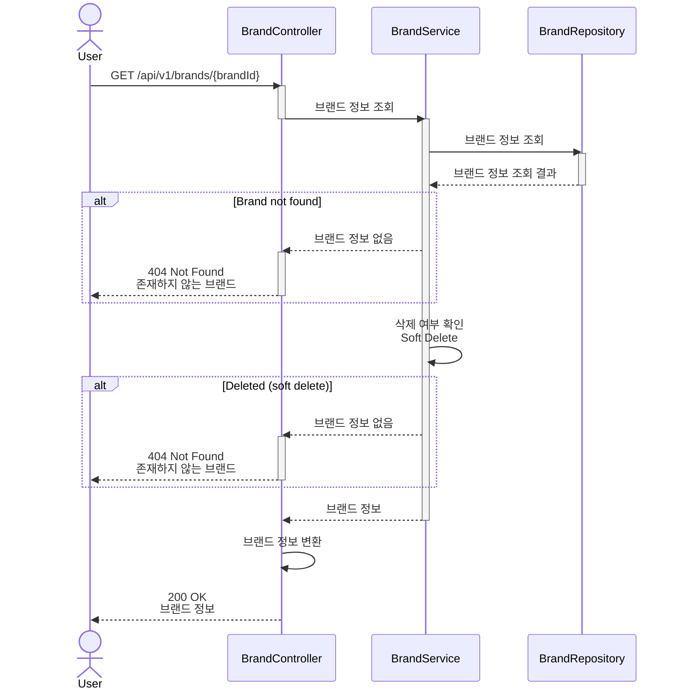
```mermaid
sequenceDiagram
    actor Client as User
    participant Controller as BrandController
    participant Service as BrandService
    participant Repository as BrandRepository

    Client->>Controller: GET /api/v1/brands/{brandId}

    activate Controller
    Controller->>Service: 브랜드 정보 조회
    deactivate Controller

    activate Service
    Service->>Repository: 브랜드 정보 조회

    activate Repository
    Repository-->>Service: 브랜드 정보 조회 결과
    deactivate Repository

    alt Brand not found
        Service-->>Controller: 브랜드 정보 없음

        activate Controller
        Controller-->>Client: 404 Not Found<br>존재하지 않는 브랜드
        deactivate Controller
    end

    Service->>Service: 삭제 여부 확인<br>Soft Delete

    alt Deleted (soft delete)
        Service-->>Controller: 브랜드 정보 없음

        activate Controller
        Controller-->>Client: 404 Not Found<br>존재하지 않는 브랜드
        deactivate Controller
    end
    Service-->>Controller: 브랜드 정보

    deactivate Service

    Controller->>Controller: 브랜드 정보 변환
    Controller-->>Client: 200 OK<br>브랜드 정보

```

## 상품 목록 조회
### GET /api/v1/products

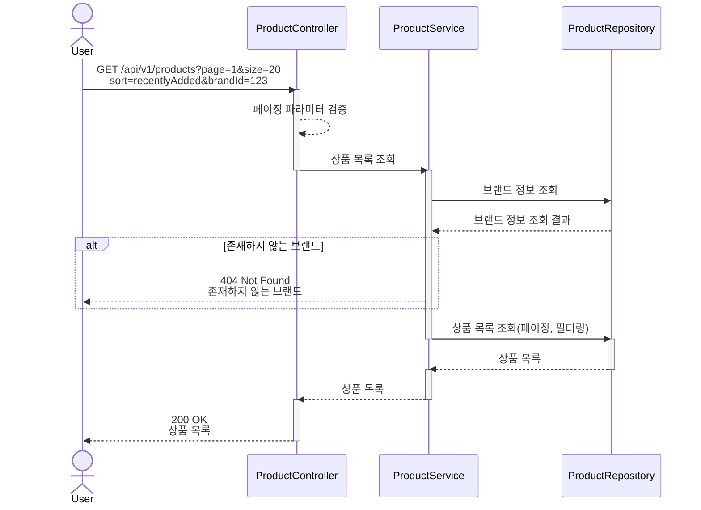
```mermaid
sequenceDiagram
    actor Client as User
    participant ProductController
    participant ProductService
    participant ProductRepository

    Client->>ProductController: GET /api/v1/products?page=1&size=20<br/>sort=recentlyAdded&brandId=123

    activate ProductController
    ProductController-->>ProductController: 페이징 파라미터 검증
    ProductController->>ProductService: 상품 목록 조회
    deactivate ProductController

    activate ProductService
    ProductService->>ProductRepository: 브랜드 정보 조회
    ProductRepository-->>ProductService: 브랜드 정보 조회 결과
    alt 존재하지 않는 브랜드
        ProductService-->>Client: 404 Not Found<br>존재하지 않는 브랜드
    end

    ProductService->>ProductRepository: 상품 목록 조회(페이징, 필터링)
    deactivate ProductService

    activate ProductRepository
    ProductRepository-->>ProductService: 상품 목록
    deactivate ProductRepository

    activate ProductService
    ProductService-->>ProductController: 상품 목록
    deactivate ProductService

    activate ProductController
    ProductController-->>Client: 200 OK<br>상품 목록
    deactivate ProductController
```

## 상품 정보 조회
### GET /api/v1/products/{productId}

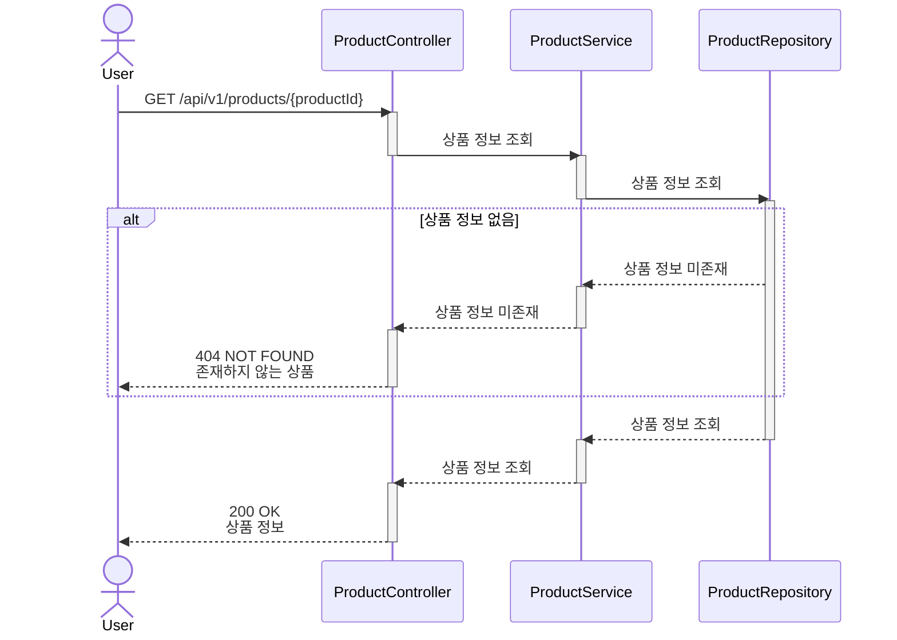
```mermaid
sequenceDiagram
    actor Client as User
    participant Controller as ProductController
    participant Service as ProductService
    participant Repository as ProductRepository

    Client->>Controller: GET /api/v1/products/{productId}

    activate Controller
    Controller->>Service: 상품 정보 조회
    deactivate Controller

    activate Service
    Service->>Repository: 상품 정보 조회
    deactivate Service

    activate Repository
    alt 상품 정보 없음
        Repository-->>Service: 상품 정보 미존재

        activate Service
        Service-->>Controller: 상품 정보 미존재
        deactivate Service

        activate Controller
        Controller-->>Client: 404 NOT FOUND<br>존재하지 않는 상품
        deactivate Controller
    end

    Repository-->>Service: 상품 정보 조회
    deactivate Repository

    activate Service
    Service-->>Controller: 상품 정보 조회
    deactivate Service

    activate Controller
    Controller-->>Client: 200 OK<br>상품 정보
    deactivate Controller
```

# 🏷 브랜드 & 상품 ADMIN

## 등록된 브랜드 목록 조회
### GET /api-admin/v1/brands?page=0&size=20

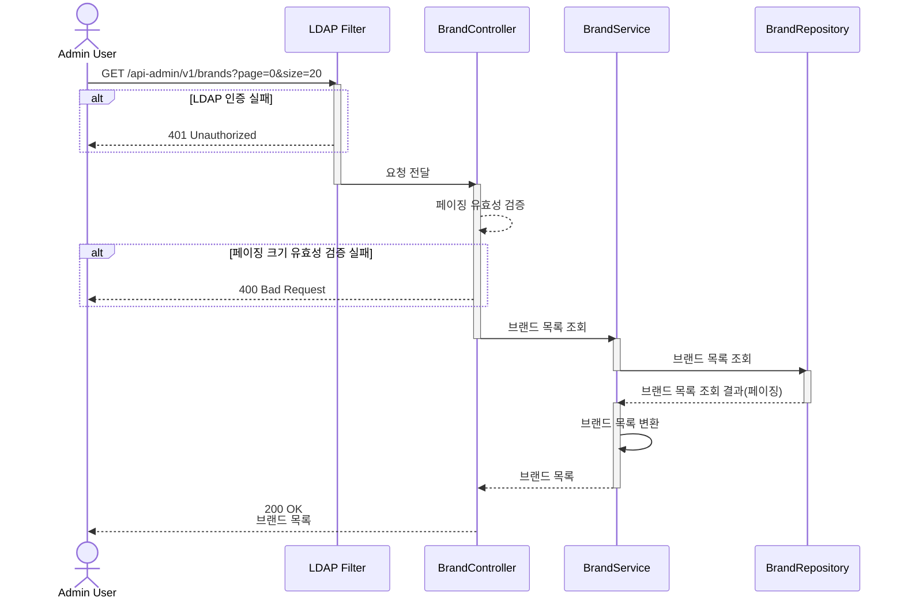
```mermaid
sequenceDiagram
    actor Admin as Admin User
    participant Filter as LDAP Filter
    participant Controller as BrandController
    participant Service as BrandService
    participant Repository as BrandRepository

    Admin->>Filter: GET /api-admin/v1/brands?page=0&size=20

    activate Filter
    alt LDAP 인증 실패
        Filter-->>Admin: 401 Unauthorized
    end
    Filter->>Controller: 요청 전달
    deactivate Filter

    activate Controller
    Controller-->>Controller: 페이징 유효성 검증

    alt 페이징 크기 유효성 검증 실패
        Controller-->>Admin: 400 Bad Request
    end

    Controller->>Service: 브랜드 목록 조회
    deactivate Controller

    activate Service
    Service->>Repository: 브랜드 목록 조회
    deactivate Service

    activate Repository
    Repository-->>Service: 브랜드 목록 조회 결과(페이징)
    deactivate Repository

    activate Service
    Service->>Service: 브랜드 목록 변환
    Service-->>Controller: 브랜드 목록
    deactivate Service

    Controller-->>Admin: 200 OK<br>브랜드 목록
```

## 브랜드 상세 조회
### GET /api-admin/v1/brands/{brandId}

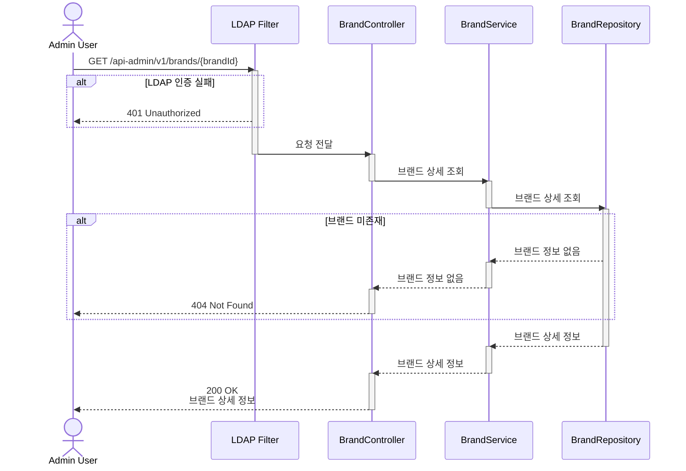
```mermaid
sequenceDiagram
    actor Client as Admin User
    participant Filter as LDAP Filter
    participant Controller as BrandController
    participant Service as BrandService
    participant Repository as BrandRepository

    Client->>Filter: GET /api-admin/v1/brands/{brandId}

    activate Filter
    alt LDAP 인증 실패
        Filter-->>Client: 401 Unauthorized
    end
    Filter->>Controller: 요청 전달
    deactivate Filter

    activate Controller
    Controller->>Service: 브랜드 상세 조회
    deactivate Controller

    activate Service
    Service->>Repository: 브랜드 상세 조회
    deactivate Service

    activate Repository
    alt 브랜드 미존재

        Repository-->>Service: 브랜드 정보 없음
        activate Service
        Service-->>Controller: 브랜드 정보 없음
        deactivate Service
        activate Controller
        Controller-->>Client: 404 Not Found
        deactivate Controller
    end
    Repository-->>Service: 브랜드 상세 정보
    deactivate Repository

    activate Service
    Service-->>Controller: 브랜드 상세 정보
    deactivate Service

    activate Controller
    Controller-->>Client: 200 OK<br/>브랜드 상세 정보
    deactivate Controller
```

## 브랜드 등록
### POST /api-admin/v1/brands 

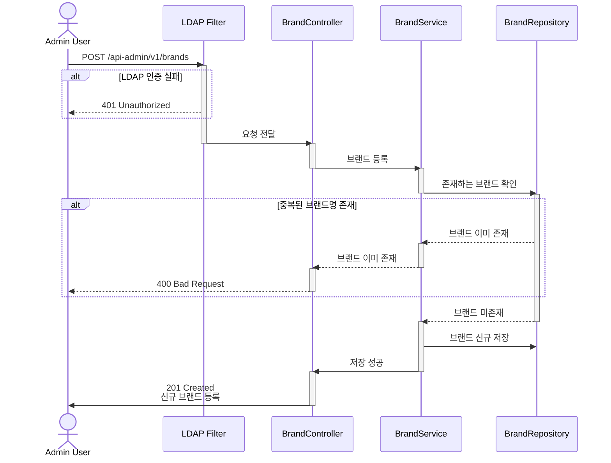
```mermaid
sequenceDiagram
    actor Admin as Admin User
    participant Filter as LDAP Filter
    participant Controller as BrandController
    participant Service as BrandService
    participant Repo as BrandRepository

    Admin->>Filter: POST /api-admin/v1/brands

    activate Filter
    alt LDAP 인증 실패
        Filter-->>Admin: 401 Unauthorized
    end

    Filter->>Controller: 요청 전달
    deactivate Filter

    activate Controller
    Controller->>Service: 브랜드 등록
    deactivate Controller

    activate Service
    Service->>Repo: 존재하는 브랜드 확인
    deactivate Service

    activate Repo
    alt 중복된 브랜드명 존재
        Repo-->>Service: 브랜드 이미 존재
        activate Service
        Service-->>Controller: 브랜드 이미 존재
        deactivate Service
        activate Controller
        Controller-->>Admin: 400 Bad Request
        deactivate Controller
    end

    Repo-->>Service: 브랜드 미존재
    deactivate Repo

    activate Service
    Service->>Repo: 브랜드 신규 저장
    Service->>Controller: 저장 성공
    deactivate Service

    activate Controller
    Controller->>Admin: 201 Created<Br>신규 브랜드 등록
    deactivate Controller
```

## 브랜드 정보 수정
### PUT /api-admin/v1/brands/{brandId}

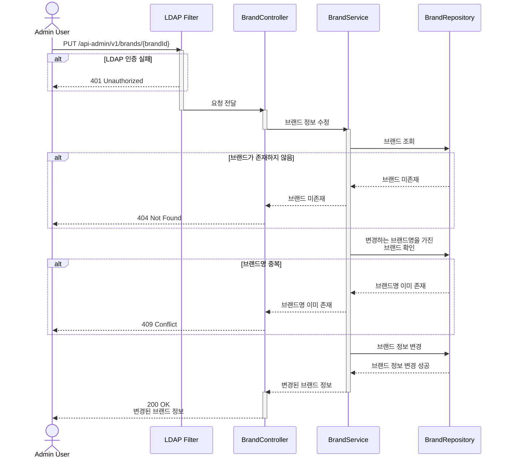
```mermaid
sequenceDiagram
    actor Admin as Admin User
    participant LDAP as LDAP Filter
    participant Controller as BrandController
    participant Service as BrandService
    participant Repository as BrandRepository

    Admin->>LDAP: PUT /api-admin/v1/brands/{brandId}

    activate LDAP
    alt LDAP 인증 실패
        LDAP-->>Admin: 401 Unauthorized
    end

    LDAP->>Controller: 요청 전달
    deactivate LDAP

    activate Controller
    Controller->>Service: 브랜드 정보 수정
    deactivate Controller

    activate Service
    Service->>Repository: 브랜드 조회

    alt 브랜드가 존재하지 않음
        Repository-->>Service: 브랜드 미존재
        Service-->>Controller: 브랜드 미존재
        Controller-->>Admin: 404 Not Found
    end

    Service->>Repository: 변경하는 브랜드명을 가진<br>브랜드 확인
    alt 브랜드명 중복
        Repository-->>Service: 브랜드명 이미 존재
        Service-->>Controller: 브랜드명 이미 존재
        Controller-->>Admin: 409 Conflict
    end

    Service->>Repository: 브랜드 정보 변경
    Repository-->>Service: 브랜드 정보 변경 성공
    Service-->>Controller: 변경된 브랜드 정보
    deactivate Service

    activate Controller
    Controller-->>Admin: 200 OK<br>변경된 브랜드 정보
    deactivate Controller
```

## 브랜드 삭제
### DELETE /api-admin/v1/brands/{brandId}

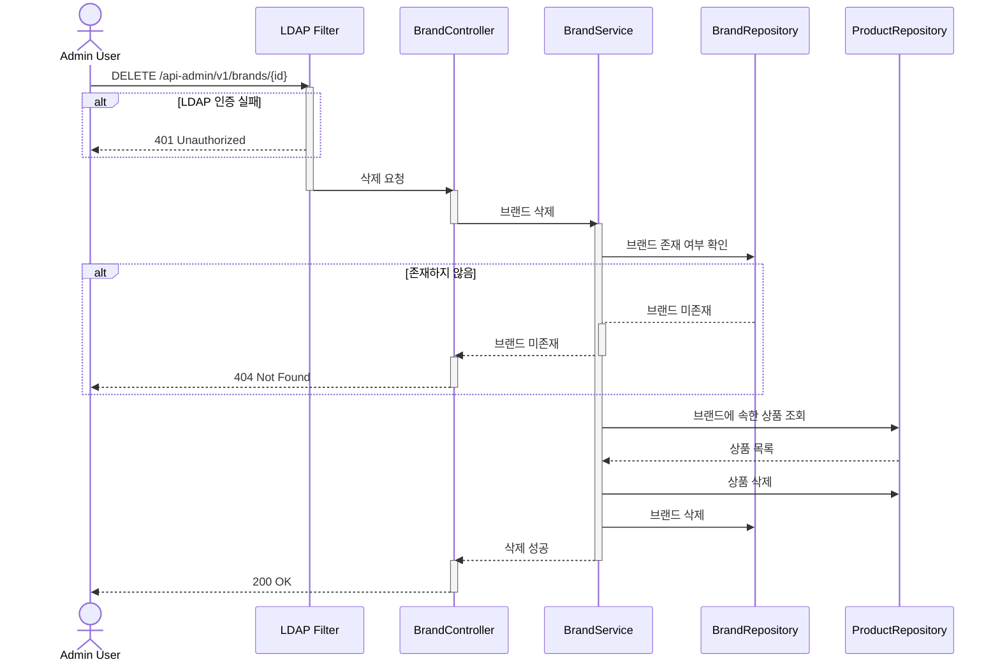
```mermaid
sequenceDiagram
    actor Admin as Admin User
    participant Filter as LDAP Filter
    participant Controller as BrandController
    participant Service as BrandService
    participant BrandRepo as BrandRepository
    participant ProductRepo as ProductRepository

    Admin->>Filter: DELETE /api-admin/v1/brands/{id}

    activate Filter
    alt LDAP 인증 실패
        Filter-->>Admin: 401 Unauthorized
    end

    Filter->>Controller: 삭제 요청
    deactivate Filter

    activate Controller
    Controller->>Service: 브랜드 삭제
    deactivate Controller

    activate Service
    Service->>BrandRepo:브랜드 존재 여부 확인
    alt 존재하지 않음
        BrandRepo-->Service: 브랜드 미존재
        activate Service
        Service-->>Controller: 브랜드 미존재
        deactivate Service
        activate Controller
        Controller-->>Admin: 404 Not Found
        deactivate Controller
    end

    Service->>ProductRepo: 브랜드에 속한 상품 조회
    ProductRepo-->>Service: 상품 목록

    Service->>ProductRepo: 상품 삭제

    Service->>BrandRepo: 브랜드 삭제

    Service-->>Controller: 삭제 성공
    deactivate Service

    activate Controller
    Controller-->>Admin: 200 OK
    deactivate Controller
```

## 등록된 상품 목록 조회
### GET /api-admin/v1/products?page=0&size=20&brandId={brandId}

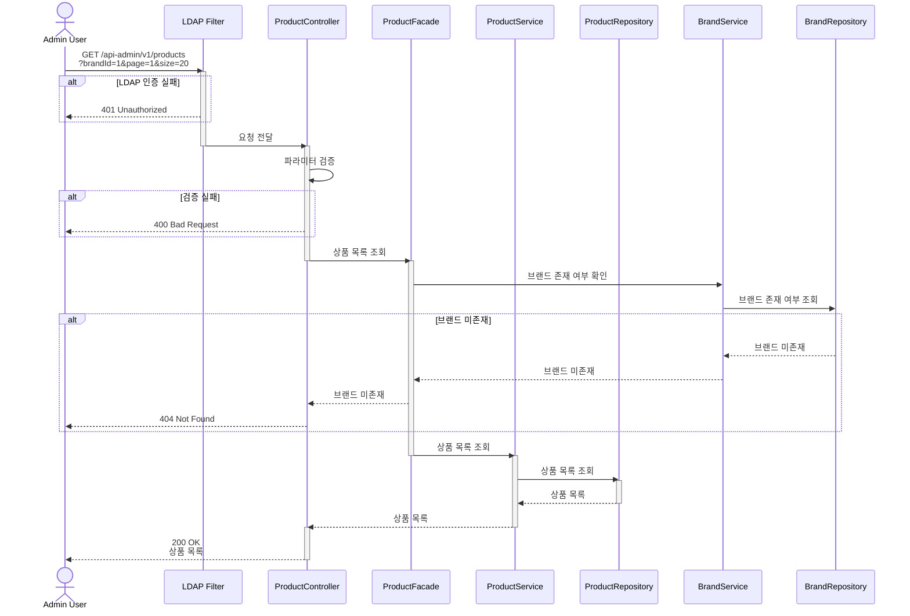
```mermaid
sequenceDiagram
    actor Admin as Admin User
    participant Filter as LDAP Filter
    participant Controller as ProductController
    participant ProductFacade as ProductFacade
    participant ProductService as ProductService
    participant ProductRepo as ProductRepository
    participant BrandService as BrandService
    participant BrandRepo as BrandRepository

    Admin->>Filter: GET /api-admin/v1/products<br/>?brandId=1&page=1&size=20

    activate Filter
    alt LDAP 인증 실패
        Filter-->>Admin: 401 Unauthorized
    end
    Filter->>Controller: 요청 전달
    deactivate Filter

    activate Controller
    Controller->>Controller: 파라미터 검증
    alt 검증 실패
        Controller-->>Admin: 400 Bad Request
    end
    Controller->>ProductFacade: 상품 목록 조회
    deactivate Controller

    activate ProductFacade
    ProductFacade->>BrandService: 브랜드 존재 여부 확인
    BrandService->>BrandRepo: 브랜드 존재 여부 조회
    alt 브랜드 미존재
        BrandRepo-->>BrandService: 브랜드 미존재
        BrandService-->>ProductFacade: 브랜드 미존재
        ProductFacade-->>Controller: 브랜드 미존재
        Controller-->>Admin: 404 Not Found
    end

    ProductFacade->>ProductService: 상품 목록 조회
    deactivate ProductFacade

    activate ProductService
    ProductService->>ProductRepo: 상품 목록 조회
    activate ProductRepo
    ProductRepo-->>ProductService: 상품 목록
    deactivate ProductRepo
    ProductService-->>Controller: 상품 목록
    deactivate ProductService
    activate Controller
    Controller-->>Admin: 200 OK<br>상품 목록
    deactivate Controller
```

## 상품 상세 조회
### GET /api-admin/v1/products/{productId}

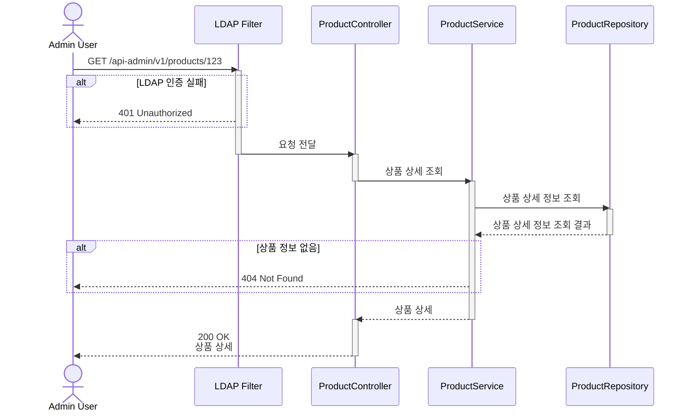
```mermaid
sequenceDiagram
    actor Admin as Admin User
    participant Filter as LDAP Filter
    participant Controller as ProductController
    participant Service as ProductService
    participant Repository as ProductRepository

    Admin->>Filter: GET /api-admin/v1/products/123
    activate Filter
    alt LDAP 인증 실패
        Filter-->>Admin: 401 Unauthorized
    end

    Filter->>Controller: 요청 전달
    deactivate Filter

    activate Controller
    Controller->>Service: 상품 상세 조회
    deactivate Controller

    activate Service
    Service->>Repository: 상품 상세 정보 조회
    activate Repository
    Repository-->>Service: 상품 상세 정보 조회 결과
    deactivate Repository

    alt 상품 정보 없음
        Service-->>Admin: 404 Not Found
    end

    Service-->>Controller: 상품 상세
    deactivate Service

    activate Controller
    Controller-->>Admin: 200 OK<br/>상품 상세
    deactivate Controller
```

## 상품 등록
### POST /api-admin/v1/products

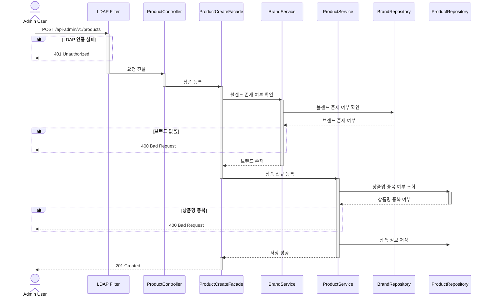
```mermaid
sequenceDiagram
    actor Admin as Admin User
    participant Filter as LDAP Filter
    participant Controller as ProductController
    participant Facade as ProductCreateFacade
    participant BrandService as BrandService
    participant ProductService as ProductService
    participant BrandRepo as BrandRepository
    participant ProductRepo as ProductRepository

    Admin->>Filter: POST /api-admin/v1/products
    activate Filter
    alt LDAP 인증 실패
        Filter-->>Admin: 401 Unauthorized
    end
    Filter->>Controller: 요청 전달
    deactivate Filter

    activate Controller
    Controller->>Facade: 상품 등록
    deactivate Controller

    activate Facade
    Facade->>BrandService: 블랜드 존재 여부 확인
    activate BrandService
    BrandService->>BrandRepo: 블랜드 존재 여부 확인
    BrandRepo-->>BrandService: 브랜드 존재 여부
    alt 브랜드 없음
        BrandService-->>Admin: 400 Bad Request
    end

    BrandService-->>Facade: 브랜드 존재
    deactivate BrandService

    Facade->>ProductService: 상품 신규 등록
    deactivate Facade

    activate ProductService


    ProductService->>ProductRepo: 상품명 중복 여부 조회

    activate ProductRepo
    ProductRepo-->>ProductService: 상품명 중복 여부
    deactivate ProductRepo
    alt 상품명 중복
        ProductService-->>Admin: 400 Bad Request
    end

    ProductService->>ProductRepo: 상품 정보 저장

    ProductService-->>Facade: 저장 성공
    deactivate ProductService

    activate Facade
    Facade-->>Admin: 201 Created
    deactivate Facade
```

## 상품 정보 수정
### PUT /api-admin/v1/products/{productId}

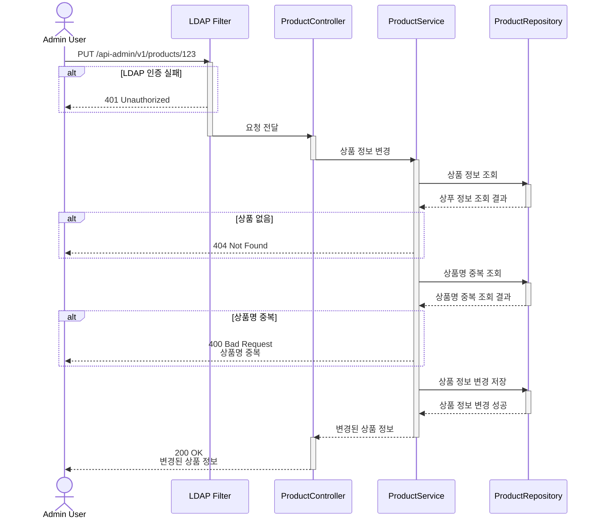
```mermaid
sequenceDiagram
    actor Admin as Admin User
    participant Filter as LDAP Filter
    participant Controller as ProductController
    participant Service as ProductService
    participant Repository as ProductRepository

    Admin->>Filter: PUT /api-admin/v1/products/123
    activate Filter
    alt LDAP 인증 실패
        Filter-->>Admin: 401 Unauthorized
    end
    Filter->>Controller: 요청 전달
    deactivate Filter

    activate Controller
    Controller->>Service: 상품 정보 변경
    deactivate Controller

    activate Service
    Service->>Repository: 상품 정보 조회
    activate Repository
    Repository-->>Service: 상푸 정보 조회 결과
    deactivate Repository

    alt 상품 없음
        Service-->>Admin: 404 Not Found
    end

    Service->>Repository: 상품명 중복 조회

    activate Repository
    Repository-->>Service: 상품명 중복 조회 결과
    deactivate Repository
    alt 상품명 중복
        Service-->>Admin: 400 Bad Request<br>상품명 중복
    end

    Service->>Repository: 상품 정보 변경 저장
    activate Repository
    Repository-->>Service: 상품 정보 변경 성공
    deactivate Repository
    Service-->>Controller: 변경된 상품 정보
    deactivate Service
    activate Controller
    Controller-->>Admin: 200 OK<br/>변경된 상품 정보
    deactivate Controller
```

## 상품 삭제
### DELETE /api-admin/v1/products/{productId}

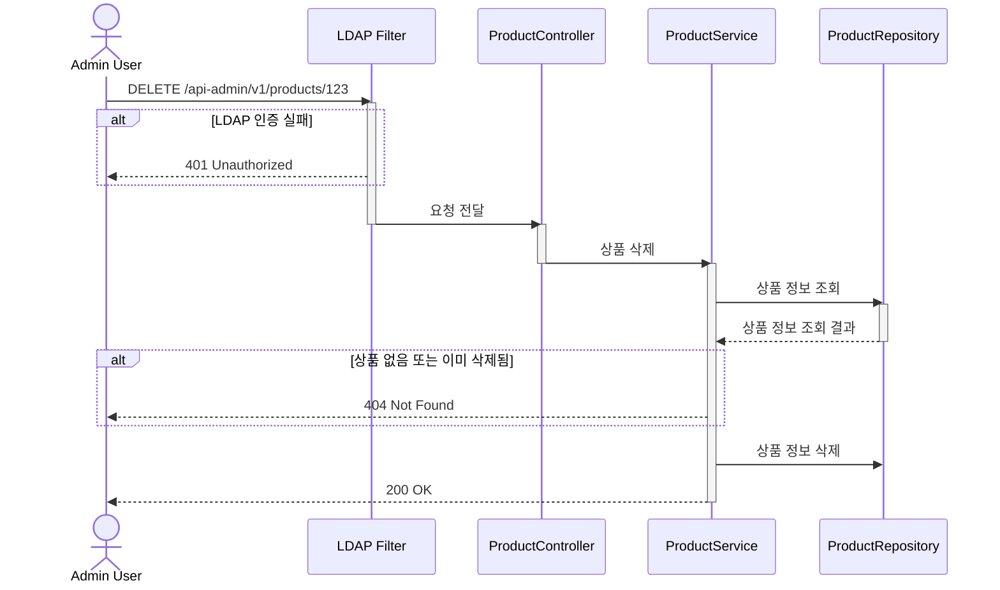
```mermaid
sequenceDiagram
    actor Admin as Admin User
    participant Filter as LDAP Filter
    participant Controller as ProductController
    participant Service as ProductService
    participant Repository as ProductRepository

    Admin->>Filter: DELETE /api-admin/v1/products/123

    activate Filter
    alt LDAP 인증 실패
        Filter-->>Admin: 401 Unauthorized
    end

    Filter->>Controller: 요청 전달

    deactivate Filter

    activate Controller
    Controller->>Service: 상품 삭제
    deactivate Controller

    activate Service
    Service->>Repository: 상품 정보 조회
    activate Repository
    Repository-->>Service: 상품 정보 조회 결과
    deactivate Repository

    alt 상품 없음 또는 이미 삭제됨
        Service-->>Admin: 404 Not Found
    end

    Service->>Repository: 상품 정보 삭제
    Service-->>Admin: 200 OK
    deactivate Service
```

# ❤️ 좋아요 (Likes)

## 상품 좋아요 등록
### POST /api/v1/orders

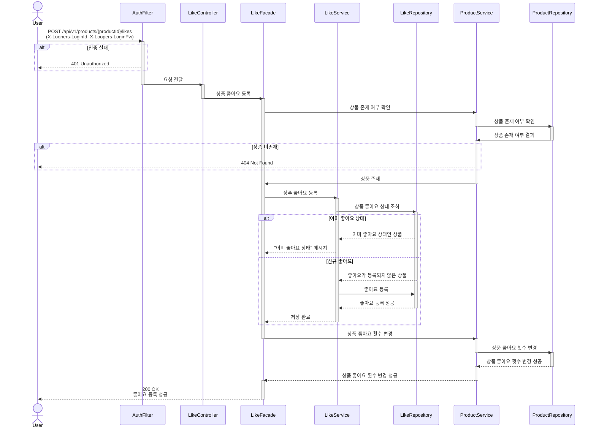
```mermaid
sequenceDiagram
    actor User
    participant AuthFilter
    participant LikeController
    participant LikeFacade
    participant LikeService
    participant LikeRepository
    participant ProductService
    participant ProductRepository

    User->>AuthFilter: POST /api/v1/products/{productId}/likes<br/>(X-Loopers-LoginId, X-Loopers-LoginPw)

    activate AuthFilter
    alt 인증 실패
        AuthFilter-->>User: 401 Unauthorized
    end
    AuthFilter->>LikeController: 요청 전달
    deactivate AuthFilter

    activate LikeController
    LikeController->>LikeFacade: 상품 좋아요 등록
    deactivate LikeController

    activate LikeFacade
    LikeFacade->>ProductService: 상품 존재 여부 확인
    activate ProductService
    ProductService->>ProductRepository: 상품 존재 여부 확인
    deactivate ProductService
    activate ProductRepository
    ProductRepository->>ProductService: 상품 존재 여부 결과
    deactivate ProductRepository

    activate ProductService
    alt 상품 미존재
        ProductService-->>User: 404 Not Found
    end
    ProductService->>LikeFacade: 상품 존재
    deactivate ProductService
    LikeFacade->>LikeService: 상푸 좋아요 등록

    activate LikeService
    LikeService->>LikeRepository: 상품 좋아요 상태 조회
    deactivate LikeService

    activate LikeRepository

    activate LikeService
    alt 이미 좋아요 상태
        LikeRepository-->>LikeService: 이미 좋아요 상태인 상품
        LikeService-->>LikeFacade: "이미 좋아요 상태" 메시지
    else 신규 좋아요
        LikeRepository-->>LikeService: 좋아요가 등록되지 않은 상품
        deactivate LikeRepository
        activate LikeRepository
        LikeService->>LikeRepository: 좋아요 등록
        LikeRepository-->>LikeService: 좋아요 등록 성공
        deactivate LikeRepository
        LikeService-->>LikeFacade: 저장 완료
        deactivate LikeService
    end

    LikeFacade->>ProductService: 상품 좋아요 횟수 변경
    deactivate LikeFacade

    activate ProductService
    ProductService->>ProductRepository: 상품 좋아요 횟수 변경
    deactivate ProductService

    activate ProductRepository
    ProductRepository-->>ProductService: 상품 좋아요 횟수 변경 성공
    deactivate ProductRepository

    activate ProductService
    ProductService-->>LikeFacade: 상품 좋아요 횟수 변경 성공
    deactivate ProductService

    activate LikeFacade
    LikeFacade-->>User: 200 OK<br>좋아요 등록 성공
    deactivate LikeFacade
```

## 상품 좋아요 취소
### DELETE /api/v1/products/{productId}/likes

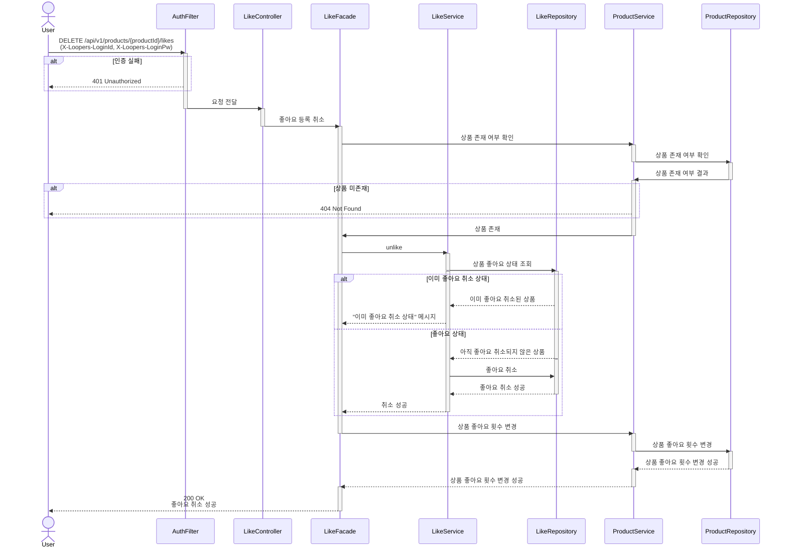
```mermaid
sequenceDiagram
    actor User
    participant AuthFilter
    participant LikeController
    participant LikeFacade
    participant LikeService
    participant LikeRepository
    participant ProductService
    participant ProductRepository

    User->>AuthFilter: DELETE /api/v1/products/{productId}/likes<br/>(X-Loopers-LoginId, X-Loopers-LoginPw)

    activate AuthFilter
    alt 인증 실패
        AuthFilter-->>User: 401 Unauthorized
    end
    AuthFilter->>LikeController: 요청 전달
    deactivate AuthFilter

    activate LikeController
    LikeController->>LikeFacade: 좋아요 등록 취소
    deactivate LikeController

    activate LikeFacade
    LikeFacade->>ProductService: 상품 존재 여부 확인
    activate ProductService
    ProductService->>ProductRepository: 상품 존재 여부 확인
    deactivate ProductService
    activate ProductRepository
    ProductRepository->>ProductService: 상품 존재 여부 결과
    deactivate ProductRepository

    activate ProductService
    alt 상품 미존재
        ProductService-->>User: 404 Not Found
    end
    ProductService->>LikeFacade: 상품 존재
    deactivate ProductService
    LikeFacade->>LikeService: unlike

    activate LikeService
    LikeService->>LikeRepository: 상품 좋아요 상태 조회
    deactivate LikeService

    activate LikeRepository

    activate LikeService
    alt 이미 좋아요 취소 상태
        LikeRepository-->>LikeService: 이미 좋아요 취소된 상품
        LikeService-->>LikeFacade: "이미 좋아요 취소 상태" 메시지
    else 좋아요 상태
        LikeRepository-->>LikeService: 아직 좋아요 취소되지 않은 상품
        deactivate LikeRepository
        activate LikeRepository
        LikeService->>LikeRepository: 좋아요 취소
        LikeRepository-->>LikeService: 좋아요 취소 성공
        deactivate LikeRepository
        LikeService-->>LikeFacade: 취소 성공
        deactivate LikeService
    end

    LikeFacade->>ProductService: 상품 좋아요 횟수 변경
    deactivate LikeFacade

    activate ProductService
    ProductService->>ProductRepository: 상품 좋아요 횟수 변경
    deactivate ProductService

    activate ProductRepository
    ProductRepository-->>ProductService: 상품 좋아요 횟수 변경 성공
    deactivate ProductRepository

    activate ProductService
    ProductService-->>LikeFacade: 상품 좋아요 횟수 변경 성공
    deactivate ProductService

    activate LikeFacade
    LikeFacade-->>User: 200 OK<br>좋아요 취소 성공
    deactivate LikeFacade
```

## 내가 좋아요 한 상품 목록 조회
### GET /api/v1/users/likes

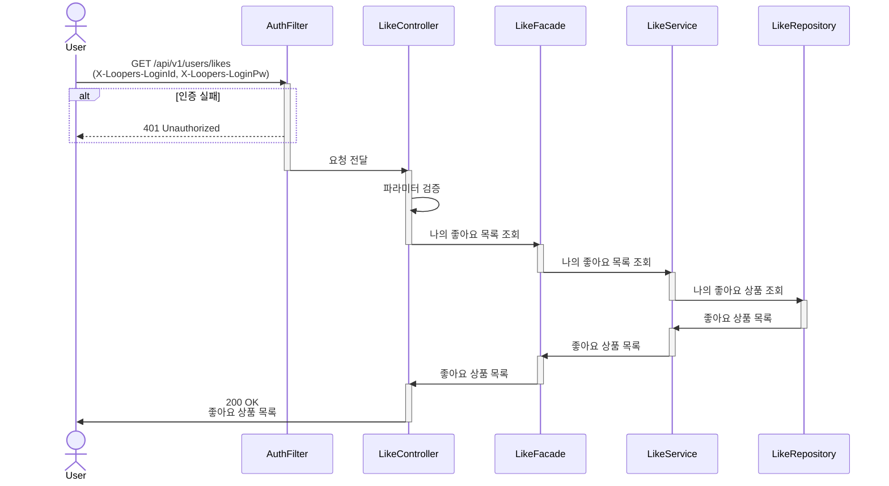
```mermaid
sequenceDiagram
    actor User
    participant AuthFilter
    participant LikeController
    participant LikeFacade
    participant LikeService
    participant LikeRepository

    User->>AuthFilter: GET /api/v1/users/likes<br/>(X-Loopers-LoginId, X-Loopers-LoginPw)

    activate AuthFilter
    alt 인증 실패
        AuthFilter-->>User: 401 Unauthorized
    end
    AuthFilter->>LikeController: 요청 전달
    deactivate AuthFilter

    activate LikeController
    LikeController->>LikeController: 파라미터 검증
    LikeController->>LikeFacade: 나의 좋아요 목록 조회
    deactivate LikeController

    activate LikeFacade
    LikeFacade->>LikeService: 나의 좋아요 목록 조회
    deactivate LikeFacade

    activate LikeService
    LikeService->>LikeRepository: 나의 좋아요 상품 조회
    deactivate LikeService

    activate LikeRepository
    LikeRepository->>LikeService: 좋아요 상품 목록
    deactivate LikeRepository

    activate LikeService
    LikeService->>LikeFacade: 좋아요 상품 목록
    deactivate LikeService

    activate LikeFacade
    LikeFacade->>LikeController: 좋아요 상품 목록
    deactivate LikeFacade

    activate LikeController
    LikeController->>User: 200 OK<br>좋아요 상품 목록
    deactivate LikeController
```

# 🧾 주문 (Orders)

## 주문 요청
### POST /api/v1/orders

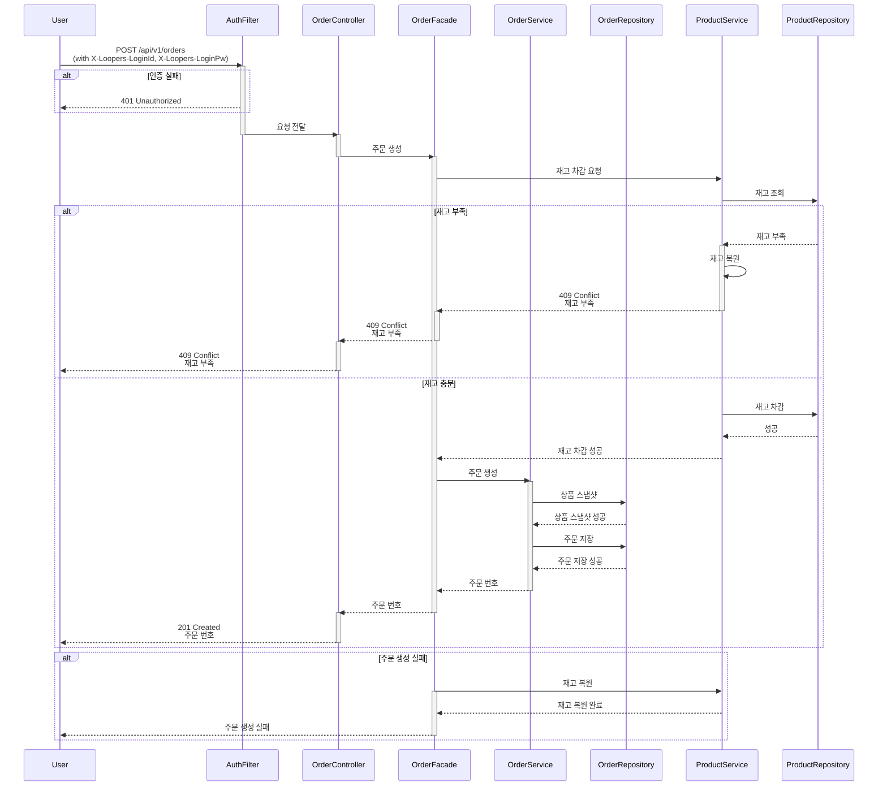
```mermaid
sequenceDiagram
    participant Client as User
    participant AuthFilter
    participant OrderController
    participant OrderFacade
    participant OrderService
    participant OrderRepository
    participant ProductService
    participant ProductRepository

    Client->>AuthFilter: POST /api/v1/orders<br/>(with X-Loopers-LoginId, X-Loopers-LoginPw)
    
    activate AuthFilter
        alt 인증 실패
            AuthFilter-->>Client: 401 Unauthorized
        end
        AuthFilter->>OrderController: 요청 전달
    deactivate AuthFilter
    
    activate OrderController
        OrderController->>OrderFacade: 주문 생성
    deactivate OrderController

    activate OrderFacade
    OrderFacade->>ProductService: 재고 차감 요청
    
    ProductService->>ProductRepository: 재고 조회

    alt 재고 부족

        ProductRepository-->>ProductService: 재고 부족
        activate ProductService
            ProductService->>ProductService: 재고 복원
            ProductService-->>OrderFacade: 409 Conflict<br>재고 부족
        deactivate ProductService
        activate OrderFacade
            OrderFacade-->>OrderController: 409 Conflict<br>재고 부족
        deactivate OrderFacade
        activate OrderController
            OrderController-->>Client: 409 Conflict<br>재고 부족
        deactivate OrderController
    else 재고 충분
        ProductService->>ProductRepository: 재고 차감
        ProductRepository-->>ProductService: 성공
        ProductService-->>OrderFacade: 재고 차감 성공

        OrderFacade->>OrderService: 주문 생성
        activate OrderService
            OrderService->>OrderRepository: 상품 스냅샷
            OrderRepository-->>OrderService: 상품 스냅샷 성공
            OrderService->>OrderRepository: 주문 저장
            OrderRepository-->>OrderService: 주문 저장 성공
            OrderService-->>OrderFacade: 주문 번호
        deactivate OrderService
            OrderFacade-->>OrderController: 주문 번호
        deactivate OrderFacade
        activate OrderController
            OrderController-->>Client: 201 Created<br>주문 번호
        deactivate OrderController
    end

    alt 주문 생성 실패
        OrderFacade->>ProductService: 재고 복원
        activate OrderFacade
            ProductService-->>OrderFacade: 재고 복원 완료
            OrderFacade-->>Client: 주문 생성 실패
        deactivate OrderFacade
    end
```
## 유저의 주문 목록 조회
### GET /api/v1/orders?startAt=2026-01-31&endAt=2026-02-10

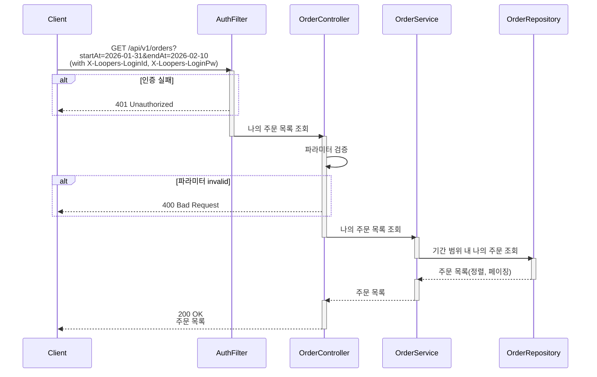
```mermaid
sequenceDiagram
    participant Client
    participant AuthFilter
    participant OrderController
    participant OrderService
    participant OrderRepository

    Client->>AuthFilter: GET /api/v1/orders?<br>startAt=2026-01-31&endAt=2026-02-10 <br/>(with X-Loopers-LoginId, X-Loopers-LoginPw)
    activate AuthFilter
        alt 인증 실패
            AuthFilter-->>Client: 401 Unauthorized
        end
        AuthFilter->>OrderController: 나의 주문 목록 조회
    deactivate AuthFilter

    activate OrderController
        OrderController->>OrderController: 파라미터 검증
        alt 파라미터 invalid
            OrderController-->>Client: 400 Bad Request
        end
        OrderController->>OrderService: 나의 주문 목록 조회
    deactivate OrderController

    activate OrderService
        OrderService->>OrderRepository: 기간 범위 내 나의 주문 조회
    deactivate OrderService

    activate OrderRepository
        OrderRepository-->>OrderService: 주문 목록(정렬, 페이징)
    deactivate OrderRepository

    activate OrderService
        OrderService-->>OrderController: 주문 목록
    deactivate OrderService

    activate OrderController
        OrderController-->>Client: 200 OK<br/>주문 목록
    deactivate OrderController
```

## 단일 주문 상세 조회
### GET /api/v1/orders/{orderId}

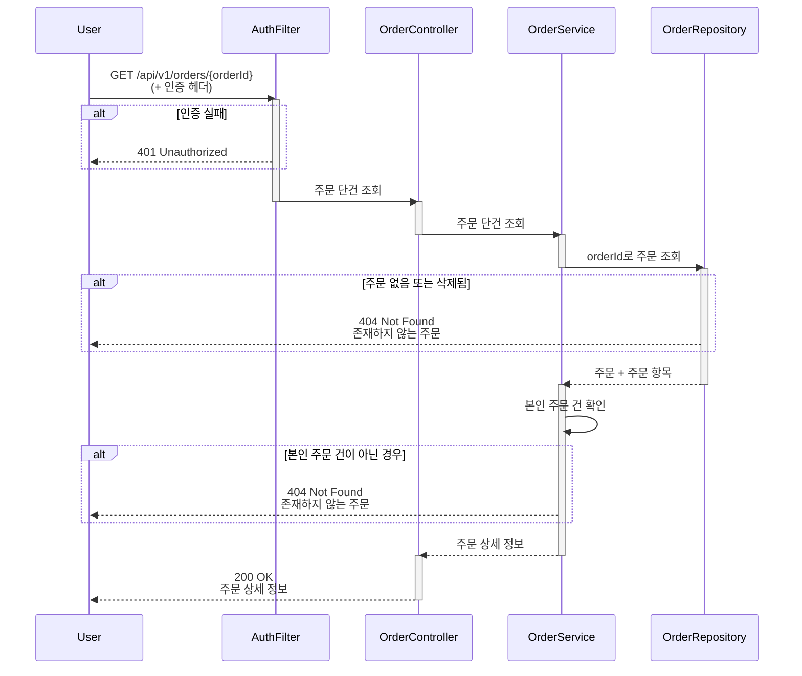
```mermaid
sequenceDiagram
    participant Client as User
    participant AuthFilter
    participant OrderController
    participant OrderService
    participant OrderRepository

    Client->>AuthFilter: GET /api/v1/orders/{orderId}<br/>(+ 인증 헤더)
    activate AuthFilter
        alt 인증 실패
            AuthFilter-->>Client: 401 Unauthorized
        end
        AuthFilter->>OrderController: 주문 단건 조회
    deactivate AuthFilter

    activate OrderController
        OrderController->>OrderService: 주문 단건 조회
    deactivate OrderController

    activate OrderService
        OrderService->>OrderRepository: orderId로 주문 조회
    deactivate OrderService

    activate OrderRepository
        alt 주문 없음 또는 삭제됨
            OrderRepository-->>Client: 404 Not Found<br>존재하지 않는 주문
        end
        OrderRepository-->>OrderService: 주문 + 주문 항목
    deactivate OrderRepository

    activate OrderService
        OrderService->>OrderService: 본인 주문 건 확인
        alt 본인 주문 건이 아닌 경우
            OrderService-->>Client: 404 Not Found<br>존재하지 않는 주문
        end
        OrderService-->>OrderController: 주문 상세 정보
    deactivate OrderService

    activate OrderController
        OrderController-->>Client: 200 OK<br/>주문 상세 정보
    deactivate OrderController
```

# 🧾 주문 ADMIN

## 주문 목록 조회
### GET /api-admin/v1/orders?page=0&size=20

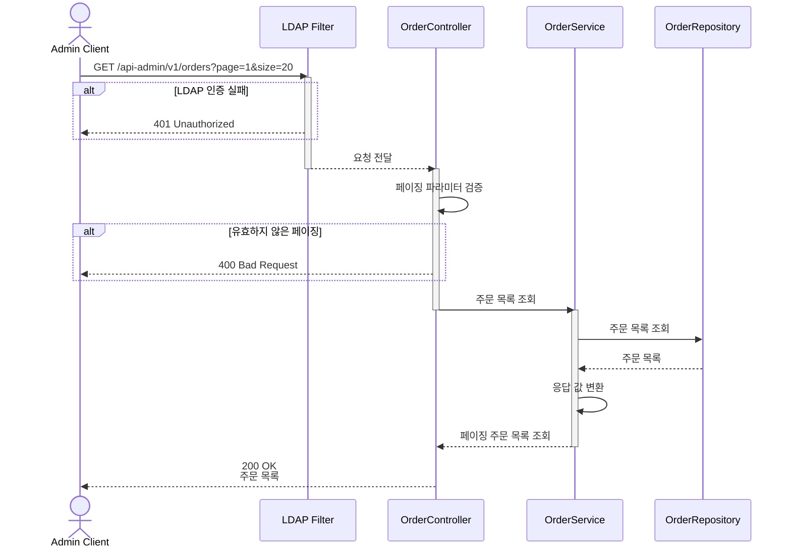
```mermaid
sequenceDiagram
    actor Admin as Admin Client
    participant AuthFilter as LDAP Filter
    participant Controller as OrderController
    participant Service as OrderService
    participant Repository as OrderRepository

    Admin->>AuthFilter: GET /api-admin/v1/orders?page=1&size=20

    activate AuthFilter
        alt LDAP 인증 실패
            AuthFilter-->>Admin: 401 Unauthorized
        end

        AuthFilter-->>Controller: 요청 전달
    deactivate AuthFilter

    activate Controller
        Controller->>Controller: 페이징 파라미터 검증

        alt 유효하지 않은 페이징
            Controller-->>Admin: 400 Bad Request
        end

        Controller->>Service: 주문 목록 조회
    deactivate Controller

    activate Service
        Service->>Repository: 주문 목록 조회
        Repository-->>Service: 주문 목록
        Service->>Service: 응답 값 변환
        Service-->>Controller: 페이징 주문 목록 조회
    deactivate Service

    Controller-->>Admin: 200 OK<br/>주문 목록
```

## 단일 주문 상세 조회
### GET /api-admin/v1/orders/{orderId}

```mermaid
sequenceDiagram
    actor Admin as Admin Client
    participant AuthFilter as LDAP Filter
    participant Controller as OrderController
    participant Service as OrderService
    participant Repository as OrderRepository

    Admin->>AuthFilter: GET /api-admin/v1/orders/{orderId}

    activate AuthFilter
    alt LDAP 인증 실패
        AuthFilter-->>Admin: 401 Unauthorized
    end

    AuthFilter-->>Controller: 요청 전달
    deactivate AuthFilter
    
    activate Controller
    Controller->>Service: 단일 주문 상세 조회
    deactivate Controller

    activate Service
    Service->>Repository: 주문 상세 조회
    deactivate Service

    alt 주문이 존재하지 않음
        Repository-->>Service: 주문 정보 없음
        Service-->>Controller: 주문 정보 없음
        Controller-->>Admin: 404 Not Found<br>주문이 존재하지 않음
    end

    Repository-->>Service: 주문 상세

    activate Service
        Service->>Service: 주문 상세 정보 변환
        Service-->>Controller: 주문 상세 정보
    deactivate Service

    activate Controller
    Controller-->>Admin: 200 OK<br/>주문 상세 정보
    deactivate Controller
```