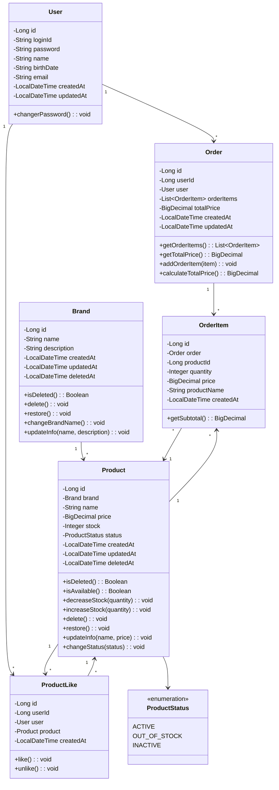

# 커머스 API - 클래스 다이어그램

## 📊 엔티티 클래스 다이어그램

```mermaid
classDiagram
    direction TB

%% ===== DOMAIN ENTITIES =====
    class User {
        -Long id
        -String loginId
        -String password
        -String name
        -String birthDate
        -String email
        -LocalDateTime createdAt
        -LocalDateTime updatedAt
        +changerPassword(): void
    }

    class Brand {
        -Long id
        -String name
        -String description
        -LocalDateTime createdAt
        -LocalDateTime updatedAt
        -LocalDateTime deletedAt
        +isDeleted(): Boolean
        +delete(): void
        +restore(): void
        +changeBrandName(): void
        +updateInfo(name, description): void
    }

    class Product {
        -Long id
        -Brand brand
        -String name
        -BigDecimal price
        -Integer stock
        -ProductStatus status
        -LocalDateTime createdAt
        -LocalDateTime updatedAt
        -LocalDateTime deletedAt
        +isDeleted(): Boolean
        +isAvailable(): Boolean
        +decreaseStock(quantity): void
        +increaseStock(quantity): void
        +delete(): void
        +restore(): void
        +updateInfo(name, price): void
        +changeStatus(status): void
    }

    class ProductStatus {
        <<enumeration>>
        ACTIVE
        OUT_OF_STOCK
        INACTIVE
    }

    class Order {
        -Long id
        -Long userId
        -User user
        -List~OrderItem~ orderItems
        -BigDecimal totalPrice
        -LocalDateTime createdAt
        -LocalDateTime updatedAt
        +getOrderItems(): List~OrderItem~
        +getTotalPrice(): BigDecimal
        +addOrderItem(item): void
        +calculateTotalPrice(): BigDecimal
    }

    class OrderItem {
        -Long id
        -Order order
        -Long productId
        -Integer quantity
        -BigDecimal price
        -String productName
        -LocalDateTime createdAt
        +getSubtotal(): BigDecimal
    }

    class ProductLike {
        -Long id
        -Long userId
        -User user
        -Product product
        -LocalDateTime createdAt
        +like(): void
        +unlike(): void
    }

%% ===== ASSOCIATIONS =====
    User "1" --> "*" Order
    User "1" --> "*" ProductLike

    Brand "1" --> "*" Product
    Product "1" --> "*" OrderItem
    Product "1" --> "*" ProductLike

    Order "1" --> "*" OrderItem
    OrderItem "*" --> "1" Product
    ProductLike "*" --> "1" Product

    Product --> ProductStatus
```