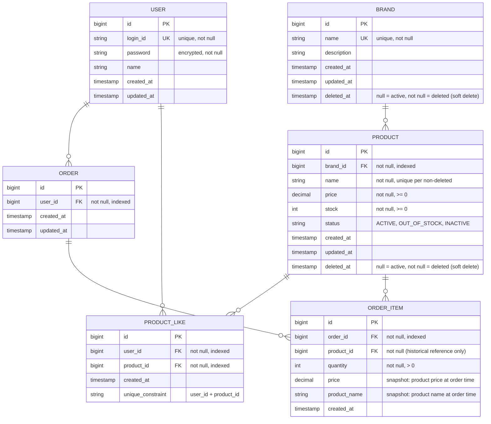

# 커머스 API - ERD

---

## 📊 ERD (Mermaid)

---

## 📋 테이블 상세 설명

### 1. BRAND 테이블
**설계 의도**:
- `deleted_at IS NULL` → 활성 브랜드
- `deleted_at IS NOT NULL` → 삭제된 브랜드

---

### 2. PRODUCT 테이블
**설계 의도**:
- `brand_id`: 상품은 하나의 브랜드에만 속함
- `stock`: 실시간으로 증감
- `status`: 노출 여부 제어 (활성/품절은 노출, 비활성은 미노출)

---

### 3. ORDER 테이블
**설계 의도**:
- `user_id`: 주문자, FK로 사용자와 연결
- `created_at`: 기간 범위 조회에 사용

---

### 4. ORDER_ITEM 테이블
**설계 의도**:
- `price`, `product_name`: 주문 당시의 실제 값
- 상품 정보가 변경되어도 주문 기록은 불변

---

### 5. PRODUCT_LIKE 테이블
**설계 의도**:
- `uk_user_product`: 사용자당 상품별 최대 1개의 좋아요만 허용

---

## 🔍 ERD 해석 포인트
| 항목 | 설계 선택 | 이유           |
|------|---------|--------------|
| **Soft Delete** | Brand, Product에만 적용 | 외부 참조 안전성    |
| **스냅샷** | OrderItem.price, productName | 주문 이력 불변성 보장 |

---