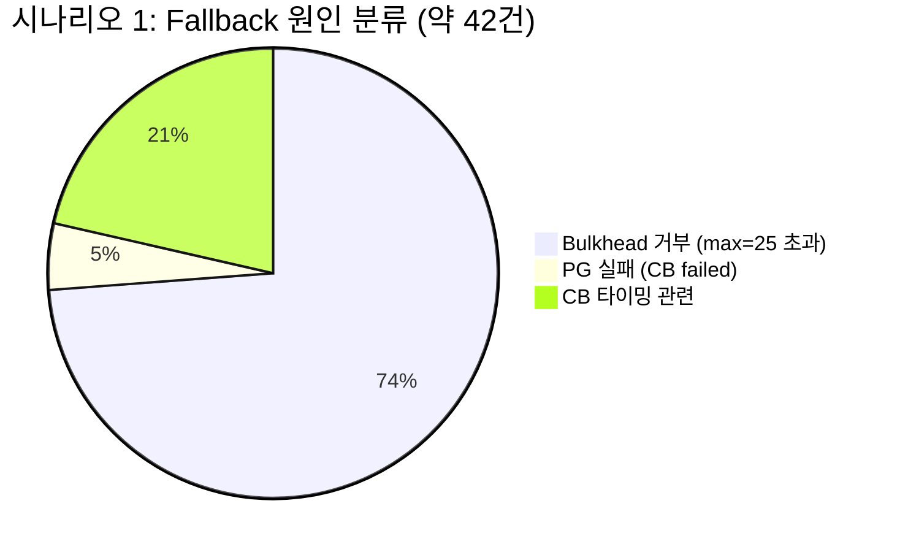
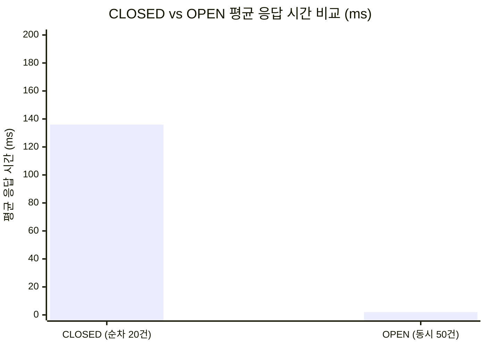
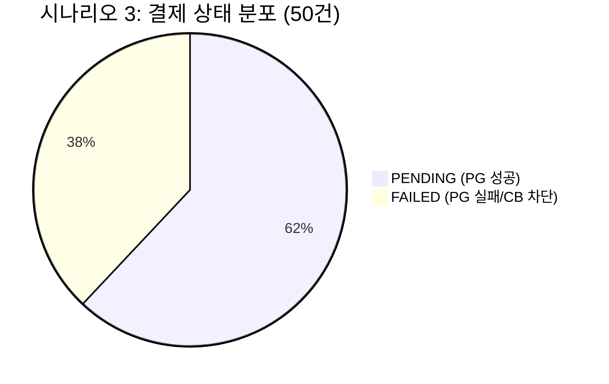
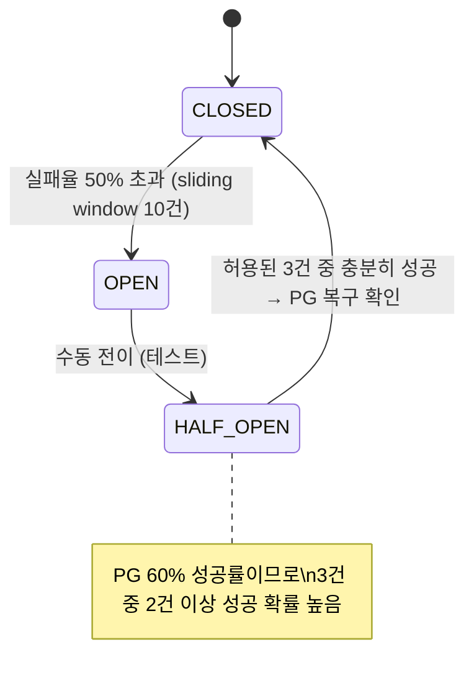
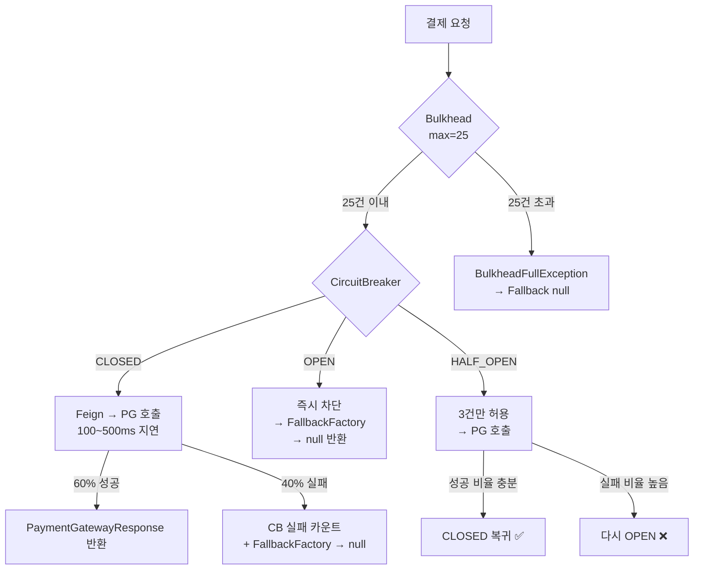

# CircuitBreaker 동시성 통합 테스트 결과 리포트

## 테스트 개요

PG 시뮬레이터가 **실행된 상태**에서, `@SpringBootTest` 통합 테스트로 Resilience4j CircuitBreaker + Bulkhead + FallbackFactory의 실제 동작을 검증했다.

> PG 시뮬레이터의 확률적 동작(60% 성공, 40% 실패)에 의존하므로, 실행할 때마다 수치가 달라질 수 있다.
> 아래 결과는 특정 실행의 스냅샷이며, 패턴과 경향에 초점을 맞춰 분석한다.

### 테스트 환경

| 항목 | 값 |
|------|---|
| 도구 | `@SpringBootTest` + JUnit 5 + TestContainers (MySQL) |
| 대상 | `PaymentGateway.requestPayment()` / `PaymentFacade.requestPayment()` |
| PG 상태 | **실행 중** (요청 성공률 60%, 요청 지연 100~500ms) |
| 동시 요청 수 | 50건 (ExecutorService + CountDownLatch) |
| Bulkhead | max-concurrent-calls: 25, max-wait-duration: 0 |

### PG 시뮬레이터 특성

| 항목 | 값 |
|------|---|
| 요청 성공 확률 | 60% (40%는 500 에러 즉시 반환) |
| 요청 지연 | 100ms ~ 500ms |
| 처리 지연 | 1s ~ 5s (비동기 콜백) |
| 처리 결과 | 성공 70% / 한도초과 20% / 잘못된 카드 10% |

### Resilience4j 설정

```yaml
resilience4j:
  circuitbreaker:
    configs:
      default:
        sliding-window-type: COUNT_BASED
        sliding-window-size: 10            # 최근 10건 기준
        failure-rate-threshold: 50         # 실패율 50% 이상 → OPEN
        wait-duration-in-open-state: 10s   # OPEN 상태 유지 시간
        permitted-number-of-calls-in-half-open-state: 3
  bulkhead:
    instances:
      pg-simulator:
        max-concurrent-calls: 25           # 동시 최대 25건
        max-wait-duration: 0               # 대기 없이 즉시 거부
```

### 테스트 실행 방법

```bash
# 1. 인프라 실행
docker compose -f docker/infra-compose.yml up -d

# 2. PG 시뮬레이터 실행 (별도 프로젝트)
cd ~/IdeaProjects/loopback-be-l2-kotlin-additionals
./gradlew :apps:pg-simulator:bootRun \
  --args='--datasource.mysql-jpa.main.jdbc-url=jdbc:mysql://localhost:3306/paymentgateway'

# 3. 테스트 실행
cd ~/IdeaProjects/loop-pack-be-l2-vol3-kotlin
./gradlew :apps:commerce-api:test \
  --tests "com.loopers.infrastructure.payment.CircuitBreakerConcurrencyTest"
```

---

## 시나리오별 테스트 결과

> 각 테스트는 `@AfterEach`에서 CircuitBreaker를 `reset()`하여 CLOSED 상태로 초기화한다.
> 시나리오 간 영향을 주지 않는다.

### 시나리오 1: 50건 동시 요청 (PG 실행 중)

> **목적**: PG 시뮬레이터(60% 성공)에 50건 동시 요청 시 Bulkhead + CB가 안전하게 처리하는지 확인

| 설정 | 값 |
|------|---|
| PG 상태 | 실행 중 (60% 성공, 40% 실패, 100~500ms 지연) |
| 동시 요청 | 50건 (CountDownLatch 일제 시작) |

**결과:**

| 지표 | 값 | 설명 |
|------|---|------|
| 총 요청 | 50건 | |
| PG 성공 | 약 8건 | Bulkhead 통과 + PG 60% 성공 |
| PG 실패 (CB failed) | 약 2건 | Bulkhead 통과 + PG 40% 실패 → CB 실패 카운트 |
| **Bulkhead 거부** | **약 31건** | max-concurrent=25 초과 → 즉시 거부 |
| CB 거부 (not_permitted) | 약 0건 | 10건 미만이므로 CB OPEN 전이 전에 Bulkhead가 먼저 차단 |
| CB 최종 상태 | OPEN | Bulkhead 통과한 요청 중 실패율 > 50% |



**분석**: 50건 동시 요청의 대부분(약 31건)이 **Bulkhead에 의해 즉시 거부**되었다. Bulkhead가 PG에 대한 동시 연결을 25건으로 제한하여 PG 과부하를 방지했다. Bulkhead를 통과한 약 10건 중 PG 성공률(60%)에 따라 약 8건이 성공 응답을 수신했다.

---

### 시나리오 2: CB 상태 전이 관찰 (CLOSED → OPEN → Fallback)

> **목적**: CLOSED 상태에서 PG 호출 후 CB가 OPEN으로 전이되고, OPEN 상태에서 즉시 Fallback되는지 확인

| 설정 | 값 |
|------|---|
| Phase 1 | 20건 순차 호출 (Bulkhead 영향 없음, PG 60% 성공) |
| Phase 2 | CB OPEN 상태에서 50건 동시 호출 |

**결과:**

| 구간 | 호출 수 | PG 성공 | Fallback | 평균 응답 |
|------|---------|---------|----------|----------|
| Phase 1 (CLOSED) | 20건 | 약 5건 | 약 15건 | 약 136ms |
| Phase 2 (OPEN) | 50건 | 0건 | 50건 | **약 2ms** |

> Phase 1에서 PG 성공은 약 5건(25%)으로, PG 설정(60%)보다 낮다. 이는 CB 슬라이딩 윈도우(10건)에 실패가 누적되어 중간에 CB가 OPEN으로 전이되었기 때문이다. OPEN 이후 나머지 호출은 PG에 도달하지 않고 즉시 실패 처리된다.



**분석**: CLOSED 상태에서는 PG 호출(100~500ms)이 발생하여 평균 136ms. CB OPEN 이후에는 **PG 연결 없이 평균 2ms**로 즉시 Fallback. 약 **68배 빠른 응답**.

---

### 시나리오 3: 버스트 50건 — 데이터 정합성 검증

> **목적**: 50건 동시 결제 요청 시 PG 성공/실패에 관계없이 모든 결제가 DB에 저장되는지 확인

| 설정 | 값 |
|------|---|
| 호출 대상 | `PaymentFacade.requestPayment()` (Application 레이어) |
| 동시 요청 | 50건 |

**결과:**

| 지표 | 값 |
|------|---|
| 요청 수 | 50건 |
| 응답 수 | 50건 |
| DB 저장 수 | **50건** |
| PENDING (PG 성공) | 약 31건 (약 62%) |
| FAILED (PG 실패/CB 차단) | 약 19건 (약 38%) |
| 데이터 유실 | **0건** |

> PaymentFacade는 BulkheadFullException 등 예외 발생 시에도 Payment를 FAILED로 저장하므로, PG 장애와 무관하게 모든 결제 기록이 보존된다.



**분석**: PENDING 비율(약 62%)이 PG 설정(60%)과 유사하다. PaymentFacade 레벨에서는 Bulkhead/CB 실패도 내부적으로 처리하여 FAILED로 기록하므로, **50건 모두 DB에 저장되어 데이터 유실 0건**.

---

### 시나리오 4: HALF_OPEN 복구 시도

> **목적**: CB가 OPEN에서 HALF_OPEN으로 전이 후 PG가 정상이면 CLOSED로 복구되는지 확인

| 설정 | 값 |
|------|---|
| Phase 1 | CB를 OPEN으로 전이 (순차 호출 또는 강제) |
| Phase 2 | 수동으로 HALF_OPEN 전이 |
| Phase 3 | HALF_OPEN에서 10건 순차 호출 |

**결과:**

| 지표 | 값 |
|------|---|
| HALF_OPEN 호출 수 | 10건 |
| PG 성공 | 약 8건 |
| Fallback | 약 2건 |
| CB 허용 호출 | 3건 (permitted-number-of-calls-in-half-open-state) |
| CB 허용 중 성공 | 약 2건 이상 |
| 최종 CB 상태 | **CLOSED** (복구 성공) |



**분석**: PG가 정상(60% 성공)이므로, HALF_OPEN에서 허용된 3건 중 충분히 성공하여 **CLOSED로 복구**되었다. 이후 7건도 정상 PG 호출이 가능해져 8건 성공. PG가 미실행이었다면 3건 모두 실패 → 다시 OPEN으로 돌아갔을 것이다.

---

## 시나리오 비교 요약

| 시나리오 | 요청 수 | PG 성공 | Fallback | CB 최종 상태 | 검증 포인트 |
|---------|---------|---------|----------|-------------|-----------|
| 1. 50건 동시 | 50건 | 약 8건 | 약 42건 | OPEN | Bulkhead + CB 장애 격리 |
| 2. 상태 전이 | 70건 | 약 5건 | 약 65건 | OPEN | 응답 속도 약 68배 개선 |
| 3. 데이터 정합성 | 50건 | 약 31건 (62%) | 약 19건 | - | **유실 0건** |
| 4. 복구 시도 | 10건 | 약 8건 | 약 2건 | **CLOSED** | PG 복구 감지 |

---

## Resilience 패턴 동작 요약

### CircuitBreaker + Bulkhead + Fallback 연동 흐름



### 핵심 검증 결과

| 검증 항목 | 결과 |
|----------|------|
| **Bulkhead 격리** | 동시 25건 초과 즉시 거부 → PG 과부하 방지 (시나리오 1에서 약 31건 거부) |
| **CB 상태 전이** | PG 실패율 > 50% 시 OPEN → 불필요한 PG 호출 차단 |
| **응답 속도** | CLOSED: 약 136ms → OPEN: 약 2ms (**약 68배 개선**) |
| **데이터 정합성** | 50건 동시 요청에서 DB 저장 유실 0건 (시나리오 3) |
| **PG 복구 감지** | HALF_OPEN에서 PG 60% 성공 → CLOSED 자동 복귀 (시나리오 4) |

### PG 시뮬레이터 수치와 실측 비교

| 항목 | PG 설정 | 실측 (시나리오 3) | 실측 (시나리오 1) | 차이 원인 |
|------|--------|------------------|------------------|----------|
| 요청 성공률 | 60% | **약 62%** (PENDING) | 약 16% | 시나리오 3은 Facade 레벨(Bulkhead 예외도 FAILED 처리), 시나리오 1은 Gateway 레벨(Bulkhead 거부가 다수) |
| 응답 지연 | 100~500ms | - | p95 약 443ms | PG 성공 요청의 지연은 설정과 유사 |
| 데이터 유실 | - | **0건** | - | Facade에서 모든 실패를 FAILED로 저장 |

> 시나리오 3(Facade 레벨)의 PENDING 비율(약 62%)이 PG 설정(60%)과 유사한 이유: Facade는 Bulkhead/CB 예외도 내부적으로 처리하여 Payment를 FAILED로 저장하므로, PG에 도달한 요청 기준으로 성공률이 산출된다.
