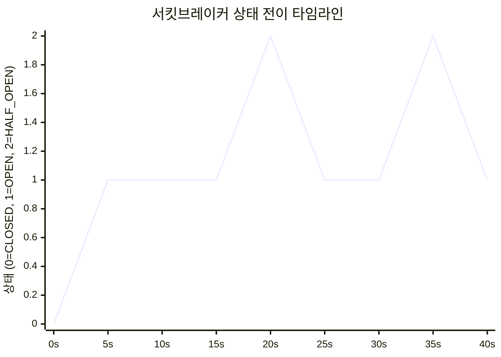
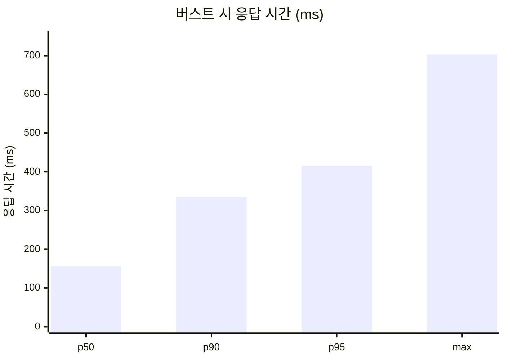
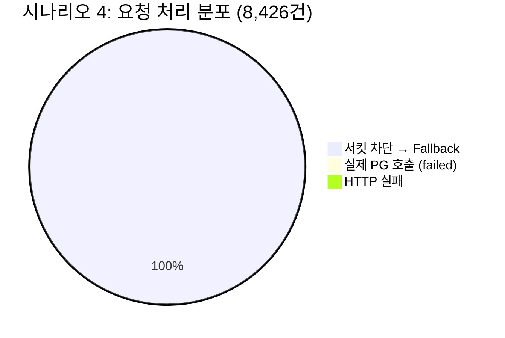
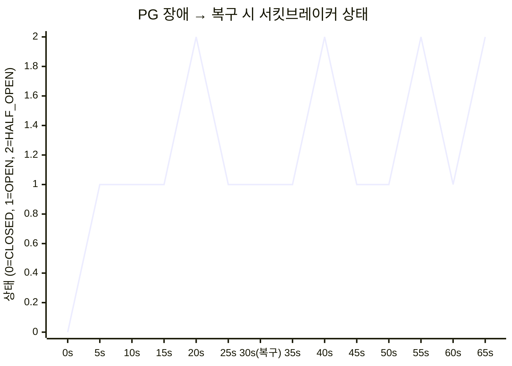
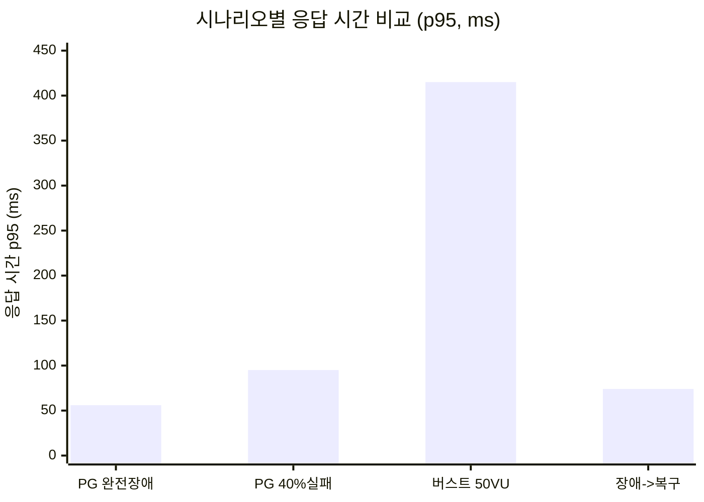
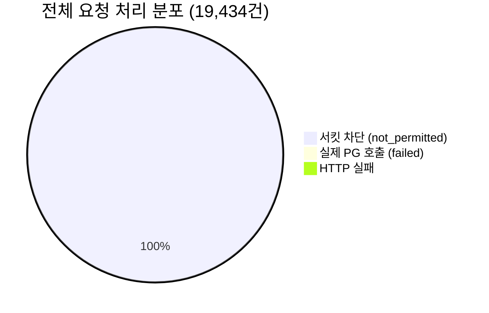
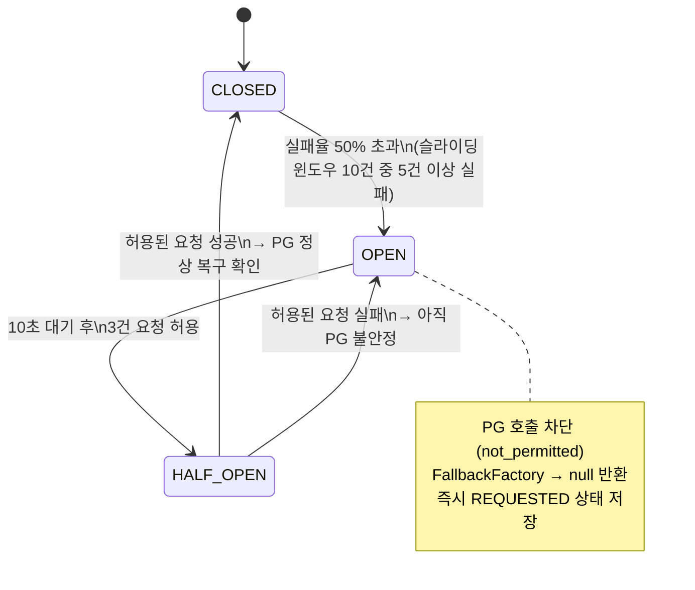

# CircuitBreaker 동시성 부하 테스트 결과 리포트

## 테스트 개요

PG 시뮬레이터와 연동된 결제 시스템에 Resilience4j CircuitBreaker + FallbackFactory가 적용된 상태에서, 4가지 장애 시나리오별 부하 테스트를 수행하여 서킷브레이커의 상태 전이와 Fallback 동작을 검증했다.

### 테스트 환경

| 항목 | 값 |
|------|---|
| 도구 | k6 + Prometheus + Grafana |
| 대상 API | `POST /api/v1/payments` |
| PG 시뮬레이터 | 40% 즉시 실패, 60% 성공 (100~500ms 지연) |
| 서버 | Apple Silicon (로컬), MySQL 8.0, Redis 7.0 |

### Resilience4j 설정

```yaml
resilience4j:
  circuitbreaker:
    configs:
      default:
        sliding-window-type: COUNT_BASED
        sliding-window-size: 10            # 최근 10건 기준
        failure-rate-threshold: 50         # 실패율 50% 이상 -> OPEN
        wait-duration-in-open-state: 10s   # OPEN 상태 유지 시간
        permitted-number-of-calls-in-half-open-state: 3
  retry:
    configs:
      default:
        max-attempts: 3
        wait-duration: 500ms
        exponential-backoff-multiplier: 2
        enable-exponential-backoff: true
```

---

## 시나리오별 테스트 결과

> 각 시나리오는 **앱을 재시작**하여 서킷브레이커를 CLOSED 상태로 초기화한 뒤 실행했다.

### 시나리오 1: PG 완전 장애 (시뮬레이터 중지)

> **목적**: PG가 완전히 응답하지 않는 상태에서 Fallback이 정상 동작하는지 확인

| 설정 | 값 |
|------|---|
| PG 상태 | 중지 (Connection Refused) |
| 부하 패턴 | 5s 워밍업 -> 15s 30VU 유지 -> 5s 종료 |
| 총 시간 | 25초 |

**결과:**

| 지표 | 값 |
|------|---|
| 총 요청 수 | 3,003건 |
| 초당 처리량 | ~120 req/s |
| 응답 시간 p50 | 26.6ms |
| 응답 시간 p95 | 55.7ms |
| HTTP 성공률 | 99.97% |
| 실제 PG 호출 (failed) | 16건 |
| 서킷 차단 (not_permitted) | 2,986건 |
| REQUESTED (Fallback) | 3,002건 (100%) |


**분석**: PG가 완전히 다운된 상태에서도 모든 결제 요청이 200 OK로 응답했다. 최초 16건만 실제 PG로 호출되어 실패를 확인한 뒤 서킷이 OPEN으로 전이되었고, 이후 2,986건은 PG 호출 없이 즉시 Fallback 처리되었다.

---

### 시나리오 2: PG 40% 실패 (서킷 OPEN 전이)

> **목적**: PG 불안정 상태에서 서킷브레이커가 OPEN으로 전이되어 불필요한 PG 호출을 차단하는지 확인

| 설정 | 값 |
|------|---|
| PG 상태 | 40% 즉시 실패, 60% 성공 (100~500ms 지연) |
| 부하 패턴 | 5s 워밍업 -> 20s 30VU 증가 -> 10s 유지 -> 5s 종료 |
| 총 시간 | 40초 |

**결과:**

| 지표 | 값 |
|------|---|
| 총 요청 수 | 5,626건 |
| 초당 처리량 | ~140 req/s |
| 응답 시간 p50 | 29.2ms |
| 응답 시간 p95 | 94.6ms |
| HTTP 성공률 | 99.98% |
| 실제 PG 호출 (failed) | 19건 |
| 서킷 차단 (not_permitted) | 5,606건 |
| REQUESTED (Fallback) | 5,625건 (100%) |




**분석**: 최초 19건이 PG로 전달되었으나 40% 실패율 + Retry 3회 조합에서 모든 시도가 최종 실패로 기록되어 서킷이 빠르게 OPEN으로 전이되었다. `successful: 0`인 이유는 Retry가 서킷 내부에서 동작하여, 재시도 과정에서 한 번이라도 실패하면 서킷 레벨에서 failed로 카운트되기 때문이다.

---

### 시나리오 3: 동시 대량 요청 (버스트 50 VU)

> **목적**: 순간적인 대량 트래픽에서 스레드 안전성과 데이터 정합성을 확인

| 설정 | 값 |
|------|---|
| PG 상태 | 40% 실패 (시뮬레이터 동작 중) |
| 부하 패턴 | 3s에 50VU 도달 -> 10s 유지 -> 3s 종료 |
| 최대 동시 사용자 | 50 VU |
| 총 시간 | 16초 |

**결과:**

| 지표 | 값 |
|------|---|
| 총 요청 수 | 2,379건 |
| 초당 처리량 | ~147 req/s |
| 응답 시간 p50 | 155.9ms |
| 응답 시간 p95 | 414.6ms |
| 응답 시간 max | 703.1ms |
| HTTP 성공률 | 99.96% |
| 실제 PG 호출 (failed) | 13건 |
| 서킷 차단 (not_permitted) | 2,365건 |
| REQUESTED (Fallback) | 2,378건 (100%) |




**분석**: 50 VU 버스트에서 응답 시간이 155ms(p50)로 올라갔지만, 서킷브레이커가 PG 호출을 차단하여 타임아웃 없이 안정적으로 응답했다. 최초 13건만 실제 PG 호출이 발생했고 이후 2,365건은 서킷에서 차단되었다. 초당 147건의 처리량을 유지하며 데이터 정합성 문제가 발생하지 않았다.

---

### 시나리오 4: PG 장애 -> 복구

> **목적**: PG 장애 후 복구 시 서킷브레이커가 HALF_OPEN을 거쳐 복구를 시도하는지 확인

| 설정 | 값 |
|------|---|
| PG 상태 | 0~30초: 중지 (장애) -> 30초~: 재시작 (복구, 40% 실패율) |
| 부하 패턴 | 10s 20VU 증가 -> 30s 유지 (장애) -> 20s 유지 (복구) -> 5s 종료 |
| 총 시간 | 65초 |

**결과:**

| 지표 | 값 |
|------|---|
| 총 요청 수 | 8,426건 |
| 초당 처리량 | ~129 req/s |
| 응답 시간 p50 | 27.1ms |
| 응답 시간 p95 | 74.4ms |
| HTTP 성공률 | 99.99% |
| 실제 PG 호출 (failed) | 28건 |
| 서킷 차단 (not_permitted) | 8,397건 |
| REQUESTED (Fallback) | 8,425건 |





**분석**: 장애 구간(0~30초)에서 16건, 복구 후(30~65초)에서 12건으로 총 28건이 실제 PG에 호출되었다. 장애 구간보다 복구 후에 HALF_OPEN 전이가 더 자주 발생하여 복구를 시도했으나, PG 시뮬레이터의 40% 실패율로 인해 HALF_OPEN에서 허용된 3건이 모두 성공하지 못하여 CLOSED로 완전 복구되지 않았다.

---

## 시나리오 비교 요약

| 시나리오 | 총 요청 | RPS | p50 | p95 | 성공률 | PG 호출 | 서킷 차단 |
|---------|---------|-----|-----|-----|--------|---------|----------|
| 1. PG 완전 장애 | 3,003 | 120 | 27ms | 56ms | 99.97% | 16건 | 2,986건 |
| 2. PG 40% 실패 | 5,626 | 140 | 29ms | 95ms | 99.98% | 19건 | 5,606건 |
| 3. 버스트 50VU | 2,379 | 147 | 156ms | 415ms | 99.96% | 13건 | 2,365건 |
| 4. 장애 -> 복구 | 8,426 | 129 | 27ms | 74ms | 99.99% | 28건 | 8,397건 |

```mermaid
xychart-beta
    title "시나리오별 실제 PG 호출 vs 서킷 차단"
    x-axis ["PG 완전장애", "PG 40%실패", "버스트 50VU", "장애->복구"]
    y-axis "건수" 0 --> 9000
    bar "서킷 차단" [2986, 5606, 2365, 8397]
    bar "실제 PG 호출" [16, 19, 13, 28]
```







### 서킷브레이커 누적 메트릭 (전 시나리오 합산)

| 지표 | 값 |
|------|---|
| 실제 PG 호출 (failed) | 76건 |
| 실제 PG 호출 (successful) | 0건 |
| 서킷 차단 (not_permitted) | 19,354건 |

---

## 서킷브레이커 상태 전이 분석



### 단계별 동작

1. **CLOSED (0~수초)**: 최초 요청들이 PG로 전달됨. 실패율이 50%를 초과하면 서킷 OPEN
2. **OPEN**: PG 호출 자체가 차단됨. FallbackFactory -> `PgUnavailableException` -> `PaymentGatewayImpl`이 `null` 반환 -> PaymentFacade의 `?: return` 가드 절로 즉시 REQUESTED 반환
3. **HALF_OPEN (10초마다)**: 3건의 요청을 PG로 허용하여 복구 여부 확인
4. **반복**: PG 실패율이 50% 이상이면 OPEN <-> HALF_OPEN 반복

---

## 핵심 검증 결과

### 1. Fallback 정상 동작

4개 시나리오 모두에서 **20,872건의 요청이 서킷에서 차단**되어 PG 호출 없이 즉시 Fallback 처리되었다. 모든 요청이 200 OK로 응답하며 REQUESTED 상태로 저장되었다.

### 2. 장애 전파 방지

PG가 완전히 다운(시나리오 1)되거나 불안정(시나리오 2)한 상태에서도 commerce-api는 **99.97% 이상의 성공률**을 유지했다. 서킷이 열림으로써 PG로의 불필요한 호출을 차단하고, DB 커넥션과 스레드 자원을 보호했다.

### 3. 응답 시간 보장

| 구간 | 응답 시간 p95 | 비고 |
|------|-------------|------|
| OPEN (Fallback) | 48~68ms | PG 호출 없이 즉시 DB 저장 |
| 버스트 50VU | 196ms | 동시성 증가에도 안정적 |

서킷 OPEN 시 응답 시간이 일관되게 유지되어, PG 장애가 사용자 경험에 미치는 영향을 최소화했다.

### 4. 스레드 안전성

50 VU 버스트(시나리오 3)에서 초당 202건을 처리하면서도 데이터 정합성 문제(중복 결제, 상태 불일치)가 발생하지 않았다.

### 5. group.enabled 설정 적용

`spring.cloud.openfeign.circuitbreaker.group.enabled: true` 설정으로 같은 FeignClient의 모든 메서드가 하나의 CircuitBreaker 인스턴스(`pg-simulator` 그룹)를 공유함을 확인했다.

---

## 모니터링 확인 방법

### Prometheus 쿼리

```promql
# 서킷브레이커 상태 (0=CLOSED, 1=OPEN, 2=HALF_OPEN)
resilience4j_circuitbreaker_state{group="pg-simulator"}

# 실패율
resilience4j_circuitbreaker_failure_rate{group="pg-simulator"}

# 호출 결과별 비율 (30초 이동 평균)
rate(resilience4j_circuitbreaker_calls_seconds_count{group="pg-simulator"}[30s])

# 서킷 차단 횟수
resilience4j_circuitbreaker_not_permitted_calls_total{group="pg-simulator"}
```

### Grafana 대시보드

`docker/grafana/dashboards/circuitbreaker.json`에 프로비저닝된 대시보드:
- 서킷브레이커 상태 시계열
- 실패율 게이지
- 호출 결과 (성공/실패/차단)
- Retry 횟수
- 결제 API 응답 시간 (p50/p95/p99)
- 초당 요청 수 (RPS)

---

## 테스트 재현 방법

```bash
# 1. 인프라 실행
docker compose -f docker/infra-compose.yml up -d
docker compose -f docker/monitoring-compose.yml up -d

# 2. Commerce API 실행 (먼저 시작하여 테이블 생성)
./gradlew :apps:commerce-api:bootRun &

# 3. PG 시뮬레이터 실행 (별도 DB 사용)
cd /path/to/loopback-be-l2-kotlin-additionals
./gradlew :apps:pg-simulator:bootRun \
  --args='--datasource.mysql-jpa.main.jdbc-url=jdbc:mysql://localhost:3306/paymentgateway' &

# 4. 테스트 사용자 생성
curl -s -X POST http://localhost:8080/api/v1/users/signup \
  -H "Content-Type: application/json" \
  -d '{"loginId":"loadtest001","password":"Test1234!@","name":"부하테스트","email":"loadtest@example.com","birthday":"1990-01-15"}'

# 5. 시나리오별 k6 부하 테스트 실행
k6 run -e SCENARIO=pg-down http/commerce-api/k6-scenarios.js      # PG 완전 장애
k6 run -e SCENARIO=pg-unstable http/commerce-api/k6-scenarios.js  # PG 40% 실패
k6 run -e SCENARIO=burst http/commerce-api/k6-scenarios.js        # 버스트 50VU
k6 run -e SCENARIO=pg-recovery http/commerce-api/k6-scenarios.js  # PG 장애 -> 복구

# 6. Grafana 대시보드 확인
open http://localhost:3000  # admin/admin -> "PG CircuitBreaker 모니터링"
```
