# 시퀀스 다이어그램

시스템의 주요 기능에 대한 **핵심 성공 흐름(Happy Path)** 을 기술한다.
상세한 예외 처리 규칙(400, 404 등)과 필드 검증 로직은 요구사항 명세서를 참고한다.

### 다이어그램 공통 규칙

- **참여자(Participant) 레벨 통일**:
    - **Controller**: 요청 수신, 파라미터 매핑, 응답 변환
    - **Facade**: 트랜잭션 단위 설정 및 도메인 간 조율 (단순 조회 시에도 구조 일관성을 위해 표기)
    - **Service**: 핵심 비즈니스 로직 및 도메인 규칙 수행
    - **Repository**: DB 접근 (JPA)
- **트랜잭션 경계**: Service는 변경 작업에 `@Transactional` 필수 적용. Facade는 여러 Service를 조합하여 원자성이 필요한 경우에만 선택적 적용.
- **인증**: AuthInterceptor → `@AuthUser userId: Long` 파라미터 주입. 어드민은 AdminInterceptor가 `X-Loopers-Ldap` 헤더 검증.
- **soft delete**: `@Where` 미사용. Repository 메서드마다 `deletedAt IS NULL` 조건을 명시적으로 추가.
- **생략된 내용**:
    - 인증 인터셉터 처리 과정 (전제 조건으로 취급)
    - 상세한 DTO 변환 과정
    - 단순 유효성 검증 실패(400 Bad Request) 흐름

---

## 1. 브랜드 & 상품 — 대고객 API

### 1.1 브랜드 정보 조회

**API:** `GET /api/v1/brands/{brandId}` — 인증 불필요

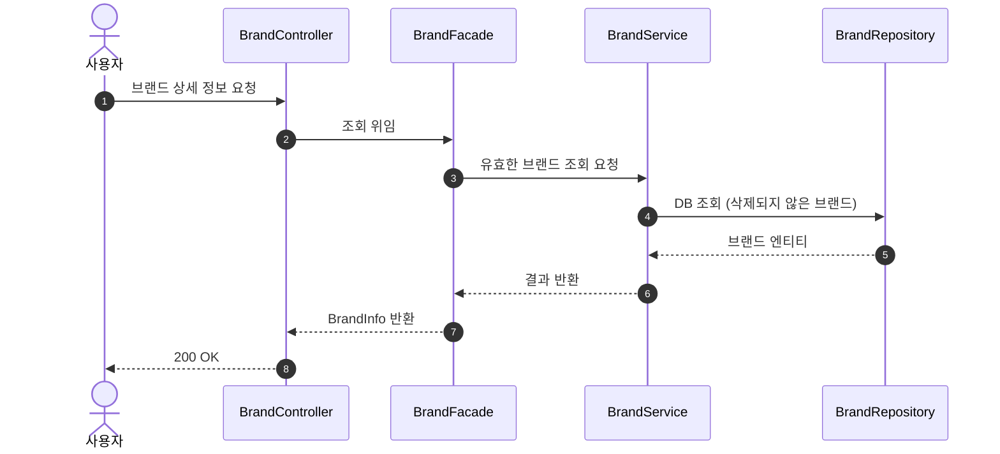
```mermaid
sequenceDiagram
    autonumber
    actor User as 사용자
    participant C as BrandController
    participant F as BrandFacade
    participant S as BrandService
    participant R as BrandRepository
    User ->> C: 브랜드 상세 정보 요청
    C ->> F: 조회 위임
    F ->> S: 유효한 브랜드 조회 요청
    S ->> R: DB 조회 (삭제되지 않은 브랜드)
    R -->> S: 브랜드 엔티티
    S -->> F: 결과 반환
    F -->> C: BrandInfo 반환
    C -->> User: 200 OK
```

### 1.2 상품 목록 조회

**API:** `GET /api/v1/products` — 인증 불필요

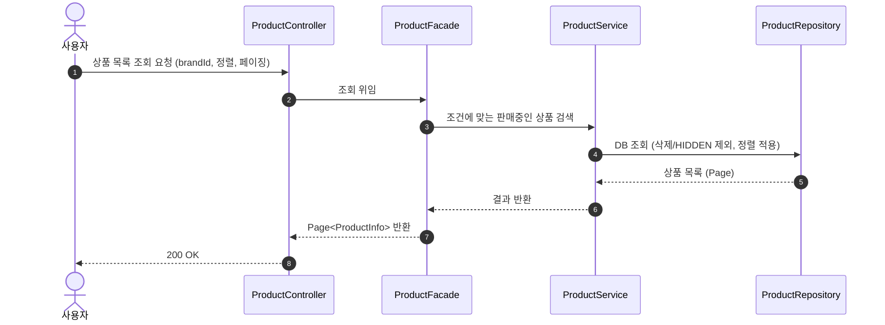
```mermaid
sequenceDiagram
    autonumber
    actor User as 사용자
    participant C as ProductController
    participant F as ProductFacade
    participant S as ProductService
    participant R as ProductRepository
    User ->> C: 상품 목록 조회 요청 (brandId, 정렬, 페이징)
    C ->> F: 조회 위임
    F ->> S: 조건에 맞는 판매중인 상품 검색
    S ->> R: DB 조회 (삭제/HIDDEN 제외, 정렬 적용)
    R -->> S: 상품 목록 (Page)
    S -->> F: 결과 반환
    F -->> C: Page<ProductInfo> 반환
    C -->> User: 200 OK
```

#### 참고

- 필터 조건: `deletedAt IS NULL AND status != 'HIDDEN'`, brandId 선택적 필터
- 응답에 페이징 메타데이터 포함: content, totalElements, totalPages, number, size

### 1.3 상품 상세 조회 (Cross-Domain)

상품 정보와 해당 브랜드 정보를 조합하여 응답하는 흐름이다.

**API:** `GET /api/v1/products/{productId}` — 인증 불필요

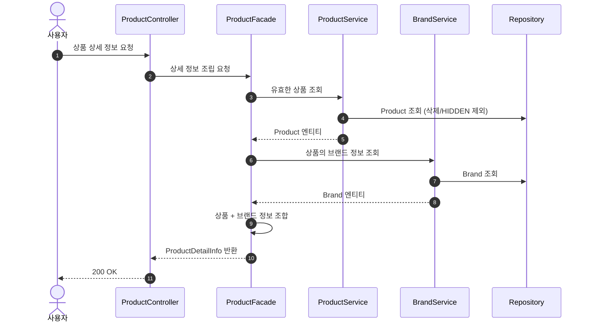
```mermaid
sequenceDiagram
    autonumber
    actor User as 사용자
    participant C as ProductController
    participant F as ProductFacade
    participant PS as ProductService
    participant BS as BrandService
    participant R as Repository
    User ->> C: 상품 상세 정보 요청
    C ->> F: 상세 정보 조립 요청
    F ->> PS: 유효한 상품 조회
    PS ->> R: Product 조회 (삭제/HIDDEN 제외)
    PS -->> F: Product 엔티티
    F ->> BS: 상품의 브랜드 정보 조회
    BS ->> R: Brand 조회
    BS -->> F: Brand 엔티티
    F ->> F: 상품 + 브랜드 정보 조합
    F -->> C: ProductDetailInfo 반환
    C -->> User: 200 OK
```

---

## 2. 브랜드 & 상품 — 어드민 API

### 2.1 브랜드 목록 조회

**API:** `GET /api-admin/v1/brands` — LDAP 인증

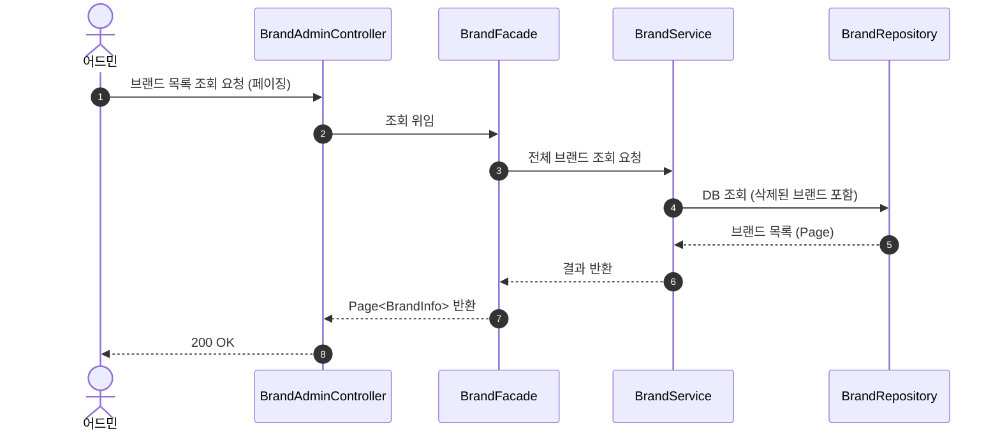
```mermaid
sequenceDiagram
    autonumber
    actor Admin as 어드민
    participant C as BrandAdminController
    participant F as BrandFacade
    participant S as BrandService
    participant R as BrandRepository
    Admin ->> C: 브랜드 목록 조회 요청 (페이징)
    C ->> F: 조회 위임
    F ->> S: 전체 브랜드 조회 요청
    S ->> R: DB 조회 (삭제된 브랜드 포함)
    R -->> S: 브랜드 목록 (Page)
    S -->> F: 결과 반환
    F -->> C: Page<BrandInfo> 반환
    C -->> Admin: 200 OK
```

#### 참고

- 어드민 목록 조회는 삭제된 브랜드 포함 (필터 없음)

### 2.2 브랜드 상세 조회

**API:** `GET /api-admin/v1/brands/{brandId}` — LDAP 인증

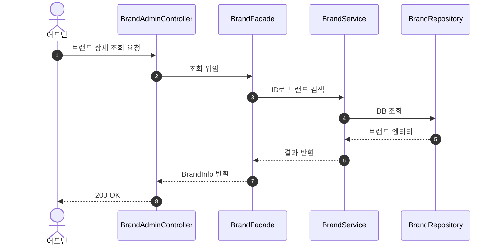
```mermaid
sequenceDiagram
    autonumber
    actor Admin as 어드민
    participant C as BrandAdminController
    participant F as BrandFacade
    participant S as BrandService
    participant R as BrandRepository
    Admin ->> C: 브랜드 상세 조회 요청
    C ->> F: 조회 위임
    F ->> S: ID로 브랜드 검색
    S ->> R: DB 조회
    R -->> S: 브랜드 엔티티
    S -->> F: 결과 반환
    F -->> C: BrandInfo 반환
    C -->> Admin: 200 OK
```

#### 참고

- 어드민은 삭제된 브랜드도 조회 가능 (삭제 상태 확인 목적)

### 2.3 브랜드 등록

**API:** `POST /api-admin/v1/brands` — LDAP 인증

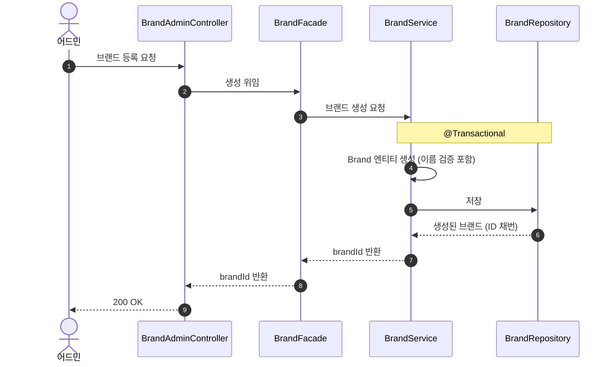
```mermaid
sequenceDiagram
    autonumber
    actor Admin as 어드민
    participant C as BrandAdminController
    participant F as BrandFacade
    participant S as BrandService
    participant R as BrandRepository
    Admin ->> C: 브랜드 등록 요청
    C ->> F: 생성 위임
    F ->> S: 브랜드 생성 요청
    Note over S, R: @Transactional
    S ->> S: Brand 엔티티 생성 (이름 검증 포함)
    S ->> R: 저장
    R -->> S: 생성된 브랜드 (ID 채번)
    S -->> F: brandId 반환
    F -->> C: brandId 반환
    C -->> Admin: 200 OK
```

### 2.4 브랜드 수정

**API:** `PUT /api-admin/v1/brands/{brandId}` — LDAP 인증

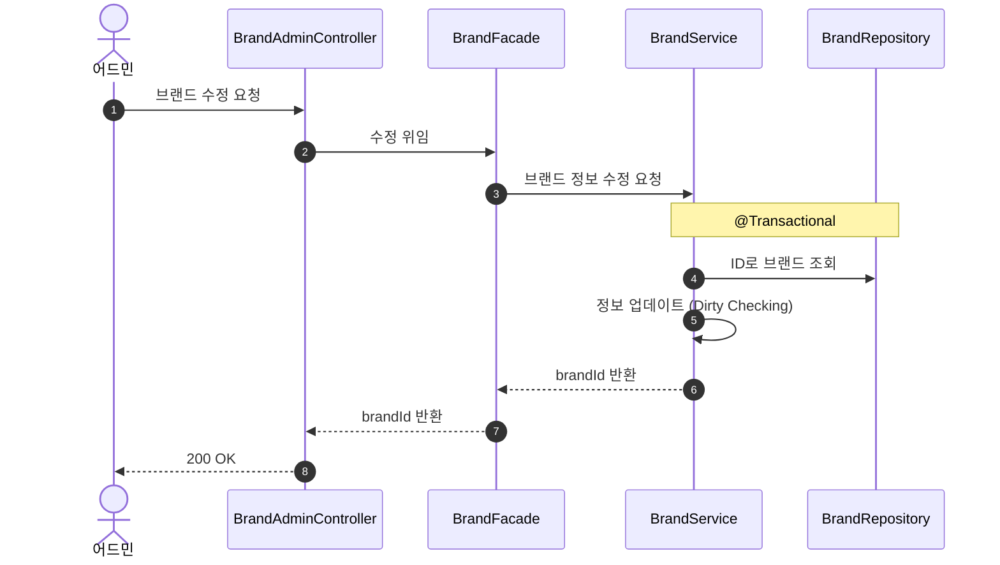
```mermaid
sequenceDiagram
    autonumber
    actor Admin as 어드민
    participant C as BrandAdminController
    participant F as BrandFacade
    participant S as BrandService
    participant R as BrandRepository
    Admin ->> C: 브랜드 수정 요청
    C ->> F: 수정 위임
    F ->> S: 브랜드 정보 수정 요청
    Note over S, R: @Transactional
    S ->> R: ID로 브랜드 조회
    S ->> S: 정보 업데이트 (Dirty Checking)
    S -->> F: brandId 반환
    F -->> C: brandId 반환
    C -->> Admin: 200 OK
```

### 2.5 브랜드 삭제 (Cascade Soft Delete)

브랜드 삭제 시 소속 상품까지 일괄 soft delete되는 cross-domain 트랜잭션이다.

**API:** `DELETE /api-admin/v1/brands/{brandId}` — LDAP 인증

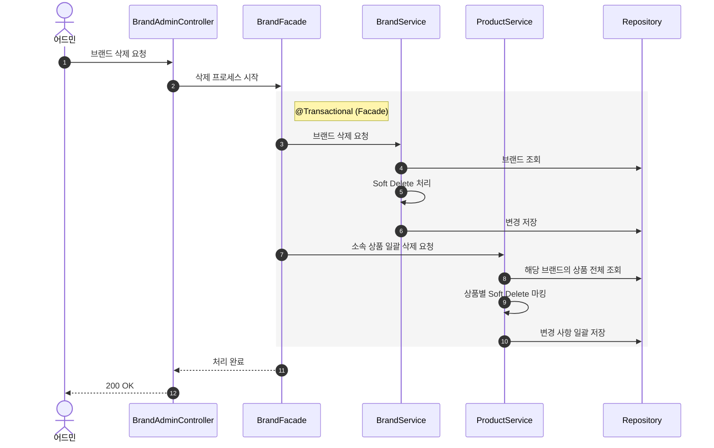
```mermaid
sequenceDiagram
    autonumber
    actor Admin as 어드민
    participant C as BrandAdminController
    participant F as BrandFacade
    participant BS as BrandService
    participant PS as ProductService
    participant R as Repository
    Admin ->> C: 브랜드 삭제 요청
    C ->> F: 삭제 프로세스 시작

    rect rgb(245, 245, 245)
        Note right of F: @Transactional (Facade)
        F ->> BS: 브랜드 삭제 요청
        BS ->> R: 브랜드 조회
        BS ->> BS: Soft Delete 처리
        BS ->> R: 변경 저장
        F ->> PS: 소속 상품 일괄 삭제 요청
        PS ->> R: 해당 브랜드의 상품 전체 조회
        PS ->> PS: 상품별 Soft Delete 마킹
        PS ->> R: 변경 사항 일괄 저장
    end

    F -->> C: 처리 완료
    C -->> Admin: 200 OK
```

#### 참고

- BaseEntity.delete()는 이미 삭제 상태면 무시 (멱등)
- 기존 주문의 OrderItem 스냅샷은 Product 삭제와 무관하게 보존

### 2.6 상품 목록 조회

**API:** `GET /api-admin/v1/products` — LDAP 인증

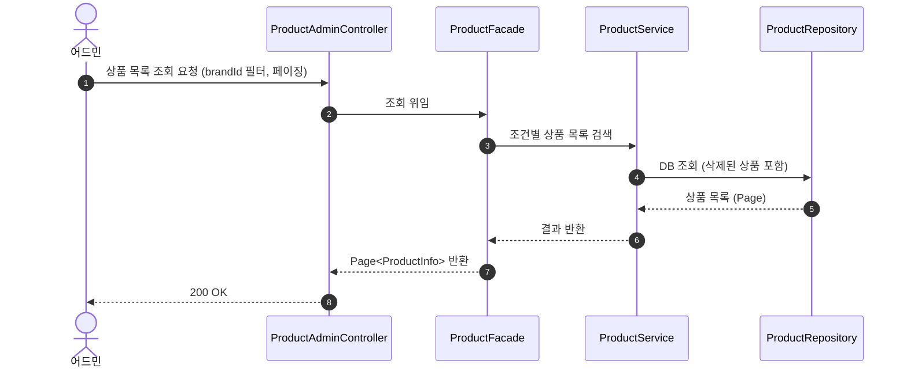
```mermaid
sequenceDiagram
    autonumber
    actor Admin as 어드민
    participant C as ProductAdminController
    participant F as ProductFacade
    participant S as ProductService
    participant R as ProductRepository
    Admin ->> C: 상품 목록 조회 요청 (brandId 필터, 페이징)
    C ->> F: 조회 위임
    F ->> S: 조건별 상품 목록 검색
    S ->> R: DB 조회 (삭제된 상품 포함)
    R -->> S: 상품 목록 (Page)
    S -->> F: 결과 반환
    F -->> C: Page<ProductInfo> 반환
    C -->> Admin: 200 OK
```

#### 참고

- 어드민 목록 조회는 삭제된 상품 포함 (필터 없음)

### 2.7 상품 상세 조회

**API:** `GET /api-admin/v1/products/{productId}` — LDAP 인증

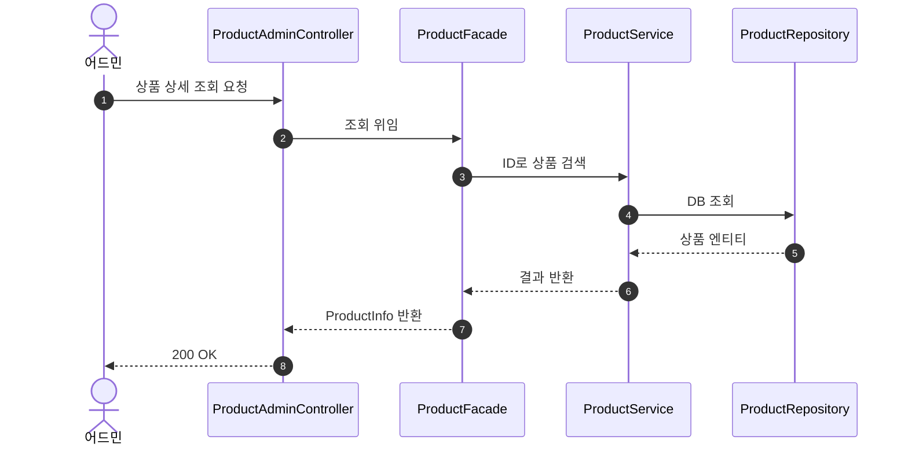
```mermaid
sequenceDiagram
    autonumber
    actor Admin as 어드민
    participant C as ProductAdminController
    participant F as ProductFacade
    participant S as ProductService
    participant R as ProductRepository
    Admin ->> C: 상품 상세 조회 요청
    C ->> F: 조회 위임
    F ->> S: ID로 상품 검색
    S ->> R: DB 조회
    R -->> S: 상품 엔티티
    S -->> F: 결과 반환
    F -->> C: ProductInfo 반환
    C -->> Admin: 200 OK
```

#### 참고

- 어드민은 삭제된 상품도 조회 가능 (삭제 상태 확인 목적)

### 2.8 상품 등록 (Cross-Domain Validation)

상품 등록 시 타 도메인(브랜드)의 유효성을 검증해야 하는 흐름이다.

**API:** `POST /api-admin/v1/products` — LDAP 인증

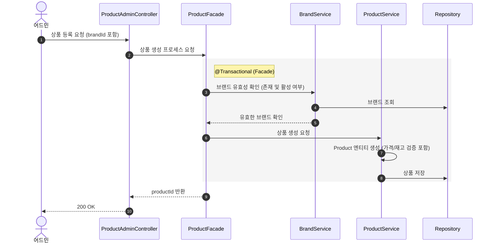
```mermaid
sequenceDiagram
    autonumber
    actor Admin as 어드민
    participant C as ProductAdminController
    participant F as ProductFacade
    participant BS as BrandService
    participant PS as ProductService
    participant R as Repository
    Admin ->> C: 상품 등록 요청 (brandId 포함)
    C ->> F: 상품 생성 프로세스 요청

    rect rgb(245, 245, 245)
        Note right of F: @Transactional (Facade)
        F ->> BS: 브랜드 유효성 확인 (존재 및 활성 여부)
        BS ->> R: 브랜드 조회
        BS -->> F: 유효한 브랜드 확인
        F ->> PS: 상품 생성 요청
        PS ->> PS: Product 엔티티 생성 (가격/재고 검증 포함)
        PS ->> R: 상품 저장
    end

    F -->> C: productId 반환
    C -->> Admin: 200 OK
```

### 2.9 상품 수정

**API:** `PUT /api-admin/v1/products/{productId}` — LDAP 인증

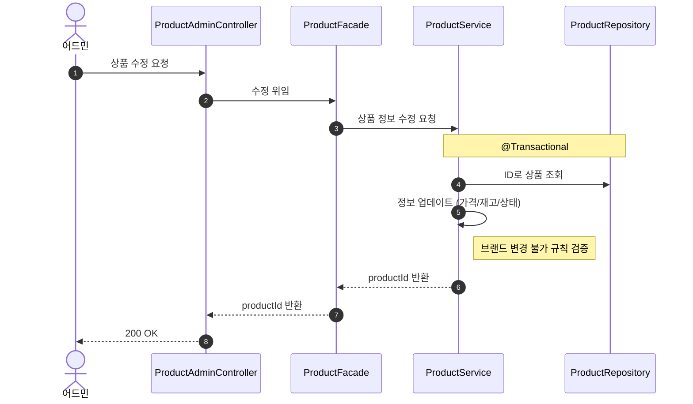
```mermaid
sequenceDiagram
    autonumber
    actor Admin as 어드민
    participant C as ProductAdminController
    participant F as ProductFacade
    participant S as ProductService
    participant R as ProductRepository
    Admin ->> C: 상품 수정 요청
    C ->> F: 수정 위임
    F ->> S: 상품 정보 수정 요청
    Note over S, R: @Transactional
    S ->> R: ID로 상품 조회
    S ->> S: 정보 업데이트 (가격/재고/상태)
    Note right of S: 브랜드 변경 불가 규칙 검증
    S -->> F: productId 반환
    F -->> C: productId 반환
    C -->> Admin: 200 OK
```

### 2.10 상품 삭제

**API:** `DELETE /api-admin/v1/products/{productId}` — LDAP 인증

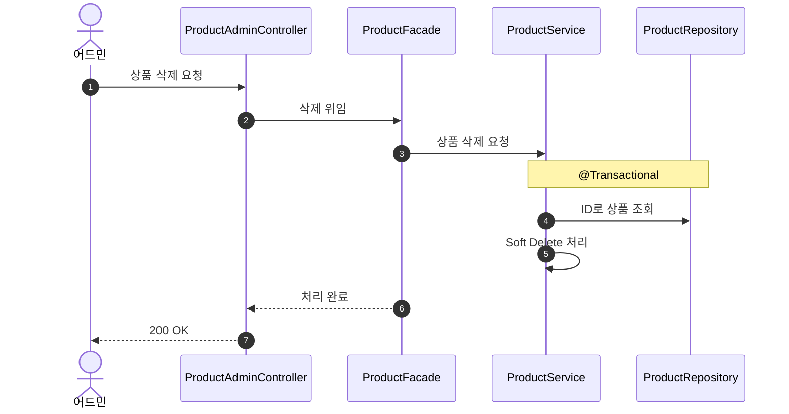
```mermaid
sequenceDiagram
    autonumber
    actor Admin as 어드민
    participant C as ProductAdminController
    participant F as ProductFacade
    participant S as ProductService
    participant R as ProductRepository
    Admin ->> C: 상품 삭제 요청
    C ->> F: 삭제 위임
    F ->> S: 상품 삭제 요청
    Note over S, R: @Transactional
    S ->> R: ID로 상품 조회
    S ->> S: Soft Delete 처리
    F -->> C: 처리 완료
    C -->> Admin: 200 OK
```

#### 참고

- BaseEntity.delete()는 이미 삭제 상태면 무시 (멱등)

---

## 3. 좋아요

### 3.1 좋아요 등록 (멱등성)

**API:** `POST /api/v1/products/{productId}/likes` — 인증 필요

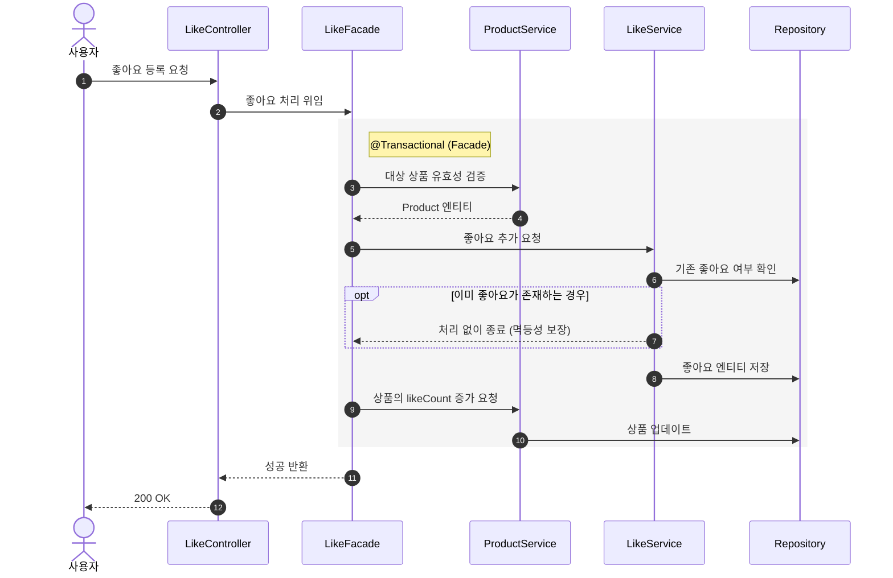
```mermaid
sequenceDiagram
    autonumber
    actor User as 사용자
    participant C as LikeController
    participant F as LikeFacade
    participant PS as ProductService
    participant LS as LikeService
    participant R as Repository
    User ->> C: 좋아요 등록 요청
    C ->> F: 좋아요 처리 위임

    rect rgb(245, 245, 245)
        Note right of F: @Transactional (Facade)
        F ->> PS: 대상 상품 유효성 검증
        PS -->> F: Product 엔티티
        F ->> LS: 좋아요 추가 요청
        LS ->> R: 기존 좋아요 여부 확인

        opt 이미 좋아요가 존재하는 경우
            LS -->> F: 처리 없이 종료 (멱등성 보장)
        end

        LS ->> R: 좋아요 엔티티 저장
        F ->> PS: 상품의 likeCount 증가 요청
        PS ->> R: 상품 업데이트
    end

    F -->> C: 성공 반환
    C -->> User: 200 OK
```

### 3.2 좋아요 취소 (멱등성 & Hard Delete)

좋아요 취소는 **물리적 삭제(Hard Delete)**를 수행하며, 삭제된 상품에 대해서도 멱등하게 처리된다.

**API:** `DELETE /api/v1/products/{productId}/likes` — 인증 필요

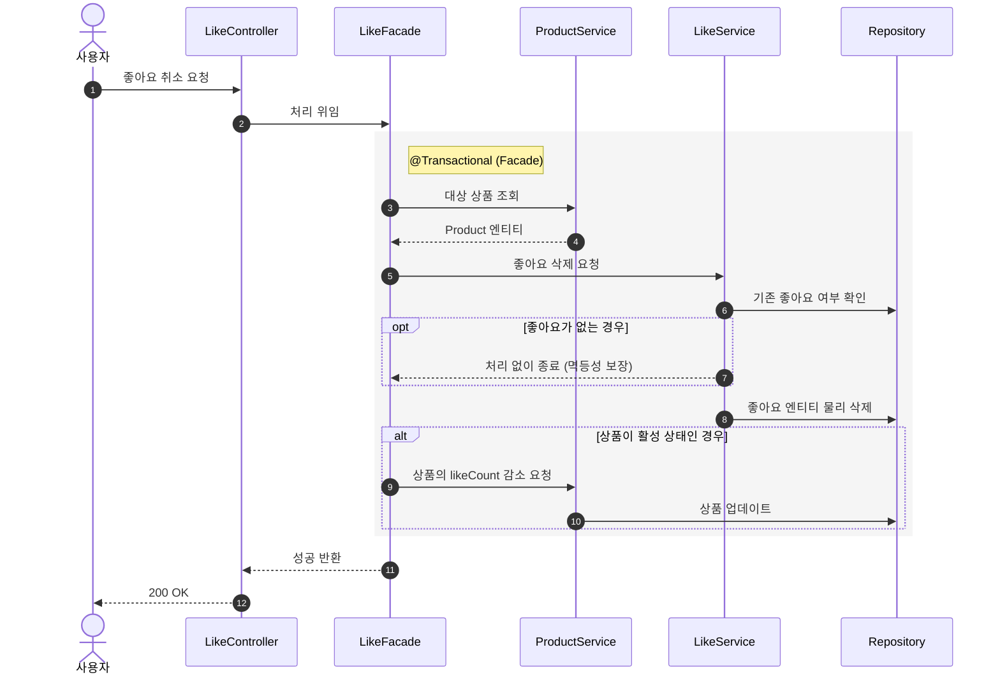
```mermaid
sequenceDiagram
    autonumber
    actor User as 사용자
    participant C as LikeController
    participant F as LikeFacade
    participant PS as ProductService
    participant LS as LikeService
    participant R as Repository
    User ->> C: 좋아요 취소 요청
    C ->> F: 처리 위임

    rect rgb(245, 245, 245)
        Note right of F: @Transactional (Facade)
        F ->> PS: 대상 상품 조회
        PS -->> F: Product 엔티티
        F ->> LS: 좋아요 삭제 요청
        LS ->> R: 기존 좋아요 여부 확인

        opt 좋아요가 없는 경우
            LS -->> F: 처리 없이 종료 (멱등성 보장)
        end

        LS ->> R: 좋아요 엔티티 물리 삭제

        alt 상품이 활성 상태인 경우
            F ->> PS: 상품의 likeCount 감소 요청
            PS ->> R: 상품 업데이트
        end
    end

    F -->> C: 성공 반환
    C -->> User: 200 OK
```

#### 참고

- 삭제된 상품의 likeCount는 갱신하지 않음 (의미 없는 카운트 변경 방지)

### 3.3 내 좋아요 목록 조회 (Data Assembly)

서로 다른 도메인(Like, Product)의 데이터를 조합하는 흐름이다.

**API:** `GET /api/v1/users/likes` — 인증 필요 (`@AuthUser`)

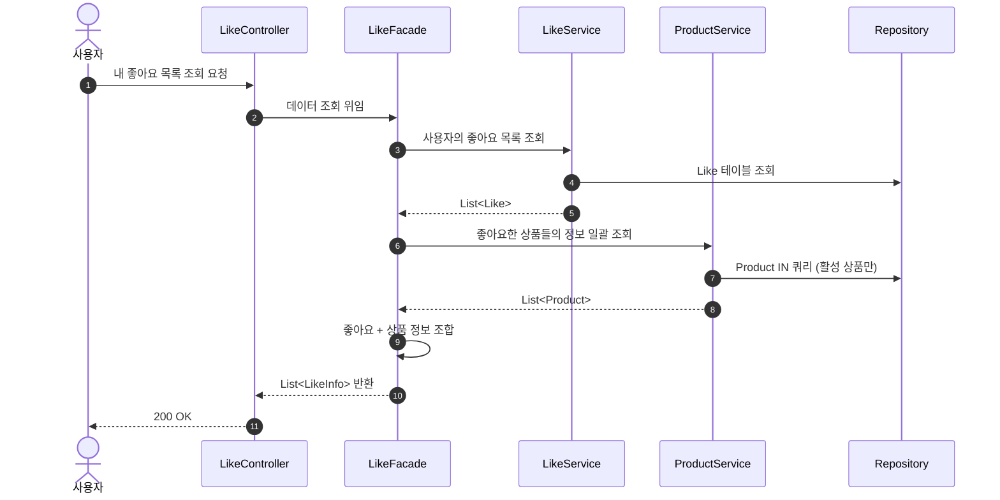
```mermaid
sequenceDiagram
    autonumber
    actor User as 사용자
    participant C as LikeController
    participant F as LikeFacade
    participant LS as LikeService
    participant PS as ProductService
    participant R as Repository
    User ->> C: 내 좋아요 목록 조회 요청
    C ->> F: 데이터 조회 위임
    F ->> LS: 사용자의 좋아요 목록 조회
    LS ->> R: Like 테이블 조회
    LS -->> F: List<Like>
    F ->> PS: 좋아요한 상품들의 정보 일괄 조회
    PS ->> R: Product IN 쿼리 (활성 상품만)
    PS -->> F: List<Product>
    F ->> F: 좋아요 + 상품 정보 조합
    F -->> C: List<LikeInfo> 반환
    C -->> User: 200 OK
```

#### 참고

- URL에 userId가 없으므로 타인 좋아요 조회 불가 (`@AuthUser`로 본인만 주입)
- 쿼리 총 2회: Like 조회 1회 + Product IN 조회 1회 (N+1 방지)
- Facade에서 Like + Product를 조합하여 LikeInfo 생성

---

## 4. 주문 — 대고객 API

### 4.1 주문 생성 (Cross-Domain Transaction)

주문 생성은 **상품 검증 → 재고 차감 → 주문 저장**이 원자적으로 이루어져야 하는 핵심 트랜잭션이다.

**API:** `POST /api/v1/orders` — 인증 필요

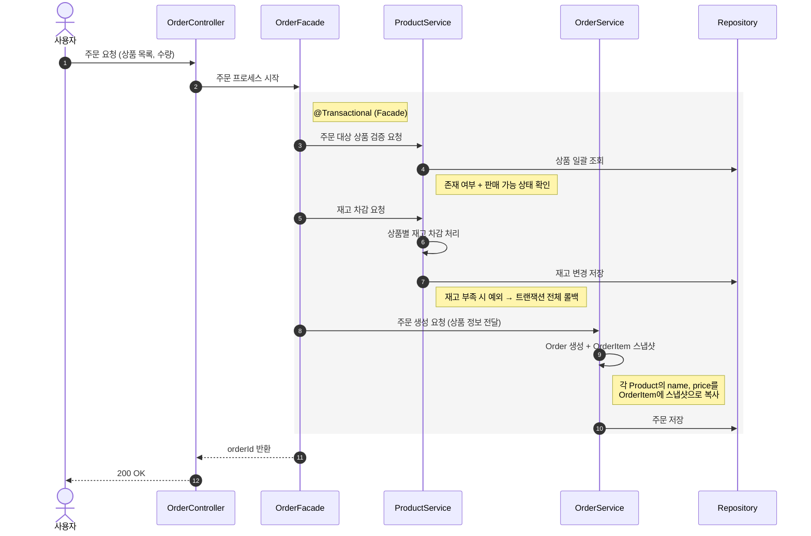
```mermaid
sequenceDiagram
    autonumber
    actor User as 사용자
    participant C as OrderController
    participant F as OrderFacade
    participant PS as ProductService
    participant OS as OrderService
    participant R as Repository
    User ->> C: 주문 요청 (상품 목록, 수량)
    C ->> F: 주문 프로세스 시작

    rect rgb(245, 245, 245)
        Note right of F: @Transactional (Facade)
    %% 1단계: 상품 유효성 확인
        F ->> PS: 주문 대상 상품 검증 요청
        PS ->> R: 상품 일괄 조회
        Note right of PS: 존재 여부 + 판매 가능 상태 확인
    %% 2단계: 재고 차감
        F ->> PS: 재고 차감 요청
        PS ->> PS: 상품별 재고 차감 처리
        PS ->> R: 재고 변경 저장
        Note right of PS: 재고 부족 시 예외 → 트랜잭션 전체 롤백
    %% 3단계: 주문 생성
        F ->> OS: 주문 생성 요청 (상품 정보 전달)
        OS ->> OS: Order 생성 + OrderItem 스냅샷
        Note right of OS: 각 Product의 name, price를<br/>OrderItem에 스냅샷으로 복사
        OS ->> R: 주문 저장
    end

    F -->> C: orderId 반환
    C -->> User: 200 OK
```

#### 참고

- 재고 부족 시 트랜잭션 롤백으로 이전 차감분 모두 원복
- OrderItem은 주문 시점의 상품 정보(이름, 가격)를 스냅샷으로 보존

### 4.2 주문 목록 조회 (기간 필터링)

**API:** `GET /api/v1/orders` — 인증 필요

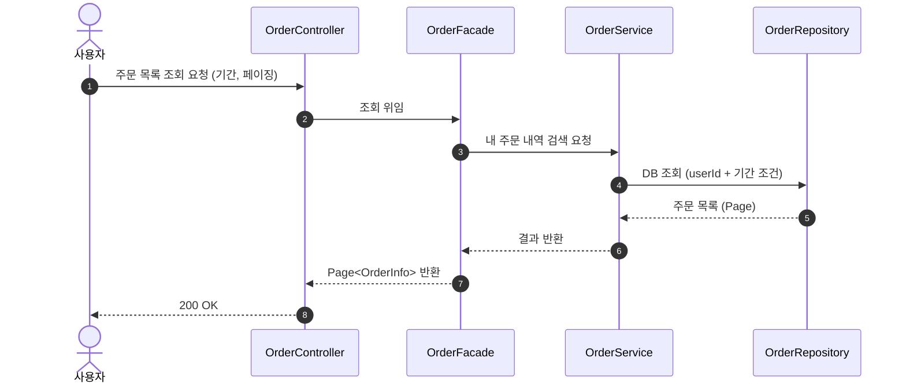
```mermaid
sequenceDiagram
    autonumber
    actor User as 사용자
    participant C as OrderController
    participant F as OrderFacade
    participant OS as OrderService
    participant R as OrderRepository
    User ->> C: 주문 목록 조회 요청 (기간, 페이징)
    C ->> F: 조회 위임
    F ->> OS: 내 주문 내역 검색 요청
    OS ->> R: DB 조회 (userId + 기간 조건)
    R -->> OS: 주문 목록 (Page)
    OS -->> F: 결과 반환
    F -->> C: Page<OrderInfo> 반환
    C -->> User: 200 OK
```

#### 참고

- startedAt/endedAt 미입력 시 기본값: 최근 1달

### 4.3 주문 상세 조회

**API:** `GET /api/v1/orders/{orderId}` — 인증 필요

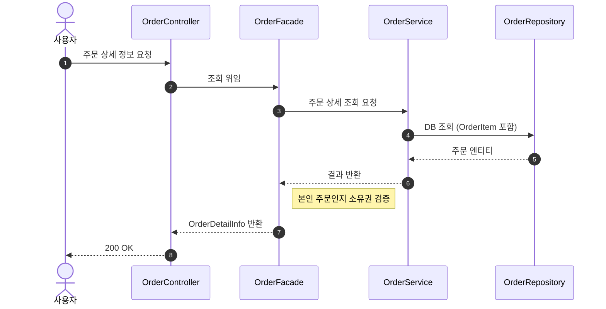
```mermaid
sequenceDiagram
    autonumber
    actor User as 사용자
    participant C as OrderController
    participant F as OrderFacade
    participant OS as OrderService
    participant R as OrderRepository
    User ->> C: 주문 상세 정보 요청
    C ->> F: 조회 위임
    F ->> OS: 주문 상세 조회 요청
    OS ->> R: DB 조회 (OrderItem 포함)
    R -->> OS: 주문 엔티티
    OS -->> F: 결과 반환
    Note right of F: 본인 주문인지 소유권 검증
    F -->> C: OrderDetailInfo 반환
    C -->> User: 200 OK
```

#### 참고

- 타인 주문 접근 시 403이 아닌 404 반환 (주문 존재 여부 노출 방지)

---

## 5. 주문 — 어드민 API

### 5.1 전체 주문 목록 조회

**API:** `GET /api-admin/v1/orders` — LDAP 인증

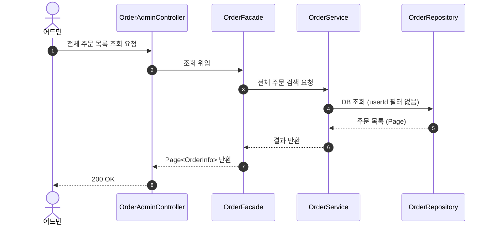
```mermaid
sequenceDiagram
    autonumber
    actor Admin as 어드민
    participant C as OrderAdminController
    participant F as OrderFacade
    participant OS as OrderService
    participant R as OrderRepository
    Admin ->> C: 전체 주문 목록 조회 요청
    C ->> F: 조회 위임
    F ->> OS: 전체 주문 검색 요청
    OS ->> R: DB 조회 (userId 필터 없음)
    R -->> OS: 주문 목록 (Page)
    OS -->> F: 결과 반환
    F -->> C: Page<OrderInfo> 반환
    C -->> Admin: 200 OK
```

### 5.2 주문 상세 조회

**API:** `GET /api-admin/v1/orders/{orderId}` — LDAP 인증

```mermaid
sequenceDiagram
    autonumber
    actor Admin as 어드민
    participant C as OrderAdminController
    participant F as OrderFacade
    participant OS as OrderService
    participant R as OrderRepository
    Admin ->> C: 주문 상세 조회 요청
    C ->> F: 조회 위임
    F ->> OS: 주문 ID로 검색 요청
    OS ->> R: DB 조회
    R -->> OS: 주문 엔티티 (OrderItem 포함)
    OS -->> F: 결과 반환
    F -->> C: OrderDetailInfo 반환
    C -->> Admin: 200 OK
```

#### 참고

- 어드민은 소유권 검증 없이 모든 주문 조회 가능
