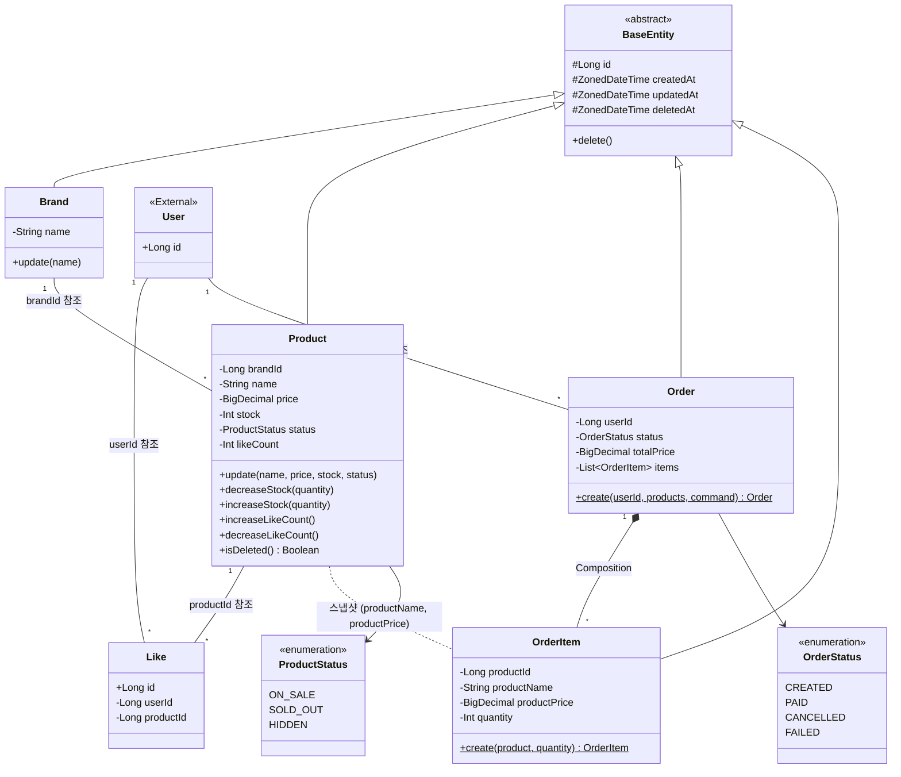
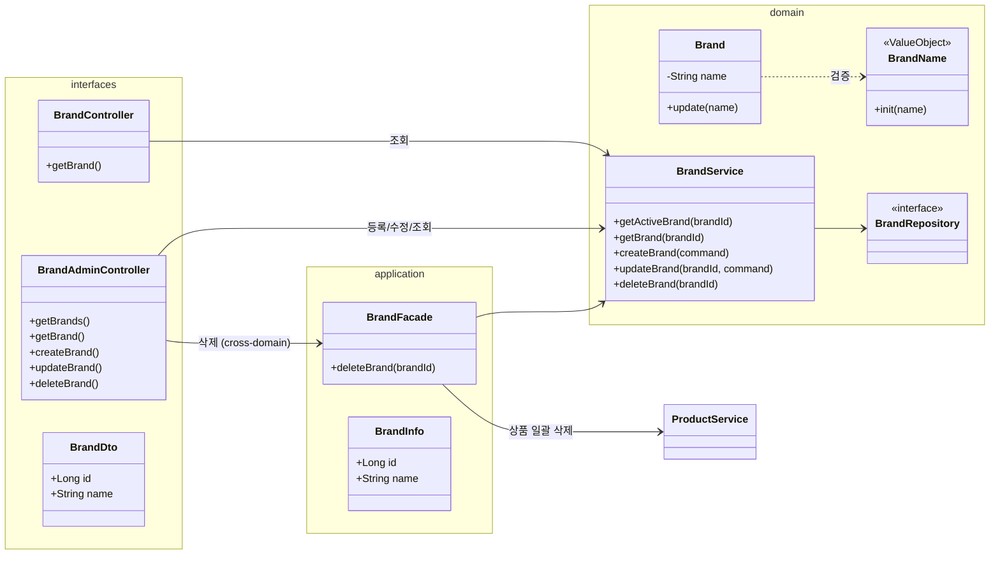
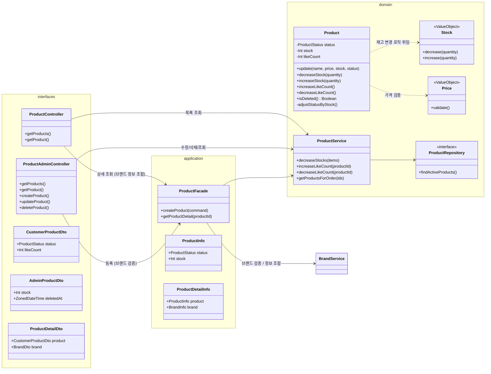
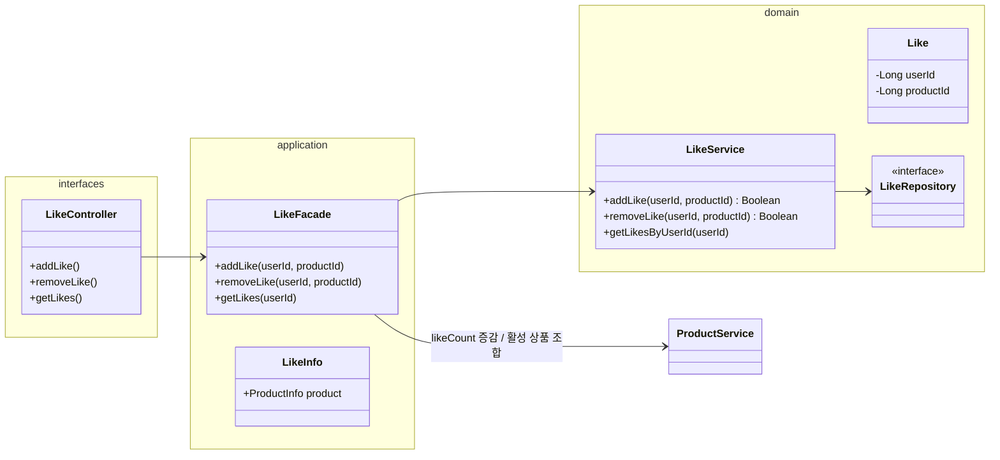
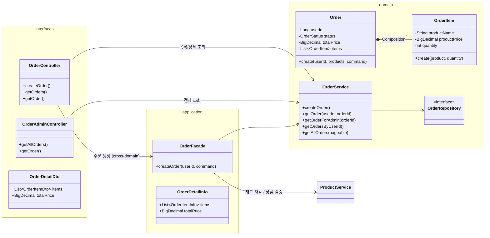
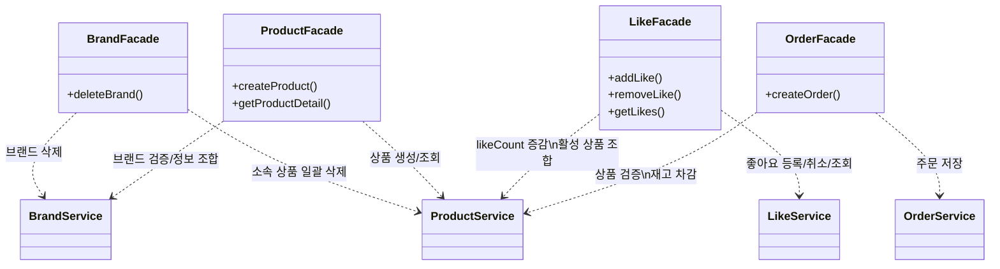
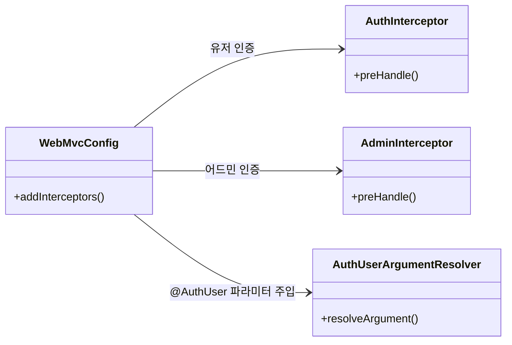

# 클래스 다이어그램

도메인 객체의 책임, 의존 방향, Entity/VO 구분을 Mermaid 클래스 다이어그램으로 정리한다.
**단순 Getter/Setter와 모든 필드 나열은 생략**하고, 핵심 비즈니스 로직과 아키텍처 구조 위주로 기술한다.

---

## 1. 도메인 모델 전체 관계도 (Entity Relationship)

시스템의 뼈대가 되는 4개 도메인(Brand, Product, Like, Order)의 엔티티 간 관계와 참조 방식을 정의한다.

---

## 2. Brand 도메인

Brand는 단순하지만, **삭제 시 Product로의 전파(Cascade)** 가 중요한 도메인이다.
어드민(Admin)과 사용자(User)의 진입점이 분리되어 있다.

### 핵심 포인트

- **Facade의 역할:** `deleteBrand()`은 `BrandService`와 `ProductService`를 조율하는 cross-domain 작업이므로 Facade를 사용한다. 나머지 CRUD는 Controller가 Service를 직접 호출한다.
- **VO 사용:** `BrandName` VO를 통해 이름 생성 규칙(빈 값 불가 등)을 캡슐화한다.
- **getActiveBrand vs getBrand:** 대고객 API는 `getActiveBrand`(삭제 상태 체크), 어드민은 `getBrand`(삭제 포함)을 사용한다.

---

## 3. Product 도메인

가장 복잡한 도메인으로, **재고(Stock), 상태(Status), 가격(Price)** 의 비즈니스 규칙이 집중되어 있다.
어드민용 DTO와 고객용 DTO가 분리된다.

### 핵심 포인트

- **adjustStatusByStock():** `decreaseStock()`/`increaseStock()`/`update()` 내부에서 호출. 재고가 0이 되면 `SOLD_OUT`, 0에서 양수가 되면
  `ON_SALE`로 자동 전환. 단, `HIDDEN`이 명시된 경우 자동 전이를 적용하지 않는다 (어드민의 HIDDEN 설정이 우선).
- **Facade 사용 기준:** `createProduct()`은 브랜드 유효성 검증(BrandService), `getProductDetail()`은 브랜드 정보 조합(BrandService)이 필요하므로 Facade를 사용한다. 나머지 CRUD와 어드민 조회는 Controller가 Service를 직접 호출한다.
- **DTO 분리:** 대고객용 `CustomerProductDto`는 재고 수량(stock)과 삭제일(deletedAt)을 노출하지 않는다. `ProductDetailDto`는 대고객 상품 상세 조회 시
  Product + Brand 정보를 조합한 응답이다.

---

## 4. Like 도메인

**사용자-상품 간의 유일성(Unique)** 과 Product 도메인과의 협력이 핵심이다.
어드민 기능 없이 사용자 기능만 존재한다.

### 핵심 포인트

- **Cross-Domain Orchestration:** `LikeFacade`는 `LikeService`로 좋아요를 등록/취소한 후, `ProductService`를 호출하여 상품의 `likeCount`를
  증감시킨다. 목록 조회 시에도 `ProductService`로 활성 상품 정보를 조합한다.
- **BaseEntity 미상속:** 단순 매핑 테이블 성격이므로 이력 관리 필드(created/updatedAt) 없이 ID와 관계 필드만 가진다. 취소 시 하드 딜리트(물리 삭제).
- **Boolean 반환:** `addLike()`/`removeLike()`는 실제 변경이 발생했으면 `true`, 이미 존재/이미 없어서 early return이면 `false`. Facade는 이 값으로
  `likeCount` 증감 여부를 결정한다.
- **삭제된 상품의 좋아요 취소:** `removeLike()` 시 상품이 삭제 상태(`deletedAt != null`)이면 Like 레코드만 삭제하고 `ProductService.decreaseLikeCount()`를 호출하지 않는다. 삭제된 상품의 likeCount를 갱신하는 것은 무의미하며, 복구 시 재집계로 해결한다.

---

## 5. Order 도메인

주문 생성 시점의 스냅샷 저장과 Order-OrderItem의 합성 관계가 핵심이다.
어드민은 전체 주문을 조회할 수 있다.

### 핵심 포인트

- **Composition (*--):** `OrderItem`은 `Order` 없이는 존재할 수 없으며, 생명주기를 같이한다. JPA
  `@OneToMany(cascade = ALL, orphanRemoval = true)` + `@JoinColumn`으로 구현.
- **정적 팩토리 메서드:** `Order.create()` 내에서 `OrderItem`들을 생성하고, 이 시점에 Product의 가격과 이름을 스냅샷으로 복사한다.
- **totalPrice (반정규화):** `Order.create()` 시 items의 `productPrice * quantity`를 합산하여 저장. 목록 조회 시 OrderItem을 로딩하지 않고도 총액을
  제공한다.
- **Facade 사용 기준:** `createOrder()`만 ProductService(상품 검증 + 재고 차감)와 OrderService를 조율하므로 Facade를 사용한다. 조회 API는 Controller가 OrderService를 직접 호출한다.
- **소유권 검증:** 대고객 `getOrder(userId, orderId)`는 Service에서 소유권 검증. 어드민 `getOrderForAdmin(orderId)`는 검증 없이 조회.

---

## 6. Facade 레이어의 의존 관계 (Architecture View)

Facade는 2개 이상의 Service를 조율하는 cross-domain 작업에서만 사용한다. 1:1 단일 서비스 호출 시 Controller가 Service를 직접 호출한다.

---

## 7. 인증 레이어 구조

기존 인증 방식(User)과 신규 어드민 인증(Admin)이 공존한다.

---

## 8. Value Object 정리

| VO        | 소속 도메인  | 검증 규칙                      | 사용 시점                     |
|-----------|---------|----------------------------|---------------------------|
| BrandName | Brand   | 빈 값 불가                     | Brand 생성/수정 시 init에서 검증   |
| Price     | Product | BigDecimal >= 0            | Product 생성/수정 시 init에서 검증 |
| Stock     | Product | Int >= 0, decrease 시 부족 확인 | Product 생성/수정/재고차감 시 검증   |

> VO는 Entity 필드로 저장되지 않는다. Entity 필드는 기본 타입(String, BigDecimal, Int)을 유지하되, 생성/변경 시점에 VO를 통해 검증한다.

---

## 9. 상세 설계 원칙 및 결정 사유 (Design Principles)

1. **ID 참조 방식 (Loose Coupling)**
    - **결정**: 객체 간 연관 관계(`@ManyToOne`)를 맺지 않고, **ID(Long) 값만 참조**한다.
    - **이유**: 도메인 간의 강한 결합을 끊어 추후 MSA 분리를 용이하게 하고, 트랜잭션 범위를 명확히 제어하기 위함이다.

2. **Facade 패턴의 역할 (Cross-Domain Orchestration)**
    - **결정**: 단일 서비스 호출(1:1)인 경우 Controller가 Service를 직접 호출한다. 2개 이상의 서비스를 조율하는 경우에만 Facade를 사용한다.
    - **이유**: 1:1 pass-through Facade는 불필요한 레이어를 추가할 뿐이다. Facade는 도메인 간 흐름 제어가 실제로 필요한 경우에만 그 가치를 발휘한다.

3. **Product 엔티티의 책임 범위 (Rich Domain Model)**
    - **결정**: `stock`, `status`, `likeCount` 등 변경 성격이 다른 필드들을 `Product` 하나의 엔티티에 둔다.
    - **이유 (Trade-off)**: 현재 단계에서는 엔티티 분리보다 복잡도가 더 크다. 추후 트래픽 증가 시 Stock 분리나 Redis 캐싱을 고려한다.

4. **VO (Value Object) 적극 도입**
    - **결정**: `Stock`, `Price`, `BrandName` 등을 원시 타입 대신 객체로 포장한다.
    - **이유**: 검증 로직을 도메인 객체 내부에 캡슐화하여 안전성을 보장하고 코드 중복을 방지한다.

5. **주문 스냅샷 (Snapshot)**
    - **결정**: `OrderItem`은 Product를 참조하는 대신 `productName`, `productPrice` 값을 별도 컬럼으로 저장한다.
    - **이유**: 상품 정보가 추후 변경/삭제되어도, 주문 당시의 데이터 불변성을 보장해야 한다.

6. **Soft Delete 조회 전략**
    - **결정**: Hibernate `@Where(clause = "deleted_at IS NULL")`을 사용하지 않는다.
    - **이유**: 어드민 기능에서 삭제된 데이터도 조회해야 한다. 메서드마다 명시적으로 조건을 추가하여 조회 유연성을 확보한다.

7. **DTO 분리 (Security)**
    - **결정**: 동일한 Product라도 `CustomerProductDto`와 `AdminProductDto`로 분리한다.
    - **이유**: 대고객 API에서는 재고 수량이나 내부 관리 필드(deletedAt)를 노출하지 않아야 한다. Info 객체(application)는 공유하되, interfaces 레이어에서 액터별로 필요한
      필드만 노출한다.
