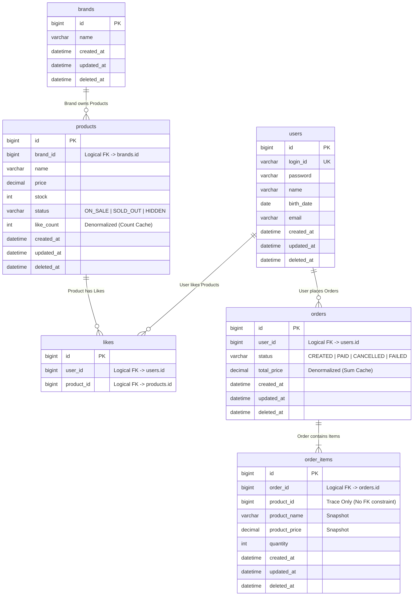

# ERD (Entity-Relationship Diagram)

영속성 구조를 정의한다. 도메인 엔티티와 VO가 실제 데이터베이스 스키마로 매핑되는 전략과 인덱스 계획을 포함한다.

---

## 1. 전체 ERD & 설계 원칙

### 1.1 설계 원칙 (Key Design Decisions)

1. **논리적 FK 사용 (No Physical FK)**
    * 확장성과 데드락 방지를 위해 물리적 Foreign Key 제약조건을 제거하고, 애플리케이션 레벨에서 참조 무결성을 관리한다.
    * `brands`, `products` 삭제 시 연관 데이터 처리는 애플리케이션의 Soft Delete 로직을 따른다.
2. **주문-상품 스냅샷 (Snapshot)**
    * `order_items`는 상품의 현재 상태(`products`)를 참조하지 않고, 주문 시점의 데이터(`product_name`, `product_price`)를 복제하여 저장한다.
    * 상품 정보가 변경되거나 삭제되어도 주문 이력의 무결성을 보장한다.
3. **반정규화 (Denormalization)**
    * 조회 성능 최적화를 위해 `orders.total_price`, `products.like_count` 등 집계 데이터를 컬럼으로 관리한다.
    * 데이터 정합성은 트랜잭션 범위 내 동기화로 보장한다.

### 1.2 Mermaid ERD

---

## 2. 스키마 상세 (Schema Details)

### 2.1 Core Domain (Products & Brands)

| 테이블          | 컬럼         | 타입            | 제약조건         | 설명                          |
|--------------|------------|---------------|--------------|-----------------------------|
| **brands**   | id         | BIGINT        | PK, Auto Inc |                             |
|              | name       | VARCHAR(255)  | NOT NULL     | 브랜드명 (VO: BrandName 빈 값 검증) |
| **products** | id         | BIGINT        | PK, Auto Inc |                             |
|              | brand_id   | BIGINT        | NOT NULL     | [논리FK] Brand 참조             |
|              | name       | VARCHAR(255)  | NOT NULL     | 상품명                         |
|              | price      | DECIMAL(19,2) | NOT NULL     | 상품 가격 (VO: Price >= 0)      |
|              | stock      | INT           | NOT NULL     | 재고 수량 (VO: Stock >= 0)      |
|              | status     | VARCHAR(20)   | NOT NULL     | 상품 상태 (`@Enumerated(STRING)` → VARCHAR 매핑) |
|              | like_count | INT           | NOT NULL     | [반정규화] 좋아요 수 캐싱             |

### 2.2 Order Domain

| 테이블             | 컬럼            | 타입            | 제약조건         | 설명                               |
|-----------------|---------------|---------------|--------------|----------------------------------|
| **orders**      | id            | BIGINT        | PK, Auto Inc |                                  |
|                 | user_id       | BIGINT        | NOT NULL     | [논리FK] User 참조                   |
|                 | status        | VARCHAR(20)   | NOT NULL     | 주문 상태 (`@Enumerated(STRING)` → VARCHAR 매핑) |
|                 | total_price   | DECIMAL(19,2) | NOT NULL     | [반정규화] 주문 총액                     |
| **order_items** | id            | BIGINT        | PK, Auto Inc |                                  |
|                 | order_id      | BIGINT        | NOT NULL     | [논리FK] Order 참조 (Aggregate Root) |
|                 | product_id    | BIGINT        | NOT NULL     | 단순 참조용 (데이터 추적)                  |
|                 | product_name  | VARCHAR(255)  | NOT NULL     | [Snapshot] 주문 시점 상품명             |
|                 | product_price | DECIMAL(19,2) | NOT NULL     | [Snapshot] 주문 시점 가격              |
|                 | quantity      | INT           | NOT NULL     | 주문 수량 (>= 1)                     |

### 2.3 User Interaction

| 테이블       | 컬럼         | 타입     | 제약조건         | 설명                            |
|-----------|------------|--------|--------------|-------------------------------|
| **likes** | id         | BIGINT | PK, Auto Inc |                               |
|           | user_id    | BIGINT | NOT NULL     | [논리FK] User 참조                |
|           | product_id | BIGINT | NOT NULL     | [논리FK] Product 참조             |
|           | (UK)       |        | UNIQUE       | `(user_id, product_id)` 중복 방지 |

*참고: 모든 테이블(likes 제외)은 `created_at`, `updated_at`, `deleted_at`(Soft Delete)을 공통으로 포함한다.*

---

## 3. 인덱스 전략 (Indexing Strategy)

조회 성능과 데이터 정합성을 위한 인덱스 구성이다.

| 대상 테이블          | 인덱스 컬럼                                  | 타입        | 목적                             |
|-----------------|-----------------------------------------|-----------|--------------------------------|
| **products**    | `(brand_id)`                            | Normal    | 브랜드별 상품 리스트 조회                 |
| **products**    | `(deleted_at, status, like_count DESC)` | Composite | 활성 상품 인기순 정렬 조회 (커버링)          |
| **products**    | `(deleted_at, status, created_at DESC)` | Composite | 활성 상품 최신순 정렬 조회 (커버링)          |
| **products**    | `(deleted_at, status, price ASC)`       | Composite | 활성 상품 낮은 가격순 정렬 조회 (커버링)       |
| **likes**       | `(user_id, product_id)`                 | UNIQUE    | 중복 좋아요 방지 및 유저별 좋아요 목록 조회      |
| **orders**      | `(user_id, created_at)`                 | Composite | 유저별 주문 이력 조회 (최신순)             |
| **order_items** | `(order_id, product_id)`                | UNIQUE    | 주문 내 상품 중복 방지 및 상세 조회          |
| **order_items** | `(product_id)`                          | Normal    | 상품별 주문 이력 추적 (논리FK, 명시적 추가 필요) |

> `likes(user_id, product_id)` UNIQUE 인덱스가 `user_id` 단독 조회도 커버하므로, 별도 user_id 인덱스는 불필요하다. \
> likes 테이블에 created_at은 두지 않는다. 최신순 정렬이 필요하면 id 역순으로 대체한다. \
> 어드민 조회는 현재 필터 없이 `findAll(pageable)`을 사용한다. 운영 데이터 증가 시 `products(brand_id, created_at)` 등 어드민 전용 복합 인덱스를 추가로 검토한다. \
> 복합 인덱스의 컬럼 순서는 현재 WHERE 절 패턴 기준으로 설정하였다. 운영 단계에서 실제 데이터 분포도(Cardinality)에 따라 컬럼 순서를 재조정할 수 있다.

---

## 4. 정규화 판단

### 반정규화 필드

| 테이블         | 컬럼            | 반정규화 사유                             | 정합성 유지 방법                   |
|-------------|---------------|-------------------------------------|-----------------------------|
| products    | like_count    | likes_desc 정렬 성능. COUNT 쿼리 매번 실행 불가 | 좋아요 등록/취소 시 동기 증감 (같은 트랜잭션) |
| order_items | product_name  | 주문 시점 상품 정보 보존                      | 주문 생성 시 1회 복사, 이후 불변        |
| order_items | product_price | 주문 시점 가격 보존                         | 주문 생성 시 1회 복사, 이후 불변        |
| orders      | total_price   | 주문 목록 조회 시 OrderItem 로딩 없이 총액 제공    | 주문 생성 시 1회 계산, 이후 불변        |

### 정규화 유지

- brands ↔ products: 정규화 유지. products에 brand_name을 두지 않고 brand_id FK로 참조한다.
- users ↔ likes/orders: 정규화 유지. user_id FK로 참조한다.

---

## 5. 데이터 무결성 및 리스크 관리

물리적 제약조건을 완화(No FK, 반정규화)함에 따라 발생하는 리스크와 대응 방안이다.

| 구분         | 잠재 리스크                                              | 대응 전략 (Architecture & Implementation)                                                       |
|------------|-----------------------------------------------------|---------------------------------------------------------------------------------------------|
| **동시성**    | `like_count` 손실 갱신 (Lost Update)                    | 좋아요 등록/취소 트랜잭션 내에서 **Atomic Update** 또는 락 처리                                                |
| **정합성**    | 상품 정보 변경 시 주문 이력 왜곡                                 | `order_items`에 **Snapshot 컬럼**(name, price)을 두어 불변성 보장                                      |
| **참조 무결성** | 삭제된 Brand의 Product 잔존 (Orphan)                      | 애플리케이션 레벨의 **Cascade Soft Delete** 로직 구현                                                    |
| **성능**     | `orders` 기간 조회 성능 저하                                | 복합 인덱스 활용 및 어플리케이션 단에서 **조회 기간 제한** (Pagination)                                            |
| **비대화**    | products에 stock, like_count, status 집중 → 빈번한 UPDATE | 현재 규모 무시 가능. 향후 stock 분리, like_count Redis 이관 검토                                            |
| **불변성**    | order_items 스냅샷이 애플리케이션에서만 불변 보장 (DB 제약 없음)         | 코드 리뷰로 관리. 필요 시 DB 트리거 또는 불변 테이블 전략 검토                                                      |
| **쿼리 복잡도** | 모든 조회에 `deleted_at IS NULL` 조건 필요                   | Repository 메서드마다 조건 명시. 필요 시 Hibernate `@Filter` 또는 `@SoftDelete` 검토                        |
| **복구 정합성** | 상품 복구 시 likeCount와 실제 likes 수 불일치 가능                | 현재 복구 시나리오 없음 (scope 외). 복구 로직에 likeCount 재집계 추가 검토                                         |
| **UK 충돌**  | Soft Delete 된 login_id, brand name 재사용 시 UK 중복 에러   | 탈퇴/삭제 시 식별자 변조 (예: `name_deleted_{timestamp}`) 또는 정책 결정 필요. MySQL은 Partial Unique Index 미지원 |
