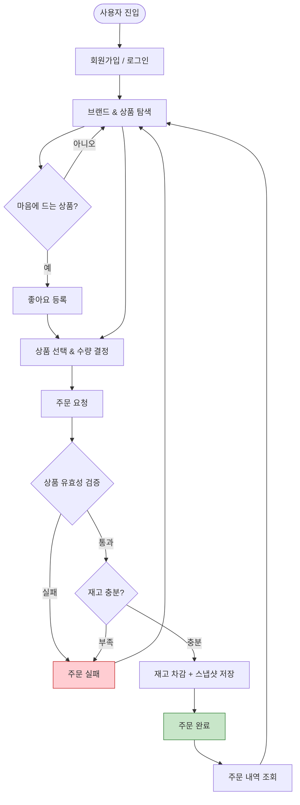
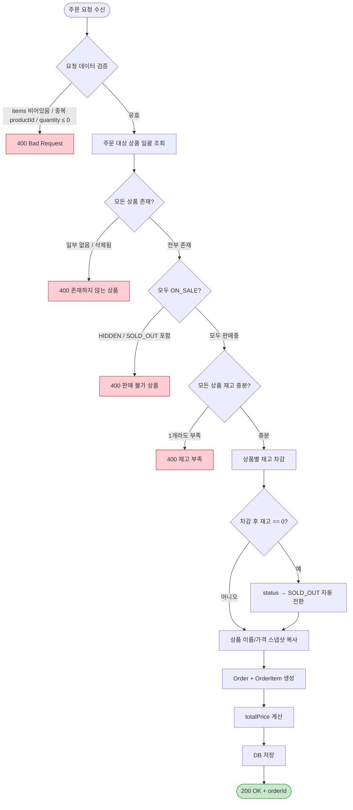
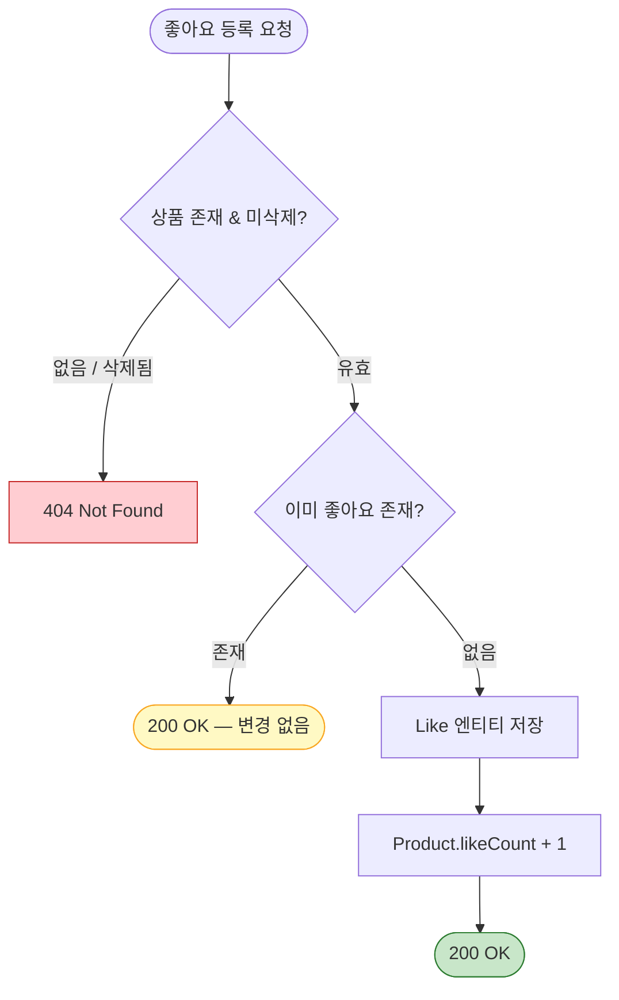
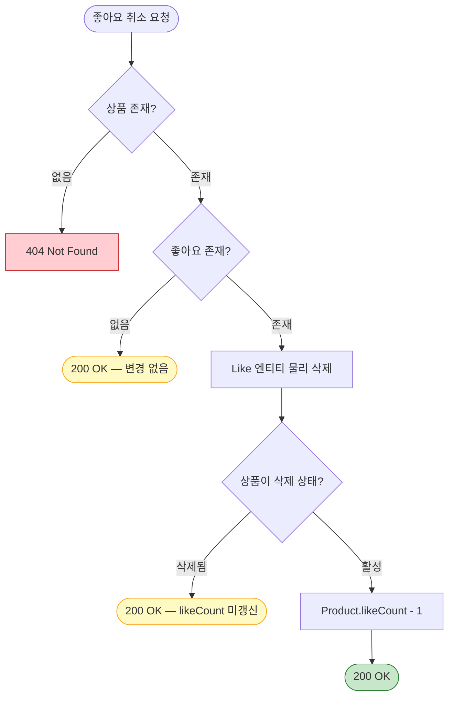

# 플로우차트

시스템의 핵심 흐름을 의사결정 관점에서 시각화한다.
시퀀스 다이어그램이 "누가 누구를 호출하는가"를 보여준다면, 플로우차트는 "어떤 조건에서 어떤 경로로 분기하는가"를 보여준다.

> 단순 CRUD는 시퀀스 다이어그램으로 충분하므로, **분기가 복잡하거나 cross-domain 흐름**만 플로우차트로 작성한다.

---

## 1. 서비스 전체 흐름

사용자가 시스템을 이용하는 핵심 여정을 조감도로 표현한다.

### 참고

- 쿠폰 발급/적용 단계는 추후 개발 시 F→G 사이에 삽입 예정
- 결제 단계는 K→L 사이에 삽입 예정
- 어드민 흐름(브랜드/상품 관리)은 별도 경로이므로 이 조감도에서 생략

---

## 2. 주문 생성 프로세스

주문 생성 시 내부에서 일어나는 검증 및 처리 로직의 의사결정 흐름이다.
시퀀스 다이어그램 4.1과 대응된다.

### 참고

- 전체 과정이 **하나의 트랜잭션** 내에서 원자적으로 실행 (all-or-nothing)
- 어느 단계에서든 실패하면 트랜잭션 롤백으로 재고 차감도 원복
- 인증 인터셉터 검증은 전제 조건으로 생략 (시퀀스 다이어그램 공통 규칙 참고)

---

## 3. 좋아요 토글 (등록 / 취소)

좋아요의 멱등성 보장과 삭제된 상품에 대한 분기 처리를 시각화한다.
시퀀스 다이어그램 3.1, 3.2와 대응된다.

### 3.1 좋아요 등록

### 3.2 좋아요 취소

### 참고

- 등록: 삭제된 상품에는 좋아요 등록 불가 (404)
- 취소: 삭제된 상품이라도 Like 레코드가 있으면 물리 삭제 수행, 단 likeCount는 갱신하지 않음
- 노란색 경로는 멱등성에 의한 무변경 응답
