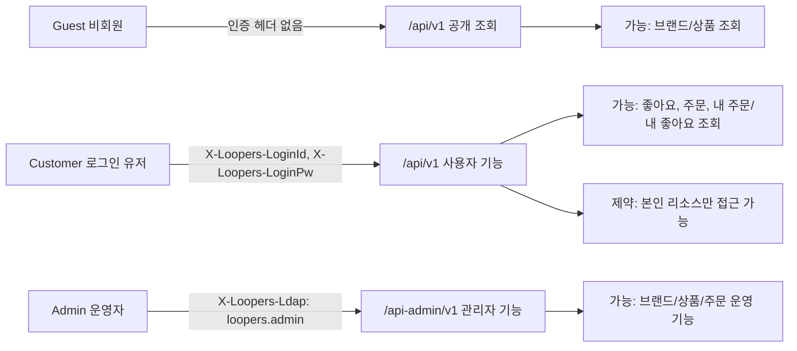

# 요구사항 (Baseline) - 2주차 설계 초안

## 목차

- [문서 메타](#문서-메타)
- [1. 배경과 목적](#1-배경과-목적)
- [2. 범위](#2-범위)
    - [In-Scope](#in-scope)
    - [Out-of-Scope](#out-of-scope)
    - [가정](#가정)
    - [의존성](#의존성)
    - [제약](#제약)
- [3. 문서 이해관계자와 시스템 Actor](#3-문서-이해관계자와-시스템-actor)
    - [3.1 Actor별 인증/식별 다이어그램](#31-actor별-인증식별-다이어그램)
- [4. 사용자 시나리오 (구현 범위 전체)](#4-사용자-시나리오-구현-범위-전체)
    - [4.1 Customer 여정: 탐색과 관심상품 관리](#41-customer-여정-탐색과-관심상품-관리)
    - [4.2 Customer 여정: 주문 생성과 주문 조회](#42-customer-여정-주문-생성과-주문-조회)
    - [4.3 Admin 여정: 카탈로그 운영 관리](#43-admin-여정-카탈로그-운영-관리)
    - [4.4 Admin 여정: 주문 모니터링](#44-admin-여정-주문-모니터링)
    - [4.5 시나리오-요구사항 매핑](#45-시나리오-요구사항-매핑)
- [요구사항 본문 (구현 대상 기능)](#요구사항-본문-구현-대상-기능)
    - [5. 기능 요구사항 (FR)](#5-기능-요구사항-fr)
    - [6. 비기능 요구사항 (NFR)](#6-비기능-요구사항-nfr)
    - [7. 전환 요구사항 (TR)](#7-전환-요구사항-tr)
- [기술 상세 (개발/QA/운영 참고)](#기술-상세-개발qa운영-참고)
    - [8. API/접근 제약](#8-api접근-제약)
    - [9. 데이터 정의 (초안)](#9-데이터-정의-초안)
- [핵심 정책 결정 기록](#핵심-정책-결정-기록)
- [미결정 사항 (후속 주차 연계)](#미결정-사항-후속-주차-연계)

---

## 문서 메타

- 작성일:
- 관련 문서
    - 용어집: ./00-ubiquitous-language.md
    - 시퀀스 다이어그램: ./02-sequence-diagrams.md
    - 클래스 다이어그램: ./03-class-diagram.md
    - ERD: ./04-erd.md

---

## 1. 배경과 목적

### 배경

- 사용자는 브랜드/상품을 탐색하고, 상품에 좋아요를 표시하며, 여러 상품을 한 번에 주문한다.
- 유저 행동 데이터는 향후 랭킹/추천 등으로 확장될 수 있다.

### 목적

- 2주차(설계 주차) 산출물 작성을 위한 기준 요구사항을 정의한다.
- 요구사항을 기반으로 시퀀스 다이어그램/클래스 다이어그램/ERD로 전환 가능한 수준으로 정리한다.

### 성공 기준

- 상품/브랜드/좋아요/주문 도메인이 모두 요구사항에 포함된다.
- 각 기능이 유저 관점 흐름(Main)과 예외 흐름(Alternate/Exception)을 포함한다.
- 시퀀스/클래스/ERD 작성에 필요한 규칙과 데이터 요구가 요구사항에 드러난다.

---

## 2. 범위

### In-Scope

- 브랜드/상품(대고객 조회 + 어드민 CRUD)
- 좋아요(등록/취소/내 목록)
- 주문(주문 생성, 유저 주문 목록/상세, 어드민 주문 목록/상세)
- 상품 목록 조회(필터/정렬/페이지네이션)

### Out-of-Scope

- 결제(추후 주차에서 확장)
- 쿠폰 발급/사용(추후 주차에서 확장)  ※ 시나리오 배경에는 존재하나 본 주차 설계 범위에서는 제외
- 장바구니/장바구니 항목(Cart/CartItem) 도메인 구현(후속 확장 범위)
- 인증/인가의 완전한 구현(식별용 헤더 기반으로만 접근 제약을 표현)

### 가정

- 회원(Users) 도메인은 1주차 완료로 가정하며, 본 문서 범위에서는 회원 기능 자체를 상세 설계하지 않는다.
- 유저 로그인이 필요한 기능은 “헤더를 통한 유저 식별”을 전제로 한다(인증/인가 자체는 스코프 아님).

### 의존성

- 식별 헤더 규격(대고객, 어드민)이 확정되어야 한다.
- 브랜드/상품 필드 정의(무엇을 저장/노출할지)가 확정되어야 한다.
- 재고 저장 모델(`product_stock`)의 최소 필드 및 제약이 확정되어야 한다.

### 제약

- 유저는 타 유저의 정보에 직접 접근할 수 없다(예: 좋아요/주문 목록은 본인만 조회).
- 어드민 기능은 별도 prefix 및 헤더로 식별한다.
- 대고객 기능은 별도 prefix로 제공한다.

---

## 3. 문서 이해관계자와 시스템 Actor

### 문서 이해관계자 (문서 독자/협업 주체)

- PM/기획
- 디자이너
- 개발자(백엔드/프론트엔드)
- QA
- 운영

### 시스템 Actor (요구사항 행위 주체)

- Customer(대고객 사용자)
- Admin(운영자/관리자)

### 3.1 Actor별 인증/식별 다이어그램

---

## 4. 사용자 시나리오 (구현 범위 전체)

### 4.1 Customer 여정: 탐색과 관심상품 관리

- 목적: Customer가 상품을 탐색하고 관심 상품을 관리한다.
- 사전 조건: 대고객 API(`/api/v1`) 접근 가능, 로그인 필요 기능에서는 사용자 식별 헤더를 제공한다.
- 주요 흐름:
    1. 브랜드 상세 정보를 조회한다.
    2. 브랜드 필터/정렬/페이지 조건으로 상품 목록을 조회한다.
    3. 상품 상세 정보를 조회한다.
    4. 관심 상품에 좋아요를 등록하거나 취소한다.
    5. 내가 좋아요한 상품 목록을 조회한다.
- 예외 흐름:
    - 존재하지 않는 brandId/productId는 오류로 처리한다.
    - 타 사용자 좋아요 목록 접근은 차단한다.
- 결과: Customer는 관심 상품을 일관된 규칙으로 조회/관리할 수 있다.
- 관련 FR: FR-001, FR-002, FR-003, FR-014, FR-015, FR-016

### 4.2 Customer 여정: 주문 생성과 주문 조회

- 목적: Customer가 여러 상품을 주문하고 주문 이력을 조회한다.
- 사전 조건:
    - 주문 생성 요청에 `Idempotency-Key`를 포함한다.
    - 재고는 `product_stock` 가용 재고를 기준으로 검증한다.
- 주요 흐름:
    1. Customer가 주문 요청(items)을 전송한다.
    2. 시스템은 중복 상품 수량 합산 후 재고를 검증한다.
    3. 모든 항목 검증 성공 시 재고를 차감하고 주문을 생성한다.
    4. Customer는 기간 조건으로 본인 주문 목록을 조회한다.
    5. Customer는 단일 주문 상세를 조회한다.
- 예외 흐름:
    - 재고 부족 또는 존재하지 않는 상품 포함 시 주문은 전체 실패한다.
    - 동일 사용자/동일 `Idempotency-Key` 재요청은 최초 결과를 반환한다.
    - 동일 사용자/동일 `Idempotency-Key` + 상이 본문은 오류로 처리한다.
    - 타 사용자 주문 조회는 차단한다.
- 결과: 주문 정합성(All-or-Nothing)과 중복 주문 방지(멱등성)를 보장한다.
- 관련 FR: FR-017, FR-018, FR-019

### 4.3 Admin 여정: 카탈로그 운영 관리

- 목적: Admin이 브랜드/상품 카탈로그를 운영한다.
- 사전 조건: 어드민 API(`/api-admin/v1`) 접근 및 `X-Loopers-Ldap: loopers.admin` 헤더를 제공한다.
- 주요 흐름:
    1. 브랜드 목록/상세를 조회한다.
    2. 브랜드를 등록/수정/삭제한다.
    3. 상품 목록/상세를 조회한다.
    4. 상품을 등록/수정/삭제한다.
- 예외 흐름:
    - 존재하지 않는 brandId/productId는 오류로 처리한다.
    - 상품 등록 시 brandId가 유효하지 않으면 오류로 처리한다.
    - 상품 수정에서 brandId 변경 요청은 거부한다.
- 결과: Admin은 카탈로그를 일관된 제약 하에 관리할 수 있다.
- 관련 FR: FR-004, FR-005, FR-006, FR-007, FR-008, FR-009, FR-010, FR-011, FR-012, FR-013

### 4.4 Admin 여정: 주문 모니터링

- 목적: Admin이 주문 현황을 조회하여 운영 상태를 확인한다.
- 사전 조건: 어드민 인증 헤더를 포함해 `/api-admin/v1` 경로로 접근한다.
- 주요 흐름:
    1. 주문 목록을 조회한다.
    2. 단일 주문 상세를 조회한다.
- 예외 흐름:
    - 존재하지 않는 orderId는 오류로 처리한다.
- 결과: 운영자는 주문 상태를 페이지 단위로 모니터링할 수 있다.
- 관련 FR: FR-020, FR-021

### 4.5 시나리오-요구사항 매핑

| 시나리오 | 포함 요구사항 |
|---|---|
| 4.1 Customer 여정: 탐색과 관심상품 관리 | FR-001, FR-002, FR-003, FR-014, FR-015, FR-016 |
| 4.2 Customer 여정: 주문 생성과 주문 조회 | FR-017, FR-018, FR-019 |
| 4.3 Admin 여정: 카탈로그 운영 관리 | FR-004, FR-005, FR-006, FR-007, FR-008, FR-009, FR-010, FR-011, FR-012, FR-013 |
| 4.4 Admin 여정: 주문 모니터링 | FR-020, FR-021 |

---

# 요구사항 본문 (구현 대상 기능)

## 5. 기능 요구사항 (FR)

### [브랜드/상품 - 대고객]

#### FR-001 브랜드 정보 조회

- 설명: Customer는 브랜드 상세 정보를 조회할 수 있어야 한다.
- 사용자/주체: Customer
- 트리거/조건: 브랜드 ID가 주어진다.
- 기본 흐름:
    1. Customer가 브랜드 상세 조회를 요청한다.
    2. 시스템은 브랜드 정보를 반환한다.
- 예외/에러/경계:
    - 브랜드 ID가 존재하지 않으면 “없음” 응답을 반환한다. (표준 에러 형식은 TBD)
- 수용 기준:
    - [ ] 존재하는 brandId로 조회 시 브랜드 정보가 반환된다.
    - [ ] 존재하지 않는 brandId로 조회 시 적절한 오류/없음 응답이 반환된다.

#### FR-002 상품 목록 조회(필터/정렬/페이지네이션)

- 설명: Customer는 조건에 따라 상품 목록을 조회할 수 있어야 한다.
- 사용자/주체: Customer
- 트리거/조건: (선택) brandId, sort, page, size
- 기본 흐름:
    1. Customer가 상품 목록을 요청한다.
    2. 시스템은 조건에 맞는 상품 목록을 반환한다.
- 정책/규칙:
    - page 기본값: 0
    - size 기본값: 20
    - sort 지원 범위: `latest`(필수), `price_asc`(선택), `likes_desc`(선택)
- 예외/에러/경계:
    - page/size가 유효 범위를 벗어나면 “요청 오류”로 처리한다. (`page >= 0`, `1 <= size <= 100`)
- 수용 기준:
    - [ ] brandId가 주어지면 해당 브랜드 상품만 반환된다.
    - [ ] sort=latest가 동작한다.
    - [ ] sort=price_asc, sort=likes_desc가 동작한다.
    - [ ] page/size에 따라 결과 개수 및 페이지가 달라진다.

#### FR-003 상품 상세 조회

- 설명: Customer는 상품 상세 정보를 조회할 수 있어야 한다.
- 사용자/주체: Customer
- 트리거/조건: productId
- 기본 흐름:
    1. Customer가 상품 상세 조회를 요청한다.
    2. 시스템은 상품 정보를 반환한다.
- 예외/에러/경계:
    - productId가 존재하지 않으면 “없음” 응답을 반환한다. (표준 에러 형식 TBD)
- 수용 기준:
    - [ ] 존재하는 productId 조회 시 상품 정보가 반환된다.
    - [ ] 존재하지 않는 productId 조회 시 적절한 오류/없음 응답이 반환된다.

---

### [브랜드/상품 - 어드민]

#### FR-004 어드민 브랜드 목록 조회(페이지네이션)

- 사용자/주체: Admin
- 기본 흐름:
    1. Admin이 브랜드 목록을 page/size로 조회한다.
    2. 시스템은 브랜드 목록을 반환한다.
- 정책/규칙:
    - page 기본값: 0
    - size 기본값: 20
- 수용 기준:
    - [ ] page/size에 따라 결과가 달라진다.

#### FR-005 어드민 브랜드 상세 조회

- 사용자/주체: Admin
- 기본 흐름:
    1. Admin이 브랜드 상세를 조회한다.
    2. 시스템은 브랜드 상세를 반환한다.
- 예외:
    - 존재하지 않는 brandId면 “없음/오류” 처리 (TBD)

#### FR-006 어드민 브랜드 등록

- 사용자/주체: Admin
- 기본 흐름:
    1. Admin이 브랜드 등록을 요청한다.
    2. 시스템은 브랜드를 생성하고 생성된 식별자를 반환한다.
- 데이터 요구:
    - 브랜드 필수 필드: `name`, `description`
- 수용 기준:
    - [ ] 등록 후 목록/상세 조회에서 확인된다.

#### FR-007 어드민 브랜드 수정

- 사용자/주체: Admin
- 기본 흐름:
    1. Admin이 브랜드 수정 요청을 한다.
    2. 시스템은 브랜드 정보를 갱신한다.
- 예외:
    - 존재하지 않는 brandId면 “없음/오류” 처리 (TBD)

#### FR-008 어드민 브랜드 삭제(연관 상품 처리 포함)

- 사용자/주체: Admin
- 정책/규칙:
    - 브랜드 삭제는 soft delete 정책을 사용한다.
    - 브랜드 삭제 시 해당 브랜드의 상품도 soft delete 처리한다.
    - 대고객/어드민 기본 조회에서는 soft delete 된 데이터는 노출하지 않는다.
- 기본 흐름:
    1. Admin이 브랜드 삭제를 요청한다.
    2. 시스템은 브랜드를 soft delete 처리한다.
    3. 시스템은 연관된 상품들을 soft delete 처리한다.
- 수용 기준:
    - [ ] 삭제 후 대고객/어드민 기본 조회에서 브랜드가 노출되지 않는다.
    - [ ] 해당 브랜드의 상품도 대고객/어드민 기본 조회에서 노출되지 않는다.

#### FR-009 어드민 상품 목록 조회(브랜드 필터/페이지네이션)

- 사용자/주체: Admin
- 기본 흐름:
    1. Admin이 상품 목록을 page/size, (선택) brandId로 조회한다.
    2. 시스템은 상품 목록을 반환한다.
- 수용 기준:
    - [ ] brandId로 필터링할 수 있다.
    - [ ] page/size에 따라 결과가 달라진다.

#### FR-010 어드민 상품 상세 조회

- 사용자/주체: Admin
- 기본 흐름:
    1. Admin이 상품 상세를 조회한다.
    2. 시스템은 상품 상세를 반환한다.

#### FR-011 어드민 상품 등록(브랜드 존재 필요)

- 사용자/주체: Admin
- 정책/규칙:
    - 상품의 브랜드는 “이미 등록된 브랜드”여야 한다.
- 기본 흐름:
    1. Admin이 상품 등록을 요청한다(brandId 포함).
    2. 시스템은 brandId 존재를 확인한다.
    3. 시스템은 상품을 생성한다.
- 예외:
    - brandId가 존재하지 않으면 “요청 오류”로 처리한다. (에러 형식 TBD)
- 데이터 요구:
    - 상품 필수 필드: `name`, `price`, `status`, `imageUrl`, `brandId`, `initialStock`
    - `initialStock`은 상품 등록 시 `product_stock` 초기 수량으로 저장한다.
- 수용 기준:
    - [ ] 존재하는 brandId로 등록 시 생성된다.
    - [ ] 존재하지 않는 brandId로 등록 시 실패한다.

#### FR-012 어드민 상품 수정(브랜드 변경 불가)

- 사용자/주체: Admin
- 정책/규칙:
    - 상품의 brandId는 수정할 수 없다.
- 기본 흐름:
    1. Admin이 상품 수정을 요청한다.
    2. 시스템은 brandId 변경 요청이 포함되었는지 확인한다.
    3. brandId 변경이 포함되면 요청 오류로 실패 처리한다.
    4. brandId 변경이 없으면 상품 정보를 갱신한다.
- 수용 기준:
    - [ ] brandId 변경 요청은 거부된다.
    - [ ] 다른 필드 수정은 반영된다.

#### FR-013 어드민 상품 삭제

- 사용자/주체: Admin
- 정책/규칙:
    - 상품 삭제는 soft delete 정책을 사용한다.
    - soft delete 된 상품은 대고객/어드민 기본 조회에서 노출하지 않는다.
- 기본 흐름:
    1. Admin이 상품 삭제를 요청한다.
    2. 시스템은 상품을 soft delete 처리한다.
- 수용 기준:
    - [ ] 삭제 후 대고객/어드민 기본 조회에서 노출되지 않는다.

---

### [좋아요]

#### FR-014 상품 좋아요 등록

- 사용자/주체: Customer(로그인 필요)
- 트리거/조건: productId
- 기본 흐름:
    1. Customer가 특정 상품에 좋아요 등록을 요청한다.
    2. 시스템은 기존 좋아요 여부를 확인한다.
    3. 좋아요가 없으면 저장한다.
    4. 좋아요가 이미 있으면 변경 없이 멱등 성공으로 처리한다.
- 예외/경계:
    - productId가 존재하지 않으면 요청 오류로 처리한다.
- 수용 기준:
    - [ ] 좋아요 등록 후 “내 좋아요 목록”에서 조회된다.
    - [ ] 이미 좋아요한 상품에 재요청해도 성공 응답이며 중복 데이터가 생성되지 않는다.

#### FR-015 상품 좋아요 취소

- 사용자/주체: Customer(로그인 필요)
- 기본 흐름:
    1. Customer가 특정 상품 좋아요 취소를 요청한다.
    2. 시스템은 기존 좋아요 여부를 확인한다.
    3. 좋아요가 있으면 제거한다.
    4. 좋아요가 없으면 변경 없이 멱등 성공으로 처리한다.
- 예외/경계:
    - productId가 존재하지 않으면 요청 오류로 처리한다.
- 수용 기준:
    - [ ] 취소 후 “내 좋아요 목록”에서 제외된다.
    - [ ] 좋아요가 없는 상태에서 취소해도 성공 응답이다.

#### FR-016 내가 좋아요한 상품 목록 조회

- 사용자/주체: Customer(로그인 필요)
- 정책/제약:
    - 타 유저의 좋아요 목록은 조회할 수 없다.
- 기본 흐름:
    1. Customer가 좋아요 목록을 조회한다.
    2. 시스템은 해당 Customer의 좋아요 상품 목록을 반환한다.
- 예외:
    - URI의 `userId`와 인증 사용자 식별값이 다르면 접근을 차단한다.
- 수용 기준:
    - [ ] 본인 요청 시 좋아요 목록이 반환된다.
    - [ ] 타 유저 userId로 접근 시 차단된다.

---

### [주문]

#### FR-017 주문 요청(여러 상품 동시 주문)

- 사용자/주체: Customer(로그인 필요)
- 입력:
    - 헤더: `Idempotency-Key` (필수)
    - 바디: `items[{productId, quantity}]`
- 정책/규칙:
    - 결제는 제외(추후 확장)
    - 주문 생성은 요청 바디의 `items`를 기준으로 처리한다. (Cart/CartItem은 현재 범위 미포함)
    - 주문 정보에는 “주문 당시 상품 정보 스냅샷”이 저장되어야 한다.
    - 스냅샷 필드: `productId`, `productName`, `brandId`, `brandName`, `unitPrice`, `orderedQuantity`
    - 주문 시 `product_stock` 가용 재고 기준의 “재고 확인 및 차감”이 보장되어야 한다.
    - 재고 부족 항목이 1개라도 있으면 주문은 전체 실패한다(부분 성공 미지원).
    - 재고 부족 시 수량 자동 보정(Auto-Correction)은 적용하지 않는다.
    - 요청 `items`에 동일 `productId`가 중복되면 서버에서 수량을 합산한 뒤 검증한다.
    - 동일 사용자/동일 `Idempotency-Key` 재요청은 최초 주문 결과를 반환하며, 주문은 1건만 생성된다.
- 기본 흐름:
    1. Customer가 주문 요청(`Idempotency-Key`, items)을 전송한다.
    2. 시스템은 `productId` 기준으로 중복 item을 합산한다.
    3. 시스템은 멱등 키의 기존 처리 결과가 있는지 확인한다.
    4. 기존 결과가 없으면 각 item의 상품 존재 여부를 확인한다.
    5. 시스템은 각 item의 `product_stock` 재고를 확인한다.
    6. 재고 검증이 모두 성공하면 재고를 차감한다.
    7. 시스템은 주문을 생성하고 주문 상세(또는 주문 ID)를 반환한다.
- 예외/에러/경계:
    - 존재하지 않는 productId가 포함되면 주문은 전체 실패한다.
    - 재고 부족이 발생하면 주문은 전체 실패한다.
    - 재고 부족 시 Cart 자동 보정은 수행하지 않는다.
    - 동일 사용자/동일 `Idempotency-Key`에 요청 바디가 다르면 요청 오류로 처리한다.
    - 실패 시 재고 차감 및 주문 데이터 생성은 발생하지 않아야 한다.
- 수용 기준:
    - [ ] 정상 재고일 때 주문이 생성되고, 재고가 차감된다.
    - [ ] 재고 부족일 때 주문은 전체 실패하고, 부분 주문은 생성되지 않는다.
    - [ ] 재고 부족 시 수량 자동 보정 없이 실패 응답을 반환한다.
    - [ ] 동일 사용자/동일 `Idempotency-Key` 재요청은 주문을 중복 생성하지 않고 최초 결과를 반환한다.
    - [ ] 주문 데이터에 `productId`, `productName`, `brandId`, `brandName`, `unitPrice`, `orderedQuantity` 스냅샷이 저장된다.

#### FR-018 유저 주문 목록 조회(기간 필터)

- 사용자/주체: Customer(로그인 필요)
- 입력: startAt, endAt (예: YYYY-MM-DD)
- 정책/제약:
    - 타 유저의 주문 목록은 조회할 수 없다.
    - 기간 조회는 `startAt`, `endAt` 모두 필수로 받는다.
    - 기간 경계는 포함(inclusive)으로 처리한다.
- 기본 흐름:
    1. Customer가 기간 조건으로 주문 목록을 조회한다.
    2. 시스템은 해당 기간의 주문 목록을 반환한다.
- 예외/경계:
    - startAt/endAt 중 하나라도 누락되면 요청 오류로 처리한다.
    - startAt이 endAt보다 늦으면 요청 오류로 처리한다.
- 수용 기준:
    - [ ] 기간 조건에 맞는 주문이 반환된다.
    - [ ] 타 유저 접근은 차단된다.

#### FR-019 단일 주문 상세 조회

- 사용자/주체: Customer(로그인 필요)
- 정책/제약:
    - 타 유저의 주문 상세는 조회할 수 없다.
- 기본 흐름:
    1. Customer가 orderId로 주문 상세를 조회한다.
    2. 시스템은 주문 상세를 반환한다.
- 수용 기준:
    - [ ] 본인 주문은 조회된다.
    - [ ] 타 유저 주문은 차단된다.

---

### [주문 - 어드민]

#### FR-020 어드민 주문 목록 조회(페이지네이션)

- 사용자/주체: Admin
- 기본 흐름:
    1. Admin이 주문 목록을 page/size로 조회한다.
    2. 시스템은 주문 목록을 반환한다.
- 수용 기준:
    - [ ] page/size에 따라 결과가 달라진다.

#### FR-021 어드민 단일 주문 상세 조회

- 사용자/주체: Admin
- 기본 흐름:
    1. Admin이 orderId로 주문 상세를 조회한다.
    2. 시스템은 주문 상세를 반환한다.

---

## 6. 비기능 요구사항 (NFR)

#### NFR-001 데이터 정합성(주문/재고)

- 설명: 주문 생성과 `product_stock` 재고 차감은 정합성이 유지되어야 한다.
- 측정/검증 방식: 동시 주문 테스트 시 `product_stock` 가용 재고가 음수가 되지 않는다.
- 수용 기준:
    - [ ] 동시 요청 상황에서도 `product_stock` 가용 재고가 음수가 되지 않는다.
    - [ ] 동시성 제어 구현 방식(락/버전)은 후속 주차에서 확정한다.

#### NFR-002 기본 응답 성능(초안)

- 설명: 조회 API는 사용자 경험을 해치지 않는 수준의 응답을 목표로 한다.
- 목표 수치: TBD (이번 주차에서 수치 확정 여부는 미정)

---

## 7. 전환 요구사항 (TR)

- 이번 주차에서는 별도 마이그레이션/롤아웃 요구사항을 정의하지 않는다. (필요 시 추후 추가)

---

# 기술 상세 (개발/QA/운영 참고)

## 8. API/접근 제약

- 대고객 API prefix: `/api/v1`
- 어드민 API prefix: `/api-admin/v1`
- 유저 식별 헤더(로그인 필요 기능):
    - `X-Loopers-LoginId`
    - `X-Loopers-LoginPw`
- 주문 멱등성 헤더(주문 생성 시 필수):
    - `Idempotency-Key`
- 어드민 식별 헤더:
    - `X-Loopers-Ldap: loopers.admin`
- 접근 제약:
    - 유저는 타 유저 정보에 직접 접근할 수 없다(좋아요/주문은 본인만).

## 9. 데이터 정의 (초안)

> 아래는 “스냅샷/정합성” 요구사항을 ERD로 내리기 위한 최소 필드입니다.

- Brand
    - 필수 필드: `id`, `name`, `description`, `createdAt`, `updatedAt`, `deletedAt`
- Product
    - 필수 필드: `id`, `brandId`, `name`, `price`, `status`, `imageUrl`, `createdAt`, `updatedAt`, `deletedAt`
    - 제약: brandId 변경 불가
- ProductStock
    - 필수 필드: `productId`, `availableQuantity`, `updatedAt`
    - 제약: `productId`는 Product와 1:1, `availableQuantity >= 0`
- Like
    - 필수 필드: `userId`, `productId`, `createdAt`
    - 제약: `(userId, productId)` 유니크
- Order
    - 필수 필드: `id`, `userId`, `idempotencyKey`, `orderedAt`
    - 제약: `(userId, idempotencyKey)` 유니크
- OrderItem
    - 필수 필드: `orderId`, `productId`, `productName`, `brandId`, `brandName`, `unitPrice`, `orderedQuantity`
    - 제약: 주문 시점 스냅샷 값은 생성 이후 변경하지 않는다.

---

## 핵심 정책 결정 기록

1) **브랜드/상품 필드 범위**
    - 결정: 핵심 필드만 확정(`Brand`: name/description, `Product`: name/price/status/imageUrl).
    - 근거: 2주차 목표인 “요구사항 → 설계 산출물 전환”에 필요한 최소 정보로 복잡도를 통제한다.

2) **삭제 정책(브랜드/상품)**
    - 결정: 브랜드/상품 모두 soft delete, 브랜드 삭제 시 연관 상품 soft delete 전파.
    - 근거: 주문 스냅샷 및 운영 추적성을 유지하면서도 조회 노출 정책을 단순하게 유지할 수 있다.

3) **주문 실패 정책**
    - 결정: 재고 부족/존재하지 않는 상품 포함 시 전체 실패, 부분 성공 미지원.
    - 근거: 트랜잭션 경계를 명확히 해 데이터 정합성 설명과 검증이 쉬워진다.

4) **중복 상품 및 스냅샷 정책**
    - 결정: 요청 items의 동일 productId는 수량 합산 후 검증, 주문 시 스냅샷은 name/brand/price/quantity를 포함한다.
    - 근거: 입력 변형 노이즈를 줄이고, 주문 이력 조회 시점의 의미를 보존한다.

5) **재고 저장 모델 분리 정책**
    - 결정: 재고 수량은 Product가 아닌 `product_stock`에서 관리한다.
    - 근거: 상품 정보와 재고 정보를 분리해 후속 주차의 동시성/정합성 설계를 독립적으로 고도화할 수 있다.

6) **주문 멱등성 정책**
    - 결정: 주문 생성 시 `Idempotency-Key`를 필수로 사용하며, 동일 사용자/동일 키 요청은 1건의 주문만 생성한다.
    - 근거: 재시도 요청에서 중복 주문 생성 리스크를 줄이고 운영 안정성을 확보한다.

7) **자동 보정 정책**
    - 결정: 재고 부족 시 Auto-Correction은 현재 범위에서 적용하지 않는다.
    - 근거: 정책 분기 복잡도를 줄이고 실패 조건을 명확히 유지한다.

## 미결정 사항 (후속 주차 연계)

1) 표준 에러 응답 포맷 및 상세 오류 코드 매핑(`ErrorType` 세분화 범위)
2) 조회 API 목표 성능 수치(NFR-002) 구체화
3) 정렬 조건 고도화(`price_asc`, `likes_desc`)의 인덱스/집계 최적화 방식
