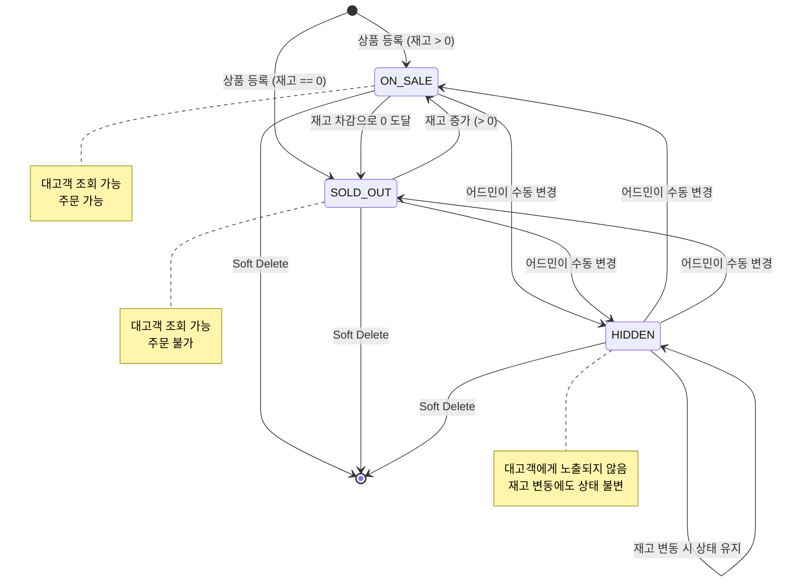
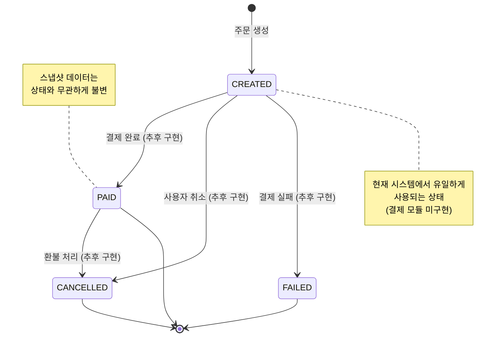

# 요구사항 명세서 v4

## 1. 문제 정의

이 서비스는 "감성 이커머스"로, 사용자가 좋아하는 브랜드의 상품을 탐색하고, 좋아요를 통해 관심을 표현하며, 여러 상품을 한 번에 주문하는 흐름을 제공한다.

### 핵심 목표

- **탐색의 즐거움**: 사용자가 브랜드와 상품을 매끄럽게 탐색하고, 관심사를 '좋아요'로 기록할 수 있어야 한다.
- **데이터의 정합성**: 주문 시 재고 차감, 상품 상태 변경, 스냅샷 저장이 원자적(Atomic)으로 처리되어야 한다.
- **확장성 고려**: 향후 랭킹, 추천 시스템 도입을 고려하여 도메인 간 결합도를 낮게 유지한다.

각 도메인이 해결하려는 문제를 관점별로 정리한다.

### 브랜드 & 상품

| 관점   | 문제                                                                                       |
|------|------------------------------------------------------------------------------------------|
| 사용자  | 여러 브랜드의 상품을 탐색하고 비교할 수 있어야 한다. 브랜드별, 가격순, 인기순 등 자신이 원하는 기준으로 상품을 찾을 수 있어야 한다.            |
| 비즈니스 | 브랜드와 상품을 체계적으로 관리하고, 고객에게 노출할 정보와 내부 관리 정보를 분리해야 한다. 브랜드 삭제 시 소속 상품의 생명주기를 함께 관리해야 한다.   |
| 시스템  | 상품 목록 조회는 가장 빈번한 요청이다. 정렬/필터/페이징 조합에서 안정적인 성능을 보장해야 한다. 재고 변경에 따른 상품 상태 전환이 정확히 동작해야 한다. |

### 좋아요

| 관점   | 문제                                                                                             |
|------|------------------------------------------------------------------------------------------------|
| 사용자  | 관심 상품을 기억하고 나중에 재방문할 수 있도록 개인화된 목록이 필요하다. 좋아요를 눌렀는지 여부가 즉시 반영되어야 한다.                           |
| 비즈니스 | 사용자의 관심 데이터는 추후 랭킹, 추천 등 다양한 기능으로 확장될 수 있다. 상품별 좋아요 수는 인기 정렬의 기준이 된다.                          |
| 시스템  | 같은 사용자가 같은 상품에 중복 좋아요를 누르는 것을 방지해야 한다. 좋아요 등록/취소는 멱등하게 동작해야 한다. likeCount 비정규화 시 정합성을 유지해야 한다. |

### 주문

| 관점   | 문제                                                                                 |
|------|------------------------------------------------------------------------------------|
| 사용자  | 여러 상품을 한 번에 담아 주문할 수 있어야 한다. 주문 이력을 기간별로 조회하고, 주문 당시의 상품 정보(이름, 가격)를 확인할 수 있어야 한다. |
| 비즈니스 | 주문 시점의 상품 정보가 스냅샷으로 보존되어야 한다. 상품 가격이 변경되더라도 과거 주문 내역에 영향을 주면 안 된다.                 |
| 시스템  | 주문 시 재고 확인 및 차감이 원자적으로 보장되어야 한다. 동시 주문 상황에서 재고가 음수로 떨어지면 안 된다. (동시성 해결은 향후 과제)     |

---

## 2. 유비쿼터스 언어

도메인 용어를 코드, 문서, API 명세에서 동일하게 사용한다.

| 한글       | 영문              | 정의                                                                                          |
|----------|-----------------|---------------------------------------------------------------------------------------------|
| 브랜드      | Brand           | 상품을 판매하는 주체. 삭제 시 소속된 상품들의 판매도 중단된다.                                                        |
| 상품       | Product         | 판매의 기본 단위. 재고(Stock)와 상태(Status)를 가지며, 가격(Price)은 0원 이상이어야 한다.                              |
| 상품 상태    | ProductStatus   | ON_SALE(판매중), SOLD_OUT(품절), HIDDEN(숨김)의 3가지 상태를 가진다.                                        |
| 재고       | Stock           | 판매 가능한 수량. 주문 발생 시 차감되며, 0이 되면 자동으로 SOLD_OUT 상태로 전이된다.                                      |
| 좋아요      | Like            | 사용자의 관심 표현. 사용자-상품 쌍으로 유일(Unique)해야 한다.                                                     |
| 좋아요 수    | LikeCount       | 상품의 인기 척도. 성능을 위해 상품 도메인에 비정규화하여 관리한다.                                                      |
| 주문       | Order           | 사용자의 구매 행위. 주문 생성 시점의 상품 정보를 보존해야 한다.                                                       |
| 주문 항목    | OrderItem       | 주문에 포함된 개별 상품. 주문 당시의 상품명과 가격을 스냅샷으로 저장한다.                                                  |
| 주문 상태    | OrderStatus     | 주문의 진행 상태. CREATED / PAID / CANCELLED / FAILED.                                             |
| 상품 스냅샷   | ProductSnapshot | 주문 시점의 상품 정보(이름, 가격) 사본. OrderItem에 저장.                                                     |
| 수량       | quantity        | 주문 항목의 수량. OrderItem.init 블록에서 직접 검증 (quantity >= 1).                                       |
| 카탈로그     | Catalog         | Product와 Brand를 포함하는 바운디드 컨텍스트. 상품 탐색에 필요한 정보를 하나의 경계로 관리한다.                                |
| 쿠폰       | Coupon          | 할인 혜택을 정의하는 템플릿. FIXED(정액) / RATE(정률) 두 가지 타입을 가진다. 만료일, 총 발급 수량, 최소 주문금액 등의 조건을 포함한다.   |
| 쿠폰 타입    | CouponType      | FIXED(정액 할인) / RATE(정률 할인).                                                                   |
| 발급 쿠폰    | IssuedCoupon    | 사용자에게 발급된 쿠폰 인스턴스. 쿠폰 템플릿(Coupon)을 참조하며, AVAILABLE / USED / EXPIRED 상태를 가진다.              |
| 쿠폰 상태    | CouponStatus    | 발급 쿠폰의 사용 상태. AVAILABLE(사용 가능) / USED(사용 완료) / EXPIRED(만료).                                  |
| 선착순 쿠폰   | Limited Coupon  | totalQuantity가 설정된 쿠폰. issuedCount가 totalQuantity에 도달하면 발급 불가.                               |
| 쿠폰 할인    | CouponDiscount  | 주문 생성 시 쿠폰을 적용하여 계산된 할인 금액. Order.discountAmount에 저장된다.                                      |
| 도메인 서비스  | Domain Service  | 상태를 갖지 않고, **동일한 도메인 경계 내**의 도메인 객체 간 협력을 조율하는 서비스. 단일 Domain Model이 수행하기 어려운 로직을 담당한다.           |
| 유스케이스    | UseCase         | Application 계층의 진입점. 단일 기능(기능명+UseCase)을 담당하며, 도메인 경계를 넘는 오케스트레이션을 조율한다. 예: GetProductUseCase, PlaceOrderUseCase |
| 어드민      | Admin           | 브랜드/상품/주문을 관리하는 내부 운영자. LDAP 헤더로 식별한다.                                                      |
| 복구       | Restore         | soft delete된 Domain Model을 다시 활성 상태로 되돌리는 어드민 작업. deletedAt을 null로 설정하며, 이미 활성인 Domain Model에 대해서는 멱등하게 동작한다. |

---

## 3. 액터 정의

| 액터          | 식별 방식                                        | 권한 및 역할                              |
|-------------|----------------------------------------------|--------------------------------------|
| 사용자 (User)  | `X-Loopers-LoginId` + `X-Loopers-LoginPw` 헤더 | 상품 탐색, 좋아요 등록/취소, 본인의 주문 생성 및 조회     |
| 비로그인 사용자    | 헤더 없음                                        | 상품 목록 및 상세 조회, 브랜드 정보 조회 (CUD 작업 불가) |
| 어드민 (Admin) | `X-Loopers-Ldap: loopers.admin` 헤더           | 브랜드/상품의 전체 생명주기 관리, 모든 주문 내역 조회      |

> 인증/인가 자체는 구현 범위가 아니며, 헤더 기반 식별만 수행한다.
> 인증 실패 시 401 응답, 메시지는 "인증에 실패했습니다"로 통일한다 (정보 노출 방지).

---

## 3-1. 어드민/대고객 권한 경계

각 Domain Model의 상태별로 대고객과 어드민이 수행 가능한 작업을 정의한다.

| Domain Model | 상태       | 대고객 조회 | 어드민 조회 | 어드민 수정 | 어드민 복구 |
|---------|----------|--------|--------|--------|--------|
| Brand   | 정상       | O      | O      | O      | -      |
| Brand   | 삭제       | X      | O      | O      | O      |
| Product | ON_SALE  | O      | O      | O      | -      |
| Product | SOLD_OUT | O      | O      | O      | -      |
| Product | HIDDEN   | X      | O      | O      | -      |
| Product | 삭제       | X      | O      | O      | O      |

**원칙**: 대고객용 조회 메서드(`getActive*`)는 어드민 CUD 경로에서 재사용하지 않는다.

- 대고객 조회: 활성 Domain Model만 반환 (삭제/HIDDEN 필터링)
- 어드민 조회: 모든 상태 반환
- 어드민 CUD: 작업 목적에 맞는 조회 메서드 사용 (`getBrand`, `getProduct` 등)

---

## 4. 유저 시나리오

### 4.1 브랜드 & 상품 관리 (어드민)

**사전 조건:** 요청 헤더에 `X-Loopers-Ldap: loopers.admin` 포함

**브랜드 관리:** 어드민은 브랜드를 등록, 수정, 삭제할 수 있다.

- **삭제 정책:** 브랜드를 삭제(Soft Delete)하면, 해당 브랜드에 소속된 모든 상품도 자동으로 삭제 처리되어 사용자에게 노출되지 않아야 한다.
- 브랜드 목록은 페이징하여 조회한다.

**상품 관리:** 어드민은 특정 브랜드 하위의 상품을 등록, 수정, 삭제할 수 있다.

- **등록 제한:** 존재하지 않거나 삭제된 브랜드에는 상품을 등록할 수 없다.
- **수정 제한:** 상품의 소속 브랜드는 변경할 수 없다.
- **상태 제어:** 어드민은 상품을 강제로 `HIDDEN` 처리할 수 있으며, 이 경우 재고가 있어도 사용자에게 노출되지 않는다.
- 등록 시 기본 status는 `ON_SALE` (stock > 0), `SOLD_OUT` (stock == 0)
- stock 변경 시: 0이 되면 status → `SOLD_OUT`, 0에서 양수가 되면 status → `ON_SALE`
- **수정 시 status 우선순위:** 어드민이 수정 요청에 `HIDDEN`을 명시하면 자동 전이 규칙보다 우선한다. 그 외 status는 stock 변경에 따른 자동 전이 규칙을 따른다. (예:
  stock=123, status=HIDDEN → HIDDEN 유지 / stock=0, status=ON_SALE → SOLD_OUT으로 자동 전환)

**브랜드 복구:** 어드민은 soft delete된 브랜드를 복구할 수 있다.

- **성공 흐름:** 삭제된 브랜드의 deletedAt을 null로 설정하여 활성 상태로 전환한다.
- **멱등성:** 이미 활성인 브랜드 복구 시 200 OK (변경 없음).
- **미존재 시:** 404 Not Found.
- **주의:** 브랜드 복구가 소속 상품을 연쇄 복구하지는 않는다 (상품은 개별 복구 필요).

**예외 흐름 (브랜드):**

| 조건                  | 응답  | 설명                   |
|---------------------|-----|----------------------|
| LDAP 헤더 누락 또는 값 불일치 | 401 | 어드민 인증 실패            |
| 브랜드명이 빈 값           | 400 | 필수 필드 누락             |
| 존재하지 않는 브랜드 수정/삭제   | 404 | 완전히 존재하지 않는 경우       |
| 이미 삭제된 브랜드 재삭제      | 200 | 멱등 처리 (이미 삭제 상태면 무시) |
| 존재하지 않는 브랜드 복구      | 404 |                      |

**상품 복구:** 어드민은 soft delete된 상품을 복구할 수 있다.

- **성공 흐름:** 삭제된 상품의 deletedAt을 null로 설정하여 활성 상태로 전환한다.
- **멱등성:** 이미 활성인 상품 복구 시 200 OK (변경 없음).
- **미존재 시:** 404 Not Found.

**예외 흐름 (상품):**

| 조건                  | 응답  | 설명                                               |
|---------------------|-----|--------------------------------------------------|
| LDAP 헤더 누락 또는 값 불일치 | 401 | 어드민 인증 실패                                        |
| 존재하지 않는 브랜드에 상품 등록  | 404 | 삭제된 브랜드 포함                                       |
| 가격이 음수              | 400 | price >= 0 제약 위반                                 |
| 재고가 음수              | 400 | stock >= 0 제약 위반                                 |
| 브랜드 변경 시도           | -   | 상품의 브랜드ID는 수정할 수 없다. 수정 요청에 brandId 필드를 포함하지 않는다 |
| 존재하지 않는 상품 수정/삭제    | 404 | 완전히 존재하지 않는 경우                                   |
| 존재하지 않는 상품 복구       | 404 |                                                  |

### 4.2 상품 탐색 (사용자/비로그인)

**사전 조건:** 인증 불필요

**목록 조회:** 사용자는 다양한 조건으로 상품을 조회할 수 있다.

- **필터:** 특정 브랜드 상품만 모아보기
- **정렬:** 최신순(기본), 가격 낮은순, 좋아요 많은순
- **노출 정책:** 삭제된 상품(`deletedAt IS NOT NULL`)과 숨김 상태(`HIDDEN`)인 상품은 조회되지 않는다.
- 응답에 좋아요 수(likeCount) 포함

| 값            | 설명                       | 기본값 |
|--------------|--------------------------|-----|
| `latest`     | 최신순 (createdAt DESC)     | O   |
| `price_asc`  | 가격 낮은순                   |     |
| `likes_desc` | 좋아요 많은순 (likeCount DESC) |     |

**상세 조회:** 상품의 상세 정보와 현재 좋아요 수, 소속 브랜드 정보를 확인할 수 있다.

**브랜드 조회:** 사용자가 특정 브랜드의 정보를 조회할 수 있다.

**예외 흐름:**

| 조건                  | 응답  | 설명                              |
|---------------------|-----|---------------------------------|
| 존재하지 않는 상품 조회       | 404 |                                 |
| soft deleted 상품 조회  | 404 | 대고객에서는 삭제된 상품 미노출               |
| HIDDEN 상태 상품 조회     | 404 | 대고객에서는 미노출 상품 접근 불가             |
| 존재하지 않는 브랜드 조회      | 404 |                                 |
| soft deleted 브랜드 조회 | 404 | 대고객에서는 삭제된 브랜드 미노출              |
| 유효하지 않은 sort 값      | 400 | latest, price_asc, likes_desc 외 |

### 4.3 좋아요 (사용자)

**사전 조건:** 요청 헤더에 `X-Loopers-LoginId` + `X-Loopers-LoginPw` 포함 (인증 필수)

**관심 표현:** 사용자는 마음에 드는 상품에 좋아요를 누르거나 취소할 수 있다.

- **제약:** 삭제된 상품에는 좋아요를 누를 수 없다.
- **멱등성:** 이미 좋아요를 누른 상품에 다시 요청해도 200 응답으로 처리된다 (상태 변화 없음, likeCount 변경 없음). 취소도 동일하다.
- 좋아요 등록 시 Product.likeCount 1 증가, 취소 시 1 감소

**목록 조회:** 사용자는 자신이 좋아요를 누른 상품 목록을 조회할 수 있다.

- 현재 삭제된 상품은 목록에서 자동 제외
- 응답에 상품 이름, 가격 포함 (브랜드 제외)

**예외 흐름:**

| 조건                       | 응답  | 설명                      |
|--------------------------|-----|-------------------------|
| 인증 헤더 누락                 | 401 | 메시지 통일                  |
| 인증 실패 (유저 없음 / 비밀번호 불일치) | 401 | 메시지 통일                  |
| 존재하지 않는 상품에 좋아요          | 404 |                         |
| soft deleted 상품에 좋아요 등록  | 404 | 삭제된 상품에 좋아요 등록 불가       |
| HIDDEN 상태 상품에 좋아요 등록     | 404 | 미노출 상품에 좋아요 등록 불가       |
| 존재하지 않는 상품의 좋아요 취소       | 404 | DB에 없는 상품               |
| soft deleted 상품의 좋아요 취소  | 200 | Like 삭제 + likeCount 미갱신 |
| 타인 좋아요 조회                | 400 | 인증된 사용자 본인만 조회 가능       |

### 4.4 주문 (사용자)

**사전 조건:** 요청 헤더에 `X-Loopers-LoginId` + `X-Loopers-LoginPw` 포함 (인증 필수)

**주문 요청:** 사용자는 여러 상품을 담아 한 번에 주문할 수 있다.

- **유효성 검증:** 주문하려는 상품은 모두 판매 중(`ON_SALE`)이어야 하며, 요청 수량만큼의 재고가 있어야 한다.

**주문 처리:**

1. 시스템이 각 상품의 존재 여부 및 판매 가능 상태를 확인한다
2. 시스템이 각 상품의 재고를 확인하고 차감한다 (all-or-nothing)
    - 재고 차감 후 stock == 0이면 status → `SOLD_OUT` 자동 전환
3. 시스템이 주문 시점의 상품 정보(이름, 가격)를 스냅샷으로 저장한다
4. 주문이 생성되고 (status: CREATED) 사용자에게 응답한다

**내역 조회:** 사용자는 본인의 과거 주문 내역을 기간별로 조회할 수 있다.

- from/to: 선택 파라미터 (일시), 미입력 시 최근 1달
- from: 해당 일시 이상 (>=), to: 해당 일시 미만 (<)
- 기준: 주문 생성일 (createdAt)
- 본인의 주문만 조회 가능

**주문 상세 조회:** 특정 주문의 상세 정보(주문 항목, 당시 상품 정보)를 조회한다.

- 본인의 주문만 조회 가능

**예외 흐름:**

| 조건                           | 응답  | 설명                        |
|------------------------------|-----|---------------------------|
| 인증 헤더 누락                     | 401 | 메시지 통일                    |
| 인증 실패                        | 401 | 메시지 통일                    |
| 주문 항목이 비어있음                  | 400 | items가 null 또는 빈 배열       |
| 주문 항목에 존재하지 않는 상품 포함         | 400 | productId에 해당하는 상품 없음     |
| 주문 항목에 삭제된 상품 포함             | 400 | soft deleted 상품 주문 불가     |
| 주문 항목에 HIDDEN/SOLD_OUT 상품 포함 | 400 | 판매중(ON_SALE)이 아닌 상품 주문 불가 |
| 수량이 0 이하                     | 400 | quantity >= 1             |
| 재고 부족 (1개 상품이라도)             | 400 | 전체 실패                     |
| 타인의 주문 상세 조회                 | 404 | 본인 주문이 아니면 미노출            |

### 4.5 쿠폰 (사용자)

**사전 조건:** 요청 헤더에 `X-Loopers-LoginId` + `X-Loopers-LoginPw` 포함 (인증 필수)

**쿠폰 발급:** 사용자는 원하는 쿠폰을 발급받을 수 있다.

- **유효성 검증:** 쿠폰이 존재하고 삭제되지 않아야 하며, 만료되지 않아야 하고, 남은 발급 수량이 있어야 한다 (선착순).
- **중복 발급 금지:** 동일 쿠폰을 이미 발급받은 사용자는 재발급 불가.
- 발급 성공 시 Coupon.issuedCount 1 증가.

**내 쿠폰 목록:** 사용자는 자신에게 발급된 쿠폰 목록을 조회할 수 있다.

- 쿠폰 템플릿 정보(이름, 타입, 할인값)와 발급 상태(AVAILABLE/USED/EXPIRED)를 포함한다.

**예외 흐름:**

| 조건                     | 응답  | 설명                        |
|------------------------|-----|---------------------------|
| 인증 헤더 누락               | 401 | 메시지 통일                    |
| 존재하지 않거나 삭제된 쿠폰 발급     | 404 |                           |
| 만료된 쿠폰 발급              | 400 | expiredAt 이전               |
| 발급 수량 초과 (선착순 소진)      | 400 | issuedCount >= totalQuantity |
| 중복 발급                  | 409 | 동일 쿠폰 재발급 불가              |

### 4.6 주문 조회 (어드민)

**사전 조건:** 요청 헤더에 `X-Loopers-Ldap: loopers.admin` 포함

어드민은 전체 주문 목록을 페이징하여 조회하고, 특정 주문의 상세 정보를 조회할 수 있다.

**예외 흐름:**

| 조건                  | 응답  | 설명        |
|---------------------|-----|-----------|
| LDAP 헤더 누락 또는 값 불일치 | 401 | 어드민 인증 실패 |
| 존재하지 않는 주문 조회       | 404 |           |

---

## 5. 도메인 규칙 (Business Rules)

시스템이 반드시 보장해야 하는 핵심 비즈니스 로직이다.

### 5.1 상품 상태 전이 (State Transition)

상품의 상태(status)는 재고(stock)의 변경에 따라 자동으로 전이된다. 단, `HIDDEN`은 예외다.


```mermaid
stateDiagram-v2
    [*] --> ON_SALE: 상품 등록 (재고 > 0)
    [*] --> SOLD_OUT: 상품 등록 (재고 == 0)
    ON_SALE --> SOLD_OUT: 재고 차감으로 0 도달
    ON_SALE --> HIDDEN: 어드민이 수동 변경
    SOLD_OUT --> ON_SALE: 재고 증가 (> 0)
    SOLD_OUT --> HIDDEN: 어드민이 수동 변경
    HIDDEN --> HIDDEN: 재고 변동 시 상태 유지
    HIDDEN --> ON_SALE: 어드민이 수동 변경
    HIDDEN --> SOLD_OUT: 어드민이 수동 변경
    ON_SALE --> [*]: Soft Delete
    SOLD_OUT --> [*]: Soft Delete
    HIDDEN --> [*]: Soft Delete
    note right of ON_SALE
        대고객 조회 가능
        주문 가능
    end note
    note right of HIDDEN
        대고객에게 노출되지 않음
        재고 변동에도 상태 불변
    end note
    note right of SOLD_OUT
        대고객 조회 가능
        주문 불가
    end note
```

**자동 전이 (Auto Transition):**

- `ON_SALE` (재고 > 0) → 재고 소진 → `SOLD_OUT`
- `SOLD_OUT` (재고 = 0) → 재고 입고 → `ON_SALE`

**수동 전이 (Manual Transition):**

- 어드민은 언제든 `HIDDEN`으로 상태를 변경할 수 있다.
- `HIDDEN` 상태에서는 재고가 변경되어도 `ON_SALE`이나 `SOLD_OUT`으로 자동 변경되지 않는다.

### 5.2 브랜드 규칙

- 브랜드명(name)은 필수이다
- 브랜드명에 유니크 제약은 없다 (동명 브랜드 허용)
- 브랜드 삭제 시 소속 상품도 함께 soft delete (cascade)
- 삭제된 브랜드의 상품은 대고객 조회에서 미노출

### 5.3 상품 규칙

- 상품은 반드시 하나의 브랜드에 소속된다 (brandId 필수)
- 상품 등록 시 브랜드가 존재해야 하고, 삭제 상태가 아니어야 한다
- 상품의 브랜드는 등록 이후 변경할 수 없다
- name(상품명): 필수
- price(가격): BigDecimal, 0 이상 (음수 불가)
- stock(재고): Int, 0 이상 (음수 불가), VO로 검증
- likeCount(좋아요 수): Int, 비정규화 필드, 좋아요 등록/취소 시 동기 증감

### 5.4 좋아요 규칙

- 공통 Base 클래스(감사 필드 포함)를 상속하지 않는다 (id, userId, productId만 보유)
- 취소 시 하드 딜리트(물리 삭제)로 관리한다 (soft delete 미적용)
- 사용자-상품 쌍은 유일하다 (unique constraint: userId + productId)
- 등록/취소 모두 멱등하게 동작한다
- 삭제된 상품 또는 HIDDEN 상태인 상품에는 좋아요를 등록할 수 없다
- 좋아요 등록 시 Product.likeCount 증가, 취소 시 감소
- 좋아요 목록 조회 시 삭제된 상품은 미노출
- 삭제된 상품에 대한 좋아요 취소 시 200 응답 (Like 레코드가 있으면 삭제, 없으면 무시). 상품이 삭제 상태이므로 likeCount는 갱신하지 않는다
- 삭제된 상품에 남아있는 좋아요 레코드는 배치(commerce-batch)에서 정리한다

### 5.5 주문 상태 전이

주문(Order)의 라이프사이클과 향후 확장 시 예상되는 상태 전이이다.


```mermaid
stateDiagram-v2
    [*] --> CREATED: 주문 생성
    CREATED --> PAID: 결제 완료 (추후 구현)
    CREATED --> CANCELLED: 사용자 취소 (추후 구현)
    CREATED --> FAILED: 결제 실패 (추후 구현)
    PAID --> CANCELLED: 환불 처리 (추후 구현)
    CANCELLED --> [*]
    FAILED --> [*]
    PAID --> [*]
    note right of CREATED
        현재 시스템에서 유일하게
        사용되는 상태
        (결제 모듈 미구현)
    end note
    note left of PAID
        스냅샷 데이터는
        상태와 무관하게 불변
    end note
```

### 5.6 주문 규칙

- Aggregate 영속성 저장 순서: JPA 연관관계를 사용하지 않으므로, Order.create() 시점에는 OrderItem이 refOrderId를 가질 수 없다. 따라서 PlaceOrderUseCase에서 영속화할 때 아래 순서를 반드시 따른다.
  1. orderRepository.save(order) 실행 → DB에서 채번된 ID를 가진 savedOrder 반환 
  2. savedOrder.items를 순회하며 savedOrder.id를 refOrderId로 세팅 (copy 사용)
  3. orderItemRepository.saveAll(...) 실행
- 주문은 최소 1개 이상의 주문 항목(OrderItem)을 가져야 한다
- 주문 항목의 수량(quantity)은 1 이상이어야 한다
- 주문 시 각 상품의 재고를 확인하고 차감한다 (트랜잭션 내)
- 재고가 부족하면 주문 전체가 실패한다 (all-or-nothing, 부분 주문 없음)
- 주문 항목에는 주문 시점의 상품 스냅샷(이름, 가격)이 저장된다
- 주문 상태: CREATED / PAID / CANCELLED / FAILED (현재는 CREATED만 사용)
- 주문의 totalPrice는 주문 생성 시 계산하여 저장한다 (반정규화)
- 주문 목록 조회는 기간 기반 (from ~ to, 기준: createdAt)
    - from: 해당 일시 이상 (>=), to: 해당 일시 미만 (<)
    - 미입력 시 최근 1달
- 사용자는 본인의 주문만 조회 가능

### 5.7 데이터 삭제 (Soft Delete)

- **기본 정책:** 모든 데이터(User, Brand, Product, Order)는 물리적으로 삭제하지 않고 `deletedAt` 타임스탬프를 찍는 Soft Delete 방식을 따른다.
- **예외:** Like(좋아요)는 이력이 불필요하므로 취소 시 물리 삭제(Hard Delete)한다.
- **복구 정책:** 어드민은 soft delete된 Brand와 Product를 복구할 수 있다. 복구는 `deletedAt = null`로 설정하며, 이미 활성 상태인 Domain Model에 대해서는 멱등하게 동작한다 (
  200 OK, 변경 없음). 브랜드 복구 시 소속 상품은 연쇄 복구되지 않으며, 상품은 개별적으로 복구해야 한다.
- **조회 정책:**
    - 대고객 API: `deletedAt IS NULL`인 데이터만 조회한다.
    - 어드민 API: `deletedAt` 여부와 관계없이 모든 데이터를 조회할 수 있다.

---

## 6. API 명세

### 6.1 고객용 API (`/api/v1`)

| METHOD | URI                                        | 인증 | 설명                   |
|--------|--------------------------------------------|----|----------------------|
| POST   | `/api/v1/users/sign-up`                    | X  | 회원가입                 |
| GET    | `/api/v1/users/user`                       | O  | 내 정보 조회              |
| PATCH  | `/api/v1/users/user/password`              | O  | 비밀번호 변경              |
| GET    | `/api/v1/brands/{brandId}`                 | X  | 브랜드 정보 조회            |
| GET    | `/api/v1/products`                         | X  | 상품 목록 조회 (페이징/정렬/필터) |
| GET    | `/api/v1/products/{productId}`             | X  | 상품 상세 조회             |
| POST   | `/api/v1/products/{productId}/likes`       | O  | 좋아요 등록 (멱등)          |
| DELETE | `/api/v1/products/{productId}/likes`       | O  | 좋아요 취소 (멱등)          |
| GET    | `/api/v1/users/likes`                      | O  | 내 좋아요 상품 목록 (본인만)    |
| POST   | `/api/v1/orders`                           | O  | 주문 생성 (쿠폰 선택 적용 가능)  |
| GET    | `/api/v1/orders?from=...&to=...`           | O  | 주문 목록 조회 (기간, 본인만)   |
| GET    | `/api/v1/orders/{orderId}`                 | O  | 주문 상세 조회 (본인만)       |
| POST   | `/api/v1/coupons/{couponId}/issue`         | O  | 쿠폰 발급 (선착순)          |
| GET    | `/api/v1/users/me/coupons`                 | O  | 내 쿠폰 목록 조회           |

**상품 목록 조회 쿼리 파라미터:**

| 파라미터      | 타입     | 필수 | 기본값      | 설명                                      |
|-----------|--------|----|----------|-----------------------------------------|
| `brandId` | Long   | X  | -        | 브랜드 필터                                  |
| `sort`    | String | X  | `latest` | 정렬: `latest`, `price_asc`, `likes_desc` |
| `page`    | Int    | X  | 0        | 페이지 번호                                  |
| `size`    | Int    | X  | 20       | 페이지당 항목 수                               |

**대고객 조회 필터 조건:**

- `deletedAt IS NULL` (soft deleted 제외)
- `status != HIDDEN` (미노출 제외)

**주문 요청 본문:**

```json
{
  "items": [
    {
      "productId": 1,
      "quantity": 2
    },
    {
      "productId": 3,
      "quantity": 1
    }
  ]
}
```

**주문 목록 조회 파라미터:**

| 파라미터   | 타입       | 필수 | 기본값  | 설명                                         |
|--------|----------|----|------|--------------------------------------------|
| `from` | datetime | X  | 1달 전 | 조회 시작일시 (>=, inclusive). 애플리케이션 기본 시간대로 변환 |
| `to`   | datetime | X  | 오늘   | 조회 종료일시 (<, exclusive). 애플리케이션 기본 시간대로 변환  |
| `page` | Int      | X  | 0    | 페이지 번호                                     |
| `size` | Int      | X  | 20   | 페이지당 항목 수                                  |

### 6.2 어드민용 API (`/api-admin/v1`)

| METHOD | URI                                          | 설명                   |
|--------|----------------------------------------------|----------------------|
| GET    | `/api-admin/v1/brands?page=0&size=20`        | 브랜드 목록 조회 (삭제 포함)    |
| GET    | `/api-admin/v1/brands/{brandId}`             | 브랜드 상세 조회            |
| POST   | `/api-admin/v1/brands`                       | 브랜드 등록               |
| PUT    | `/api-admin/v1/brands/{brandId}`             | 브랜드 수정               |
| DELETE | `/api-admin/v1/brands/{brandId}`             | 브랜드 삭제 (소속 상품 연쇄 삭제) |
| POST   | `/api-admin/v1/brands/{brandId}/restore`     | 브랜드 복구 (멱등)          |
| GET    | `/api-admin/v1/products?page=0&size=20`      | 상품 목록 조회 (삭제 포함)     |
| GET    | `/api-admin/v1/products/{productId}`         | 상품 상세 조회             |
| POST   | `/api-admin/v1/products`                     | 상품 등록 (브랜드 존재 필수)    |
| PUT    | `/api-admin/v1/products/{productId}`         | 상품 수정 (브랜드 변경 불가)    |
| DELETE | `/api-admin/v1/products/{productId}`         | 상품 삭제                |
| POST   | `/api-admin/v1/products/{productId}/restore` | 상품 복구 (멱등)           |
| GET    | `/api-admin/v1/orders?page=0&size=20`        | 주문 목록 조회             |
| GET    | `/api-admin/v1/orders/{orderId}`             | 주문 상세 조회             |
| GET    | `/api-admin/v1/coupons?page=0&size=20`       | 쿠폰 목록 조회 (삭제 포함)     |
| POST   | `/api-admin/v1/coupons`                      | 쿠폰 생성                |
| GET    | `/api-admin/v1/coupons/{couponId}`           | 쿠폰 상세 조회             |
| PUT    | `/api-admin/v1/coupons/{couponId}`           | 쿠폰 수정                |
| DELETE | `/api-admin/v1/coupons/{couponId}`           | 쿠폰 삭제 (Soft Delete)   |
| GET    | `/api-admin/v1/coupons/{couponId}/issues`    | 쿠폰 발급 내역 조회          |

**어드민 조회 필터 조건:**

- 삭제된 상품/브랜드도 조회 가능 (필터 없음)

---

## 7. 인증/인가

### 대고객 인증 (기존 시스템)

- `X-Loopers-LoginId` + `X-Loopers-LoginPw` 헤더로 사용자를 식별한다
- 인증이 필요한 API: 좋아요, 주문, 내 정보 조회
- 인증이 불필요한 API: 상품/브랜드 조회 (비로그인 허용)
- 인증 실패 시: 401 응답, "인증에 실패했습니다" (유저 미존재/비밀번호 불일치 구분 안 함)
- 인증 성공 시: 요청을 가로채 헤더를 검증한 뒤, userId를 추출하여 Controller 메서드에 주입한다

### 어드민 인증 (신규)

- `X-Loopers-Ldap: loopers.admin` 헤더로 어드민을 식별한다
- 실제 LDAP 프로토콜 구현이 아닌 헤더 값 단순 비교
- `/api-admin/**` 경로에 요청 가로채기 메커니즘을 적용한다
- 인증 실패 시: 401 응답

### 경로별 인증 요구사항

| 경로 패턴                           | 인증 방식  | 비고      |
|---------------------------------|--------|---------|
| `/api/v1/users/**` (sign-up 제외) | 사용자 인증 | 기존      |
| `/api/v1/products/*/likes`      | 사용자 인증 | 신규      |
| `/api/v1/users/likes`           | 사용자 인증 | 신규      |
| `/api/v1/orders/**`             | 사용자 인증 | 신규      |
| `/api-admin/**`                 | 어드민 인증 | 신규      |
| `/api/v1/brands/**`             | 없음     | 비로그인 허용 |
| `/api/v1/products` (목록/상세)      | 없음     | 비로그인 허용 |

---

## 8. 기존 시스템과의 관계

### 1주차 완료 (재사용)

- **User 도메인**: 회원가입, 내 정보 조회, 비밀번호 변경
- **AuthInterceptor**: `X-Loopers-LoginId/LoginPw` 헤더 기반 식별
- **BaseJpaEntity(Persistence Model)**: id, createdAt, updatedAt, deletedAt 자동관리, soft delete 지원
- **에러 처리**: CoreException, ErrorType(BAD_REQUEST/NOT_FOUND/UNAUTHORIZED/CONFLICT/INTERNAL_ERROR)
- **API 응답**: ApiResponse 래퍼, ApiControllerAdvice 전역 예외 처리
- **Value Object 패턴**: Domain Model이 순수 POJO이므로 모든 도메인 값을 VO로 표현 가능. 단일 값은 @JvmInline value class, 도메인 메서드가 있으면 일반 class로 선언

### 2주차 신규 구현

- **Brand 도메인**: Domain Model, 서비스, CRUD API (고객 + 어드민)
- **Product 도메인**: Domain Model (Stock VO, ProductStatus enum, likeCount), 서비스, CRUD API (고객 + 어드민)
- **Like 도메인**: Domain Model (userId + productId unique), 서비스, 등록/취소/목록 API
- **Order 도메인**: Domain Model (Order + OrderItem with snapshot), 서비스, 주문 생성/조회 API
- **AdminInterceptor**: `X-Loopers-Ldap` 헤더 기반 어드민 식별 (신규)
- **인증 경로 확장**: 좋아요, 주문 경로에 AuthInterceptor 추가

### 3주차 신규/변경 요약

- **Catalog 바운디드 컨텍스트**: Product + Brand를 하나의 도메인 경계로 통합. 개별 UseCase(GetProductUseCase, CreateProductUseCase, GetBrandUseCase 등)가 각 기능을 담당
- **RegisterUserUseCase**: 회원가입 시 User 생성을 담당하는 UseCase 도입 (신규)
- **주문 흐름**: 재고 차감 all-or-nothing 보장
- **단위 테스트 강화**: Fake/Stub Repository 기반 도메인 로직 검증

### 4주차 신규/변경 요약

- **Coupon 도메인**: Coupon(템플릿) + IssuedCoupon(발급 인스턴스) 도입. FIXED/RATE 두 가지 할인 타입 지원
- **쿠폰 발급 API**: 사용자가 선착순 쿠폰을 발급받을 수 있는 대고객 API
- **내 쿠폰 목록 API**: 사용자가 본인에게 발급된 쿠폰 목록을 조회하는 대고객 API
- **쿠폰 어드민 API**: 쿠폰 CRUD + 발급 내역 조회 어드민 API
- **Order 변경**: originalPrice, discountAmount, refCouponId 필드 추가. 주문 생성 시 쿠폰 적용 가능

### 추후 확장

- 동시성 해결 (Redis Lua 기반 재고 관리)
- 좋아요/재고 캐싱 (Redis)
- 브랜드 트리 구조 (parentId)
- 1인당 구매 수량 제한

---

## 9. 잠재 리스크

| 리스크                       | 영향                                                        | 현재 대응                         | 향후 대응                                                                                  |
|---------------------------|-----------------------------------------------------------|-------------------------------|----------------------------------------------------------------------------------------|
| **주문 트랜잭션 비대화**           | 재고 차감 + 주문 생성 + 스냅샷이 하나의 트랜잭션 → 락 경합 증가  | 현재 스코프에서는 단일 트랜잭션으로 처리        | 이벤트 기반 분리 (재고 선점 → 주문 확정)                                                     |
| **likeCount 정합성**         | 좋아요 등록/취소 시 Product.likeCount 동기 증감 → 동시 요청 시 정합성 깨질 수 있음 | 단일 트랜잭션 내 처리                  | Redis 캐시 또는 비동기 집계                                                                     |
| **브랜드 삭제 연쇄 영향**          | 브랜드 삭제 시 대량 상품 soft delete → 트랜잭션 부하                      | 동기 처리 (상품 수가 적은 초기 단계)        | 배치/비동기 처리                                                                              |
| **주문 목록 기간 조회 성능**        | 날짜 범위 검색은 인덱스 전략에 따라 성능 차이 큼                              | createdAt 인덱스 + 기본 1달 제한      | 복합 인덱스 최적화                                                                             |
| **재고 동시 차감**              | 동시 주문 시 재고가 음수로 떨어질 수 있음                                  | 향후 과제로 명시 (현재는 단일 요청 기준)      | Atomic SQL UPDATE (`stock = stock - :qty WHERE stock >= :qty`), @Version, 또는 Redis Lua |
| **상품 복구 시 likeCount 불일치** | 삭제된 상품의 좋아요 취소 시 likeCount 미갱신 → 복구 시 실제 likes 수와 불일치     | 복구 API 존재하나 likeCount 재집계 미구현 | 복구 로직에 likeCount 재집계 추가                                                                |
| **브랜드 복구 시 소속 상품 미복구**    | 브랜드를 복구해도 소속 상품은 삭제 상태 유지 → 어드민이 상품을 개별 복구해야 함            | 현재 연쇄 복구 미구현 (개별 복구만 가능)      | 브랜드 복구 시 소속 상품 연쇄 복구 옵션 검토                                                             |

---

## 10. 설계 결정 사항

### UseCase 패턴과 Domain Service 역할 분담

- **Domain Service**: 도메인 레이어(`domain/`)에 위치. **동일한 도메인 경계 내**의 도메인 로직 수행. Repository를 직접 주입받아 사용. 단일 Domain Model이 수행하기 어려운 복합 로직만 담당한다.
- **UseCase**: Application 레이어(`application/`)에 위치. 단일 기능을 담당하며, 필요 시 **도메인 경계를 넘는** 오케스트레이션을 수행한다. Controller의 유일한 진입점.
    - 예: `PlaceOrderUseCase.execute()` (Catalog + Order 경계 조합), `AddLikeUseCase.execute()` (Like + Catalog 경계 조합)
    - 단일 도메인 경계 내 기능도 UseCase를 통해 호출한다: `GetProductUseCase`, `CreateBrandUseCase` 등

### UseCase 매핑 (Round 2 → Round 3)

Catalog 바운디드 컨텍스트 도입 및 UseCase 패턴 적용으로 기존 Facade/Service 구조가 개별 UseCase로 대체된다.

| 기존 (Round 2)                       | 변경 (Round 3)                                      | 이유                                                                  |
|------------------------------------|---------------------------------------------------|---------------------------------------------------------------------|
| `ProductFacade.getProductDetail()` | `GetProductUseCase.execute()` (UseCase)           | Catalog 경계 내 조합. 조합 결과(`ProductDetail`)는 domain 레이어에 위치             |
| `ProductFacade.createProduct()`    | `CreateProductUseCase.execute()` (UseCase)        | Catalog 경계 내 브랜드 검증                                                |
| `BrandFacade.deleteBrand()`        | `DeleteBrandUseCase.execute()` (UseCase)          | Catalog 경계 내 cascade                                               |
| `OrderFacade.createOrder()`        | `PlaceOrderUseCase.execute()` (UseCase)           | cross-boundary (Catalog + Order)                                    |
| `LikeFacade.addLike()`             | `AddLikeUseCase.execute()` (UseCase)              | cross-boundary (Like + Catalog)                                     |
| `LikeFacade.removeLike()`          | `RemoveLikeUseCase.execute()` (UseCase)           | cross-boundary (Like + Catalog)                                     |
| `LikeFacade.getUserLikes()`        | `GetUserLikesUseCase.execute()` (UseCase)         | cross-boundary (Like + Catalog)                                     |
| —                                  | `RegisterUserUseCase.execute()` (신규, UseCase)    | User 생성 담당                                                          |

**제거:** `ProductFacade`, `BrandFacade`, `LikeFacade`, `OrderFacade`, `UserFacade`, `CatalogService`

### DTO 변환 규칙

- **Controller → UseCase 호출**: UseCase가 Entity 또는 domain 레이어 데이터 클래스를 반환 → Controller에서 Dto로 변환
- **같은 바운디드 컨텍스트 내 조합** (예: Product + Brand): 조합 결과물은 **domain 레이어**에 데이터 클래스로 둔다 (예: `domain/catalog/ProductDetail`).
  Application 레이어에 두면 Domain → Application 의존이 생겨 DIP 위반
- **다른 바운디드 컨텍스트 간 조합** (UseCase 경유): UseCase가 **application 레이어**의 Info 객체를 반환 → Controller에서 Dto로 변환
- Dto/Info에 `companion object { fun from(...) }` 팩토리 메서드 사용

### soft delete 조회 전략

- Entity에 `@Where(clause = "deleted_at IS NULL")` 어노테이션을 사용하지 않는다
- 대신 Repository 메서드마다 `deletedAt IS NULL` 조건을 명시적으로 추가한다
- 이유: 어드민 API에서 삭제된 데이터도 조회해야 하므로, `@Where`는 유연성을 제한한다

### 트랜잭션 전략

- **UseCase**: 변경 작업에 `@Transactional` 필수 적용. 여러 도메인을 조합하여 원자성이 필요한 경우 UseCase에서 트랜잭션을 제어한다
- 단일 도메인 경계 내 조회만 하는 UseCase는 Domain Service 또는 Repository의 트랜잭션에 위임할 수 있다

### 인증 구현 메커니즘

- **사용자 인증:** `AuthInterceptor`가 요청을 가로채 헤더를 검증하고, 인증 성공 시 `request.setAttribute("userId", user.id)` 설정
- **userId 주입:** `AuthUserArgumentResolver` (`HandlerMethodArgumentResolver` 구현체)가 `@AuthUser userId: Long` 파라미터에 주입
- **어드민 인증:** `AdminInterceptor`가 `/api-admin/**` 경로에서 `X-Loopers-Ldap` 헤더를 검증

**인터셉터 경로 매핑:**

| 경로 패턴                           | 인터셉터                  | 비고      |
|---------------------------------|-----------------------|---------|
| `/api/v1/users/**` (sign-up 제외) | AuthInterceptor       | 기존      |
| `/api/v1/products/*/likes`      | AuthInterceptor       | 신규      |
| `/api/v1/users/likes`           | AuthInterceptor       | 신규      |
| `/api/v1/orders/**`             | AuthInterceptor       | 신규      |
| `/api-admin/**`                 | AdminInterceptor (신규) | 신규      |

| `/api/v1/brands/**`             | 없음                    | 비로그인 허용 |
| `/api/v1/products` (목록/상세)      | 없음                    | 비로그인 허용 |

### 동시성 및 데이터 정합성 전략

- **재고 차감:** 현재 단계에서는 단일 트랜잭션으로 처리한다. (추후 Atomic SQL UPDATE 또는 Redis 도입 검토)
- **좋아요 집계:** 상품의 likeCount는 비정규화 컬럼으로 관리하며, 좋아요 등록/취소 트랜잭션 내에서 동기적으로 업데이트한다.

### enum 배치 전략

- `ProductStatus`, `OrderStatus`는 각각 `Product`, `Order` 클래스의 inner enum으로 구현한다
- 각 도메인 내부에서만 사용되므로 별도 파일로 분리할 필요가 없다

### 주문 목록 조회 시간대 처리

- 클라이언트가 전달하는 `startedAt`/`endedAt`은 `LocalDateTime`이다
- `CommerceApiApplication`의 `DefaultTimeZone`으로 `ZonedDateTime`으로 변환한다

### 좋아요 취소 시 삭제된 상품 처리

- 삭제된 상품에 대한 좋아요 취소: 200 응답. Like 레코드가 있으면 삭제, 없으면 무시 (멱등)
- 삭제된 상품이므로 likeCount는 갱신하지 않는다

### 동적 쿼리 구현 방식

- 상품 목록 조회의 동적 필터(brandId nullable) + 동적 정렬(ProductSort)은 Querydsl로 구현한다
- Repository 인터페이스의 커스텀 구현체에서 Querydsl을 사용하여 동적 쿼리를 작성한다

### Catalog 바운디드 컨텍스트 도입

- **결정**: Product와 Brand를 하나의 Catalog 바운디드 컨텍스트로 통합한다. 개별 UseCase(GetProductUseCase, CreateProductUseCase, DeleteBrandUseCase 등)가 각 기능을 담당하며, 도메인 내 복합 협력이 필요한 경우 Domain Model 메서드로 분산한다
- **근거**: 상품 탐색 시 브랜드 정보는 필수적으로 함께 제공되며, 대고객 API(상품 목록, 상품 상세, 브랜드 조회) 모두 Catalog 경계 내에서 해결 가능하다. 기능별 UseCase로 분리함으로써 단일 책임 원칙을 준수하고, Application Layer를 경량으로 유지할 수 있다

### 주문 생성 시 처리 순서

- **결정**: 상품 검증 → 재고 차감 → 주문 생성(스냅샷) 순서로 처리한다
- **근거**: 향후 재고 선점(Stock Reservation) 도입을 고려한 배치이다. 현재는 단일 트랜잭션(all-or-nothing)으로 재고 부족 시 전체 롤백된다
- **totalPrice 계산**: `PlaceOrderUseCase.execute()`에서 상품의 가격 × 수량을 합산하여 totalPrice를 계산하고, Order.create(userId, totalPrice)에 전달한다. PlaceOrderUseCase는 Product → OrderProductInfo 변환(cross-domain 매핑) 후 주문을 생성한다
