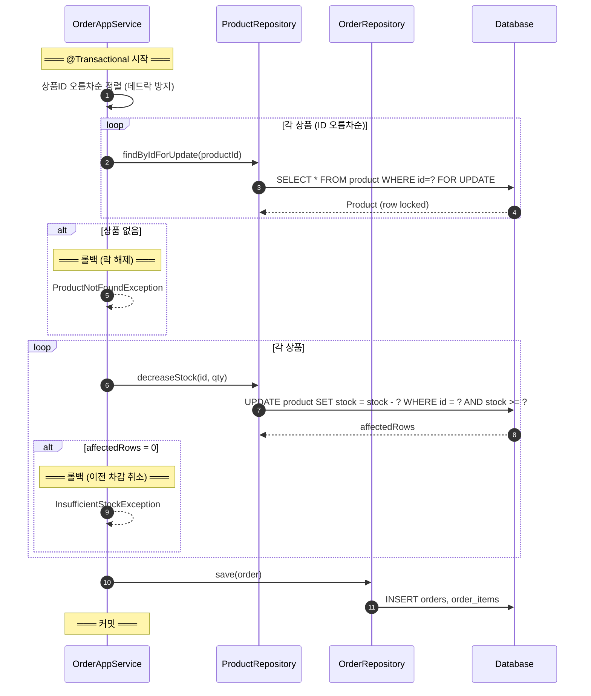
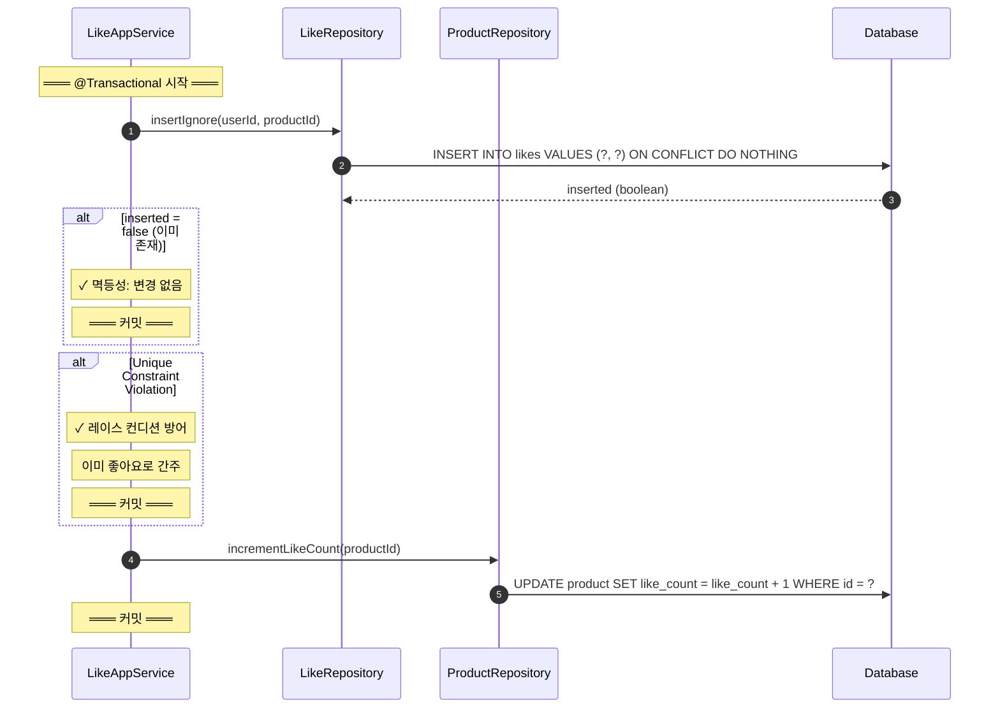
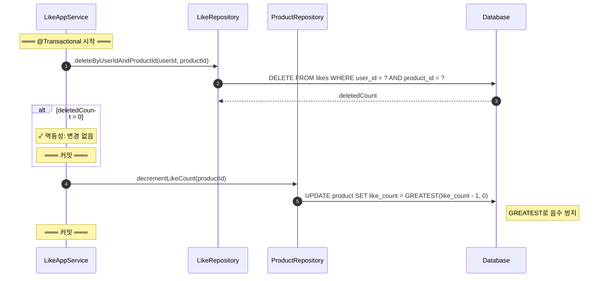
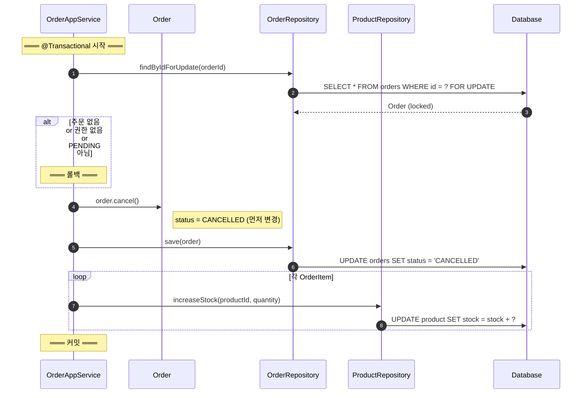

# 동시성 및 트랜잭션 상세

> 설계 검증용 문서. 동시성 제어, 트랜잭션 경계, DB 전략을 다룬다.
> 기본 흐름은 [02-sequence-diagrams.md](02-sequence-diagrams.md) 참조.

**전제**: 단일 애플리케이션, 단일 RDB 트랜잭션 환경.

---

## 설계 검증 체크리스트

| 검증 항목 | 확인 방법 |
|----------|----------|
| 트랜잭션 경계 | 시작/커밋/롤백이 명시되어 있는가 |
| 동시성 전략 | DB 레벨 방어가 있는가 |
| 롤백 보장 | 실패 시 어디까지 롤백되는지 보이는가 |
| 멱등성 | 레이스 컨디션 방어가 있는가 |

---

## 1. 주문 생성 - 동시성 상세

### 검증 포인트

- [ ] 데드락 방지
- [ ] 재고 동시 차감 방어
- [ ] 실패 시 전체 롤백

### 다이어그램



### 동시성 전략

| 전략 | 구현 | 목적 |
|------|------|------|
| 비관적 락 | `SELECT ... FOR UPDATE` | 검증-차감 사이 레이스 방지 |
| 락 순서 고정 | 상품ID 오름차순 | 데드락 방지 |
| 조건부 UPDATE | `WHERE stock >= ?` | DB 레벨 최종 방어 |

### 전략 선택 근거: 왜 이중 방어인가

현재 전략은 `FOR UPDATE`(비관적 락) + `WHERE stock >= ?`(조건부 UPDATE)의 이중 방어다.

**"조건부 UPDATE만으로 충분하지 않은가?"**

사실 조건부 UPDATE만으로도 재고 정합성은 깨지지 않는다.
`WHERE stock >= ?`가 DB 레벨에서 원자적으로 보장하기 때문이다.

```
FOR UPDATE 없이 조건부 UPDATE만 사용한 경우:

[주문A] UPDATE stock = stock - 5 WHERE stock >= 5 → affected=1 (성공)
[주문B] UPDATE stock = stock - 3 WHERE stock >= 3 → affected=1 (성공, 동시 실행 OK)
→ 정합성 유지됨 (두 UPDATE가 순차 적용)
```

**그럼에도 FOR UPDATE를 유지하는 이유:**

1. 재고 조회 → 검증 → 차감이 하나의 논리적 단위다. 조회한 재고값으로 비즈니스 검증(상품 존재, 삭제 여부 등)을 수행하므로, 검증 시점과 차감 시점 사이의 일관성이 필요하다
2. 현재 단일 RDB 환경에서 비관적 락의 비용이 크지 않다
3. 주문 상품 수 제한(권장 20개)으로 락 보유 시간을 통제한다

**확장 시 전략 전환:**

고트래픽 환경에서 락 기반 병목이 발생하면:
- `FOR UPDATE` 제거 → 조건부 UPDATE만으로 전환
- 재고 전용 테이블 분리 (상품 메타와 재고 분리)
- 이벤트 기반 재고 예약(Stock Reservation) 패턴 도입 가능

현재 구조는 조건부 UPDATE가 최종 방어선이므로, FOR UPDATE 제거 시에도 정합성은 유지된다.

### 동시 주문 시나리오

```
[주문A] SELECT FOR UPDATE → stock=10 (락)
[주문B] SELECT FOR UPDATE → 대기 (락 획득 불가)
[주문A] UPDATE stock=10-5=5 → 커밋 → 락 해제
[주문B] SELECT FOR UPDATE → stock=5 (락 획득)
[주문B] UPDATE stock=5-3=2 → 커밋
```

### 잠재 리스크

| 리스크 | 현재 대응 | 확장 전략 |
|--------|----------|----------|
| 트랜잭션 길어짐 | 상품 수 제한 (권장 20) | 재고 전용 테이블 분리 |
| 락 타임아웃 | DB 설정 권장 | 조건부 UPDATE만으로 전환 |
| 동일 상품 집중 주문 | 비관적 락 순차 처리 | 이벤트 기반 재고 예약 |

---

## 2. 좋아요 등록 - 멱등성 상세

### 검증 포인트

- [ ] 레이스 컨디션 방어
- [ ] 중복 요청 시 likeCount 정합성

### 다이어그램



### 멱등성 보장 방식

```
❌ 기존 (취약)
1. SELECT 존재 여부
2. 없으면 INSERT
→ 문제: 1과 2 사이에 동시 INSERT 가능

✅ 개선 (DB 레벨)
1. INSERT ON CONFLICT DO NOTHING
2. inserted 결과로 분기
→ 원자적 처리
```

### 동시 요청 시나리오

```
[요청A] INSERT ON CONFLICT → inserted=true → likeCount+1
[요청B] INSERT ON CONFLICT → inserted=false → 아무것도 안 함
→ 최종: 좋아요 1개, likeCount +1 (정확)
```

### Soft Delete 레이스 주의

좋아요 등록 트랜잭션 중 상품이 Soft Delete될 수 있다:

```
[좋아요] 상품 존재 확인 → OK
[어드민] 브랜드 삭제 → 상품 soft delete
[좋아요] INSERT 성공 → likeCount +1
→ 삭제된 상품에 좋아요가 생김
```

이는 논리적 오류가 아니다:
- 삭제된 상품의 좋아요는 유지된다 (BR-C05)
- 이미 좋아요 시점에는 상품이 존재했다
- 재조회 시 삭제된 상품이므로 고객에게 노출되지 않는다 (BR-C02)

상품 존재 확인에 `FOR UPDATE`를 거는 것은 과도하다.
좋아요는 경합이 높고 빈도가 잦은 연산이므로, 락 없이 최종 정합성만 보장하는 것이 적절하다.

---

## 3. 좋아요 취소 - 음수 방지

### 다이어그램



---

## 4. 주문 취소 - 상태 전이 상세

### 검증 포인트

- [ ] 동시 취소 방어
- [ ] 상태 변경 순서의 이유

### 다이어그램



### 상태 변경 순서의 이유

```
Q: 왜 상태 변경이 재고 복구보다 먼저인가?

[요청A] 락 획득 → status=CANCELLED
[요청B] 대기...
[요청A] 재고 복구 → 커밋 → 락 해제
[요청B] 락 획득 → canCancel() → status=CANCELLED → 실패

만약 재고 복구가 먼저라면?
[요청A] 재고 복구 중... (상태 아직 PENDING)
[요청B] 상태 검사 → PENDING → 통과 → 중복 복구 위험

∴ 상태 변경 → 재고 복구 순서가 안전
```

### 왜 재고 복구 시 Product에 락을 잡지 않는가

주문 취소의 재고 복구는 `stock = stock + ?`(증가 연산)이다.

**증가 연산의 특성:**
- 여러 트랜잭션이 동시에 `stock + ?`를 실행해도 각각 올바르게 반영된다
- 감소와 달리 "재고 부족" 같은 조건 검증이 불필요하다
- 결과의 손실이 발생하지 않는다 (DB가 순차 적용을 보장)

**반면 주문 생성의 재고 차감은:**
- `stock - ?`에 `WHERE stock >= ?` 조건이 있다
- 조회한 값 기준으로 검증 후 차감하므로, 검증-차감 사이 일관성이 필요하다
- 따라서 `FOR UPDATE`로 보호한다

**설계 원칙:** 락은 "검증-변경 사이 일관성이 필요한 곳"에만 건다. 조건 없는 증가 연산에 락을 거는 것은 불필요한 경합을 만든다.

---

## Repository 핵심 메서드

| Repository | 메서드 | SQL | 비즈니스 예외 |
|------------|--------|-----|-------------|
| ProductRepository | `findByIdForUpdate(id)` | `SELECT ... FOR UPDATE` | `ProductNotFoundException` |
| ProductRepository | `decreaseStock(id, qty)` | `UPDATE ... SET stock = stock - ? WHERE stock >= ?` | `InsufficientStockException` |
| ProductRepository | `incrementLikeCount(id)` | `UPDATE ... SET like_count = like_count + 1` | - |
| ProductRepository | `decrementLikeCount(id)` | `UPDATE ... SET like_count = GREATEST(like_count - 1, 0)` | - |
| LikeRepository | `insertIgnore(...)` | `INSERT ... ON CONFLICT DO NOTHING` | - |
| OrderRepository | `findByIdForUpdate(id)` | `SELECT ... FOR UPDATE` | `OrderNotFoundException` |

---

## 트랜잭션 경계 요약

| 흐름 | 시작 | 커밋 | 롤백 조건 |
|------|------|------|----------|
| 주문 생성 | AppService 진입 | 주문 저장 후 | 상품 없음, 재고 부족, 동시성 충돌 |
| 좋아요 등록 | AppService 진입 | likeCount 증가 후 | 상품 없음 |
| 좋아요 취소 | AppService 진입 | likeCount 감소 후 | - |
| 주문 취소 | AppService 진입 | 재고 복구 후 | 주문 없음, 권한 없음, 상태 불가 |

---

## 동시성 전략 요약

| 흐름 | 전략 | 구현 | 트레이드오프 |
|------|------|------|------------|
| 주문 생성 | 비관적 락 + 조건부 UPDATE | `FOR UPDATE` + `WHERE stock >= ?` | 안전하지만 락 경합 가능. 조건부 UPDATE만으로 전환 가능 |
| 좋아요 등록 | DB 레벨 멱등성 | `INSERT ON CONFLICT DO NOTHING` | 락 없이 원자적 처리. Soft Delete 레이스는 허용 |
| 좋아요 취소 | affected count | `DELETE` 후 count 확인 | 락 없이 멱등 보장 |
| 주문 취소 | 비관적 락 | `FOR UPDATE` (Order만) | Product 락 불필요 (증가 연산) |
