# 시퀀스 다이어그램

전체 API에 대한 호출 흐름을 레이어드 아키텍처 참여자, 트랜잭션 경계, 예외 분기를 포함하여 정리한다.
구성 순서는 요구사항 명세(01-requirements.md)의 도메인 순서를 따른다.

### 공통 규칙

- **트랜잭션 경계**: Service는 변경 작업에 `@Transactional` 필수 적용. Facade는 여러 Service를 조합하여 원자성이 필요한 경우에만 선택적 적용.
- **인증된 사용자 식별**: AuthInterceptor가 request에 userId 설정 → `AuthUserArgumentResolver`가 `@AuthUser userId: Long` 파라미터에 주입.
- **어드민 인증**: AdminInterceptor가 `X-Loopers-Ldap` 헤더를 검증한다. `/api-admin/**` 경로에 적용.
- **soft delete 조회**: `@Where` 미사용. Repository 메서드마다 `deletedAt IS NULL` 조건을 명시적으로 추가.
- **같은 상품 중복 주문**: 같은 productId가 여러 항목에 포함되면 수량을 합산하여 하나의 항목으로 병합.

---

## 1. 브랜드 & 상품 — 대고객 API

### 1.1 브랜드 정보 조회

`GET /api/v1/brands/{brandId}` — 인증 불필요

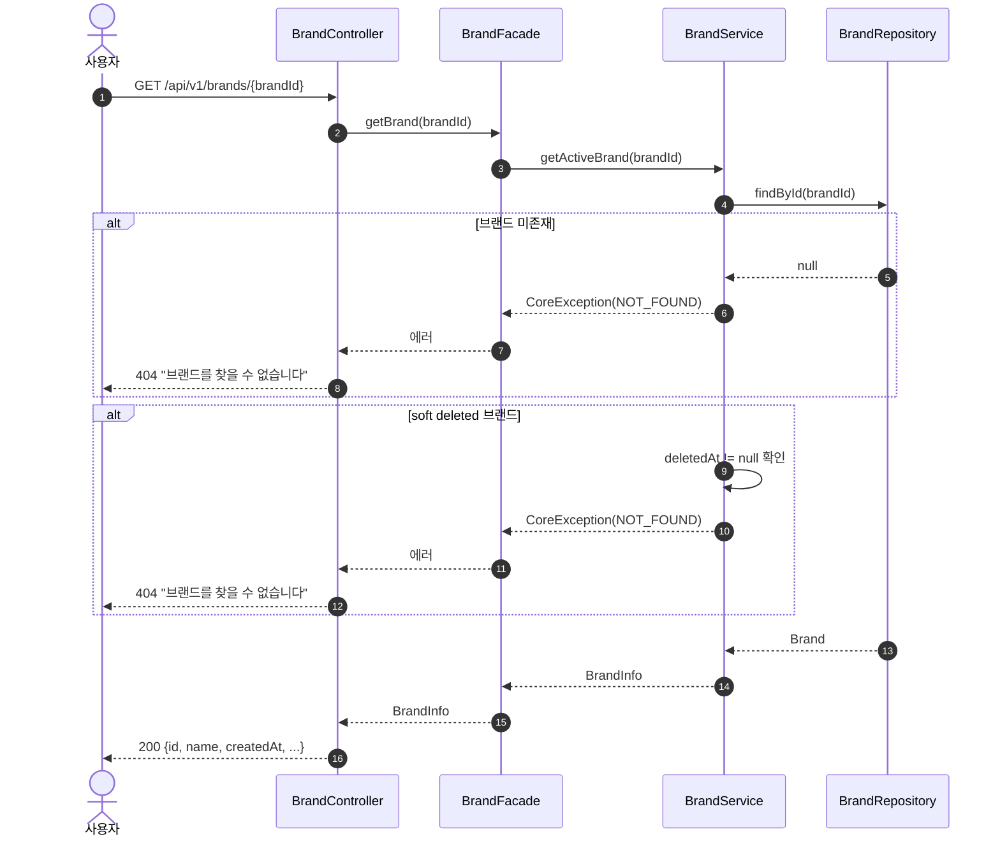
```mermaid
sequenceDiagram
    autonumber
    actor User as 사용자
    participant C as BrandController
    participant F as BrandFacade
    participant BS as BrandService
    participant BR as BrandRepository
    User ->> C: GET /api/v1/brands/{brandId}
    C ->> F: getBrand(brandId)
    F ->> BS: getActiveBrand(brandId)
    BS ->> BR: findById(brandId)

    alt 브랜드 미존재
        BR -->> BS: null
        BS -->> F: CoreException(NOT_FOUND)
        F -->> C: 에러
        C -->> User: 404 "브랜드를 찾을 수 없습니다"
    end

    alt soft deleted 브랜드
        BS ->> BS: deletedAt != null 확인
        BS -->> F: CoreException(NOT_FOUND)
        F -->> C: 에러
        C -->> User: 404 "브랜드를 찾을 수 없습니다"
    end

    BR -->> BS: Brand
    BS -->> F: BrandInfo
    F -->> C: BrandInfo
    C -->> User: 200 {id, name, createdAt, ...}
```

### 1.2 상품 목록 조회

`GET /api/v1/products?brandId=1&sort=likes_desc&page=0&size=20` — 인증 불필요

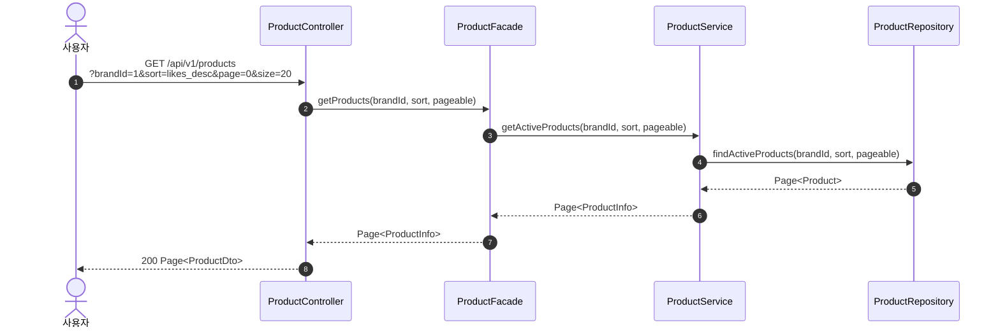
```mermaid
sequenceDiagram
    autonumber
    actor User as 사용자
    participant C as ProductController
    participant F as ProductFacade
    participant PS as ProductService
    participant PR as ProductRepository
    User ->> C: GET /api/v1/products<br/>?brandId=1&sort=likes_desc&page=0&size=20
    C ->> F: getProducts(brandId, sort, pageable)
    F ->> PS: getActiveProducts(brandId, sort, pageable)
    PS ->> PR: findActiveProducts(brandId, sort, pageable)
    PR -->> PS: Page<Product>
    PS -->> F: Page<ProductInfo>
    F -->> C: Page<ProductInfo>
    C -->> User: 200 Page<ProductDto>
```

### 참고

- Repository 쿼리: `WHERE deletedAt IS NULL AND status != 'HIDDEN' AND (brandId = :brandId OR :brandId IS NULL) ORDER BY likeCount DESC LIMIT 20 OFFSET 0`
- 응답에 페이징 메타데이터 포함: content, totalElements, totalPages, number, size

### 1.3 상품 상세 조회

`GET /api/v1/products/{productId}` — 인증 불필요

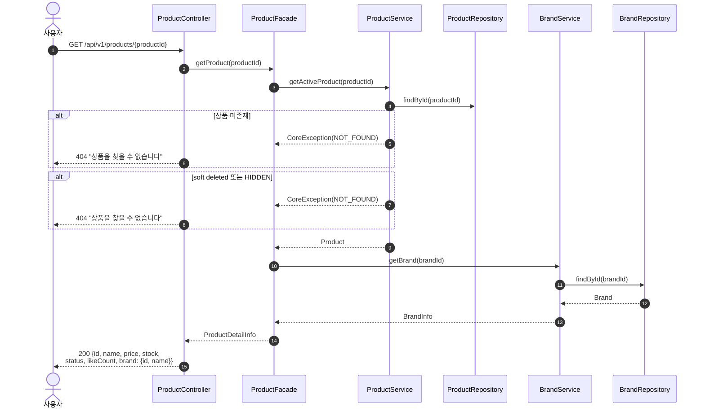
```mermaid
sequenceDiagram
    autonumber
    actor User as 사용자
    participant C as ProductController
    participant F as ProductFacade
    participant PS as ProductService
    participant PR as ProductRepository
    participant BS as BrandService
    participant BR as BrandRepository
    User ->> C: GET /api/v1/products/{productId}
    C ->> F: getProduct(productId)
    F ->> PS: getActiveProduct(productId)
    PS ->> PR: findById(productId)

    alt 상품 미존재
        PS -->> F: CoreException(NOT_FOUND)
        C -->> User: 404 "상품을 찾을 수 없습니다"
    end

    alt soft deleted 또는 HIDDEN
        PS -->> F: CoreException(NOT_FOUND)
        C -->> User: 404 "상품을 찾을 수 없습니다"
    end

    PS -->> F: Product
    F ->> BS: getBrand(brandId)
    BS ->> BR: findById(brandId)
    BR -->> BS: Brand
    BS -->> F: BrandInfo
    F -->> C: ProductDetailInfo
    C -->> User: 200 {id, name, price, stock,<br/>status, likeCount, brand: {id, name}}
```

---

## 2. 브랜드 & 상품 — 어드민 API

### 2.1 브랜드 목록 조회

`GET /api-admin/v1/brands?page=0&size=20` — LDAP 인증 필요

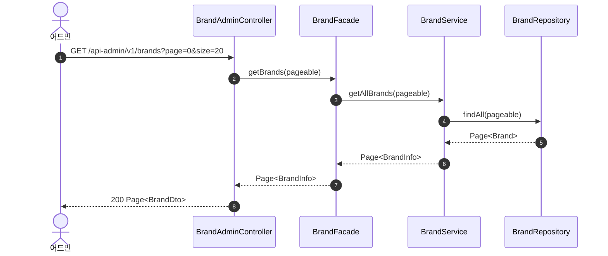
```mermaid
sequenceDiagram
    autonumber
    actor Admin as 어드민
    participant C as BrandAdminController
    participant F as BrandFacade
    participant BS as BrandService
    participant BR as BrandRepository
    Admin ->> C: GET /api-admin/v1/brands?page=0&size=20
    C ->> F: getBrands(pageable)
    F ->> BS: getAllBrands(pageable)
    BS ->> BR: findAll(pageable)
    BR -->> BS: Page<Brand>
    BS -->> F: Page<BrandInfo>
    F -->> C: Page<BrandInfo>
    C -->> Admin: 200 Page<BrandDto>
```

### 참고

- 어드민 목록 조회는 삭제된 브랜드 포함 (필터 없음)

### 2.2 브랜드 상세 조회

`GET /api-admin/v1/brands/{brandId}` — LDAP 인증 필요

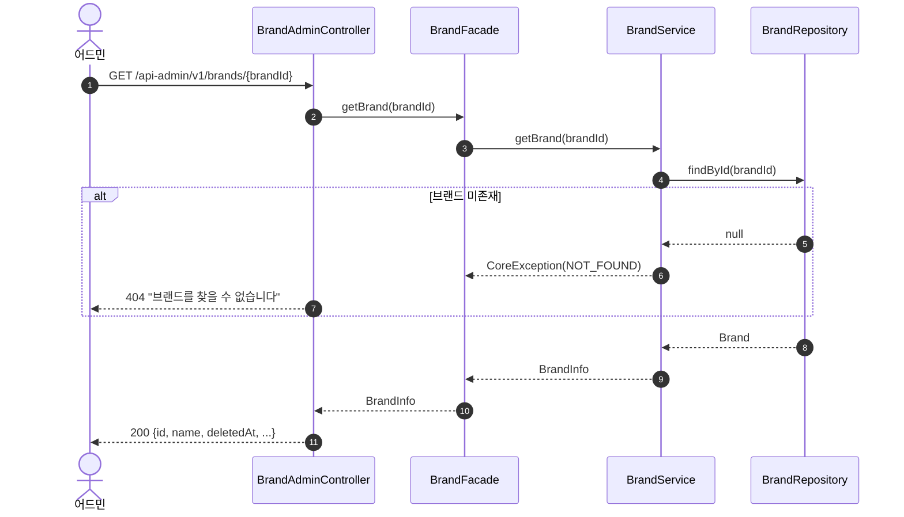
```mermaid
sequenceDiagram
    autonumber
    actor Admin as 어드민
    participant C as BrandAdminController
    participant F as BrandFacade
    participant BS as BrandService
    participant BR as BrandRepository
    Admin ->> C: GET /api-admin/v1/brands/{brandId}
    C ->> F: getBrand(brandId)
    F ->> BS: getBrand(brandId)
    BS ->> BR: findById(brandId)

    alt 브랜드 미존재
        BR -->> BS: null
        BS -->> F: CoreException(NOT_FOUND)
        C -->> Admin: 404 "브랜드를 찾을 수 없습니다"
    end

    BR -->> BS: Brand
    BS -->> F: BrandInfo
    F -->> C: BrandInfo
    C -->> Admin: 200 {id, name, deletedAt, ...}
```

### 참고

- 어드민은 삭제된 브랜드도 조회 가능 (삭제 상태 확인 목적)

### 2.3 브랜드 등록

`POST /api-admin/v1/brands` — LDAP 인증 필요

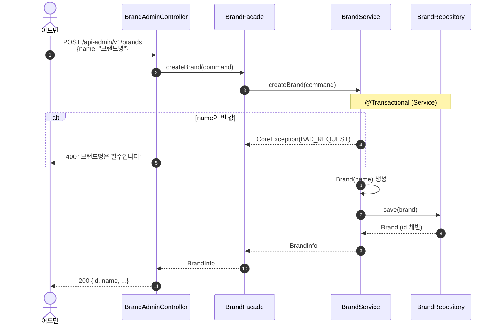
```mermaid
sequenceDiagram
    autonumber
    actor Admin as 어드민
    participant C as BrandAdminController
    participant F as BrandFacade
    participant BS as BrandService
    participant BR as BrandRepository
    Admin ->> C: POST /api-admin/v1/brands<br/>{name: "브랜드명"}
    C ->> F: createBrand(command)
    F ->> BS: createBrand(command)

    Note over BS, BR: @Transactional (Service)

    alt name이 빈 값
        BS -->> F: CoreException(BAD_REQUEST)
        C -->> Admin: 400 "브랜드명은 필수입니다"
    end

    BS ->> BS: Brand(name) 생성
    BS ->> BR: save(brand)
    BR -->> BS: Brand (id 채번)

    BS -->> F: BrandInfo
    F -->> C: BrandInfo
    C -->> Admin: 200 {id, name, ...}
```

### 2.4 브랜드 수정

`PUT /api-admin/v1/brands/{brandId}` — LDAP 인증 필요

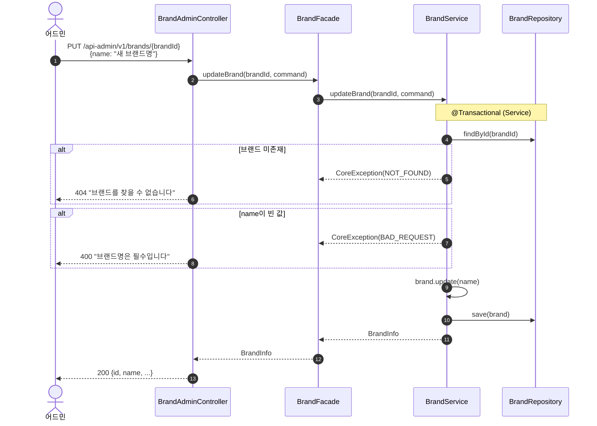
```mermaid
sequenceDiagram
    autonumber
    actor Admin as 어드민
    participant C as BrandAdminController
    participant F as BrandFacade
    participant BS as BrandService
    participant BR as BrandRepository
    Admin ->> C: PUT /api-admin/v1/brands/{brandId}<br/>{name: "새 브랜드명"}
    C ->> F: updateBrand(brandId, command)
    F ->> BS: updateBrand(brandId, command)

    Note over BS, BR: @Transactional (Service)
    BS ->> BR: findById(brandId)

    alt 브랜드 미존재
        BS -->> F: CoreException(NOT_FOUND)
        C -->> Admin: 404 "브랜드를 찾을 수 없습니다"
    end

    alt name이 빈 값
        BS -->> F: CoreException(BAD_REQUEST)
        C -->> Admin: 400 "브랜드명은 필수입니다"
    end

    BS ->> BS: brand.update(name)
    BS ->> BR: save(brand)

    BS -->> F: BrandInfo
    F -->> C: BrandInfo
    C -->> Admin: 200 {id, name, ...}
```

### 2.5 브랜드 삭제 (cascade soft delete)

`DELETE /api-admin/v1/brands/{brandId}` — LDAP 인증 필요

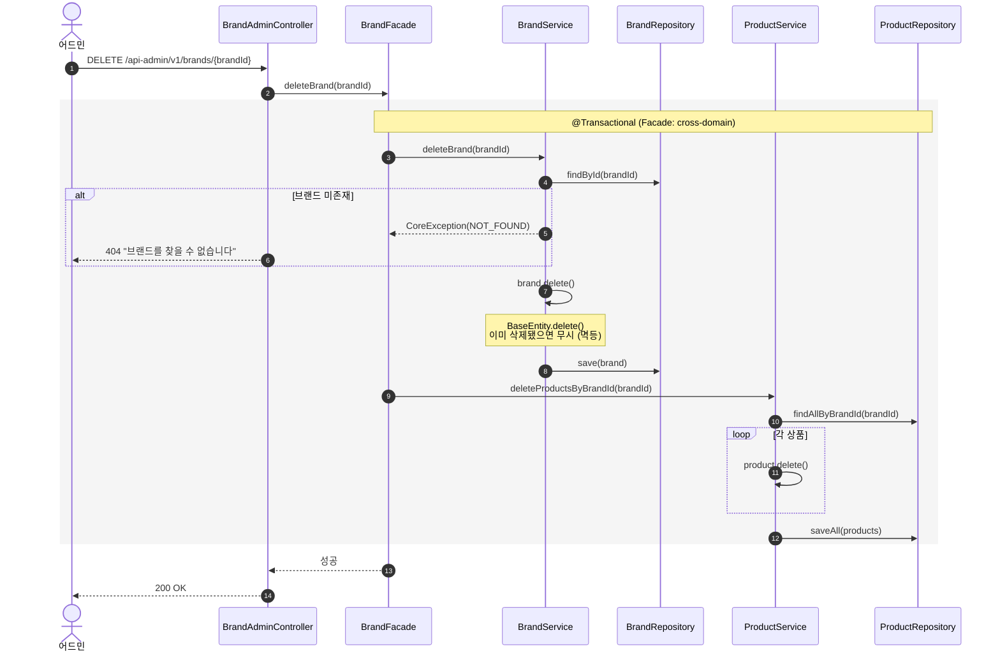
```mermaid
sequenceDiagram
    autonumber
    actor Admin as 어드민
    participant C as BrandAdminController
    participant F as BrandFacade
    participant BS as BrandService
    participant BR as BrandRepository
    participant PS as ProductService
    participant PR as ProductRepository
    Admin ->> C: DELETE /api-admin/v1/brands/{brandId}
    C ->> F: deleteBrand(brandId)

    rect rgb(245, 245, 245)
        Note over F, PR: @Transactional (Facade: cross-domain)
        F ->> BS: deleteBrand(brandId)
        BS ->> BR: findById(brandId)

        alt 브랜드 미존재
            BS -->> F: CoreException(NOT_FOUND)
            C -->> Admin: 404 "브랜드를 찾을 수 없습니다"
        end

        BS ->> BS: brand.delete()
        Note over BS: BaseEntity.delete()<br/>이미 삭제됐으면 무시 (멱등)
        BS ->> BR: save(brand)
        F ->> PS: deleteProductsByBrandId(brandId)
        PS ->> PR: findAllByBrandId(brandId)
        loop 각 상품
            PS ->> PS: product.delete()
        end
        PS ->> PR: saveAll(products)
    end

    F -->> C: 성공
    C -->> Admin: 200 OK
```

### 참고

- 브랜드 삭제 시 해당 브랜드의 모든 상품도 cascade로 soft delete
- 기존 주문의 OrderItem 스냅샷은 Product와 무관하게 보존됨

### 2.6 상품 목록 조회

`GET /api-admin/v1/products?page=0&size=20&brandId={brandId}` — LDAP 인증 필요

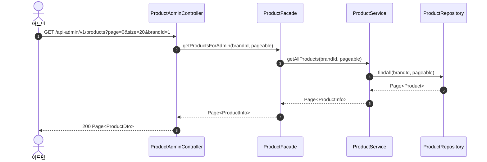
```mermaid
sequenceDiagram
    autonumber
    actor Admin as 어드민
    participant C as ProductAdminController
    participant F as ProductFacade
    participant PS as ProductService
    participant PR as ProductRepository
    Admin ->> C: GET /api-admin/v1/products?page=0&size=20&brandId=1
    C ->> F: getProductsForAdmin(brandId, pageable)
    F ->> PS: getAllProducts(brandId, pageable)
    PS ->> PR: findAll(brandId, pageable)
    PR -->> PS: Page<Product>
    PS -->> F: Page<ProductInfo>
    F -->> C: Page<ProductInfo>
    C -->> Admin: 200 Page<ProductDto>
```

### 참고

- 어드민 목록 조회는 삭제된 상품 포함 (필터 없음)

### 2.7 상품 상세 조회

`GET /api-admin/v1/products/{productId}` — LDAP 인증 필요

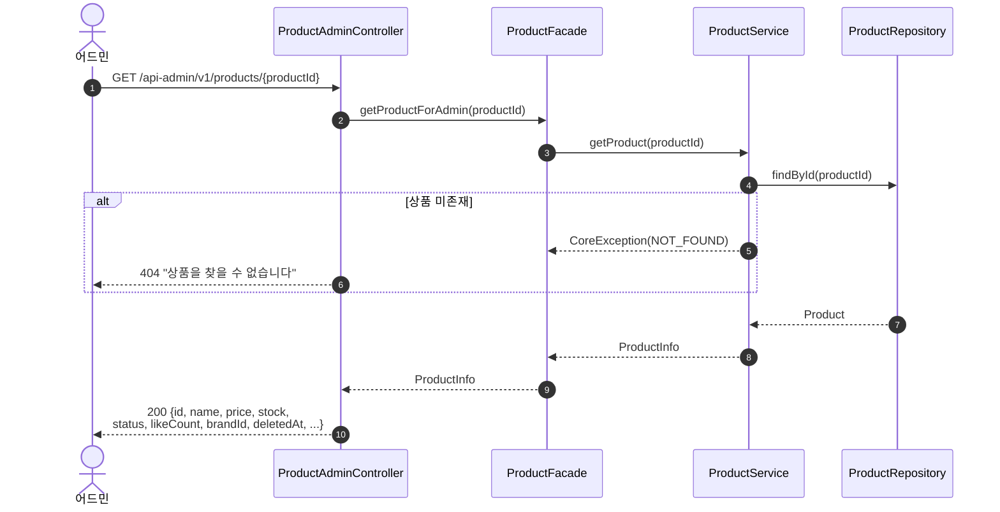
```mermaid
sequenceDiagram
    autonumber
    actor Admin as 어드민
    participant C as ProductAdminController
    participant F as ProductFacade
    participant PS as ProductService
    participant PR as ProductRepository
    Admin ->> C: GET /api-admin/v1/products/{productId}
    C ->> F: getProductForAdmin(productId)
    F ->> PS: getProduct(productId)
    PS ->> PR: findById(productId)

    alt 상품 미존재
        PS -->> F: CoreException(NOT_FOUND)
        C -->> Admin: 404 "상품을 찾을 수 없습니다"
    end

    PR -->> PS: Product
    PS -->> F: ProductInfo
    F -->> C: ProductInfo
    C -->> Admin: 200 {id, name, price, stock,<br/>status, likeCount, brandId, deletedAt, ...}
```

### 참고

- 어드민은 삭제된 상품도 조회 가능 (삭제 상태 확인 목적)

### 2.8 상품 등록

`POST /api-admin/v1/products` — LDAP 인증 필요

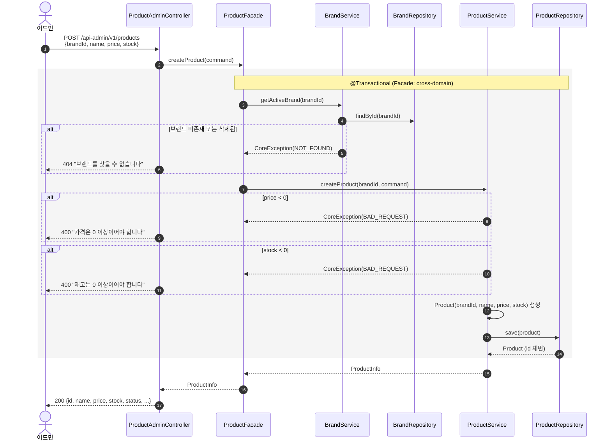
```mermaid
sequenceDiagram
    autonumber
    actor Admin as 어드민
    participant C as ProductAdminController
    participant F as ProductFacade
    participant BS as BrandService
    participant BR as BrandRepository
    participant PS as ProductService
    participant PR as ProductRepository
    Admin ->> C: POST /api-admin/v1/products<br/>{brandId, name, price, stock}
    C ->> F: createProduct(command)

    rect rgb(245, 245, 245)
        Note over F, PR: @Transactional (Facade: cross-domain)
        F ->> BS: getActiveBrand(brandId)
        BS ->> BR: findById(brandId)

        alt 브랜드 미존재 또는 삭제됨
            BS -->> F: CoreException(NOT_FOUND)
            C -->> Admin: 404 "브랜드를 찾을 수 없습니다"
        end

        F ->> PS: createProduct(brandId, command)

        alt price < 0
            PS -->> F: CoreException(BAD_REQUEST)
            C -->> Admin: 400 "가격은 0 이상이어야 합니다"
        end

        alt stock < 0
            PS -->> F: CoreException(BAD_REQUEST)
            C -->> Admin: 400 "재고는 0 이상이어야 합니다"
        end

        PS ->> PS: Product(brandId, name, price, stock) 생성
        PS ->> PR: save(product)
        PR -->> PS: Product (id 채번)
    end

    PS -->> F: ProductInfo
    F -->> C: ProductInfo
    C -->> Admin: 200 {id, name, price, stock, status, ...}
```

### 2.9 상품 수정

`PUT /api-admin/v1/products/{productId}` — LDAP 인증 필요

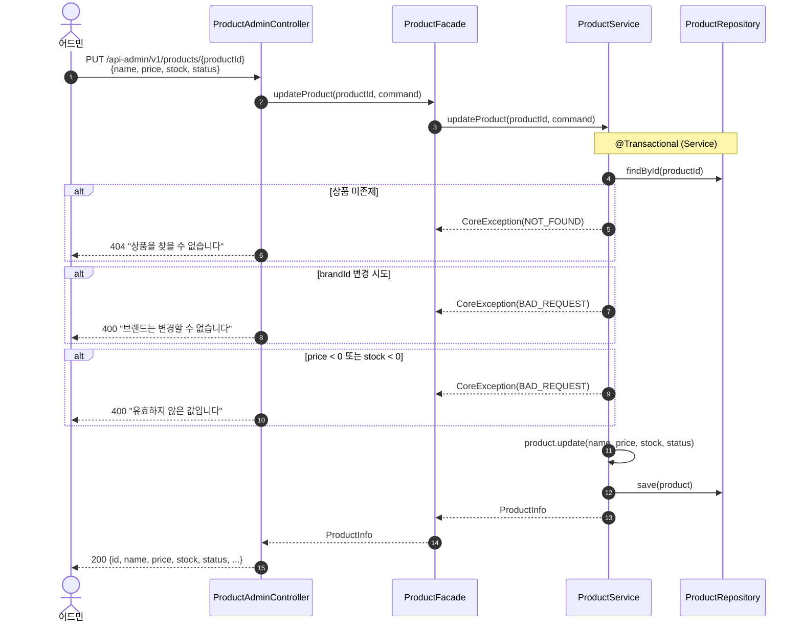
```mermaid
sequenceDiagram
    autonumber
    actor Admin as 어드민
    participant C as ProductAdminController
    participant F as ProductFacade
    participant PS as ProductService
    participant PR as ProductRepository
    Admin ->> C: PUT /api-admin/v1/products/{productId}<br/>{name, price, stock, status}
    C ->> F: updateProduct(productId, command)
    F ->> PS: updateProduct(productId, command)

    Note over PS, PR: @Transactional (Service)
    PS ->> PR: findById(productId)

    alt 상품 미존재
        PS -->> F: CoreException(NOT_FOUND)
        C -->> Admin: 404 "상품을 찾을 수 없습니다"
    end

    alt brandId 변경 시도
        PS -->> F: CoreException(BAD_REQUEST)
        C -->> Admin: 400 "브랜드는 변경할 수 없습니다"
    end

    alt price < 0 또는 stock < 0
        PS -->> F: CoreException(BAD_REQUEST)
        C -->> Admin: 400 "유효하지 않은 값입니다"
    end

    PS ->> PS: product.update(name, price, stock, status)
    PS ->> PR: save(product)

    PS -->> F: ProductInfo
    F -->> C: ProductInfo
    C -->> Admin: 200 {id, name, price, stock, status, ...}
```

### 2.10 상품 삭제

`DELETE /api-admin/v1/products/{productId}` — LDAP 인증 필요

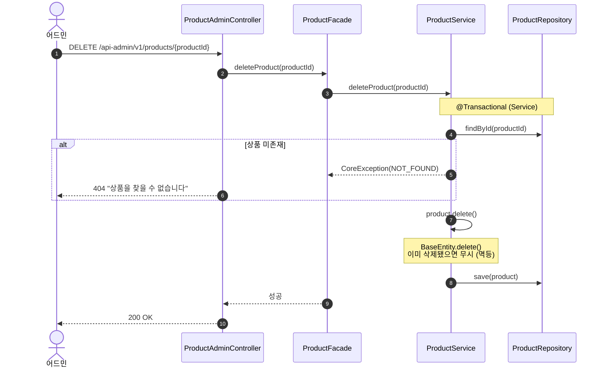
```mermaid
sequenceDiagram
    autonumber
    actor Admin as 어드민
    participant C as ProductAdminController
    participant F as ProductFacade
    participant PS as ProductService
    participant PR as ProductRepository
    Admin ->> C: DELETE /api-admin/v1/products/{productId}
    C ->> F: deleteProduct(productId)
    F ->> PS: deleteProduct(productId)

    Note over PS, PR: @Transactional (Service)
    PS ->> PR: findById(productId)

    alt 상품 미존재
        PS -->> F: CoreException(NOT_FOUND)
        C -->> Admin: 404 "상품을 찾을 수 없습니다"
    end

    PS ->> PS: product.delete()
    Note over PS: BaseEntity.delete()<br/>이미 삭제됐으면 무시 (멱등)
    PS ->> PR: save(product)

    F -->> C: 성공
    C -->> Admin: 200 OK
```

---

## 3. 좋아요

### 3.1 좋아요 등록 (멱등)

`POST /api/v1/products/{productId}/likes` — 인증 필요

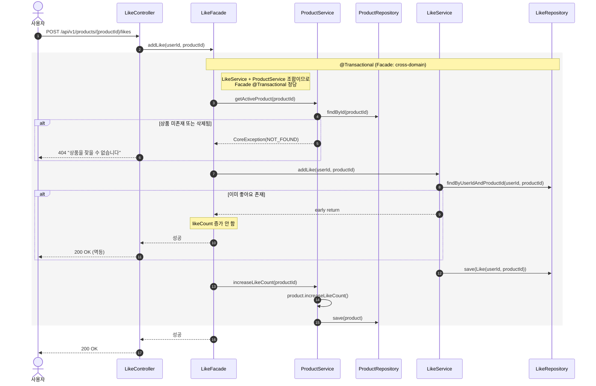
```mermaid
sequenceDiagram
    autonumber
    actor User as 사용자
    participant C as LikeController
    participant F as LikeFacade
    participant PS as ProductService
    participant PR as ProductRepository
    participant LS as LikeService
    participant LR as LikeRepository
    User ->> C: POST /api/v1/products/{productId}/likes
    C ->> F: addLike(userId, productId)

    rect rgb(245, 245, 245)
        Note over F, LR: @Transactional (Facade: cross-domain)
        Note right of F: LikeService + ProductService 조합이므로<br/>Facade @Transactional 정당
        F ->> PS: getActiveProduct(productId)
        PS ->> PR: findById(productId)

        alt 상품 미존재 또는 삭제됨
            PS -->> F: CoreException(NOT_FOUND)
            C -->> User: 404 "상품을 찾을 수 없습니다"
        end

        F ->> LS: addLike(userId, productId)
        LS ->> LR: findByUserIdAndProductId(userId, productId)

        alt 이미 좋아요 존재
            LS -->> F: early return
            Note over F: likeCount 증가 안 함
            F -->> C: 성공
            C -->> User: 200 OK (멱등)
        end

        LS ->> LR: save(Like(userId, productId))
        F ->> PS: increaseLikeCount(productId)
        PS ->> PS: product.increaseLikeCount()
        PS ->> PR: save(product)
    end

    F -->> C: 성공
    C -->> User: 200 OK
```

### 3.2 좋아요 취소 (멱등)

`DELETE /api/v1/products/{productId}/likes` — 인증 필요

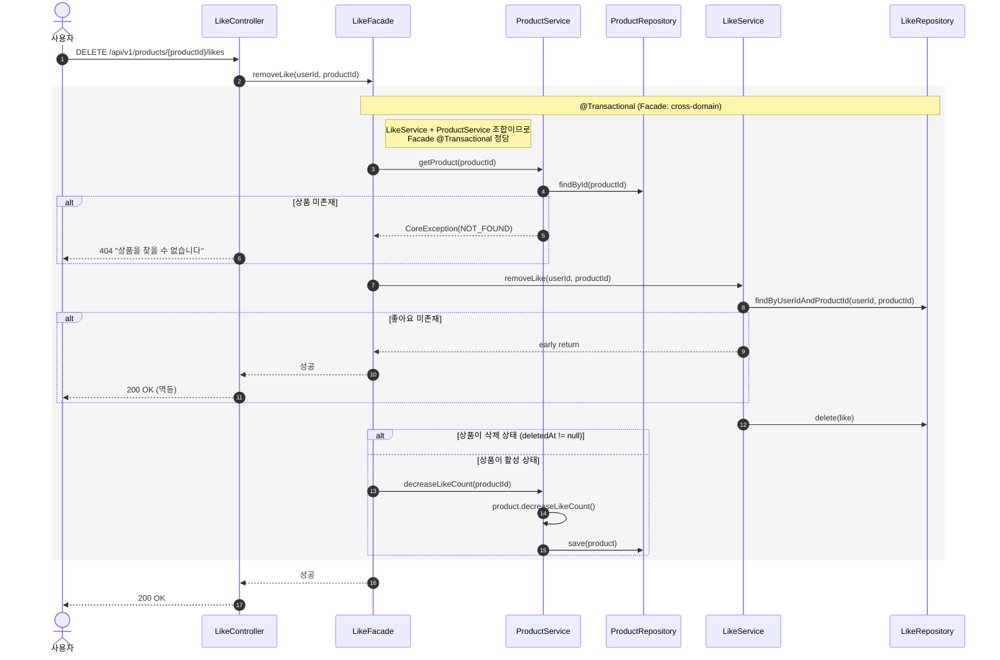
```mermaid
sequenceDiagram
    autonumber
    actor User as 사용자
    participant C as LikeController
    participant F as LikeFacade
    participant PS as ProductService
    participant PR as ProductRepository
    participant LS as LikeService
    participant LR as LikeRepository
    User ->> C: DELETE /api/v1/products/{productId}/likes
    C ->> F: removeLike(userId, productId)

    rect rgb(245, 245, 245)
        Note over F, LR: @Transactional (Facade: cross-domain)
        Note right of F: LikeService + ProductService 조합이므로<br/>Facade @Transactional 정당
        F ->> PS: getProduct(productId)
        PS ->> PR: findById(productId)

        alt 상품 미존재
            PS -->> F: CoreException(NOT_FOUND)
            C -->> User: 404 "상품을 찾을 수 없습니다"
        end

        F ->> LS: removeLike(userId, productId)
        LS ->> LR: findByUserIdAndProductId(userId, productId)

        alt 좋아요 미존재
            LS -->> F: early return
            F -->> C: 성공
            C -->> User: 200 OK (멱등)
        end

        LS ->> LR: delete(like)

        alt 상품이 삭제 상태 (deletedAt != null)
        else 상품이 활성 상태
            F ->> PS: decreaseLikeCount(productId)
            PS ->> PS: product.decreaseLikeCount()
            PS ->> PR: save(product)
        end
    end

    F -->> C: 성공
    C -->> User: 200 OK
```

### 참고

- 상품이 삭제 상태인 경우 likeCount 갱신하지 않음 (삭제된 상품이므로)

### 3.3 좋아요 목록 조회

`GET /api/v1/users/{userId}/likes` — 인증 필요

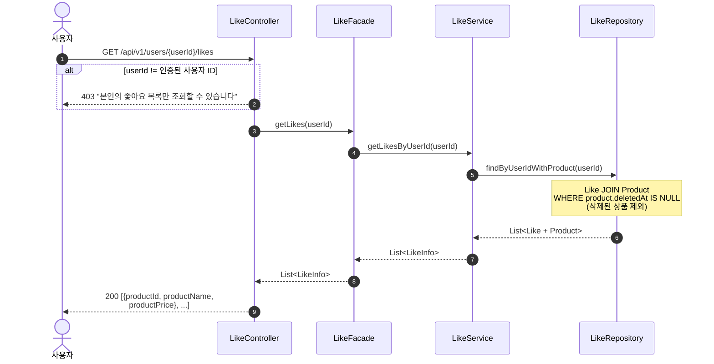
```mermaid
sequenceDiagram
    autonumber
    actor User as 사용자
    participant C as LikeController
    participant F as LikeFacade
    participant LS as LikeService
    participant LR as LikeRepository
    User ->> C: GET /api/v1/users/{userId}/likes

    alt userId != 인증된 사용자 ID
        C -->> User: 403 "본인의 좋아요 목록만 조회할 수 있습니다"
    end

    C ->> F: getLikes(userId)
    F ->> LS: getLikesByUserId(userId)
    LS ->> LR: findByUserIdWithProduct(userId)
    Note over LR: Like JOIN Product<br/>WHERE product.deletedAt IS NULL<br/>(삭제된 상품 제외)
    LR -->> LS: List<Like + Product>
    LS -->> F: List<LikeInfo>
    F -->> C: List<LikeInfo>
    C -->> User: 200 [{productId, productName,<br/>productPrice}, ...]
```

### 참고

- Repository 쿼리: `Like JOIN Product WHERE product.deletedAt IS NULL` (삭제된 상품 제외)

---

## 4. 주문 — 대고객 API

### 4.1 주문 생성

`POST /api/v1/orders` — 인증 필요

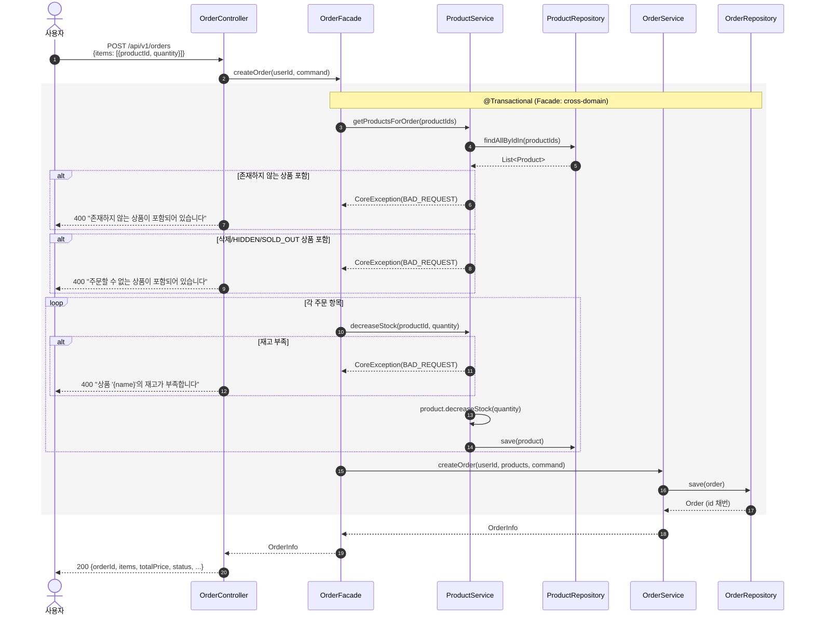
```mermaid
sequenceDiagram
    autonumber
    actor User as 사용자
    participant C as OrderController
    participant F as OrderFacade
    participant PS as ProductService
    participant PR as ProductRepository
    participant OS as OrderService
    participant OR as OrderRepository
    User ->> C: POST /api/v1/orders<br/>{items: [{productId, quantity}]}
    C ->> F: createOrder(userId, command)

    rect rgb(245, 245, 245)
        Note over F, OR: @Transactional (Facade: cross-domain)
    %% 1단계: 상품 존재 + 판매 가능 상태 확인
        F ->> PS: getProductsForOrder(productIds)
        PS ->> PR: findAllByIdIn(productIds)
        PR -->> PS: List<Product>

        alt 존재하지 않는 상품 포함
            PS -->> F: CoreException(BAD_REQUEST)
            C -->> User: 400 "존재하지 않는 상품이 포함되어 있습니다"
        end

        alt 삭제/HIDDEN/SOLD_OUT 상품 포함
            PS -->> F: CoreException(BAD_REQUEST)
            C -->> User: 400 "주문할 수 없는 상품이 포함되어 있습니다"
        end

    %% 2단계: 재고 확인 + 차감
        loop 각 주문 항목
            F ->> PS: decreaseStock(productId, quantity)

            alt 재고 부족
                PS -->> F: CoreException(BAD_REQUEST)
                C -->> User: 400 "상품 '{name}'의 재고가 부족합니다"
            end

            PS ->> PS: product.decreaseStock(quantity)
            PS ->> PR: save(product)
        end

    %% 3단계: 주문 생성 + 스냅샷
        F ->> OS: createOrder(userId, products, command)
        OS ->> OR: save(order)
        OR -->> OS: Order (id 채번)
    end

    OS -->> F: OrderInfo
    F -->> C: OrderInfo
    C -->> User: 200 {orderId, items, totalPrice, status, ...}
```

### 참고

- 재고 부족 시 트랜잭션 롤백으로 이전 차감 모두 원복

### 4.2 주문 목록 조회

`GET /api/v1/orders?startedAt=2026-01-31T00:00:00&endedAt=2026-02-10T00:00:00` — 인증 필요

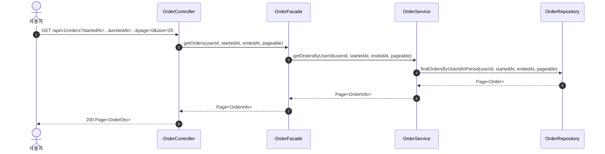
```mermaid
sequenceDiagram
    autonumber
    actor User as 사용자
    participant C as OrderController
    participant F as OrderFacade
    participant OS as OrderService
    participant OR as OrderRepository
    User ->> C: GET /api/v1/orders?startedAt=...&endedAt=...&page=0&size=20
    C ->> F: getOrders(userId, startedAt, endedAt, pageable)
    F ->> OS: getOrdersByUserId(userId, startedAt, endedAt, pageable)
    OS ->> OR: findOrdersByUserIdInPeriod(userId, startedAt, endedAt, pageable)
    OR -->> OS: Page<Order>
    OS -->> F: Page<OrderInfo>
    F -->> C: Page<OrderInfo>
    C -->> User: 200 Page<OrderDto>
```

### 참고

- startedAt/endedAt 미입력 시 기본값: 최근 1달 (LocalDateTime)
- Repository 쿼리: `WHERE userId = :userId AND createdAt >= :startedAt AND createdAt < :endedAt ORDER BY createdAt DESC`
- 응답 항목: orderId, status, totalPrice, itemCount, createdAt 등

### 4.3 주문 상세 조회

`GET /api/v1/orders/{orderId}` — 인증 필요

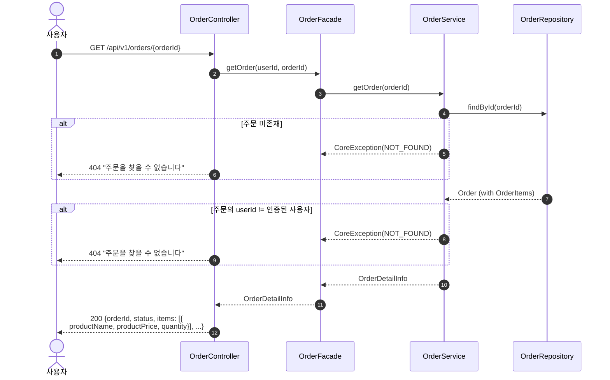
```mermaid
sequenceDiagram
    autonumber
    actor User as 사용자
    participant C as OrderController
    participant F as OrderFacade
    participant OS as OrderService
    participant OR as OrderRepository
    User ->> C: GET /api/v1/orders/{orderId}
    C ->> F: getOrder(userId, orderId)
    F ->> OS: getOrder(orderId)
    OS ->> OR: findById(orderId)

    alt 주문 미존재
        OS -->> F: CoreException(NOT_FOUND)
        C -->> User: 404 "주문을 찾을 수 없습니다"
    end

    OR -->> OS: Order (with OrderItems)

    alt 주문의 userId != 인증된 사용자
        OS -->> F: CoreException(NOT_FOUND)
        C -->> User: 404 "주문을 찾을 수 없습니다"
    end

    OS -->> F: OrderDetailInfo
    F -->> C: OrderDetailInfo
    C -->> User: 200 {orderId, status, items: [{<br/>productName, productPrice, quantity}], ...}
```

### 참고

- 타인 주문 접근 시 403이 아닌 404 반환 (주문 존재 여부 노출 방지)

---

## 5. 주문 — 어드민 API

### 5.1 주문 목록 조회

`GET /api-admin/v1/orders?page=0&size=20` — LDAP 인증 필요

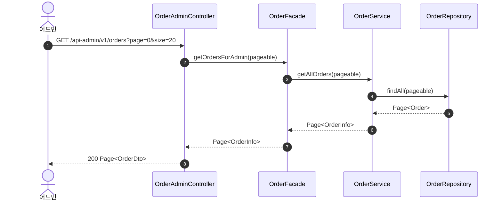
```mermaid
sequenceDiagram
    autonumber
    actor Admin as 어드민
    participant C as OrderAdminController
    participant F as OrderFacade
    participant OS as OrderService
    participant OR as OrderRepository
    Admin ->> C: GET /api-admin/v1/orders?page=0&size=20
    C ->> F: getOrdersForAdmin(pageable)
    F ->> OS: getAllOrders(pageable)
    OS ->> OR: findAll(pageable)
    OR -->> OS: Page<Order>
    OS -->> F: Page<OrderInfo>
    F -->> C: Page<OrderInfo>
    C -->> Admin: 200 Page<OrderDto>
```

### 참고

- 어드민은 전체 주문 조회 (userId 필터 없음)

### 5.2 주문 상세 조회

`GET /api-admin/v1/orders/{orderId}` — LDAP 인증 필요

```mermaid
sequenceDiagram
    autonumber
    actor Admin as 어드민
    participant C as OrderAdminController
    participant F as OrderFacade
    participant OS as OrderService
    participant OR as OrderRepository
    Admin ->> C: GET /api-admin/v1/orders/{orderId}
    C ->> F: getOrderForAdmin(orderId)
    F ->> OS: getOrder(orderId)
    OS ->> OR: findById(orderId)

    alt 주문 미존재
        OS -->> F: CoreException(NOT_FOUND)
        C -->> Admin: 404 "주문을 찾을 수 없습니다"
    end

    OR -->> OS: Order (with OrderItems)
    OS -->> F: OrderDetailInfo
    F -->> C: OrderDetailInfo
    C -->> Admin: 200 {orderId, userId, status,<br/>items, createdAt, ...}
```

### 참고

- 어드민은 userId 체크 없이 모든 주문 조회 가능

---

## 다이어그램 간 정합성 확인

| 시퀀스 참여자                                                    | 클래스 다이어그램 존재 여부          | 비고             |
|------------------------------------------------------------|--------------------------|----------------|
| BrandController / BrandAdminController                     | 03-class-diagram에서 정의 예정 | Brand 도메인      |
| BrandFacade / BrandService / BrandRepository               | 03-class-diagram에서 정의 예정 | Brand 도메인      |
| ProductController / ProductAdminController                 | 03-class-diagram에서 정의 예정 | Product 도메인    |
| ProductFacade / ProductService / ProductRepository         | 03-class-diagram에서 정의 예정 | Product 도메인    |
| LikeController / LikeFacade / LikeService / LikeRepository | 03-class-diagram에서 정의 예정 | Like 도메인       |
| OrderController / OrderAdminController                     | 03-class-diagram에서 정의 예정 | Order 도메인      |
| OrderFacade / OrderService / OrderRepository               | 03-class-diagram에서 정의 예정 | Order 도메인      |
| AuthInterceptor / AdminInterceptor                         | 기존 + 신규                  | 인증 레이어         |
| BaseEntity (delete/restore)                                | 기존 모듈                    | soft delete 공통 |
