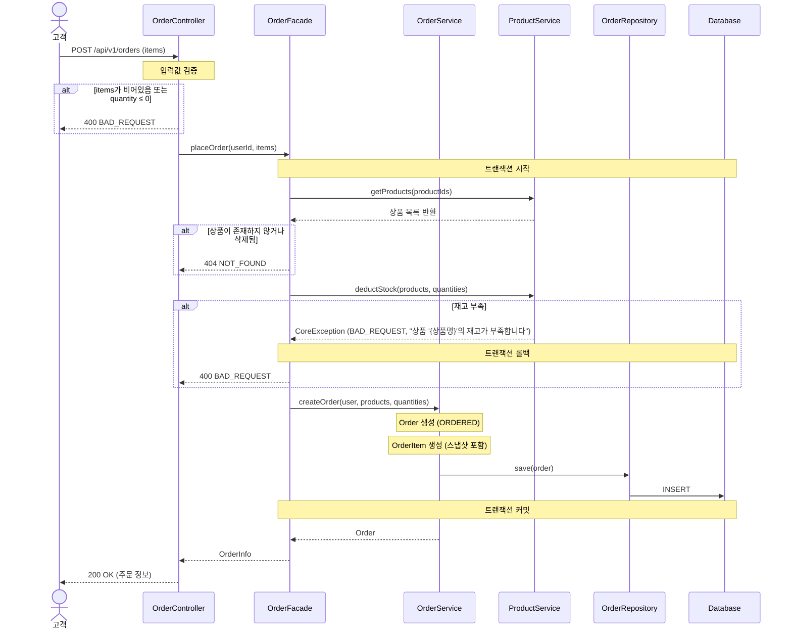
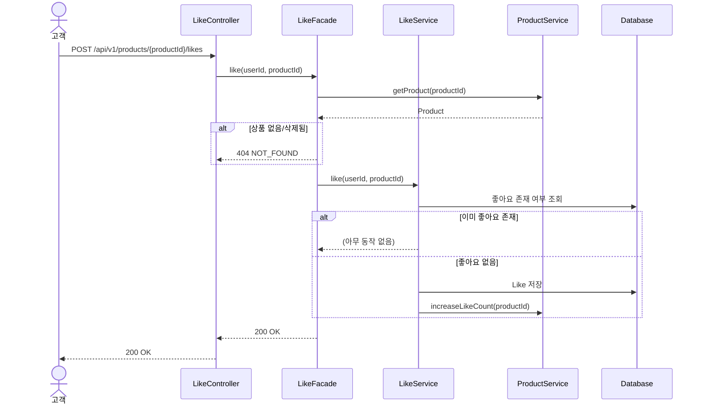
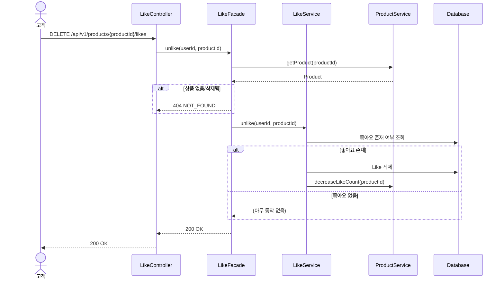
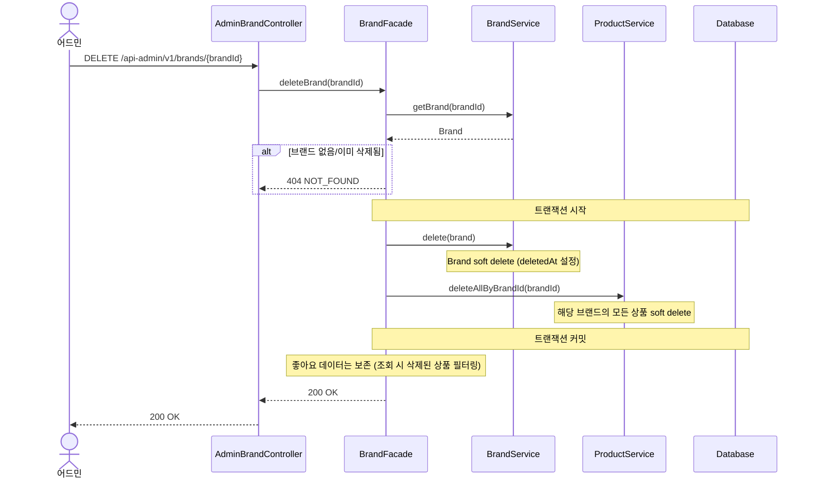
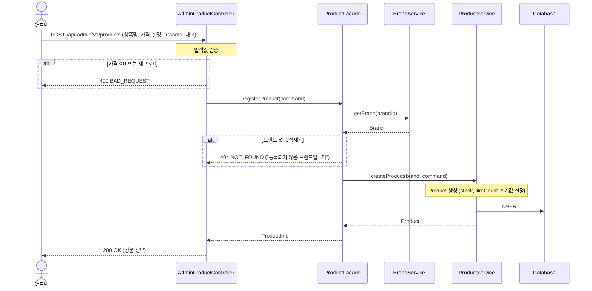

# 시퀀스 다이어그램

## 1. 주문 요청

> **왜 필요한가?** 주문 요청은 이 시스템에서 가장 복잡한 흐름이다. 재고 확인 → 차감 → 주문 생성 → 스냅샷 저장이 하나의 트랜잭션 안에서 이뤄져야 하므로, **호출 순서와 트랜잭션 경계**를 명확히 해야 한다.

**봐야 할 포인트:**
- **입력값 검증은 Controller에서 선행한다.** items 비어있음, quantity ≤ 0은 트랜잭션 진입 전에 차단된다.
- **Facade가 오케스트레이션을 담당한다.** ProductService와 OrderService를 조합하는 책임이 Facade에 있다.
- **재고 차감은 ProductService의 책임이다.** OrderService는 주문 생성만 담당한다.
- **트랜잭션 경계는 Facade 레벨이다.** 재고 차감과 주문 생성이 하나의 트랜잭션으로 묶인다.

---

## 2. 좋아요 등록 (멱등)

> **왜 필요한가?** 멱등 처리의 흐름을 명확히 하기 위해서다. "이미 존재하면 무시"라는 로직이 어느 레이어에서 판단되는지 확인한다.

**봐야 할 포인트:**
- **멱등 판단은 LikeService에서 한다.** 존재 여부를 확인하고, 없을 때만 저장한다.
- **likeCount 증가는 좋아요가 실제로 새로 생성될 때만 발생한다.**

---

## 3. 좋아요 취소 (멱등)

> **왜 필요한가?** 좋아요 등록의 역방향 흐름이다. "없으면 무시"라는 멱등 로직이 등록과 대칭적으로 동작하는지, **likeCount 감소 시점이 정확한지** 확인한다.

**봐야 할 포인트:**
- **등록과 대칭 구조다.** 판단 주체(LikeService), 멱등 처리 방식, likeCount 갱신 시점이 모두 등록과 미러링된다.
- **likeCount 감소는 좋아요가 실제로 존재할 때만 발생한다.** 없는 좋아요를 취소해도 카운트가 음수로 빠지지 않는다.

---

## 4. 브랜드 삭제 (연쇄 삭제)

> **왜 필요한가?** 브랜드 삭제 시 **소속 상품이 연쇄로 soft delete**되는 흐름이다. 삭제 범위와 좋아요 데이터 보존 정책을 확인해야 한다.

**봐야 할 포인트:**
- **삭제 범위는 브랜드 + 소속 상품까지다.** 좋아요 데이터는 삭제하지 않고 보존한다.
- **좋아요 정합성은 조회 시점에 처리한다.** 삭제된 상품의 좋아요는 목록 조회 시 필터링으로 제외된다.
- **트랜잭션 경계는 Facade다.** 브랜드 삭제와 상품 연쇄 삭제가 하나의 트랜잭션으로 묶여, 하나라도 실패하면 전체 롤백된다.
- **이미 주문된 상품의 스냅샷에는 영향 없다.** OrderItem에 저장된 스냅샷은 독립적이다.

---

## 5. 상품 등록 (어드민)

> **왜 필요한가?** 상품은 반드시 브랜드에 속해야 한다. **브랜드 존재 검증이 어느 레이어에서 발생하는지**, Facade의 오케스트레이션 역할을 확인한다.

**봐야 할 포인트:**
- **브랜드 검증은 Facade에서 수행한다.** ProductService는 상품 생성에만 집중하고, 브랜드 존재 여부는 Facade가 BrandService를 통해 확인한다.
- **입력값 검증(가격, 재고)은 Controller에서 선행한다.** 비즈니스 규칙 이전에 형식 검증을 먼저 차단한다.
- **ProductService는 Brand 객체를 받아 상품을 생성한다.** brandId가 아닌 Brand 엔티티를 전달받으므로, 브랜드 정보가 이미 검증된 상태임이 보장된다.
