# 전체 시퀀스 다이어그램

이 문서는 프로젝트의 모든 도메인별 API 시퀀스 다이어그램을 통합한 문서입니다.

## 목차

- [Part 1. 유저](#part-1-유저)
- [Part 2. 브랜드 & 상품](#part-2-브랜드--상품)
- [Part 3. 브랜드 & 상품 Admin](#part-3-브랜드--상품-admin)
- [Part 4. 좋아요](#part-4-좋아요)
- [Part 5. 주문](#part-5-주문)
- [Part 6. 주문 Admin](#part-6-주문-admin)

---

# Part 1. 유저

## 개요

이 문서는 유저 도메인의 3개 API 엔드포인트에 대한 시퀀스 다이어그램을 정의합니다.
각 API별로 성공 흐름과 에러 흐름을 Mermaid 다이어그램으로 표현하며, 실제 코드베이스의 클래스명과 메서드명을 기반으로 작성되었습니다.

| API | METHOD | URI | 인증 |
|-----|--------|-----|------|
| 회원가입 | POST | `/api/v1/users` | 불필요 |
| 내 정보 조회 | GET | `/api/v1/users/me` | 헤더 인증 필요 |
| 비밀번호 변경 | PUT | `/api/v1/users/password` | 헤더 인증 필요 |

---

## 1. 회원가입 - 성공 흐름

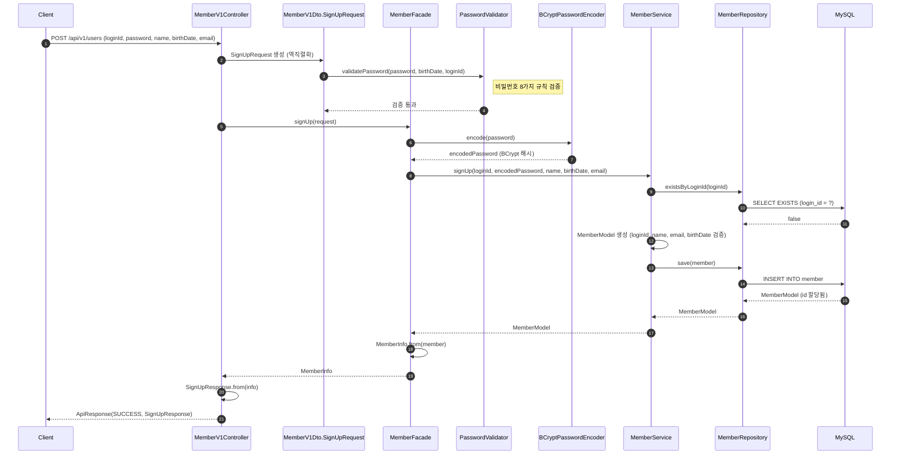
```mermaid
sequenceDiagram
    autonumber
    participant Client
    participant Controller as MemberV1Controller
    participant DTO as MemberV1Dto.SignUpRequest
    participant Facade as MemberFacade
    participant Validator as PasswordValidator
    participant Encoder as BCryptPasswordEncoder
    participant Service as MemberService
    participant Repository as MemberRepository
    participant DB as MySQL

    Client->>Controller: POST /api/v1/users (loginId, password, name, birthDate, email)
    Controller->>DTO: SignUpRequest 생성 (역직렬화)
    DTO->>Validator: validatePassword(password, birthDate, loginId)
    Note right of Validator: 비밀번호 8가지 규칙 검증
    Validator-->>DTO: 검증 통과
    Controller->>Facade: signUp(request)
    Facade->>Encoder: encode(password)
    Encoder-->>Facade: encodedPassword (BCrypt 해시)
    Facade->>Service: signUp(loginId, encodedPassword, name, birthDate, email)
    Service->>Repository: existsByLoginId(loginId)
    Repository->>DB: SELECT EXISTS (login_id = ?)
    DB-->>Repository: false
    Service->>Service: MemberModel 생성 (loginId, name, email, birthDate 검증)
    Service->>Repository: save(member)
    Repository->>DB: INSERT INTO member
    DB-->>Repository: MemberModel (id 할당됨)
    Repository-->>Service: MemberModel
    Service-->>Facade: MemberModel
    Facade->>Facade: MemberInfo.from(member)
    Facade-->>Controller: MemberInfo
    Controller->>Controller: SignUpResponse.from(info)
    Controller-->>Client: ApiResponse(SUCCESS, SignUpResponse)
```

### 흐름 설명

1. 클라이언트가 회원가입 정보를 담아 `POST /api/v1/users`로 요청합니다.
2. 컨트롤러가 Request Body를 `SignUpRequest` DTO로 역직렬화합니다.
3. `SignUpRequest`의 `init` 블록에서 `PasswordValidator.validatePassword()`를 호출하여 비밀번호 규칙(길이, 문자 조합, 연속 문자, 생년월일/로그인ID 포함 여부)을 검증합니다.
4. `MemberFacade`가 비밀번호를 BCrypt로 해싱합니다.
5. `MemberService`가 로그인 ID 중복 여부를 확인하고, `MemberModel`을 생성하여 저장합니다.
6. `MemberModel` 생성자에서 loginId, name, email, birthDate에 대한 형식 검증이 수행됩니다.
7. 저장 결과를 `MemberInfo` -> `SignUpResponse`로 변환하여 클라이언트에게 반환합니다.

---

## 2. 회원가입 - 에러 흐름

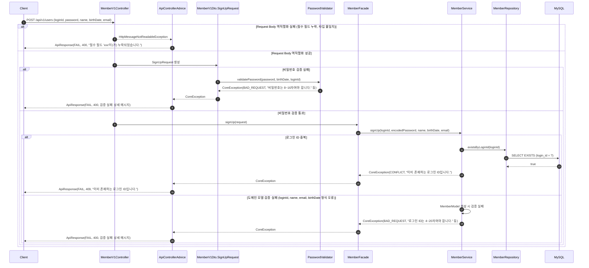
```mermaid
sequenceDiagram
    autonumber
    participant Client
    participant Controller as MemberV1Controller
    participant Advice as ApiControllerAdvice
    participant DTO as MemberV1Dto.SignUpRequest
    participant Validator as PasswordValidator
    participant Facade as MemberFacade
    participant Service as MemberService
    participant Repository as MemberRepository
    participant DB as MySQL

    Client->>Controller: POST /api/v1/users (loginId, password, name, birthDate, email)

    alt Request Body 역직렬화 실패 (필수 필드 누락, 타입 불일치)
        Controller-->>Advice: HttpMessageNotReadableException
        Advice-->>Client: ApiResponse(FAIL, 400, "필수 필드 'xxx'이(가) 누락되었습니다.")
    else Request Body 역직렬화 성공
        Controller->>DTO: SignUpRequest 생성
        alt 비밀번호 검증 실패
            DTO->>Validator: validatePassword(password, birthDate, loginId)
            Validator-->>DTO: CoreException(BAD_REQUEST, "비밀번호는 8~16자여야 합니다." 등)
            DTO-->>Advice: CoreException
            Advice-->>Client: ApiResponse(FAIL, 400, 검증 실패 상세 메시지)
        else 비밀번호 검증 통과
            Controller->>Facade: signUp(request)
            Facade->>Service: signUp(loginId, encodedPassword, name, birthDate, email)
            alt 로그인 ID 중복
                Service->>Repository: existsByLoginId(loginId)
                Repository->>DB: SELECT EXISTS (login_id = ?)
                DB-->>Repository: true
                Service-->>Facade: CoreException(CONFLICT, "이미 존재하는 로그인 ID입니다.")
                Facade-->>Advice: CoreException
                Advice-->>Client: ApiResponse(FAIL, 409, "이미 존재하는 로그인 ID입니다.")
            else 도메인 모델 검증 실패 (loginId, name, email, birthDate 형식 오류)
                Service->>Service: MemberModel 생성 시 검증 실패
                Service-->>Facade: CoreException(BAD_REQUEST, "로그인 ID는 4~20자여야 합니다." 등)
                Facade-->>Advice: CoreException
                Advice-->>Client: ApiResponse(FAIL, 400, 검증 실패 상세 메시지)
            end
        end
    end
```

### 에러 시나리오

| 조건 | 발생 시점 | 책임 객체 | 에러 타입 | HTTP 상태 |
|------|----------|----------|----------|----------|
| 필수 필드 누락 또는 타입 불일치 | Request Body 역직렬화 | ApiControllerAdvice | BAD_REQUEST | 400 |
| 비밀번호 길이 위반 (8~16자) | SignUpRequest init 블록 | PasswordValidator | BAD_REQUEST | 400 |
| 비밀번호 허용 문자 위반 | SignUpRequest init 블록 | PasswordValidator | BAD_REQUEST | 400 |
| 비밀번호 문자 종류 조합 부족 | SignUpRequest init 블록 | PasswordValidator | BAD_REQUEST | 400 |
| 비밀번호 연속 동일 문자 3개 이상 | SignUpRequest init 블록 | PasswordValidator | BAD_REQUEST | 400 |
| 비밀번호 연속 순서 문자 3개 이상 | SignUpRequest init 블록 | PasswordValidator | BAD_REQUEST | 400 |
| 비밀번호에 생년월일 포함 | SignUpRequest init 블록 | PasswordValidator | BAD_REQUEST | 400 |
| 비밀번호에 로그인 ID 포함 | SignUpRequest init 블록 | PasswordValidator | BAD_REQUEST | 400 |
| 로그인 ID 중복 | MemberService.signUp() | MemberService | CONFLICT | 409 |
| 로그인 ID 형식 위반 (4~20자, 영문 소문자/숫자/언더스코어) | MemberModel 생성자 | MemberModel | BAD_REQUEST | 400 |
| 이름 형식 위반 (2~50자, 한글/영문) | MemberModel 생성자 | MemberModel | BAD_REQUEST | 400 |
| 이메일 형식 위반 | MemberModel 생성자 | MemberModel | BAD_REQUEST | 400 |
| 생년월일이 미래 날짜 | MemberModel 생성자 | MemberModel | BAD_REQUEST | 400 |

---

## 3. 내 정보 조회 - 성공 흐름

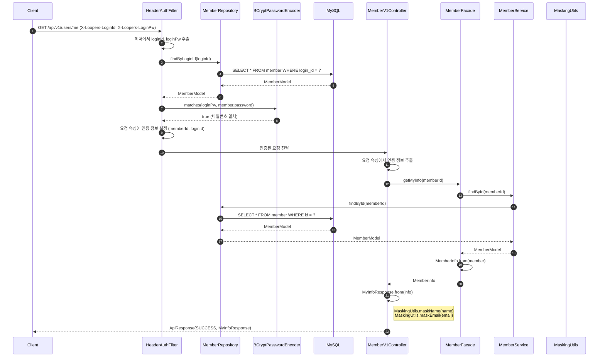
```mermaid
sequenceDiagram
    autonumber
    participant Client
    participant Filter as HeaderAuthFilter
    participant Repository as MemberRepository
    participant Encoder as BCryptPasswordEncoder
    participant DB as MySQL
    participant Controller as MemberV1Controller
    participant Facade as MemberFacade
    participant Service as MemberService
    participant Masking as MaskingUtils

    Client->>Filter: GET /api/v1/users/me (X-Loopers-LoginId, X-Loopers-LoginPw)
    Filter->>Filter: 헤더에서 loginId, loginPw 추출
    Filter->>Repository: findByLoginId(loginId)
    Repository->>DB: SELECT * FROM member WHERE login_id = ?
    DB-->>Repository: MemberModel
    Repository-->>Filter: MemberModel
    Filter->>Encoder: matches(loginPw, member.password)
    Encoder-->>Filter: true (비밀번호 일치)
    Filter->>Filter: 요청 속성에 인증 정보 설정 (memberId, loginId)
    Filter->>Controller: 인증된 요청 전달
    Controller->>Controller: 요청 속성에서 인증 정보 추출
    Controller->>Facade: getMyInfo(memberId)
    Facade->>Service: findById(memberId)
    Service->>Repository: findById(memberId)
    Repository->>DB: SELECT * FROM member WHERE id = ?
    DB-->>Repository: MemberModel
    Repository-->>Service: MemberModel
    Service-->>Facade: MemberModel
    Facade->>Facade: MemberInfo.from(member)
    Facade-->>Controller: MemberInfo
    Controller->>Controller: MyInfoResponse.from(info)
    Note right of Controller: MaskingUtils.maskName(name)<br/>MaskingUtils.maskEmail(email)
    Controller-->>Client: ApiResponse(SUCCESS, MyInfoResponse)
```

### 흐름 설명

1. 클라이언트가 `X-Loopers-LoginId`와 `X-Loopers-LoginPw` 헤더를 포함하여 `GET /api/v1/users/me`로 요청합니다.
2. `HeaderAuthenticationFilter`가 헤더에서 로그인 ID와 비밀번호를 추출합니다.
3. 로그인 ID로 유저를 조회하고, 평문 비밀번호를 BCrypt 해시와 매칭하여 인증합니다.
4. 인증 성공 시 유저 정보(memberId, loginId)를 요청 속성에 설정하고 필터 체인을 진행합니다.
5. 컨트롤러가 요청 속성에서 인증 정보를 추출하여 `MemberFacade.getMyInfo()`를 호출합니다.
6. Facade가 Service를 통해 유저를 조회하고 `MemberInfo`로 변환합니다.
7. `MyInfoResponse.from()`에서 `MaskingUtils`를 사용하여 이름과 이메일을 마스킹한 뒤 응답합니다.

---

## 4. 내 정보 조회 - 에러 흐름

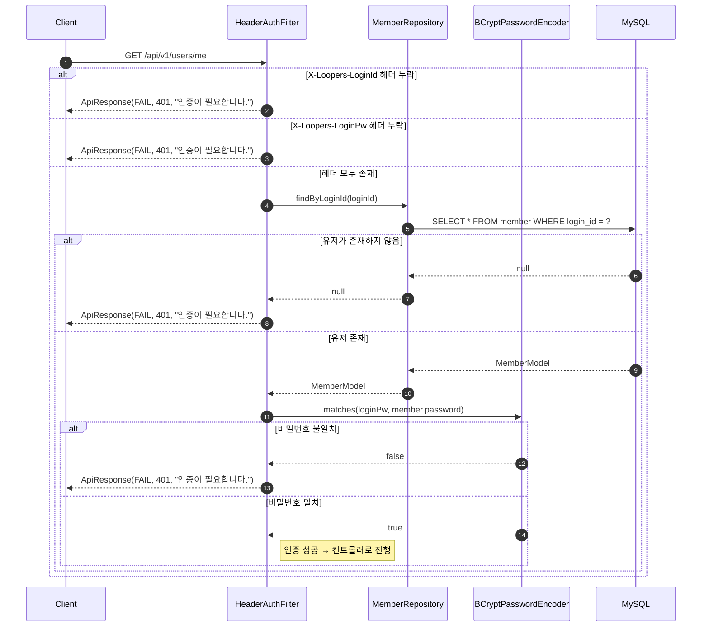
```mermaid
sequenceDiagram
    autonumber
    participant Client
    participant Filter as HeaderAuthFilter
    participant Repository as MemberRepository
    participant Encoder as BCryptPasswordEncoder
    participant DB as MySQL

    Client->>Filter: GET /api/v1/users/me

    alt X-Loopers-LoginId 헤더 누락
        Filter-->>Client: ApiResponse(FAIL, 401, "인증이 필요합니다.")
    else X-Loopers-LoginPw 헤더 누락
        Filter-->>Client: ApiResponse(FAIL, 401, "인증이 필요합니다.")
    else 헤더 모두 존재
        Filter->>Repository: findByLoginId(loginId)
        Repository->>DB: SELECT * FROM member WHERE login_id = ?

        alt 유저가 존재하지 않음
            DB-->>Repository: null
            Repository-->>Filter: null
            Filter-->>Client: ApiResponse(FAIL, 401, "인증이 필요합니다.")
        else 유저 존재
            DB-->>Repository: MemberModel
            Repository-->>Filter: MemberModel
            Filter->>Encoder: matches(loginPw, member.password)

            alt 비밀번호 불일치
                Encoder-->>Filter: false
                Filter-->>Client: ApiResponse(FAIL, 401, "인증이 필요합니다.")
            else 비밀번호 일치
                Encoder-->>Filter: true
                Note right of Filter: 인증 성공 → 컨트롤러로 진행
            end
        end
    end
```

### 에러 시나리오

| 조건 | 발생 시점 | 책임 객체 | 에러 타입 | HTTP 상태 |
|------|----------|----------|----------|----------|
| `X-Loopers-LoginId` 헤더 누락 | 헤더 추출 단계 | HeaderAuthFilter | UNAUTHORIZED | 401 |
| `X-Loopers-LoginPw` 헤더 누락 | 헤더 추출 단계 | HeaderAuthFilter | UNAUTHORIZED | 401 |
| 로그인 ID에 해당하는 유저 없음 | 유저 조회 단계 | HeaderAuthFilter | UNAUTHORIZED | 401 |
| 비밀번호 불일치 | 비밀번호 매칭 단계 | HeaderAuthFilter | UNAUTHORIZED | 401 |

> 보안을 위해 모든 인증 실패 케이스에서 동일한 에러 메시지("인증이 필요합니다.")를 반환하여, 공격자가 유저 존재 여부나 비밀번호 일치 여부를 추론할 수 없도록 합니다.

---

## 5. 비밀번호 변경 - 성공 흐름

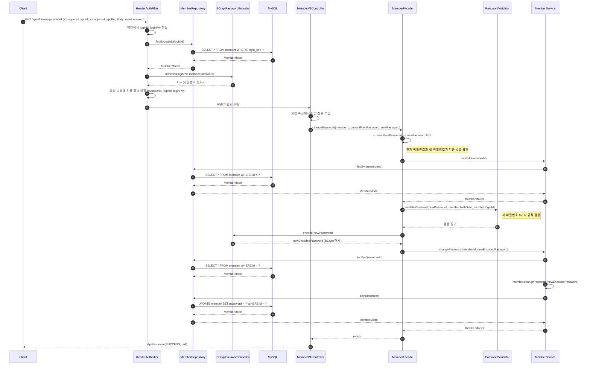
```mermaid
sequenceDiagram
    autonumber
    participant Client
    participant Filter as HeaderAuthFilter
    participant Repository as MemberRepository
    participant Encoder as BCryptPasswordEncoder
    participant DB as MySQL
    participant Controller as MemberV1Controller
    participant Facade as MemberFacade
    participant Validator as PasswordValidator
    participant Service as MemberService

    Client->>Filter: PUT /api/v1/users/password (X-Loopers-LoginId, X-Loopers-LoginPw, Body: newPassword)
    Filter->>Filter: 헤더에서 loginId, loginPw 추출
    Filter->>Repository: findByLoginId(loginId)
    Repository->>DB: SELECT * FROM member WHERE login_id = ?
    DB-->>Repository: MemberModel
    Repository-->>Filter: MemberModel
    Filter->>Encoder: matches(loginPw, member.password)
    Encoder-->>Filter: true (비밀번호 일치)
    Filter->>Filter: 요청 속성에 인증 정보 설정 (memberId, loginId, loginPw)
    Filter->>Controller: 인증된 요청 전달
    Controller->>Controller: 요청 속성에서 인증 정보 추출
    Controller->>Facade: changePassword(memberId, currentPlainPassword, newPassword)
    Facade->>Facade: currentPlainPassword == newPassword 비교
    Note right of Facade: 현재 비밀번호와 새 비밀번호가 다른 것을 확인
    Facade->>Service: findById(memberId)
    Service->>Repository: findById(memberId)
    Repository->>DB: SELECT * FROM member WHERE id = ?
    DB-->>Repository: MemberModel
    Repository-->>Service: MemberModel
    Service-->>Facade: MemberModel
    Facade->>Validator: validatePassword(newPassword, member.birthDate, member.loginId)
    Note right of Validator: 새 비밀번호 8가지 규칙 검증
    Validator-->>Facade: 검증 통과
    Facade->>Encoder: encode(newPassword)
    Encoder-->>Facade: newEncodedPassword (BCrypt 해시)
    Facade->>Service: changePassword(memberId, newEncodedPassword)
    Service->>Repository: findById(memberId)
    Repository->>DB: SELECT * FROM member WHERE id = ?
    DB-->>Repository: MemberModel
    Service->>Service: member.changePassword(newEncodedPassword)
    Service->>Repository: save(member)
    Repository->>DB: UPDATE member SET password = ? WHERE id = ?
    DB-->>Repository: MemberModel
    Repository-->>Service: MemberModel
    Service-->>Facade: MemberModel
    Facade-->>Controller: (void)
    Controller-->>Client: ApiResponse(SUCCESS, null)
```

### 흐름 설명

1. 클라이언트가 인증 헤더와 새 비밀번호를 포함하여 `PUT /api/v1/users/password`로 요청합니다.
2. `HeaderAuthenticationFilter`가 헤더 기반 인증을 수행합니다 (내 정보 조회와 동일한 인증 과정).
3. 인증 성공 시 현재 비밀번호(평문)도 함께 요청 속성에 설정합니다.
4. 컨트롤러가 `MemberFacade.changePassword()`를 호출합니다.
5. Facade에서 현재 비밀번호(평문)와 새 비밀번호의 동일 여부를 먼저 검사합니다.
6. 유저를 조회한 뒤, `PasswordValidator`로 새 비밀번호의 유효성을 검증합니다.
7. 새 비밀번호를 BCrypt로 해싱하고, `MemberService.changePassword()`를 통해 저장합니다.
8. `MemberModel.changePassword()`가 엔티티의 비밀번호 필드를 갱신하고, Repository가 DB에 반영합니다.

---

## 6. 비밀번호 변경 - 에러 흐름

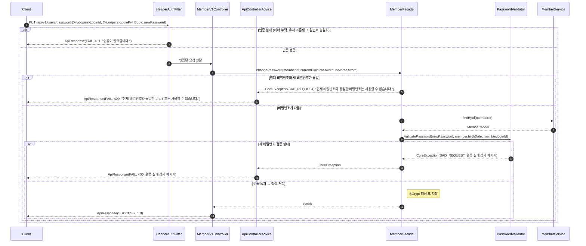
```mermaid
sequenceDiagram
    autonumber
    participant Client
    participant Filter as HeaderAuthFilter
    participant Controller as MemberV1Controller
    participant Advice as ApiControllerAdvice
    participant Facade as MemberFacade
    participant Validator as PasswordValidator
    participant Service as MemberService

    Client->>Filter: PUT /api/v1/users/password (X-Loopers-LoginId, X-Loopers-LoginPw, Body: newPassword)

    alt 인증 실패 (헤더 누락, 유저 미존재, 비밀번호 불일치)
        Filter-->>Client: ApiResponse(FAIL, 401, "인증이 필요합니다.")
    else 인증 성공
        Filter->>Controller: 인증된 요청 전달
        Controller->>Facade: changePassword(memberId, currentPlainPassword, newPassword)

        alt 현재 비밀번호와 새 비밀번호가 동일
            Facade-->>Advice: CoreException(BAD_REQUEST, "현재 비밀번호와 동일한 비밀번호는 사용할 수 없습니다.")
            Advice-->>Client: ApiResponse(FAIL, 400, "현재 비밀번호와 동일한 비밀번호는 사용할 수 없습니다.")
        else 비밀번호가 다름
            Facade->>Service: findById(memberId)
            Service-->>Facade: MemberModel
            Facade->>Validator: validatePassword(newPassword, member.birthDate, member.loginId)

            alt 새 비밀번호 검증 실패
                Validator-->>Facade: CoreException(BAD_REQUEST, 검증 실패 상세 메시지)
                Facade-->>Advice: CoreException
                Advice-->>Client: ApiResponse(FAIL, 400, 검증 실패 상세 메시지)
            else 검증 통과 → 정상 처리
                Note right of Facade: BCrypt 해싱 후 저장
                Facade-->>Controller: (void)
                Controller-->>Client: ApiResponse(SUCCESS, null)
            end
        end
    end
```

### 에러 시나리오

| 조건 | 발생 시점 | 책임 객체 | 에러 타입 | HTTP 상태 |
|------|----------|----------|----------|----------|
| 인증 헤더 누락 | HeaderAuthFilter | HeaderAuthFilter | UNAUTHORIZED | 401 |
| 유저 미존재 | HeaderAuthFilter | HeaderAuthFilter | UNAUTHORIZED | 401 |
| 비밀번호 불일치 | HeaderAuthFilter | HeaderAuthFilter | UNAUTHORIZED | 401 |
| 현재 비밀번호와 새 비밀번호 동일 | MemberFacade.changePassword() | MemberFacade | BAD_REQUEST | 400 |
| 새 비밀번호 길이 위반 | PasswordValidator.validatePassword() | PasswordValidator | BAD_REQUEST | 400 |
| 새 비밀번호 허용 문자 위반 | PasswordValidator.validatePassword() | PasswordValidator | BAD_REQUEST | 400 |
| 새 비밀번호 문자 종류 조합 부족 | PasswordValidator.validatePassword() | PasswordValidator | BAD_REQUEST | 400 |
| 새 비밀번호 연속 동일 문자 | PasswordValidator.validatePassword() | PasswordValidator | BAD_REQUEST | 400 |
| 새 비밀번호 연속 순서 문자 | PasswordValidator.validatePassword() | PasswordValidator | BAD_REQUEST | 400 |
| 새 비밀번호에 생년월일 포함 | PasswordValidator.validatePassword() | PasswordValidator | BAD_REQUEST | 400 |
| 새 비밀번호에 로그인 ID 포함 | PasswordValidator.validatePassword() | PasswordValidator | BAD_REQUEST | 400 |

---

## 품질 체크리스트

- [x] 각 participant의 책임(검증, 변환, 조회, 저장 등)이 메서드명으로 명확히 드러나는가?
- [x] 여러 도메인이 관련된 경우, 각 도메인의 Service가 별도 participant로 분리되어 있는가?
- [x] 인증 방식(헤더 기반)이 다이어그램에 정확히 반영되어 있는가?
- [x] 성공 흐름과 에러 흐름이 모두 포함되어 있는가?
- [x] 에러 시나리오 테이블에 발생 시점과 책임 객체가 명시되어 있는가?

---

# Part 2. 브랜드 & 상품

## 개요

이 문서는 브랜드 & 상품 대고객 조회 API의 처리 흐름을 Mermaid 시퀀스 다이어그램으로 표현합니다.
모든 API는 인증이 불필요하므로 인증 필터(HeaderAuthFilter)를 거치지 않습니다.

| API | METHOD | URI |
|-----|--------|-----|
| 브랜드 정보 조회 | GET | `/api/v1/brands/{brandId}` |
| 상품 목록 조회 | GET | `/api/v1/products` |
| 상품 정보 조회 | GET | `/api/v1/products/{productId}` |

---

## 1. 브랜드 정보 조회 - 성공 흐름

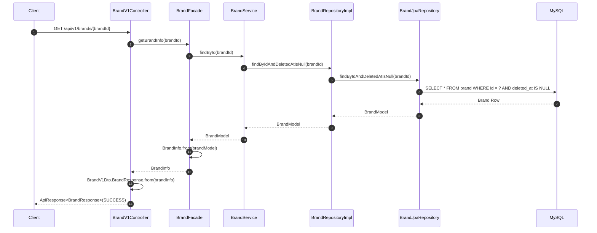
```mermaid
sequenceDiagram
    autonumber
    participant Client
    participant Controller as BrandV1Controller
    participant Facade as BrandFacade
    participant Service as BrandService
    participant Repository as BrandRepositoryImpl
    participant JPA as BrandJpaRepository
    participant DB as MySQL

    Client->>Controller: GET /api/v1/brands/{brandId}
    Controller->>Facade: getBrandInfo(brandId)
    Facade->>Service: findById(brandId)
    Service->>Repository: findByIdAndDeletedAtIsNull(brandId)
    Repository->>JPA: findByIdAndDeletedAtIsNull(brandId)
    JPA->>DB: SELECT * FROM brand WHERE id = ? AND deleted_at IS NULL
    DB-->>JPA: Brand Row
    JPA-->>Repository: BrandModel
    Repository-->>Service: BrandModel
    Service-->>Facade: BrandModel
    Facade->>Facade: BrandInfo.from(brandModel)
    Facade-->>Controller: BrandInfo
    Controller->>Controller: BrandV1Dto.BrandResponse.from(brandInfo)
    Controller-->>Client: ApiResponse<BrandResponse>(SUCCESS)
```

### 흐름 설명

1. 클라이언트가 브랜드 ID를 경로 변수로 전달하여 브랜드 정보를 요청합니다.
2. Controller는 Facade에 브랜드 조회를 위임합니다.
3. Facade는 Service를 통해 도메인 모델을 조회합니다.
4. Service는 Repository를 호출하여 `deletedAt`이 null인 브랜드만 조회합니다.
5. Repository는 JPA를 통해 MySQL에서 데이터를 조회합니다.
6. 조회된 BrandModel은 Facade에서 BrandInfo로 변환됩니다.
7. Controller에서 BrandResponse DTO로 변환하여 ApiResponse로 감싸 반환합니다.

---

## 2. 브랜드 정보 조회 - 에러 흐름

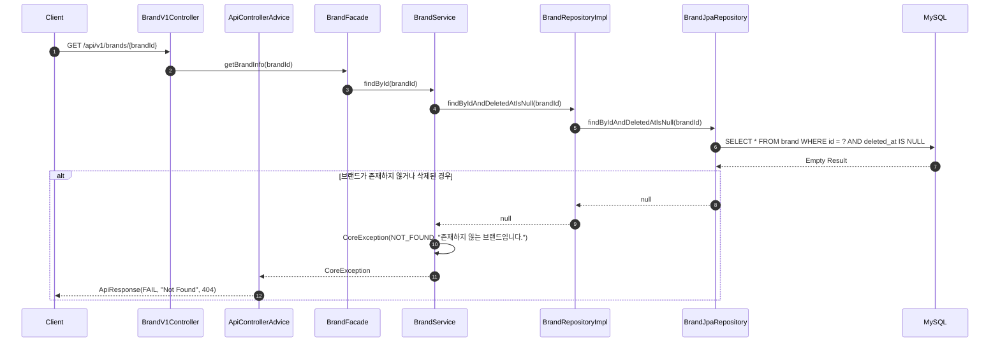
```mermaid
sequenceDiagram
    autonumber
    participant Client
    participant Controller as BrandV1Controller
    participant Advice as ApiControllerAdvice
    participant Facade as BrandFacade
    participant Service as BrandService
    participant Repository as BrandRepositoryImpl
    participant JPA as BrandJpaRepository
    participant DB as MySQL

    Client->>Controller: GET /api/v1/brands/{brandId}
    Controller->>Facade: getBrandInfo(brandId)
    Facade->>Service: findById(brandId)
    Service->>Repository: findByIdAndDeletedAtIsNull(brandId)
    Repository->>JPA: findByIdAndDeletedAtIsNull(brandId)
    JPA->>DB: SELECT * FROM brand WHERE id = ? AND deleted_at IS NULL
    DB-->>JPA: Empty Result

    alt 브랜드가 존재하지 않거나 삭제된 경우
        JPA-->>Repository: null
        Repository-->>Service: null
        Service->>Service: CoreException(NOT_FOUND, "존재하지 않는 브랜드입니다.")
        Service-->>Advice: CoreException
        Advice-->>Client: ApiResponse(FAIL, "Not Found", 404)
    end
```

### 에러 시나리오

| 조건 | 발생 시점 | 책임 객체 | 에러 타입 | HTTP 상태 |
|------|----------|----------|----------|----------|
| 존재하지 않는 브랜드 ID | DB 조회 결과 null | BrandService | NOT_FOUND | 404 |
| 삭제된 브랜드 (deletedAt != null) | DB 조회 시 필터링됨 (결과 null) | BrandService | NOT_FOUND | 404 |
| brandId가 Long 타입이 아닌 경우 | 파라미터 바인딩 시점 | Spring (MethodArgumentTypeMismatchException) | BAD_REQUEST | 400 |

---

## 3. 상품 목록 조회 - 성공 흐름

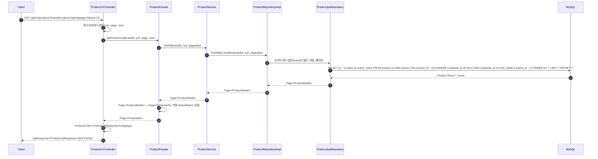
```mermaid
sequenceDiagram
    autonumber
    participant Client
    participant Controller as ProductV1Controller
    participant Facade as ProductFacade
    participant Service as ProductService
    participant Repository as ProductRepositoryImpl
    participant JPA as ProductJpaRepository
    participant DB as MySQL

    Client->>Controller: GET /api/v1/products?brandId=1&sort=latest&page=0&size=20
    Controller->>Controller: 쿼리 파라미터 검증 (sort, page, size)
    Controller->>Facade: getProductList(brandId, sort, page, size)
    Facade->>Service: findAll(brandId, sort, pageable)
    Service->>Repository: findAllByCondition(brandId, sort, pageable)
    Repository->>JPA: 조건부 쿼리 실행 (brandId 필터, 정렬, 페이징)
    JPA->>DB: SELECT p.*, b.name as brand_name FROM product p JOIN brand b ON p.brand_id = b.id WHERE p.deleted_at IS NULL AND b.deleted_at IS NULL [AND p.brand_id = ?] ORDER BY ? LIMIT ? OFFSET ?
    DB-->>JPA: Product Rows + Count
    JPA-->>Repository: Page<ProductModel>
    Repository-->>Service: Page<ProductModel>
    Service-->>Facade: Page<ProductModel>
    Facade->>Facade: Page<ProductModel> -> Page<ProductInfo> 변환 (brandName 포함)
    Facade-->>Controller: Page<ProductInfo>
    Controller->>Controller: ProductV1Dto.ProductListResponse.from(page)
    Controller-->>Client: ApiResponse<ProductListResponse>(SUCCESS)
```

### 흐름 설명

1. 클라이언트가 쿼리 파라미터(brandId, sort, page, size)와 함께 상품 목록을 요청합니다.
2. Controller에서 정렬 기준, 페이지 번호, 페이지 크기의 유효성을 검증합니다.
3. Facade를 통해 Service에 조건부 조회를 요청합니다.
4. Repository는 `deletedAt`이 null인 상품만 대상으로, Brand와 JOIN하여 삭제되지 않은 브랜드의 상품만 조회합니다.
5. brandId 필터가 지정된 경우 해당 브랜드의 상품만 필터링합니다.
6. 정렬 기준에 따라 `createdAt DESC`(latest), `price ASC`(price_asc), `likesCount DESC`(likes_desc)로 정렬합니다.
7. Spring Data Page로 페이징 처리된 결과를 반환합니다.
8. Facade에서 ProductModel을 ProductInfo로 변환하며, Brand 관계를 통해 brandName을 포함합니다.
9. Controller에서 ProductListResponse DTO로 변환하여 content, page, size, totalElements, totalPages를 포함한 응답을 반환합니다.

---

## 4. 상품 목록 조회 - 에러 흐름

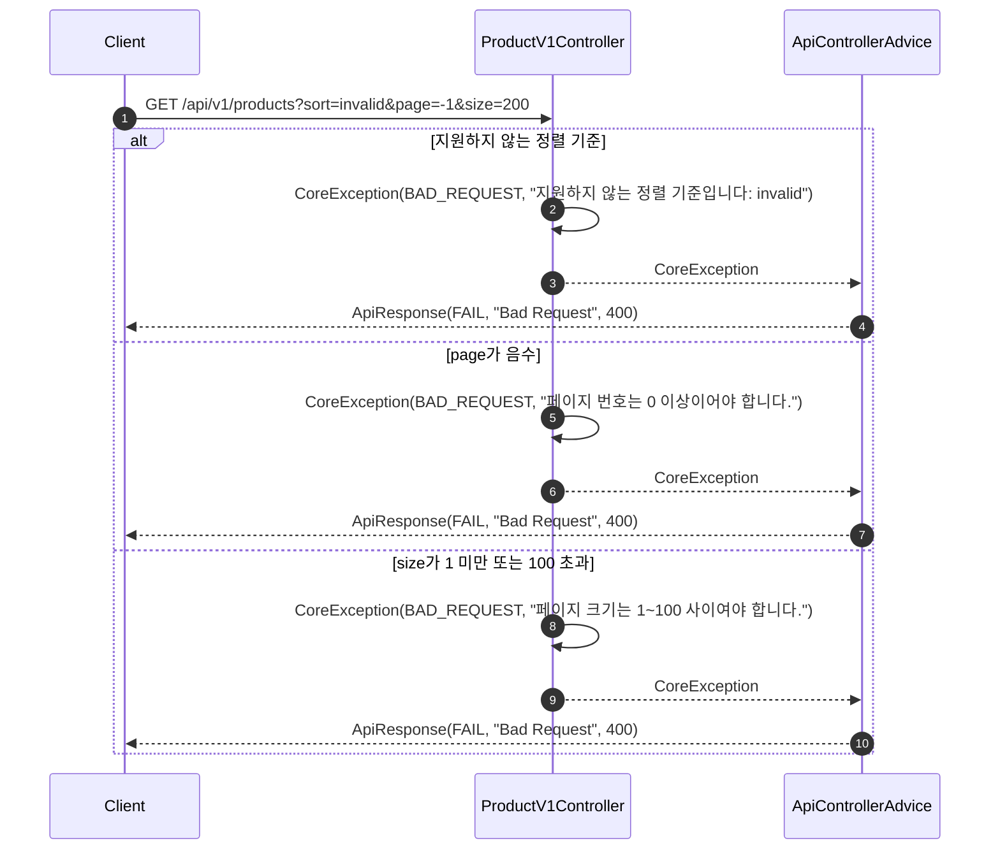
```mermaid
sequenceDiagram
    autonumber
    participant Client
    participant Controller as ProductV1Controller
    participant Advice as ApiControllerAdvice

    Client->>Controller: GET /api/v1/products?sort=invalid&page=-1&size=200

    alt 지원하지 않는 정렬 기준
        Controller->>Controller: CoreException(BAD_REQUEST, "지원하지 않는 정렬 기준입니다: invalid")
        Controller-->>Advice: CoreException
        Advice-->>Client: ApiResponse(FAIL, "Bad Request", 400)
    else page가 음수
        Controller->>Controller: CoreException(BAD_REQUEST, "페이지 번호는 0 이상이어야 합니다.")
        Controller-->>Advice: CoreException
        Advice-->>Client: ApiResponse(FAIL, "Bad Request", 400)
    else size가 1 미만 또는 100 초과
        Controller->>Controller: CoreException(BAD_REQUEST, "페이지 크기는 1~100 사이여야 합니다.")
        Controller-->>Advice: CoreException
        Advice-->>Client: ApiResponse(FAIL, "Bad Request", 400)
    end
```

### 에러 시나리오

| 조건 | 발생 시점 | 책임 객체 | 에러 타입 | HTTP 상태 |
|------|----------|----------|----------|----------|
| 지원하지 않는 정렬 기준 (예: `invalid`) | 쿼리 파라미터 검증 시점 | ProductV1Controller | BAD_REQUEST | 400 |
| page가 음수 | 쿼리 파라미터 검증 시점 | ProductV1Controller | BAD_REQUEST | 400 |
| size가 1 미만 또는 100 초과 | 쿼리 파라미터 검증 시점 | ProductV1Controller | BAD_REQUEST | 400 |
| brandId가 Long 타입이 아닌 경우 | 파라미터 바인딩 시점 | Spring (MethodArgumentTypeMismatchException) | BAD_REQUEST | 400 |

---

## 5. 상품 정보 조회 - 성공 흐름

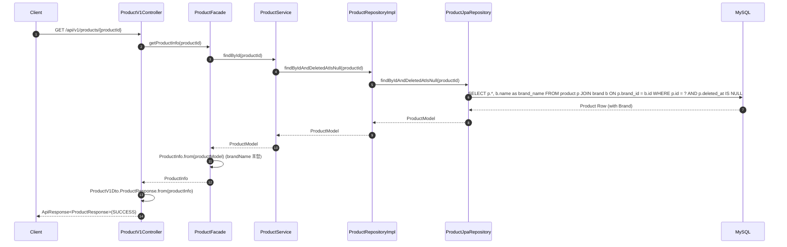
```mermaid
sequenceDiagram
    autonumber
    participant Client
    participant Controller as ProductV1Controller
    participant Facade as ProductFacade
    participant Service as ProductService
    participant Repository as ProductRepositoryImpl
    participant JPA as ProductJpaRepository
    participant DB as MySQL

    Client->>Controller: GET /api/v1/products/{productId}
    Controller->>Facade: getProductInfo(productId)
    Facade->>Service: findById(productId)
    Service->>Repository: findByIdAndDeletedAtIsNull(productId)
    Repository->>JPA: findByIdAndDeletedAtIsNull(productId)
    JPA->>DB: SELECT p.*, b.name as brand_name FROM product p JOIN brand b ON p.brand_id = b.id WHERE p.id = ? AND p.deleted_at IS NULL
    DB-->>JPA: Product Row (with Brand)
    JPA-->>Repository: ProductModel
    Repository-->>Service: ProductModel
    Service-->>Facade: ProductModel
    Facade->>Facade: ProductInfo.from(productModel) (brandName 포함)
    Facade-->>Controller: ProductInfo
    Controller->>Controller: ProductV1Dto.ProductResponse.from(productInfo)
    Controller-->>Client: ApiResponse<ProductResponse>(SUCCESS)
```

### 흐름 설명

1. 클라이언트가 상품 ID를 경로 변수로 전달하여 상품 상세 정보를 요청합니다.
2. Controller는 Facade에 상품 조회를 위임합니다.
3. Facade는 Service를 통해 도메인 모델을 조회합니다.
4. Service는 Repository를 호출하여 `deletedAt`이 null인 상품만 조회합니다.
5. JPA는 Brand와 JOIN하여 상품 정보와 브랜드 이름을 함께 조회합니다.
6. 조회된 ProductModel은 Facade에서 ProductInfo로 변환되며, ManyToOne 관계를 통해 brandName이 포함됩니다.
7. Controller에서 ProductResponse DTO로 변환하여 ApiResponse로 감싸 반환합니다.

---

## 6. 상품 정보 조회 - 에러 흐름

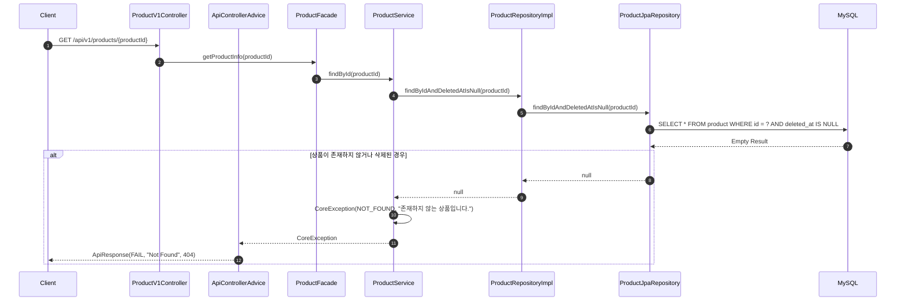
```mermaid
sequenceDiagram
    autonumber
    participant Client
    participant Controller as ProductV1Controller
    participant Advice as ApiControllerAdvice
    participant Facade as ProductFacade
    participant Service as ProductService
    participant Repository as ProductRepositoryImpl
    participant JPA as ProductJpaRepository
    participant DB as MySQL

    Client->>Controller: GET /api/v1/products/{productId}
    Controller->>Facade: getProductInfo(productId)
    Facade->>Service: findById(productId)
    Service->>Repository: findByIdAndDeletedAtIsNull(productId)
    Repository->>JPA: findByIdAndDeletedAtIsNull(productId)
    JPA->>DB: SELECT * FROM product WHERE id = ? AND deleted_at IS NULL
    DB-->>JPA: Empty Result

    alt 상품이 존재하지 않거나 삭제된 경우
        JPA-->>Repository: null
        Repository-->>Service: null
        Service->>Service: CoreException(NOT_FOUND, "존재하지 않는 상품입니다.")
        Service-->>Advice: CoreException
        Advice-->>Client: ApiResponse(FAIL, "Not Found", 404)
    end
```

### 에러 시나리오

| 조건 | 발생 시점 | 책임 객체 | 에러 타입 | HTTP 상태 |
|------|----------|----------|----------|----------|
| 존재하지 않는 상품 ID | DB 조회 결과 null | ProductService | NOT_FOUND | 404 |
| 삭제된 상품 (deletedAt != null) | DB 조회 시 필터링됨 (결과 null) | ProductService | NOT_FOUND | 404 |
| productId가 Long 타입이 아닌 경우 | 파라미터 바인딩 시점 | Spring (MethodArgumentTypeMismatchException) | BAD_REQUEST | 400 |

---

## 품질 체크리스트

- [x] 각 participant의 책임(검증, 변환, 조회, 저장 등)이 메서드명으로 명확히 드러나는가?
- [x] 여러 도메인이 관련된 경우, 각 도메인의 Service가 별도 participant로 분리되어 있는가? (Brand-Product는 ManyToOne JPA 관계로 처리하므로 별도 Service 호출 불필요)
- [x] 인증 방식(인증 불필요)이 다이어그램에 정확히 반영되어 있는가? (인증 필터 없이 Client → Controller 직접 호출)
- [x] 성공 흐름과 에러 흐름이 모두 포함되어 있는가?
- [x] 에러 시나리오 테이블에 발생 시점과 책임 객체가 명시되어 있는가?

---

# Part 3. 브랜드 & 상품 Admin

## 개요

이 문서는 브랜드 & 상품 Admin API의 처리 흐름을 Mermaid 시퀀스 다이어그램으로 표현합니다.
각 API 엔드포인트별로 성공 흐름과 에러 흐름을 포함합니다.

**대상 API 엔드포인트:**

| # | METHOD | URI | 설명 |
|---|--------|-----|------|
| 1 | POST | `/api-admin/v1/brands` | 브랜드 등록 |
| 2 | GET | `/api-admin/v1/brands?page=0&size=20` | 브랜드 목록 조회 |
| 3 | GET | `/api-admin/v1/brands/{brandId}` | 브랜드 상세 조회 |
| 4 | PUT | `/api-admin/v1/brands/{brandId}` | 브랜드 정보 수정 |
| 5 | DELETE | `/api-admin/v1/brands/{brandId}` | 브랜드 삭제 |
| 6 | POST | `/api-admin/v1/products` | 상품 등록 |
| 7 | GET | `/api-admin/v1/products?page=0&size=20` | 상품 목록 조회 |
| 8 | GET | `/api-admin/v1/products/{productId}` | 상품 상세 조회 |
| 9 | PUT | `/api-admin/v1/products/{productId}` | 상품 정보 수정 |
| 10 | DELETE | `/api-admin/v1/products/{productId}` | 상품 삭제 |

---

## 1. 브랜드 등록 - 성공 흐름

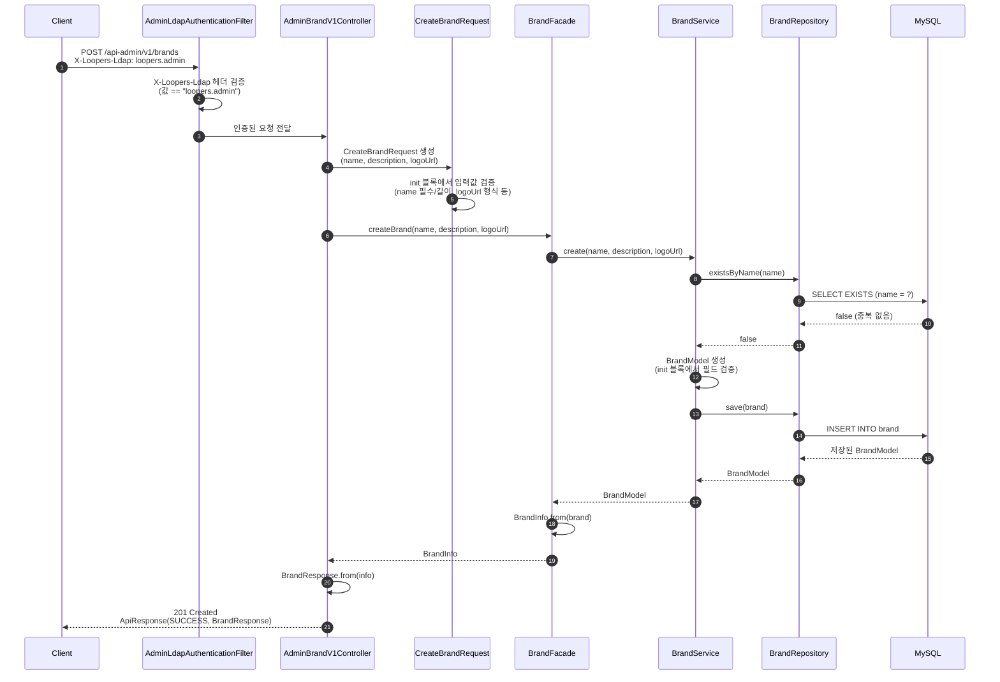
```mermaid
sequenceDiagram
    autonumber
    participant Client
    participant Filter as AdminLdapAuthenticationFilter
    participant Controller as AdminBrandV1Controller
    participant DTO as CreateBrandRequest
    participant Facade as BrandFacade
    participant Service as BrandService
    participant Repository as BrandRepository
    participant DB as MySQL

    Client->>Filter: POST /api-admin/v1/brands<br/>X-Loopers-Ldap: loopers.admin
    Filter->>Filter: X-Loopers-Ldap 헤더 검증<br/>(값 == "loopers.admin")
    Filter->>Controller: 인증된 요청 전달

    Controller->>DTO: CreateBrandRequest 생성<br/>(name, description, logoUrl)
    DTO->>DTO: init 블록에서 입력값 검증<br/>(name 필수/길이, logoUrl 형식 등)

    Controller->>Facade: createBrand(name, description, logoUrl)
    Facade->>Service: create(name, description, logoUrl)
    Service->>Repository: existsByName(name)
    Repository->>DB: SELECT EXISTS (name = ?)
    DB-->>Repository: false (중복 없음)
    Repository-->>Service: false

    Service->>Service: BrandModel 생성<br/>(init 블록에서 필드 검증)
    Service->>Repository: save(brand)
    Repository->>DB: INSERT INTO brand
    DB-->>Repository: 저장된 BrandModel
    Repository-->>Service: BrandModel

    Service-->>Facade: BrandModel
    Facade->>Facade: BrandInfo.from(brand)
    Facade-->>Controller: BrandInfo

    Controller->>Controller: BrandResponse.from(info)
    Controller-->>Client: 201 Created<br/>ApiResponse(SUCCESS, BrandResponse)
```

### 흐름 설명
1. 어드민이 브랜드 등록 요청을 보냅니다.
2. `AdminLdapAuthenticationFilter`가 `X-Loopers-Ldap` 헤더 값을 검증합니다.
3. `CreateBrandRequest` DTO의 init 블록에서 브랜드명 필수 여부, 길이 제한, 로고 URL 형식 등을 검증합니다.
4. `BrandService`가 동일한 브랜드명의 존재 여부를 확인합니다.
5. `BrandModel`을 생성하고 저장합니다.
6. `BrandInfo`를 거쳐 `BrandResponse`로 변환하여 201 Created 응답을 반환합니다.

---

## 2. 브랜드 등록 - 에러 흐름

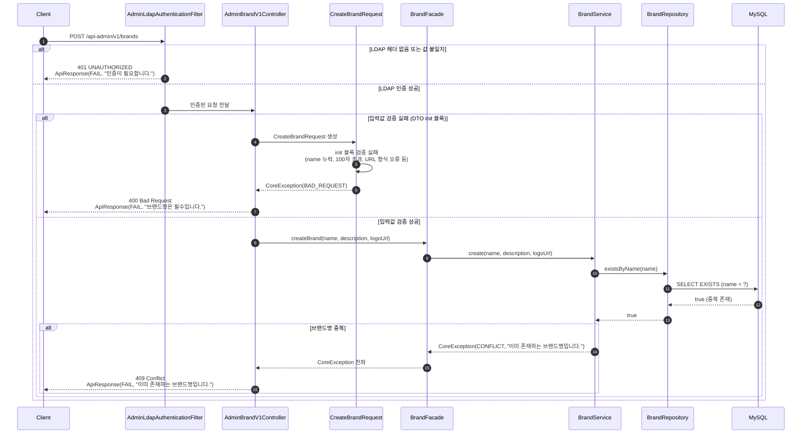
```mermaid
sequenceDiagram
    autonumber
    participant Client
    participant Filter as AdminLdapAuthenticationFilter
    participant Controller as AdminBrandV1Controller
    participant DTO as CreateBrandRequest
    participant Facade as BrandFacade
    participant Service as BrandService
    participant Repository as BrandRepository
    participant DB as MySQL

    Client->>Filter: POST /api-admin/v1/brands

    alt LDAP 헤더 없음 또는 값 불일치
        Filter-->>Client: 401 UNAUTHORIZED<br/>ApiResponse(FAIL, "인증이 필요합니다.")
    else LDAP 인증 성공
        Filter->>Controller: 인증된 요청 전달

        alt 입력값 검증 실패 (DTO init 블록)
            Controller->>DTO: CreateBrandRequest 생성
            DTO->>DTO: init 블록 검증 실패<br/>(name 누락, 100자 초과, URL 형식 오류 등)
            DTO-->>Controller: CoreException(BAD_REQUEST)
            Controller-->>Client: 400 Bad Request<br/>ApiResponse(FAIL, "브랜드명은 필수입니다.")
        else 입력값 검증 성공
            Controller->>Facade: createBrand(name, description, logoUrl)
            Facade->>Service: create(name, description, logoUrl)
            Service->>Repository: existsByName(name)
            Repository->>DB: SELECT EXISTS (name = ?)
            DB-->>Repository: true (중복 존재)
            Repository-->>Service: true

            alt 브랜드명 중복
                Service-->>Facade: CoreException(CONFLICT, "이미 존재하는 브랜드명입니다.")
                Facade-->>Controller: CoreException 전파
                Controller-->>Client: 409 Conflict<br/>ApiResponse(FAIL, "이미 존재하는 브랜드명입니다.")
            end
        end
    end
```

### 에러 시나리오

| 조건 | 발생 시점 | 책임 객체 | 에러 타입 | HTTP 상태 |
|------|----------|----------|----------|----------|
| LDAP 헤더 없음/불일치 | 필터 단계 | AdminLdapAuthenticationFilter | UNAUTHORIZED | 401 |
| 브랜드명 누락/빈 문자열 | DTO 생성 | CreateBrandRequest (init) | BAD_REQUEST | 400 |
| 브랜드명 100자 초과 | DTO 생성 | CreateBrandRequest (init) | BAD_REQUEST | 400 |
| 로고 URL 형식 오류 | DTO 생성 | CreateBrandRequest (init) | BAD_REQUEST | 400 |
| 브랜드 설명 500자 초과 | DTO 생성 | CreateBrandRequest (init) | BAD_REQUEST | 400 |
| 브랜드명 중복 | 서비스 계층 | BrandService | CONFLICT | 409 |

---

## 3. 브랜드 목록 조회 - 성공 흐름

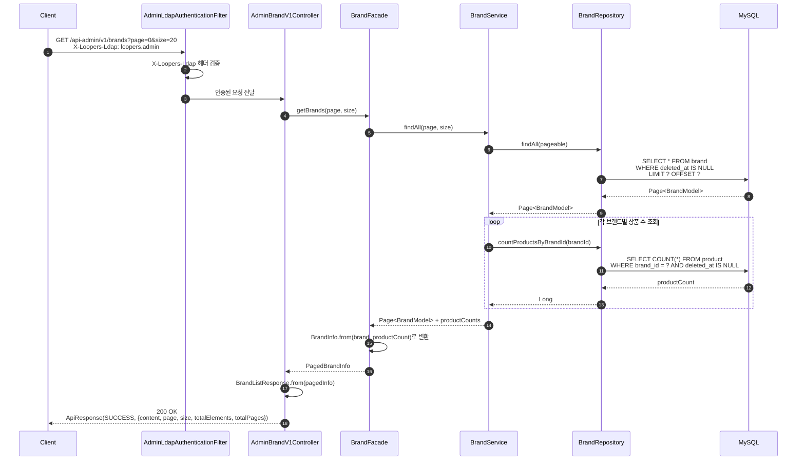
```mermaid
sequenceDiagram
    autonumber
    participant Client
    participant Filter as AdminLdapAuthenticationFilter
    participant Controller as AdminBrandV1Controller
    participant Facade as BrandFacade
    participant Service as BrandService
    participant Repository as BrandRepository
    participant DB as MySQL

    Client->>Filter: GET /api-admin/v1/brands?page=0&size=20<br/>X-Loopers-Ldap: loopers.admin
    Filter->>Filter: X-Loopers-Ldap 헤더 검증
    Filter->>Controller: 인증된 요청 전달

    Controller->>Facade: getBrands(page, size)
    Facade->>Service: findAll(page, size)
    Service->>Repository: findAll(pageable)
    Repository->>DB: SELECT * FROM brand<br/>WHERE deleted_at IS NULL<br/>LIMIT ? OFFSET ?
    DB-->>Repository: Page<BrandModel>
    Repository-->>Service: Page<BrandModel>

    loop 각 브랜드별 상품 수 조회
        Service->>Repository: countProductsByBrandId(brandId)
        Repository->>DB: SELECT COUNT(*) FROM product<br/>WHERE brand_id = ? AND deleted_at IS NULL
        DB-->>Repository: productCount
        Repository-->>Service: Long
    end

    Service-->>Facade: Page<BrandModel> + productCounts
    Facade->>Facade: BrandInfo.from(brand, productCount)로 변환
    Facade-->>Controller: PagedBrandInfo

    Controller->>Controller: BrandListResponse.from(pagedInfo)
    Controller-->>Client: 200 OK<br/>ApiResponse(SUCCESS, {content, page, size, totalElements, totalPages})
```

### 흐름 설명
1. 어드민이 브랜드 목록 조회를 요청합니다.
2. 소프트 삭제된 브랜드를 제외하고 페이징 조회합니다.
3. 각 브랜드별 소속 상품 수를 집계합니다 (삭제된 상품 제외).
4. 페이징 정보와 함께 응답을 반환합니다.

---

## 4. 브랜드 목록 조회 - 에러 흐름

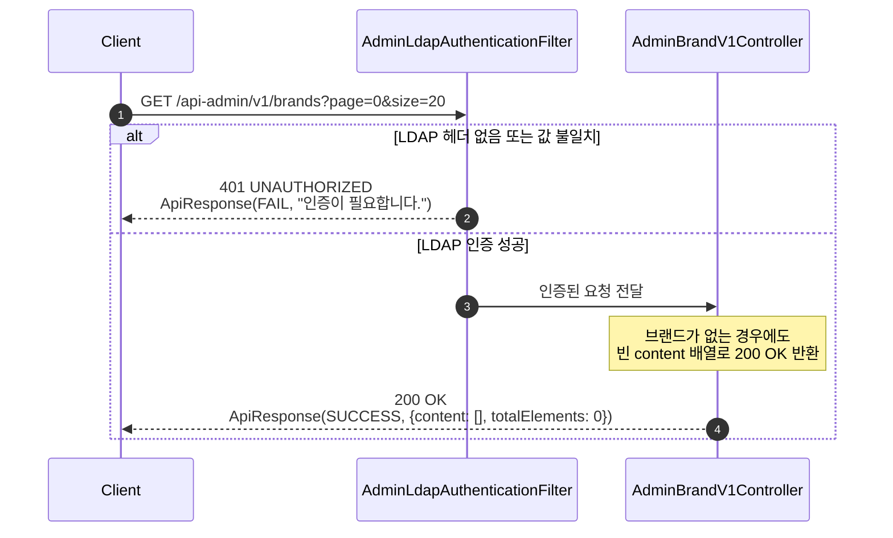
```mermaid
sequenceDiagram
    autonumber
    participant Client
    participant Filter as AdminLdapAuthenticationFilter
    participant Controller as AdminBrandV1Controller

    Client->>Filter: GET /api-admin/v1/brands?page=0&size=20

    alt LDAP 헤더 없음 또는 값 불일치
        Filter-->>Client: 401 UNAUTHORIZED<br/>ApiResponse(FAIL, "인증이 필요합니다.")
    else LDAP 인증 성공
        Filter->>Controller: 인증된 요청 전달
        Note over Controller: 브랜드가 없는 경우에도<br/>빈 content 배열로 200 OK 반환
        Controller-->>Client: 200 OK<br/>ApiResponse(SUCCESS, {content: [], totalElements: 0})
    end
```

### 에러 시나리오

| 조건 | 발생 시점 | 책임 객체 | 에러 타입 | HTTP 상태 |
|------|----------|----------|----------|----------|
| LDAP 헤더 없음/불일치 | 필터 단계 | AdminLdapAuthenticationFilter | UNAUTHORIZED | 401 |

---

## 5. 브랜드 상세 조회 - 성공 흐름

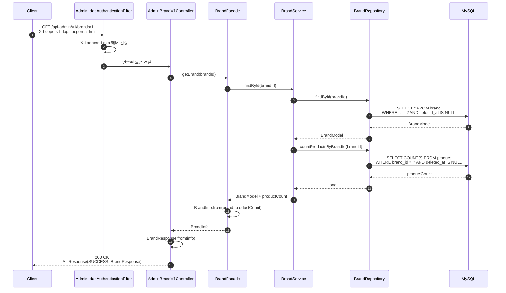
```mermaid
sequenceDiagram
    autonumber
    participant Client
    participant Filter as AdminLdapAuthenticationFilter
    participant Controller as AdminBrandV1Controller
    participant Facade as BrandFacade
    participant Service as BrandService
    participant Repository as BrandRepository
    participant DB as MySQL

    Client->>Filter: GET /api-admin/v1/brands/1<br/>X-Loopers-Ldap: loopers.admin
    Filter->>Filter: X-Loopers-Ldap 헤더 검증
    Filter->>Controller: 인증된 요청 전달

    Controller->>Facade: getBrand(brandId)
    Facade->>Service: findById(brandId)
    Service->>Repository: findById(brandId)
    Repository->>DB: SELECT * FROM brand<br/>WHERE id = ? AND deleted_at IS NULL
    DB-->>Repository: BrandModel
    Repository-->>Service: BrandModel

    Service->>Repository: countProductsByBrandId(brandId)
    Repository->>DB: SELECT COUNT(*) FROM product<br/>WHERE brand_id = ? AND deleted_at IS NULL
    DB-->>Repository: productCount
    Repository-->>Service: Long

    Service-->>Facade: BrandModel + productCount
    Facade->>Facade: BrandInfo.from(brand, productCount)
    Facade-->>Controller: BrandInfo

    Controller->>Controller: BrandResponse.from(info)
    Controller-->>Client: 200 OK<br/>ApiResponse(SUCCESS, BrandResponse)
```

---

## 6. 브랜드 상세 조회 - 에러 흐름

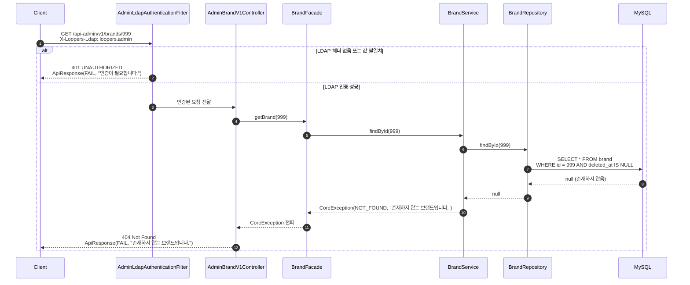
```mermaid
sequenceDiagram
    autonumber
    participant Client
    participant Filter as AdminLdapAuthenticationFilter
    participant Controller as AdminBrandV1Controller
    participant Facade as BrandFacade
    participant Service as BrandService
    participant Repository as BrandRepository
    participant DB as MySQL

    Client->>Filter: GET /api-admin/v1/brands/999<br/>X-Loopers-Ldap: loopers.admin

    alt LDAP 헤더 없음 또는 값 불일치
        Filter-->>Client: 401 UNAUTHORIZED<br/>ApiResponse(FAIL, "인증이 필요합니다.")
    else LDAP 인증 성공
        Filter->>Controller: 인증된 요청 전달
        Controller->>Facade: getBrand(999)
        Facade->>Service: findById(999)
        Service->>Repository: findById(999)
        Repository->>DB: SELECT * FROM brand<br/>WHERE id = 999 AND deleted_at IS NULL
        DB-->>Repository: null (존재하지 않음)
        Repository-->>Service: null

        Service-->>Facade: CoreException(NOT_FOUND, "존재하지 않는 브랜드입니다.")
        Facade-->>Controller: CoreException 전파
        Controller-->>Client: 404 Not Found<br/>ApiResponse(FAIL, "존재하지 않는 브랜드입니다.")
    end
```

### 에러 시나리오

| 조건 | 발생 시점 | 책임 객체 | 에러 타입 | HTTP 상태 |
|------|----------|----------|----------|----------|
| LDAP 헤더 없음/불일치 | 필터 단계 | AdminLdapAuthenticationFilter | UNAUTHORIZED | 401 |
| 존재하지 않는 브랜드 ID | 서비스 계층 | BrandService | NOT_FOUND | 404 |

---

## 7. 브랜드 정보 수정 - 성공 흐름

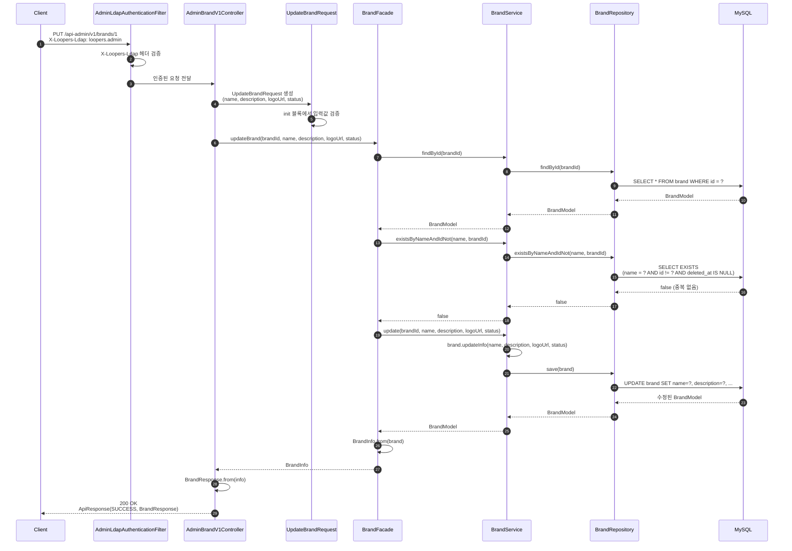
```mermaid
sequenceDiagram
    autonumber
    participant Client
    participant Filter as AdminLdapAuthenticationFilter
    participant Controller as AdminBrandV1Controller
    participant DTO as UpdateBrandRequest
    participant Facade as BrandFacade
    participant Service as BrandService
    participant Repository as BrandRepository
    participant DB as MySQL

    Client->>Filter: PUT /api-admin/v1/brands/1<br/>X-Loopers-Ldap: loopers.admin
    Filter->>Filter: X-Loopers-Ldap 헤더 검증
    Filter->>Controller: 인증된 요청 전달

    Controller->>DTO: UpdateBrandRequest 생성<br/>(name, description, logoUrl, status)
    DTO->>DTO: init 블록에서 입력값 검증

    Controller->>Facade: updateBrand(brandId, name, description, logoUrl, status)
    Facade->>Service: findById(brandId)
    Service->>Repository: findById(brandId)
    Repository->>DB: SELECT * FROM brand WHERE id = ?
    DB-->>Repository: BrandModel
    Repository-->>Service: BrandModel
    Service-->>Facade: BrandModel

    Facade->>Service: existsByNameAndIdNot(name, brandId)
    Service->>Repository: existsByNameAndIdNot(name, brandId)
    Repository->>DB: SELECT EXISTS<br/>(name = ? AND id != ? AND deleted_at IS NULL)
    DB-->>Repository: false (중복 없음)
    Repository-->>Service: false
    Service-->>Facade: false

    Facade->>Service: update(brandId, name, description, logoUrl, status)
    Service->>Service: brand.updateInfo(name, description, logoUrl, status)
    Service->>Repository: save(brand)
    Repository->>DB: UPDATE brand SET name=?, description=?, ...
    DB-->>Repository: 수정된 BrandModel
    Repository-->>Service: BrandModel

    Service-->>Facade: BrandModel
    Facade->>Facade: BrandInfo.from(brand)
    Facade-->>Controller: BrandInfo

    Controller->>Controller: BrandResponse.from(info)
    Controller-->>Client: 200 OK<br/>ApiResponse(SUCCESS, BrandResponse)
```

---

## 8. 브랜드 정보 수정 - 에러 흐름

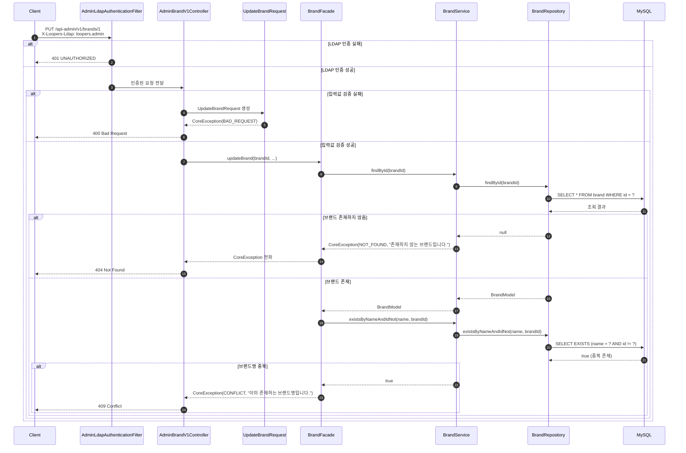
```mermaid
sequenceDiagram
    autonumber
    participant Client
    participant Filter as AdminLdapAuthenticationFilter
    participant Controller as AdminBrandV1Controller
    participant DTO as UpdateBrandRequest
    participant Facade as BrandFacade
    participant Service as BrandService
    participant Repository as BrandRepository
    participant DB as MySQL

    Client->>Filter: PUT /api-admin/v1/brands/1<br/>X-Loopers-Ldap: loopers.admin

    alt LDAP 인증 실패
        Filter-->>Client: 401 UNAUTHORIZED
    else LDAP 인증 성공
        Filter->>Controller: 인증된 요청 전달

        alt 입력값 검증 실패
            Controller->>DTO: UpdateBrandRequest 생성
            DTO-->>Controller: CoreException(BAD_REQUEST)
            Controller-->>Client: 400 Bad Request
        else 입력값 검증 성공
            Controller->>Facade: updateBrand(brandId, ...)
            Facade->>Service: findById(brandId)
            Service->>Repository: findById(brandId)
            Repository->>DB: SELECT * FROM brand WHERE id = ?
            DB-->>Repository: 조회 결과

            alt 브랜드 존재하지 않음
                Repository-->>Service: null
                Service-->>Facade: CoreException(NOT_FOUND, "존재하지 않는 브랜드입니다.")
                Facade-->>Controller: CoreException 전파
                Controller-->>Client: 404 Not Found
            else 브랜드 존재
                Repository-->>Service: BrandModel
                Service-->>Facade: BrandModel

                Facade->>Service: existsByNameAndIdNot(name, brandId)
                Service->>Repository: existsByNameAndIdNot(name, brandId)
                Repository->>DB: SELECT EXISTS (name = ? AND id != ?)
                DB-->>Repository: true (중복 존재)

                alt 브랜드명 중복
                    Service-->>Facade: true
                    Facade-->>Controller: CoreException(CONFLICT, "이미 존재하는 브랜드명입니다.")
                    Controller-->>Client: 409 Conflict
                end
            end
        end
    end
```

### 에러 시나리오

| 조건 | 발생 시점 | 책임 객체 | 에러 타입 | HTTP 상태 |
|------|----------|----------|----------|----------|
| LDAP 헤더 없음/불일치 | 필터 단계 | AdminLdapAuthenticationFilter | UNAUTHORIZED | 401 |
| 브랜드명/상태 검증 실패 | DTO 생성 | UpdateBrandRequest (init) | BAD_REQUEST | 400 |
| 존재하지 않는 브랜드 | 서비스 계층 | BrandService | NOT_FOUND | 404 |
| 브랜드명 중복 (다른 브랜드) | 퍼사드 계층 | BrandFacade | CONFLICT | 409 |

---

## 9. 브랜드 삭제 - 성공 흐름 (연쇄 삭제 포함)

```mermaid
sequenceDiagram
    autonumber
    participant Client
    participant Filter as AdminLdapAuthenticationFilter
    participant Controller as AdminBrandV1Controller
    participant Facade as BrandFacade
    participant BrandService as BrandService
    participant ProductService as ProductService
    participant BrandRepo as BrandRepository
    participant ProductRepo as ProductRepository
    participant DB as MySQL

    Client->>Filter: DELETE /api-admin/v1/brands/1<br/>X-Loopers-Ldap: loopers.admin
    Filter->>Filter: X-Loopers-Ldap 헤더 검증
    Filter->>Controller: 인증된 요청 전달

    Controller->>Facade: deleteBrand(brandId)

    Facade->>BrandService: findById(brandId)
    BrandService->>BrandRepo: findById(brandId)
    BrandRepo->>DB: SELECT * FROM brand<br/>WHERE id = ? AND deleted_at IS NULL
    DB-->>BrandRepo: BrandModel
    BrandRepo-->>BrandService: BrandModel
    BrandService-->>Facade: BrandModel

    Note over Facade: 소속 상품 연쇄 소프트 삭제
    Facade->>ProductService: softDeleteAllByBrandId(brandId)
    ProductService->>ProductRepo: findAllByBrandId(brandId)
    ProductRepo->>DB: SELECT * FROM product<br/>WHERE brand_id = ? AND deleted_at IS NULL
    DB-->>ProductRepo: List<ProductModel>
    ProductRepo-->>ProductService: List<ProductModel>

    loop 각 소속 상품에 대해
        ProductService->>ProductService: product.delete()<br/>(deletedAt 설정)
    end

    ProductService->>ProductRepo: saveAll(products)
    ProductRepo->>DB: UPDATE product SET deleted_at = NOW()<br/>WHERE brand_id = ?
    DB-->>ProductRepo: 완료
    ProductRepo-->>ProductService: 완료
    ProductService-->>Facade: 완료

    Note over Facade: 브랜드 소프트 삭제
    Facade->>BrandService: delete(brandId)
    BrandService->>BrandService: brand.delete()<br/>(deletedAt 설정)
    BrandService->>BrandRepo: save(brand)
    BrandRepo->>DB: UPDATE brand SET deleted_at = NOW()<br/>WHERE id = ?
    DB-->>BrandRepo: 완료
    BrandRepo-->>BrandService: 완료
    BrandService-->>Facade: 완료

    Facade-->>Controller: 완료
    Controller-->>Client: 200 OK<br/>ApiResponse(SUCCESS, null)
```

### 흐름 설명
1. 어드민이 브랜드 삭제를 요청합니다.
2. `BrandFacade`가 브랜드 존재 여부를 확인합니다.
3. `ProductService`를 통해 해당 브랜드에 소속된 모든 상품을 소프트 삭제합니다.
4. `BrandService`를 통해 브랜드 자체를 소프트 삭제합니다.
5. 모든 작업은 단일 트랜잭션 내에서 처리되어 데이터 일관성을 보장합니다.

---

## 10. 브랜드 삭제 - 에러 흐름

```mermaid
sequenceDiagram
    autonumber
    participant Client
    participant Filter as AdminLdapAuthenticationFilter
    participant Controller as AdminBrandV1Controller
    participant Facade as BrandFacade
    participant BrandService as BrandService
    participant BrandRepo as BrandRepository
    participant DB as MySQL

    Client->>Filter: DELETE /api-admin/v1/brands/999<br/>X-Loopers-Ldap: loopers.admin

    alt LDAP 인증 실패
        Filter-->>Client: 401 UNAUTHORIZED<br/>ApiResponse(FAIL, "인증이 필요합니다.")
    else LDAP 인증 성공
        Filter->>Controller: 인증된 요청 전달
        Controller->>Facade: deleteBrand(999)
        Facade->>BrandService: findById(999)
        BrandService->>BrandRepo: findById(999)
        BrandRepo->>DB: SELECT * FROM brand<br/>WHERE id = 999 AND deleted_at IS NULL
        DB-->>BrandRepo: null
        BrandRepo-->>BrandService: null
        BrandService-->>Facade: CoreException(NOT_FOUND, "존재하지 않는 브랜드입니다.")
        Facade-->>Controller: CoreException 전파
        Controller-->>Client: 404 Not Found<br/>ApiResponse(FAIL, "존재하지 않는 브랜드입니다.")
    end
```

### 에러 시나리오

| 조건 | 발생 시점 | 책임 객체 | 에러 타입 | HTTP 상태 |
|------|----------|----------|----------|----------|
| LDAP 헤더 없음/불일치 | 필터 단계 | AdminLdapAuthenticationFilter | UNAUTHORIZED | 401 |
| 존재하지 않는 브랜드 | 서비스 계층 | BrandService | NOT_FOUND | 404 |

---

## 11. 상품 등록 - 성공 흐름

```mermaid
sequenceDiagram
    autonumber
    participant Client
    participant Filter as AdminLdapAuthenticationFilter
    participant Controller as AdminProductV1Controller
    participant DTO as CreateProductRequest
    participant Facade as ProductFacade
    participant BrandService as BrandService
    participant ProductService as ProductService
    participant BrandRepo as BrandRepository
    participant ProductRepo as ProductRepository
    participant DB as MySQL

    Client->>Filter: POST /api-admin/v1/products<br/>X-Loopers-Ldap: loopers.admin
    Filter->>Filter: X-Loopers-Ldap 헤더 검증
    Filter->>Controller: 인증된 요청 전달

    Controller->>DTO: CreateProductRequest 생성<br/>(name, description, price, brandId,<br/>saleStatus, stockQuantity, displayStatus)
    DTO->>DTO: init 블록에서 입력값 검증<br/>(name 필수, price 범위, 재고 범위 등)

    Controller->>Facade: createProduct(name, description, price,<br/>brandId, saleStatus, stockQuantity, displayStatus)

    Note over Facade: 브랜드 존재 및 활성 상태 검증
    Facade->>BrandService: findById(brandId)
    BrandService->>BrandRepo: findById(brandId)
    BrandRepo->>DB: SELECT * FROM brand<br/>WHERE id = ? AND deleted_at IS NULL
    DB-->>BrandRepo: BrandModel
    BrandRepo-->>BrandService: BrandModel
    BrandService-->>Facade: BrandModel

    Facade->>Facade: brand.status == ACTIVE 검증

    Note over Facade: 상품 생성
    Facade->>ProductService: create(name, description, price,<br/>brandId, saleStatus, stockQuantity, displayStatus)
    ProductService->>ProductService: ProductModel 생성<br/>(init 블록에서 필드 검증)
    ProductService->>ProductRepo: save(product)
    ProductRepo->>DB: INSERT INTO product
    DB-->>ProductRepo: 저장된 ProductModel
    ProductRepo-->>ProductService: ProductModel
    ProductService-->>Facade: ProductModel

    Facade->>Facade: ProductInfo.from(product, brand)
    Facade-->>Controller: ProductInfo

    Controller->>Controller: ProductResponse.from(info)
    Controller-->>Client: 201 Created<br/>ApiResponse(SUCCESS, ProductResponse)
```

### 흐름 설명
1. 어드민이 상품 등록 요청을 보냅니다.
2. DTO init 블록에서 상품명, 가격, 재고 수량 등의 기본 검증을 수행합니다.
3. `ProductFacade`가 `BrandService`를 통해 브랜드 존재 여부와 활성 상태를 검증합니다.
4. 검증 통과 후 `ProductService`에서 상품을 생성하고 저장합니다.
5. 응답에 브랜드 요약 정보(brandId, name)를 포함하여 반환합니다.

---

## 12. 상품 등록 - 에러 흐름

```mermaid
sequenceDiagram
    autonumber
    participant Client
    participant Filter as AdminLdapAuthenticationFilter
    participant Controller as AdminProductV1Controller
    participant DTO as CreateProductRequest
    participant Facade as ProductFacade
    participant BrandService as BrandService
    participant BrandRepo as BrandRepository
    participant DB as MySQL

    Client->>Filter: POST /api-admin/v1/products<br/>X-Loopers-Ldap: loopers.admin

    alt LDAP 인증 실패
        Filter-->>Client: 401 UNAUTHORIZED
    else LDAP 인증 성공
        Filter->>Controller: 인증된 요청 전달

        alt 입력값 검증 실패 (DTO init 블록)
            Controller->>DTO: CreateProductRequest 생성
            DTO->>DTO: 검증 실패<br/>(name 누락, price 음수, stockQuantity 음수 등)
            DTO-->>Controller: CoreException(BAD_REQUEST)
            Controller-->>Client: 400 Bad Request<br/>ApiResponse(FAIL, 검증 에러 메시지)
        else 입력값 검증 성공
            Controller->>Facade: createProduct(...)

            Facade->>BrandService: findById(brandId)
            BrandService->>BrandRepo: findById(brandId)
            BrandRepo->>DB: SELECT * FROM brand WHERE id = ?
            DB-->>BrandRepo: 조회 결과

            alt 브랜드 존재하지 않음
                BrandRepo-->>BrandService: null
                BrandService-->>Facade: CoreException(NOT_FOUND, "존재하지 않는 브랜드입니다.")
                Facade-->>Controller: CoreException 전파
                Controller-->>Client: 404 Not Found
            else 브랜드 존재
                BrandRepo-->>BrandService: BrandModel
                BrandService-->>Facade: BrandModel

                alt 브랜드 비활성 상태
                    Facade->>Facade: brand.status == INACTIVE
                    Facade-->>Controller: CoreException(BAD_REQUEST,<br/>"비활성 브랜드에는 상품을 등록할 수 없습니다.")
                    Controller-->>Client: 400 Bad Request
                end
            end
        end
    end
```

### 에러 시나리오

| 조건 | 발생 시점 | 책임 객체 | 에러 타입 | HTTP 상태 |
|------|----------|----------|----------|----------|
| LDAP 헤더 없음/불일치 | 필터 단계 | AdminLdapAuthenticationFilter | UNAUTHORIZED | 401 |
| 상품명 누락/200자 초과 | DTO 생성 | CreateProductRequest (init) | BAD_REQUEST | 400 |
| 가격 음수/상한 초과 | DTO 생성 | CreateProductRequest (init) | BAD_REQUEST | 400 |
| 재고 수량 음수/상한 초과 | DTO 생성 | CreateProductRequest (init) | BAD_REQUEST | 400 |
| 유효하지 않은 판매/노출 상태 | DTO 생성 | CreateProductRequest (init) | BAD_REQUEST | 400 |
| 존재하지 않는 브랜드 | 서비스 계층 | BrandService | NOT_FOUND | 404 |
| 비활성 브랜드 | 퍼사드 계층 | ProductFacade | BAD_REQUEST | 400 |

---

## 13. 상품 목록 조회 - 성공 흐름

```mermaid
sequenceDiagram
    autonumber
    participant Client
    participant Filter as AdminLdapAuthenticationFilter
    participant Controller as AdminProductV1Controller
    participant Facade as ProductFacade
    participant ProductService as ProductService
    participant BrandService as BrandService
    participant ProductRepo as ProductRepository
    participant DB as MySQL

    Client->>Filter: GET /api-admin/v1/products?page=0&size=20&brandId=1<br/>X-Loopers-Ldap: loopers.admin
    Filter->>Filter: X-Loopers-Ldap 헤더 검증
    Filter->>Controller: 인증된 요청 전달

    Controller->>Facade: getProducts(page, size, brandId)

    alt brandId 파라미터가 있는 경우
        Facade->>ProductService: findAllByBrandId(brandId, pageable)
        ProductService->>ProductRepo: findAllByBrandId(brandId, pageable)
        ProductRepo->>DB: SELECT * FROM product<br/>WHERE brand_id = ? AND deleted_at IS NULL<br/>LIMIT ? OFFSET ?
    else brandId 파라미터가 없는 경우
        Facade->>ProductService: findAll(pageable)
        ProductService->>ProductRepo: findAll(pageable)
        ProductRepo->>DB: SELECT * FROM product<br/>WHERE deleted_at IS NULL<br/>LIMIT ? OFFSET ?
    end

    DB-->>ProductRepo: Page<ProductModel>
    ProductRepo-->>ProductService: Page<ProductModel>
    ProductService-->>Facade: Page<ProductModel>

    Facade->>Facade: 각 상품의 브랜드 정보를 포함하여<br/>ProductInfo.from(product, brand) 변환
    Facade-->>Controller: PagedProductInfo

    Controller->>Controller: ProductListResponse.from(pagedInfo)
    Controller-->>Client: 200 OK<br/>ApiResponse(SUCCESS, {content, page, size, totalElements, totalPages})
```

---

## 14. 상품 목록 조회 - 에러 흐름

```mermaid
sequenceDiagram
    autonumber
    participant Client
    participant Filter as AdminLdapAuthenticationFilter
    participant Controller as AdminProductV1Controller

    Client->>Filter: GET /api-admin/v1/products?page=0&size=20

    alt LDAP 헤더 없음 또는 값 불일치
        Filter-->>Client: 401 UNAUTHORIZED<br/>ApiResponse(FAIL, "인증이 필요합니다.")
    else LDAP 인증 성공
        Filter->>Controller: 인증된 요청 전달
        Note over Controller: 상품이 없는 경우에도<br/>빈 content 배열로 200 OK 반환
        Controller-->>Client: 200 OK<br/>ApiResponse(SUCCESS, {content: [], totalElements: 0})
    end
```

### 에러 시나리오

| 조건 | 발생 시점 | 책임 객체 | 에러 타입 | HTTP 상태 |
|------|----------|----------|----------|----------|
| LDAP 헤더 없음/불일치 | 필터 단계 | AdminLdapAuthenticationFilter | UNAUTHORIZED | 401 |

---

## 15. 상품 상세 조회 - 성공 흐름

```mermaid
sequenceDiagram
    autonumber
    participant Client
    participant Filter as AdminLdapAuthenticationFilter
    participant Controller as AdminProductV1Controller
    participant Facade as ProductFacade
    participant ProductService as ProductService
    participant BrandService as BrandService
    participant ProductRepo as ProductRepository
    participant BrandRepo as BrandRepository
    participant DB as MySQL

    Client->>Filter: GET /api-admin/v1/products/1<br/>X-Loopers-Ldap: loopers.admin
    Filter->>Filter: X-Loopers-Ldap 헤더 검증
    Filter->>Controller: 인증된 요청 전달

    Controller->>Facade: getProduct(productId)
    Facade->>ProductService: findById(productId)
    ProductService->>ProductRepo: findById(productId)
    ProductRepo->>DB: SELECT * FROM product<br/>WHERE id = ? AND deleted_at IS NULL
    DB-->>ProductRepo: ProductModel
    ProductRepo-->>ProductService: ProductModel
    ProductService-->>Facade: ProductModel

    Facade->>BrandService: findById(product.brandId)
    BrandService->>BrandRepo: findById(brandId)
    BrandRepo->>DB: SELECT * FROM brand WHERE id = ?
    DB-->>BrandRepo: BrandModel
    BrandRepo-->>BrandService: BrandModel
    BrandService-->>Facade: BrandModel

    Facade->>Facade: ProductInfo.from(product, brand)
    Facade-->>Controller: ProductInfo

    Controller->>Controller: ProductResponse.from(info)
    Controller-->>Client: 200 OK<br/>ApiResponse(SUCCESS, ProductResponse)
```

---

## 16. 상품 상세 조회 - 에러 흐름

```mermaid
sequenceDiagram
    autonumber
    participant Client
    participant Filter as AdminLdapAuthenticationFilter
    participant Controller as AdminProductV1Controller
    participant Facade as ProductFacade
    participant ProductService as ProductService
    participant ProductRepo as ProductRepository
    participant DB as MySQL

    Client->>Filter: GET /api-admin/v1/products/999<br/>X-Loopers-Ldap: loopers.admin

    alt LDAP 인증 실패
        Filter-->>Client: 401 UNAUTHORIZED
    else LDAP 인증 성공
        Filter->>Controller: 인증된 요청 전달
        Controller->>Facade: getProduct(999)
        Facade->>ProductService: findById(999)
        ProductService->>ProductRepo: findById(999)
        ProductRepo->>DB: SELECT * FROM product<br/>WHERE id = 999 AND deleted_at IS NULL
        DB-->>ProductRepo: null
        ProductRepo-->>ProductService: null
        ProductService-->>Facade: CoreException(NOT_FOUND, "존재하지 않는 상품입니다.")
        Facade-->>Controller: CoreException 전파
        Controller-->>Client: 404 Not Found<br/>ApiResponse(FAIL, "존재하지 않는 상품입니다.")
    end
```

### 에러 시나리오

| 조건 | 발생 시점 | 책임 객체 | 에러 타입 | HTTP 상태 |
|------|----------|----------|----------|----------|
| LDAP 헤더 없음/불일치 | 필터 단계 | AdminLdapAuthenticationFilter | UNAUTHORIZED | 401 |
| 존재하지 않는 상품 | 서비스 계층 | ProductService | NOT_FOUND | 404 |

---

## 17. 상품 정보 수정 - 성공 흐름

```mermaid
sequenceDiagram
    autonumber
    participant Client
    participant Filter as AdminLdapAuthenticationFilter
    participant Controller as AdminProductV1Controller
    participant DTO as UpdateProductRequest
    participant Facade as ProductFacade
    participant ProductService as ProductService
    participant BrandService as BrandService
    participant ProductRepo as ProductRepository
    participant DB as MySQL

    Client->>Filter: PUT /api-admin/v1/products/1<br/>X-Loopers-Ldap: loopers.admin
    Filter->>Filter: X-Loopers-Ldap 헤더 검증
    Filter->>Controller: 인증된 요청 전달

    Controller->>DTO: UpdateProductRequest 생성<br/>(name, description, price,<br/>saleStatus, stockQuantity, displayStatus)
    DTO->>DTO: init 블록에서 입력값 검증
    Note over DTO: brandId는 포함하지 않음<br/>(브랜드 변경 불가)

    Controller->>Facade: updateProduct(productId, name, description,<br/>price, saleStatus, stockQuantity, displayStatus)

    Facade->>ProductService: findById(productId)
    ProductService->>ProductRepo: findById(productId)
    ProductRepo->>DB: SELECT * FROM product<br/>WHERE id = ? AND deleted_at IS NULL
    DB-->>ProductRepo: ProductModel
    ProductRepo-->>ProductService: ProductModel
    ProductService-->>Facade: ProductModel

    Facade->>ProductService: update(productId, name, description,<br/>price, saleStatus, stockQuantity, displayStatus)
    ProductService->>ProductService: product.updateInfo(name, description,<br/>price, saleStatus, stockQuantity, displayStatus)
    ProductService->>ProductRepo: save(product)
    ProductRepo->>DB: UPDATE product SET name=?, price=?, ...
    DB-->>ProductRepo: 수정된 ProductModel
    ProductRepo-->>ProductService: ProductModel
    ProductService-->>Facade: ProductModel

    Facade->>BrandService: findById(product.brandId)
    BrandService-->>Facade: BrandModel

    Facade->>Facade: ProductInfo.from(product, brand)
    Facade-->>Controller: ProductInfo

    Controller->>Controller: ProductResponse.from(info)
    Controller-->>Client: 200 OK<br/>ApiResponse(SUCCESS, ProductResponse)
```

---

## 18. 상품 정보 수정 - 에러 흐름

```mermaid
sequenceDiagram
    autonumber
    participant Client
    participant Filter as AdminLdapAuthenticationFilter
    participant Controller as AdminProductV1Controller
    participant DTO as UpdateProductRequest
    participant Facade as ProductFacade
    participant ProductService as ProductService
    participant ProductRepo as ProductRepository
    participant DB as MySQL

    Client->>Filter: PUT /api-admin/v1/products/999<br/>X-Loopers-Ldap: loopers.admin

    alt LDAP 인증 실패
        Filter-->>Client: 401 UNAUTHORIZED
    else LDAP 인증 성공
        Filter->>Controller: 인증된 요청 전달

        alt 입력값 검증 실패 (DTO init 블록)
            Controller->>DTO: UpdateProductRequest 생성
            DTO-->>Controller: CoreException(BAD_REQUEST)
            Controller-->>Client: 400 Bad Request
        else 입력값 검증 성공
            Controller->>Facade: updateProduct(999, ...)
            Facade->>ProductService: findById(999)
            ProductService->>ProductRepo: findById(999)
            ProductRepo->>DB: SELECT * FROM product WHERE id = 999
            DB-->>ProductRepo: null

            alt 상품 존재하지 않음
                ProductRepo-->>ProductService: null
                ProductService-->>Facade: CoreException(NOT_FOUND, "존재하지 않는 상품입니다.")
                Facade-->>Controller: CoreException 전파
                Controller-->>Client: 404 Not Found
            end
        end
    end
```

### 에러 시나리오

| 조건 | 발생 시점 | 책임 객체 | 에러 타입 | HTTP 상태 |
|------|----------|----------|----------|----------|
| LDAP 헤더 없음/불일치 | 필터 단계 | AdminLdapAuthenticationFilter | UNAUTHORIZED | 401 |
| 입력값 검증 실패 | DTO 생성 | UpdateProductRequest (init) | BAD_REQUEST | 400 |
| 존재하지 않는 상품 | 서비스 계층 | ProductService | NOT_FOUND | 404 |

---

## 19. 상품 삭제 - 성공 흐름

```mermaid
sequenceDiagram
    autonumber
    participant Client
    participant Filter as AdminLdapAuthenticationFilter
    participant Controller as AdminProductV1Controller
    participant Facade as ProductFacade
    participant ProductService as ProductService
    participant ProductRepo as ProductRepository
    participant DB as MySQL

    Client->>Filter: DELETE /api-admin/v1/products/1<br/>X-Loopers-Ldap: loopers.admin
    Filter->>Filter: X-Loopers-Ldap 헤더 검증
    Filter->>Controller: 인증된 요청 전달

    Controller->>Facade: deleteProduct(productId)
    Facade->>ProductService: findById(productId)
    ProductService->>ProductRepo: findById(productId)
    ProductRepo->>DB: SELECT * FROM product<br/>WHERE id = ? AND deleted_at IS NULL
    DB-->>ProductRepo: ProductModel
    ProductRepo-->>ProductService: ProductModel
    ProductService-->>Facade: ProductModel

    Facade->>ProductService: delete(productId)
    ProductService->>ProductService: product.delete()<br/>(deletedAt 설정)
    ProductService->>ProductRepo: save(product)
    ProductRepo->>DB: UPDATE product SET deleted_at = NOW()<br/>WHERE id = ?
    DB-->>ProductRepo: 완료
    ProductRepo-->>ProductService: 완료
    ProductService-->>Facade: 완료

    Facade-->>Controller: 완료
    Controller-->>Client: 200 OK<br/>ApiResponse(SUCCESS, null)
```

---

## 20. 상품 삭제 - 에러 흐름

```mermaid
sequenceDiagram
    autonumber
    participant Client
    participant Filter as AdminLdapAuthenticationFilter
    participant Controller as AdminProductV1Controller
    participant Facade as ProductFacade
    participant ProductService as ProductService
    participant ProductRepo as ProductRepository
    participant DB as MySQL

    Client->>Filter: DELETE /api-admin/v1/products/999<br/>X-Loopers-Ldap: loopers.admin

    alt LDAP 인증 실패
        Filter-->>Client: 401 UNAUTHORIZED<br/>ApiResponse(FAIL, "인증이 필요합니다.")
    else LDAP 인증 성공
        Filter->>Controller: 인증된 요청 전달
        Controller->>Facade: deleteProduct(999)
        Facade->>ProductService: findById(999)
        ProductService->>ProductRepo: findById(999)
        ProductRepo->>DB: SELECT * FROM product<br/>WHERE id = 999 AND deleted_at IS NULL
        DB-->>ProductRepo: null
        ProductRepo-->>ProductService: null
        ProductService-->>Facade: CoreException(NOT_FOUND, "존재하지 않는 상품입니다.")
        Facade-->>Controller: CoreException 전파
        Controller-->>Client: 404 Not Found<br/>ApiResponse(FAIL, "존재하지 않는 상품입니다.")
    end
```

### 에러 시나리오

| 조건 | 발생 시점 | 책임 객체 | 에러 타입 | HTTP 상태 |
|------|----------|----------|----------|----------|
| LDAP 헤더 없음/불일치 | 필터 단계 | AdminLdapAuthenticationFilter | UNAUTHORIZED | 401 |
| 존재하지 않는 상품 | 서비스 계층 | ProductService | NOT_FOUND | 404 |

---

## 품질 체크리스트

- [x] 각 participant의 책임(검증, 변환, 조회, 저장 등)이 메서드명으로 명확히 드러나는가?
- [x] 여러 도메인이 관련된 경우, 각 도메인의 Service가 별도 participant로 분리되어 있는가?
  - 브랜드 삭제 시 BrandService + ProductService 분리
  - 상품 등록/조회 시 ProductService + BrandService 분리
- [x] 인증 방식(LDAP 헤더 기반)이 다이어그램에 정확히 반영되어 있는가?
- [x] 성공 흐름과 에러 흐름이 모두 포함되어 있는가? (10개 API x 2 = 20개 다이어그램)
- [x] 에러 시나리오 테이블에 발생 시점과 책임 객체가 명시되어 있는가?

---

# Part 4. 좋아요

## 개요

이 문서는 좋아요 기능의 3개 API 엔드포인트에 대한 시퀀스 다이어그램을 정의합니다.

| METHOD | URI | 설명 |
|--------|-----|------|
| POST | `/api/v1/products/{productId}/likes` | 상품 좋아요 등록 |
| DELETE | `/api/v1/products/{productId}/likes` | 상품 좋아요 취소 |
| GET | `/api/v1/users/{userId}/likes` | 내가 좋아요한 상품 목록 조회 |

---

## 1. 상품 좋아요 등록 - 성공 흐름

### 1-1. 신규 좋아요 등록

유저가 아직 좋아요하지 않은 상품에 좋아요를 등록하는 경우입니다.

```mermaid
sequenceDiagram
    autonumber
    participant Client
    participant Filter as HeaderAuthFilter
    participant Controller as LikeV1Controller
    participant Facade as LikeFacade
    participant MemberService as MemberService
    participant ProductService as ProductService
    participant LikeService as LikeService
    participant LikeRepo as LikeRepository
    participant DB as MySQL

    Client->>Filter: POST /api/v1/products/{productId}/likes
    Note over Client,Filter: X-Loopers-LoginId, X-Loopers-LoginPw 헤더 포함

    Filter->>MemberService: findByLoginId(loginId)
    MemberService-->>Filter: MemberModel
    Filter->>Filter: BCryptPasswordEncoder.matches(loginPw, member.password)
    Filter->>Controller: 인증된 요청 전달 (userId를 요청 속성에 설정)

    Controller->>Facade: likeProduct(userId, productId)
    Facade->>ProductService: findById(productId)
    ProductService-->>Facade: ProductModel (deletedAt == null 확인)

    Facade->>LikeService: like(userId, productId)
    LikeService->>LikeRepo: findByUserIdAndProductId(userId, productId)
    LikeRepo->>DB: SELECT * FROM `like` WHERE user_id = ? AND product_id = ?
    DB-->>LikeRepo: null (기록 없음)
    LikeRepo-->>LikeService: null

    LikeService->>LikeService: LikeModel(userId, productId) 생성
    LikeService->>LikeRepo: save(likeModel)
    LikeRepo->>DB: INSERT INTO `like` (user_id, product_id, ...) VALUES (?, ?, ...)
    DB-->>LikeRepo: 저장 완료
    LikeRepo-->>LikeService: LikeModel

    LikeService-->>Facade: Unit
    Facade-->>Controller: Unit
    Controller-->>Client: ApiResponse(SUCCESS, null) - 200 OK
```

### 1-2. 삭제된 좋아요 복원 (재등록)

유저가 이전에 좋아요를 취소한 상품에 다시 좋아요를 등록하는 경우입니다.

```mermaid
sequenceDiagram
    autonumber
    participant Client
    participant Filter as HeaderAuthFilter
    participant Controller as LikeV1Controller
    participant Facade as LikeFacade
    participant ProductService as ProductService
    participant LikeService as LikeService
    participant LikeRepo as LikeRepository
    participant DB as MySQL

    Client->>Filter: POST /api/v1/products/{productId}/likes
    Filter->>Controller: 인증된 요청 전달 (인증 과정 생략)

    Controller->>Facade: likeProduct(userId, productId)
    Facade->>ProductService: findById(productId)
    ProductService-->>Facade: ProductModel (존재 확인 완료)

    Facade->>LikeService: like(userId, productId)
    LikeService->>LikeRepo: findByUserIdAndProductId(userId, productId)
    LikeRepo->>DB: SELECT * FROM `like` WHERE user_id = ? AND product_id = ?
    DB-->>LikeRepo: LikeModel (deletedAt != null)
    LikeRepo-->>LikeService: LikeModel (삭제된 상태)

    LikeService->>LikeService: likeModel.restore() - deletedAt을 null로 설정
    LikeService->>LikeRepo: save(likeModel)
    LikeRepo->>DB: UPDATE `like` SET deleted_at = NULL, updated_at = ? WHERE id = ?
    DB-->>LikeRepo: 업데이트 완료
    LikeRepo-->>LikeService: LikeModel

    LikeService-->>Facade: Unit
    Facade-->>Controller: Unit
    Controller-->>Client: ApiResponse(SUCCESS, null) - 200 OK
```

### 1-3. 이미 활성화된 좋아요 (멱등 처리)

유저가 이미 좋아요한 상품에 다시 좋아요를 요청하는 경우입니다.

```mermaid
sequenceDiagram
    autonumber
    participant Client
    participant Filter as HeaderAuthFilter
    participant Controller as LikeV1Controller
    participant Facade as LikeFacade
    participant ProductService as ProductService
    participant LikeService as LikeService
    participant LikeRepo as LikeRepository
    participant DB as MySQL

    Client->>Filter: POST /api/v1/products/{productId}/likes
    Filter->>Controller: 인증된 요청 전달 (인증 과정 생략)

    Controller->>Facade: likeProduct(userId, productId)
    Facade->>ProductService: findById(productId)
    ProductService-->>Facade: ProductModel (존재 확인 완료)

    Facade->>LikeService: like(userId, productId)
    LikeService->>LikeRepo: findByUserIdAndProductId(userId, productId)
    LikeRepo->>DB: SELECT * FROM `like` WHERE user_id = ? AND product_id = ?
    DB-->>LikeRepo: LikeModel (deletedAt == null)
    LikeRepo-->>LikeService: LikeModel (활성 상태)

    Note over LikeService: 이미 활성 상태이므로 아무 작업 없이 반환

    LikeService-->>Facade: Unit
    Facade-->>Controller: Unit
    Controller-->>Client: ApiResponse(SUCCESS, null) - 200 OK
```

### 흐름 설명

| 단계 | 책임 객체 | 수행 내용 |
|------|----------|----------|
| 1 | HeaderAuthFilter | `X-Loopers-LoginId`, `X-Loopers-LoginPw` 헤더에서 로그인 정보를 추출한다 |
| 2 | HeaderAuthFilter | MemberService를 통해 유저 존재 확인 및 비밀번호 검증을 수행한다 |
| 3 | LikeFacade | ProductService를 통해 상품이 존재하고 삭제되지 않았는지 검증한다 |
| 4 | LikeService | 기존 좋아요 기록을 조회하여 상태에 따라 분기 처리한다 |
| 5 | LikeService | 기록 없음: 새 LikeModel을 생성하여 저장한다 |
| 5 | LikeService | 삭제된 기록: restore()를 호출하여 deletedAt을 null로 복원한다 |
| 5 | LikeService | 활성 기록: 추가 작업 없이 반환한다 (멱등 처리) |

---

## 2. 상품 좋아요 등록 - 에러 흐름

```mermaid
sequenceDiagram
    autonumber
    participant Client
    participant Filter as HeaderAuthFilter
    participant Controller as LikeV1Controller
    participant Facade as LikeFacade
    participant MemberService as MemberService
    participant ProductService as ProductService

    Client->>Filter: POST /api/v1/products/{productId}/likes

    alt 인증 헤더 누락
        Filter-->>Client: ApiResponse(FAIL, UNAUTHORIZED, "인증이 필요합니다.") - 401
    else 유저가 존재하지 않음
        Filter->>MemberService: findByLoginId(loginId)
        MemberService-->>Filter: null
        Filter-->>Client: ApiResponse(FAIL, UNAUTHORIZED, "인증이 필요합니다.") - 401
    else 비밀번호 불일치
        Filter->>MemberService: findByLoginId(loginId)
        MemberService-->>Filter: MemberModel
        Filter->>Filter: BCryptPasswordEncoder.matches(loginPw, member.password) = false
        Filter-->>Client: ApiResponse(FAIL, UNAUTHORIZED, "인증이 필요합니다.") - 401
    else 인증 성공
        Filter->>Controller: 인증된 요청 전달
        Controller->>Facade: likeProduct(userId, productId)

        alt 상품이 존재하지 않음
            Facade->>ProductService: findById(productId)
            ProductService-->>Facade: CoreException(NOT_FOUND, "존재하지 않는 상품입니다.")
            Facade-->>Controller: CoreException(NOT_FOUND)
            Controller-->>Client: ApiResponse(FAIL, "Not Found", "존재하지 않는 상품입니다.") - 404
        else 상품이 삭제된 상태
            Facade->>ProductService: findById(productId)
            ProductService-->>Facade: CoreException(NOT_FOUND, "존재하지 않는 상품입니다.")
            Facade-->>Controller: CoreException(NOT_FOUND)
            Controller-->>Client: ApiResponse(FAIL, "Not Found", "존재하지 않는 상품입니다.") - 404
        end
    end
```

### 에러 시나리오

| 조건 | 발생 시점 | 책임 객체 | 에러 타입 | HTTP 상태 |
|------|----------|----------|----------|----------|
| `X-Loopers-LoginId` 또는 `X-Loopers-LoginPw` 헤더가 누락된 경우 | HeaderAuthFilter | HeaderAuthFilter | UNAUTHORIZED | 401 |
| 헤더의 loginId에 해당하는 유저가 존재하지 않는 경우 | HeaderAuthFilter | MemberService | UNAUTHORIZED | 401 |
| 헤더의 비밀번호가 저장된 비밀번호와 일치하지 않는 경우 | HeaderAuthFilter | HeaderAuthFilter | UNAUTHORIZED | 401 |
| productId에 해당하는 상품이 존재하지 않는 경우 | LikeFacade | ProductService | NOT_FOUND | 404 |
| productId에 해당하는 상품이 삭제된 상태인 경우 | LikeFacade | ProductService | NOT_FOUND | 404 |

---

## 3. 상품 좋아요 취소 - 성공 흐름

### 3-1. 활성 좋아요 취소

유저가 좋아요한 상품의 좋아요를 취소하는 경우입니다.

```mermaid
sequenceDiagram
    autonumber
    participant Client
    participant Filter as HeaderAuthFilter
    participant Controller as LikeV1Controller
    participant Facade as LikeFacade
    participant LikeService as LikeService
    participant LikeRepo as LikeRepository
    participant DB as MySQL

    Client->>Filter: DELETE /api/v1/products/{productId}/likes
    Note over Client,Filter: X-Loopers-LoginId, X-Loopers-LoginPw 헤더 포함

    Filter->>Controller: 인증된 요청 전달 (인증 과정 생략)

    Controller->>Facade: unlikeProduct(userId, productId)
    Facade->>LikeService: unlike(userId, productId)
    LikeService->>LikeRepo: findByUserIdAndProductId(userId, productId)
    LikeRepo->>DB: SELECT * FROM `like` WHERE user_id = ? AND product_id = ?
    DB-->>LikeRepo: LikeModel (deletedAt == null)
    LikeRepo-->>LikeService: LikeModel (활성 상태)

    LikeService->>LikeService: likeModel.delete() - deletedAt을 현재 시각으로 설정
    LikeService->>LikeRepo: save(likeModel)
    LikeRepo->>DB: UPDATE `like` SET deleted_at = ?, updated_at = ? WHERE id = ?
    DB-->>LikeRepo: 업데이트 완료
    LikeRepo-->>LikeService: LikeModel

    LikeService-->>Facade: Unit
    Facade-->>Controller: Unit
    Controller-->>Client: ApiResponse(SUCCESS, null) - 200 OK
```

### 3-2. 좋아요 기록이 없는 상품 취소 (멱등 처리)

유저가 좋아요하지 않은 상품에 취소를 요청하는 경우입니다.

```mermaid
sequenceDiagram
    autonumber
    participant Client
    participant Filter as HeaderAuthFilter
    participant Controller as LikeV1Controller
    participant Facade as LikeFacade
    participant LikeService as LikeService
    participant LikeRepo as LikeRepository
    participant DB as MySQL

    Client->>Filter: DELETE /api/v1/products/{productId}/likes
    Filter->>Controller: 인증된 요청 전달 (인증 과정 생략)

    Controller->>Facade: unlikeProduct(userId, productId)
    Facade->>LikeService: unlike(userId, productId)
    LikeService->>LikeRepo: findByUserIdAndProductId(userId, productId)
    LikeRepo->>DB: SELECT * FROM `like` WHERE user_id = ? AND product_id = ?
    DB-->>LikeRepo: null (기록 없음)
    LikeRepo-->>LikeService: null

    Note over LikeService: 기록이 없으므로 아무 작업 없이 반환

    LikeService-->>Facade: Unit
    Facade-->>Controller: Unit
    Controller-->>Client: ApiResponse(SUCCESS, null) - 200 OK
```

### 흐름 설명

| 단계 | 책임 객체 | 수행 내용 |
|------|----------|----------|
| 1 | HeaderAuthFilter | `X-Loopers-LoginId`, `X-Loopers-LoginPw` 헤더로 유저를 인증한다 |
| 2 | LikeFacade | 좋아요 취소 요청을 LikeService에 위임한다 (상품 존재 검증 불필요) |
| 3 | LikeService | 기존 좋아요 기록을 조회하여 상태에 따라 분기 처리한다 |
| 4 | LikeService | 활성 기록: delete()를 호출하여 deletedAt을 현재 시각으로 설정한다 |
| 4 | LikeService | 기록 없음 또는 이미 삭제: 추가 작업 없이 반환한다 (멱등 처리) |

---

## 4. 상품 좋아요 취소 - 에러 흐름

```mermaid
sequenceDiagram
    autonumber
    participant Client
    participant Filter as HeaderAuthFilter
    participant MemberService as MemberService

    Client->>Filter: DELETE /api/v1/products/{productId}/likes

    alt 인증 헤더 누락
        Filter-->>Client: ApiResponse(FAIL, UNAUTHORIZED, "인증이 필요합니다.") - 401
    else 유저가 존재하지 않음
        Filter->>MemberService: findByLoginId(loginId)
        MemberService-->>Filter: null
        Filter-->>Client: ApiResponse(FAIL, UNAUTHORIZED, "인증이 필요합니다.") - 401
    else 비밀번호 불일치
        Filter->>MemberService: findByLoginId(loginId)
        MemberService-->>Filter: MemberModel
        Filter->>Filter: BCryptPasswordEncoder.matches(loginPw, member.password) = false
        Filter-->>Client: ApiResponse(FAIL, UNAUTHORIZED, "인증이 필요합니다.") - 401
    end
```

### 에러 시나리오

| 조건 | 발생 시점 | 책임 객체 | 에러 타입 | HTTP 상태 |
|------|----------|----------|----------|----------|
| `X-Loopers-LoginId` 또는 `X-Loopers-LoginPw` 헤더가 누락된 경우 | HeaderAuthFilter | HeaderAuthFilter | UNAUTHORIZED | 401 |
| 헤더의 loginId에 해당하는 유저가 존재하지 않는 경우 | HeaderAuthFilter | MemberService | UNAUTHORIZED | 401 |
| 헤더의 비밀번호가 저장된 비밀번호와 일치하지 않는 경우 | HeaderAuthFilter | HeaderAuthFilter | UNAUTHORIZED | 401 |

> 좋아요 취소는 멱등성을 보장하므로, 인증 이후 단계에서는 에러가 발생하지 않습니다.
> 좋아요 기록이 없거나 이미 삭제된 경우에도 200 OK를 반환합니다.

---

## 5. 내가 좋아요한 상품 목록 조회 - 성공 흐름

```mermaid
sequenceDiagram
    autonumber
    participant Client
    participant Filter as HeaderAuthFilter
    participant Controller as LikeV1Controller
    participant Facade as LikeFacade
    participant LikeService as LikeService
    participant LikeRepo as LikeRepository
    participant DB as MySQL

    Client->>Filter: GET /api/v1/users/{userId}/likes?page=0&size=20
    Note over Client,Filter: X-Loopers-LoginId, X-Loopers-LoginPw 헤더 포함

    Filter->>Controller: 인증된 요청 전달 (userId를 요청 속성에 설정)

    Controller->>Controller: 경로의 userId와 인증된 유저의 id 일치 여부 검증
    Controller->>Facade: getMyLikes(userId, page, size)

    Facade->>LikeService: findByUserId(userId, Pageable(page, size))
    LikeService->>LikeRepo: findByUserIdAndDeletedAtIsNull(userId, pageable)
    LikeRepo->>DB: SELECT l.*, p.*, b.* FROM `like` l<br/>JOIN product p ON l.product_id = p.id<br/>JOIN brand b ON p.brand_id = b.id<br/>WHERE l.user_id = ? AND l.deleted_at IS NULL<br/>ORDER BY l.created_at DESC<br/>LIMIT ? OFFSET ?
    DB-->>LikeRepo: Page<LikeModel> (상품 및 브랜드 정보 포함)
    LikeRepo-->>LikeService: Page<LikeModel>

    LikeService-->>Facade: Page<LikeModel>
    Facade->>Facade: LikeInfo 목록으로 변환 (product.deletedAt 여부로 isDeleted 설정)
    Facade-->>Controller: LikeInfo 페이지 정보
    Controller->>Controller: LikeV1Dto.LikeListResponse로 변환
    Controller-->>Client: ApiResponse(SUCCESS, LikeListResponse) - 200 OK
```

### 흐름 설명

| 단계 | 책임 객체 | 수행 내용 |
|------|----------|----------|
| 1 | HeaderAuthFilter | `X-Loopers-LoginId`, `X-Loopers-LoginPw` 헤더로 유저를 인증한다 |
| 2 | LikeV1Controller | 경로의 `userId`와 인증된 유저의 `id`가 일치하는지 검증한다 |
| 3 | LikeFacade | LikeService에 페이징된 좋아요 목록 조회를 위임한다 |
| 4 | LikeService | 삭제되지 않은 좋아요 기록을 최신순으로 페이징하여 조회한다 |
| 5 | LikeRepository | 상품, 브랜드 정보를 JOIN하여 함께 조회한다 (삭제된 상품도 포함) |
| 6 | LikeFacade | 조회 결과를 LikeInfo로 변환하며, 상품의 deletedAt 여부를 isDeleted로 매핑한다 |
| 7 | LikeV1Controller | LikeInfo를 LikeV1Dto.LikeListResponse로 변환하여 응답한다 |

---

## 6. 내가 좋아요한 상품 목록 조회 - 에러 흐름

```mermaid
sequenceDiagram
    autonumber
    participant Client
    participant Filter as HeaderAuthFilter
    participant Controller as LikeV1Controller
    participant MemberService as MemberService

    Client->>Filter: GET /api/v1/users/{userId}/likes?page=0&size=20

    alt 인증 헤더 누락
        Filter-->>Client: ApiResponse(FAIL, UNAUTHORIZED, "인증이 필요합니다.") - 401
    else 유저가 존재하지 않음
        Filter->>MemberService: findByLoginId(loginId)
        MemberService-->>Filter: null
        Filter-->>Client: ApiResponse(FAIL, UNAUTHORIZED, "인증이 필요합니다.") - 401
    else 비밀번호 불일치
        Filter->>MemberService: findByLoginId(loginId)
        MemberService-->>Filter: MemberModel
        Filter->>Filter: BCryptPasswordEncoder.matches(loginPw, member.password) = false
        Filter-->>Client: ApiResponse(FAIL, UNAUTHORIZED, "인증이 필요합니다.") - 401
    else 인증 성공
        Filter->>Controller: 인증된 요청 전달

        alt 경로의 userId가 인증된 유저의 id와 다른 경우
            Controller->>Controller: userId != authenticatedUser.id
            Controller-->>Client: ApiResponse(FAIL, UNAUTHORIZED, "본인의 좋아요 목록만 조회할 수 있습니다.") - 401
        end
    end
```

### 에러 시나리오

| 조건 | 발생 시점 | 책임 객체 | 에러 타입 | HTTP 상태 |
|------|----------|----------|----------|----------|
| `X-Loopers-LoginId` 또는 `X-Loopers-LoginPw` 헤더가 누락된 경우 | HeaderAuthFilter | HeaderAuthFilter | UNAUTHORIZED | 401 |
| 헤더의 loginId에 해당하는 유저가 존재하지 않는 경우 | HeaderAuthFilter | MemberService | UNAUTHORIZED | 401 |
| 헤더의 비밀번호가 저장된 비밀번호와 일치하지 않는 경우 | HeaderAuthFilter | HeaderAuthFilter | UNAUTHORIZED | 401 |
| 경로의 `userId`가 인증된 유저의 `id`와 일치하지 않는 경우 | LikeV1Controller | LikeV1Controller | UNAUTHORIZED | 401 |

---

## 품질 체크리스트

- [x] 각 participant의 책임(검증, 변환, 조회, 저장 등)이 메서드명으로 명확히 드러나는가? - HeaderAuthFilter(인증), LikeFacade(오케스트레이션/상품검증), LikeService(좋아요 비즈니스 로직), ProductService(상품 존재 검증)로 분리
- [x] 여러 도메인이 관련된 경우, 각 도메인의 Service가 별도 participant로 분리되어 있는가? - MemberService, ProductService, LikeService를 별도 participant로 분리
- [x] 인증 방식(헤더 기반)이 다이어그램에 정확히 반영되어 있는가? - `X-Loopers-LoginId`, `X-Loopers-LoginPw` 헤더 기반 인증을 HeaderAuthFilter에서 처리
- [x] 성공 흐름과 에러 흐름이 모두 포함되어 있는가? - 3개 API 모두 성공/에러 흐름을 포함 (총 6개 섹션)
- [x] 에러 시나리오 테이블에 발생 시점과 책임 객체가 명시되어 있는가? - 각 에러 시나리오 테이블에 발생 시점, 책임 객체, 에러 타입, HTTP 상태를 명시

---

# Part 5. 주문

## 개요

이 문서는 주문 기능의 3개 API 엔드포인트에 대한 시퀀스 다이어그램을 정의합니다.

| API | Method | URI | 설명 |
|-----|--------|-----|------|
| 주문 요청 | POST | `/api/v1/orders` | 여러 상품을 한 번에 주문 |
| 주문 목록 조회 | GET | `/api/v1/orders` | 기간별 본인 주문 목록 조회 |
| 주문 상세 조회 | GET | `/api/v1/orders/{orderId}` | 단일 주문 상세 조회 |

모든 API는 `X-Loopers-LoginId`, `X-Loopers-LoginPw` 헤더 기반 인증이 필수입니다.

---

## 1. 주문 요청 (POST /api/v1/orders) - 성공 흐름

```mermaid
sequenceDiagram
    autonumber
    participant Client
    participant Filter as HeaderAuthFilter
    participant Controller as OrderV1Controller
    participant Facade as OrderFacade
    participant MemberService as MemberService
    participant ProductService as ProductService
    participant OrderService as OrderService
    participant OrderRepo as OrderRepository
    participant DB as MySQL

    Client->>Filter: POST /api/v1/orders<br/>(X-Loopers-LoginId, X-Loopers-LoginPw)
    Filter->>MemberService: authenticate(loginId, password)
    MemberService->>DB: SELECT * FROM member WHERE login_id = ?
    DB-->>MemberService: MemberModel
    MemberService-->>Filter: MemberModel (인증 성공)
    Filter->>Controller: 인증된 요청 전달 (memberId)

    Controller->>Facade: createOrder(memberId, items)

    Note over Facade: 요청 검증: 빈 항목, 중복 상품, 수량 범위(1~99)
    Facade->>Facade: validateOrderItems(items)

    Facade->>ProductService: findAllByIds(productIds)
    ProductService->>DB: SELECT * FROM product WHERE id IN (...)
    DB-->>ProductService: List<ProductModel>
    ProductService-->>Facade: List<ProductModel>

    Note over Facade: 모든 상품 ID가 존재하는지 확인
    Facade->>OrderService: createOrder(memberId, products, items)

    Note over OrderService: 데드락 방지를 위해 상품 ID 오름차순 정렬 후 락 획득
    loop 각 상품 (ID 오름차순)
        OrderService->>DB: SELECT * FROM product WHERE id = ? FOR UPDATE
        DB-->>OrderService: ProductModel (비관적 락 획득)
        Note over OrderService: 재고 확인: stock >= quantity
        OrderService->>OrderService: deductStock(product, quantity)
    end

    Note over OrderService: 주문 생성 (상태: ORDERED, 스냅샷 저장)
    OrderService->>OrderRepo: save(OrderModel + OrderItemModels)
    OrderRepo->>DB: INSERT INTO orders (...)<br/>INSERT INTO order_item (...)
    DB-->>OrderRepo: 저장 완료
    OrderRepo-->>OrderService: OrderModel

    OrderService-->>Facade: OrderModel (주문 항목 포함)
    Facade-->>Controller: OrderInfo
    Controller-->>Client: ApiResponse<OrderCreateResponse><br/>HTTP 200
```

### 흐름 설명

| 단계 | 책임 객체 | 수행 내용 |
|------|----------|----------|
| 1 | Client | 주문 요청 전송 (상품 ID + 수량 목록, 인증 헤더 포함) |
| 2-5 | HeaderAuthFilter | `X-Loopers-LoginId`와 `X-Loopers-LoginPw` 헤더를 추출하여 MemberService에 인증 위임 |
| 6 | HeaderAuthFilter | 인증 성공 시 memberId를 Controller에 전달 |
| 7 | Controller | 요청 DTO를 Facade에 전달 |
| 8 | Facade | 주문 항목의 유효성 검증 (빈 항목, 중복 상품 ID, 수량 범위) |
| 9-11 | Facade + ProductService | 주문 항목에 포함된 모든 상품을 한 번에 조회하여 존재 여부 확인 |
| 12 | Facade | OrderService에 주문 생성 위임 |
| 13-15 | OrderService | 상품 ID 오름차순으로 비관적 락을 획득하며 재고 확인 및 차감 (데드락 방지) |
| 16-18 | OrderService + OrderRepository | 주문 엔티티와 주문 항목 엔티티를 생성하여 저장 (스냅샷: 상품명, 가격, 브랜드명) |
| 19-21 | Facade + Controller | OrderInfo로 변환 후 ApiResponse로 응답 반환 |

---

## 2. 주문 요청 (POST /api/v1/orders) - 에러 흐름

```mermaid
sequenceDiagram
    autonumber
    participant Client
    participant Filter as HeaderAuthFilter
    participant Controller as OrderV1Controller
    participant Facade as OrderFacade
    participant MemberService as MemberService
    participant ProductService as ProductService
    participant OrderService as OrderService
    participant DB as MySQL

    Client->>Filter: POST /api/v1/orders<br/>(X-Loopers-LoginId, X-Loopers-LoginPw)

    alt 인증 실패 (헤더 누락 또는 잘못된 로그인 정보)
        Filter->>MemberService: authenticate(loginId, password)
        MemberService-->>Filter: CoreException(UNAUTHORIZED)
        Filter-->>Client: ApiResponse(FAIL, UNAUTHORIZED, "인증이 필요합니다.")<br/>HTTP 401
    else 인증 성공
        Filter->>Controller: 인증된 요청 전달 (memberId)
        Controller->>Facade: createOrder(memberId, items)

        alt 주문 항목이 비어있음
            Facade-->>Controller: CoreException(BAD_REQUEST, "주문 항목은 최소 1개 이상이어야 합니다.")
            Controller-->>Client: ApiResponse(FAIL, Bad Request)<br/>HTTP 400

        else 동일 상품 ID가 중복 포함
            Facade-->>Controller: CoreException(BAD_REQUEST, "동일한 상품을 중복으로 주문할 수 없습니다.")
            Controller-->>Client: ApiResponse(FAIL, Bad Request)<br/>HTTP 400

        else 수량이 1 미만 또는 99 초과
            Facade-->>Controller: CoreException(BAD_REQUEST, "주문 수량은 1개 이상 99개 이하여야 합니다.")
            Controller-->>Client: ApiResponse(FAIL, Bad Request)<br/>HTTP 400

        else 존재하지 않는 상품 ID
            Facade->>ProductService: findAllByIds(productIds)
            ProductService->>DB: SELECT * FROM product WHERE id IN (...)
            DB-->>ProductService: List<ProductModel> (일부 누락)
            ProductService-->>Facade: List<ProductModel>
            Facade-->>Controller: CoreException(NOT_FOUND, "존재하지 않는 상품입니다.")
            Controller-->>Client: ApiResponse(FAIL, Not Found)<br/>HTTP 404

        else 재고 부족
            Facade->>ProductService: findAllByIds(productIds)
            ProductService-->>Facade: List<ProductModel>
            Facade->>OrderService: createOrder(memberId, products, items)
            OrderService->>DB: SELECT * FROM product WHERE id = ? FOR UPDATE
            DB-->>OrderService: ProductModel (재고 부족 확인)
            OrderService-->>Facade: CoreException(BAD_REQUEST, "상품의 재고가 부족합니다. (상품명: ..., 요청 수량: N개, 현재 재고: M개)")
            Facade-->>Controller: CoreException(BAD_REQUEST)
            Controller-->>Client: ApiResponse(FAIL, Bad Request)<br/>HTTP 400
        end
    end
```

### 에러 시나리오

| 조건 | 발생 시점 | 책임 객체 | 에러 타입 | HTTP 상태 |
|------|----------|----------|----------|----------|
| 인증 헤더 누락 또는 잘못된 로그인 정보 | HeaderAuthFilter에서 헤더 추출 및 MemberService 인증 시 | HeaderAuthFilter | UNAUTHORIZED | 401 |
| 주문 항목이 비어있음 (items가 빈 배열) | Facade에서 요청 검증 시 | OrderFacade | BAD_REQUEST | 400 |
| 동일 상품 ID가 중복으로 포함됨 | Facade에서 요청 검증 시 | OrderFacade | BAD_REQUEST | 400 |
| 수량이 1 미만 또는 99 초과 | Facade에서 요청 검증 시 | OrderFacade | BAD_REQUEST | 400 |
| 존재하지 않는 상품 ID가 포함됨 | Facade에서 상품 조회 결과 검증 시 | OrderFacade | NOT_FOUND | 404 |
| 재고가 주문 수량보다 부족함 | OrderService에서 비관적 락 획득 후 재고 확인 시 | OrderService | BAD_REQUEST | 400 |

---

## 3. 주문 목록 조회 (GET /api/v1/orders) - 성공 흐름

```mermaid
sequenceDiagram
    autonumber
    participant Client
    participant Filter as HeaderAuthFilter
    participant Controller as OrderV1Controller
    participant Facade as OrderFacade
    participant MemberService as MemberService
    participant OrderService as OrderService
    participant OrderRepo as OrderRepository
    participant DB as MySQL

    Client->>Filter: GET /api/v1/orders?startAt=2026-01-01&endAt=2026-02-13<br/>(X-Loopers-LoginId, X-Loopers-LoginPw)
    Filter->>MemberService: authenticate(loginId, password)
    MemberService->>DB: SELECT * FROM member WHERE login_id = ?
    DB-->>MemberService: MemberModel
    MemberService-->>Filter: MemberModel (인증 성공)
    Filter->>Controller: 인증된 요청 전달 (memberId)

    Controller->>Facade: getOrders(memberId, startAt, endAt)

    Note over Facade: 기간 유효성 검증: startAt < endAt, 최대 90일
    Facade->>Facade: validateDateRange(startAt, endAt)

    Facade->>OrderService: findOrdersByMemberIdAndDateRange(memberId, startAt, endAt)
    OrderService->>OrderRepo: findByMemberIdAndOrderedAtBetween(memberId, startAt, endAt)
    OrderRepo->>DB: SELECT * FROM orders<br/>WHERE member_id = ? AND ordered_at BETWEEN ? AND ?<br/>ORDER BY ordered_at DESC
    DB-->>OrderRepo: List<OrderModel>
    OrderRepo-->>OrderService: List<OrderModel>
    OrderService-->>Facade: List<OrderModel>

    Facade-->>Controller: List<OrderInfo> (요약 정보: orderId, status, orderedAt, totalAmount, itemCount)
    Controller-->>Client: ApiResponse<OrderListResponse><br/>HTTP 200
```

### 흐름 설명

| 단계 | 책임 객체 | 수행 내용 |
|------|----------|----------|
| 1-6 | HeaderAuthFilter + MemberService | 헤더 기반 인증 및 유저 식별 |
| 7 | Controller | 쿼리 파라미터(startAt, endAt)를 Facade에 전달 |
| 8 | Facade | 기간 유효성 검증 (시작일 < 종료일, 기간 90일 이내) |
| 9-13 | OrderService + OrderRepository | 해당 유저의 주문을 기간 필터로 조회 (최신순 정렬) |
| 14-15 | Facade + Controller | 주문 요약 정보(항목 수 포함)로 변환하여 응답 반환 |

---

## 4. 주문 목록 조회 (GET /api/v1/orders) - 에러 흐름

```mermaid
sequenceDiagram
    autonumber
    participant Client
    participant Filter as HeaderAuthFilter
    participant Controller as OrderV1Controller
    participant Facade as OrderFacade
    participant MemberService as MemberService

    Client->>Filter: GET /api/v1/orders?startAt=...&endAt=...<br/>(X-Loopers-LoginId, X-Loopers-LoginPw)

    alt 인증 실패
        Filter->>MemberService: authenticate(loginId, password)
        MemberService-->>Filter: CoreException(UNAUTHORIZED)
        Filter-->>Client: ApiResponse(FAIL, UNAUTHORIZED, "인증이 필요합니다.")<br/>HTTP 401
    else 인증 성공
        Filter->>Controller: 인증된 요청 전달 (memberId)
        Controller->>Facade: getOrders(memberId, startAt, endAt)

        alt startAt 또는 endAt 누락
            Facade-->>Controller: CoreException(BAD_REQUEST, "조회 시작일과 종료일은 필수입니다.")
            Controller-->>Client: ApiResponse(FAIL, Bad Request)<br/>HTTP 400

        else startAt이 endAt보다 이후
            Facade-->>Controller: CoreException(BAD_REQUEST, "조회 시작일은 종료일보다 이전이어야 합니다.")
            Controller-->>Client: ApiResponse(FAIL, Bad Request)<br/>HTTP 400

        else 조회 기간이 90일 초과
            Facade-->>Controller: CoreException(BAD_REQUEST, "조회 기간은 최대 3개월까지 가능합니다.")
            Controller-->>Client: ApiResponse(FAIL, Bad Request)<br/>HTTP 400
        end
    end
```

### 에러 시나리오

| 조건 | 발생 시점 | 책임 객체 | 에러 타입 | HTTP 상태 |
|------|----------|----------|----------|----------|
| 인증 헤더 누락 또는 잘못된 로그인 정보 | HeaderAuthFilter에서 헤더 추출 및 MemberService 인증 시 | HeaderAuthFilter | UNAUTHORIZED | 401 |
| startAt 또는 endAt 누락 | Facade에서 기간 검증 시 | OrderFacade | BAD_REQUEST | 400 |
| startAt이 endAt보다 이후인 경우 | Facade에서 기간 검증 시 | OrderFacade | BAD_REQUEST | 400 |
| 조회 기간이 90일을 초과 | Facade에서 기간 검증 시 | OrderFacade | BAD_REQUEST | 400 |

---

## 5. 주문 상세 조회 (GET /api/v1/orders/{orderId}) - 성공 흐름

```mermaid
sequenceDiagram
    autonumber
    participant Client
    participant Filter as HeaderAuthFilter
    participant Controller as OrderV1Controller
    participant Facade as OrderFacade
    participant MemberService as MemberService
    participant OrderService as OrderService
    participant OrderRepo as OrderRepository
    participant DB as MySQL

    Client->>Filter: GET /api/v1/orders/1<br/>(X-Loopers-LoginId, X-Loopers-LoginPw)
    Filter->>MemberService: authenticate(loginId, password)
    MemberService->>DB: SELECT * FROM member WHERE login_id = ?
    DB-->>MemberService: MemberModel
    MemberService-->>Filter: MemberModel (인증 성공)
    Filter->>Controller: 인증된 요청 전달 (memberId)

    Controller->>Facade: getOrderDetail(memberId, orderId)
    Facade->>OrderService: findByIdAndMemberId(orderId, memberId)
    OrderService->>OrderRepo: findByIdAndMemberId(orderId, memberId)
    OrderRepo->>DB: SELECT o.*, oi.* FROM orders o<br/>JOIN order_item oi ON o.id = oi.order_id<br/>WHERE o.id = ? AND o.member_id = ?
    DB-->>OrderRepo: OrderModel (주문 항목 포함)
    OrderRepo-->>OrderService: OrderModel
    OrderService-->>Facade: OrderModel

    Facade-->>Controller: OrderInfo (스냅샷 데이터 포함: 상품명, 가격, 브랜드명)
    Controller-->>Client: ApiResponse<OrderDetailResponse><br/>HTTP 200
```

### 흐름 설명

| 단계 | 책임 객체 | 수행 내용 |
|------|----------|----------|
| 1-6 | HeaderAuthFilter + MemberService | 헤더 기반 인증 및 유저 식별 |
| 7 | Controller | 경로 변수 orderId를 Facade에 전달 |
| 8-12 | OrderService + OrderRepository | memberId와 orderId를 조건으로 주문 조회 (본인 확인 내포) |
| 13-14 | Facade + Controller | 스냅샷 데이터를 포함한 주문 상세 정보를 응답으로 반환 |

**본인 확인 방식**: 주문을 조회할 때 `orderId`와 `memberId`를 동시에 조건으로 사용합니다. 이 방식으로 별도의 권한 검증 없이 본인 주문만 조회되도록 보장하며, 타인의 주문 ID를 입력해도 결과가 없으므로 자연스럽게 NOT_FOUND로 처리됩니다.

---

## 6. 주문 상세 조회 (GET /api/v1/orders/{orderId}) - 에러 흐름

```mermaid
sequenceDiagram
    autonumber
    participant Client
    participant Filter as HeaderAuthFilter
    participant Controller as OrderV1Controller
    participant Facade as OrderFacade
    participant MemberService as MemberService
    participant OrderService as OrderService
    participant DB as MySQL

    Client->>Filter: GET /api/v1/orders/{orderId}<br/>(X-Loopers-LoginId, X-Loopers-LoginPw)

    alt 인증 실패
        Filter->>MemberService: authenticate(loginId, password)
        MemberService-->>Filter: CoreException(UNAUTHORIZED)
        Filter-->>Client: ApiResponse(FAIL, UNAUTHORIZED, "인증이 필요합니다.")<br/>HTTP 401
    else 인증 성공
        Filter->>Controller: 인증된 요청 전달 (memberId)
        Controller->>Facade: getOrderDetail(memberId, orderId)
        Facade->>OrderService: findByIdAndMemberId(orderId, memberId)
        OrderService->>DB: SELECT * FROM orders WHERE id = ? AND member_id = ?
        DB-->>OrderService: null (존재하지 않거나 타인의 주문)

        alt 존재하지 않는 주문 또는 타인의 주문
            OrderService-->>Facade: CoreException(NOT_FOUND, "존재하지 않는 주문입니다.")
            Facade-->>Controller: CoreException(NOT_FOUND)
            Controller-->>Client: ApiResponse(FAIL, Not Found, "존재하지 않는 주문입니다.")<br/>HTTP 404
        end
    end
```

### 에러 시나리오

| 조건 | 발생 시점 | 책임 객체 | 에러 타입 | HTTP 상태 |
|------|----------|----------|----------|----------|
| 인증 헤더 누락 또는 잘못된 로그인 정보 | HeaderAuthFilter에서 헤더 추출 및 MemberService 인증 시 | HeaderAuthFilter | UNAUTHORIZED | 401 |
| 존재하지 않는 주문 ID | OrderService에서 주문 조회 시 결과 없음 | OrderService | NOT_FOUND | 404 |
| 다른 유저의 주문을 조회하려는 경우 | OrderService에서 memberId + orderId 조건 조회 시 결과 없음 | OrderService | NOT_FOUND | 404 |

**보안 참고**: 존재하지 않는 주문과 타인의 주문 모두 동일하게 NOT_FOUND(404)를 반환합니다. 이는 주문 존재 여부를 외부에 노출하지 않기 위한 보안 설계입니다.

---

## 품질 체크리스트

- [x] 각 participant의 책임(검증, 변환, 조회, 저장 등)이 메서드명으로 명확히 드러나는가?
  - Filter: authenticate, Controller: 요청 전달, Facade: validateOrderItems/validateDateRange, Service: createOrder/findByIdAndMemberId, Repository: save/find 등 책임별 메서드명 명시
- [x] 여러 도메인이 관련된 경우, 각 도메인의 Service가 별도 participant로 분리되어 있는가?
  - 주문 요청에서 MemberService(인증), ProductService(상품 조회), OrderService(주문 생성)를 별도 participant로 분리
- [x] 인증 방식(헤더 기반)이 다이어그램에 정확히 반영되어 있는가?
  - HeaderAuthFilter에서 X-Loopers-LoginId/LoginPw 헤더를 추출하여 MemberService에 인증 위임하는 흐름 반영
- [x] 성공 흐름과 에러 흐름이 모두 포함되어 있는가?
  - 3개 API 모두 성공 흐름과 에러 흐름 다이어그램을 포함 (총 6개 다이어그램)
- [x] 에러 시나리오 테이블에 발생 시점과 책임 객체가 명시되어 있는가?
  - 모든 에러 시나리오 테이블에 조건, 발생 시점, 책임 객체, 에러 타입, HTTP 상태 명시

---

# Part 6. 주문 Admin

## 개요

이 문서는 주문 Admin API의 요청 처리 흐름을 시퀀스 다이어그램으로 표현합니다.

| API | 메서드 | 경로 | 설명 |
|-----|--------|------|------|
| 주문 목록 조회 | GET | `/api-admin/v1/orders` | 전체 유저의 주문을 필터링/정렬/페이징하여 조회 |
| 주문 상세 조회 | GET | `/api-admin/v1/orders/{orderId}` | 특정 주문의 상세 내역(주문자 정보, 항목, 금액) 조회 |

**인증 방식**: 모든 어드민 API는 `X-Loopers-Ldap: loopers.admin` 헤더로 인증합니다.

---

## 1. 주문 목록 조회 - 성공 흐름

```mermaid
sequenceDiagram
    autonumber
    participant Client
    participant Filter as LdapAuthenticationFilter
    participant Controller as OrderAdminV1Controller
    participant Facade as OrderAdminFacade
    participant Service as OrderService
    participant Repository as OrderRepository
    participant DB as MySQL

    Client->>Filter: GET /api-admin/v1/orders?page=0&size=20&status=ORDERED&loginId=testuser01&sort=orderedAt&direction=DESC
    Note over Client,Filter: X-Loopers-Ldap: loopers.admin

    Filter->>Filter: X-Loopers-Ldap 헤더 값 검증 (loopers.admin 일치 확인)
    Filter->>Controller: 인증된 요청 전달

    Controller->>Facade: getOrders(page=0, size=20, status=ORDERED, loginId=testuser01, sort=orderedAt, direction=DESC)

    Facade->>Facade: status 파라미터를 OrderStatus enum으로 변환 및 검증
    Facade->>Facade: sort/direction 파라미터 유효성 검증

    Facade->>Service: findAllForAdmin(pageable, status=ORDERED, loginId=testuser01)
    Service->>Repository: findAllWithFilters(pageable, status=ORDERED, loginId=testuser01)
    Repository->>DB: SELECT o.* FROM orders o JOIN members m ON o.member_id = m.id WHERE o.status = 'ORDERED' AND m.login_id = 'testuser01' ORDER BY o.ordered_at DESC LIMIT 20 OFFSET 0
    DB-->>Repository: 주문 목록 + 총 건수
    Repository-->>Service: Page<OrderModel>
    Service-->>Facade: Page<OrderModel>

    Facade->>Facade: 각 주문의 itemCount, totalAmount 계산
    Facade->>Facade: OrderAdminInfo.OrderListItem 목록으로 변환

    Facade-->>Controller: OrderAdminInfo.OrderListPage (content, page, size, totalElements, totalPages)
    Controller->>Controller: OrderAdminV1Dto.OrderListResponse로 변환
    Controller-->>Client: ApiResponse<OrderListResponse> (200 OK)
```

### 흐름 설명

| 단계 | 책임 객체 | 수행 내용 |
|------|-----------|----------|
| 1 | Client | 쿼리 파라미터(page, size, status, loginId, sort, direction)와 LDAP 헤더를 포함하여 요청을 전송합니다. |
| 2 | LdapAuthenticationFilter | `X-Loopers-Ldap` 헤더 값이 `loopers.admin`과 일치하는지 검증합니다. |
| 3 | LdapAuthenticationFilter | 인증 통과 후 다음 필터 체인(Controller)으로 요청을 전달합니다. |
| 4 | OrderAdminV1Controller | 쿼리 파라미터를 파싱하여 Facade의 `getOrders()` 메서드를 호출합니다. |
| 5-6 | OrderAdminFacade | status 값을 OrderStatus enum으로 변환하고, sort/direction 파라미터의 유효성을 검증합니다. |
| 7-8 | OrderService/Repository | 필터 조건(status, loginId)과 정렬/페이징 조건을 적용하여 DB에서 주문 목록을 조회합니다. |
| 9-12 | DB → Repository → Service → Facade | 쿼리 결과를 `Page<OrderModel>` 형태로 반환합니다. |
| 13-14 | OrderAdminFacade | 각 주문의 항목 수와 총액을 계산하고, `OrderAdminInfo.OrderListItem` 목록으로 변환합니다. |
| 15-17 | Facade → Controller → Client | Info DTO를 Response DTO로 변환하여 `ApiResponse<OrderListResponse>`로 응답합니다. |

---

## 2. 주문 목록 조회 - 에러 흐름

```mermaid
sequenceDiagram
    autonumber
    participant Client
    participant Filter as LdapAuthenticationFilter
    participant Controller as OrderAdminV1Controller
    participant Facade as OrderAdminFacade
    participant ControllerAdvice as ApiControllerAdvice

    Client->>Filter: GET /api-admin/v1/orders
    Note over Client,Filter: X-Loopers-Ldap 헤더

    alt LDAP 헤더 누락 또는 유효하지 않은 값
        Filter->>Filter: X-Loopers-Ldap 헤더 검증 실패
        Filter-->>Client: ApiResponse(FAIL, UNAUTHORIZED, "인증이 필요합니다.") [401]
    else LDAP 인증 성공
        Filter->>Controller: 인증된 요청 전달
        Controller->>Facade: getOrders(page, size, status, loginId, sort, direction)

        alt 유효하지 않은 status 값
            Facade->>Facade: OrderStatus enum 변환 실패
            Facade-->>ControllerAdvice: CoreException(BAD_REQUEST, "유효하지 않은 주문 상태입니다.")
            ControllerAdvice-->>Client: ApiResponse(FAIL, Bad Request, "유효하지 않은 주문 상태입니다. 사용 가능한 값: [ORDERED, ...]") [400]

        else 유효하지 않은 sort 값
            Facade->>Facade: sort 필드 유효성 검증 실패
            Facade-->>ControllerAdvice: CoreException(BAD_REQUEST, "유효하지 않은 정렬 기준입니다.")
            ControllerAdvice-->>Client: ApiResponse(FAIL, Bad Request, "유효하지 않은 정렬 기준입니다. 사용 가능한 값: [orderedAt, totalAmount]") [400]

        else 유효하지 않은 direction 값
            Facade->>Facade: direction 유효성 검증 실패
            Facade-->>ControllerAdvice: CoreException(BAD_REQUEST, "유효하지 않은 정렬 방향입니다.")
            ControllerAdvice-->>Client: ApiResponse(FAIL, Bad Request, "유효하지 않은 정렬 방향입니다. 사용 가능한 값: [ASC, DESC]") [400]

        else size 최대값 초과
            Facade->>Facade: size > 100 검증 실패
            Facade-->>ControllerAdvice: CoreException(BAD_REQUEST, "페이지 크기는 최대 100입니다.")
            ControllerAdvice-->>Client: ApiResponse(FAIL, Bad Request, "페이지 크기는 최대 100입니다.") [400]

        else 정상 처리 (빈 결과 포함)
            Facade-->>Controller: OrderAdminInfo.OrderListPage (빈 content 가능)
            Controller-->>Client: ApiResponse(SUCCESS, OrderListResponse) [200]
        end
    end
```

### 에러 시나리오

| 조건 | 발생 시점 | 책임 객체 | 에러 타입 | HTTP 상태 |
|------|----------|-----------|----------|----------|
| LDAP 헤더 누락 | 필터 단계 | LdapAuthenticationFilter | UNAUTHORIZED | 401 |
| 잘못된 LDAP 값 (loopers.admin이 아님) | 필터 단계 | LdapAuthenticationFilter | UNAUTHORIZED | 401 |
| 유효하지 않은 status 값 | Facade 파라미터 검증 | OrderAdminFacade | BAD_REQUEST | 400 |
| 유효하지 않은 sort 값 | Facade 파라미터 검증 | OrderAdminFacade | BAD_REQUEST | 400 |
| 유효하지 않은 direction 값 | Facade 파라미터 검증 | OrderAdminFacade | BAD_REQUEST | 400 |
| size > 100 (최대값 초과) | Facade 파라미터 검증 | OrderAdminFacade | BAD_REQUEST | 400 |
| 존재하지 않는 loginId | 정상 처리 (에러 아님) | OrderRepository | - | 200 (빈 목록) |

---

## 3. 주문 상세 조회 - 성공 흐름

```mermaid
sequenceDiagram
    autonumber
    participant Client
    participant Filter as LdapAuthenticationFilter
    participant Controller as OrderAdminV1Controller
    participant Facade as OrderAdminFacade
    participant OrderService as OrderService
    participant MemberService as MemberService
    participant OrderRepo as OrderRepository
    participant MemberRepo as MemberRepository
    participant DB as MySQL

    Client->>Filter: GET /api-admin/v1/orders/1
    Note over Client,Filter: X-Loopers-Ldap: loopers.admin

    Filter->>Filter: X-Loopers-Ldap 헤더 값 검증 (loopers.admin 일치 확인)
    Filter->>Controller: 인증된 요청 전달

    Controller->>Facade: getOrderDetail(orderId=1)

    Facade->>OrderService: findByIdWithItems(orderId=1)
    OrderService->>OrderRepo: findByIdWithItems(orderId=1)
    OrderRepo->>DB: SELECT o.*, oi.* FROM orders o JOIN order_items oi ON o.id = oi.order_id WHERE o.id = 1
    DB-->>OrderRepo: 주문 + 주문 항목 목록
    OrderRepo-->>OrderService: OrderModel (주문 항목 포함)
    OrderService-->>Facade: OrderModel

    Facade->>MemberService: findById(memberId=order.memberId)
    MemberService->>MemberRepo: findById(memberId)
    MemberRepo->>DB: SELECT * FROM member WHERE id = ?
    DB-->>MemberRepo: 회원 정보
    MemberRepo-->>MemberService: MemberModel
    MemberService-->>Facade: MemberModel

    Facade->>Facade: 주문 항목별 subtotal 계산 (price * quantity)
    Facade->>Facade: 주문 totalAmount 계산 (모든 subtotal 합계)
    Facade->>Facade: OrderAdminInfo.OrderDetail로 변환 (주문자 정보 + 주문 항목 + 금액)

    Facade-->>Controller: OrderAdminInfo.OrderDetail
    Controller->>Controller: OrderAdminV1Dto.OrderDetailResponse로 변환
    Controller-->>Client: ApiResponse<OrderDetailResponse> (200 OK)
```

### 흐름 설명

| 단계 | 책임 객체 | 수행 내용 |
|------|-----------|----------|
| 1 | Client | orderId를 경로 변수로 포함하고 LDAP 헤더와 함께 요청을 전송합니다. |
| 2-3 | LdapAuthenticationFilter | LDAP 헤더를 검증하고 인증된 요청을 Controller로 전달합니다. |
| 4 | OrderAdminV1Controller | 경로 변수에서 orderId를 추출하여 Facade의 `getOrderDetail()` 메서드를 호출합니다. |
| 5-10 | OrderAdminFacade → OrderService → OrderRepository → DB | orderId로 주문을 조회합니다. 주문 항목(OrderItem)을 함께 조회하여 상품 스냅샷 정보를 포함합니다. |
| 11-16 | OrderAdminFacade → MemberService → MemberRepository → DB | 주문에 저장된 memberId로 주문자 정보(loginId, 이름, 이메일)를 조회합니다. 어드민 조회이므로 마스킹 없이 원본을 사용합니다. |
| 17-19 | OrderAdminFacade | 각 주문 항목의 subtotal(price * quantity)을 계산하고, 모든 subtotal을 합산하여 totalAmount를 산출합니다. 주문자 정보 + 주문 항목 + 금액 정보를 `OrderAdminInfo.OrderDetail`로 변환합니다. |
| 20-22 | Facade → Controller → Client | Info DTO를 Response DTO로 변환하여 `ApiResponse<OrderDetailResponse>`로 응답합니다. 주문자 정보(orderer), 주문 항목(items), 총액(totalAmount)이 모두 포함됩니다. |

---

## 4. 주문 상세 조회 - 에러 흐름

```mermaid
sequenceDiagram
    autonumber
    participant Client
    participant Filter as LdapAuthenticationFilter
    participant Controller as OrderAdminV1Controller
    participant Facade as OrderAdminFacade
    participant OrderService as OrderService
    participant OrderRepo as OrderRepository
    participant DB as MySQL
    participant ControllerAdvice as ApiControllerAdvice

    Client->>Filter: GET /api-admin/v1/orders/{orderId}
    Note over Client,Filter: X-Loopers-Ldap 헤더

    alt LDAP 헤더 누락 또는 유효하지 않은 값
        Filter->>Filter: X-Loopers-Ldap 헤더 검증 실패
        Filter-->>Client: ApiResponse(FAIL, UNAUTHORIZED, "인증이 필요합니다.") [401]
    else LDAP 인증 성공
        Filter->>Controller: 인증된 요청 전달
        Controller->>Facade: getOrderDetail(orderId)
        Facade->>OrderService: findByIdWithItems(orderId)
        OrderService->>OrderRepo: findByIdWithItems(orderId)
        OrderRepo->>DB: SELECT o.*, oi.* FROM orders o JOIN order_items oi ON o.id = oi.order_id WHERE o.id = ?
        DB-->>OrderRepo: 결과

        alt 주문이 존재하지 않음
            OrderRepo-->>OrderService: null
            OrderService-->>ControllerAdvice: CoreException(NOT_FOUND, "존재하지 않는 주문입니다.")
            ControllerAdvice-->>Client: ApiResponse(FAIL, Not Found, "존재하지 않는 주문입니다.") [404]
        else 주문이 존재함
            OrderRepo-->>OrderService: OrderModel
            OrderService-->>Facade: OrderModel
            Facade->>Facade: 주문자 정보 조회, 금액 계산, DTO 변환
            Facade-->>Controller: OrderAdminInfo.OrderDetail
            Controller-->>Client: ApiResponse(SUCCESS, OrderDetailResponse) [200]
        end
    end
```

### 에러 시나리오

| 조건 | 발생 시점 | 책임 객체 | 에러 타입 | HTTP 상태 |
|------|----------|-----------|----------|----------|
| LDAP 헤더 누락 | 필터 단계 | LdapAuthenticationFilter | UNAUTHORIZED | 401 |
| 잘못된 LDAP 값 (loopers.admin이 아님) | 필터 단계 | LdapAuthenticationFilter | UNAUTHORIZED | 401 |
| 존재하지 않는 orderId | Service 조회 단계 | OrderService | NOT_FOUND | 404 |
| orderId 타입 불일치 (숫자가 아님) | Controller 파라미터 바인딩 | ApiControllerAdvice | BAD_REQUEST | 400 |

---

## 품질 체크리스트
- [x] 각 participant의 책임(검증, 변환, 조회, 저장 등)이 메서드명으로 명확히 드러나는가?
  - LdapAuthenticationFilter: 헤더 검증, OrderAdminFacade: 파라미터 검증/금액 계산/DTO 변환, OrderService: 도메인 조회, OrderRepository: DB 쿼리
- [x] 여러 도메인이 관련된 경우, 각 도메인의 Service가 별도 participant로 분리되어 있는가?
  - 주문 상세 조회에서 OrderService와 MemberService를 별도 participant로 분리하여 책임 경계를 명확히 표현함
- [x] 인증 방식(헤더 기반)이 다이어그램에 정확히 반영되어 있는가?
  - LdapAuthenticationFilter에서 `X-Loopers-Ldap: loopers.admin` 헤더 검증을 명시하고, Note로 헤더 값을 표기함
- [x] 성공 흐름과 에러 흐름이 모두 포함되어 있는가?
  - 각 API별로 성공 다이어그램(1, 3번)과 에러 다이어그램(2, 4번) 총 4개를 작성함
- [x] 에러 시나리오 테이블에 발생 시점과 책임 객체가 명시되어 있는가?
  - 각 에러 흐름 다이어그램 하단에 조건, 발생 시점, 책임 객체, 에러 타입, HTTP 상태를 테이블로 정리함
