# 시퀀스 다이어그램

## 설계 원칙

| 항목 | 결정 |
|------|------|
| **참여자 추상화** | 클래스 레벨 통일 (Client → Controller → Service → Model → Repository → DB) |
| **DB** | 포함. 한글 서술로 표기, SQL 미포함 |
| **실패 흐름** | alt/else로 인라인 표기. 복잡한 분기는 별도 플로우차트로 분리 |
| **메시지** | 한글. "무엇을 하는가" 중심. 메서드명/파라미터/URI 미포함 |
| **인증** | Customer: UC-U02에서 상세 기술, 이후 Note로 참조. Admin: LDAP Note |
| **Model 포함 기준** | 쓰기 작업(생성/수정/삭제)에 포함. 읽기 전용 조회에는 생략 |

---
## 1. 브랜드 (Brands)

### UC-B01: 브랜드 정보 조회 (Customer)

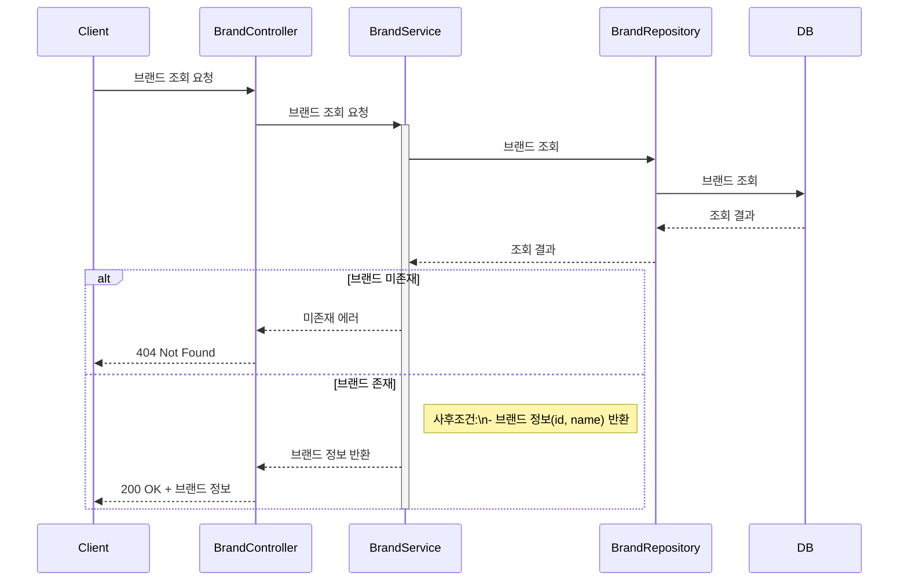
```mermaid
sequenceDiagram
    participant Client
    participant BrandController
    participant BrandService
    participant BrandRepository
    participant DB

    Client->>BrandController: 브랜드 조회 요청
    BrandController->>+BrandService: 브랜드 조회 요청

    BrandService->>BrandRepository: 브랜드 조회
    BrandRepository->>DB: 브랜드 조회
    DB-->>BrandRepository: 조회 결과
    BrandRepository-->>BrandService: 조회 결과

    alt 브랜드 미존재
        BrandService-->>BrandController: 미존재 에러
        BrandController-->>Client: 404 Not Found
    else 브랜드 존재
        Note right of BrandService: 사후조건:\n- 브랜드 정보(id, name) 반환
        BrandService-->>BrandController: 브랜드 정보 반환
        BrandController-->>Client: 200 OK + 브랜드 정보
    end
    deactivate BrandService
```

### 브랜드 목록 조회 (Admin)

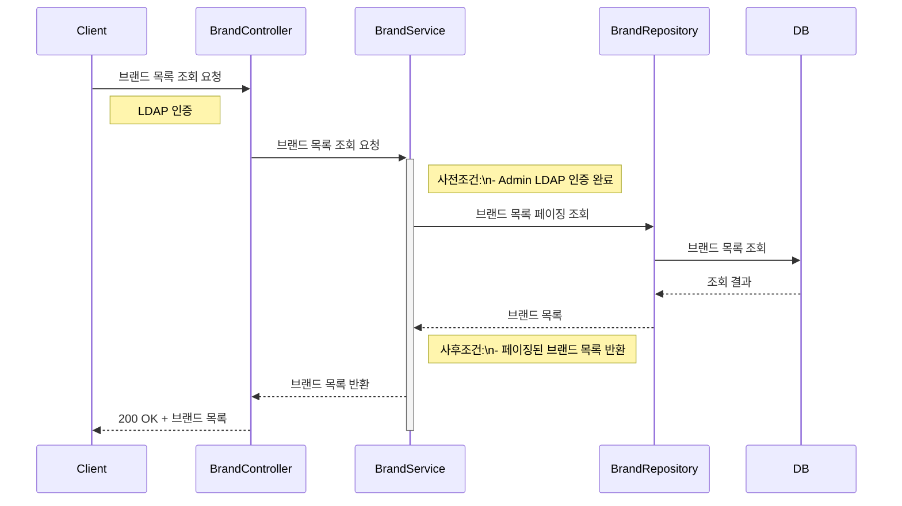
```mermaid
sequenceDiagram
    participant Client
    participant BrandController
    participant BrandService
    participant BrandRepository
    participant DB

    Client->>BrandController: 브랜드 목록 조회 요청
    Note right of Client: LDAP 인증
    BrandController->>+BrandService: 브랜드 목록 조회 요청

    Note right of BrandService: 사전조건:\n- Admin LDAP 인증 완료

    BrandService->>BrandRepository: 브랜드 목록 페이징 조회
    BrandRepository->>DB: 브랜드 목록 조회
    DB-->>BrandRepository: 조회 결과
    BrandRepository-->>BrandService: 브랜드 목록

    Note right of BrandService: 사후조건:\n- 페이징된 브랜드 목록 반환

    BrandService-->>BrandController: 브랜드 목록 반환
    BrandController-->>Client: 200 OK + 브랜드 목록
    deactivate BrandService
```

### 브랜드 상세 조회 (Admin)

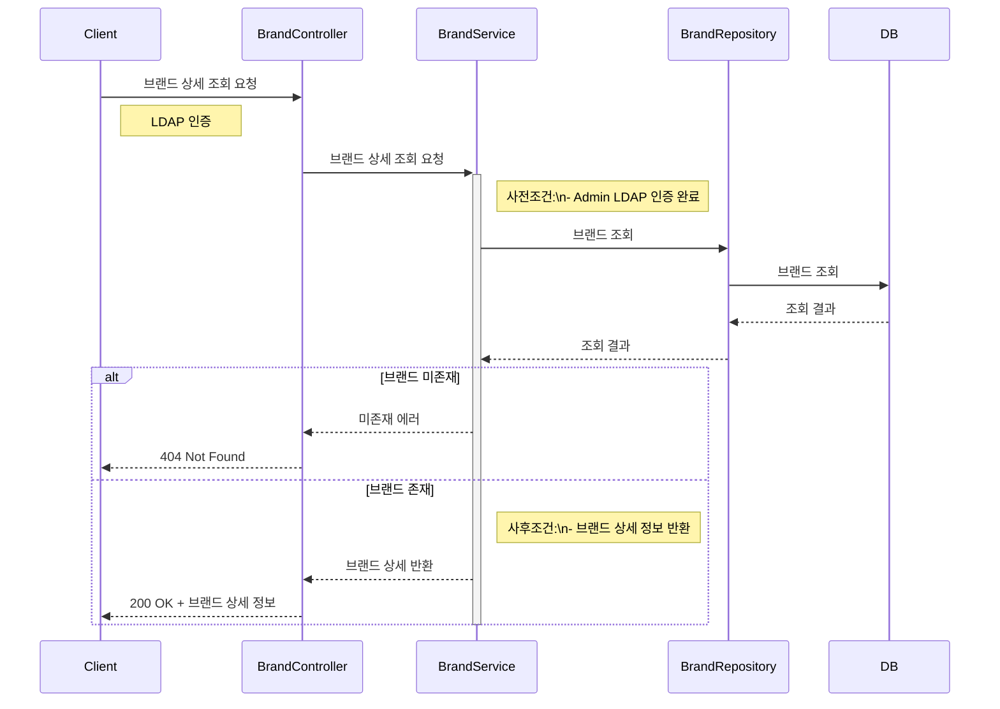
```mermaid
sequenceDiagram
    participant Client
    participant BrandController
    participant BrandService
    participant BrandRepository
    participant DB

    Client->>BrandController: 브랜드 상세 조회 요청
    Note right of Client: LDAP 인증
    BrandController->>+BrandService: 브랜드 상세 조회 요청

    Note right of BrandService: 사전조건:\n- Admin LDAP 인증 완료

    BrandService->>BrandRepository: 브랜드 조회
    BrandRepository->>DB: 브랜드 조회
    DB-->>BrandRepository: 조회 결과
    BrandRepository-->>BrandService: 조회 결과

    alt 브랜드 미존재
        BrandService-->>BrandController: 미존재 에러
        BrandController-->>Client: 404 Not Found
    else 브랜드 존재
        Note right of BrandService: 사후조건:\n- 브랜드 상세 정보 반환
        BrandService-->>BrandController: 브랜드 상세 반환
        BrandController-->>Client: 200 OK + 브랜드 상세 정보
    end
    deactivate BrandService
```

### UC-B02: 브랜드 등록 (Admin)

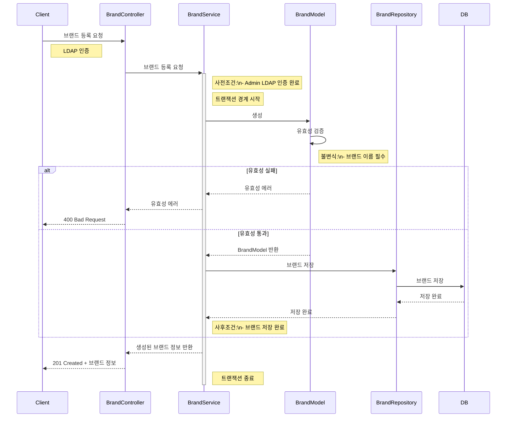
```mermaid
sequenceDiagram
    participant Client
    participant BrandController
    participant BrandService
    participant BrandModel
    participant BrandRepository
    participant DB

    Client->>BrandController: 브랜드 등록 요청
    Note right of Client: LDAP 인증
    BrandController->>+BrandService: 브랜드 등록 요청

    Note right of BrandService: 사전조건:\n- Admin LDAP 인증 완료
    Note right of BrandService: 트랜잭션 경계 시작

    BrandService->>BrandModel: 생성
    BrandModel->>BrandModel: 유효성 검증
    Note right of BrandModel: 불변식:\n- 브랜드 이름 필수

    alt 유효성 실패
        BrandModel-->>BrandService: 유효성 에러
        BrandService-->>BrandController: 유효성 에러
        BrandController-->>Client: 400 Bad Request
    else 유효성 통과
        BrandModel-->>BrandService: BrandModel 반환
        BrandService->>BrandRepository: 브랜드 저장
        BrandRepository->>DB: 브랜드 저장
        DB-->>BrandRepository: 저장 완료
        BrandRepository-->>BrandService: 저장 완료

        Note right of BrandService: 사후조건:\n- 브랜드 저장 완료
    end

    BrandService-->>BrandController: 생성된 브랜드 정보 반환
    BrandController-->>Client: 201 Created + 브랜드 정보

    Note right of BrandService: 트랜잭션 종료
    deactivate BrandService
```

### UC-B03: 브랜드 수정 (Admin)

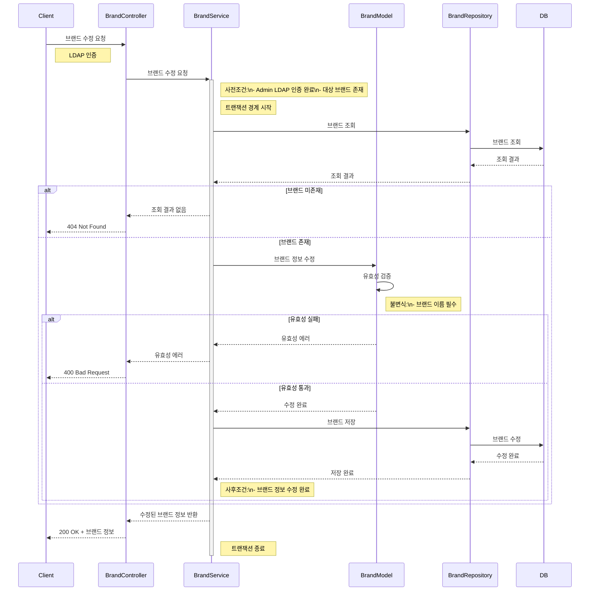
```mermaid
sequenceDiagram
    participant Client
    participant BrandController
    participant BrandService
    participant BrandModel
    participant BrandRepository
    participant DB

    Client->>BrandController: 브랜드 수정 요청
    Note right of Client: LDAP 인증
    BrandController->>+BrandService: 브랜드 수정 요청

    Note right of BrandService: 사전조건:\n- Admin LDAP 인증 완료\n- 대상 브랜드 존재
    Note right of BrandService: 트랜잭션 경계 시작

    BrandService->>BrandRepository: 브랜드 조회
    BrandRepository->>DB: 브랜드 조회
    DB-->>BrandRepository: 조회 결과
    BrandRepository-->>BrandService: 조회 결과

    alt 브랜드 미존재
        BrandService-->>BrandController: 조회 결과 없음
        BrandController-->>Client: 404 Not Found
    else 브랜드 존재
        BrandService->>BrandModel: 브랜드 정보 수정
        BrandModel->>BrandModel: 유효성 검증
        Note right of BrandModel: 불변식:\n- 브랜드 이름 필수

        alt 유효성 실패
            BrandModel-->>BrandService: 유효성 에러
            BrandService-->>BrandController: 유효성 에러
            BrandController-->>Client: 400 Bad Request
        else 유효성 통과
            BrandModel-->>BrandService: 수정 완료
            BrandService->>BrandRepository: 브랜드 저장
            BrandRepository->>DB: 브랜드 수정
            DB-->>BrandRepository: 수정 완료
            BrandRepository-->>BrandService: 저장 완료

            Note right of BrandService: 사후조건:\n- 브랜드 정보 수정 완료
        end
    end

    BrandService-->>BrandController: 수정된 브랜드 정보 반환
    BrandController-->>Client: 200 OK + 브랜드 정보

    Note right of BrandService: 트랜잭션 종료
    deactivate BrandService
```

### UC-B04: 브랜드 삭제 (Admin)

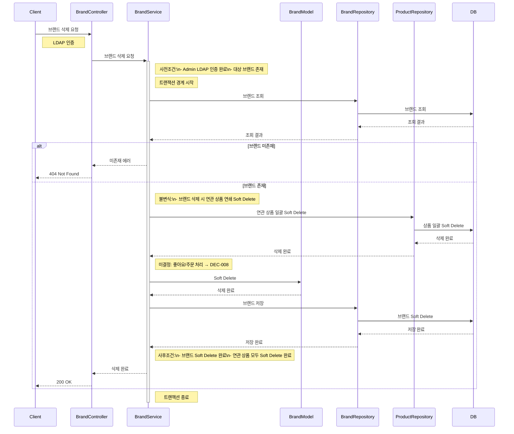
```mermaid
sequenceDiagram
    participant Client
    participant BrandController
    participant BrandService
    participant BrandModel
    participant BrandRepository
    participant ProductRepository
    participant DB

    Client->>BrandController: 브랜드 삭제 요청
    Note right of Client: LDAP 인증
    BrandController->>+BrandService: 브랜드 삭제 요청

    Note right of BrandService: 사전조건:\n- Admin LDAP 인증 완료\n- 대상 브랜드 존재
    Note right of BrandService: 트랜잭션 경계 시작

    BrandService->>BrandRepository: 브랜드 조회
    BrandRepository->>DB: 브랜드 조회
    DB-->>BrandRepository: 조회 결과
    BrandRepository-->>BrandService: 조회 결과

    alt 브랜드 미존재
        BrandService-->>BrandController: 미존재 에러
        BrandController-->>Client: 404 Not Found
    else 브랜드 존재
        Note right of BrandService: 불변식:\n- 브랜드 삭제 시 연관 상품 연쇄 Soft Delete

        BrandService->>ProductRepository: 연관 상품 일괄 Soft Delete
        ProductRepository->>DB: 상품 일괄 Soft Delete
        DB-->>ProductRepository: 삭제 완료
        ProductRepository-->>BrandService: 삭제 완료
        Note right of BrandService: 미결정: 좋아요/주문 처리 → DEC-008

        BrandService->>BrandModel: Soft Delete
        BrandModel-->>BrandService: 삭제 완료
        BrandService->>BrandRepository: 브랜드 저장
        BrandRepository->>DB: 브랜드 Soft Delete
        DB-->>BrandRepository: 저장 완료
        BrandRepository-->>BrandService: 저장 완료

        Note right of BrandService: 사후조건:\n- 브랜드 Soft Delete 완료\n- 연관 상품 모두 Soft Delete 완료

        BrandService-->>BrandController: 삭제 완료
        BrandController-->>Client: 200 OK
    end

    Note right of BrandService: 트랜잭션 종료
    deactivate BrandService
```

> **미결정**: 삭제된 상품의 좋아요/주문 처리 범위 → [DEC-008](decisions/DEC-008-brand-delete-cascading-scope.md)

---

## 2. 상품 (Products)

### UC-P01: 상품 목록 조회 (Customer)

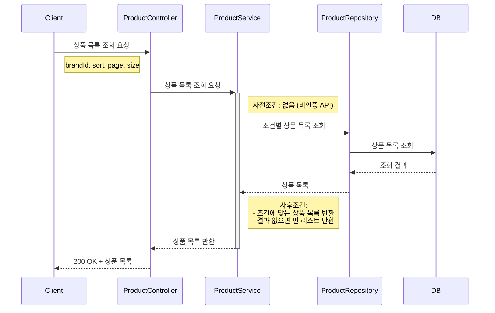
```mermaid
sequenceDiagram
    participant Client
    participant ProductController
    participant ProductService
    participant ProductRepository
    participant DB

    Client->>ProductController: 상품 목록 조회 요청
    Note right of Client: brandId, sort, page, size

    ProductController->>+ProductService: 상품 목록 조회 요청

    Note right of ProductService: 사전조건: 없음 (비인증 API)

    ProductService->>ProductRepository: 조건별 상품 목록 조회
    ProductRepository->>DB: 상품 목록 조회
    DB-->>ProductRepository: 조회 결과
    ProductRepository-->>ProductService: 상품 목록

    Note right of ProductService: 사후조건:<br/>- 조건에 맞는 상품 목록 반환<br/>- 결과 없으면 빈 리스트 반환

    ProductService-->>-ProductController: 상품 목록 반환
    ProductController-->>Client: 200 OK + 상품 목록
```

### UC-P02: 상품 상세 조회 (Customer)

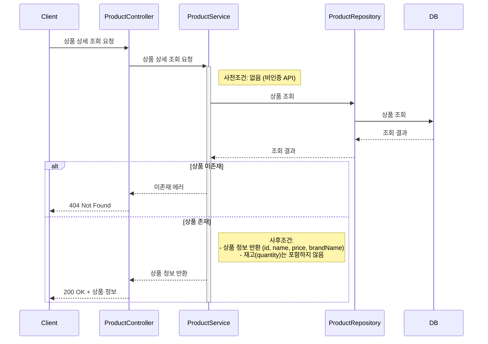
```mermaid
sequenceDiagram
    participant Client
    participant ProductController
    participant ProductService
    participant ProductRepository
    participant DB

    Client->>ProductController: 상품 상세 조회 요청
    ProductController->>+ProductService: 상품 상세 조회 요청

    Note right of ProductService: 사전조건: 없음 (비인증 API)

    ProductService->>ProductRepository: 상품 조회
    ProductRepository->>DB: 상품 조회
    DB-->>ProductRepository: 조회 결과
    ProductRepository-->>ProductService: 조회 결과

    alt 상품 미존재
        ProductService-->>ProductController: 미존재 에러
        ProductController-->>Client: 404 Not Found
    else 상품 존재
        Note right of ProductService: 사후조건:<br/>- 상품 정보 반환 (id, name, price, brandName)<br/>- 재고(quantity)는 포함하지 않음

        ProductService-->>ProductController: 상품 정보 반환
        ProductController-->>Client: 200 OK + 상품 정보
    end
    deactivate ProductService
```

### UC-P03: 상품 목록 조회 (Admin)

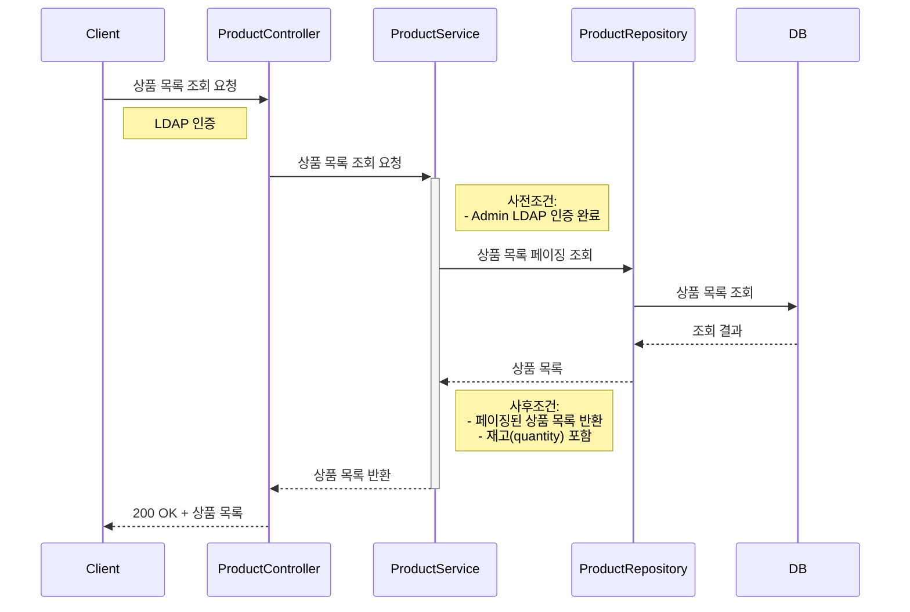
```mermaid
sequenceDiagram
    participant Client
    participant ProductController
    participant ProductService
    participant ProductRepository
    participant DB

    Client->>ProductController: 상품 목록 조회 요청
    Note right of Client: LDAP 인증

    ProductController->>+ProductService: 상품 목록 조회 요청

    Note right of ProductService: 사전조건:<br/>- Admin LDAP 인증 완료

    ProductService->>ProductRepository: 상품 목록 페이징 조회
    ProductRepository->>DB: 상품 목록 조회
    DB-->>ProductRepository: 조회 결과
    ProductRepository-->>ProductService: 상품 목록

    Note right of ProductService: 사후조건:<br/>- 페이징된 상품 목록 반환<br/>- 재고(quantity) 포함

    ProductService-->>-ProductController: 상품 목록 반환
    ProductController-->>Client: 200 OK + 상품 목록
```

### UC-P04: 상품 상세 조회 (Admin)

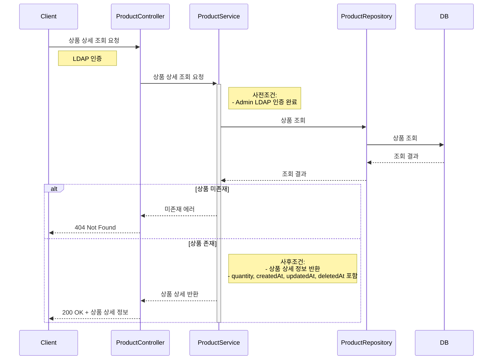
```mermaid
sequenceDiagram
    participant Client
    participant ProductController
    participant ProductService
    participant ProductRepository
    participant DB

    Client->>ProductController: 상품 상세 조회 요청
    Note right of Client: LDAP 인증

    ProductController->>+ProductService: 상품 상세 조회 요청

    Note right of ProductService: 사전조건:<br/>- Admin LDAP 인증 완료

    ProductService->>ProductRepository: 상품 조회
    ProductRepository->>DB: 상품 조회
    DB-->>ProductRepository: 조회 결과
    ProductRepository-->>ProductService: 조회 결과

    alt 상품 미존재
        ProductService-->>ProductController: 미존재 에러
        ProductController-->>Client: 404 Not Found
    else 상품 존재
        Note right of ProductService: 사후조건:<br/>- 상품 상세 정보 반환<br/>- quantity, createdAt, updatedAt, deletedAt 포함

        ProductService-->>ProductController: 상품 상세 반환
        ProductController-->>Client: 200 OK + 상품 상세 정보
    end
    deactivate ProductService
```

### UC-P05: 상품 등록 (Admin)

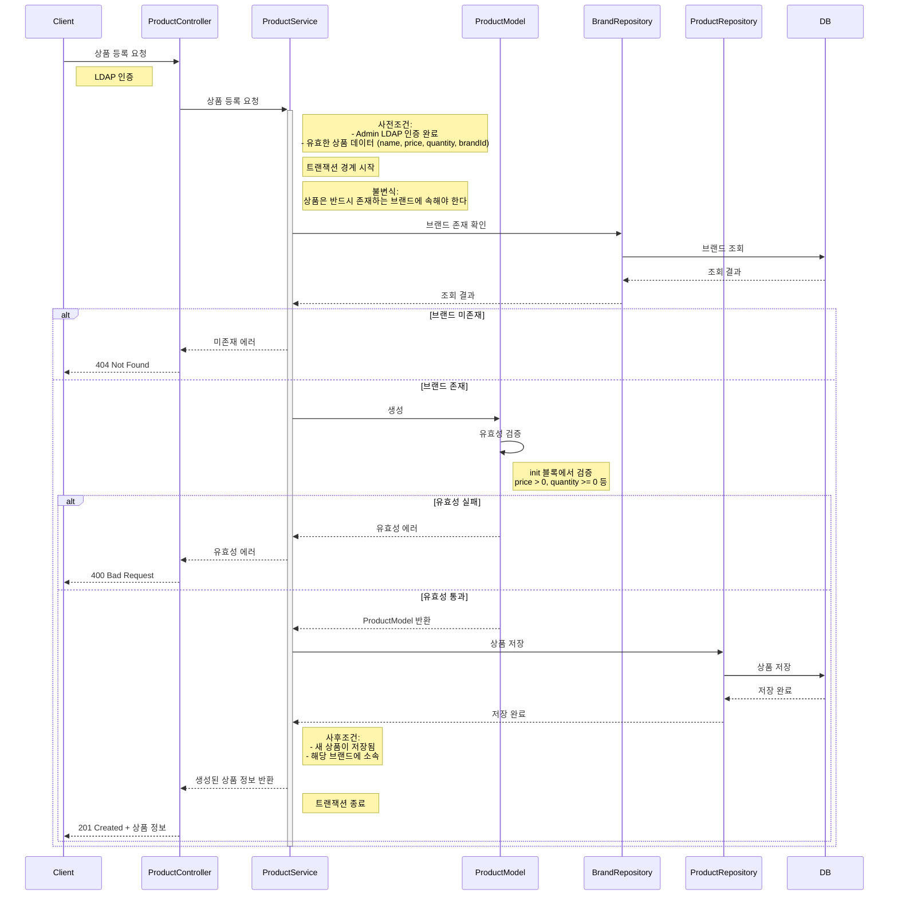
```mermaid
sequenceDiagram
    participant Client
    participant ProductController
    participant ProductService
    participant ProductModel
    participant BrandRepository
    participant ProductRepository
    participant DB

    Client->>ProductController: 상품 등록 요청
    Note right of Client: LDAP 인증
    ProductController->>+ProductService: 상품 등록 요청

    Note right of ProductService: 사전조건:<br/>- Admin LDAP 인증 완료<br/>- 유효한 상품 데이터 (name, price, quantity, brandId)
    Note right of ProductService: 트랜잭션 경계 시작

    Note right of ProductService: 불변식:<br/>상품은 반드시 존재하는 브랜드에 속해야 한다

    ProductService->>BrandRepository: 브랜드 존재 확인
    BrandRepository->>DB: 브랜드 조회
    DB-->>BrandRepository: 조회 결과
    BrandRepository-->>ProductService: 조회 결과

    alt 브랜드 미존재
        ProductService-->>ProductController: 미존재 에러
        ProductController-->>Client: 404 Not Found
    else 브랜드 존재
        ProductService->>ProductModel: 생성
        ProductModel->>ProductModel: 유효성 검증
        Note right of ProductModel: init 블록에서 검증<br/>price > 0, quantity >= 0 등

        alt 유효성 실패
            ProductModel-->>ProductService: 유효성 에러
            ProductService-->>ProductController: 유효성 에러
            ProductController-->>Client: 400 Bad Request
        else 유효성 통과
            ProductModel-->>ProductService: ProductModel 반환
            ProductService->>ProductRepository: 상품 저장
            ProductRepository->>DB: 상품 저장
            DB-->>ProductRepository: 저장 완료
            ProductRepository-->>ProductService: 저장 완료

            Note right of ProductService: 사후조건:<br/>- 새 상품이 저장됨<br/>- 해당 브랜드에 소속

            ProductService-->>ProductController: 생성된 상품 정보 반환
            Note right of ProductService: 트랜잭션 종료
            ProductController-->>Client: 201 Created + 상품 정보
        end
    end
    deactivate ProductService
```

### UC-P06: 상품 수정 (Admin)

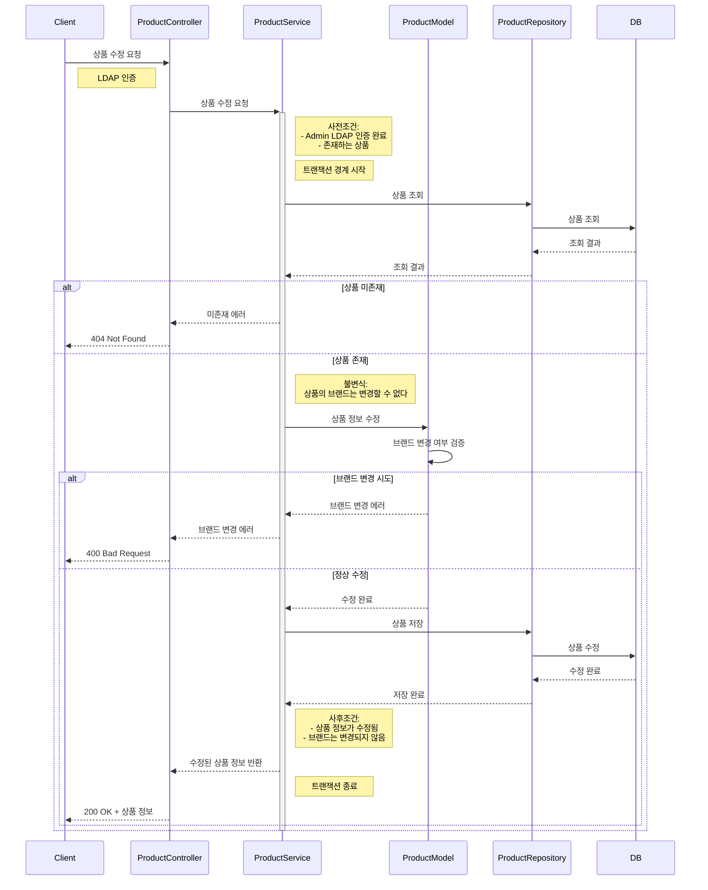
```mermaid
sequenceDiagram
    participant Client
    participant ProductController
    participant ProductService
    participant ProductModel
    participant ProductRepository
    participant DB

    Client->>ProductController: 상품 수정 요청
    Note right of Client: LDAP 인증
    ProductController->>+ProductService: 상품 수정 요청

    Note right of ProductService: 사전조건:<br/>- Admin LDAP 인증 완료<br/>- 존재하는 상품
    Note right of ProductService: 트랜잭션 경계 시작

    ProductService->>ProductRepository: 상품 조회
    ProductRepository->>DB: 상품 조회
    DB-->>ProductRepository: 조회 결과
    ProductRepository-->>ProductService: 조회 결과

    alt 상품 미존재
        ProductService-->>ProductController: 미존재 에러
        ProductController-->>Client: 404 Not Found
    else 상품 존재
        Note right of ProductService: 불변식:<br/>상품의 브랜드는 변경할 수 없다

        ProductService->>ProductModel: 상품 정보 수정
        ProductModel->>ProductModel: 브랜드 변경 여부 검증

        alt 브랜드 변경 시도
            ProductModel-->>ProductService: 브랜드 변경 에러
            ProductService-->>ProductController: 브랜드 변경 에러
            ProductController-->>Client: 400 Bad Request
        else 정상 수정
            ProductModel-->>ProductService: 수정 완료
            ProductService->>ProductRepository: 상품 저장
            ProductRepository->>DB: 상품 수정
            DB-->>ProductRepository: 수정 완료
            ProductRepository-->>ProductService: 저장 완료

            Note right of ProductService: 사후조건:<br/>- 상품 정보가 수정됨<br/>- 브랜드는 변경되지 않음

            ProductService-->>ProductController: 수정된 상품 정보 반환
            Note right of ProductService: 트랜잭션 종료
            ProductController-->>Client: 200 OK + 상품 정보
        end
    end
    deactivate ProductService
```

### UC-P07: 상품 삭제 (Admin)

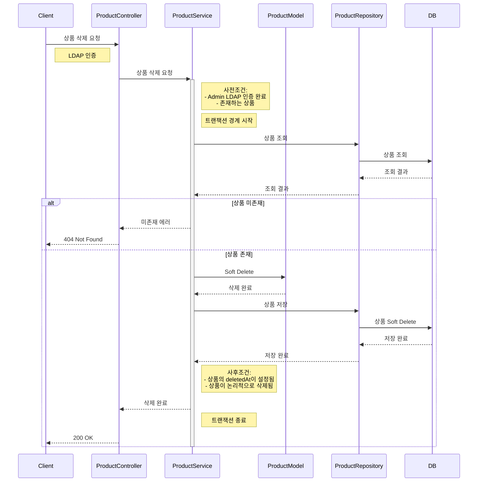
```mermaid
sequenceDiagram
    participant Client
    participant ProductController
    participant ProductService
    participant ProductModel
    participant ProductRepository
    participant DB

    Client->>ProductController: 상품 삭제 요청
    Note right of Client: LDAP 인증
    ProductController->>+ProductService: 상품 삭제 요청

    Note right of ProductService: 사전조건:<br/>- Admin LDAP 인증 완료<br/>- 존재하는 상품
    Note right of ProductService: 트랜잭션 경계 시작

    ProductService->>ProductRepository: 상품 조회
    ProductRepository->>DB: 상품 조회
    DB-->>ProductRepository: 조회 결과
    ProductRepository-->>ProductService: 조회 결과

    alt 상품 미존재
        ProductService-->>ProductController: 미존재 에러
        ProductController-->>Client: 404 Not Found
    else 상품 존재
        ProductService->>ProductModel: Soft Delete
        ProductModel-->>ProductService: 삭제 완료
        ProductService->>ProductRepository: 상품 저장
        ProductRepository->>DB: 상품 Soft Delete
        DB-->>ProductRepository: 저장 완료
        ProductRepository-->>ProductService: 저장 완료

        Note right of ProductService: 사후조건:<br/>- 상품의 deletedAt이 설정됨<br/>- 상품이 논리적으로 삭제됨

        ProductService-->>ProductController: 삭제 완료
        Note right of ProductService: 트랜잭션 종료
        ProductController-->>Client: 200 OK
    end
    deactivate ProductService
```

---

## 3. 좋아요 (Likes)

### UC-L01: 좋아요 등록

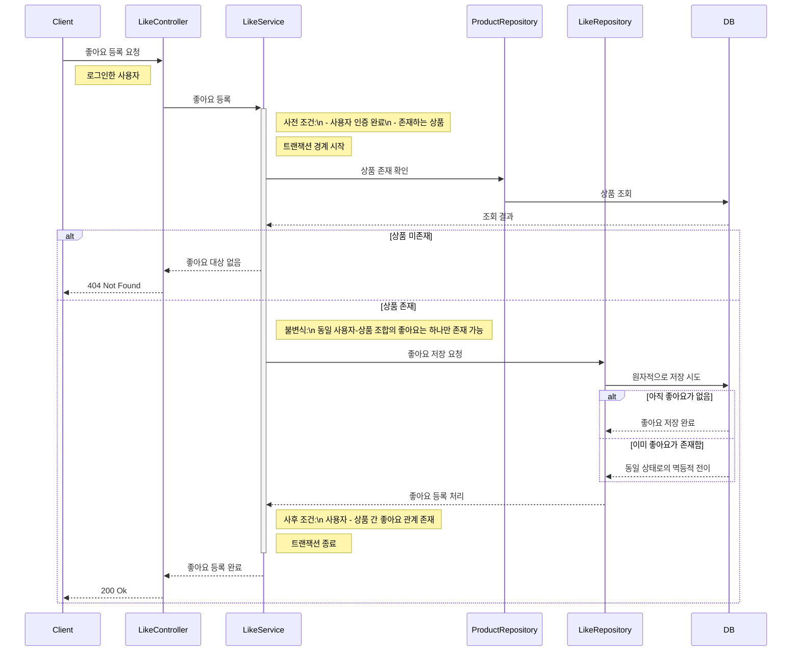
```mermaid
sequenceDiagram
    participant Client
    participant LikeController
    participant LikeService
    participant ProductRepository
    participant LikeRepository
    participant DB

    Client->>LikeController: 좋아요 등록 요청
    Note right of Client: 로그인한 사용자

    LikeController->>+LikeService: 좋아요 등록

    Note right of LikeService: 사전 조건:\n - 사용자 인증 완료\n - 존재하는 상품
    Note right of LikeService: 트랜잭션 경계 시작

    LikeService->>ProductRepository: 상품 존재 확인
    ProductRepository->>DB: 상품 조회
    DB-->>LikeService: 조회 결과

    alt 상품 미존재
        LikeService-->>LikeController: 좋아요 대상 없음
        LikeController-->>Client: 404 Not Found
    else 상품 존재
        Note right of LikeService: 불변식:\n 동일 사용자-상품 조합의 좋아요는 하나만 존재 가능

        LikeService->>LikeRepository: 좋아요 저장 요청
        LikeRepository->>DB: 원자적으로 저장 시도

    alt 아직 좋아요가 없음
        DB-->>LikeRepository: 좋아요 저장 완료
    else 이미 좋아요가 존재함
        DB-->>LikeRepository: 동일 상태로의 멱등적 전이
    end

    LikeRepository-->>LikeService: 좋아요 등록 처리

    Note right of LikeService: 사후 조건:\n 사용자 - 상품 간 좋아요 관계 존재
    Note right of LikeService: 트랜잭션 종료
    deactivate LikeService
LikeService-->>LikeController: 좋아요 등록 완료
        LikeController-->>Client: 200 Ok
end
```

> **미결정**: 이미 좋아요 상태일 때 처리 → [DEC-001](decisions/DEC-001-like-duplicate-request-policy.md)

### UC-L02: 좋아요 취소

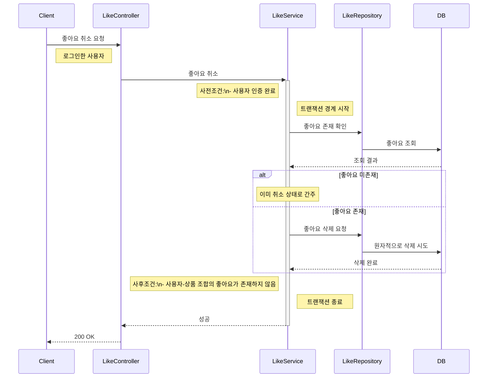
```mermaid
sequenceDiagram
    participant Client
    participant LikeController
    participant LikeService
    participant LikeRepository
    participant DB

    Client->>LikeController: 좋아요 취소 요청
    Note right of Client: 로그인한 사용자

    LikeController->>+LikeService: 좋아요 취소

    Note left of LikeService: 사전조건:\n- 사용자 인증 완료
    Note right of LikeService: 트랜잭션 경계 시작

    LikeService->>LikeRepository: 좋아요 존재 확인
    LikeRepository->>DB: 좋아요 조회
    DB-->>LikeService: 조회 결과 

    alt 좋아요 미존재
        Note over LikeService: 이미 취소 상태로 간주
    else 좋아요 존재
        LikeService->>LikeRepository: 좋아요 삭제 요청
        LikeRepository->>DB: 원자적으로 삭제 시도
        DB-->>LikeService: 삭제 완료
    end

    Note left of LikeService: 사후조건:\n- 사용자-상품 조합의 좋아요가 존재하지 않음

    Note right of LikeService: 트랜잭션 종료

    LikeService-->>-LikeController: 성공
    LikeController-->>Client: 200 OK
```

> **미결정**: 삭제 전략 (Soft Delete vs Hard Delete) → [DEC-002](decisions/DEC-002-like-delete-strategy.md)

### UC-L03: 좋아요 목록

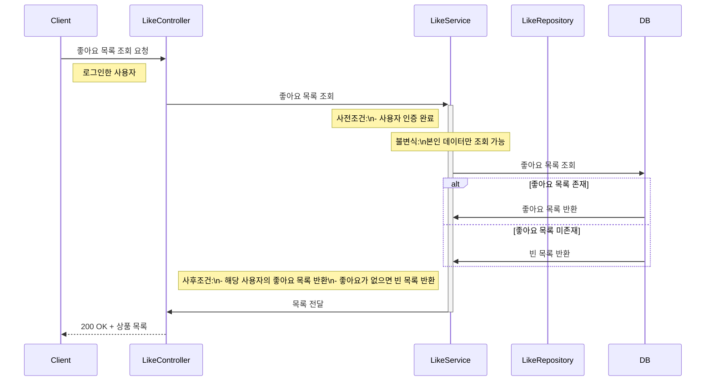
```mermaid
sequenceDiagram
    participant Client
    participant LikeController
    participant LikeService
    participant LikeRepository
    participant DB

    Client->>LikeController: 좋아요 목록 조회 요청
    Note right of Client: 로그인한 사용자

    LikeController->>+LikeService: 좋아요 목록 조회

    Note left of LikeService: 사전조건:\n- 사용자 인증 완료
    Note over LikeService: 불변식:\n본인 데이터만 조회 가능

    LikeService->>DB: 좋아요 목록 조회
    alt 좋아요 목록 존재
        DB->>LikeService: 좋아요 목록 반환
    else 좋아요 목록 미존재
        DB->>LikeService: 빈 목록 반환
    end

    Note left of LikeService: 사후조건:\n- 해당 사용자의 좋아요 목록 반환\n- 좋아요가 없으면 빈 목록 반환

    LikeService->>-LikeController: 목록 전달
    LikeController-->>Client: 200 OK + 상품 목록
```

> 좋아요 없음 시 빈 리스트 반환

---

## 4. 주문 (Orders)

### UC-O01: 주문 요청

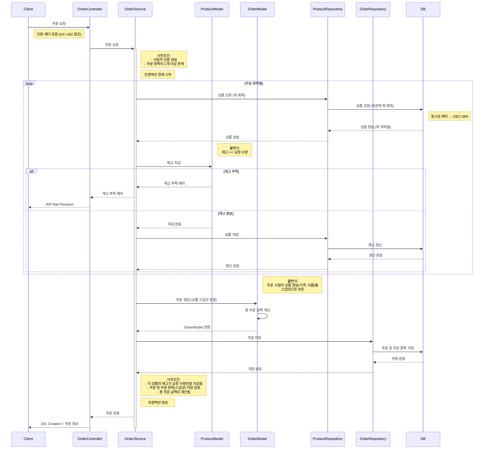
```mermaid
sequenceDiagram
    participant Client
    participant OrderController
    participant OrderService
    participant ProductModel
    participant OrderModel
    participant ProductRepository
    participant OrderRepository
    participant DB

    Client->>OrderController: 주문 요청
    Note right of Client: 인증 헤더 포함 (UC-U02 참조)
    OrderController->>+OrderService: 주문 요청

    Note right of OrderService: 사전조건:<br/>- 사용자 인증 완료<br/>- 주문 항목이 1개 이상 존재
    Note right of OrderService: 트랜잭션 경계 시작

    loop 주문 항목별
        OrderService->>ProductRepository: 상품 조회 (락 획득)
        ProductRepository->>DB: 상품 조회 (비관적 락 획득)
        Note right of DB: 동시성 제어 → DEC-004
        DB-->>ProductRepository: 상품 정보 (락 획득됨)
        ProductRepository-->>OrderService: 상품 정보

        Note right of ProductModel: 불변식:<br/>재고 >= 요청 수량
        OrderService->>ProductModel: 재고 차감
        alt 재고 부족
            ProductModel-->>OrderService: 재고 부족 에러
            OrderService-->>OrderController: 재고 부족 에러
            OrderController-->>Client: 400 Bad Request
        else 재고 충분
            ProductModel-->>OrderService: 차감 완료
            OrderService->>ProductRepository: 상품 저장
            ProductRepository->>DB: 재고 갱신
            DB-->>ProductRepository: 갱신 완료
            ProductRepository-->>OrderService: 갱신 완료
        end
    end

    Note right of OrderModel: 불변식:<br/>주문 시점의 상품 정보(가격, 이름)를<br/>스냅샷으로 보존
    OrderService->>OrderModel: 주문 생성 (상품 스냅샷 포함)
    OrderModel->>OrderModel: 총 주문 금액 계산
    OrderModel-->>OrderService: OrderModel 반환

    OrderService->>OrderRepository: 주문 저장
    OrderRepository->>DB: 주문 및 주문 항목 저장
    DB-->>OrderRepository: 저장 완료
    OrderRepository-->>OrderService: 저장 완료

    Note right of OrderService: 사후조건:<br/>- 각 상품의 재고가 요청 수량만큼 차감됨<br/>- 주문 및 주문 항목(스냅샷) 저장 완료<br/>- 총 주문 금액이 계산됨
    Note right of OrderService: 트랜잭션 종료

    OrderService-->>OrderController: 주문 완료
    OrderController-->>Client: 201 Created + 주문 정보
    deactivate OrderService
```

> **실패**: 상세 검증 흐름은 아래 [주문 검증 플로우차트](#uc-o01-주문-검증-플로우차트) 참조
>
> **미결정**: 동시성 제어 전략 → [DEC-004](decisions/DEC-004-concurrent-order-stock-control.md) · 멱등성 → [DEC-005](decisions/DEC-005-order-idempotency.md)

#### UC-O01: 주문 검증 플로우차트

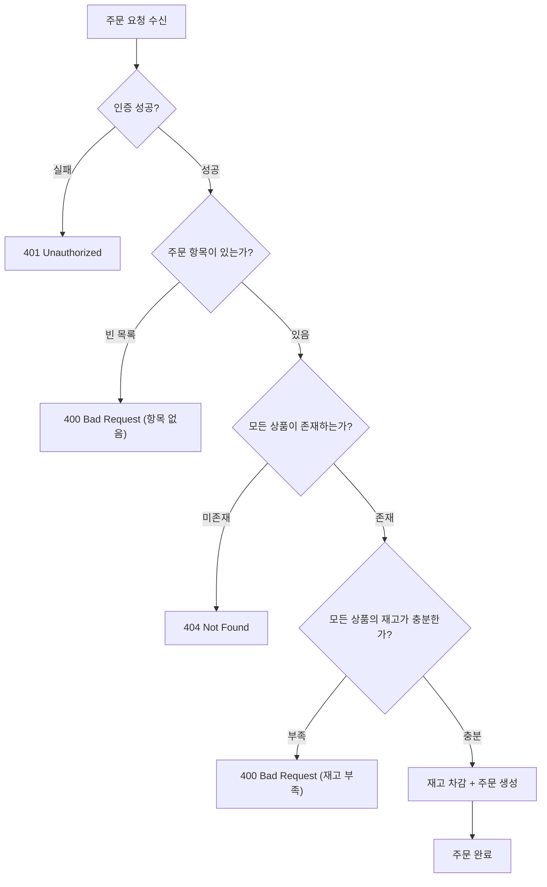
```mermaid
flowchart TD
    A[주문 요청 수신] --> B{인증 성공?}
    B -->|실패| C[401 Unauthorized]
    B -->|성공| D{주문 항목이 있는가?}
    D -->|빈 목록| E["400 Bad Request (항목 없음)"]
    D -->|있음| F{모든 상품이 존재하는가?}
    F -->|미존재| G[404 Not Found]
    F -->|존재| H{모든 상품의 재고가 충분한가?}
    H -->|부족| I["400 Bad Request (재고 부족)"]
    H -->|충분| J[재고 차감 + 주문 생성]
    J --> K[주문 완료]
```

### UC-O02: 주문 목록 조회 (Customer)

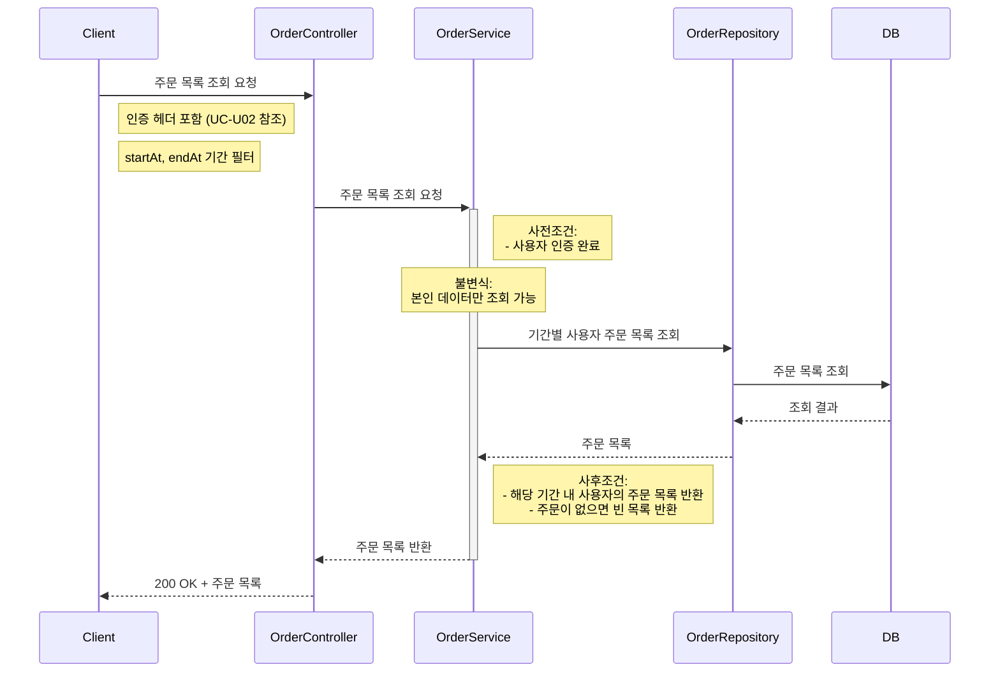
```mermaid
sequenceDiagram
    participant Client
    participant OrderController
    participant OrderService
    participant OrderRepository
    participant DB

    Client->>OrderController: 주문 목록 조회 요청
    Note right of Client: 인증 헤더 포함 (UC-U02 참조)
    Note right of Client: startAt, endAt 기간 필터
    OrderController->>+OrderService: 주문 목록 조회 요청

    Note right of OrderService: 사전조건:<br/>- 사용자 인증 완료
    Note over OrderService: 불변식:<br/>본인 데이터만 조회 가능

    OrderService->>OrderRepository: 기간별 사용자 주문 목록 조회
    OrderRepository->>DB: 주문 목록 조회
    DB-->>OrderRepository: 조회 결과
    OrderRepository-->>OrderService: 주문 목록

    Note right of OrderService: 사후조건:<br/>- 해당 기간 내 사용자의 주문 목록 반환<br/>- 주문이 없으면 빈 목록 반환

    OrderService-->>-OrderController: 주문 목록 반환
    OrderController-->>Client: 200 OK + 주문 목록
```

### UC-O03: 주문 상세 조회 (Customer)

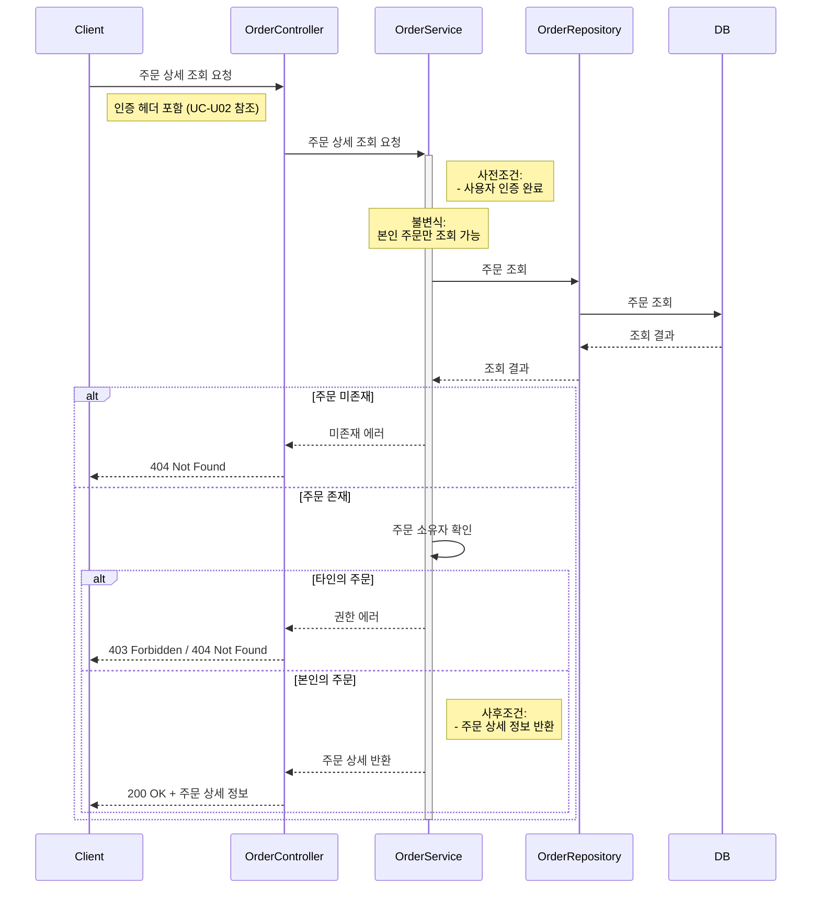
```mermaid
sequenceDiagram
    participant Client
    participant OrderController
    participant OrderService
    participant OrderRepository
    participant DB

    Client->>OrderController: 주문 상세 조회 요청
    Note right of Client: 인증 헤더 포함 (UC-U02 참조)
    OrderController->>+OrderService: 주문 상세 조회 요청

    Note right of OrderService: 사전조건:<br/>- 사용자 인증 완료
    Note over OrderService: 불변식:<br/>본인 주문만 조회 가능

    OrderService->>OrderRepository: 주문 조회
    OrderRepository->>DB: 주문 조회
    DB-->>OrderRepository: 조회 결과
    OrderRepository-->>OrderService: 조회 결과

    alt 주문 미존재
        OrderService-->>OrderController: 미존재 에러
        OrderController-->>Client: 404 Not Found
    else 주문 존재
        OrderService->>OrderService: 주문 소유자 확인
        alt 타인의 주문
            OrderService-->>OrderController: 권한 에러
            OrderController-->>Client: 403 Forbidden / 404 Not Found
        else 본인의 주문
            Note right of OrderService: 사후조건:<br/>- 주문 상세 정보 반환
            OrderService-->>OrderController: 주문 상세 반환
            OrderController-->>Client: 200 OK + 주문 상세 정보
        end
    end
    deactivate OrderService
```

> **미결정**: 타인 주문 조회 시 응답 코드 → [DEC-003](decisions/DEC-003-order-other-user-response-code.md)

### UC-O04: 전체 주문 목록 조회 (Admin)

```mermaid
sequenceDiagram
    participant Client
    participant OrderController
    participant OrderService
    participant OrderRepository
    participant DB

    Client->>OrderController: 전체 주문 목록 조회 요청
    Note right of Client: LDAP 인증
    OrderController->>+OrderService: 전체 주문 목록 조회 요청

    Note right of OrderService: 사전조건:<br/>- LDAP 인증 완료

    OrderService->>OrderRepository: 전체 주문 목록 페이징 조회
    OrderRepository->>DB: 주문 목록 조회
    DB-->>OrderRepository: 조회 결과
    OrderRepository-->>OrderService: 주문 목록

    Note right of OrderService: 사후조건:<br/>- 전체 주문 목록 반환 (페이징)

    OrderService-->>-OrderController: 주문 목록 반환
    OrderController-->>Client: 200 OK + 주문 목록
```

### UC-O05: 주문 상세 조회 (Admin)

```mermaid
sequenceDiagram
    participant Client
    participant OrderController
    participant OrderService
    participant OrderRepository
    participant DB

    Client->>OrderController: 주문 상세 조회 요청
    Note right of Client: LDAP 인증
    OrderController->>+OrderService: 주문 상세 조회 요청

    Note right of OrderService: 사전조건:<br/>- LDAP 인증 완료

    OrderService->>OrderRepository: 주문 조회
    OrderRepository->>DB: 주문 조회
    DB-->>OrderRepository: 조회 결과
    OrderRepository-->>OrderService: 조회 결과

    alt 주문 미존재
        OrderService-->>OrderController: 미존재 에러
        OrderController-->>Client: 404 Not Found
    else 주문 존재
        Note right of OrderService: 사후조건:<br/>- 주문 상세 정보 반환 (user 정보 포함)
        OrderService-->>OrderController: 주문 상세 반환
        OrderController-->>Client: 200 OK + 주문 상세 정보
    end
    deactivate OrderService
```
