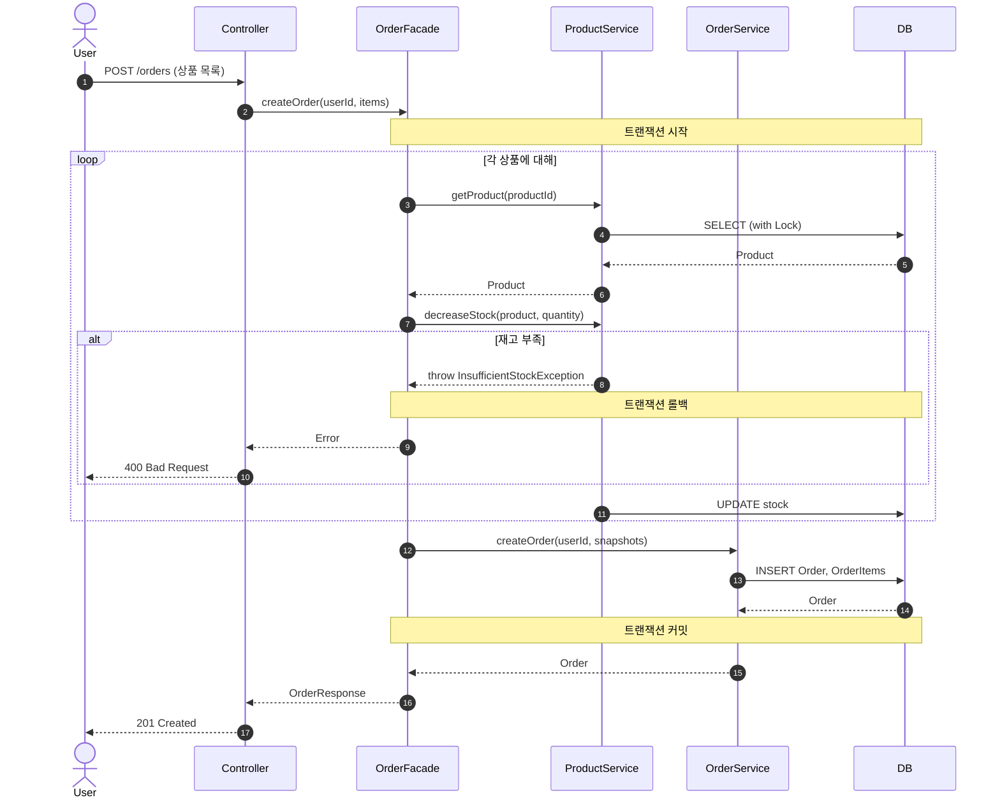
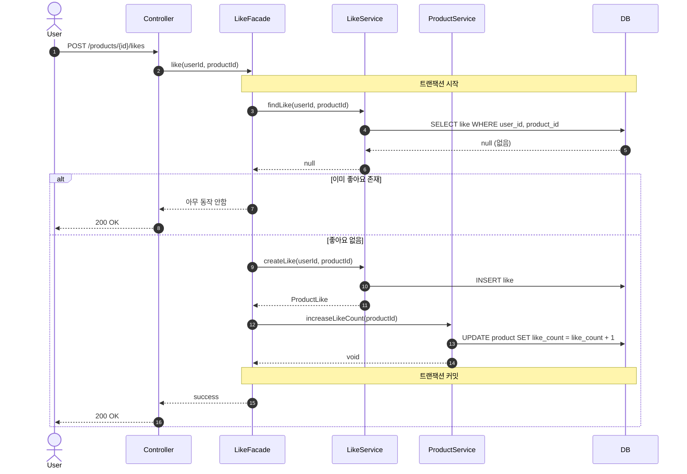

# 시퀀스 다이어그램

## 주문 요청

**왜 필요한가**: 재고 확인 → 차감 → 주문 생성이 하나의 트랜잭션 안에서 처리되는지, 실패 시 롤백 범위를 확인하기 위함입니다.

**해석 포인트**:
- 재고 조회 시 `SELECT ... FOR UPDATE` (비관적 락) 사용 → 동시 주문 시 재고 정합성 보장
- 하나라도 재고 부족이면 전체 롤백 (All or Nothing)
- OrderItem 생성 시 Product의 현재 name, price를 스냅샷으로 복사

---

## 좋아요 등록

**왜 필요한가**: 좋아요 존재 여부 확인 → 저장 → likeCount 증가가 원자적으로 처리되는지 확인하기 위함입니다. LikeFacade가 LikeService와 ProductService를 조율하여 서비스 간 직접 의존을 제거합니다.

**해석 포인트**:
- `LikeFacade`가 `LikeService`와 `ProductService`를 각각 호출 → 서비스 간 직접 의존 제거
- `LikeService`는 좋아요 데이터 관리만 담당, `ProductService`는 상품 데이터 관리만 담당 → 단일 책임 원칙
- `like_count + 1` 방식으로 UPDATE → 조회-증가-저장 패턴보다 동시성에 안전
- 이미 좋아요가 있으면 멱등하게 처리 (에러 아님)
