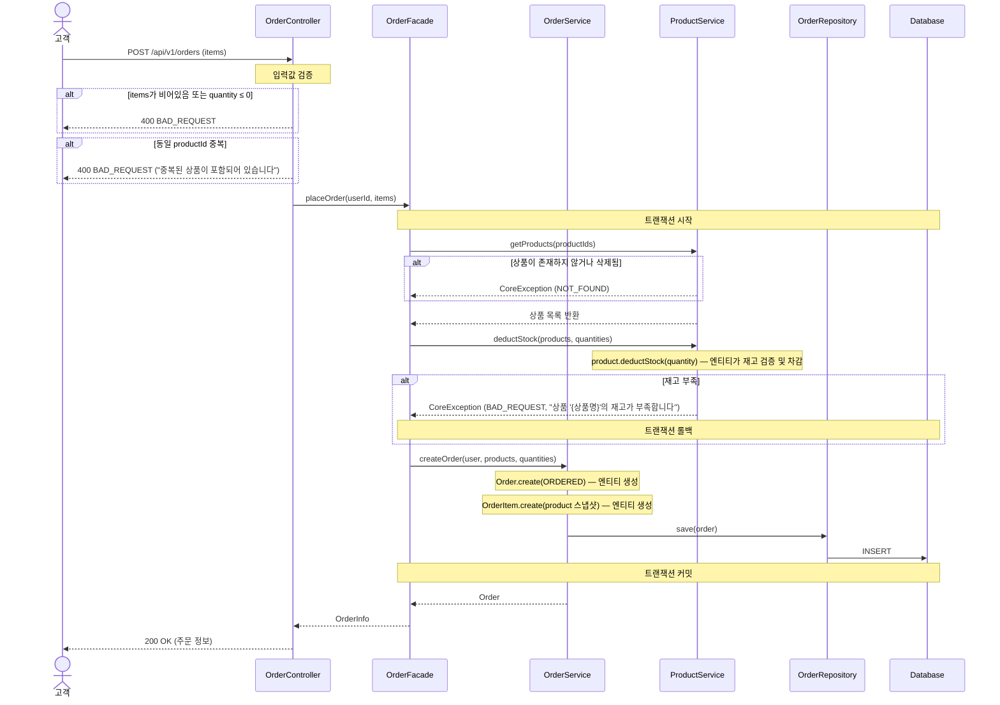
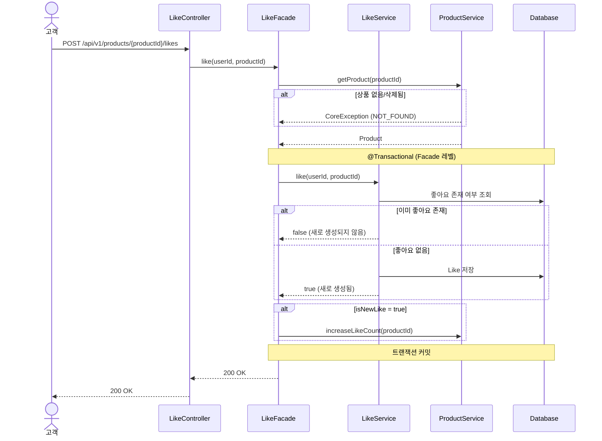
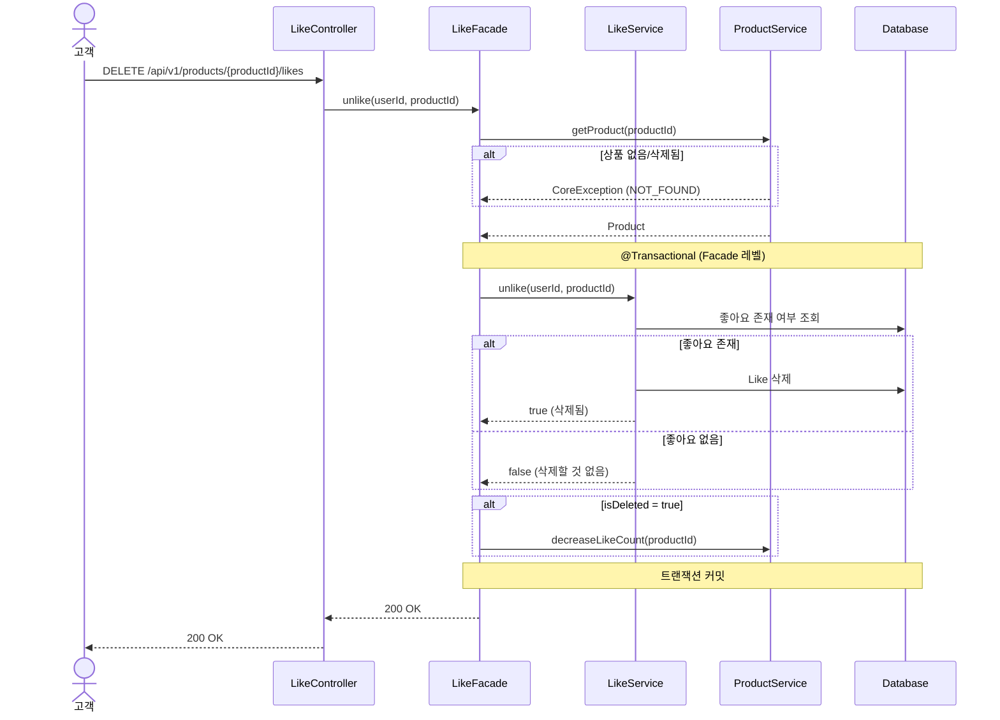
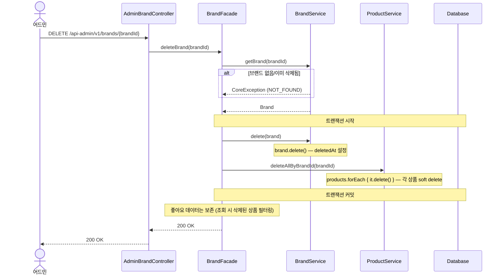
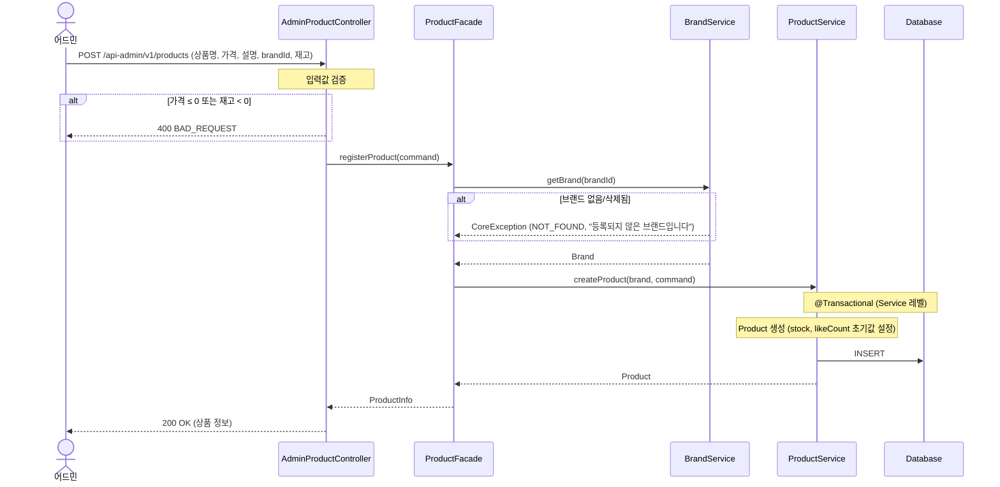
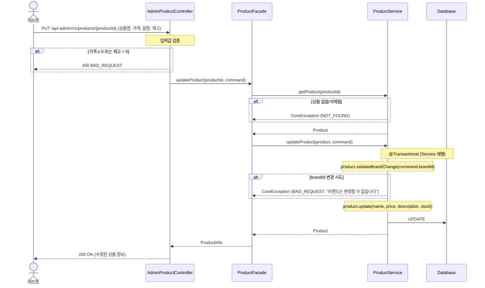
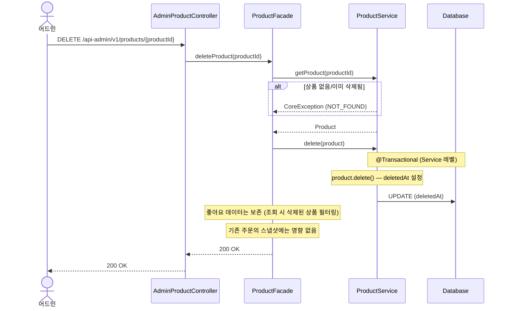
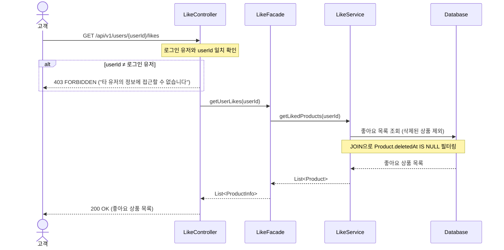

# 시퀀스 다이어그램

## 1. 주문 요청

> **왜 필요한가?** 주문 요청은 이 시스템에서 가장 복잡한 흐름이다. 재고 확인 → 차감 → 주문 생성 → 스냅샷 저장이 하나의 트랜잭션 안에서 이뤄져야 하므로, **호출 순서와 트랜잭션 경계**를 명확히 해야 한다.

**봐야 할 포인트:**
- **입력값 검증은 Controller에서 선행한다.** items 비어있음, quantity ≤ 0, productId 중복은 트랜잭션 진입 전에 차단된다.
- **Facade가 오케스트레이션을 담당한다.** ProductService와 OrderService를 조합하는 책임이 Facade에 있다.
- **존재 확인은 ProductService의 책임이다.** 상품이 없거나 삭제된 경우 ProductService가 CoreException(NOT_FOUND)을 throw한다.
- **재고 차감은 ProductService → Product 엔티티의 책임이다.** `product.deductStock(quantity)`로 엔티티가 재고 검증과 차감을 수행한다. OrderService는 주문 생성만 담당한다.
- **트랜잭션 경계는 Facade 레벨이다.** 재고 차감과 주문 생성이 하나의 트랜잭션으로 묶인다.

---

## 2. 좋아요 등록 (멱등)

> **왜 필요한가?** 멱등 처리의 흐름을 명확히 하기 위해서다. "이미 존재하면 무시"라는 로직이 어느 레이어에서 판단되는지 확인한다.

**봐야 할 포인트:**
- **트랜잭션 경계는 Facade 레벨이다.** LikeService(Like 저장)와 ProductService(likeCount 증가)의 쓰기가 하나의 트랜잭션으로 묶여야 한다.
- **Facade가 오케스트레이션한다.** LikeService는 멱등 판단 결과(boolean)를 반환하고, Facade가 조건부로 ProductService를 호출한다. 다른 다이어그램과 일관된 구조다.
- **LikeService와 ProductService는 서로 독립적이다.** Service 간 직접 의존 없이, Facade를 통해서만 조합된다.

---

## 3. 좋아요 취소 (멱등)

> **왜 필요한가?** 좋아요 등록의 역방향 흐름이다. "없으면 무시"라는 멱등 로직이 등록과 대칭적으로 동작하는지, **likeCount 감소 시점이 정확한지** 확인한다.

**봐야 할 포인트:**
- **트랜잭션 경계는 Facade 레벨이다.** 등록과 동일하게, LikeService(Like 삭제)와 ProductService(likeCount 감소)의 쓰기가 하나의 트랜잭션으로 묶인다.
- **등록과 대칭 구조다.** LikeService가 멱등 판단 결과(boolean)를 반환하고, Facade가 조건부로 ProductService를 호출하는 패턴이 등록과 미러링된다.
- **likeCount 감소는 좋아요가 실제로 존재했을 때만 발생한다.** 없는 좋아요를 취소해도 카운트가 음수로 빠지지 않는다.

---

## 4. 브랜드 삭제 (연쇄 삭제)

> **왜 필요한가?** 브랜드 삭제 시 **소속 상품이 연쇄로 soft delete**되는 흐름이다. 삭제 범위와 좋아요 데이터 보존 정책을 확인해야 한다.

**봐야 할 포인트:**
- **삭제 범위는 브랜드 + 소속 상품까지다.** 좋아요 데이터는 삭제하지 않고 보존한다.
- **좋아요 정합성은 조회 시점에 처리한다.** 삭제된 상품의 좋아요는 목록 조회 시 필터링으로 제외된다.
- **트랜잭션 경계는 Facade다.** 브랜드 삭제와 상품 연쇄 삭제가 하나의 트랜잭션으로 묶여, 하나라도 실패하면 전체 롤백된다.
- **이미 주문된 상품의 스냅샷에는 영향 없다.** OrderItem에 저장된 스냅샷은 독립적이다.

---

## 5. 상품 등록 (어드민)

> **왜 필요한가?** 상품은 반드시 브랜드에 속해야 한다. **브랜드 존재 검증이 어느 레이어에서 발생하는지**, Facade의 오케스트레이션 역할을 확인한다.

**봐야 할 포인트:**
- **트랜잭션 경계는 Service 레벨이다.** 쓰기는 ProductService에서만 발생하므로, Facade까지 트랜잭션을 확장할 필요가 없다. 브랜드 검증은 읽기 전용이다.
- **브랜드 검증은 Facade에서 수행한다.** ProductService는 상품 생성에만 집중하고, 브랜드 존재 여부는 Facade가 BrandService를 통해 확인한다.
- **입력값 검증(가격, 재고)은 Controller에서 선행한다.** 비즈니스 규칙 이전에 형식 검증을 먼저 차단한다.
- **ProductService는 Brand 객체를 받아 상품을 생성한다.** brandId가 아닌 Brand 엔티티를 전달받으므로, 브랜드 정보가 이미 검증된 상태임이 보장된다.

---

## 6. 상품 수정 (어드민)

> **왜 필요한가?** 상품 수정 시 **brandId는 변경할 수 없다**는 비즈니스 규칙이 있다. 이 제약이 어느 레이어에서 검증되는지, 입력값 검증과 비즈니스 규칙 검증이 어떻게 분리되는지 확인한다.

**봐야 할 포인트:**
- **트랜잭션 경계는 Service 레벨이다.** 쓰기는 ProductService에서만 발생하므로, Facade까지 트랜잭션을 확장할 필요가 없다.
- **존재 확인은 ProductService의 책임이다.** 상품이 없거나 삭제된 경우 ProductService가 CoreException(NOT_FOUND)을 throw한다.
- **brandId 변경 불가 제약은 Product 엔티티의 도메인 메서드 책임이다.** `product.validateBrandChange(brandId)`로 엔티티가 자신의 불변 규칙을 검증하며, 이 검증은 ProductService.updateProduct() 내부에서 수행된다.
- **상품 수정도 엔티티의 도메인 메서드 책임이다.** `product.update(name, price, description, stock)`로 엔티티가 자신의 상태를 변경한다.
- **입력값 검증(가격, 재고)은 Controller에서 선행한다.** 형식 검증과 비즈니스 규칙 검증이 레이어별로 분리되어 있다.

---

## 7. 상품 삭제 (어드민)

> **왜 필요한가?** 브랜드 삭제(4번)와 비교했을 때, 상품 삭제는 **연쇄 삭제 없이 단독 soft delete**된다. 두 삭제 흐름의 차이와 좋아요 데이터 보존 정책이 동일한지 확인한다.

**봐야 할 포인트:**
- **트랜잭션 경계는 Service 레벨이다.** 쓰기는 ProductService에서만 발생하므로, 브랜드 삭제(4번)와 달리 Facade 트랜잭션이 불필요하다.
- **존재 확인은 ProductService의 책임이다.** 상품이 없거나 이미 삭제된 경우 ProductService가 CoreException(NOT_FOUND)을 throw한다.
- **브랜드 삭제와 달리 연쇄 삭제가 없다.** 상품만 soft delete되고, 다른 엔티티에 대한 추가 삭제는 발생하지 않는다.
- **좋아요 보존 정책은 브랜드 삭제와 동일하다.** 좋아요는 유지하고, 좋아요 목록 조회 시 삭제된 상품을 필터링한다.
- **OrderItem 스냅샷은 독립적이다.** 상품이 삭제되어도 기존 주문 이력에는 영향이 없다.

---

## 8. 좋아요 목록 조회

> **왜 필요한가?** 좋아요 목록 조회는 **권한 확인(userId 일치)**과 **삭제된 상품 필터링**이라는 두 가지 횡단 관심사가 있다. 각 로직이 어느 레이어에서 처리되는지 확인한다.

**봐야 할 포인트:**
- **권한 확인은 Controller에서 수행한다.** URI의 userId와 로그인 유저의 일치 여부를 진입 시점에서 검증한다.
- **삭제된 상품 필터링은 쿼리 레벨에서 처리한다.** Like 테이블과 Product 테이블을 JOIN할 때 `deletedAt IS NULL` 조건으로 필터링한다.
- **삭제된 상품의 좋아요 데이터 자체는 보존된다.** 조회 시점에만 필터링하므로, 상품이 복구되면 좋아요도 다시 노출된다.
